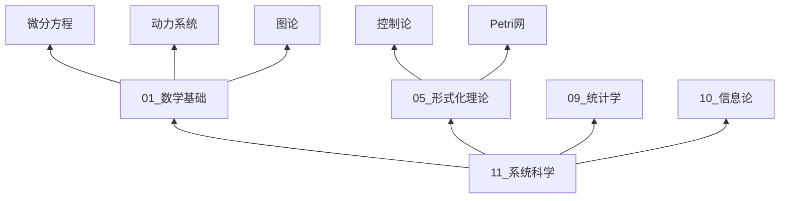
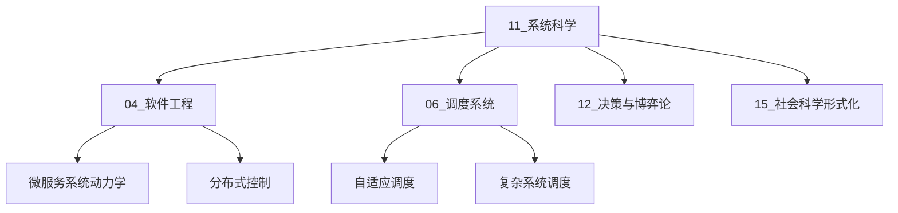

# 11 系统科学模块

> **模块编号**: 11
> **模块名称**: 系统科学 (Systems Science)
> **创建日期**: 2026-04-12
> **版本**: v1.0
> **状态**: 已完成

---

## 1. 模块概述

### 1.1 系统科学的定义

系统科学是研究系统的一般模式、结构和规律的学科，它跨越自然科学与社会科学的界限，为理解和设计复杂系统提供统一的方法论框架。

**定义 1.1**（系统科学）：系统科学是跨学科的科学领域，研究系统的复杂性、涌现性、自组织和适应性，以及系统与环境之间的相互作用。

### 1.2 核心研究领域

| 领域 | 核心问题 | 主要方法 | 典型应用 |
|------|----------|----------|----------|
| **一般系统论** | 系统的本质、边界、层次 | 同构映射、层次分解 | 组织管理、生态系统 |
| **控制论** | 反馈、稳定性、最优控制 | 状态空间、传递函数 | 自动化、机器人 |
| **复杂系统** | 涌现、混沌、相变 | 非线性动力学、统计物理 | 气候、经济、生物 |
| **自组织理论** | 耗散结构、协同 | 非平衡热力学 | 化学反应、社会演化 |
| **网络科学** | 连接模式、传播动力学 | 图论、随机过程 | 互联网、社交网络 |
| **系统动力学** | 存量流量、反馈回路 | 微分方程、仿真 | 政策分析、供应链管理 |

### 1.3 形式化框架

系统科学的数学基础建立在以下核心形式化框架之上：

$$
\mathcal{S} = (E, R, \mathcal{B}, \mathcal{D}, \mathcal{O})
$$

其中：

- $E$：元素集合 (Elements)
- $R$：关系集合 (Relations)
- $\mathcal{B}$：边界 (Boundary)
- $\mathcal{D}$：动力学 (Dynamics)
- $\mathcal{O}$：目标/优化准则 (Objective)

---

## 2. 文档结构

```
docs/Refactor/11_系统科学/
├── README.md                    # 本文件：模块概述
├── 00_目录与导航.md             # 完整目录树与导航
├── 01_一般系统论.md             # 系统定义、涌现性、层次性
├── 02_控制论.md                 # 反馈控制、系统稳定性、最优控制
├── 03_复杂系统.md               # 复杂性度量、混沌理论、分形
├── 04_自组织理论.md             # 耗散结构、协同学
├── 05_网络科学.md               # 复杂网络、小世界、无标度网络
└── 06_系统动力学.md             # 系统建模、仿真、预测
```

---

## 3. 学习目标

完成本模块学习后，您将能够：

1. **理解系统思维**：运用系统视角分析问题，识别反馈回路和延迟效应
2. **掌握形式化方法**：使用数学语言描述系统结构和动力学
3. **分析复杂系统**：评估复杂性、识别涌现现象、预测系统行为
4. **设计控制策略**：应用反馈控制、最优控制解决实际问题
5. **构建系统模型**：使用存量流量图和系统动力学方法建模

---

## 4. 前置知识

### 4.1 数学基础

- **微积分**：微分方程、积分、极限
- **线性代数**：矩阵、特征值、向量空间
- **概率论**：随机变量、概率分布、统计推断
- **图论**：图的基本概念、路径、连通性

### 4.2 相关模块

| 前置模块 | 关联内容 | 重要性 |
|----------|----------|--------|
| [01_数学基础](../01_数学基础/_index.md) | 微分方程、动力系统 | ⭐⭐⭐⭐⭐ |
| [05_形式化理论](../05_形式化理论/_index.md) | 控制论、Petri网 | ⭐⭐⭐⭐ |
| [09_统计学](../09_统计学/_index.md) | 统计推断、时间序列 | ⭐⭐⭐⭐ |
| [10_信息论](../10_信息论/_index.md) | 熵、信息度量 | ⭐⭐⭐ |

---

## 5. 应用场景

### 5.1 工程系统

- **控制系统设计**：自动驾驶、工业过程控制、机器人
- **复杂项目管理**：系统工程项目、大型软件开发
- **可靠性工程**：故障预测、系统韧性设计

### 5.2 自然系统

- **生态系统管理**：物种保护、资源可持续利用
- **气候系统**：气候变化建模、预测
- **生物系统**：代谢网络、基因调控

### 5.3 社会系统

- **经济系统**：市场动态、宏观经济模型
- **城市交通**：交通流优化、拥堵管理
- **公共卫生**：传染病传播、医疗资源分配

### 5.4 软件系统

- **微服务架构**：服务协调、弹性设计
- **分布式系统**：一致性、容错机制
- **自适应系统**：负载均衡、自动扩缩容

---

## 6. 与其他模块的交叉引用

### 6.1 向上依赖



### 6.2 向下支撑



---

## 7. 学习路径建议

### 7.1 初学者路径

```
01_一般系统论 → 06_系统动力学 → 02_控制论
     ↓
05_网络科学 → 03_复杂系统 → 04_自组织理论
```

### 7.2 工程师路径

```
01_一般系统论 → 02_控制论 → 06_系统动力学
     ↓
05_网络科学 → 04_自组织理论（选择性）
```

### 7.3 研究者路径

```
01_一般系统论 → 03_复杂系统 → 04_自组织理论
     ↓
05_网络科学 → 02_控制论 → 06_系统动力学
```

---

## 8. 关键概念速查

| 概念 | 定义 | 应用领域 |
|------|------|----------|
| **涌现** | 整体具有部分不具有的性质 | 人工智能、生态学 |
| **反馈** | 输出影响输入的机制 | 控制工程、经济学 |
| **稳定性** | 系统在扰动后恢复平衡的能力 | 机械工程、生态学 |
| **自组织** | 无需外部指令自发形成有序 | 化学、生物学 |
| **复杂性** | 系统难以预测和理解的特性 | 所有领域 |
| **分形** | 自相似的几何结构 | 计算机图形、自然模拟 |
| **混沌** | 确定性系统的不可预测行为 | 气象、金融 |
| **鲁棒性** | 系统在故障下保持功能的能力 | 工程、生物学 |

---

## 9. 工具与资源

### 9.1 建模与仿真工具

| 工具 | 类型 | 适用场景 |
|------|------|----------|
| **Vensim** | 系统动力学 | 商业策略、政策分析 |
| **Stella** | 系统动力学 | 教育、环境建模 |
| **AnyLogic** | 多方法仿真 | 复杂系统、供应链 |
| **MATLAB/Simulink** | 控制系统 | 工程控制设计 |
| **Python (NetworkX, scipy)** | 编程 | 网络分析、数值计算 |

### 9.2 推荐资源

**经典著作**：

1. Bertalanffy, L. von. (1968). _General System Theory_
2. Wiener, N. (1948). _Cybernetics_
3. Prigogine, I. (1977). _Self-Organization in Nonequilibrium Systems_
4. Sterman, J. D. (2000). _Business Dynamics_
5. Barabási, A. L. (2016). _Network Science_

**在线资源**：

- MIT OpenCourseWare: System Dynamics
- Complexity Explorer (Santa Fe Institute)
- Coursera: Model Thinking

---

## 10. 版本历史

| 版本 | 日期 | 修改内容 | 作者 |
|------|------|----------|------|
| v1.0 | 2026-04-12 | 初始创建，完整内容填充 | 系统科学模块组 |

---

## 11. 联系与反馈

如有问题或建议，请通过以下方式联系：

- **项目主页**: [FormalScience](../../../README.md)
- **问题反馈**: [GitHub Issues](../../../.github/ISSUE_TEMPLATE.md)
- **贡献指南**: [CONTRIBUTING](../../../CONTRIBUTING.md)

---

> **引用本模块**：
>
> FormalScience Project. (2026). _Module 11: Systems Science_.
> Retrieved from https://github.com/formalscience/11-systems-science
---

## 📚 延伸阅读

- [11.22 反馈回路](./06_系统动力学/06.2_反馈回路.md)
- [11.14 协同学](./04_自组织理论/04.2_协同学.md)
- [9.2.2 随机变量](./09_统计学/02_概率论基础/02.2_随机变量.md)
- [2.2 线性代数](./01_数学基础/02_代数学/02.2_线性代数.md)
- [2.3 线性代数](./01_数学基础/02_代数学/02.3_线性代数.md)
