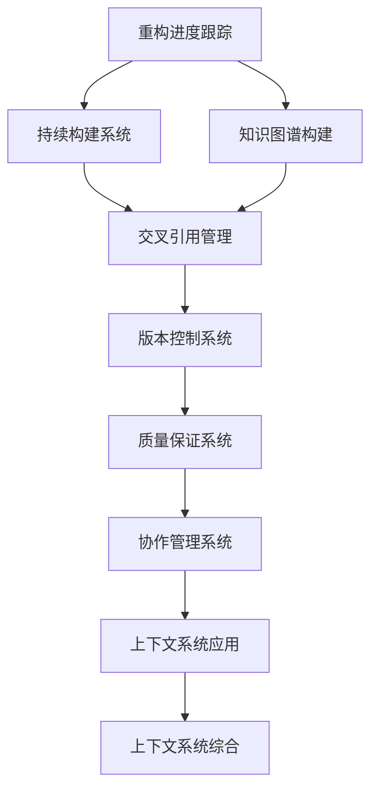

# 上下文系统索引 (Context System Index)

## 📋 **目录**

### 1. [重构进度跟踪](01.1_Refactor_Progress_Tracking.md)

### 2. [持续构建系统](01.2_Continuous_Build_System.md)

### 3. [知识图谱构建](01.3_Knowledge_Graph_Construction.md)

### 4. [交叉引用管理](01.4_Cross_Reference_Management.md)

### 5. [版本控制系统](01.5_Version_Control_System.md)

### 6. [质量保证系统](01.6_Quality_Assurance_System.md)

### 7. [协作管理系统](01.7_Collaboration_Management_System.md)

### 8. [上下文系统应用](01.8_Context_System_Applications.md)

---

## 🎯 **上下文系统概述**

上下文系统为整个形式科学体系的重构提供持续的支持和管理。它跟踪重构进度、管理知识关联、确保质量一致性，并为持续构建提供基础设施。

### 核心特征

1. **进度跟踪**：实时跟踪重构进度
2. **知识管理**：管理知识间的关联关系
3. **质量保证**：确保内容质量和一致性
4. **持续构建**：支持持续的知识构建
5. **协作支持**：支持团队协作重构

### 系统层次

```
┌─────────────────────────────────────────────────────────────┐
│                    上下文系统综合 (12.9)                      │
├─────────────────────────────────────────────────────────────┤
│ 应用系统 (12.8) │ 协作系统 (12.7) │ 质量系统 (12.6) │ 版本系统 (12.5) │
├─────────────────────────────────────────────────────────────┤
│ 引用系统 (12.4) │ 图谱系统 (12.3) │ 构建系统 (12.2) │ 跟踪系统 (12.1) │
└─────────────────────────────────────────────────────────────┘
```

---

## 🔗 **系统关联图**



---

## 📚 **详细系统结构**

### 12.1 重构进度跟踪

- **12.1.1** [进度监控](01.1_Refactor_Progress_Tracking.md#1211-进度监控)
- **12.1.2** [任务管理](01.1_Refactor_Progress_Tracking.md#1212-任务管理)
- **12.1.3** [里程碑管理](01.1_Refactor_Progress_Tracking.md#1213-里程碑管理)
- **12.1.4** [进度报告](01.1_Refactor_Progress_Tracking.md#1214-进度报告)

### 12.2 持续构建系统

- **12.2.1** [构建管道](01.2_Continuous_Build_System.md#1221-构建管道)
- **12.2.2** [依赖管理](01.2_Continuous_Build_System.md#1222-依赖管理)
- **12.2.3** [自动化测试](01.2_Continuous_Build_System.md#1223-自动化测试)
- **12.2.4** [部署管理](01.2_Continuous_Build_System.md#1224-部署管理)

### 12.3 知识图谱构建

- **12.3.1** [实体识别](01.3_Knowledge_Graph_Construction.md#1231-实体识别)
- **12.3.2** [关系抽取](01.3_Knowledge_Graph_Construction.md#1232-关系抽取)
- **12.3.3** [图谱构建](01.3_Knowledge_Graph_Construction.md#1233-图谱构建)
- **12.3.4** [图谱查询](01.3_Knowledge_Graph_Construction.md#1234-图谱查询)

### 12.4 交叉引用管理

- **12.4.1** [引用检测](01.4_Cross_Reference_Management.md#1241-引用检测)
- **12.4.2** [引用验证](01.4_Cross_Reference_Management.md#1242-引用验证)
- **12.4.3** [引用更新](01.4_Cross_Reference_Management.md#1243-引用更新)
- **12.4.4** [引用统计](01.4_Cross_Reference_Management.md#1244-引用统计)

### 12.5 版本控制系统

- **12.5.1** [版本管理](01.5_Version_Control_System.md#1251-版本管理)
- **12.5.2** [变更跟踪](01.5_Version_Control_System.md#1252-变更跟踪)
- **12.5.3** [分支管理](01.5_Version_Control_System.md#1253-分支管理)
- **12.5.4** [合并策略](01.5_Version_Control_System.md#1254-合并策略)

### 12.6 质量保证系统

- **12.6.1** [质量检查](01.6_Quality_Assurance_System.md#1261-质量检查)
- **12.6.2** [一致性验证](01.6_Quality_Assurance_System.md#1262-一致性验证)
- **12.6.3** [完整性检查](01.6_Quality_Assurance_System.md#1263-完整性检查)
- **12.6.4** [质量报告](01.6_Quality_Assurance_System.md#1264-质量报告)

### 12.7 协作管理系统

- **12.7.1** [权限管理](01.7_Collaboration_Management_System.md#1271-权限管理)
- **12.7.2** [工作流管理](01.7_Collaboration_Management_System.md#1272-工作流管理)
- **12.7.3** [沟通协调](01.7_Collaboration_Management_System.md#1273-沟通协调)
- **12.7.4** [冲突解决](01.7_Collaboration_Management_System.md#1274-冲突解决)

### 12.8 上下文系统应用

- **12.8.1** [智能推荐](01.8_Context_System_Applications.md#1281-智能推荐)
- **12.8.2** [自动补全](01.8_Context_System_Applications.md#1282-自动补全)
- **12.8.3** [知识导航](01.8_Context_System_Applications.md#1283-知识导航)
- **12.8.4** [学习路径](01.8_Context_System_Applications.md#1284-学习路径)

---

## 🔄 **与其他系统的关联**

### 向上关联

- **跨域综合理论**：[13_Cross_Domain_Synthesis](../13_Cross_Domain_Synthesis/01_Cross_Domain_Synthesis_Index.md)
- **并发理论**：[11_Concurrency_Theory](../11_Concurrency_Theory/01_Concurrency_Theory_Index.md)

### 向下关联

- **所有理论模块**：提供统一的上下文支持
- **质量保证**：确保所有模块的质量一致性

---

## 📖 **系统使用指南**

### 基础使用

1. 重构进度跟踪 → 持续构建系统 → 知识图谱构建
2. 交叉引用管理 → 版本控制系统 → 质量保证系统
3. 协作管理系统 → 上下文系统应用 → 上下文系统综合

### 专业使用

- **项目管理**：进度跟踪 → 任务管理 → 里程碑管理
- **质量控制**：质量检查 → 一致性验证 → 质量报告
- **知识管理**：知识图谱 → 交叉引用 → 智能推荐

---

## 🎯 **核心功能索引**

| 功能 | 定义位置 | 相关系统 |
|------|----------|----------|
| 进度跟踪 | [12.1.1](01.1_Refactor_Progress_Tracking.md#1211-进度监控) | 重构进度跟踪 |
| 持续构建 | [12.2.1](01.2_Continuous_Build_System.md#1221-构建管道) | 持续构建系统 |
| 知识图谱 | [12.3.1](01.3_Knowledge_Graph_Construction.md#1231-实体识别) | 知识图谱构建 |
| 交叉引用 | [12.4.1](01.4_Cross_Reference_Management.md#1241-引用检测) | 交叉引用管理 |
| 版本控制 | [12.5.1](01.5_Version_Control_System.md#1251-版本管理) | 版本控制系统 |
| 质量保证 | [12.6.1](01.6_Quality_Assurance_System.md#1261-质量检查) | 质量保证系统 |
| 协作管理 | [12.7.1](01.7_Collaboration_Management_System.md#1271-权限管理) | 协作管理系统 |
| 智能推荐 | [12.8.1](01.8_Context_System_Applications.md#1281-智能推荐) | 上下文系统应用 |

---

## 🔄 **持续更新**

**最后更新时间**：2024-12-20
**版本**：v1.0.0
**维护者**：上下文系统重构团队

---

## 📋 **待完成任务**

- [ ] 完善所有子系统的实现
- [ ] 建立系统间的协调机制
- [ ] 实现智能推荐和自动补全
- [ ] 构建完整的质量保证体系
