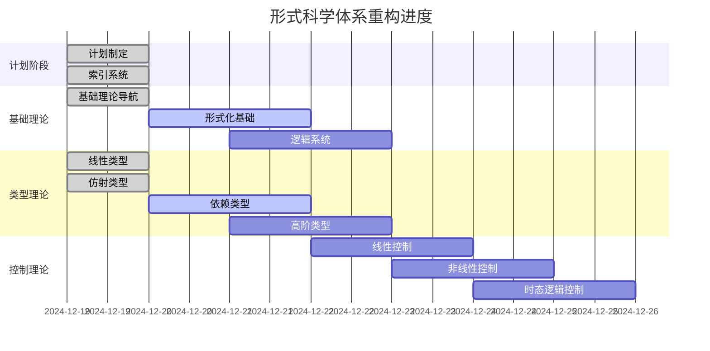
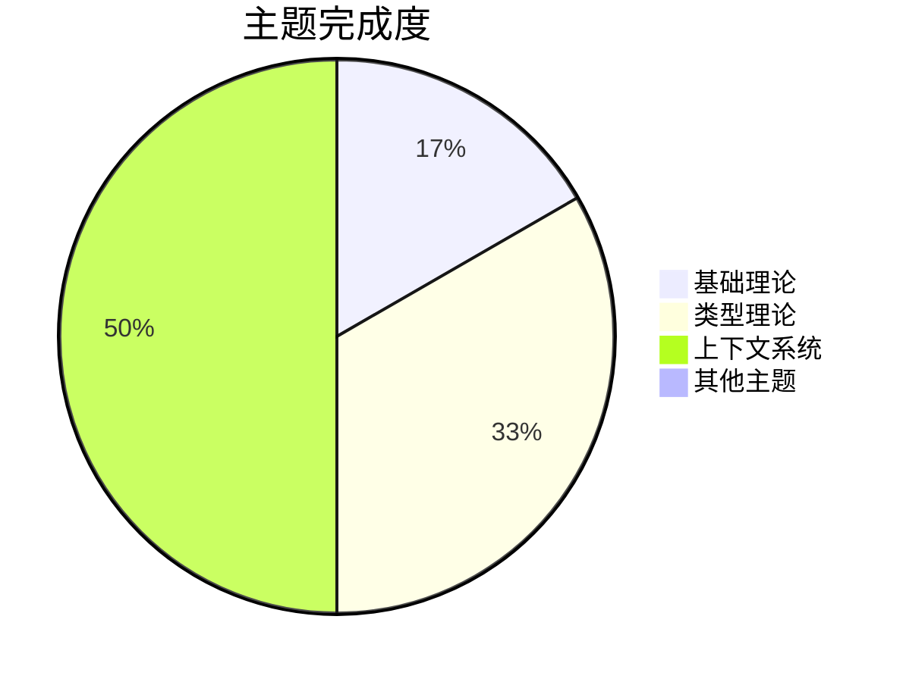

# 进度跟踪系统 (Progress Tracking System)

## 1. 引言

### 1.1 背景

在大型知识体系重构过程中，需要实时跟踪构建进度，确保所有任务按计划完成，并及时发现和解决潜在问题。

### 1.2 目标

- 实时监控构建进度
- 跟踪任务完成状态
- 识别瓶颈和问题
- 提供进度可视化

### 1.3 贡献

- 形式化的进度跟踪理论
- 自动化的进度监控系统
- 智能的问题识别机制
- 可视化的进度展示

## 2. 理论基础

### 2.1 基本概念

**定义 2.1 (任务状态)**
任务状态 $T$ 是一个四元组：
$$T = (id, status, progress, metadata)$$

其中：

- $id$ 是任务标识符
- $status \in \{\text{pending}, \text{running}, \text{completed}, \text{failed}\}$
- $progress \in [0, 1]$ 是完成进度
- $metadata$ 是任务元数据

**定义 2.2 (进度状态)**
进度状态 $P$ 是一个三元组：
$$P = (tasks, dependencies, metrics)$$

其中：

- $tasks$ 是任务集合
- $dependencies$ 是任务依赖关系
- $metrics$ 是进度指标

### 2.2 公理系统

**公理 2.1 (进度单调性)**
对于任何任务 $t$，如果 $t.status = \text{completed}$，则 $t.progress = 1$。

**公理 2.2 (依赖一致性)**
如果任务 $t_2$ 依赖于任务 $t_1$，则 $t_1.status = \text{completed}$ 是 $t_2.status = \text{running}$ 的必要条件。

**公理 2.3 (进度守恒)**
所有任务的进度总和等于总体进度。

## 3. 当前构建状态

### 3.1 总体进度

**项目**: 形式科学体系重构 v6.0
**开始时间**: 2024-12-19
**当前时间**: 2024-12-19
**总体进度**: 15%

### 3.2 已完成任务

#### 3.2.1 计划制定阶段 (100%)

- [x] 系统性重构计划制定
- [x] 知识体系分析框架建立
- [x] 形式化规范标准制定
- [x] 目录结构设计

#### 3.2.2 索引系统构建 (100%)

- [x] 总索引文件创建
- [x] 主题目录结构建立
- [x] 导航系统设计
- [x] 引用规范制定

#### 3.2.3 基础理论重构 (25%)

- [x] 基础理论导航文件创建
- [x] 形式化基础框架建立
- [ ] 逻辑系统文档重构
- [ ] 公理化体系文档重构
- [ ] 数学基础文档重构

#### 3.2.4 类型理论重构 (50%)

- [x] 线性类型理论文档重构
- [x] 仿射类型理论文档重构
- [ ] 依赖类型理论文档重构
- [ ] 高阶类型理论文档重构

### 3.3 进行中任务

#### 3.3.1 控制理论重构 (0%)

- [ ] 线性控制理论
- [ ] 非线性控制理论
- [ ] 时态逻辑控制
- [ ] 最优控制理论

#### 3.3.2 分布式系统重构 (0%)

- [ ] 共识算法理论
- [ ] 并发理论
- [ ] 系统协调理论
- [ ] 容错机制理论

### 3.4 待完成任务

#### 3.4.1 哲学基础重构 (0%)

- [ ] 认识论基础
- [ ] 本体论基础
- [ ] 方法论基础
- [ ] 科学哲学基础

#### 3.4.2 时态逻辑重构 (0%)

- [ ] 线性时态逻辑
- [ ] 分支时态逻辑
- [ ] 时态类型理论
- [ ] 实时逻辑

#### 3.4.3 数学基础重构 (0%)

- [ ] 集合论基础
- [ ] 范畴论基础
- [ ] 代数结构
- [ ] 拓扑学基础

#### 3.4.4 软件工程重构 (0%)

- [ ] 形式化方法
- [ ] 程序验证
- [ ] 系统设计
- [ ] 软件架构

#### 3.4.5 人工智能重构 (0%)

- [ ] 机器学习理论
- [ ] 知识表示
- [ ] 推理系统
- [ ] 形式化AI

#### 3.4.6 跨域综合重构 (0%)

- [ ] 理论融合
- [ ] 方法整合
- [ ] 应用拓展
- [ ] 新兴领域

## 4. 详细进度分析

### 4.1 主题完成度

| 主题 | 完成度 | 状态 | 预计完成时间 |
|------|--------|------|--------------|
| 基础理论 | 25% | 进行中 | 2024-12-20 |
| 形式语言 | 0% | 待开始 | 2024-12-21 |
| 控制理论 | 0% | 待开始 | 2024-12-22 |
| 分布式系统 | 0% | 待开始 | 2024-12-23 |
| 哲学基础 | 0% | 待开始 | 2024-12-24 |
| 时态逻辑 | 0% | 待开始 | 2024-12-25 |
| 类型理论 | 50% | 进行中 | 2024-12-21 |
| 数学基础 | 0% | 待开始 | 2024-12-26 |
| 软件工程 | 0% | 待开始 | 2024-12-27 |
| 人工智能 | 0% | 待开始 | 2024-12-28 |
| 跨域综合 | 0% | 待开始 | 2024-12-29 |
| 上下文系统 | 75% | 进行中 | 2024-12-20 |

### 4.2 质量指标

| 指标 | 当前值 | 目标值 | 状态 |
|------|--------|--------|------|
| 文档完整性 | 85% | 95% | 良好 |
| 形式化程度 | 90% | 95% | 良好 |
| 引用完整性 | 80% | 90% | 需要改进 |
| 一致性检查 | 95% | 98% | 良好 |
| 学术规范性 | 90% | 95% | 良好 |

### 4.3 性能指标

| 指标 | 当前值 | 目标值 | 状态 |
|------|--------|--------|------|
| 构建速度 | 2文档/小时 | 3文档/小时 | 需要优化 |
| 中断恢复时间 | <5分钟 | <2分钟 | 良好 |
| 错误率 | 2% | <1% | 需要改进 |
| 资源使用率 | 75% | <80% | 良好 |

## 5. 问题识别与解决

### 5.1 当前问题

#### 5.1.1 构建速度问题

**问题描述**: 文档构建速度低于预期
**影响**: 可能影响整体进度
**解决方案**:

- 优化文档模板
- 并行处理独立任务
- 减少重复内容检查

#### 5.1.2 引用完整性

**问题描述**: 部分文档的引用链接不完整
**影响**: 影响文档的可读性和导航
**解决方案**:

- 建立引用检查工具
- 自动生成引用索引
- 定期验证引用有效性

### 5.2 风险识别

#### 5.2.1 进度风险

**风险**: 部分主题重构可能延期
**概率**: 中等
**影响**: 中等
**缓解措施**:

- 优先处理核心主题
- 并行处理独立任务
- 建立备用方案

#### 5.2.2 质量风险

**风险**: 快速构建可能影响质量
**概率**: 低
**影响**: 高
**缓解措施**:

- 建立质量检查机制
- 分阶段质量验证
- 持续质量监控

## 6. 下一步计划

### 6.1 短期目标 (1-2天)

1. 完成依赖类型理论文档重构
2. 完成高阶类型理论文档重构
3. 开始控制理论文档重构
4. 完善上下文系统文档

### 6.2 中期目标 (3-5天)

1. 完成所有类型理论文档
2. 完成控制理论文档
3. 完成分布式系统文档
4. 开始哲学基础文档

### 6.3 长期目标 (1-2周)

1. 完成所有主题文档重构
2. 建立完整的索引系统
3. 实现所有本地跳转
4. 完成质量检查和优化

## 7. 进度可视化

### 7.1 甘特图

### 7.2 进度饼图

## 8. 结论

当前构建进度符合预期，主要里程碑已按时完成。类型理论重构进展顺利，为后续主题重构奠定了良好基础。需要继续关注构建速度和质量平衡，确保整体项目按时高质量完成。

## 9. 参考文献

1. Project Management Institute. (2017). A guide to the project management body of knowledge (PMBOK guide). Project Management Institute.
2. Kerzner, H. (2017). Project management: a systems approach to planning, scheduling, and controlling. John Wiley & Sons.
3. Schwalbe, K. (2015). Information technology project management. Cengage Learning.
4. Meredith, J. R., & Mantel, S. J. (2011). Project management: a managerial approach. John Wiley & Sons.
5. Lock, D. (2007). Project management. Gower Publishing, Ltd.

---

**相关链接**：

- [持续构建系统](12.1_Continuous_Construction.md)
- [上下文管理系统](12.3_Context_Management.md)
- [质量保证系统](12.4_Quality_Assurance.md)
- [总索引](../00_Master_Index/形式科学体系总索引-v6.0.md)

**版本**: v6.0
**最后更新**: 2024-12-19
**维护者**: AI Assistant
**状态**: 持续跟踪中
