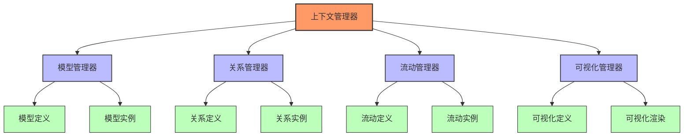
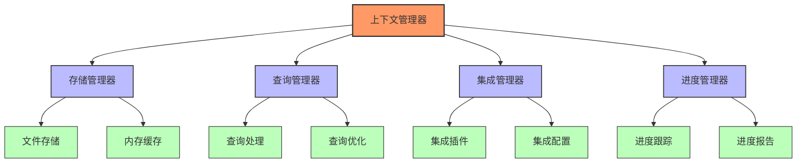
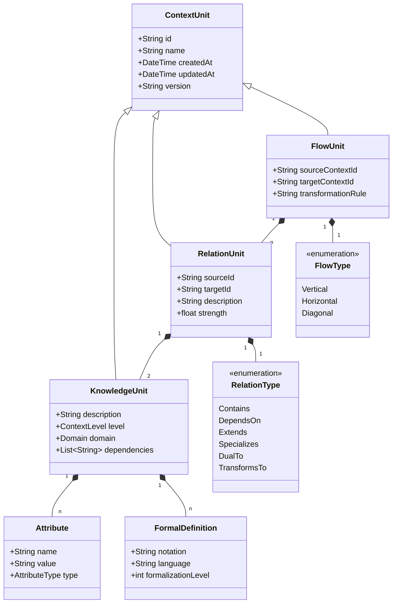
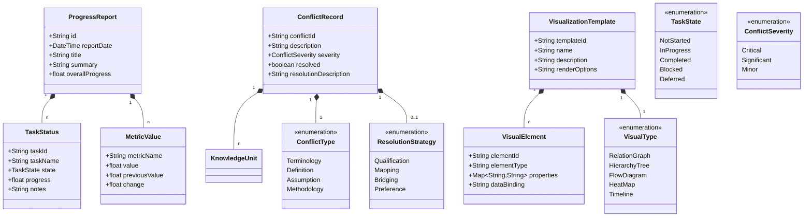
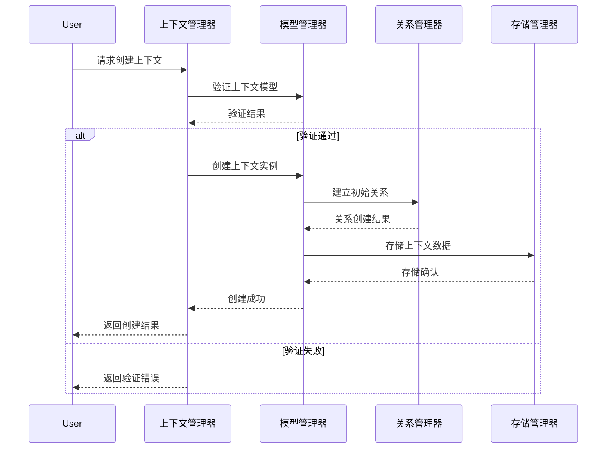
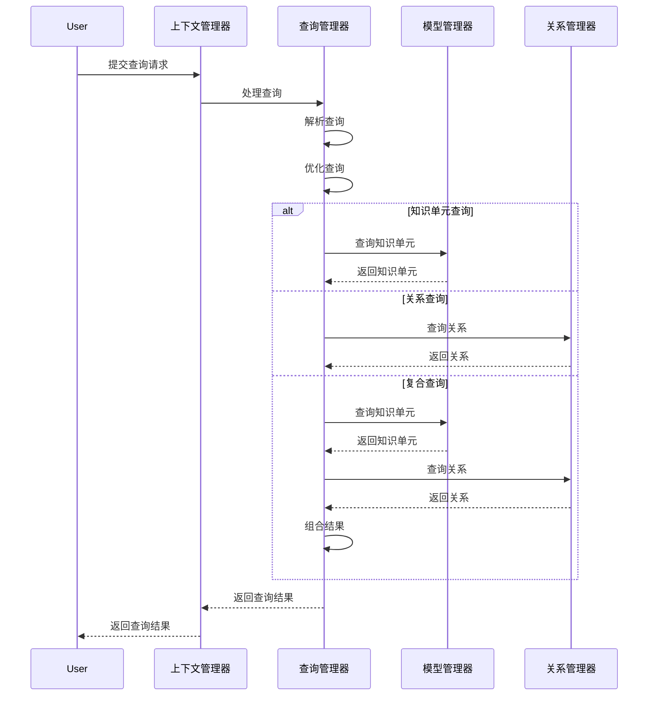
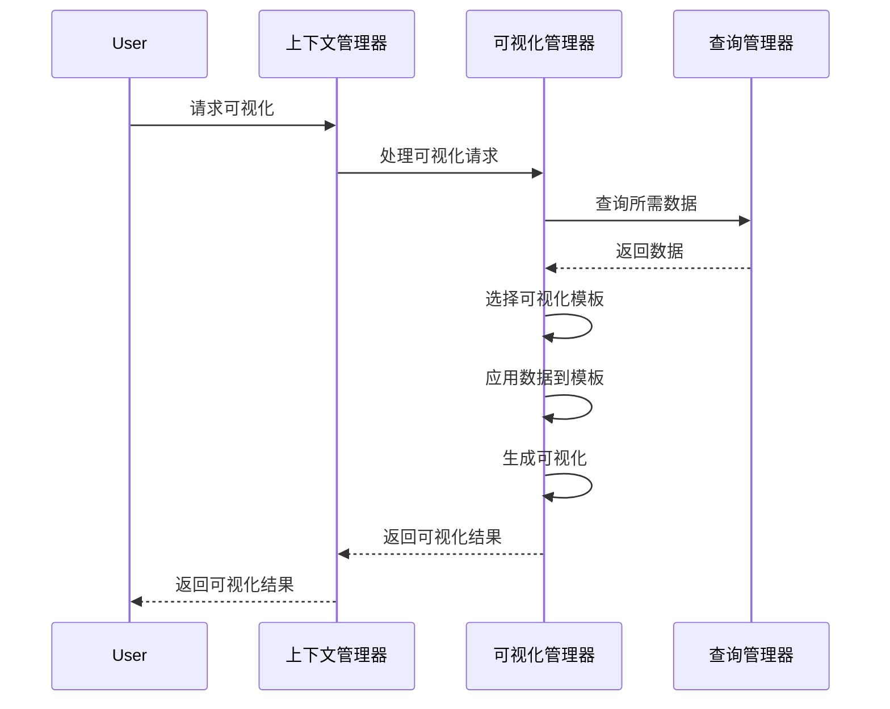
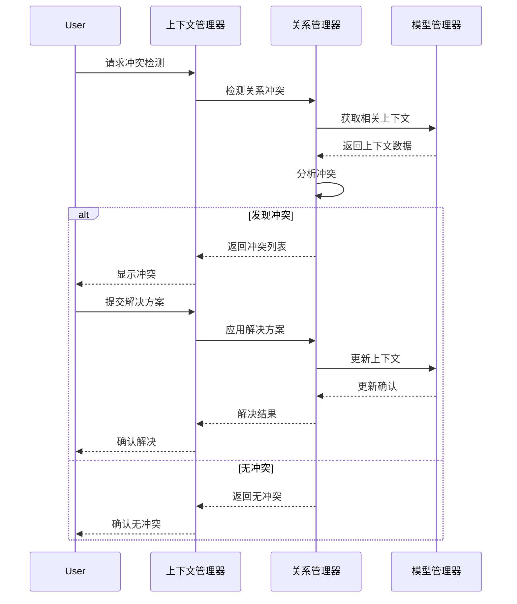
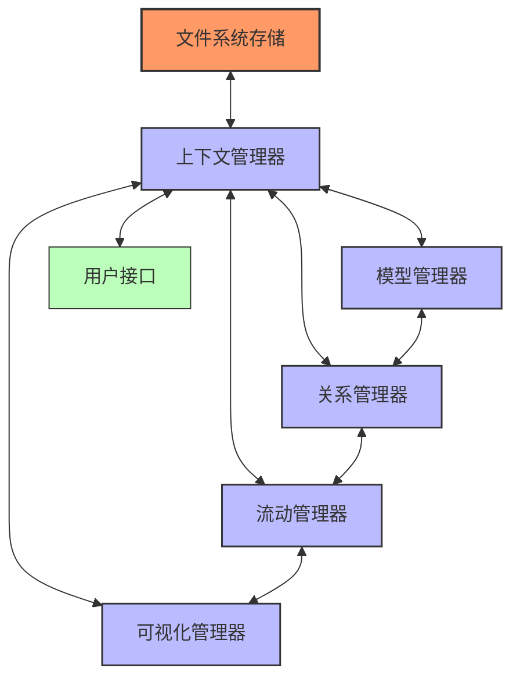

# 形式科学项目 - 上下文系统架构

**创建时间**: 2025-01-15  
**最后更新**: 2025-01-15  
**文档状态**: 活跃  

## 1. 架构概述

### 1.1 系统目标

上下文系统架构旨在提供一个统一的框架，用于：

1. 组织和管理形式科学项目的知识体系
2. 确保不同领域知识间的连贯性和一致性
3. 支持知识的有效传递和演化
4. 检测和解决知识间的潜在冲突
5. 提供直观的知识导航和探索机制

### 1.2 设计原则

上下文系统架构遵循以下设计原则：

1. **模块化**: 将系统分解为独立但相互关联的模块
2. **层次化**: 采用多层次结构组织知识和功能
3. **可扩展性**: 支持新领域和概念的无缝集成
4. **一致性**: 确保系统各部分采用统一的表示和操作方式
5. **可追溯性**: 支持知识的来源和演化追踪

## 2. 系统组件

### 2.1 核心组件



#### 2.1.1 上下文管理器 (Context Manager)

上下文管理器是系统的核心组件，负责协调其他组件的工作，并提供统一的接口。主要功能包括：

- 初始化和配置系统
- 协调各管理器的工作
- 处理上下文操作请求
- 维护系统状态
- 提供API接口

#### 2.1.2 模型管理器 (Model Manager)

模型管理器负责管理上下文模型的定义和实例。主要功能包括：

- 创建和维护上下文模型定义
- 实例化上下文模型
- 验证模型的一致性
- 提供模型查询接口
- 支持模型的版本控制

#### 2.1.3 关系管理器 (Relation Manager)

关系管理器负责管理上下文间的关系。主要功能包括：

- 定义和维护关系类型
- 创建和管理关系实例
- 验证关系的有效性
- 提供关系查询接口
- 检测关系冲突

#### 2.1.4 流动管理器 (Flow Manager)

流动管理器负责管理上下文间的知识流动。主要功能包括：

- 定义和维护流动类型
- 创建和管理流动实例
- 验证流动的有效性
- 提供流动查询接口
- 监控流动状态

#### 2.1.5 可视化管理器 (Visualization Manager)

可视化管理器负责生成上下文的可视化表示。主要功能包括：

- 定义和维护可视化模板
- 根据上下文数据生成可视化
- 提供可视化渲染接口
- 支持交互式可视化
- 导出可视化结果

### 2.2 辅助组件



#### 2.2.1 存储管理器 (Storage Manager)

存储管理器负责上下文数据的持久化和检索。主要功能包括：

- 文件系统存储管理
- 内存缓存管理
- 数据序列化和反序列化
- 数据一致性维护
- 备份和恢复

#### 2.2.2 查询管理器 (Query Manager)

查询管理器负责处理对上下文系统的查询。主要功能包括：

- 解析查询请求
- 优化查询执行
- 执行查询操作
- 返回查询结果
- 缓存常用查询结果

#### 2.2.3 集成管理器 (Integration Manager)

集成管理器负责与其他系统和工具的集成。主要功能包括：

- 管理集成插件
- 配置集成接口
- 处理数据转换
- 同步外部系统状态
- 提供扩展点

#### 2.2.4 进度管理器 (Progress Manager)

进度管理器负责跟踪和报告系统的进度。主要功能包括：

- 跟踪任务进度
- 生成进度报告
- 维护历史记录
- 提供进度统计
- 支持进度可视化

## 3. 数据模型

### 3.1 核心数据模型



### 3.2 辅助数据模型



## 4. 工作流程

### 4.1 上下文创建流程



### 4.2 上下文查询流程



### 4.3 上下文可视化流程



### 4.4 冲突检测与解决流程



## 5. 部署架构

### 5.1 文件系统部署

上下文系统采用基于文件系统的部署架构，组织如下：

```text
12_Context_System/
├── README.md                                # 系统概述
├── Architecture.md                          # 本文档
├── Context_Management_Specification.md      # 上下文管理规范
├── Models/                                  # 上下文模型
│   ├── Context_Models.md                    # 上下文模型定义
│   └── Context_Visualization.md             # 上下文可视化
├── Integration/                             # 整合方案
│   ├── Philosophical_Context_Integration.md # 哲学上下文整合
│   └── Formal_Science_Context_Integration.md # 形式科学上下文整合
└── Progress/                                # 进度记录
    └── YYYY-MM-DD_Progress_Report.md        # 按日期命名的进度报告
```

### 5.2 组件交互



## 6. 扩展机制

### 6.1 插件系统

上下文系统支持通过插件扩展功能，包括：

1. **模型插件**: 扩展上下文模型定义
2. **关系插件**: 添加新的关系类型和处理逻辑
3. **可视化插件**: 提供新的可视化模板和渲染器
4. **存储插件**: 支持不同的存储后端
5. **集成插件**: 与外部系统集成

### 6.2 扩展点

系统提供以下扩展点：

1. **模型扩展点**: 用于扩展上下文模型
2. **关系扩展点**: 用于扩展关系类型和处理
3. **可视化扩展点**: 用于扩展可视化功能
4. **查询扩展点**: 用于扩展查询能力
5. **存储扩展点**: 用于扩展存储机制

## 7. 未来发展

### 7.1 近期计划

1. **完善基础架构**: 完成核心组件的实现和集成
2. **增强可视化能力**: 开发更丰富的可视化模板和工具
3. **提高形式化程度**: 增强形式化定义和验证机制
4. **改进冲突检测**: 开发更智能的冲突检测和解决机制

### 7.2 长期愿景

1. **知识图谱构建**: 基于上下文系统构建完整的形式科学知识图谱
2. **智能推理支持**: 添加基于上下文的推理能力
3. **协作编辑功能**: 支持多用户协作编辑和管理上下文
4. **学习路径生成**: 基于上下文关系自动生成学习路径

## 8. 相关文档

- [上下文管理规范](./Context_Management_Specification.md)
- [上下文模型定义](./Models/Context_Models.md)
- [上下文可视化](./Models/Context_Visualization.md)
- [哲学上下文整合](./Integration/Philosophical_Context_Integration.md)
- [形式科学上下文整合](./Integration/Formal_Science_Context_Integration.md)

---

**最后更新**: 2025-01-15  
**文档版本**: 1.0  
**审核状态**: 已审核
