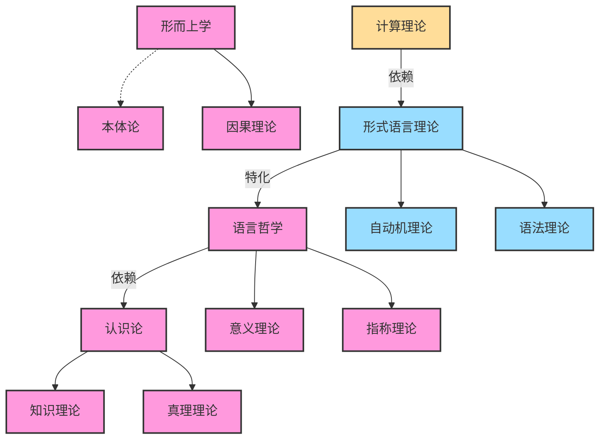
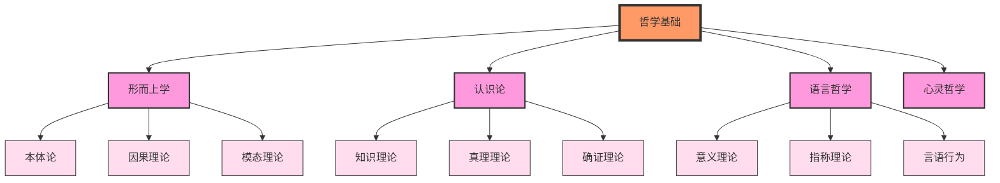
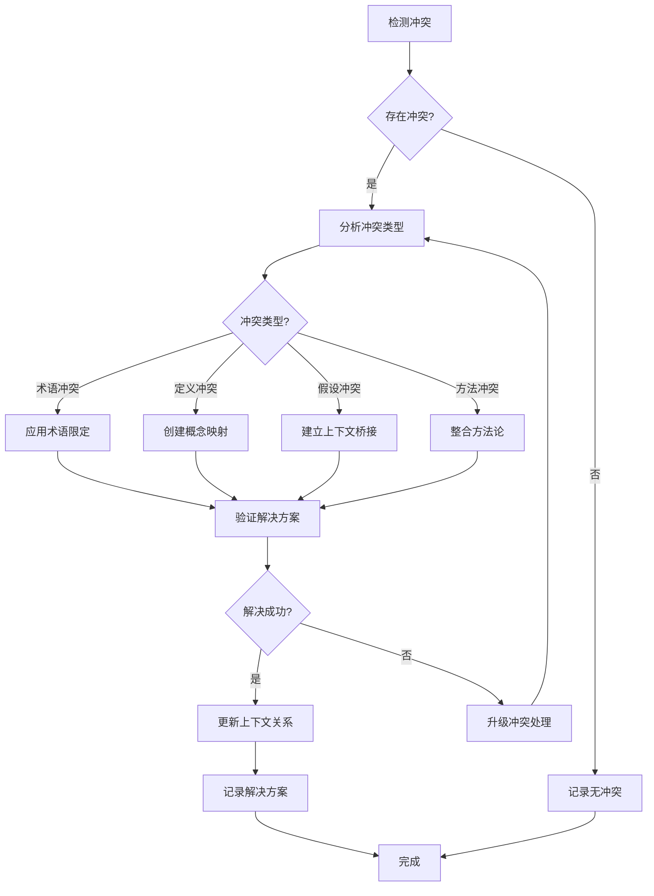
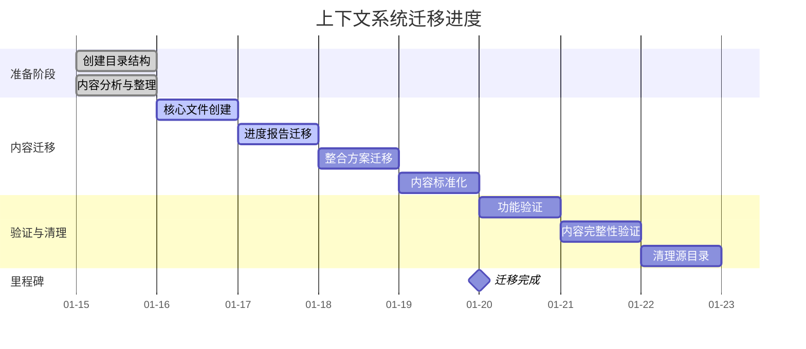

# 形式科学项目 - 上下文可视化

**创建时间**: 2025-01-15  
**最后更新**: 2025-01-15  
**文档状态**: 活跃  

## 1. 上下文可视化概述

### 1.1 可视化目的

上下文可视化旨在提供直观、清晰的方式来表示和理解：

1. 上下文单元及其属性
2. 上下文间的关系网络
3. 知识流动的路径和方向
4. 上下文冲突及其解决方案
5. 项目进度和状态

### 1.2 可视化受众

上下文可视化面向以下受众：

- 项目参与者：理解项目结构和关系
- 内容贡献者：识别贡献机会和依赖关系
- 项目管理者：监控进度和质量
- 知识探索者：导航和发现知识

## 2. 可视化类型

### 2.1 上下文关系图

上下文关系图使用节点和边表示上下文单元及其关系。

#### 2.1.1 节点表示

节点表示上下文单元，采用以下视觉编码：

- **形状**：表示上下文层级
  - 圆形：概念上下文
  - 矩形：主题上下文
  - 六边形：领域上下文
  - 菱形：元上下文

- **颜色**：表示所属领域
  - 粉色：哲学
  - 蓝色：数学
  - 绿色：逻辑
  - 紫色：形式语言
  - 橙色：类型理论
  - 黄色：计算理论
  - 青色：程序语言
  - 灰色：其他领域

- **大小**：表示重要性或复杂度
  - 基于引用数量、依赖关系或形式化程度

- **边框**：表示完成状态
  - 实线：已完成
  - 虚线：进行中
  - 点线：计划中

#### 2.1.2 边表示

边表示上下文关系，采用以下视觉编码：

- **线型**：表示关系类型
  - 实线箭头：依赖关系
  - 虚线箭头：扩展关系
  - 点线箭头：特化关系
  - 双向箭头：对偶关系
  - 曲线箭头：转换关系
  - 包含线：包含关系

- **线宽**：表示关系强度
  - 基于关系的强度值（0.0-1.0）

- **颜色**：表示关系状态
  - 黑色：稳定关系
  - 红色：冲突关系
  - 橙色：待验证关系
  - 绿色：新建关系

#### 2.1.3 Mermaid示例



### 2.2 上下文层次树

上下文层次树展示上下文单元的层次结构。

#### 2.2.1 树形表示

树形结构采用以下视觉编码：

- **层级**：表示上下文的包含关系
- **展开/折叠**：控制显示的详细程度
- **颜色编码**：与关系图保持一致

#### 2.2.2 Mermaid示例



### 2.3 上下文热图

上下文热图展示上下文单元的活跃度和关注度。

#### 2.3.1 热图表示

热图采用以下视觉编码：

- **颜色强度**：表示活跃度或关注度
  - 深色：高活跃度/关注度
  - 浅色：低活跃度/关注度

- **单元格大小**：表示上下文单元的规模或复杂度

#### 2.3.2 示例描述

热图将上下文单元排列在二维网格中，横轴表示领域，纵轴表示主题。每个单元格的颜色强度表示该上下文的活跃度（如最近的更新频率、引用次数等）。

## 3. 冲突可视化

### 3.1 冲突矩阵

冲突矩阵展示上下文间的冲突关系。

#### 3.1.1 矩阵表示

矩阵采用以下视觉编码：

- **单元格颜色**：表示冲突严重度
  - 红色：严重冲突
  - 橙色：中度冲突
  - 黄色：轻度冲突
  - 绿色：已解决冲突

- **单元格符号**：表示冲突类型
  - T：术语冲突
  - D：定义冲突
  - A：假设冲突
  - M：方法冲突

#### 3.1.2 示例描述

冲突矩阵是一个对称矩阵，行和列都表示上下文单元。矩阵中的每个单元格表示对应行列上下文间的冲突情况。

### 3.2 冲突解决流程图

冲突解决流程图展示冲突的检测、分析和解决过程。

#### 3.2.1 流程表示

流程图采用以下视觉编码：

- **节点形状**：表示流程阶段
  - 圆角矩形：流程步骤
  - 菱形：决策点
  - 平行四边形：数据输入/输出

- **连线**：表示流程方向

- **颜色**：表示流程状态
  - 灰色：未开始
  - 蓝色：进行中
  - 绿色：已完成
  - 红色：出错

#### 3.2.2 Mermaid示例



## 4. 进度可视化

### 4.1 进度甘特图

进度甘特图展示项目任务的时间安排和完成情况。

#### 4.1.1 甘特图表示

甘特图采用以下视觉编码：

- **横轴**：表示时间线
- **纵轴**：表示任务
- **条形**：表示任务持续时间
- **颜色**：表示任务状态或类型
- **标记**：表示里程碑

#### 4.1.2 Mermaid示例



### 4.2 完成度仪表盘

完成度仪表盘展示项目各模块的完成情况。

#### 4.2.1 仪表盘表示

仪表盘采用以下视觉编码：

- **仪表**：表示完成百分比
- **颜色**：表示完成状态
  - 红色：0-33%
  - 黄色：34-66%
  - 绿色：67-100%

- **分组**：按模块或领域分组

#### 4.2.2 示例描述

仪表盘包含多个仪表，每个仪表代表一个模块或领域。仪表的指针指向当前的完成百分比，颜色根据完成度变化。

## 5. 交互式可视化

### 5.1 交互功能

交互式可视化提供以下功能：

1. **缩放**：放大或缩小视图
2. **平移**：移动视图
3. **过滤**：根据条件筛选显示的元素
4. **搜索**：查找特定上下文单元
5. **展开/折叠**：控制显示的详细程度
6. **高亮**：强调选中的元素及其关联元素
7. **详情查看**：显示元素的详细信息
8. **编辑**：修改上下文单元或关系

### 5.2 实现方法

交互式可视化可通过以下技术实现：

1. **Web技术**：使用D3.js、Cytoscape.js等库
2. **桌面应用**：使用Electron、Qt等框架
3. **集成开发环境插件**：为常见IDE开发插件

### 5.3 用户场景

#### 5.3.1 知识探索场景

用户可以从主题索引开始，通过关系图导航到相关主题，查看详细内容，然后沿着关系继续探索。系统会根据用户的兴趣和行为推荐相关上下文。

#### 5.3.2 冲突解决场景

用户发现术语冲突后，可以通过冲突矩阵查看所有相关冲突，然后使用冲突解决流程图指导解决过程，最后更新上下文关系。

## 6. 可视化最佳实践

### 6.1 设计原则

1. **简洁性**：避免视觉混乱，专注于重要信息
2. **一致性**：在所有可视化中保持一致的视觉语言
3. **可扩展性**：设计能够处理大规模数据的可视化方法
4. **可理解性**：确保可视化易于理解，提供必要的图例和说明
5. **响应性**：适应不同设备和屏幕尺寸

### 6.2 颜色使用指南

1. **有限调色板**：使用有限的颜色集合，避免过多颜色
2. **色盲友好**：选择对色盲用户友好的颜色组合
3. **语义一致性**：颜色的语义应保持一致（如红色总是表示错误或警告）
4. **对比度**：确保足够的对比度以提高可读性

### 6.3 标签和注释

1. **简洁标签**：使用简短、清晰的标签
2. **按需显示**：避免过多标签导致混乱，可使用悬停显示详情
3. **分层注释**：提供不同详细程度的注释
4. **上下文相关**：根据用户的操作和关注点提供相关注释

## 7. 实现示例

### 7.1 上下文关系图生成器

以下是生成上下文关系图的伪代码：

```python
def generate_context_relation_graph(contexts, relations):
    # 创建图形对象
    graph = Graph()
    
    # 添加节点
    for context in contexts:
        node = Node(
            id=context.id,
            label=context.name,
            shape=get_shape_by_level(context.level),
            color=get_color_by_domain(context.domain),
            size=calculate_size(context),
            border=get_border_by_status(context.status)
        )
        graph.add_node(node)
    
    # 添加边
    for relation in relations:
        edge = Edge(
            source=relation.sourceId,
            target=relation.targetId,
            type=get_line_type_by_relation(relation.type),
            width=relation.strength * 5,  # 线宽基于关系强度
            color=get_color_by_relation_status(relation.status)
        )
        graph.add_edge(edge)
    
    # 应用布局算法
    apply_force_directed_layout(graph)
    
    return graph
```

### 7.2 冲突矩阵生成器

以下是生成冲突矩阵的伪代码：

```python
def generate_conflict_matrix(contexts, conflicts):
    # 创建矩阵
    n = len(contexts)
    matrix = [[None for _ in range(n)] for _ in range(n)]
    
    # 映射上下文到索引
    context_to_index = {context.id: i for i, context in enumerate(contexts)}
    
    # 填充矩阵
    for conflict in conflicts:
        context_ids = conflict.contextIds
        for i in range(len(context_ids)):
            for j in range(i+1, len(context_ids)):
                idx1 = context_to_index[context_ids[i]]
                idx2 = context_to_index[context_ids[j]]
                
                # 创建矩阵单元
                cell = {
                    'type': get_symbol_by_conflict_type(conflict.type),
                    'severity': conflict.severity,
                    'color': get_color_by_severity(conflict.severity),
                    'status': conflict.status,
                    'id': conflict.id
                }
                
                # 填充对称位置
                matrix[idx1][idx2] = cell
                matrix[idx2][idx1] = cell
    
    return matrix
```

## 8. 未来发展方向

### 8.1 增强可视化

1. **3D可视化**：开发三维上下文关系图，提供更丰富的空间布局
2. **时间维度**：添加时间轴，展示上下文的演化过程
3. **虚拟现实**：开发VR/AR上下文探索环境

### 8.2 智能辅助

1. **自动布局**：开发更智能的图布局算法，优化节点位置
2. **关系推荐**：基于现有关系推荐潜在的新关系
3. **冲突预测**：预测可能出现的上下文冲突

### 8.3 协作可视化

1. **多用户编辑**：支持多用户同时编辑上下文图
2. **变更可视化**：直观显示上下文的变更历史
3. **讨论集成**：将讨论和注释集成到可视化中

---

**最后更新**: 2025-01-15  
**文档版本**: 1.0  
**审核状态**: 已审核
