# 上下文系统可视化

**创建日期**: 2025-01-17  
**版本**: 1.0  
**状态**: 草稿  

## 1. 可视化概述

本文档描述了形式科学上下文系统的可视化方法和技术，旨在通过图形化表示帮助理解上下文系统的结构、关系和动态特性。可视化是理解复杂系统的重要工具，对于上下文系统尤为重要，因为它涉及多层次、多维度的概念关系。

## 2. 上下文结构可视化

### 2.1 上下文树形图

上下文层次结构可以通过树形图表示，展示上下文间的包含和继承关系：

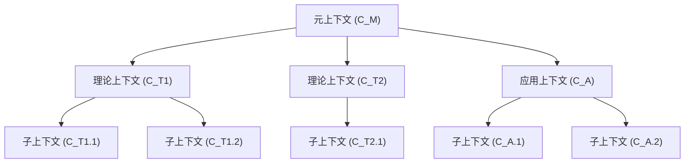

### 2.2 上下文网络图

上下文间的复杂关系可以通过网络图表示，展示上下文间的各种连接：

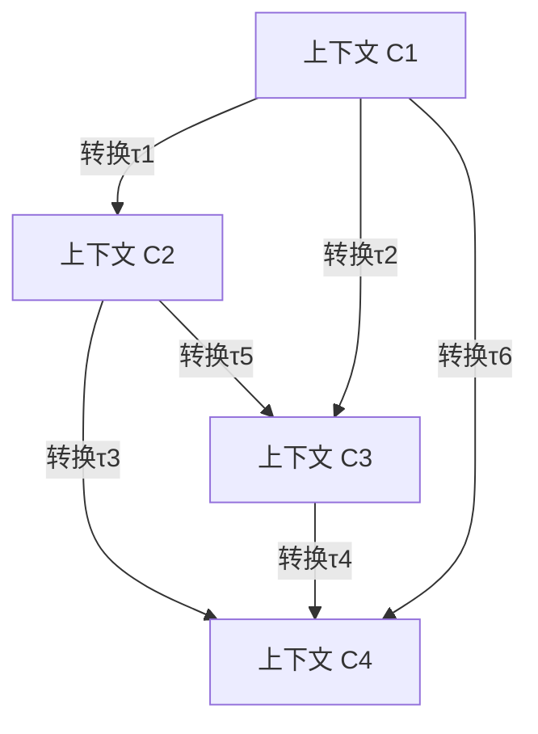

### 2.3 上下文组成图

上下文的内部组成可以通过分区图表示：

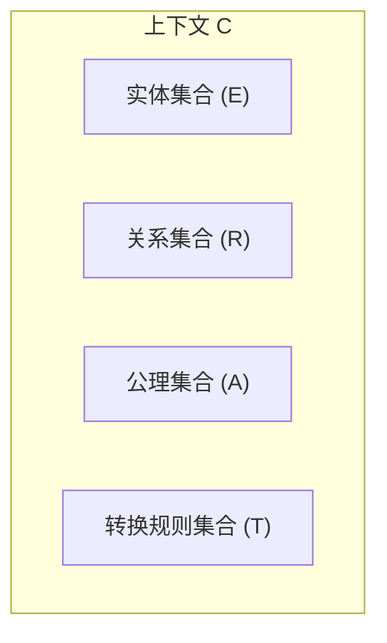

## 3. 上下文关系可视化

### 3.1 上下文映射图

展示不同上下文间概念映射的关系图：

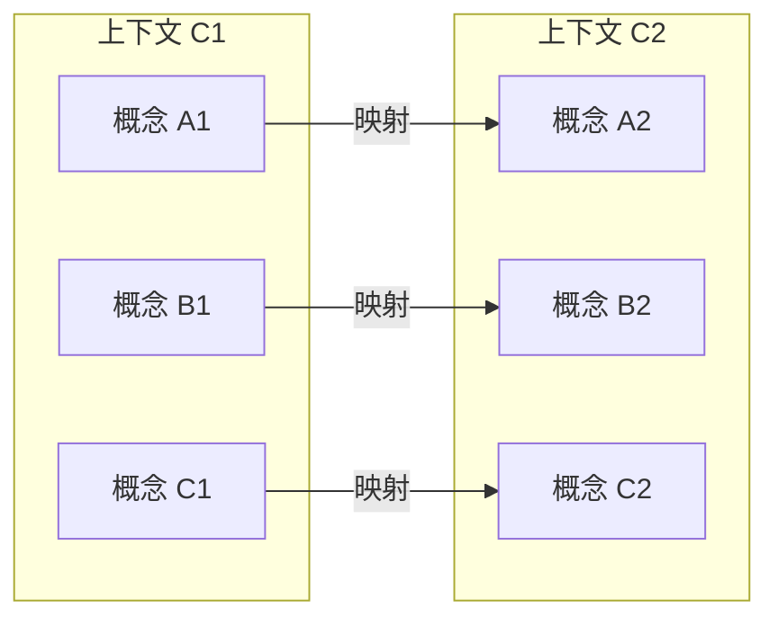

### 3.2 上下文转换图

展示上下文转换过程的流程图：

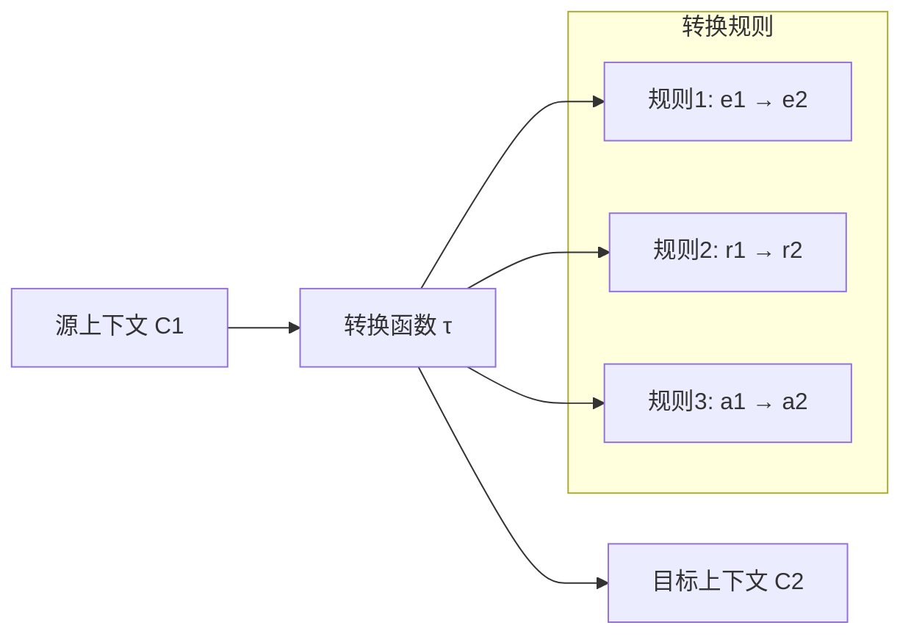

### 3.3 上下文一致性图

展示上下文一致性检查的流程：

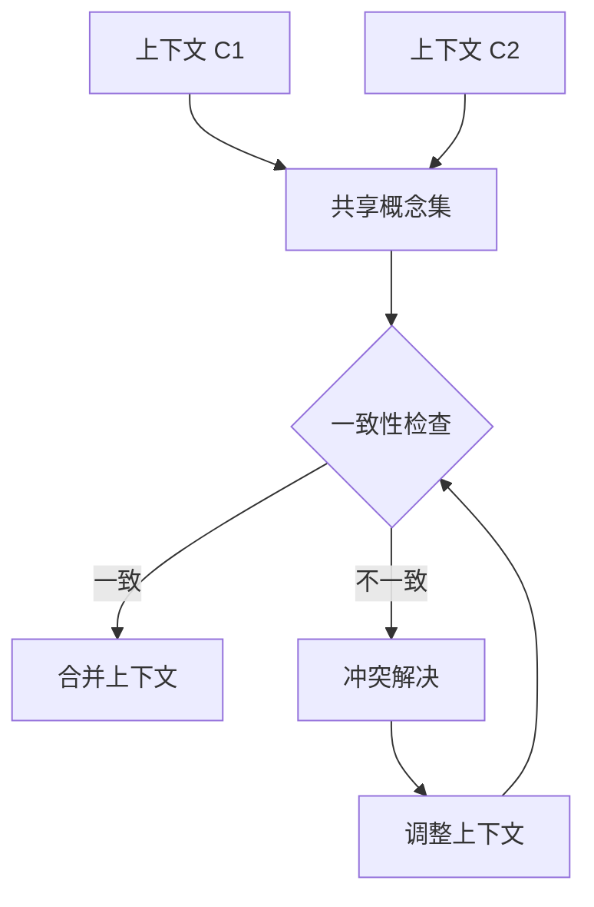

## 4. 上下文动态可视化

### 4.1 上下文演化时序图

展示上下文随时间演化的时序图：

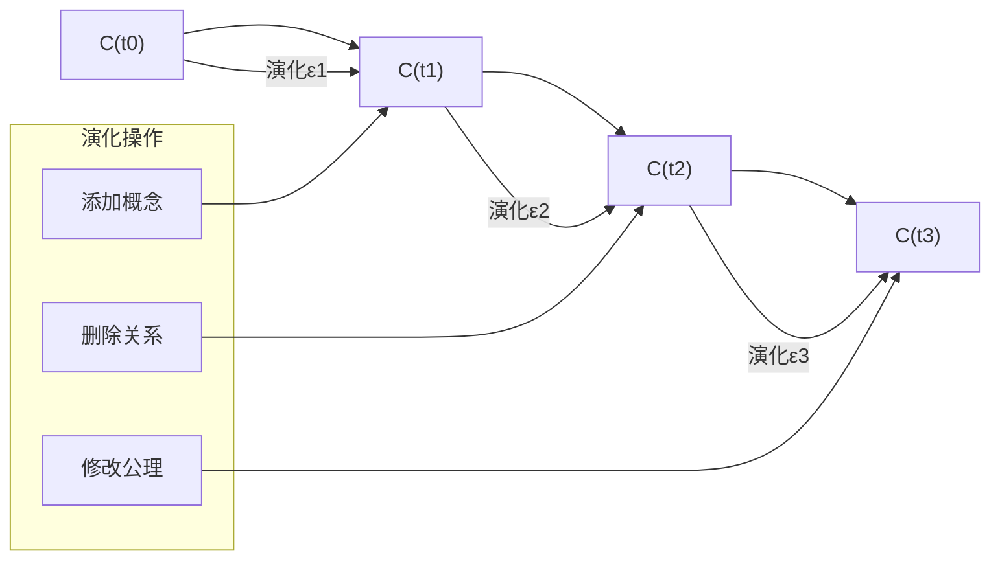

### 4.2 上下文状态转换图

展示上下文在不同状态间转换的状态图：

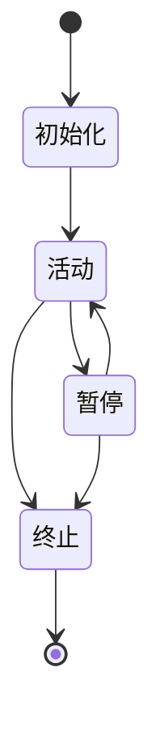

## 5. 理论整合可视化

### 5.1 理论映射图

展示不同理论如何通过上下文系统整合：

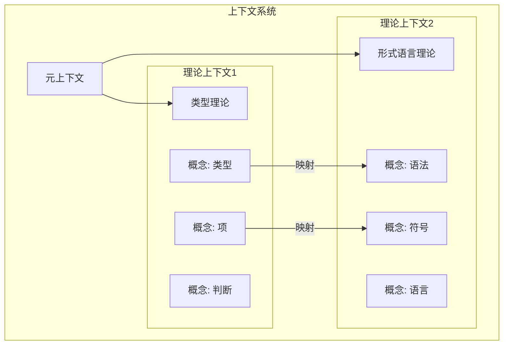

### 5.2 知识整合图

展示如何使用上下文系统整合不同领域的知识：

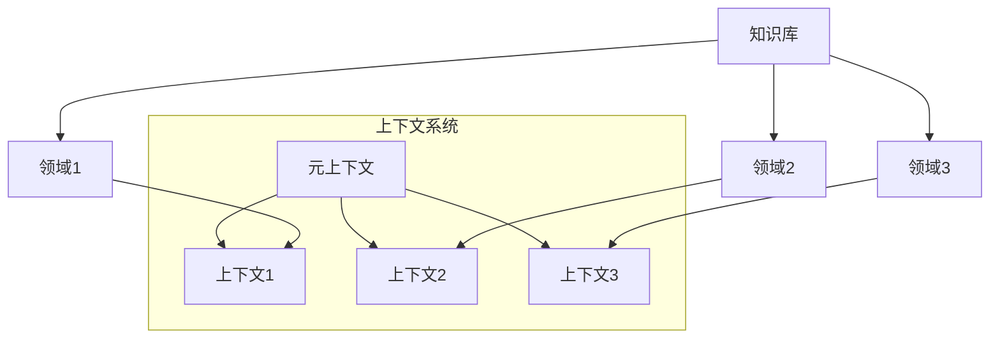

## 6. 应用场景可视化

### 6.1 问题求解流程

展示使用上下文系统解决问题的流程：

### 6.2 上下文切换流程

展示系统在不同上下文间切换的流程：

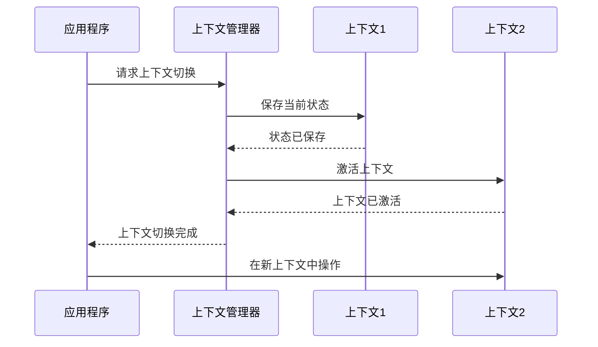

## 7. 实现技术

### 7.1 静态可视化技术

- **图表库**: D3.js, Chart.js, Plotly
- **图形格式**: SVG, PNG, PDF
- **工具**: Graphviz, Mermaid, PlantUML

### 7.2 交互式可视化技术

- **Web技术**: Three.js, WebGL
- **应用框架**: React, Vue.js
- **交互方式**: 缩放、平移、过滤、详情查看

### 7.3 动态可视化技术

- **动画库**: GSAP, Anime.js
- **时序展示**: 时间轴、进度条
- **状态转换**: 淡入淡出、形态变换

## 8. 可视化最佳实践

1. **简洁性**: 避免视觉混乱，聚焦关键信息
2. **一致性**: 使用一致的视觉语言和符号系统
3. **层次性**: 提供不同层次的细节展示
4. **交互性**: 允许用户探索和操作可视化内容
5. **可扩展性**: 设计能够适应数据量增长的可视化方案

## 9. 案例展示

### 9.1 形式科学理论整合案例

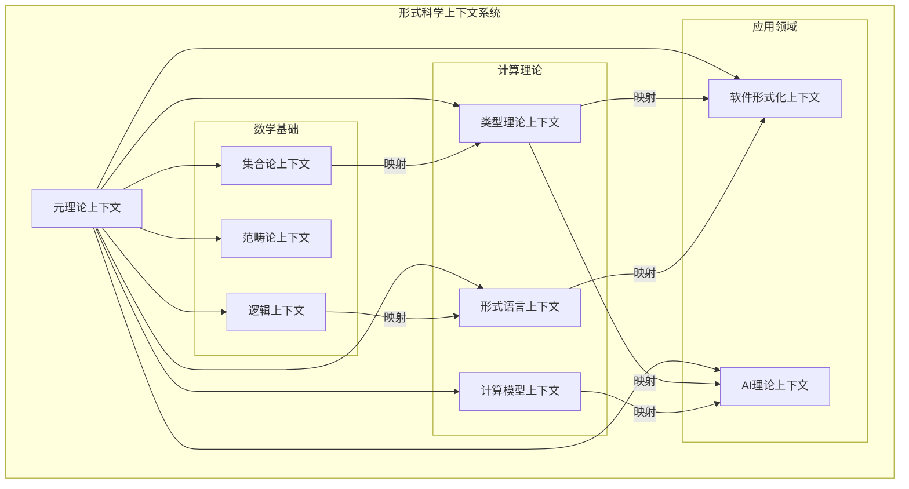

### 9.2 上下文转换案例

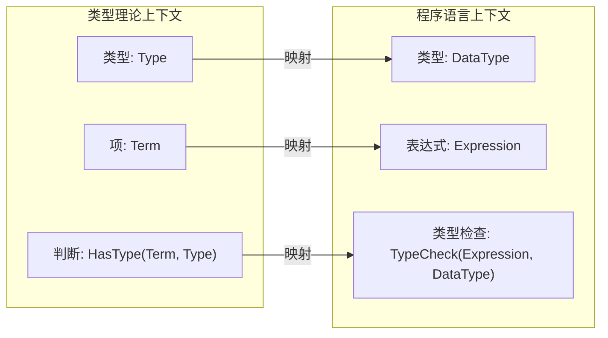

## 10. 未来发展方向

1. **3D可视化**: 开发三维空间中的上下文系统可视化
2. **虚拟现实**: 在VR/AR环境中探索上下文系统
3. **实时协作**: 多用户同时交互的上下文系统可视化
4. **智能布局**: 使用AI优化上下文系统的视觉布局
5. **自适应视图**: 根据用户需求和设备能力调整可视化方式

---

**维护者**: 形式科学重构团队  
**工具依赖**: Mermaid.js, D3.js, Graphviz

## 批判性分析

- 本节内容待补充：请从多元理论视角、局限性、争议点、应用前景等方面进行批判性分析。
