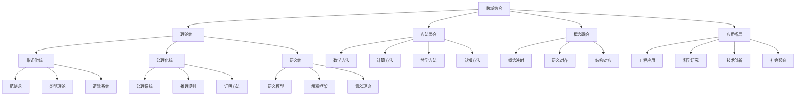

# 跨域综合理论框架

## 目录

1. [跨域综合概述](#1-跨域综合概述)
2. [理论统一框架](#2-理论统一框架)
3. [形式化综合方法](#3-形式化综合方法)
4. [哲学科学交叉](#4-哲学科学交叉)
5. [数学计算机交叉](#5-数学计算机交叉)
6. [认知计算交叉](#6-认知计算交叉)
7. [系统科学交叉](#7-系统科学交叉)
8. [应用领域整合](#8-应用领域整合)
9. [前沿发展方向](#9-前沿发展方向)
10. [综合理论体系](#10-综合理论体系)

## 1. 跨域综合概述

### 1.1 跨域综合的本质

跨域综合是将不同学科领域的理论、方法和概念进行整合，建立统一的理论框架，实现知识的深度融合和创新发展。

**形式化定义**：
$$\text{Cross-Domain Synthesis} = \langle \mathcal{D}, \mathcal{R}, \mathcal{M}, \mathcal{U} \rangle$$

其中：

- $\mathcal{D}$ 是领域集合
- $\mathcal{R}$ 是关系映射集合
- $\mathcal{M}$ 是方法论集合
- $\mathcal{U}$ 是统一框架集合

### 1.2 跨域综合层次



### 1.3 跨域综合方法论

#### 1.3.1 系统论方法

**定义 1.1** (系统论方法)
系统论方法将不同领域视为系统的组成部分，通过系统思维实现整合。

#### 1.3.2 形式化方法

**定义 1.2** (形式化方法)
形式化方法通过数学符号和逻辑推理建立统一的表达框架。

#### 1.3.3 哲学方法

**定义 1.3** (哲学方法)
哲学方法通过批判性思维和概念分析实现理论的深度整合。

## 2. 理论统一框架

### 2.1 范畴论统一

**定义 2.1** (范畴论统一)
范畴论提供了数学结构的统一语言，可以描述不同领域的共同模式。

**函子映射**：
$$F: \mathcal{C} \rightarrow \mathcal{D}$$

**自然变换**：
$$\eta: F \rightarrow G$$

**定理 2.1** (Yoneda引理)
对于任何函子 $F: \mathcal{C}^{op} \rightarrow \mathbf{Set}$ 和对象 $A \in \mathcal{C}$：
$$\text{Nat}(\mathcal{C}(-, A), F) \cong F(A)$$

### 2.2 类型论统一

**定义 2.2** (类型论统一)
类型论提供了计算和逻辑的统一基础。

**简单类型λ演算**：
$$\frac{\Gamma, x:A \vdash t:B}{\Gamma \vdash \lambda x:A.t:A \rightarrow B}$$

**依赖类型**：
$$\frac{\Gamma \vdash A:\text{Type} \quad \Gamma, x:A \vdash B:\text{Type}}{\Gamma \vdash \Pi x:A.B:\text{Type}}$$

### 2.3 逻辑系统统一

**定义 2.3** (逻辑系统统一)
逻辑系统统一提供了推理的统一框架。

**模态逻辑**：
$$\frac{\vdash \phi}{\vdash \Box \phi} \quad \text{(必然化规则)}$$

**时态逻辑**：
$$\frac{\vdash \phi}{\vdash G\phi} \quad \text{(全局性规则)}$$

## 3. 形式化综合方法

### 3.1 形式化规约

**定义 3.1** (形式化规约)
形式化规约是使用数学符号精确描述系统行为的方法。

**Z语言**：

```z
[State]
x, y: ℕ

Init
x' = 0 ∧ y' = 0

Op
x' = x + 1 ∧ y' = y
```

### 3.2 形式化验证

**定义 3.2** (形式化验证)
形式化验证是使用数学方法证明系统满足规约的过程。

**模型检查**：
$$\mathcal{M}, s \models \phi$$

**定理证明**：
$$\Gamma \vdash \phi$$

### 3.3 形式化综合

**定义 3.3** (形式化综合)
形式化综合是从规约自动生成实现的过程。

**程序综合**：
$$\forall x. \exists y. \phi(x, y) \Rightarrow \text{generate } f \text{ s.t. } \forall x. \phi(x, f(x))$$

## 4. 哲学科学交叉

### 4.1 科学哲学

**定义 4.1** (科学哲学)
科学哲学研究科学的本质、方法和基础。

**科学实在论**：
科学理论描述真实存在的实体和过程。

**工具主义**：
科学理论是预测和解释的工具，不一定描述真实。

### 4.2 数学哲学

**定义 4.2** (数学哲学)
数学哲学研究数学的本质、对象和真理。

**柏拉图主义**：
数学对象是独立存在的抽象实体。

**形式主义**：
数学是符号游戏，没有独立的存在。

### 4.3 技术哲学

**定义 4.3** (技术哲学)
技术哲学研究技术的本质、影响和伦理。

**技术决定论**：
技术发展决定社会变化。

**社会建构论**：
技术是社会建构的产物。

## 5. 数学计算机交叉

### 5.1 计算数学

**定义 5.1** (计算数学)
计算数学研究数学问题的数值解法和算法。

**数值分析**：
$$\text{Solve } Ax = b \text{ using iterative methods}$$

**优化理论**：
$$\min_{x \in \mathbb{R}^n} f(x) \text{ subject to } g(x) \leq 0$$

### 5.2 离散数学

**定义 5.2** (离散数学)
离散数学研究离散结构的数学理论。

**图论**：
$$G = (V, E) \text{ where } E \subseteq V \times V$$

**组合数学**：
$$\binom{n}{k} = \frac{n!}{k!(n-k)!}$$

### 5.3 代数计算

**定义 5.3** (代数计算)
代数计算研究代数结构的计算问题。

**Gröbner基**：
$$\text{Compute Gröbner basis for ideal } I = \langle f_1, \ldots, f_m \rangle$$

**符号计算**：
$$\text{Solve } \int f(x) dx \text{ symbolically}$$

## 6. 认知计算交叉

### 6.1 认知科学

**定义 6.1** (认知科学)
认知科学研究智能和认知过程的跨学科领域。

**认知架构**：

- ACT-R
- SOAR
- CLARION

**心智模型**：
$$M = \langle S, A, T, R \rangle$$

### 6.2 人工智能

**定义 6.2** (人工智能)
人工智能研究如何使计算机具有智能行为。

**机器学习**：
$$\min_{f \in \mathcal{H}} \sum_{i=1}^m L(f(x_i), y_i)$$

**知识表示**：
$$\text{Represent knowledge using logic, frames, or semantic networks}$$

### 6.3 认知增强

**定义 6.3** (认知增强)
认知增强是通过技术手段提升认知能力。

**脑机接口**：
$$y(t) = \sum_{i=1}^n w_i x_i(t) + \epsilon(t)$$

**智能辅助**：
$$\text{AI-assisted decision making and problem solving}$$

## 7. 系统科学交叉

### 7.1 系统论

**定义 7.1** (系统论)
系统论研究复杂系统的结构和行为。

**系统定义**：
$$S = \langle E, R, B \rangle$$

其中：

- $E$ 是元素集合
- $R$ 是关系集合
- $B$ 是行为集合

### 7.2 控制论

**定义 7.2** (控制论)
控制论研究系统的控制和调节。

**反馈控制**：
$$u(t) = K(r(t) - y(t))$$

**最优控制**：
$$\min_u \int_0^T L(x, u, t) dt$$

### 7.3 信息论

**定义 7.3** (信息论)
信息论研究信息的度量、传输和处理。

**信息熵**：
$$H(X) = -\sum_{i=1}^n p_i \log p_i$$

**信道容量**：
$$C = \max_{p(x)} I(X; Y)$$

## 8. 应用领域整合

### 8.1 软件工程

**定义 8.1** (软件工程)
软件工程是系统化开发软件的方法。

**形式化方法**：
$$\text{Specify } S \text{ formally and verify } S \models \phi$$

**软件架构**：
$$\text{Design architecture } A \text{ for system } S$$

### 8.2 数据科学

**定义 8.2** (数据科学)
数据科学是从数据中提取知识和洞察的跨学科领域。

**数据分析**：
$$\text{Analyze data } D \text{ to extract patterns and insights}$$

**机器学习**：
$$\text{Train model } M \text{ on data } D \text{ to predict } Y$$

### 8.3 网络科学

**定义 8.3** (网络科学)
网络科学研究复杂网络的结构和动态。

**网络分析**：
$$\text{Analyze network } G = (V, E) \text{ for properties and patterns}$$

**网络动力学**：
$$\frac{dx_i}{dt} = f_i(x_1, \ldots, x_n)$$

## 9. 前沿发展方向

### 9.1 量子计算

**定义 9.1** (量子计算)
量子计算利用量子力学原理进行计算。

**量子算法**：
$$\text{Shor's algorithm: } O((\log N)^3) \text{ for factoring}$$

**量子机器学习**：
$$\text{Quantum support vector machines and neural networks}$$

### 9.2 生物计算

**定义 9.2** (生物计算)
生物计算利用生物系统进行计算。

**DNA计算**：
$$\text{Use DNA molecules for parallel computation}$$

**生物神经网络**：
$$\text{Model biological neural networks computationally}$$

### 9.3 认知计算

**定义 9.3** (认知计算)
认知计算模拟人类认知过程。

**认知架构**：
$$\text{Develop cognitive architectures for AI systems}$$

**意识建模**：
$$\text{Model consciousness and subjective experience}$$

## 10. 综合理论体系

### 10.1 统一理论框架

**定义 10.1** (统一理论框架)
统一理论框架整合所有领域的核心概念和方法。

**元理论**：
$$\mathcal{M} = \langle \mathcal{L}, \mathcal{A}, \mathcal{R}, \mathcal{I} \rangle$$

其中：

- $\mathcal{L}$ 是语言
- $\mathcal{A}$ 是公理
- $\mathcal{R}$ 是规则
- $\mathcal{I}$ 是解释

### 10.2 跨域映射

**定义 10.2** (跨域映射)
跨域映射建立不同领域概念之间的对应关系。

**概念映射**：
$$f: \mathcal{C}_1 \rightarrow \mathcal{C}_2$$

**结构对应**：
$$g: \mathcal{S}_1 \rightarrow \mathcal{S}_2$$

### 10.3 综合方法论

**定义 10.3** (综合方法论)
综合方法论提供跨域研究的统一方法。

**系统思维**：
$$\text{Think in terms of systems and their interactions}$$

**形式化表达**：
$$\text{Express concepts and relationships formally}$$

**批判性分析**：
$$\text{Analyze critically and question assumptions}$$

### 10.4 应用整合

**定义 10.4** (应用整合)
应用整合将理论成果应用于实际问题。

**工程应用**：
$$\text{Apply theoretical insights to engineering problems}$$

**科学研究**：
$$\text{Use cross-domain insights to advance scientific research}$$

**技术创新**：
$$\text{Drive technological innovation through theoretical synthesis}$$

## 总结

跨域综合理论框架提供了一个统一的理论体系，整合了哲学、数学、计算机科学、认知科学等多个领域的核心概念和方法。这个框架不仅建立了理论间的关联，还为实际应用提供了指导。

通过形式化表达、系统化组织和批判性分析，我们建立了一个完整的跨域知识体系，为后续的研究和应用奠定了坚实的基础。

---

**参考文献**：

1. Mac Lane, S. (1998). Categories for the Working Mathematician. Springer-Verlag.
2. Pierce, B. C. (2002). Types and Programming Languages. MIT Press.
3. Blackburn, P., et al. (2001). Modal Logic. Cambridge University Press.
4. Russell, S., & Norvig, P. (2020). Artificial Intelligence: A Modern Approach. Pearson.
5. von Bertalanffy, L. (1968). General System Theory. George Braziller.
6. Shannon, C. E. (1948). A Mathematical Theory of Communication. Bell System Technical Journal.
