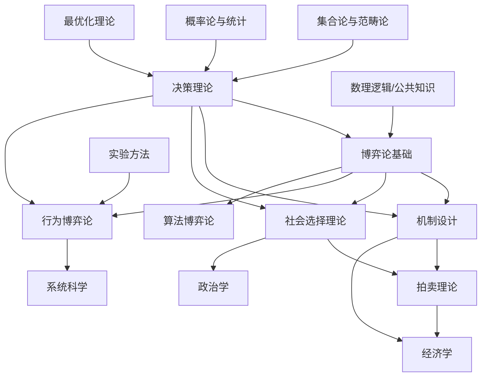

# 00_目录与导航

---

## 1. 完整目录树

```
12_决策与博弈论/
├── README.md                                    # 模块概述与导航
├── 00_目录与导航.md                              # 本文档
├── 01_决策理论基础.md                            # 效用理论与风险决策
│   ├── 1.1 偏好理论
│   ├── 1.2 效用函数
│   ├── 1.3 风险决策理论
│   ├── 1.4 不确定性决策
│   └── 1.5 多属性决策
├── 02_博弈论基础.md                              # 策略博弈与均衡
│   ├── 2.1 博弈表示法
│   ├── 2.2 策略与收益
│   ├── 2.3 纳什均衡
│   ├── 2.4 均衡精炼
│   └── 2.5 博弈分类体系
├── 03_机制设计.md                                # 激励与机制
│   ├── 3.1 机制设计基础
│   ├── 3.2 激励相容
│   ├── 3.3 显示原理
│   ├── 3.4 效率与预算平衡
│   └── 3.5 典型机制设计
├── 04_社会选择理论.md                            # 投票与聚合
│   ├── 4.1 社会福利函数
│   ├── 4.2 投票规则
│   ├── 4.3 阿罗不可能定理
│   ├── 4.4 不可能定理的规避
│   └── 4.5 计算社会选择
├── 05_拍卖理论.md                                # 拍卖机制
│   ├── 5.1 拍卖类型
│   ├── 5.2 拍卖设计
│   ├── 5.3 收益等价定理
│   ├── 5.4 最优拍卖
│   └── 5.5 多物品拍卖
└── 06_行为博弈论.md                              # 有限理性与实验
    ├── 6.1 有限理性模型
    ├── 6.2 学习模型
    ├── 6.3 实验方法论
    ├── 6.4 行为异常
    └── 6.5 神经经济学
```

---

## 2. 知识依赖图



---

## 3. 概念索引表

### 3.1 A-D

| 概念 | 定义 | 主要文档 | 交叉引用 |
|:-----|:-----|:---------|:---------|
| **Action (行动)** | 参与者在博弈中可选择的操作 | 02 | 6.1 |
| **Adverse Selection (逆向选择)** | 信息不对称导致的市场失灵 | 03 | 5.2 |
| **All-Pay Auction (全支付拍卖)** | 所有 bidder 都支付其出价的拍卖 | 05 | 3.3 |
| **Analytic Hierarchy Process (AHP)** | 层次分析法用于多属性决策 | 01 | 1.5 |
| **Arrow's Impossibility Theorem** | 满足四条件的社会福利函数不存在 | 04 | 4.3 |
| **Auction (拍卖)** | 通过竞价分配物品的市场机制 | 05 | 3.5 |
| **Backward Induction (逆向归纳)** | 从终点向前求解动态博弈 | 02 | 2.4 |
| **Bargaining (讨价还价)** | 双方协商分配剩余的过程 | 02 | 2.5 |
| **Bayesian Game (贝叶斯博弈)** | 具有不完全信息的博弈 | 02 | 2.5 |
| **Bayesian Nash Equilibrium** | 不完全信息博弈的均衡概念 | 02 | 2.5 |
| **Behavioral Game Theory** | 考虑心理因素的博弈理论 | 06 | 全文 |
| **Best Response (最优反应)** | 对其他策略的最佳应对 | 02 | 2.3 |
| **Budget Balance (预算平衡)** | 支付总和为零的机制性质 | 03 | 3.4 |
| **Centipede Game (蜈蚣博弈)** | 测试逆向归纳的经典博弈 | 06 | 6.4 |
| **Chicken Game (胆小鬼博弈)** | 协调与冲突的混合博弈 | 02 | 2.2 |
| **Common Knowledge (公共知识)** | 所有人知道且知道所有人知道 | 02 | 2.1 |
| **Complete Information (完全信息)** | 所有参与者了解博弈结构 | 02 | 2.1 |
| **Condorcet Cycle (孔多塞循环)** | 多数投票的非传递性 | 04 | 4.2 |
| **Condorcet Winner (孔多塞胜者)** | 能击败所有其他选项的候选 | 04 | 4.2 |
| **Cooperative Game (合作博弈)** | 允许 binding agreement 的博弈 | 02 | 2.5 |
| **Coordination Game (协调博弈)** | 参与者利益一致的博弈 | 02 | 2.2 |
| **Core (核心)** | 合作博弈中的稳定分配集合 | 02 | 2.5 |
| **Correlated Equilibrium (相关均衡)** | 通过信号协调的均衡 | 02 | 2.4 |
| **Cost Sharing (成本分摊)** | 共同成本的分担机制 | 03 | 3.5 |
| **Decision Theory (决策理论)** | 研究理性选择的理论 | 01 | 全文 |
| **Dictatorship (独裁)** | 由单个个体决定结果的社会选择 | 04 | 4.3 |
| **Direct Mechanism (直接机制)** | 参与者直接报告类型的机制 | 03 | 3.3 |
| **Discount Factor (折现因子)** | 未来收益的时间折现 | 02 | 2.5 |
| **Dominant Strategy (占优策略)** | 无论对手如何选择都是最优 | 02 | 2.2 |
| **Dutch Auction (荷兰式拍卖)** | 价格递减的拍卖方式 | 05 | 5.1 |

### 3.2 E-H

| 概念 | 定义 | 主要文档 | 交叉引用 |
|:-----|:-----|:---------|:---------|
| **Efficiency (效率)** | 社会剩余最大化的资源配置 | 03 | 3.4 |
| **English Auction (英式拍卖)** | 价格递增的公开拍卖 | 05 | 5.1 |
| **Equilibrium Refinement (均衡精炼)** | 缩小均衡集合的方法 | 02 | 2.4 |
| **Evolutionary Game Theory** | 研究策略进化的博弈论分支 | 06 | 6.2 |
| **Expected Utility (期望效用)** | 概率加权效用之和 | 01 | 1.2 |
| **Ex Post/Interim/Ex Ante** | 事后/事中/事前的信息阶段 | 03 | 3.1 |
| **Extensive Form (扩展式)** | 用博弈树表示动态博弈 | 02 | 2.1 |
| **First-Price Auction (一价拍卖)** | 最高出价者以其出价支付 | 05 | 5.1 |
| **Folk Theorem (无名氏定理)** | 重复博弈中可实现的合作结果 | 02 | 2.5 |
| **Game Tree (博弈树)** | 表示序贯博弈的树形结构 | 02 | 2.1 |
| **Gibbard-Satterthwaite Theorem** | 策略证明的社会选择函数 | 04 | 4.3 |
| **Glove Game (手套博弈)** | 合作博弈的经典例子 | 02 | 2.5 |
| **Grim Trigger Strategy (冷酷触发)** | 一旦背叛永远惩罚的策略 | 02 | 2.5 |

### 3.3 I-P

| 概念 | 定义 | 主要文档 | 交叉引用 |
|:-----|:-----|:---------|:---------|
| **IC (激励相容)** | 真实报告是最优策略 | 03 | 3.2 |
| **Incomplete Information** | 参与者不了解某些博弈要素 | 02 | 2.5 |
| **Independence of Irrelevant Alternatives** | 无关选项的独立性 | 04 | 4.3 |
| **Information Set (信息集)** | 参与者无法区分的决策节点 | 02 | 2.1 |
| **Interdependent Values** | 价值依赖于他人信息的拍卖 | 05 | 5.2 |
| **IR (个体理性)** | 参与者的参与约束 | 03 | 3.2 |
| **Learning in Games (博弈中的学习)** | 参与者如何调整策略 | 06 | 6.2 |
| **Level-k Thinking (k层推理)** | 有限理性的迭代推理模型 | 06 | 6.1 |
| **Lottery (彩票)** | 结果不确定的选项 | 01 | 1.2 |
| **Majority Voting (多数投票)** | 获得最多票数的选项胜出 | 04 | 4.2 |
| **Matching (匹配)** | 双边市场中的配对问题 | 03 | 3.5 |
| **Mechanism Design (机制设计)** | 设计激励相容的规则 | 03 | 全文 |
| **Mixed Strategy (混合策略)** | 纯策略上的概率分布 | 02 | 2.2 |
| **Myerson's Optimal Auction** | 虚拟价值最大化的最优拍卖 | 05 | 5.4 |
| **Nash Equilibrium (纳什均衡)** | 相互最优反应的策略组合 | 02 | 2.3 |
| **Normal Form (标准式)** | 用矩阵表示策略博弈 | 02 | 2.1 |
| **Pareto Efficiency (帕累托效率)** | 无法在不损害他人下改进任何人 | 03 | 3.4 |
| **Perfect Bayesian Equilibrium** | 不完全信息动态博弈的均衡 | 02 | 2.4 |
| **Perfect Information (完美信息)** | 所有参与者了解所有先前行动 | 02 | 2.1 |
| **Pivot Mechanism (关键机制)** | VCG机制的特殊形式 | 03 | 3.5 |
| **Pooling Equilibrium (混同均衡)** | 不同类型选择相同行动 | 02 | 2.4 |
| **Preference Relation (偏好关系)** | 选择之间的二元关系 | 01 | 1.1 |
| **Principal-Agent (委托代理)** | 信息不对称下的契约设计 | 03 | 3.5 |
| **Prisoner's Dilemma (囚徒困境)** | 个体理性导致集体非最优 | 02 | 2.2 |
| **Private Values (私人价值)** | 价值独立于他人信息 | 05 | 5.2 |
| **Probability Weighting (概率权重)** | 前景理论中的概率转换 | 01 | 1.4 |
| **Proper Equilibrium (适当均衡)** | 颤抖手均衡的进一步精炼 | 02 | 2.4 |
| **Prospect Theory (前景理论)** | 描述性决策理论 | 01 | 1.4 |
| **Public Good (公共品)** | 非排他非竞争的物品 | 03 | 3.5 |

### 3.4 Q-Z

| 概念 | 定义 | 主要文档 | 交叉引用 |
|:-----|:-----|:---------|:---------|
| **Quantal Response Equilibrium** | 带有噪声的最优反应均衡 | 06 | 6.1 |
| **Quasi-linear Utility (拟线性效用)** | 货币支付线性进入的效用 | 03 | 3.1 |
| **Repeated Game (重复博弈)** | 相同博弈重复进行多次 | 02 | 2.5 |
| **Revelation Principle (显示原理)** | 任何机制等价于直接机制 | 03 | 3.3 |
| **Risk Aversion (风险厌恶)** | 偏好确定结果胜过期望相等的风险结果 | 01 | 1.3 |
| **Score Auction (计分拍卖)** | 基于多维标准的拍卖 | 05 | 5.5 |
| **Screening (筛选)** | 通过菜单设计获取信息 | 03 | 3.5 |
| **Second-Price Auction (二价拍卖)** | 最高出价者以次高价支付 | 05 | 5.1 |
| **Separating Equilibrium (分离均衡)** | 不同类型选择不同行动 | 02 | 2.4 |
| **Sequential Equilibrium (序贯均衡)** | 动态博弈的均衡精炼 | 02 | 2.4 |
| **Shapley Value (夏普利值)** | 合作博弈的公平分配方案 | 02 | 2.5 |
| **Signaling (信号传递)** | 通过行动传递私人信息 | 03 | 3.5 |
| **Social Choice Function** | 将偏好映射到结果的函数 | 04 | 4.1 |
| **Social Welfare (社会福利)** | 整体福利的度量 | 03 | 3.4 |
| **Stag Hunt (猎鹿博弈)** | 风险占优与收益占优的冲突 | 02 | 2.2 |
| **Strategic Form (策略式)** | 同 Normal Form | 02 | 2.1 |
| **Strategy-proofness (防策略性)** | 真实报告占优策略 | 04 | 4.3 |
| **Subgame Perfect Equilibrium** | 子博弈完美的均衡 | 02 | 2.4 |
| **Subjective Expected Utility** | Savage的主观期望效用理论 | 01 | 1.4 |
| **Tit-for-Tat (以牙还牙)** | 模仿对手上一轮策略 | 02 | 2.5 |
| **Trembling Hand Perfection** | 考虑小概率错误的均衡精炼 | 02 | 2.4 |
| **Trigger Strategy (触发策略)** | 基于历史的惩罚策略 | 02 | 2.5 |
| **Type (类型)** | 参与者的私人特征 | 03 | 3.1 |
| **Utility Function (效用函数)** | 偏好的数值表示 | 01 | 1.2 |
| **VCG Mechanism** | Vickrey-Clarke-Groves机制 | 03 | 3.5 |
| **Virtual Value (虚拟价值)** | 最优拍卖中的调整价值 | 05 | 5.4 |
| **Voting Rule (投票规则)** | 聚合偏好的方法 | 04 | 4.2 |
| **Vickrey Auction (维克里拍卖)** | 同Second-Price Auction | 05 | 5.1 |
| **Walrasian Equilibrium** | 供需均衡的市场价格 | 03 | 3.5 |
| **Winner's Curse (赢者诅咒)** | 赢得拍卖意味着出价过高 | 05 | 5.2 |
| **Zero-Sum Game (零和博弈)** | 收益总和恒为零的博弈 | 02 | 2.5 |

---

## 4. 定理索引

| 定理 | 编号 | 所在文档 | 关键假设 | 主要结论 |
|:-----|:----:|:---------|:---------|:---------|
| 冯·诺依曼-摩根斯坦期望效用定理 | Thm 1.1 | 01 | 理性偏好公理 | 偏好可表示为期望效用 |
| 阿莱悖论定理 | Thm 1.2 | 01 | 实验证据 | EU理论存在系统性偏差 |
| 纳什存在性定理 | Thm 2.1 | 02 | 有限博弈 | 至少存在一个纳什均衡 |
| 极大极小定理 | Thm 2.2 | 02 | 零和博弈 | 存在值且策略最优 |
| 显示原理 | Thm 3.1 | 03 | 贝叶斯纳什均衡 | 任何机制等价于直接机制 |
| 格林-拉芬特不可能定理 | Thm 3.2 | 03 | 拟线性环境 | 效率与预算平衡不可兼得 |
| 阿罗不可能定理 | Thm 4.1 | 04 | 四条件 | 社会福利函数不存在 |
| 吉伯德-萨特思韦特定理 | Thm 4.2 | 04 | 策略证明性 | 只有独裁满足条件 |
| 收益等价定理 | Thm 5.1 | 05 | 标准拍卖假设 | 标准拍卖期望收益相同 |
| 迈尔森最优拍卖定理 | Thm 5.2 | 05 | 独立私人价值 | 虚拟价值最大化 |
| 无名氏定理 | Thm 2.3 | 02 | 无限重复博弈 | 合作结果可实现 |
| 夏普利值唯一性定理 | Thm 2.4 | 02 | 合作博弈 | 夏普利值满足四条公理 |

---

## 5. 公式速查表

### 5.1 决策理论

```
期望效用:           EU(f) = Σᵢ pᵢ·u(xᵢ)

确定性等价:         u(CE) = EU(f) ⟹ CE = u⁻¹(EU(f))

风险溢价:           RP = EV - CE

阿罗-普拉特系数:    R_A(x) = -u''(x)/u'(x)
                    R_R(x) = -x·u''(x)/u'(x)

前景理论:           V(f) = Σᵢ π(pᵢ)·v(xᵢ)
                    v: 价值函数, π: 概率权重函数
```

### 5.2 博弈论

```
纳什均衡:           σᵢ* ∈ BRᵢ(σ*₋ᵢ), ∀i ∈ N
                    即: uᵢ(σ*) ≥ uᵢ(aᵢ, σ*₋ᵢ), ∀aᵢ ∈ Aᵢ

混合策略期望收益:   uᵢ(σ) = Σ_{a∈A} (Πⱼ σⱼ(aⱼ))·uᵢ(a)

子博弈完美:         ∀子博弈 Γ', σ|Γ' 是 Γ' 的纳什均衡

贝叶斯纳什均衡:     σᵢ*(θᵢ) ∈ argmax E_{θ₋ᵢ}[uᵢ(σᵢ, σ*₋ᵢ(θ₋ᵢ); θ)|θᵢ]
```

### 5.3 机制设计

```
激励相容:           E_{θ₋ᵢ}[uᵢ(x(θ), t(θ); θ)|θᵢ] ≥ E_{θ₋ᵢ}[uᵢ(x(θ'ᵢ,θ₋ᵢ), t(θ'ᵢ,θ₋ᵢ); θ)|θᵢ]
                    ∀i, ∀θᵢ, ∀θ'ᵢ

个体理性:           E_{θ₋ᵢ}[uᵢ(x(θ), t(θ); θ)|θᵢ] ≥ uᵢ(0, 0; θᵢ)

VCG支付:            tᵢ(θ) = hᵢ(θ₋ᵢ) - Σ_{j≠i} vⱼ(x*(θ), θⱼ)

虚拟价值:           ψᵢ(vᵢ) = vᵢ - (1-Fᵢ(vᵢ))/fᵢ(vᵢ)
```

### 5.4 社会选择

```
社会福利函数:       f: Lⁿ → L  (从偏好组合到社会偏好)

孔多塞胜者:         c 是孔多塞胜者 ⟺ ∀b≠c: |{i: c ≻ᵢ b}| > n/2

波达计数:           Score(x) = Σᵢ rankᵢ(x)

夏普利-舒比克权力指数: φᵢ = Σ_{S⊆N, i∈S} (|S|-1)!(n-|S|)!/n! · [v(S)-v(S\{i})]
```

---

## 6. 对比矩阵索引

| 对比主题 | 位置 | 对比维度 |
|:---------|:-----|:---------|
| 效用函数类型 | 01_1.2.4 | 线性/对数/指数/幂函数 |
| 风险态度 | 01_1.3.3 | 厌恶/中性/偏好 |
| 决策理论范式 | 01_1.5 | 规范性vs描述性 |
| 博弈表示法 | 02_2.1.4 | 标准式vs扩展式vs特征式 |
| 均衡概念 | 02_2.4.5 | NE/SPE/PBE/CE等 |
| 博弈分类 | 02_2.5.6 | 合作/非合作、完全/不完全等 |
| 机制类型 | 03_3.5.6 | VCG/拍卖/匹配/成本分摊 |
| 投票规则 | 04_4.2.5 | 多数/波达/孔多塞/认可 |
| 不可能定理 | 04_4.3.4 | 阿罗/GS/森等 |
| 拍卖类型 | 05_5.1.5 | 英式/荷兰/一价/二价/全支付 |
| 收益比较 | 05_5.3.4 | 一价vs二价、公开vs密封 |
| 行为模型 | 06_6.1.3 | 认知层级/QRE/量化响应 |
| 学习模型 | 06_6.2.4 | 复制动态/虚拟行动/EWA |

---

## 7. 案例研究索引

| 案例 | 所属文档 | 涉及理论 | 应用领域 |
|:-----|:---------|:---------|:---------|
| 圣彼得堡悖论 | 01 | 期望效用 | 金融 |
| 阿莱悖论 | 01 | 前景理论 | 行为经济学 |
| 囚徒困境 | 02 | 纳什均衡 | 政治学 |
| 懦夫博弈 | 02 | 混合策略均衡 | 经济学 |
| 蜈蚣博弈 | 06 | 逆向归纳与行为 | 实验经济学 |
| 公地悲剧 | 03 | 机制设计 | 环境经济学 |
| VCG公共品机制 | 03 | 激励相容 | 公共经济学 |
| 频谱拍卖 | 05 | 组合拍卖 | 电信 |
| Google Ads | 05 | 广义二价拍卖 | 互联网 |
| 肾脏交换匹配 | 03 | 匹配理论 | 医疗 |
| 投票悖论 | 04 | 孔多塞循环 | 政治学 |
| 合作进化 | 06 | 演化博弈论 | 生物学 |

---

## 8. 符号表

### 8.1 通用符号

| 符号 | 含义 | 首次出现 |
|:-----|:-----|:---------|
| ℕ, ℝ | 自然数集、实数集 | 01 |
| Δ(X) | X上的概率分布集合 | 01 |
| ≻, ∼ | 严格偏好、无差异 | 01 |
| E[·] | 期望算子 | 01 |
| argmax | 使目标最大化的参数 | 02 |
| ∀, ∃ | 全称/存在量词 | 02 |
| ↔ | 当且仅当 | 02 |

### 8.2 博弈论专用

| 符号 | 含义 | 首次出现 |
|:-----|:-----|:---------|
| G = ⟨N, (Aᵢ), (uᵢ)⟩ | 标准式博弈 | 02 |
| σᵢ, Σᵢ | 混合策略、策略空间 | 02 |
| NE | 纳什均衡 | 02 |
| SPE | 子博弈完美均衡 | 02 |
| PBE | 完美贝叶斯均衡 | 02 |
| BRᵢ | 最优反应对应 | 02 |
| θᵢ, Θᵢ | 类型、类型空间 | 02 |
| h, H | 历史、历史集合 | 02 |

### 8.3 机制设计专用

| 符号 | 含义 | 首次出现 |
|:-----|:-----|:---------|
| (x, t) | 分配规则、支付规则 | 03 |
| IC | 激励相容 | 03 |
| IR | 个体理性 | 03 |
| VCG | Vickrey-Clarke-Groves | 03 |
| vᵢ | 估价/虚拟价值 | 05 |
| F, f | 分布函数、密度函数 | 05 |

---

**导航提示**: 使用 Ctrl+F 搜索关键词，或按章节结构浏览。每个文档包含详细的目录和交叉引用。
