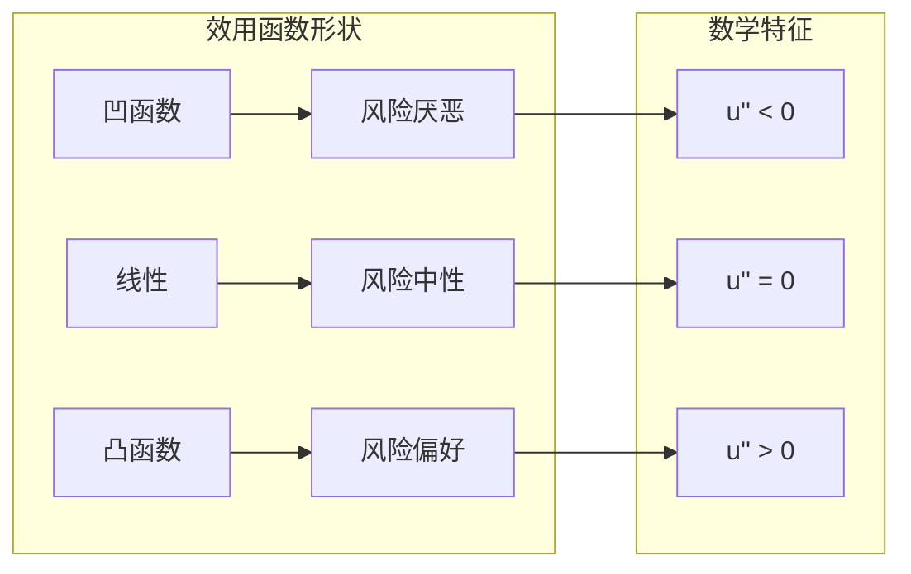

# 01_决策理论基础

---

## 目录

1. [偏好理论](#11-偏好理论)
   1.1 偏好关系的基本概念
   1.2 理性偏好公理
   1.3 偏好表示定理

2. [效用函数](#12-效用函数)
   2.1 效用函数的定义与存在性
   2.2 基数效用与序数效用
   2.3 常见的效用函数形式
   2.4 效用函数的对比矩阵

3. [风险决策理论](#13-风险决策理论)
   3.1 冯·诺依曼-摩根斯坦期望效用理论
   3.2 风险态度与效用函数
   3.3 风险度量方法
   3.4 圣彼得堡悖论与解决
   3.5 阿莱悖论与EU理论的局限

4. [不确定性决策](#14-不确定性决策)
   4.1 主观概率与贝叶斯决策
   4.2 Savage的SEU理论
   4.3 模糊性与Ellsberg悖论
   4.4 前景理论

5. [多属性决策](#15-多属性决策)
   5.1 多属性效用理论
   5.2 层次分析法(AHP)
   5.3 TOPSIS方法
   5.4 决策理论范式对比

---

## 1.1 偏好理论

### 1.1.1 偏好关系的基本概念

**定义 1.1.1 (偏好关系)**
设 $X$ 为选择集，偏好关系 $\succsim$ 是 $X \times X$ 上的二元关系，满足：

- $x \succsim y$：$x$ 至少与 $y$ 一样好
- $x \succ y$：$x$ 严格优于 $y$（$x \succsim y$ 且 $y \not\succsim x$）
- $x \sim y$：$x$ 与 $y$ 无差异（$x \succsim y$ 且 $y \succsim x$）

**定义 1.1.2 (偏好关系的性质)**
偏好关系 $\succsim$ 可具有以下性质：

| 性质 | 定义 | 数学表达 |
|:-----|:-----|:---------|
| **完备性** | 任意两个选项可比较 | $\forall x,y \in X: x \succsim y$ 或 $y \succsim x$ |
| **传递性** | 偏好具有一致性 | $x \succsim y, y \succsim z \Rightarrow x \succsim z$ |
| **自反性** | 任何选项与自身无差异 | $\forall x \in X: x \sim x$ |
| **反对称性** | 双向偏好意味着无差异 | $x \succsim y, y \succsim x \Rightarrow x \sim y$ |
| **连续性** | 偏好无突然跳跃 | $\{y: y \succsim x\}$ 和 $\{y: x \succsim y\}$ 是闭集 |
| **单调性** | 越多越好 | $x \geq y \Rightarrow x \succsim y$ |

### 1.1.2 理性偏好公理

**公理 1.1.1 (完备性公理)**
决策者能够对所有可选方案进行两两比较。

**公理 1.1.2 (传递性公理)**
决策者的偏好具有一致性，不存在循环偏好。

> **注**: 实验经济学发现，现实中的偏好常违反传递性，特别是在复杂选择或框架效应影响下。

**定义 1.1.3 (理性偏好)**
偏好关系 $\succsim$ 是**理性的**，当且仅当满足完备性和传递性。

**定理 1.1.1 (理性偏好存在效用表示)**
若 $X$ 是有限集或可数集，且 $\succsim$ 是理性的，则存在效用函数 $u: X \rightarrow \mathbb{R}$ 使得：
$$x \succsim y \Leftrightarrow u(x) \geq u(y)$$

**证明**:
对有限集 $X = \{x_1, ..., x_n\}$，可按偏好排序：$x_{(1)} \succsim x_{(2)} \succsim ... \succsim x_{(n)}$。
定义 $u(x_{(k)}) = n - k + 1$，则效用表示成立。 ∎

### 1.1.3 偏好表示定理

**定理 1.1.2 (Debreu表示定理, 1954)**
设 $X \subseteq \mathbb{R}^n$ 是连通集，若 $\succsim$ 是理性的且连续的，则存在**连续**效用函数 $u: X \rightarrow \mathbb{R}$ 表示该偏好。

> **重要性**: 该定理保证了在欧几里得空间中，理性连续偏好总可以用连续效用函数表示，为后续期望效用理论奠定基础。

---

## 1.2 效用函数

### 1.2.1 效用函数的定义与存在性

**定义 1.2.1 (效用函数)**
效用函数 $u: X \rightarrow \mathbb{R}$ 是偏好关系 $\succsim$ 的数值表示，满足：
$$x \succsim y \Leftrightarrow u(x) \geq u(y)$$

**性质 1.2.1 (效用函数的正单调变换不变性)**
若 $u$ 表示 $\succsim$，$\phi: \mathbb{R} \rightarrow \mathbb{R}$ 是严格递增函数，则 $\phi \circ u$ 也表示 $\succsim$。

> 这意味着效用函数是**序数**的：只有排序信息重要，绝对数值没有意义。

### 1.2.2 基数效用与序数效用

| 维度 | 序数效用 | 基数效用 |
|:-----|:---------|:---------|
| **信息** | 仅排序 | 排序+强度 |
| **变换** | 正单调变换 | 正仿射变换 ($\phi(u) = au + b, a > 0$) |
| **应用** | 确定性选择 | 风险决策、人际比较 |
| **可比性** | 仅组内 | 可跨个体(若假设) |
| **计算** | 相对排序 | 期望、差值有意义 |

### 1.2.3 常见的效用函数形式

**定义 1.2.2 (效用函数族)**

```
1. 线性效用:          u(x) = ax + b,  a > 0
                      → 风险中性

2. 对数效用 (CRRA):   u(x) = ln(x),   x > 0
                      → 相对风险厌恶系数恒为1

3. 幂效用 (CRRA):     u(x) = x^(1-γ)/(1-γ), γ ≠ 1
                      → 相对风险厌恶系数为 γ

4. 指数效用 (CARA):   u(x) = -e^(-ax)/a,  a > 0
                      → 绝对风险厌恶系数恒为 a

5. 二次效用:          u(x) = ax - bx²/2,  a, b > 0
                      → 递减绝对风险厌恶

6. Stone-Geary:       u(x) = (x - x̄)^α,  x > x̄
                      → 含生存水平 x̄
```

### 1.2.4 效用函数对比矩阵

| 效用函数 | 数学形式 | 风险态度 | 应用领域 | 优点 | 缺点 |
|:---------|:---------|:---------|:---------|:-----|:-----|
| **线性** | $ax+b$ | 中性 | 基础分析 | 简单 | 不现实 |
| **对数** | $\ln x$ | 厌恶 | 投资、增长 | 易处理 | 定义域限制 |
| **幂函数(CRRA)** | $\frac{x^{1-\gamma}}{1-\gamma}$ | γ可调 | 宏观、金融 | 灵活性 | 参数敏感 |
| **指数(CARA)** | $-e^{-ax}/a$ | 厌恶 | 保险、博弈 | 解析可解 | IARA(递增相对) |
| **二次** | $ax-bx²/2$ | 饱和 | 均值-方差 | 简单 | 可能递减 |

**概念图: 效用函数曲率与风险态度**



---

## 1.3 风险决策理论

### 1.3.1 冯·诺依曼-摩根斯坦期望效用理论

**定义 1.3.1 (简单彩票)**
简单彩票 $L = (p_1, x_1; ...; p_n, x_n)$ 表示以概率 $p_i$ 获得结果 $x_i$，其中 $\sum p_i = 1$。

**定义 1.3.2 (彩票空间)**
设 $\mathcal{L}$ 为所有简单彩票的集合，$\mathcal{L} = \Delta(X)$ 是 $X$ 上的概率分布集合。

**公理 1.3.1 (独立性公理 / 冯·诺依曼-摩根斯坦公理)**
偏好关系 $\succsim$ 在 $\mathcal{L}$ 上满足独立性，如果：
$$L \succsim L' \Leftrightarrow \alpha L + (1-\alpha)L'' \succsim \alpha L' + (1-\alpha)L''$$
对所有 $\alpha \in (0,1)$ 和 $L, L', L'' \in \mathcal{L}$ 成立。

> **直观**: 在两个彩票中混合第三个彩票不改变偏好顺序。

**公理 1.3.2 (连续性公理)**
若 $L \succsim L' \succsim L''$，则存在 $\alpha \in [0,1]$ 使得 $L' \sim \alpha L + (1-\alpha)L''$。

**定理 1.3.1 (von Neumann-Morgenstern期望效用定理, 1944)**
偏好关系 $\succsim$ 在 $\mathcal{L}$ 上是理性的且满足独立性和连续性，**当且仅当**存在期望效用函数 $U: \mathcal{L} \rightarrow \mathbb{R}$ 使得：
$$U(L) = \sum_{i=1}^{n} p_i u(x_i) = \mathbb{E}[u(X)]$$
且 $L \succsim L' \Leftrightarrow U(L) \geq U(L')$。

**证明概要**:

1. 构造性证明：定义 $u(x)$ 为 $x$ 相对于参考彩票的等价概率
2. 利用独立性公理证明线性性质
3. 利用连续性保证存在性

### 1.3.2 风险态度与效用函数

**定义 1.3.3 (确定性等价与风险溢价)**
对于彩票 $L$，其**确定性等价** $CE(L)$ 满足：
$$u(CE(L)) = U(L) = \mathbb{E}[u(X)]$$

**风险溢价** $RP(L)$ 定义为：
$$RP(L) = \mathbb{E}[X] - CE(L)$$

**定义 1.3.4 (风险态度分类)**

| 类型 | 定义 | 效用特征 | CE与EV关系 |
|:-----|:-----|:---------|:-----------|
| **风险厌恶** | 偏好确定结果 | $u$ 凹函数 ($u'' < 0$) | $CE < EV$ |
| **风险中性** | 只关心期望值 | $u$ 线性 ($u'' = 0$) | $CE = EV$ |
| **风险偏好** | 偏好风险结果 | $u$ 凸函数 ($u'' > 0$) | $CE > EV$ |

**定义 1.3.5 (Arrow-Pratt风险厌恶系数)**

**绝对风险厌恶系数** (ARA):
$$R_A(x) = -\frac{u''(x)}{u'(x)}$$

**相对风险厌恶系数** (RRA):
$$R_R(x) = -\frac{x \cdot u''(x)}{u'(x)} = x \cdot R_A(x)$$

> **经济含义**: ARA衡量决策者对绝对金额风险的厌恶程度；RRA衡量对财富比例风险的厌恶程度。

### 1.3.3 风险度量方法对比

| 度量方法 | 定义 | 优点 | 缺点 | 应用 |
|:---------|:-----|:-----|:-----|:-----|
| **方差/标准差** | $\sigma^2 = E[(X-\mu)^2]$ | 简单、熟悉 | 对称惩罚 | 均值-方差分析 |
| **半方差** | $\sigma_-^2 = E[(X-\mu)^2 \cdot \mathbf{1}_{X<\mu}]$ | 只惩罚下行 | 计算复杂 | 下行风险 |
| **VaR** | $P(X \leq VaR_\alpha) = \alpha$ | 直观、易沟通 | 不满足次可加性 | 金融监管 |
| **CVaR/ES** | $E[X | X \leq VaR_\alpha]$ | 一致风险度量 | 尾部分布敏感 | 风险管理 |
| **效用基础** | 间接效用损失 | 理论基础强 | 主观性强 | 理论分析 |

### 1.3.4 圣彼得堡悖论与解决

**案例: 圣彼得堡博弈**

```
游戏规则: 反复抛公平硬币，直到出现正面
支付: 若第n次首次出现正面，支付 2^n 元

期望收益: E[X] = Σ (1/2)^n · 2^n = Σ 1 = ∞

悖论: 理性人只愿支付有限金额参与无限期望博弈
```

**伯努利解决方案 (1738)**:
引入对数效用 $u(x) = \ln x$，则期望效用有限：
$$EU = \sum_{n=1}^{\infty} \frac{1}{2^n} \ln(2^n) = \ln 2 \sum_{n=1}^{\infty} \frac{n}{2^n} = 2\ln 2 < \infty$$

确定性等价 $CE = e^{2\ln 2} = 4$ 元。

> **启示**: 边际效用递减解释了风险厌恶，有限财富约束实际参与决策。

### 1.3.5 阿莱悖论与EU理论的局限

**案例: 阿莱悖论 (1953)**

**问题1** (确定效应):

- A: 100%获得100万元
- B: 10%获得500万 + 89%获得100万 + 1%获得0

大多数人选择A，尽管 $E[B] = 139$万 > $E[A] = 100$万

**问题2**:

- C: 11%获得100万 + 89%获得0
- D: 10%获得500万 + 90%获得0

大多数人选择D

**悖论**: 若EU理论成立，选择A意味着 $u(1) > 0.1u(5) + 0.89u(1) + 0.01u(0)$，即 $0.11u(1) > 0.1u(5)$；但这与选择D ($0.11u(1) < 0.1u(5)$) 矛盾！

> **结论**: 人们系统性违反独立性公理，EU理论需要修正。

---

## 1.4 不确定性决策

### 1.4.1 主观概率与贝叶斯决策

**定义 1.4.1 (主观概率)**
当客观概率未知时，决策者基于信念赋予事件 $E$ 主观概率 $P(E)$。

**公理 1.4.1 (概率评估公理 - de Finetti, 1937)**
概率函数 $P$ 满足：

1. **非负性**: $P(E) \geq 0$
2. **规范性**: $P(\Omega) = 1$
3. **可加性**: $E \cap F = \emptyset \Rightarrow P(E \cup F) = P(E) + P(F)$

**贝叶斯更新规则**:
$$P(H|E) = \frac{P(E|H) \cdot P(H)}{P(E)}$$

### 1.4.2 Savage的SEU理论

**定理 1.4.1 (Savage主观期望效用定理, 1954)**
若偏好满足Savage公理（包括sure-thing principle），则存在：

- 唯一的概率测度 $P$（主观概率）
- 效用函数 $u$（在正仿射变换下唯一）

使得偏好可表示为：
$$f \succsim g \Leftrightarrow \int u(f(s)) dP(s) \geq \int u(g(s)) dP(s)$$

### 1.4.3 模糊性与Ellsberg悖论

**案例: Ellsberg双色球实验 (1961)**

**瓮A**: 50红球 + 50黑球（已知概率）
**瓮B**: 100球，红/黑比例未知（模糊性）

**下注选择**:

- 大多数人偏好从瓮A下注红球，而非瓮B下注红球
- 大多数人也偏好从瓮A下注黑球，而非瓮B下注黑球

**悖论**: 若选择A下注红，则隐含 $P_A(红) > P_B(红)$；若选择A下注黑，则 $P_A(黑) > P_B(黑)$。但 $P_A(红) = P_A(黑) = 0.5$，导致 $P_B(红) + P_B(黑) < 1$，违反概率规范性！

> **解释**: 人们厌恶模糊性（ambiguity aversion），SEU理论需要扩展。

**理论扩展**:

- **Choquet期望效用**: 用非加性概率（容量）替代概率
- **最大最小期望效用**: Gilboa & Schmeidler (1989)
- **平滑模糊厌恶**: Klibanoff, Marinacci & Mukerji (2005)

### 1.4.4 前景理论

**定义 1.4.2 (前景理论价值函数)**
Kahneman & Tversky (1979):

$$v(x) = \begin{cases} x^\alpha & x \geq 0 \\ -\lambda(-x)^\beta & x < 0 \end{cases}$$

典型参数: $\alpha = \beta = 0.88$, $\lambda = 2.25$ (损失厌恶系数)

**特征**:

1. **参考点依赖**: 价值定义在相对于参考点的收益/损失上
2. **损失厌恶**: 损失比等量收益更痛苦 ($\lambda > 1$)
3. **边际敏感性递减**: 收益和损失都是边际递减

**定义 1.4.3 (概率权重函数)**
$$w(p) = \frac{p^\gamma}{(p^\gamma + (1-p)^\gamma)^{1/\gamma}}$$

**特征**:

- 高估小概率（买彩票）
- 低估中高概率（保险）

**前景理论框架**:
$$V(f) = \sum_i \pi(p_i) \cdot v(x_i)$$
其中 $\pi$ 是决策权重（概率权重函数的变形）。

---

## 1.5 多属性决策

### 1.5.1 多属性效用理论(MAUT)

**定义 1.5.1 (多属性效用函数)**
设决策有 $n$ 个属性 $X = X_1 \times ... \times X_n$，多属性效用函数 $u: X \rightarrow \mathbb{R}$。

**定义 1.5.2 (偏好独立性)**
属性子集 $Y$ 偏好独立于其补集 $Z$，如果对 $Y$ 上彩票的偏好不依赖于 $Z$ 的水平。

**定理 1.5.1 (加性效用分解)**
若各属性相互偏好独立，则：
$$u(x_1, ..., x_n) = \sum_{i=1}^{n} k_i u_i(x_i)$$
其中 $\sum k_i = 1$，$u_i$ 是单属性效用函数。

**定理 1.5.2 (乘性效用分解)**
若存在效用交互作用，可能形式：
$$1 + ku(x) = \prod_{i=1}^{n} [1 + kk_i u_i(x_i)]$$

### 1.5.2 层次分析法(AHP)

**步骤**:

1. 构建层次结构（目标-准则-方案）
2. 构造判断矩阵（成对比较）
3. 计算权重向量（特征向量法）
4. 一致性检验

**判断矩阵**:
$$A = (a_{ij}), \quad a_{ij} \in \{1, 2, ..., 9, 1/2, ..., 1/9\}$$

**一致性比率**:
$$CR = \frac{\lambda_{max} - n}{(n-1) \cdot RI}$$
若 $CR < 0.1$，认为矩阵一致性可接受。

### 1.5.3 TOPSIS方法

**步骤**:

1. 构建决策矩阵 $X$
2. 标准化: $r_{ij} = x_{ij} / \sqrt{\sum_i x_{ij}^2}$
3. 加权: $v_{ij} = w_j \cdot r_{ij}$
4. 确定正理想解 $A^+$ 和负理想解 $A^-$
5. 计算欧氏距离 $S^+$, $S^-$
6. 计算相对贴近度: $C_i = S^- / (S^+ + S^-)$

### 1.5.4 决策理论范式对比

| 特征 | 规范性理论 | 描述性理论 | 规定性理论 |
|:-----|:-----------|:-----------|:-----------|
| **目标** | 理性应然 | 实际行为 | 改进决策 |
| **代表** | EU, SEU | 前景理论 | 决策分析 |
| **基准** | 公理系统 | 实验数据 | 规范+描述 |
| **应用** | 理论推导 | 行为解释 | 实际支持 |
| **局限** | 过于理想 | 缺乏指导 | 情境依赖 |
| **工具** | 数学优化 | 统计建模 | 结构化方法 |

---

## 应用案例

### 案例1: 投资组合选择

**问题**: 投资者在股票和债券间配置财富，如何最优？

**EU框架**:
$$\max_{\alpha} E[u(W_0(1 + \alpha R_S + (1-\alpha)R_B))]$$
其中 $\alpha$ 为股票配置比例。

**CRRA效用下的解析解**:
若 $u(W) = W^{1-\gamma}/(1-\gamma)$，最优配置与财富无关（仅取决于风险资产的风险溢价和风险厌恶）。

### 案例2: 保险决策

**问题**: 面对损失 $L$ 概率 $p$，应购买多少保险？

**EU分析**:
设保费率 $\pi$，投保额 $q$，则：
$$\max_q p \cdot u(W_0 - L + q - \pi q) + (1-p) \cdot u(W_0 - \pi q)$$

**一阶条件**推出: 若 $\pi = p$（公平保费），最优 $q^* = L$（全额保险）；若 $\pi > p$，$q^* < L$（部分保险）。

### 案例3: 阿莱悖论的行为解释

**现象**: 确定效应导致人们高估确定收益。

**前景理论解释**:
累积前景理论的决策权重 $\pi$ 对确定事件赋予过高权重：
$$\pi(1.0) \gg w(1.0) = 1.0$$

**政策含义**: 设计中应利用确定性框架（如"保证收益"vs"可能更高收益"）。

---

## 与其他模块的交叉引用

| 模块 | 关联内容 | 在本章的应用 |
|:-----|:---------|:-------------|
| [02_形式化方法](../02_形式化方法/) | 形式化规约 | 偏好公理的形式化验证 |
| [09_概率论与统计](../09_概率论与统计/) | 概率分布、期望 | EU计算的基础 |
| [10_最优化理论](../10_最优化理论/) | 凸优化 | 效用最大化问题 |
| [02_博弈论基础](02_博弈论基础.md) | 策略选择 | 风险决策在博弈中的应用 |
| [03_机制设计](03_机制设计.md) | 激励相容 | 风险偏好与机制设计 |
| [06_行为博弈论](06_行为博弈论.md) | 有限理性 | 前景理论的行为基础 |

---

**参考文献**:

1. von Neumann, J. & Morgenstern, O. (1944). Theory of Games and Economic Behavior.
2. Savage, L.J. (1954). The Foundations of Statistics.
3. Kahneman, D. & Tversky, A. (1979). Prospect Theory. Econometrica.
4. Gilboa, I. (2009). Theory of Decision under Uncertainty.
