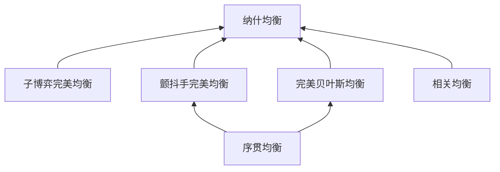

# 02_博弈论基础

---

## 目录

1. [博弈表示法](#21-博弈表示法)
   1.1 标准式（策略式）表示
   1.2 扩展式表示
   1.3 特征函数式（合作博弈）
   1.4 表示法对比矩阵

2. [策略与收益](#22-策略与收益)
   2.1 纯策略与混合策略
   2.2 最优反应与占优策略
   2.3 期望收益计算
   2.4 经典博弈矩阵

3. [纳什均衡](#23-纳什均衡)
   3.1 纳什均衡的定义
   3.2 纳什存在性定理
   3.3 均衡求解方法
   3.4 均衡的唯一性与多重性

4. [均衡精炼](#24-均衡精炼)
   4.1 子博弈完美均衡
   4.2 颤抖手完美均衡
   4.3 完美贝叶斯均衡
   4.4 相关均衡
   4.5 精炼概念对比

5. [博弈分类体系](#25-博弈分类体系)
   5.1 按信息分类
   5.2 按合作性分类
   5.3 按时间结构分类
   5.4 按收益结构分类
   5.5 动态博弈与重复博弈
   5.6 博弈分类全景矩阵

---

## 2.1 博弈表示法

### 2.1.1 标准式（策略式）表示

**定义 2.1.1 (标准式博弈)**
标准式（正规式/策略式）博弈由三元组定义：
$$G = \langle N, (A_i)_{i \in N}, (u_i)_{i \in N} \rangle$$

其中：

- $N = \{1, 2, ..., n\}$：参与者集合
- $A_i$：参与者 $i$ 的行动/策略集合
- $A = A_1 \times A_2 \times ... \times A_n$：策略组合空间
- $u_i: A \rightarrow \mathbb{R}$：参与者 $i$ 的收益函数

**定义 2.1.2 (策略组合)**
策略组合 $a = (a_1, a_2, ..., a_n) \in A$，其中 $a_i \in A_i$ 是参与者 $i$ 的策略。
记 $a_{-i} = (a_1, ..., a_{i-1}, a_{i+1}, ..., a_n)$ 为除 $i$ 外其他参与者的策略。

**囚徒困境（标准式）**:

```
                参与者2
              合作      背叛
           ┌─────────┬─────────┐
    合作   │  (-1,-1)│ (-10, 0)│
参与者1    ├─────────┼─────────┤
    背叛   │  (0,-10)│ (-5,-5) │
           └─────────┴─────────┘
```

### 2.1.2 扩展式表示

**定义 2.1.3 (扩展式博弈)**
扩展式博弈通过博弈树表示序贯决策：
$$\Gamma = \langle N, H, P, (I_i), (u_i) \rangle$$

其中：

- $N$：参与者集合
- $H$：历史（路径）集合，包含空历史 $\emptyset$
- $P: H \setminus Z \rightarrow N \cup \{c\}$：参与者函数（$c$ 表示机会/自然）
- $I_i$：参与者 $i$ 的信息集划分
- $Z \subset H$：终止历史集合
- $u_i: Z \rightarrow \mathbb{R}$：收益函数

**定义 2.1.4 (信息集)**
信息集 $I_i \subset H$ 是参与者 $i$ 无法区分的决策节点集合。

**完美信息博弈**: 所有信息集都是单点集（知道所有先前行动）。
**不完美信息博弈**: 存在非单点信息集（某些行动不可观测）。

**匹配硬币博弈（扩展式）**:

```
         [1]
        /   \
      H       T
      |       |
     [2]     [2]
    /   \   /   \
   H     T H     T
   |     | |     |
 (1,-1)(-1,1)(-1,1)(1,-1)

 不完美信息版本: 参与者2的信息集包含两个节点
```

### 2.1.3 特征函数式（合作博弈）

**定义 2.1.5 (合作博弈/特征函数式)**
合作博弈由二元组定义：
$$\langle N, v \rangle$$

其中：

- $N = \{1, ..., n\}$：参与者集合
- $v: 2^N \rightarrow \mathbb{R}$：特征函数，$v(S)$ 表示联盟 $S$ 能保证获得的收益

**性质**:

- **超可加性**: $v(S \cup T) \geq v(S) + v(T)$, $\forall S \cap T = \emptyset$
- **零博弈**: $v(\emptyset) = 0$

**手套博弈示例**:
三人博弈，参与者1有左手套，参与者2、3各有右手套。一只完整手套值1。

- $v(\{1,2\}) = v(\{1,3\}) = v(N) = 1$
- $v(S) = 0$ 其他

### 2.1.4 表示法对比矩阵

| 维度 | 标准式 | 扩展式 | 特征函数式 |
|:-----|:-------|:-------|:-----------|
| **适用场景** | 同时行动 | 序贯行动 | 联盟形成 |
| **信息刻画** | 有限 | 详细（信息集） | 忽略 |
| **时间结构** | 隐式 | 显式（博弈树） | 无 |
| **策略空间** | 明确 | 需推导 | 通过联盟间接 |
| **计算复杂度** | 中等 | 高（博弈树爆炸） | 低（$2^n$联盟） |
| **均衡概念** | NE | SPE/PBE | 核心/夏普利值 |
| **典型应用** | 产业组织 | 拍卖、谈判 | 成本分摊、投票 |

---

## 2.2 策略与收益

### 2.2.1 纯策略与混合策略

**定义 2.2.1 (纯策略)**
纯策略 $a_i \in A_i$ 是参与者 $i$ 的确定性选择。

**定义 2.2.2 (混合策略)**
混合策略 $\sigma_i \in \Delta(A_i)$ 是纯策略上的概率分布：
$$\sigma_i = (\sigma_i(a_i))_{a_i \in A_i}, \quad \sigma_i(a_i) \geq 0, \quad \sum_{a_i \in A_i} \sigma_i(a_i) = 1$$

**策略空间**: $\Sigma_i = \Delta(A_i)$，$\Sigma = \times_{i \in N} \Sigma_i$

**定义 2.2.3 (混合策略组合的支持集)**
$$\text{supp}(\sigma_i) = \{a_i \in A_i : \sigma_i(a_i) > 0\}$$

### 2.2.2 最优反应与占优策略

**定义 2.2.4 (最优反应对应)**
参与者 $i$ 对 $\sigma_{-i}$ 的最优反应：
$$BR_i(\sigma_{-i}) = \{\sigma_i \in \Sigma_i : u_i(\sigma_i, \sigma_{-i}) \geq u_i(\sigma'_i, \sigma_{-i}), \forall \sigma'_i \in \Sigma_i\}$$

**定义 2.2.5 (严格占优策略)**
纯策略 $a_i$ 被 $a'_i$ **严格占优**，如果：
$$u_i(a'_i, a_{-i}) > u_i(a_i, a_{-i}), \quad \forall a_{-i} \in A_{-i}$$

**定义 2.2.6 (弱占优策略)**
纯策略 $a_i$ 被 $a'_i$ **弱占优**，如果：
$$u_i(a'_i, a_{-i}) \geq u_i(a_i, a_{-i}), \quad \forall a_{-i} \in A_{-i}$$
且至少对一个 $a_{-i}$ 严格不等。

**迭代剔除严格劣策略 (IESDS)**:
重复剔除被严格占优的策略，直到没有可剔除的策略。

**定理 2.2.1**
若通过IESDS得到唯一策略组合，则该组合是纳什均衡。

### 2.2.3 期望收益计算

**定义 2.2.7 (混合策略下的期望收益)**
$$u_i(\sigma) = \sum_{a \in A} \left(\prod_{j \in N} \sigma_j(a_j)\right) u_i(a)$$

或等价地：
$$u_i(\sigma) = \sum_{a_i \in A_i} \sigma_i(a_i) \cdot u_i(a_i, \sigma_{-i})$$

其中 $u_i(a_i, \sigma_{-i})$ 是选择 $a_i$ 对其他混合策略的期望收益。

### 2.2.4 经典博弈矩阵

**1. 囚徒困境 (Prisoner's Dilemma)**

```
         C       D
     ┌───────┬───────┐
   C │ 3, 3  │ 0, 5  │
     ├───────┼───────┤
   D │ 5, 0  │ 1, 1  │
     └───────┴───────┘
```

- 占优策略均衡: (D, D)
- 帕累托最优: (C, C) — 个体理性导致集体非最优

**2. 协调博弈 (Coordination Game)**

```
         A       B
     ┌───────┬───────┐
   A │ 2, 2  │ 0, 0  │
     ├───────┼───────┤
   B │ 0, 0  │ 1, 1  │
     └───────┴───────┘
```

- 两个纯策略纳什均衡: (A, A) 和 (B, B)
- 收益占优 vs 风险占优

**3. 猎鹿博弈 (Stag Hunt)**

```
         Stag   Hare
     ┌────────┬────────┐
Stag │  5, 5  │  0, 3  │
     ├────────┼────────┤
Hare │  3, 0  │  3, 3  │
     └────────┴────────┘
```

- 帕累托最优均衡: (Stag, Stag)
- 风险占优均衡: (Hare, Hare)

**4. 懦夫博弈 (Chicken Game)**

```
         Swerve   Straight
     ┌──────────┬──────────┐
Swerve│  0, 0    │  -1, 1   │
      ├──────────┼──────────┤
Strt  │  1, -1   │ -10, -10 │
      └──────────┴──────────┘
```

- 两个非对称均衡: (Swerve, Straight), (Straight, Swerve)
- 混合策略均衡存在

**经典博弈对比矩阵**:

| 博弈 | 均衡数量 | 类型 | 关键特征 | 应用场景 |
|:-----|:--------:|:-----|:---------|:---------|
| 囚徒困境 | 1 | 占优策略 | 合作vs背叛 | 环境保护、军备竞赛 |
| 协调博弈 | 2+ | 纯策略NE | 协调问题 | 技术标准、语言 |
| 猎鹿博弈 | 2 | 纯策略NE | 收益vs风险占优 | 团队合作 |
| 懦夫博弈 | 3 | 混合+纯 | 先发优势 | 核威慑、商业竞争 |
| 匹配硬币 | 1 | 混合策略 | 零和 | 体育、加密 |

---

## 2.3 纳什均衡

### 2.3.1 纳什均衡的定义

**定义 2.3.1 (纳什均衡 - Nash, 1950)**
策略组合 $\sigma^* = (\sigma_1^*, ..., \sigma_n^*)$ 是**纳什均衡**，如果：
$$\sigma_i^* \in BR_i(\sigma_{-i}^*), \quad \forall i \in N$$

或等价地：
$$u_i(\sigma_i^*, \sigma_{-i}^*) \geq u_i(\sigma_i, \sigma_{-i}^*), \quad \forall \sigma_i \in \Sigma_i, \forall i \in N$$

> **解释**: 在纳什均衡中，每个参与者的策略都是对他人策略的最优反应——给定他人的选择，没有人愿意单方面偏离。

**定理 2.3.1 (纯策略NE与IESDS的关系)**
若策略组合 $a^*$ 幸存于IESDS，且是唯一的，则 $a^*$ 是纯策略纳什均衡。

### 2.3.2 纳什存在性定理

**定理 2.3.2 (纳什存在性定理, 1950)**
每个有限博弈（有限参与者，每个参与者有限纯策略）至少存在一个（混合策略）纳什均衡。

**证明概要**:

1. 构造最优反应对应 $BR: \Sigma \rightrightarrows \Sigma$，$BR(\sigma) = \times_i BR_i(\sigma_{-i})$
2. 证明 $BR$ 是非空、凸值、上半连续的
3. 应用Kakutani不动点定理：$BR$ 有不动点 $\sigma^* \in BR(\sigma^*)$
4. 该不动点就是纳什均衡

**定理 2.3.3 (Debreu-Glicksberg-Fan)**
若满足：(1)策略空间是紧凸集，(2)收益函数连续，(3)收益函数对 own strategy 拟凹，则纳什均衡存在。

### 2.3.3 均衡求解方法

**方法一: 最优反应法**

求解方程组：$\sigma_i^* = BR_i(\sigma_{-i}^*)$，对所有 $i$。

**方法二: 支持集法 (纯策略)**

对于混合策略均衡，若 $a_i \in \text{supp}(\sigma_i^*)$，则：
$$u_i(a_i, \sigma_{-i}^*) = u_i(\sigma_i^*, \sigma_{-i}^*)$$

**方法三: 矩阵代数法 (2×2博弈)**

对于2×2博弈，设参与者1以概率 $p$ 选上行，参与者2以概率 $q$ 选左列，求解无差异条件。

**求解示例: 匹配硬币**

```
        H       T
    ┌───────┬───────┐
  H │ 1,-1  │ -1,1  │
    ├───────┼───────┤
  T │ -1,1  │ 1,-1  │
    └───────┴───────┘
```

无差异条件：

- 参与者1: $q(1) + (1-q)(-1) = q(-1) + (1-q)(1)$ → $q = 1/2$
- 参与者2: $p(-1) + (1-p)(1) = p(1) + (1-p)(-1)$ → $p = 1/2$

**唯一混合策略均衡**: $\sigma_1^* = (1/2, 1/2)$, $\sigma_2^* = (1/2, 1/2)$

### 2.3.4 均衡的唯一性与多重性

| 性质 | 条件 | 含义 |
|:-----|:-----|:-----|:-----|
| **唯一性** | 严格对角凹性 | 均衡唯一 |
| **有限性** | 一般博弈 | 均衡数量有限 |
| **奇数性** | 非退化博弈 | 均衡个数为奇数 |
| **稳定性** | 严格NE | 对扰动稳健 |

**均衡选择问题**:
当存在多个均衡时，需要精炼或选择标准：

- 收益占优 (Payoff Dominance)
- 风险占优 (Risk Dominance)
- 颤抖手完美
- 演化稳定

---

## 2.4 均衡精炼

### 2.4.1 子博弈完美均衡 (SPE)

**定义 2.4.1 (子博弈)**
子博弈 $\Gamma(h)$ 是扩展式博弈 $\Gamma$ 中从非终端历史 $h$ 开始的部分，包含 $h$ 的所有延续。

**定义 2.4.2 (子博弈完美均衡 - Selten, 1965)**
策略组合 $s^*$ 是**子博弈完美均衡**，如果它在每个子博弈上都构成纳什均衡。

> **关键**: SPE 排除了基于不可置信威胁的纳什均衡。

**逆向归纳法**:

1. 从最底层子博弈开始，求该子博弈的NE
2. 用该NE收益替换子博弈
3. 向上递归直至根节点

**案例: 蜈蚣博弈**

```
1: T → (2,0) 或 R →
            2: T → (1,3) 或 R →
                        1: T → (4,2) 或 R → (3,5)
```

**唯一SPE**: 在每个节点选择T（拿走）
**实验结果**: 参与者往往选择R（继续）若干轮

### 2.4.2 颤抖手完美均衡 (THP)

**定义 2.4.3 (颤抖手完美均衡 - Selten, 1975)**
策略组合 $\sigma^*$ 是**颤抖手完美均衡**，如果存在完全混合策略序列 $\sigma^k \rightarrow \sigma^*$，使得：
$$\sigma_i^* \in BR_i(\sigma_{-i}^k), \quad \forall i$$

> **直观**: 均衡是对小概率"手抖"错误的稳健策略。

**性质**:

- 每个有限博弈至少存在一个THP均衡
- 每个THP均衡都是纳什均衡
- 在2×2博弈中，THP = NE

### 2.4.3 完美贝叶斯均衡 (PBE)

**定义 2.4.4 (信念系统)**
信念 $\mu$ 为每个信息集指定概率分布：$\mu(h) \in \Delta(H(h))$

**定义 2.4.5 (完美贝叶斯均衡)**
$(\sigma^*, \mu^*)$ 是**完美贝叶斯均衡**，如果满足：

1. **序贯理性**: 在每个信息集，给定信念，策略是最优的
2. **信念一致性**: 在均衡路径上，信念由贝叶斯规则决定

**精炼**:

- **强PBE**: 在非均衡路径上也有合理信念
- **序贯均衡**: 更强的信念一致性要求

**信号博弈中的均衡类型**:

- **分离均衡 (Separating)**: 不同类型选择不同信号
- **混同均衡 (Pooling)**: 不同类型选择相同信号
- **半分离均衡 (Semi-separating)**: 部分类型随机化

### 2.4.4 相关均衡

**定义 2.4.6 (相关均衡 - Aumann, 1974)**
设 $(\Omega, \pi)$ 是概率空间，$P_i$ 是参与者 $i$ 的信息划分。
函数 $s_i: \Omega \rightarrow A_i$ 是**相关均衡**，如果：
$$\sum_{\omega \in P_i(\omega')} \pi(\omega) u_i(s_i(\omega), s_{-i}(\omega)) \geq \sum_{\omega \in P_i(\omega')} \pi(\omega) u_i(a_i, s_{-i}(\omega))$$
对所有 $a_i \in A_i$，所有 $i$，所有 $\omega'$ 成立。

> **解释**: 通过公共信号（如中介建议）协调策略，可能获得比NE更高的收益。

**定理 2.4.1**
每个纳什均衡都是相关均衡（退化的信号结构）。
存在相关均衡收益严格优于任何NE收益。

### 2.4.5 精炼概念对比

| 精炼概念 | 适用博弈 | 核心思想 | 排除的问题 | 存在性 |
|:---------|:---------|:---------|:-----------|:-------|
| **纳什均衡** | 所有 | 相互最优反应 | 无 | 保证 |
| **SPE** | 完美信息动态 | 子博弈最优 | 不可信威胁 | 保证 |
| **THP** | 标准式 | 错误稳健 | 弱劣策略 | 保证 |
| **PBE** | 不完全信息动态 | 合理信念 | 非序贯理性 | 一般保证 |
| **序贯均衡** | 不完全信息动态 | 信念收敛 | 非均衡信念 | 保证 |
| **适当均衡** | 标准式 | 代价相关错误 | 非对称错误 | 保证 |
| **相关均衡** | 标准式 | 信号协调 | 独立随机化 | 保证 |
| **演化稳定策略** | 群体博弈 | 入侵稳健 | 非稳定NE | 不保证 |

**精炼关系图**:



---

## 2.5 博弈分类体系

### 2.5.1 按信息分类

| 分类 | 完全信息 | 不完全信息 |
|:-----|:---------|:-----------|
| **定义** | 所有参与者了解博弈结构 | 某些参与者不了解某些要素 |
| **完美信息** | 同时行动或知道所有先前行动 | 贝叶斯博弈（Harsanyi转换）|
| **不完美信息** | 标准式博弈 | 贝叶斯博弈+动态 |
| **均衡概念** | NE/SPE | BNE/PBE |
| **典型应用** | 寡头竞争 | 拍卖、信号传递 |

**贝叶斯博弈 (不完全信息)**:

**定义 2.5.1 (贝叶斯博弈)**
$$G = \langle N, (\Theta_i), (A_i), (u_i), p \rangle$$

- $\Theta_i$: 参与者 $i$ 的类型空间
- $\theta_i \in \Theta_i$: 类型（私人信息）
- $p$: 类型分布（共同先验）

**定义 2.5.2 (贝叶斯纳什均衡)**
策略组合 $\sigma^*$ 是**贝叶斯纳什均衡**，如果对所有 $i$，所有 $\theta_i$：
$$\sigma_i^*(\theta_i) \in \arg\max_{\sigma_i} \mathbb{E}_{\theta_{-i}}[u_i(\sigma_i, \sigma_{-i}^*(\theta_{-i}); \theta) | \theta_i]$$

### 2.5.2 按合作性分类

| 类型 | 非合作博弈 | 合作博弈 |
|:-----|:-----------|:---------|
| **协议效力** | 无法 binding | 可 binding |
| **关注点** | 个体策略选择 | 联盟形成与分配 |
| **解概念** | 各种NE | 核心、夏普利值 |
| **表示法** | 标准式/扩展式 | 特征函数式 |
| **典型问题** | 价格竞争 | 成本分摊、投票权 |

**夏普利值 (Shapley Value)**:

**定义 2.5.3 (夏普利值)**
参与者 $i$ 的夏普利值：
$$\phi_i(v) = \sum_{S \subseteq N \setminus \{i\}} \frac{|S|!(n-|S|-1)!}{n!} [v(S \cup \{i\}) - v(S)]$$

> **解释**: 参与者 $i$ 对所有可能联盟边际贡献的平均值。

**公理化**: 夏普利值是唯一满足以下公理的分配方案：

- 效率性、对称性、虚拟参与者、可加性

### 2.5.3 按时间结构分类

| 类型 | 静态博弈 | 动态博弈 |
|:-----|:---------|:---------|
| **行动时机** | 同时或不知先后 | 序贯 |
| **表示法** | 标准式 | 扩展式 |
| **信息** | 一次性决策 | 可能观察历史 |
| **均衡** | NE | SPE/PBE |
| **分析方法** | 矩阵分析 | 逆向归纳 |

### 2.5.4 按收益结构分类

| 类型 | 零和博弈 | 常和博弈 | 变和博弈 |
|:-----|:---------|:---------|:---------|
| **定义** | $\sum u_i = 0$ | $\sum u_i = c$ | $\sum u_i$ 可变 |
| **特点** | 严格竞争 | 分配问题 | 合作可能 |
| **解概念** | 极小极大 | 协商解 | 各种NE |
| **典型** | 棋类、扑克 | 分配博弈 | 囚徒困境 |

**定理 2.5.1 (极小极大定理 - von Neumann, 1928)**
对于双人零和博弈：
$$\max_{\sigma_1} \min_{\sigma_2} u_1(\sigma_1, \sigma_2) = \min_{\sigma_2} \max_{\sigma_1} u_1(\sigma_1, \sigma_2) = v$$
其中 $v$ 称为博弈的值。

### 2.5.5 动态博弈与重复博弈

**重复博弈**:

**定义 2.5.4 (重复博弈)**
阶段博弈 $G$ 重复 $T$ 次（$T$ 可以是有限或无限）。

**策略**: 历史依赖的策略 $s_i: H \rightarrow A_i$

**定理 2.5.2 (无名氏定理 - Folk Theorem)**
在无限重复博弈中，若参与者足够有耐心（折现因子 $\delta$ 接近1），则任何**个体理性**且**可行**的收益向量都可以是子博弈完美均衡结果。

> **启示**: 重复互动使得合作成为可能（如囚徒困境中的合作）。

**触发策略**:

- **冷酷触发 (Grim Trigger)**: 一旦背叛，永远惩罚
- **以牙还牙 (Tit-for-Tat)**: 模仿对手上一轮行动

### 2.5.6 博弈分类全景矩阵

```
博弈分类全景
│
├── 按信息
│   ├── 完全信息
│   │   ├── 完美信息 → 扩展式 → SPE
│   │   └── 不完美信息 → 标准式 → NE
│   └── 不完全信息
│       ├── 静态 → 贝叶斯博弈 → BNE
│       └── 动态 → 贝叶斯扩展式 → PBE
│
├── 按合作性
│   ├── 非合作博弈 → 纳什均衡族
│   └── 合作博弈 → 核心/夏普利值/核仁
│
├── 按时间
│   ├── 静态博弈 → 一次性决策
│   ├── 动态博弈 → 序贯决策
│   └── 重复博弈 → 声誉、合作
│
└── 按收益
    ├── 零和博弈 → 极小极大
    ├── 常和博弈 → 分配问题
    └── 变和博弈 → 合作与竞争并存
```

---

## 应用案例

### 案例1: 寡头定价博弈

**场景**: 双寡头竞争，选择价格 $p_1, p_2$

**Bertrand模型**:

- 同质产品：唯一NE是 $p_1 = p_2 = c$（边际成本定价）
- 差异化产品：存在 $p_1^* > c, p_2^* > c$ 的NE

### 案例2: 拍卖中的竞价策略

**第二价格密封拍卖**:

- 占优策略：按真实估价出价
- 均衡结果：有效分配（估价最高者获得）

### 案例3: 进入威慑博弈

**场景**: 潜在进入者决定是否进入，在位者决定是否斗争

**均衡分析**:

- 若斗争威胁可信 → 进入者不进
- 若斗争不可信（子博弈中不利）→ 进入者进

---

## 与其他模块的交叉引用

| 模块 | 关联内容 | 在本章的应用 |
|:-----|:---------|:-------------|
| [01_决策理论基础](01_决策理论基础.md) | 期望效用 | 收益计算基础 |
| [09_概率论与统计](../09_概率论与统计/) | 概率分布 | 混合策略、BNE |
| [10_最优化理论](../10_最优化理论/) | 优化方法 | 最优反应求解 |
| [03_机制设计](03_机制设计.md) | 激励相容 | 策略证明机制 |
| [06_行为博弈论](06_行为博弈论.md) | 有限理性 | 均衡预测修正 |

---

**参考文献**:

1. Nash, J. (1950). Equilibrium points in n-person games. PNAS.
2. Selten, R. (1965). Spieltheoretische Behandlung eines Oligopolmodells.
3. Harsanyi, J. (1967). Games with incomplete information.
4. Osborne, M.J. & Rubinstein, A. (1994). A Course in Game Theory.
5. Fudenberg, D. & Tirole, J. (1991). Game Theory.
