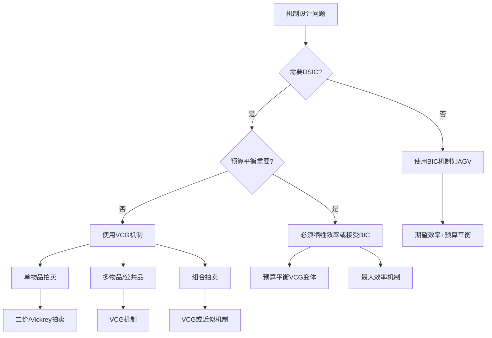

# 03_机制设计

---

📌 **内容摘要**

本文档深入探讨03_机制设计的核心原理和关键方法。内容涵盖决策与博弈论领域的主要知识点，包括决策理论, 风险, 拍卖, 机制设计, 效用等关键主题。适合有一定基础的学习者系统学习。

**关键词**: 决策理论, 风险, 拍卖, 机制设计, 效用, 显示原理, 决策与博弈论

📚 **学习目标**
- 掌握03_机制设计的核心概念和主要方法
- 理解相关理论的应用场景
- 建立该领域的系统性知识框架

🎯 **难度级别**: 中级

⏱️ **预计阅读时间**: 15分钟

**前置知识**: 相关领域的基础概念

---

---

## 目录

- [03_机制设计](#)

---

## 3.1 机制设计基础

### 3.1.1 机制设计问题的形式化

**定义 3.1.1 (机制设计环境)**
机制设计问题由以下要素定义：
$$\mathcal{E} = \langle N, \Theta, X, (u_i), p \rangle$$

其中：

- $N = \{1, ..., n\}$：参与者集合
- $\Theta = \Theta_1 \times ... \times \Theta_n$：类型空间（私人信息）
- $X$：可行结果集合
- $u_i: X \times \Theta_i \rightarrow \mathbb{R}$：参与者 $i$ 的效用函数
- $p \in \Delta(\Theta)$：类型的共同先验分布

**拟线性环境** (最常见的情形)：
$$u_i(x, t_i, \theta_i) = v_i(x, \theta_i) + t_i$$
其中：

- $x \in X$：公共决策/分配
- $t_i \in \mathbb{R}$：货币转移支付（$t_i > 0$ 表示获得）
- $v_i$：估值函数

**定义 3.1.2 (机制)**
机制 $\mathcal{M} = \langle M, g \rangle$ 由以下组成：

- $M = M_1 \times ... \times M_n$：消息/信号空间
- $g: M \rightarrow X \times \mathbb{R}^n$：结果函数，$g(m) = (x(m), t_1(m), ..., t_n(m))$

### 3.1.2 类型空间与信号

**类型 ($\theta_i$)**:

- 参与者的私人特征
- 影响其偏好/估值
- 例如：对某商品的估价、成本类型、风险偏好

**信息结构**:

| 信息类型 | 描述 | 典型模型 |
|:---------|:-----|:---------|
| **私人价值** | 类型只影响自己的效用 | 标准拍卖 |
| **共同价值** | 类型反映共同未知的真实值 | 石油开采权拍卖 |
| **关联价值** | 类型间存在统计相关 | 关联价值拍卖 |
| **跨体相关** | 一个人的类型影响他人的效用 | 网络外部性 |

**信号 ($m_i$)**:

- 参与者向机制发送的信息
- 可能等于类型（直接机制）或不等于（间接机制）

### 3.1.3 社会选择函数

**定义 3.1.3 (社会选择函数, SCF)**
社会选择函数 $f: \Theta \rightarrow X$ 将类型组合映射到社会结果：
$$f(\theta) = (x(\theta), t_1(\theta), ..., t_n(\theta))$$

**性质要求**:

| 性质 | 定义 | 含义 |
|:-----|:-----|:-----|
| **效率性** | $x^*(\theta) \in \arg\max_{x \in X} \sum_{i=1}^n v_i(x, \theta_i)$ | 社会剩余最大化 |
| **个体理性** | $u_i(f(\theta_i, \theta_{-i}), \theta_i) \geq \underline{u}_i$ | 参与者愿意参与 |
| **激励相容** | 真实报告是最优策略 | 机制稳健运行 |
| **预算平衡** | $\sum_i t_i(\theta) = 0$ | 无外部资金注入 |

### 3.1.4 实施概念

**定义 3.1.4 (实施)**
机制 $\mathcal{M}$ **实施**社会选择函数 $f$，如果均衡结果等于 $f$ 规定的 outcome。

**实施层级**:

| 实施概念 | 均衡概念 | 稳健性 | 典型应用 |
|:---------|:---------|:-------|:---------|
| **占优策略实施** | 占优策略均衡 | 最强（与信念无关） | VCG机制 |
| **纳什实施** | 纳什均衡 | 中等 | 标准博弈 |
| **贝叶斯实施** | 贝叶斯纳什均衡 | 较弱（依赖先验） | 贝叶斯机制 |
| **子博弈完美实施** | SPE | 动态稳健 | 多阶段机制 |

---

## 3.2 激励相容

### 3.2.1 占优策略激励相容 (DSIC)

**定义 3.2.1 (占优策略激励相容)**
机制 $\mathcal{M}$ 是**占优策略激励相容**的，如果对所有 $i$，所有 $\theta_i$，所有 $\theta_{-i}$，所有 $m_i$：
$$u_i(g(\theta_i, \theta_{-i}), \theta_i) \geq u_i(g(m_i, \theta_{-i}), \theta_i)$$

> **含义**: 无论他人如何报告（即使谎报），真实报告都是最优策略。

**定理 3.2.1 (DSIC的必要条件 - 拟线性环境)**
在拟线性环境下，分配规则 $x$ 可DSIC实施当且仅当 $x$ 是**单调**的（类型越高，"更好"的结果）。

### 3.2.2 贝叶斯激励相容 (BIC)

**定义 3.2.2 (贝叶斯激励相容)**
机制 $\mathcal{M}$ 是**贝叶斯激励相容**的，如果对所有 $i$，所有 $\theta_i, \theta'_i$：
$$\mathbb{E}_{\theta_{-i}}[u_i(g(\theta_i, \theta_{-i}), \theta_i) | \theta_i] \geq \mathbb{E}_{\theta_{-i}}[u_i(g(\theta'_i, \theta_{-i}), \theta_i) | \theta_i]$$

> **含义**: 在预期他人诚实报告的情况下，真实报告是最优的。

**DSIC vs BIC**:

| 特征 | DSIC | BIC |
|:-----|:-----|:-----|
| **均衡概念** | 占优策略 | 贝叶斯纳什均衡 |
| **信息要求** | 无需了解他人 | 需要了解分布 |
| **稳健性** | 非常稳健 | 依赖先验正确性 |
| **可实现性** | 限制更强 | 更灵活 |
| **典型机制** | VCG、二价拍卖 | 一价拍卖均衡 |

### 3.2.3 纳什实施

**定义 3.2.3 (纳什实施)**
机制 $\mathcal{M}$ **纳什实施** SCF $f$，如果：

1. 对每个 $\theta$，存在NE $m^*$ 使得 $g(m^*) = f(\theta)$
2. 对每个NE $m^*$，存在 $\theta$ 使得 $g(m^*) = f(\theta)$

**Maskin单调性**:
SCF $f$ 可纳什实施的**必要**条件（在3人以上且满足No Veto Power时也是**充分**的）。

### 3.2.4 激励相容的刻画

**信封定理 (Envelope Theorem) 应用**:

**定理 3.2.2 (收益等价 - 拟线性环境)**
设 $x$ 是可实施的分配规则，则 $i$ 的均衡期望收益（至多加减常数）为：
$$U_i(\theta_i) = U_i(\underline{\theta}_i) + \int_{\underline{\theta}_i}^{\theta_i} \mathbb{E}_{\theta_{-i}}\left[\frac{\partial v_i(x(s, \theta_{-i}), s)}{\partial \theta_i}\right] ds$$

**推论 (收益等价定理)**
对于标准拍卖（独立私人价值、正则分布、风险中性、理性竞标者）：

- 任何给获胜者相同条件的拍卖产生**相同**的期望收益

---

## 3.3 显示原理

### 3.3.1 直接机制与间接机制

**定义 3.3.1 (直接机制)**
直接机制 $\mathcal{M}^d$ 满足 $M_i = \Theta_i$（参与者直接报告类型）。

**定义 3.3.2 (间接机制)**
间接机制 $M_i$ 不等于 $\Theta_i$（复杂的消息空间）。

**示例**:

- **直接**: 报告"我的估价是100元"
- **间接**: 出价100元（拍卖）、发送加密消息、多轮谈判

### 3.3.2 显示原理及其证明

**定理 3.3.1 (显示原理 - Revelation Principle, Gibbard 1973, Myerson 1979)**
若机制 $\mathcal{M} = \langle M, g \rangle$ 以某种均衡概念实施 SCF $f$，则存在一个**直接机制** $\mathcal{M}^d = \langle \Theta, f \rangle$ 以**真实报告**作为均衡实施 $f$。

**证明概要**:

1. 设 $\mathcal{M}$ 有均衡策略 $s_i^*: \Theta_i \rightarrow M_i$
2. 构造直接机制：当报告 $\theta$ 时，模拟 $\mathcal{M}$ 中 $s^*(\theta)$ 的结果
3. 在 $\mathcal{M}$ 中真实遵循 $s^*$ 的激励 → 在直接机制中真实报告 $\theta$ 的激励
4. 因此真实报告是直接机制的均衡

> **关键点**: 不失一般性，我们可以只研究直接机制和真实报告均衡。

### 3.3.3 显示原理的应用

**应用1: 机制设计的简化**
只需考虑：

- 参与者直接报告类型
- 机制设计者选择最优的 $(x(\theta), t(\theta))$
- 约束：激励相容 + 个体理性

**应用2: 不可能定理的推导**
显示原理使得证明机制设计中的不可能结果更容易（在直接机制中分析约束）。

**应用3: 比较机制**
任何间接机制的效果都可以由某个直接机制复制。

### 3.3.4 显示原理的局限

| 局限 | 说明 | 含义 |
|:-----|:-----|:-----|
| **多均衡问题** | 直接机制可能有非真实报告均衡 | 需考虑均衡选择 |
| **隐私顾虑** | 直接揭示类型可能有成本 | 可能需要间接机制保护隐私 |
| **计算复杂性** | 直接机制计算可能更复杂 | 间接机制可能更易计算 |
| **动态机制** | 多期环境中显示原理应用受限 | 需要考虑学习效应 |

---

## 3.4 效率与预算平衡

### 3.4.1 帕累托效率

**定义 3.4.1 (事后效率)**
结果 $(x, t)$ 是**事后效率**的，如果不存在 $(x', t')$ 使得：
$$u_i(x', t'_i, \theta_i) \geq u_i(x, t_i, \theta_i), \quad \forall i$$
且至少对一个 $i$ 严格不等。

**拟线性环境下的效率**:
$(x(\theta), t(\theta))$ 是事后效率的，如果：
$$x(\theta) \in \arg\max_{x \in X} \sum_{i=1}^n v_i(x, \theta_i)$$
（最大化社会剩余，然后通过转移支付分配）

**效率层次**:

| 效率概念 | 定义时点 | 条件 |
|:---------|:---------|:-----|
| **事后效率** | 类型实现后 | 给定 $\theta$ 无法改进 |
| **事中效率** | 知道自己的类型 | 给定 $\theta_i$ 无法改进期望效用 |
| **事前效率** | 类型实现前 | 从先验看无法改进 |

**关系**: 事后效率 $\Rightarrow$ 事中效率 $\Rightarrow$ 事前效率

### 3.4.2 预算平衡

**定义 3.4.2 (预算平衡)**
机制是**预算平衡**的，如果对所有 $\theta$：
$$\sum_{i=1}^n t_i(\theta) = 0$$

> **含义**: 机制内部平衡，无需外部补贴也无剩余。

**弱预算平衡**:
$$\sum_{i=1}^n t_i(\theta) \geq 0$$
（无赤字，可以有剩余由设计者保留）

### 3.4.3 格林-拉丰不可能定理

**定理 3.4.1 (Green-Laffont不可能定理, 1977)**
在满足以下条件的环境中：

1. 拟线性效用
2. 非平凡的类型空间
3. 任意估值函数

不存在同时满足以下性质的机制：

- 占优策略激励相容
- 事后效率
- 预算平衡

**证明概要**:

1. VCG机制是唯一满足DSIC+效率的机制（在一定条件下）
2. VCG机制通常不满足预算平衡
3. 因此三者不可得兼

> **启示**: 机制设计中的基本权衡——必须放弃至少一个目标。

**应对策略**:

- 放宽DSIC → 使用BIC（贝叶斯激励相容）
- 放宽效率 → 接受次优分配
- 放宽预算平衡 → 引入外部补贴者（如VCG中的"观察者"支付）

### 3.4.4 弱预算平衡与无赤字

**定理 3.4.2 (AGV机制 - d'Aspremont & Gérard-Varet, 1979)**
在BIC框架下，可以实现效率 + 预算平衡（但不一定是DSIC）。

**AGV支付规则**:
$$t_i(\theta) = \mathbb{E}_{\tilde{\theta}_{-i}}\left[\sum_{j \neq i} v_j(x^*(\theta_i, \tilde{\theta}_{-i}), \tilde{\theta}_j)\right] - \frac{1}{n-1} \sum_{j \neq i} \mathbb{E}_{\tilde{\theta}_{-j}}\left[\sum_{k \neq j} v_k(x^*(\theta_j, \tilde{\theta}_{-j}), \tilde{\theta}_k)\right]$$

> **特点**: 每个参与者的支付只依赖自己的报告（通过期望），创造了正确激励。

---

## 3.5 典型机制设计

### 3.5.1 VCG机制

**定义 3.5.1 (VCG机制 - Vickrey-Clarke-Groves)**
VCG机制 $\mathcal{M}^{VCG} = \langle x^*, t^{VCG} \rangle$：

1. **分配规则**: $x^*(\theta) \in \arg\max_{x \in X} \sum_{i=1}^n v_i(x, \theta_i)$（效率）

2. **支付规则**:
   $$t_i^{VCG}(\theta) = h_i(\theta_{-i}) - \sum_{j \neq i} v_j(x^*(\theta), \theta_j)$$

   其中 $h_i$ 是不依赖 $\theta_i$ 的任意函数（通常选择 $h_i(\theta_{-i}) = \max_x \sum_{j \neq i} v_j(x, \theta_j)$）

**定理 3.5.1 (VCG性质)**
VCG机制满足：

- 占优策略激励相容
- 事后效率
- 个体理性（适当选择 $h_i$）

**证明 (DSIC)**:
参与者 $i$ 报告 $\theta'_i$ 的效用：
$$v_i(x^*(\theta'_i, \theta_{-i}), \theta_i) + h_i(\theta_{-i}) - \sum_{j \neq i} v_j(x^*(
\theta'_i, \theta_{-i}), \theta_j)$$
$$= h_i(\theta_{-i}) + \left[v_i(x^*, \theta_i) - \sum_{j \neq i} v_j(x^*, \theta_j)\right]$$

最大化此项等价于最大化 $v_i(x, \theta_i) + \sum_{j \neq i} v_j(x, \theta_j) = \sum_{j=1}^n v_j(x, \theta_j)$，这正是 $x^*$ 的定义。因此真实报告最优。 ∎

**局限**: 通常不满足预算平衡（总支付为负，需要"观察者"补贴）。

### 3.5.2 拍卖机制

见 [05_拍卖理论](05_拍卖理论.md)

### 3.5.3 匹配机制

**定义 3.5.2 (双边匹配)**
设有两组代理人 $M$（男性）和 $W$（女性），各有偏好 $\succ_m$ 和 $\succ_w$。

**稳定匹配**:
- 不存在阻塞对 $(m, w)$：$m$ 更喜欢 $w$ 而非当前配偶，且 $w$ 更喜欢 $m$ 而非当前配偶

**Gale-Shapley算法 (延迟接受算法)**:
1. 每轮：每个未匹配的男性向他最喜欢的尚未拒绝他的女性求婚
2. 每个女性暂时接受最好的求婚者，拒绝其他
3. 重复直到所有人都匹配

**定理 3.5.2 (Gale-Shapley, 1962)**
-  Gale-Shapley算法产生**稳定匹配**
- 男性提议版本对男性**最优**，对女性**最劣**

### 3.5.4 成本分摊机制

**问题**: 公共品成本 $C$ 如何在 $n$ 个参与者间分摊？

**Shapley值分摊**:
$$t_i = \sum_{S \subseteq N \setminus \{i\}} \frac{|S|!(n-|S|-1)!}{n!} [C(S \cup \{i\}) - C(S)]$$

**Serial Cost Sharing**:
- 参与者按需求排序
- 边际成本由所有需求至少为该水平的参与者分摊

### 3.5.5 委托-代理模型

**基本设定**:
- 委托人：设计契约
- 代理人：选择行动（影响产出但不可观测）

**道德风险问题**:
- 行动不可契约化
- 只能基于可观测的产出设计激励

**最优契约**:
$$\max_{w(y)} \mathbb{E}[y - w(y)]$$
$$\text{s.t.} \quad \mathbb{E}[u(w(y)) | a^*] - c(a^*) \geq \underline{u} \quad \text{(IR)}$$
$$a^* \in \arg\max_a \mathbb{E}[u(w(y)) | a] - c(a) \quad \text{(IC)}$$

### 3.5.6 机制对比矩阵

| 机制 | 分配规则 | 支付规则 | 激励相容 | 效率 | 预算平衡 | 典型应用 |
|:-----|:---------|:---------|:---------|:-----|:---------|:---------|
| **VCG** | 社会剩余最大化 | 外部性定价 | DSIC | ✓ | ✗ | 公共品、拍卖 |
| **二价拍卖** | 最高估价者获胜 | 次高价 | DSIC | ✓ | ✗ | 单物品拍卖 |
| **一价拍卖** | 最高出价者获胜 | 最高价 | BIC | ✓ | ✓ | 密封拍卖 |
| **AGV** | 社会剩余最大化 | 期望转移 | BIC | ✓ | ✓ | 内部决策 |
| **Gale-Shapley** | 稳定匹配 | 无货币 | 策略证明 | 稳定 | N/A | 学校录取、器官匹配 |
| **枢轴机制** | 有效公共品水平 | 关键参与者支付 | DSIC | ✓ | ✗ | 公共品决策 |
| **比例分摊** | 平均分摊 | 均等分摊 | 非激励相容 | ✗ | ✓ | 简单成本分摊 |

**机制设计决策树**:

---

## 应用案例

### 案例1: 频谱拍卖设计

**挑战**:
- 多频段、多地区
- 组合价值（互补性）
- 激励相容与效率

**解决方案**: 组合拍卖 + VCG近似
- 参与者对组合出价
- 使用VCG或近似机制分配
- 美国FCC拍卖：1994年以来数百亿美元

### 案例2: 搜索引擎广告拍卖

**广义二价拍卖 (GSP)**:
- 广告位按出价排序
- 支付：下一位出价 + 最小增量
- 实际使用：质量得分调整

**与VCG比较**:
- GSP：非DSIC，但简单、稳定
- VCG：DSIC，但支付可能波动大

### 案例3: 肾脏交换匹配

**背景**: 不兼容的供体-受体对之间交换

**机制**: 优先匹配图
- 顶点：供体-受体对
- 边：兼容交换
- 目标：最大化匹配数

**Top Trading Cycles算法**:
- 循环识别与执行
- 策略证明（真实报告偏好占优）

---

## 与其他模块的交叉引用

| 模块 | 关联内容 | 在本章的应用 |
|:-----|:---------|:-------------|
| [01_决策理论基础](01_决策理论基础.md) | 效用理论 | 拟线性效用模型 |
| [02_博弈论基础](02_博弈论基础.md) | 均衡概念 | 实施理论 |
| [04_社会选择理论](04_社会选择理论.md) | 聚合规则 | 社会选择函数 |
| [05_拍卖理论](05_拍卖理论.md) | 拍卖设计 | VCG应用 |
| [09_概率论与统计](../09_概率论与统计/) | 期望计算 | BIC分析 |
| [10_最优化理论](../10_最优化理论/) | 优化方法 | 效率最大化 |

---

**参考文献**:
1. Myerson, R.B. (1981). Optimal auction design. Mathematics of Operations Research.
2. Green, J. & Laffont, J.J. (1977). Characterization of satisfactory mechanisms. Econometrica.
3. Groves, T. (1973). Incentives in teams. Econometrica.
4. Clarke, E.H. (1971). Multipart pricing of public goods. Public Choice.
5. Vickrey, W. (1961). Counterspeculation, auctions, and competitive sealed tenders. Journal of Finance.
6. Maskin, E. (1999). Nash equilibrium and welfare optimality. Review of Economic Studies.
---

## 📚 延伸阅读

- [12.2.2 纳什均衡](./02_博弈论基础/02.2_纳什均衡.md)
- [04.3 计算复杂性理论](./05_形式化理论/04_计算理论/04.3_计算复杂性.md)
- [5.2 概率论公理](./01_数学基础/05_概率论与测度论/05.2_概率论公理.md)
- [5.2 概率论基础](./01_数学基础/05_概率论与测度论/05.2_概率论基础.md)
- [12.3.1 显示原理](./03_机制设计/03.1_显示原理.md)
