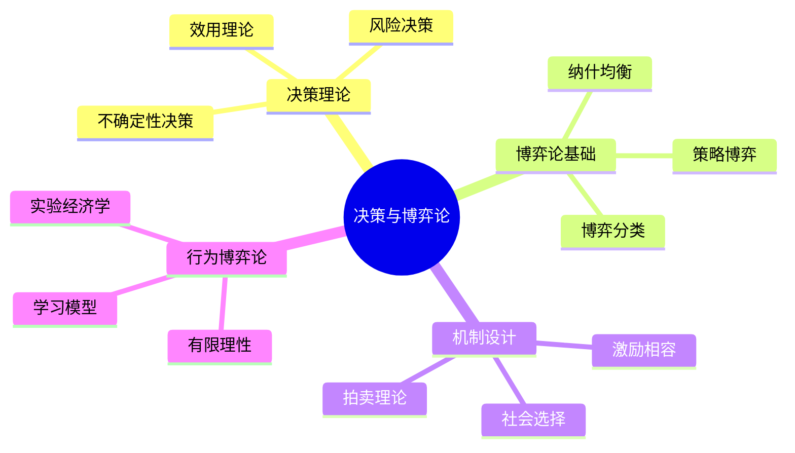

# 12_决策与博弈论 (Decision Theory & Game Theory)

## 模块概述

决策与博弈论是形式科学的核心分支，研究理性主体在不确定环境中的选择行为，以及多个主体之间的策略互动。
本模块涵盖从个体决策理论到群体博弈均衡，从经典理论到现代机制设计的完整知识体系。

---

## 1. 知识图谱



---

## 2. 模块结构

| 序号 | 文档 | 核心内容 | 形式化程度 |
|:----:|:-----|:---------|:----------:|
| 00 | 目录与导航 | 完整知识树与索引 | ★★★ |
| 01 | 决策理论基础 | 效用、概率、不确定性 | ★★★★★ |
| 02 | 博弈论基础 | 均衡、策略、分类 | ★★★★★ |
| 03 | 机制设计 | 激励、拍卖、社会选择 | ★★★★★ |
| 04 | 社会选择理论 | 投票、不可能定理 | ★★★★☆ |
| 05 | 拍卖理论 | 类型、最优机制 | ★★★★★ |
| 06 | 行为博弈论 | 有限理性、实验 | ★★★☆☆ |

---

## 3. 核心理论框架

### 3.1 形式化定义体系

```
决策理论基石
├── 偏好关系 ≺ (完备性、传递性)
├── 效用函数 u: X → ℝ
├── 期望效用 EU = Σ pᵢ·u(xᵢ)
└── 风险度量 (方差、VaR、CVaR)

博弈论核心
├── 博弈表示 G = ⟨N, (Aᵢ), (uᵢ)⟩
├── 策略 σᵢ ∈ Δ(Aᵢ)
├── 纳什均衡 σ* : uᵢ(σ*) ≥ uᵢ(σᵢ, σ*₋ᵢ)
└── 均衡精炼 (SPE, PBE, ESS)

机制设计框架
├── 类型空间 Θ = × Θᵢ
├── 机制 (x, t): Θ → Y × ℝⁿ
├── 激励相容: 真实报告是最优策略
└── 社会目标函数 W: Θ → ℝ
```

### 3.2 关键定理一览

| 定理名称 | 核心结论 | 应用领域 |
|:---------|:---------|:---------|
| 冯·诺依曼-摩根斯坦期望效用定理 | 理性偏好等价于期望效用最大化 | 决策分析、金融 |
| 纳什存在性定理 | 有限博弈至少存在一个纳什均衡 | 经济学、计算机科学 |
| 显示原理 | 任何机制等价于一个直接机制 | 机制设计 |
| 阿罗不可能定理 | 满足四条件的社会福利函数不存在 | 政治经济学 |
| 收益等价定理 | 标准拍卖产生相同期望收益 | 拍卖设计 |
| 迈尔森最优拍卖定理 | 最优拍卖是虚拟价值最大化 | 机制设计 |

---

## 4. 应用场景矩阵

| 应用领域 | 主要理论 | 典型问题 | 成功案例 |
|:---------|:---------|:---------|:---------|
| **经济学** | 博弈论、机制设计 | 市场均衡、产业组织 | 频谱拍卖 |
| **计算机科学** | 算法博弈论 | 网络路由、云计算定价 | Google Ads |
| **政治学** | 社会选择、投票理论 | 选举制度设计 | 丹麦选举改革 |
| **生物学** | 演化博弈论 | 进化稳定策略 | 合作进化研究 |
| **金融学** | 决策理论、拍卖 | 资产定价、IPO | 美国国债拍卖 |
| **运筹学** | 博弈论、机制设计 | 供应链协调 | 航空联盟分配 |

---

## 5. 与其他模块的交叉引用

### 5.1 前置依赖模块

| 模块 | 依赖内容 | 在本模块的应用 |
|:-----|:---------|:---------------|
| 02_形式化方法 | 形式化规约、验证 | 博弈形式化、均衡存在性证明 |
| 05_数理逻辑 | 模态逻辑、公共知识 | 博弈的认知基础 |
| 06_集合论与范畴论 | 集合运算、函数 | 博弈空间的数学结构 |
| 09_概率论与统计 | 概率分布、期望 | 随机博弈、贝叶斯博弈 |
| 10_最优化理论 | 凸优化、对偶理论 | 机制设计优化 |

### 5.2 后续延伸模块

| 模块 | 延伸内容 | 关联章节 |
|:-----|:---------|:---------|
| 13_经济学 | 市场均衡、一般均衡 | 02, 03, 05 |
| 14_计算机科学 | 算法博弈论、机制设计 | 02, 03 |
| 15_系统科学 | 复杂系统、涌现 | 06 |

---

## 6. 学习路径建议

### 6.1 基础路径（30小时）

```
Week 1-2: 决策理论基础
  → 效用理论 → 风险决策 → 不确定性决策

Week 3-4: 博弈论基础
  → 策略博弈 → 纳什均衡 → 均衡精炼

Week 5-6: 应用专题
  → 机制设计 → 社会选择 → 拍卖理论
```

### 6.2 进阶路径（60小时）

```
在基础路径上增加：
  → 贝叶斯博弈与不完全信息
  → 动态博弈与重复博弈
  → 行为博弈论的实验方法
  → 算法博弈论与计算复杂性
```

---

## 7. 核心参考文献

### 经典教材

1. **von Neumann, J. & Morgenstern, O.** (1944). _Theory of Games and Economic Behavior_. Princeton University Press.
2. **Nash, J.** (1950). Equilibrium points in n-person games. _PNAS_, 36(1), 48-49.
3. **Luce, R.D. & Raiffa, H.** (1957). _Games and Decisions_. Wiley.
4. **Osborne, M.J. & Rubinstein, A.** (1994). _A Course in Game Theory_. MIT Press.
5. **Myerson, R.B.** (1991). _Game Theory: Analysis of Conflict_. Harvard University Press.
6. **Fudenberg, D. & Tirole, J.** (1991). _Game Theory_. MIT Press.
7. **Mas-Colell, A., Whinston, M.D. & Green, J.R.** (1995). _Microeconomic Theory_. Oxford.

### 前沿综述

1. **Roughgarden, T.** (2016). _Twenty Lectures on Algorithmic Game Theory_. Cambridge.
2. **Camerer, C.F.** (2003). _Behavioral Game Theory_. Princeton.
3. **Nisan, N. et al.** (2007). _Algorithmic Game Theory_. Cambridge.

---

## 8. 快速导航

| 文档 | 链接 |
|:-----|:-----|
| 📋 完整目录 | [00_目录与导航.md](./00_目录与导航.md) |
| 📊 决策理论 | [01_决策理论基础.md](./01_决策理论基础.md) |
| 🎮 博弈基础 | [02_博弈论基础.md](./02_博弈论基础.md) |
| ⚙️ 机制设计 | [03_机制设计.md](./03_机制设计.md) |
| 🗳️ 社会选择 | [04_社会选择理论.md](./04_社会选择理论.md) |
| 🏛️ 拍卖理论 | [05_拍卖理论.md](./05_拍卖理论.md) |
| 🧠 行为博弈 | [06_行为博弈论.md](./06_行为博弈论.md) |

---

**最后更新**: 2026-04-12
**版本**: v1.0.0
**维护者**: FormalScience 项目团队
---

## 📚 延伸阅读

- [04.1 范畴基本概念](../02_形式语言/04_范畴论/04.1_范畴基本概念.md)
- [4.1 范畴基础 (Category Theory Foundations)](../02_形式语言/04_范畴论/04.1_范畴基础.md)
- [12.1.2 期望效用理论](./01_决策理论基础/01.2_期望效用理论.md)
- [2.4 知识图谱构建](../07_交叉视角/02_多视角映射/02.4_知识图谱构建.md)
- [15.1 数理经济学基础](../15_社会科学形式化/01_数理经济学基础/01.1_一般均衡理论.md)
