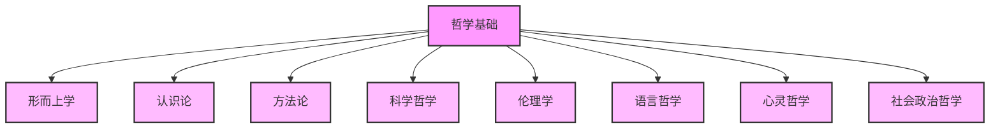
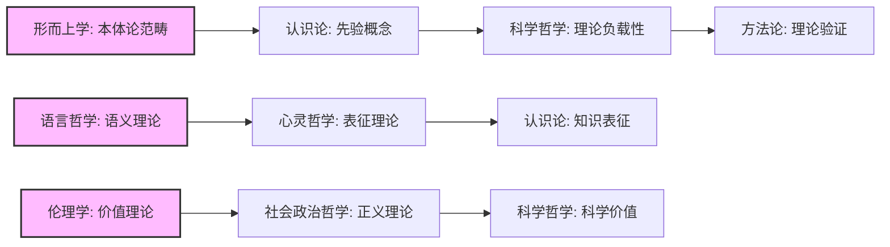

# 哲学基础上下文整合方案

**创建时间**: 2025-01-15  
**最后更新**: 2025-01-15  
**文档状态**: 活跃  

## 1. 整合概述

本文档定义了哲学基础各分支的上下文整合策略，旨在建立一个连贯、一致的哲学基础框架，为形式科学的其他领域提供基础支持。整合过程将处理哲学各分支的概念映射、交叉引用和一致性维护。

## 2. 哲学基础分支结构

哲学基础包含以下主要分支：

## 3. 分支间概念映射

### 3.1 核心概念矩阵

下表展示了哲学各分支之间的核心概念映射关系：

| 来源分支 | 目标分支 | 概念映射 | 映射类型 |
|---------|---------|---------|---------|
| 形而上学 | 认识论 | 存在(Existence) → 知识对象(Object of Knowledge) | 本体-认识论映射 |
| 形而上学 | 科学哲学 | 本质(Essence) → 自然规律(Natural Law) | 本体-科学映射 |
| 认识论 | 方法论 | 知识获取(Knowledge Acquisition) → 研究方法(Research Method) | 认识-方法映射 |
| 认识论 | 语言哲学 | 真理论(Theory of Truth) → 真值语义(Truth-value Semantics) | 认识-语言映射 |
| 方法论 | 科学哲学 | 方法论原则(Methodological Principles) → 科学方法(Scientific Method) | 方法-科学映射 |
| 语言哲学 | 心灵哲学 | 意义理论(Theory of Meaning) → 意向性(Intentionality) | 语言-心灵映射 |
| 伦理学 | 社会政治哲学 | 伦理规范(Ethical Norms) → 社会规范(Social Norms) | 伦理-社会映射 |
| 心灵哲学 | 认识论 | 心灵内容(Mental Content) → 信念(Belief) | 心灵-认识映射 |

### 3.2 跨领域概念桥接

## 4. 上下文整合策略

### 4.1 形而上学整合

形而上学作为最基础的哲学分支，其上下文整合策略如下：

1. **核心本体论概念标准化**:
   - 定义存在(Existence)、本质(Essence)、属性(Property)等概念的标准形式化表示
   - 建立本体论范畴的层级结构
   - 形式化描述不同本体论立场(实在论、唯名论等)

2. **形而上学与其他分支的衔接**:
   - 定义从本体论范畴到认识论范畴的映射关系
   - 建立形而上学概念与科学哲学概念的对应关系
   - 形式化描述形而上学假设对方法论选择的影响

### 4.2 认识论整合

认识论处理知识的本质、范围和获取方式，其上下文整合策略如下：

1. **知识理论标准化**:
   - 统一定义知识(Knowledge)、信念(Belief)、证据(Evidence)等核心概念
   - 形式化不同知识论立场(基础主义、融贯论等)
   - 建立证据与证明的形式联系

2. **认识论与其他分支的衔接**:
   - 建立认识论概念与方法论原则的对应关系
   - 形式化知识获取过程与语言表达的关系
   - 定义认识论假设对科学理论评估的影响

### 4.3 方法论整合

方法论关注知识获取和验证的方法，其上下文整合策略如下：

1. **方法论体系标准化**:
   - 统一定义研究方法(Research Method)、验证(Validation)、论证(Argumentation)等概念
   - 形式化不同方法论框架(分析方法、综合方法等)
   - 建立方法有效性的评估标准

2. **方法论与其他分支的衔接**:
   - 定义方法论原则与科学方法的映射关系
   - 建立方法论选择与认识论立场的联系
   - 形式化方法论与语言分析的关系

### 4.4 科学哲学整合

科学哲学研究科学知识的本质和方法，其上下文整合策略如下：

1. **科学理论标准化**:
   - 统一定义科学理论(Scientific Theory)、解释(Explanation)、预测(Prediction)等概念
   - 形式化不同科学哲学立场(实证主义、科学实在论等)
   - 建立科学理论评估的形式标准

2. **科学哲学与其他分支的衔接**:
   - 定义科学方法与一般方法论的关系
   - 建立科学实践与认识论假设的联系
   - 形式化科学价值与伦理学价值的关系

### 4.5 语言哲学整合

语言哲学研究语言的本质和功能，其上下文整合策略如下：

1. **语言理论标准化**:
   - 统一定义意义(Meaning)、指称(Reference)、语用(Pragmatics)等概念
   - 形式化不同语言哲学理论(真值条件语义学、语用学等)
   - 建立语言表达与形式语言的对应关系

2. **语言哲学与其他分支的衔接**:
   - 定义语言表达与心灵内容的映射关系
   - 建立语义理论与认识论真理理论的联系
   - 形式化语言分析与方法论的关系

### 4.6 心灵哲学整合

心灵哲学研究心灵的本质和功能，其上下文整合策略如下：

1. **心灵理论标准化**:
   - 统一定义心灵状态(Mental State)、意向性(Intentionality)、意识(Consciousness)等概念
   - 形式化不同心灵哲学立场(功能主义、物理主义等)
   - 建立心灵内容的形式表示系统

2. **心灵哲学与其他分支的衔接**:
   - 定义心灵内容与语言表达的映射关系
   - 建立心灵状态与认识论信念的联系
   - 形式化心灵理论与人工智能理论的关系

### 4.7 伦理学整合

伦理学研究道德原则和价值，其上下文整合策略如下：

1. **伦理理论标准化**:
   - 统一定义价值(Value)、规范(Norm)、道德判断(Moral Judgment)等概念
   - 形式化不同伦理学理论(功利主义、义务论等)
   - 建立道德推理的形式系统

2. **伦理学与其他分支的衔接**:
   - 定义伦理价值与社会政治价值的映射关系
   - 建立伦理判断与认识论评价的联系
   - 形式化伦理学原则与科学实践伦理的关系

### 4.8 社会政治哲学整合

社会政治哲学研究社会组织和政治制度，其上下文整合策略如下：

1. **社会政治理论标准化**:
   - 统一定义正义(Justice)、权利(Rights)、自由(Liberty)等概念
   - 形式化不同社会政治理论(自由主义、共同体主义等)
   - 建立社会选择的形式模型

2. **社会政治哲学与其他分支的衔接**:
   - 定义社会规范与伦理规范的映射关系
   - 建立政治理论与认识论立场的联系
   - 形式化社会价值与科学研究导向的关系

## 5. 整合实施步骤

### 5.1 内容准备阶段

1. **概念清单制定**:
   - 为每个哲学分支创建核心概念清单
   - 标注概念的定义、属性和关系
   - 识别跨分支共享的概念

2. **内容分析**:
   - 分析现有文档的内容结构
   - 识别概念定义的一致性问题
   - 确定需要标准化的内容

### 5.2 结构设计阶段

1. **目录结构设计**:
   - 为每个哲学分支创建标准目录结构
   - 确保目录结构反映概念的层次关系
   - 规划交叉引用的组织方式

2. **文档模板设计**:
   - 创建统一的文档模板
   - 定义概念定义、形式化表示、示例和应用的标准格式
   - 设计交叉引用的表示方式

### 5.3 内容创建阶段

1. **核心文档创建**:
   - 为每个哲学分支创建核心概念文档
   - 应用统一的形式化表示
   - 建立初步的交叉引用

2. **概念关联建立**:
   - 创建概念映射文档
   - 实现跨分支概念的一致性
   - 添加详细的关联说明

### 5.4 整合验证阶段

1. **一致性检查**:
   - 验证概念定义的一致性
   - 检查跨分支引用的完整性
   - 确保形式化表示的规范性

2. **整合测试**:
   - 测试哲学基础与其他领域的整合
   - 验证概念映射的有效性
   - 检查上下文流动的畅通性

## 6. 哲学基础上下文完整性矩阵

| 哲学分支 | 内部一致性 | 与其他分支的连接度 | 形式化程度 | 整合优先级 |
|---------|----------|-----------------|----------|----------|
| 形而上学 | 中 | 高 | 中 | 1 |
| 认识论 | 高 | 高 | 高 | 1 |
| 方法论 | 高 | 高 | 高 | 1 |
| 科学哲学 | 中 | 中 | 中 | 2 |
| 语言哲学 | 高 | 高 | 高 | 2 |
| 心灵哲学 | 低 | 中 | 低 | 3 |
| 伦理学 | 中 | 低 | 中 | 3 |
| 社会政治哲学 | 低 | 低 | 低 | 4 |

## 7. 整合时间表

| 阶段 | 任务 | 开始日期 | 结束日期 |
|------|------|---------|---------|
| 准备 | 概念清单制定 | 2025-01-15 | 2025-01-16 |
| 准备 | 内容分析 | 2025-01-16 | 2025-01-17 |
| 设计 | 目录结构设计 | 2025-01-17 | 2025-01-17 |
| 设计 | 文档模板设计 | 2025-01-17 | 2025-01-17 |
| 创建 | 第一优先级分支整合 | 2025-01-17 | 2025-01-18 |
| 创建 | 第二优先级分支整合 | 2025-01-18 | 2025-01-19 |
| 创建 | 第三优先级分支整合 | 2025-01-19 | 2025-01-20 |
| 创建 | 第四优先级分支整合 | 2025-01-20 | 2025-01-21 |
| 验证 | 一致性检查 | 2025-01-21 | 2025-01-22 |
| 验证 | 整合测试 | 2025-01-22 | 2025-01-22 |

## 8. 相关文档

- [上下文系统README](README.md)
- [上下文模型定义](../Models/Context_Models.md)
- [统一目录结构规范](../../统一目录结构规范.md)
- [重构执行计划](../../重构执行计划_20250115.md)
- [哲学基础重构进展](../../持续构建上下文系统/哲学基础重构进展_20250105.md)

## 批判性分析

- 本节内容待补充：请从多元理论视角、局限性、争议点、应用前景等方面进行批判性分析。
