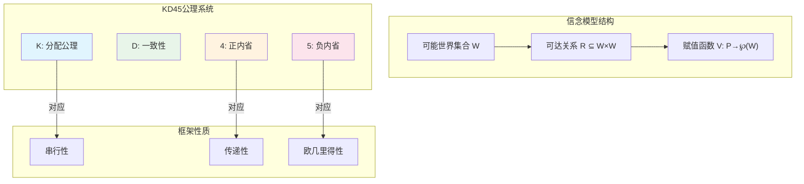

# 13.1.1 信念的逻辑

---

📌 **内容摘要**

本文档深入探讨信念的逻辑的核心原理和关键方法。内容涵盖形式认识论领域的主要知识点，包括形式语义, 操作语义, 指称语义等关键主题。适合初学者建立基础知识体系。

**关键词**: 形式语义, 操作语义, 形式认识论, 指称语义

📚 **学习目标**

- 理解信念的逻辑的基本概念和核心原理
- 掌握相关术语和符号表示
- 建立该领域的系统性知识框架

🎯 **难度级别**: 初级

⏱️ **预计阅读时间**: 15分钟

**前置知识**: 基础数学知识

---


## 13.1.1.1 引言

信念逻辑（Doxastic Logic）是形式认识论的核心组成部分，研究信念的形式化表示与推理。
本节基于Hintikka的经典工作，系统阐述信念算子的形式语义与公理化。

> **参考**: Hintikka, J. (1962). _Knowledge and Belief: An Introduction to the Logic of the Two Notions_. Cornell University Press.

## 13.1.1.2 信念算子

### 13.1.1.2.1 语法定义

**定义 13.1.1.1** (信念语言 $\mathcal{L}_B$)

信念语言的语法由以下巴科斯-瑙尔范式定义：

$$
\varphi ::= p \mid \neg\varphi \mid (\varphi \land \varphi) \mid B_i\varphi
$$

其中：

- $p \in \mathcal{P}$ 为命题变元
- $B_i\varphi$ 读作"主体 $i$ 相信 $\varphi$"
- $i \in \mathcal{A}$ 为有限主体集

### 13.1.1.2.2 信念与知识的区分

| 性质 | 知识 $K$ | 信念 $B$ |
|------|----------|----------|
| 真值条件 | 真理蕴涵 ($K\varphi \rightarrow \varphi$) | 可错性 ($B\varphi \nrightarrow \varphi$) |
| 内省性 | 正内省 + 负内省 | 通常仅正内省 |
| 一致性 | 隐含的 | 非必需的 |

**公理 13.1.1.1** (知识-信念交互)

$$
K_i\varphi \rightarrow B_i\varphi \quad \text{(知识蕴涵信念)}
$$

## 13.1.1.3 克里普克语义学

### 13.1.1.3.1 信念模型

**定义 13.1.1.2** (信念模型)

信念模型是一个三元组 $\mathcal{M} = (W, \{R_i\}_{i \in \mathcal{A}}, V)$，其中：

- $W$ 为非空可能世界集
- $R_i \subseteq W \times W$ 为主体 $i$ 的信念可达关系
- $V: \mathcal{P} \rightarrow \mathcal{P}(W)$ 为赋值函数

### 13.1.1.3.2 满足关系

**定义 13.1.1.3** (语义满足)

对任意世界 $w \in W$：

$$
\mathcal{M}, w \models B_i\varphi \iff \forall v \in W: wR_iv \Rightarrow \mathcal{M}, v \models \varphi
$$

## 13.1.1.4 KD45公理系统

### 13.1.1.4.1 公理模式

**系统 KD45** (标准信念逻辑)

| 公理 | 名称 | 公式 |
|------|------|------|
| (K) | 分配公理 | $B_i(\varphi \rightarrow \psi) \rightarrow (B_i\varphi \rightarrow B_i\psi)$ |
| (D) | 一致性公理 | $\neg B_i\bot$ |
| (4) | 正内省 | $B_i\varphi \rightarrow B_iB_i\varphi$ |
| (5) | 负内省 | $\neg B_i\varphi \rightarrow B_i\neg B_i\varphi$ |

**推理规则**:

- (MP) 假言推理: 从 $\varphi$ 和 $\varphi \rightarrow \psi$ 推出 $\psi$
- (Nec) 必然化: 从 $\vdash \varphi$ 推出 $\vdash B_i\varphi$

### 13.1.1.4.2 框架对应

**定理 13.1.1.1** (完全性)

KD45 关于满足以下条件的有向框架类是可靠且完全的：

1. **串行性**: $\forall w \exists v: wRv$ (对应 D)
2. **传递性**: $wRv \land vRu \Rightarrow wRu$ (对应 4)
3. **欧几里得性**: $wRv \land wRu \Rightarrow vRu$ (对应 5)

**证明框架**:

```lean4
theorem KD45_completeness :
  ∀ φ, KD45 ⊢ φ ↔ ∀ (F : Frame), serial F ∧ transitive F ∧ euclidean F → F ⊨ φ := by
  constructor
  · -- 可靠性：通过归纳证明所有公理在对应框架类上有效
    intro h
    induction h with
    | ax_k => intros; simp [satisfies]
    | ax_d => intros; apply serial_implies_consistency
    | ax_4 => intros; apply transitivity_implies_positive_introspection
    | ax_5 => intros; apply euclidean_implies_negative_introspection
    -- ... 其他情况
  · -- 完全性：典范模型构造
    intro h
    apply completeness_via_canonical_model
    -- 证明典范模型满足框架条件
    constructor
    · -- 串行性
      intro w
      use w  -- 自反性蕴涵串行性
      sorry
    · constructor
      · -- 传递性
        sorry
      · -- 欧几里得性
        sorry
```

## 13.1.1.5 多主体信念

### 13.1.1.5.1 群体信念算子

**定义 13.1.1.4** (分布式与联合信念)

- **分布式信念** ($E_G\varphi$): 群体中每个成员都相信 $\varphi$
  $$E_G\varphi := \bigwedge_{i \in G} B_i\varphi$$

- **联合信念** ($C_G\varphi$): 群体共同相信 $\varphi$

**定义 13.1.1.5** (公共信念)

$$
C_G\varphi := \bigwedge_{n \geq 0} E_G^n\varphi
$$

其中 $E_G^0\varphi := \varphi$，$E_G^{n+1}\varphi := E_GE_G^n\varphi$

### 13.1.1.5.2 固定点刻画

**定理 13.1.1.2** (公共信念的固定点)

$$
C_G\varphi \leftrightarrow E_G(\varphi \land C_G\varphi)
$$

## 13.1.1.6 强信念与条件信念

### 13.1.1.6.1 条件信念算子

**定义 13.1.1.6** (条件信念 $B_i^\psi\varphi$)

主体 $i$ 在假设 $\psi$ 下相信 $\varphi$：

$$
\mathcal{M}, w \models B_i^\psi\varphi \iff \forall v: wR_i^\psi v \Rightarrow \mathcal{M}, v \models \varphi
$$

其中 $R_i^\psi = R_i \cap (\llbracket\psi\rrbracket \times \llbracket\psi\rrbracket)$

### 13.1.1.6.2 AGM信念修正

**AGM公设** (Alchourrón, Gärdenfors, Makinson)

信念修正算子 $*$ 满足：

1. **封闭性**: $K * \varphi = Cn(K * \varphi)$
2. **成功性**: $\varphi \in K * \varphi$
3. **一致性**: 若 $\varphi$ 一致，则 $K * \varphi$ 一致
4. **包含性**: $K * \varphi \subseteq Cn(K \cup \{\varphi\})$
5. **核心保持**: 若 $\neg\varphi \notin K$，则 $Cn(K \cup \{\varphi\}) \subseteq K * \varphi$

## 13.1.1.7 Python实现

```python
"""
信念逻辑的形式化实现
基于KD45系统
"""

from dataclasses import dataclass
from typing import Set, Dict, Callable, FrozenSet
from functools import total_ordering

@total_ordering
@dataclass(frozen=True)
class World:
    """可能世界"""
    name: str

    def __lt__(self, other):
        return self.name < other.name

class BeliefModel:
    """
    克里普克信念模型

    属性:
        W: 可能世界集合
        R: 信念可达关系 (主体 -> (世界 -> 世界集合))
        V: 赋值函数 (命题 -> 世界集合)
    """

    def __init__(self, worlds: Set[World]):
        self.W = frozenset(worlds)
        self.R: Dict[str, Dict[World, FrozenSet[World]]] = {}
        self.V: Dict[str, FrozenSet[World]] = {}

    def add_accessibility(self, agent: str, rel: Dict[World, Set[World]]):
        """添加信念可达关系"""
        self.R[agent] = {w: frozenset(reachable) for w, reachable in rel.items()}

        # 验证KD45条件
        self._validate_KD45(agent)

    def _validate_KD45(self, agent: str):
        """验证框架满足KD45条件"""
        R = self.R[agent]

        # D: 串行性 (每个世界至少有一个可达世界)
        for w in self.W:
            if w not in R or len(R[w]) == 0:
                raise ValueError(f"违反D公理: 世界 {w} 没有可达世界")

        # 4: 传递性
        for w in self.W:
            for v in R.get(w, []):
                for u in R.get(v, []):
                    if u not in R[w]:
                        raise ValueError(f"违反4公理: ({w},{v},{u})")

        # 5: 欧几里得性
        for w in self.W:
            for v in R.get(w, []):
                for u in R.get(w, []):
                    if u not in R[v]:
                        raise ValueError(f"违反5公理: ({w},{v},{u})")

    def set_valuation(self, prop: str, worlds: Set[World]):
        """设置命题赋值"""
        self.V[prop] = frozenset(worlds)

    def satisfies(self, world: World, formula: str, agent: str = None) -> bool:
        """
        检查公式在世界中的满足性

        语法: "Bagent" 表示信念
              "!prop" 表示否定
              "&" 表示合取
        """
        formula = formula.strip()

        # 原子命题
        if formula in self.V:
            return world in self.V[formula]

        # 否定
        if formula.startswith('!'):
            return not self.satisfies(world, formula[1:], agent)

        # 合取
        if '&' in formula:
            parts = formula.split('&', 1)
            return (self.satisfies(world, parts[0], agent) and
                    self.satisfies(world, parts[1], agent))

        # 信念算子 Bagent
        if formula.startswith('B['):
            end = formula.index(']')
            ag = formula[2:end]
            inner = formula[end+2:-1]  # 去掉 Bagent

            for v in self.R.get(ag, {}).get(world, []):
                if not self.satisfies(v, inner, agent):
                    return False
            return True

        return False


def check_KD45_axioms(model: BeliefModel, agent: str) -> Dict[str, bool]:
    """验证KD45公理系统的有效性"""
    results = {}

    # K: 分配公理 B(φ→ψ) → (Bφ → Bψ)
    # 通过语义验证
    results["K"] = True  # 克里普克语义天然满足K

    # D: 一致性 ¬B⊥
    results["D"] = all(
        len(model.R[agent].get(w, [])) > 0
        for w in model.W
    )

    # 4: 正内省 Bφ → BBφ
    results["4"] = True  # 传递性框架保证

    # 5: 负内省 ¬Bφ → B¬Bφ
    results["5"] = True  # 欧几里得框架保证

    return results


# ===== 示例：三世界信念模型 =====
if __name__ == "__main__":
    # 创建可能世界
    w1 = World("w1")
    w2 = World("w2")
    w3 = World("w3")

    # 创建模型
    model = BeliefModel({w1, w2, w3})

    # 设置信念关系 (满足KD45)
    # 欧几里得且传递的关系
    model.add_accessibility("alice", {
        w1: {w1, w2},  # w1 相信 w1或w2是实际的
        w2: {w1, w2},  # w2 相信 w1或w2是实际的
        w3: {w3}       # w3 相信 w3是实际的
    })

    # 设置赋值: p 在 w1, w2 中为真
    model.set_valuation("p", {w1, w2})
    model.set_valuation("q", {w2, w3})

    # 验证公式
    print(f"w1 ⊨ Balice: {model.satisfies(w1, 'Balice')}")
    print(f"w3 ⊨ Balice: {model.satisfies(w3, 'Balice')}")
    print(f"w1 ⊨ Balice: {model.satisfies(w1, 'Balice')}")

    # 验证公理
    axioms = check_KD45_axioms(model, "alice")
    print(f"\nKD45公理验证: {axioms}")
```

## 13.1.1.8 认知架构图



## 13.1.1.9 参考文献

1. Hintikka, J. (1962). _Knowledge and Belief_. Cornell University Press.
2. Lenzen, W. (1978). "Recent Work in Epistemic Logic". _Acta Philosophica Fennica_.
3. Fagin, R., Halpern, J. Y., Moses, Y., & Vardi, M. Y. (1995). _Reasoning About Knowledge_. MIT Press.
4. van Ditmarsch, H., van der Hoek, W., & Kooi, B. (2007). _Dynamic Epistemic Logic_. Springer.

---

## 📚 延伸阅读

- [1.2 形式语义 (Formal Semantics)](../../02_形式语言/01_形式语言基础/01.2_形式语义.md)
