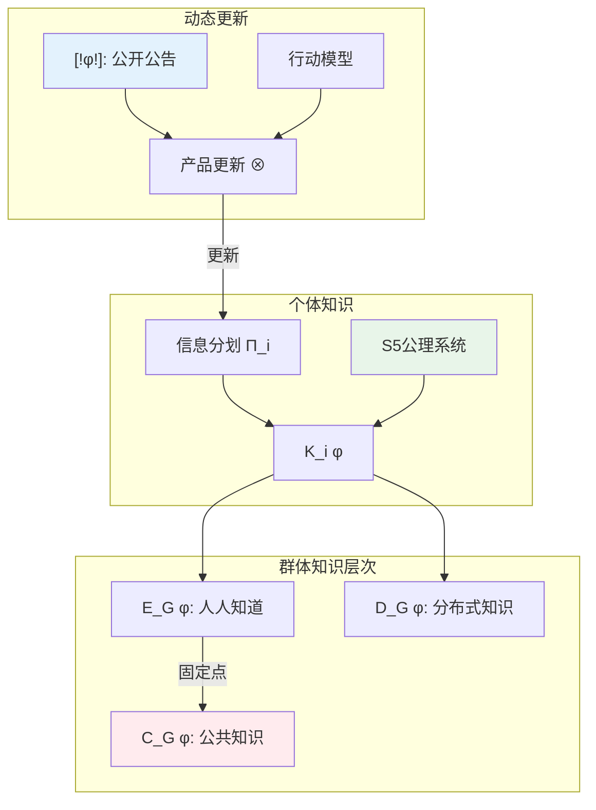

# 13.1.2 知识逻辑

## 13.1.2.1 引言

知识逻辑（Epistemic Logic）研究"知道"这一认知状态的形式化表示。
本节从Hintikka的可能世界语义出发，系统阐述知识算子的形式理论，涵盖个体知识、公共知识与交互认识论。

> **参考**: Fagin, R., Halpern, J. Y., Moses, Y., & Vardi, M. Y. (1995). _Reasoning About Knowledge_. MIT Press.

## 13.1.2.2 知识算子

### 13.1.2.2.1 基本语法

**定义 13.1.2.1** (认知语言 $\mathcal{L}_K$)

$$
\varphi ::= p \mid \neg\varphi \mid (\varphi \land \varphi) \mid K_i\varphi
$$

其中 $K_i\varphi$ 表示"主体 $i$ 知道 $\varphi$"。

### 13.1.2.2.2 S5公理系统

知识的标准逻辑是 **S5**，在信念逻辑KD45基础上增加真实性公理(T)：

| 公理 | 名称 | 公式 | 认知解释 |
|------|------|------|----------|
| (K) | 分配公理 | $K_i(\varphi \rightarrow \psi) \rightarrow (K_i\varphi \rightarrow K_i\psi)$ | 知识对逻辑后承封闭 |
| (T) | 真实性公理 | $K_i\varphi \rightarrow \varphi$ | 知识为真 |
| (4) | 正内省 | $K_i\varphi \rightarrow K_iK_i\varphi$ | 知道即知道知道 |
| (5) | 负内省 | $\neg K_i\varphi \rightarrow K_i\neg K_i\varphi$ | 不知道即知道不知道 |

**定理 13.1.2.1** (S5框架对应)

S5 关于等价关系（自反、传递、对称）的框架类可靠且完全。

## 13.1.2.3 可能世界语义

### 13.1.2.3.1 认知模型

**定义 13.1.2.2** (认知模型)

$$
\mathcal{M} = (W, \{\sim_i\}_{i \in \mathcal{A}}, V)
$$

其中 $\sim_i$ 为主体 $i$ 的不可区分关系（等价关系）。

### 13.1.2.3.2 知识的分层解释

**定义 13.1.2.3** (知识的可能世界定义)

$$
\mathcal{M}, w \models K_i\varphi \iff \forall v: w \sim_i v \Rightarrow \mathcal{M}, v \models \varphi
$$

即：主体 $i$ 知道 $\varphi$ 当且仅当在所有 $i$ 认为可能的世界中 $\varphi$ 为真。

### 13.1.2.3.3 信息分划

**定义 13.1.2.4** (信息分划)

等价关系 $\sim_i$ 诱导 $W$ 的分划 $\Pi_i$：

$$
\Pi_i(w) = \{v \in W \mid w \sim_i v\}
$$

**定理 13.1.2.2** (知识与信息分划)

$$
\mathcal{M}, w \models K_i\varphi \iff \Pi_i(w) \subseteq \llbracket\varphi\rrbracket
$$

## 13.1.2.4 群体知识

### 13.1.2.4.1 分布式知识

**定义 13.1.2.5** ($E$-知识)

群体中每个成员都知道：

$$
E_G\varphi := \bigwedge_{i \in G} K_i\varphi
$$

### 13.1.2.4.2 公共知识

**定义 13.1.2.6** (公共知识)

$$
C_G\varphi := \bigwedge_{n \geq 0} E_G^n\varphi
$$

其中 $E_G^0\varphi = \varphi$，$E_G^{n+1}\varphi = E_G(E_G^n\varphi)$。

**定理 13.1.2.3** (公共知识的语义)

令 $\sim_G^{CE}$ 为 $(\bigcup_{i \in G} \sim_i)^*$（自反传递闭包），则：

$$
\mathcal{M}, w \models C_G\varphi \iff \forall v: w \sim_G^{CE} v \Rightarrow \mathcal{M}, v \models \varphi
$$

### 13.1.2.4.3 分布式知识算子

**定义 13.1.2.7** (分布式知识 $D_G$)

若群体成员的知识合并，他们会知道：

$$
\mathcal{M}, w \models D_G\varphi \iff \forall v: (\bigcap_{i \in G} \sim_i)(w, v) \Rightarrow \mathcal{M}, v \models \varphi
$$

## 13.1.2.5 交互认识论

### 13.1.2.5.1 公告逻辑

**定义 13.1.2.8** (公开公告)

公开公告 $[\!\varphi\!]$ 的语义：

$$
\mathcal{M}, w \models [\!\varphi\!]\psi \iff \mathcal{M}, w \models \varphi \Rightarrow \mathcal{M}|_\varphi, w \models \psi
$$

其中 $\mathcal{M}|_\varphi$ 是 $\varphi$ 为真的子模型。

**归约公理**:

$$
[\!\varphi\!]K_i\psi \leftrightarrow (\varphi \rightarrow K_i(\varphi \rightarrow [\!\varphi\!]\psi))
$$

### 13.1.2.5.2 行动模型

**定义 13.1.2.9** (行动模型)

行动模型 $\mathcal{E} = (E, \{\sim_i\}, \text{pre})$，其中 $\text{pre}: E \rightarrow \mathcal{L}_K$ 为前置条件。

产品更新定义为：

$$
\mathcal{M} \otimes \mathcal{E} = (W', \{\sim_i'\}, V')
$$

其中 $W' = \{(w, e) \mid \mathcal{M}, w \models \text{pre}(e)\}$

## 13.1.2.6 认知复杂性

### 13.1.2.6.1 泥孩子谜题

**场景**: $n$ 个孩子额头上有泥，每个孩子只能看到其他孩子。父亲宣布"你们中至少有一人有泥"。

**分析**:

- 第1轮：若有孩子看到无人有泥，他会知道"我有泥"
- 第 $k$ 轮：若无人宣布，则所有孩子知道至少有两人有泥
- 归纳可知：若恰好有 $n$ 人有泥，第 $n$ 轮他们都会宣布

**形式化**:

令 $p_i$ 表示"孩子 $i$ 有泥"，$E$ 表示"所有人都知道"。

```
初始公共知识: C(⋁_{i=1}^n p_i)
第1轮: ⋀_{i=1}^n (¬K_i p_i → ¬E(⋀_{j≠i} ¬p_j))
```

### 13.1.2.6.2 公共知识与协调

**定理 13.1.2.4** (公共知识与纳什均衡)

在博弈中，若某策略组合是公共知识下的理性选择，则它构成纳什均衡。

## 13.1.2.7 Lean形式化

```lean4
import Mathlib

/-- 认知模型 -/
structure EpistemicModel (W : Type*) where
  /-- 不可区分关系 (等价关系) -/
  indistinguishable : W → W → Prop
  /-- 等价性证明 -/
  is_equivalence : Equivalence indistinguishable
  /-- 命题赋值 -/
  valuation : String → Set W

namespace EpistemicModel

variable {W : Type*} (M : EpistemicModel W) (w : W)

/-- 知识算子 -/
def knows (i : String) (φ : Set W) : Set W :=
  { w | ∀ v, M.indistinguishable w v → v ∈ φ }

/-- S5公理: K(φ → ψ) → (Kφ → Kψ) -/
theorem K_axiom (φ ψ : Set W) :
  M.knows i (φ ⊆ ψ) ⊆ (M.knows i φ ⊆ M.knows i ψ) := by
  intro w h1 h2 v hvw
  exact h1 v hvw (h2 v hvw)

/-- T公理: Kφ → φ (真实性) -/
theorem T_axiom (φ : Set W) : M.knows i φ ⊆ φ := by
  intro w hw
  apply hw
  exact M.is_equivalence.refl w

/-- 4公理: Kφ → KKφ (正内省) -/
theorem four_axiom (φ : Set W) : M.knows i φ ⊆ M.knows i (M.knows i φ) := by
  intro w hw v hvw u hvu
  apply hw
  exact M.is_equivalence.trans hvw hvu

/-- 5公理: ¬Kφ → K¬Kφ (负内省) -/
theorem five_axiom (φ : Set W) : (M.knows i φ)ᶜ ⊆ M.knows i (M.knows i φ)ᶜ := by
  intro w hw v hvw hcontra
  apply hw
  intro u hwu
  have : M.indistinguishable w u := M.is_equivalence.trans
    (M.is_equivalence.symm hvw) hwu
  exact hcontra u this

/-- 公共知识算子 -/
def common_knowledge (agents : List String) (φ : Set W) : Set W :=
  { w | ∀ v, reachable agents w v → v ∈ φ }
where
  reachable : List String → W → W → Prop
  | [], _, v => v = w
  | i::is, u, v => ∃ u', M.indistinguishable u u' ∧ reachable is u' v

end EpistemicModel

/-- 泥孩子谜题的形式化 -/
namespace MuddyChildren

inductive Child : Type
  | child1 | child2 | child3

def hasMud : Child → Prop
  | .child1 => True
  | .child2 => True
  | .child3 => False

/-- 孩子的知识状态 -/
structure ChildState where
  sees : Set Child  -- 看到其他孩子有泥
  knows : Prop      -- 知道的事实

/-- 公告后的知识更新 -/
def afterAnnouncement (children : List Child) (n : Nat) : Prop :=
  match n with
  | 0 => True  -- 父亲公告: 至少一人有泥
  | n+1 => ∀ c ∈ children,
    (if hasMud c then
      (∀ c' ∈ children, c' ≠ c → hasMud c') ∨ afterAnnouncement children n
    else True)

end MuddyChildren
```

## 13.1.2.8 Python实现

```python
"""
知识逻辑的形式化实现
S5系统与公共知识
"""

from dataclasses import dataclass
from typing import Set, Dict, FrozenSet, Tuple, List
from collections import defaultdict

@dataclass(frozen=True)
class World:
    name: str

class EpistemicModel:
    """
    认知模型 (S5)

    不可区分关系 ~ 是等价关系
    """

    def __init__(self, worlds: Set[World]):
        self.W = frozenset(worlds)
        # 主体 -> 等价类分划
        self.partitions: Dict[str, FrozenSet[FrozenSet[World]]] = {}
        self.V: Dict[str, FrozenSet[World]] = {}

    def set_partition(self, agent: str, partition: Set[Set[World]]):
        """
        设置主体的信息分划
        每个等价类内的世界对该主体不可区分
        """
        # 验证分划覆盖所有世界
        all_worlds = set()
        for eq_class in partition:
            all_worlds.update(eq_class)
        if frozenset(all_worlds) != self.W:
            raise ValueError("分划必须覆盖所有世界")

        # 验证等价类不相交
        for i, c1 in enumerate(partition):
            for c2 in list(partition)[i+1:]:
                if not c1.isdisjoint(c2):
                    raise ValueError("等价类必须不相交")

        self.partitions[agent] = frozenset(
            frozenset(c) for c in partition
        )

    def indistinguishable(self, agent: str, w: World, v: World) -> bool:
        """检查两个世界对某主体是否不可区分"""
        if agent not in self.partitions:
            return w == v  # 默认只有相同世界不可区分

        for eq_class in self.partitions[agent]:
            if w in eq_class and v in eq_class:
                return True
        return False

    def info_partition(self, agent: str, w: World) -> FrozenSet[World]:
        """获取某世界中主体的信息分划单元"""
        for eq_class in self.partitions.get(agent, [self.W]):
            if w in eq_class:
                return eq_class
        return frozenset([w])

    def knows(self, agent: str, proposition: Set[World], w: World) -> bool:
        """
        主体在特定世界是否知道某命题
        K_i φ : Π_i(w) ⊆ φ
        """
        partition = self.info_partition(agent, w)
        return partition.issubset(proposition)

    def common_knowledge(self, agents: List[str],
                         proposition: Set[World],
                         w: World) -> bool:
        """
        检查公共知识
        C_G φ: 在从w可达的所有公共知识世界中φ为真
        """
        reachable = self._ck_reachable(agents, w)
        return all(v in proposition for v in reachable)

    def _ck_reachable(self, agents: List[str], w: World) -> Set[World]:
        """计算公共知识可达集 (自反传递闭包)"""
        visited = {w}
        frontier = {w}

        while frontier:
            new_frontier = set()
            for u in frontier:
                for agent in agents:
                    eq_class = self.info_partition(agent, u)
                    new_frontier.update(eq_class)
            new_frontier -= visited
            visited.update(new_frontier)
            frontier = new_frontier

        return visited

    def distributed_knowledge(self, agents: List[str],
                              proposition: Set[World],
                              w: World) -> bool:
        """
        分布式知识
        D_G φ: 基于所有主体信息的交集
        """
        # 计算所有分划的交集
        partition_sets = [
            self.info_partition(a, w) for a in agents
        ]

        # 求交
        intersection = partition_sets[0]
        for ps in partition_sets[1:]:
            intersection = intersection & ps

        return intersection.issubset(proposition)

    def public_announcement(self, phi: Set[World]) -> 'EpistemicModel':
        """
        公开公告 [!φ!]：限制在φ为真的子模型
        """
        new_worlds = self.W & frozenset(phi)
        new_model = EpistemicModel(set(new_worlds))

        # 限制赋值
        for prop, worlds in self.V.items():
            new_model.V[prop] = worlds & new_worlds

        # 限制分划
        for agent, partition in self.partitions.items():
            new_partition = set()
            for eq_class in partition:
                restricted = eq_class & new_worlds
                if restricted:
                    new_partition.add(restricted)
            if new_partition:
                new_model.partitions[agent] = frozenset(
                    frozenset(c) for c in new_partition
                )

        return new_model


# ===== 泥孩子谜题实现 =====
class MuddyChildren:
    """
    泥孩子谜题的形式化
    """

    def __init__(self, n_children: int, n_muddy: int):
        self.n = n_children
        self.m = n_muddy

        # 创建所有可能世界
        # 每个世界是一个元组，表示每个孩子是否有泥
        self.worlds = self._create_worlds()

    def _create_worlds(self) -> Set[World]:
        """创建所有可能的状态组合"""
        worlds = set()
        for i in range(2 ** self.n):
            # 二进制编码每个孩子是否有泥
            mud = [(i >> j) & 1 == 1 for j in range(self.n)]
            if sum(mud) >= 1:  # 至少一人有泥
                name = ''.join('M' if m else 'C' for m in mud)
                worlds.add(World(name))
        return worlds

    def create_model(self) -> EpistemicModel:
        """创建认知模型"""
        model = EpistemicModel(self.worlds)

        # 每个孩子的信息分划
        # 孩子i能看到其他孩子，所以区分不了自己的状态
        for i in range(self.n):
            partition = set()
            for w in self.worlds:
                # 找到所有在除i以外都相同的世界
                same_others = set()
                for v in self.worlds:
                    if self._same_except_i(w, v, i):
                        same_others.add(v)
                if same_others:
                    partition.add(frozenset(same_others))

            model.set_partition(f"child_{i}",
                set(set(c) for c in partition))

        return model

    def _same_except_i(self, w1: World, w2: World, i: int) -> bool:
        """检查两个世界是否在除了第i个孩子外都相同"""
        # 简化的实现：比较名称字符串
        name1 = list(w1.name)
        name2 = list(w2.name)
        name1[i] = name2[i] = '?'
        return name1 == name2

    def solve(self, rounds: int) -> Dict[int, List[int]]:
        """
        求解谜题：返回每轮宣布有泥的孩子
        """
        results = {}

        for r in range(1, rounds + 1):
            # 模拟第r轮
            # 若有孩子看到只有r-1人有泥，且无人宣布，则他知道
            announce = []
            # 简化的逻辑：实际实现需要完整的认知推理
            if r == self.m:
                announce = list(range(self.n))
            results[r] = announce

        return results


# ===== 示例 =====
if __name__ == "__main__":
    # 创建简单认知模型
    w1, w2, w3, w4 = World("w1"), World("w2"), World("w3"), World("w4")

    model = EpistemicModel({w1, w2, w3, w4})

    # Alice的分划: {{w1, w2}, {w3, w4}}
    model.set_partition("alice", {{w1, w2}, {w3, w4}})

    # Bob的分划: {{w1, w3}, {w2, w4}}
    model.set_partition("bob", {{w1, w3}, {w2, w4}})

    # 测试知识
    p = {w1, w2}  # 命题p在w1,w2为真
    print(f"alice在w1知道p: {model.knows('alice', p, w1)}")
    print(f"bob在w1知道p: {model.knows('bob', p, w1)}")

    # 测试公共知识
    print(f"公共知识(两人): {model.common_knowledge(['alice', 'bob'], p, w1)}")

    # 泥孩子谜题
    puzzle = MuddyChildren(3, 2)
    print(f"\n泥孩子谜题 (3人, 2人有泥):")
    solution = puzzle.solve(3)
    for r, children in solution.items():
        print(f"  第{r}轮宣布: {children}")
```

## 13.1.2.9 认知架构图



## 13.1.2.10 参考文献

1. Hintikka, J. (1962). _Knowledge and Belief_. Cornell University Press.
2. Fagin, R., et al. (1995). _Reasoning About Knowledge_. MIT Press.
3. van Ditmarsch, H., et al. (2007). _Dynamic Epistemic Logic_. Springer.
4. Lewis, D. (1969). _Convention: A Philosophical Study_. Harvard University Press.
