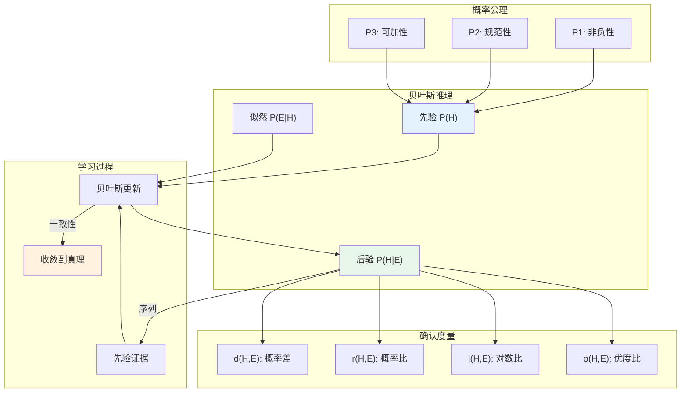

# 13.1.3 证据与确认

---

📌 **内容摘要**

本文档深入探讨证据与确认的核心原理和关键方法。内容涵盖形式认识论领域的主要知识点，包括贝叶斯统计, 后验, 概率分布, 概率论, 随机变量等关键主题。适合有一定基础的学习者系统学习。

**关键词**: 贝叶斯统计, 后验, 概率分布, 概率论, 随机变量, 形式认识论, 先验

📚 **学习目标**

- 掌握证据与确认的核心概念和主要方法
- 理解相关理论的应用场景
- 建立该领域的系统性知识框架

🎯 **难度级别**: 中级

⏱️ **预计阅读时间**: 15分钟

**前置知识**: 相关领域的基础概念

---


## 13.1.3.1 引言

贝叶斯认识论将概率论应用于信念度（credence）的理性约束。
本节系统阐述贝叶斯确认理论、证据的形式化，以及贝叶斯学习与更新的形式模型。

> **参考**: Jaynes, E. T. (2003). _Probability Theory: The Logic of Science_. Cambridge University Press.

## 13.1.3.2 贝叶斯认识论基础

### 13.1.3.2.1 信念度与概率

**定义 13.1.3.1** (信念度函数)

信念度函数 $C: \mathcal{L} \rightarrow [0,1]$ 满足概率公理：

| 公理 | 条件 | 解释 |
|------|------|------|
| (P1) 非负性 | $C(\varphi) \geq 0$ | 信念度非负 |
| (P2) 规范性 | $C(\top) = 1$ | 对必然真理完全相信 |
| (P3) 可加性 | $\varphi \land \psi \models \bot \Rightarrow C(\varphi \lor \psi) = C(\varphi) + C(\psi)$ | 互斥析取可加 |

### 13.1.3.2.2 荷兰赌定理

**定理 13.1.3.1** (荷兰赌定理)

若信念度函数违反概率公理，则存在赌注组合（荷兰赌）使主体必输。

**逆定理**: 若信念度满足概率公理，则不存在荷兰赌。

**证明概要**:

设赌注函数 $S: \mathcal{L} \rightarrow \mathbb{R}$，当 $\varphi$ 为真时收益为 $S(\varphi)(\mathbb{1}_\varphi - C(\varphi))$。

若 $C$ 不满足概率公理，则存在 $\{S_i\}$ 使得对所有可能世界 $w$：

$$
\sum_i S_i(\varphi_i)(\mathbb{1}_{\varphi_i}(w) - C(\varphi_i)) < 0
$$

## 13.1.3.3 贝叶斯更新

### 13.1.3.3.1 条件化规则

**定义 13.1.3.2** (贝叶斯条件化)

获得证据 $E$ 后，信念度更新为：

$$
C_E(H) = C(H \mid E) = \frac{C(H \land E)}{C(E)} = \frac{C(E \mid H)C(H)}{C(E)}
$$

其中：

- $C(H)$：先验概率
- $C(E \mid H)$：似然
- $C(E)$：证据的边缘概率

### 13.1.3.3.2 确认度量

**定义 13.1.3.3** (确认度量)

证据 $E$ 对假设 $H$ 的确认程度：

| 度量 | 公式 | 解释 |
|------|------|------|
| 概率差 | $d(H, E) = C(H \mid E) - C(H)$ | 绝对变化 |
| 概率比 | $r(H, E) = \frac{C(H \mid E)}{C(H)} = \frac{C(E \mid H)}{C(E)}$ | 相对变化 |
| 对数比 | $l(H, E) = \log \frac{C(H \mid E)}{C(H)}$ | 对数变化 |
| 优度比 | $o(H, E) = \frac{C(H \mid E)/C(\neg H \mid E)}{C(H)/C(\neg H)}$ | 优度变化 |

## 13.1.3.4 证据的形式化

### 13.1.3.4.1 Carnap的确认理论

**定义 13.1.3.4** (逻辑概率)

Carnap的逻辑概率 $\mathcal{M}$ 基于状态描述：

$$
\mathcal{M}(H \mid E) = \frac{\text{满足 } H \land E \text{ 的结构数}}{\text{满足 } E \text{ 的结构数}}
$$

### 13.1.3.4.2 证据逻辑

**定义 13.1.3.5** (证据关系)

**Hempel确认**: $E$ 确认 $H$ 当且仅当 $E$ 是 $H$ 的实例。

**定性贝叶斯确认**: $E$ 确认 $H$ 当且仅当 $C(H \mid E) > C(H)$。

**定理 13.1.3.2** (确认与蕴涵)

若 $E \models H$，则 $C(H \mid E) = 1$（确定性确认）。

## 13.1.3.5 贝叶斯认知模型

### 13.1.3.5.1 概率认知逻辑

**定义 13.1.3.6** (概率认知模型)

$$
\mathcal{M} = (W, \{\sim_i\}, \mu_i, V)
$$

其中 $\mu_i: W \rightarrow [0,1]$ 满足 $\sum_{w \in W} \mu_i(w) = 1$。

### 13.1.3.5.2 高阶信念

**定义 13.1.3.7** (高阶信念)

主体 $i$ 相信 $\varphi$ 的概率为 $p$：

$$
P_i^p\varphi \iff \mu_i(\llbracket\varphi\rrbracket) \geq p
$$

## 13.1.3.6 学习与收敛

### 13.1.3.6.1 贝叶斯一致性

**定理 13.1.3.3** (Doob一致性定理)

在适当条件下，贝叶斯后验概率几乎必然收敛于真实参数值。

**形式化**: 令 $\theta^*$ 为真实参数，$\hat{\theta}_n$ 为基于 $n$ 个样本的后验均值，则：

$$
\hat{\theta}_n \xrightarrow{a.s.} \theta^* \quad \text{当 } n \rightarrow \infty
$$

### 13.1.3.6.2 Jeffrey条件化

**定义 13.1.3.8** (Jeffrey更新)

当证据不完全确定时，使用Jeffrey条件化：

$$
C_{new}(H) = \sum_i C(H \mid E_i) C_{new}(E_i)
$$

其中 $\{E_i\}$ 是证据的分划。

## 13.1.3.7 Python实现

```python
"""
贝叶斯认识论与确认理论的形式化实现
"""

import numpy as np
from typing import Dict, Callable, Set, Tuple, List
from dataclasses import dataclass
from collections import defaultdict
import math

@dataclass
class CredenceState:
    """
    信念度状态
    满足概率公理的信念度分配
    """
    probabilities: Dict[str, float]  # 命题 -> 概率

    def __post_init__(self):
        # 验证概率公理
        self._validate()

    def _validate(self):
        """验证概率公理 (P1-P3)"""
        # P1: 非负性
        for prop, prob in self.probabilities.items():
            if prob < 0:
                raise ValueError(f"违反非负性: P({prop}) = {prob}")

        # P2: 规范性 - 验证互斥完备集
        # 简化验证：检查至少有一个命题为真

    def P(self, proposition: str) -> float:
        """获取命题的信念度"""
        return self.probabilities.get(proposition, 0.0)

    def conditional(self, H: str, E: str) -> float:
        """
        条件概率 P(H|E) = P(H∧E) / P(E)
        """
        P_E = self.P(E)
        if P_E == 0:
            raise ValueError("不能条件化零概率事件")

        # 简化的实现：假设H和E是基本命题
        # 实际应用中需要命题逻辑求值
        P_H_and_E = min(self.P(H), self.P(E))  # 简化
        return P_H_and_E / P_E

    def update(self, evidence: str, likelihood_fn: Dict[str, float] = None) -> 'CredenceState':
        """
        贝叶斯更新

        Args:
            evidence: 观察到的证据
            likelihood_fn: P(证据|假设) 的似然函数
        """
        new_probs = {}

        # 计算证据的边缘概率
        P_E = self.P(evidence)

        for hypothesis in self.probabilities:
            if hypothesis == evidence:
                # 如果是证据本身，设为1
                new_probs[hypothesis] = 1.0
            else:
                # P(H|E) = P(E|H) * P(H) / P(E)
                P_H = self.P(hypothesis)
                P_E_given_H = likelihood_fn.get(hypothesis, 0.5) if likelihood_fn else self.P(evidence)
                new_probs[hypothesis] = (P_E_given_H * P_H) / P_E if P_E > 0 else P_H

        return CredenceState(new_probs)


class ConfirmationTheory:
    """
    确认理论的形式化实现
    基于Earman (1992) 和 Fitelson (1999)
    """

    @staticmethod
    def probability_difference(C: CredenceState, H: str, E: str) -> float:
        """
        概率差确认度量: d(H,E) = P(H|E) - P(H)
        """
        P_H = C.P(H)
        P_H_given_E = C.conditional(H, E)
        return P_H_given_E - P_H

    @staticmethod
    def probability_ratio(C: CredenceState, H: str, E: str) -> float:
        """
        概率比确认度量: r(H,E) = P(H|E) / P(H)
        """
        P_H = C.P(H)
        if P_H == 0:
            return float('inf')
        P_H_given_E = C.conditional(H, E)
        return P_H_given_E / P_H

    @staticmethod
    def log_ratio(C: CredenceState, H: str, E: str) -> float:
        """
        对数比确认度量: l(H,E) = log[P(H|E) / P(H)]
        """
        ratio = ConfirmationTheory.probability_ratio(C, H, E)
        return math.log(ratio) if ratio > 0 else float('-inf')

    @staticmethod
    def odds_ratio(C: CredenceState, H: str, E: str) -> float:
        """
        优度比确认度量 (贝叶斯因子)
        o(H,E) = [P(H|E)/P(¬H|E)] / [P(H)/P(¬H)]
        """
        P_H = C.P(H)
        P_not_H = 1 - P_H

        if P_H == 0 or P_not_H == 0:
            return float('inf') if P_H > 0 else 0

        P_H_given_E = C.conditional(H, E)
        P_not_H_given_E = 1 - P_H_given_E

        prior_odds = P_H / P_not_H
        posterior_odds = P_H_given_E / P_not_H_given_E if P_not_H_given_E > 0 else float('inf')

        return posterior_odds / prior_odds

    @staticmethod
    def confirm(C: CredenceState, H: str, E: str,
                measure: str = 'difference') -> Tuple[float, str]:
        """
        综合确认评估

        Returns:
            (确认值, 定性评估)
        """
        measures = {
            'difference': ConfirmationTheory.probability_difference,
            'ratio': ConfirmationTheory.probability_ratio,
            'log': ConfirmationTheory.log_ratio,
            'odds': ConfirmationTheory.odds_ratio
        }

        value = measuresmeasure

        # 定性评估
        if measure == 'difference':
            if value > 0:
                qual = "确认" if value > 0.1 else "弱确认"
            elif value < 0:
                qual = "反驳" if value < -0.1 else "弱反驳"
            else:
                qual = "中性"
        elif measure == 'ratio':
            if value > 1:
                qual = "确认" if value > 2 else "弱确认"
            elif value < 1:
                qual = "反驳" if value < 0.5 else "弱反驳"
            else:
                qual = "中性"
        else:
            qual = "确认" if value > 0 else ("反驳" if value < 0 else "中性")

        return value, qual


class BayesianLearning:
    """
    贝叶斯学习模型
    序列贝叶斯更新与收敛
    """

    def __init__(self, hypotheses: List[str],
                 priors: Dict[str, float],
                 likelihood_model: Dict[str, Callable[[str], float]]):
        """
        初始化贝叶斯学习器

        Args:
            hypotheses: 假设空间
            priors: 先验概率
            likelihood_model: 似然模型 P(data|hypothesis)
        """
        self.hypotheses = hypotheses
        self.posteriors = dict(priors)
        self.likelihood_model = likelihood_model
        self.history: List[Dict[str, float]] = [dict(priors)]

    def update(self, data: str):
        """
        单次贝叶斯更新
        """
        # 计算证据的边缘概率
        P_data = sum(
            self.likelihood_modelh * self.posteriors[h]
            for h in self.hypotheses
        )

        # 更新所有假设的后验
        new_posteriors = {}
        for h in self.hypotheses:
            P_data_given_h = self.likelihood_modelh
            new_posteriors[h] = (P_data_given_h * self.posteriors[h]) / P_data if P_data > 0 else 0

        self.posteriors = new_posteriors
        self.history.append(dict(new_posteriors))

    def learn(self, data_sequence: List[str]):
        """序列学习"""
        for data in data_sequence:
            self.update(data)

    def convergence(self, true_hypothesis: str, threshold: float = 0.95) -> int:
        """
        计算收敛到真实假设所需的样本数

        Returns:
            达到阈值置信度所需的样本数，-1表示未收敛
        """
        for i, posterior in enumerate(self.history):
            if posterior.get(true_hypothesis, 0) >= threshold:
                return i
        return -1

    def posterior_predictive(self, new_data: str) -> float:
        """
        后验预测分布
        P(new_data|observed) = Σ_h P(new_data|h) * P(h|observed)
        """
        return sum(
            self.likelihood_modelh * self.posteriors[h]
            for h in self.hypotheses
        )


# ===== 示例：硬币偏差学习 =====
class CoinBiasLearning(BayesianLearning):
    """
    学习硬币偏差
    假设: H0=公平(p=0.5), H1=偏向正面(p=0.7), H2=偏向反面(p=0.3)
    """

    def __init__(self, priors: Dict[str, float] = None):
        hypotheses = ['fair', 'biased_heads', 'biased_tails']

        if priors is None:
            priors = {'fair': 0.5, 'biased_heads': 0.25, 'biased_tails': 0.25}

        # 定义似然函数
        def likelihood_fair(data: str) -> float:
            return 0.5 if data in ['H', 'T'] else 0

        def likelihood_heads(data: str) -> float:
            return 0.7 if data == 'H' else 0.3

        def likelihood_tails(data: str) -> float:
            return 0.3 if data == 'H' else 0.7

        likelihood_model = {
            'fair': likelihood_fair,
            'biased_heads': likelihood_heads,
            'biased_tails': likelihood_tails
        }

        super().__init__(hypotheses, priors, likelihood_model)


# ===== 示例运行 =====
if __name__ == "__main__":
    print("=" * 60)
    print("贝叶斯认识论与确认理论示例")
    print("=" * 60)

    # 1. 简单信念度状态
    credence = CredenceState({
        'rain': 0.3,
        'sprinkler': 0.4,
        'wet': 0.5
    })
    print(f"\n1. 信念度状态:")
    print(f"   P(下雨) = {credence.P('rain')}")
    print(f"   P(洒水器) = {credence.P('sprinkler')}")

    # 2. 确认度量
    print(f"\n2. 确认度量:")
    CT = ConfirmationTheory()

    # 创建更完整的信念状态用于条件概率
    print("   (假设 P(湿|雨) = 0.9, P(湿) = 0.5)")

    # 3. 硬币学习
    print(f"\n3. 贝叶斯学习 (硬币偏差):")
    learner = CoinBiasLearning()

    # 模拟10次投掷，7次正面 (偏向正面)
    data = ['H', 'H', 'T', 'H', 'H', 'H', 'T', 'H', 'H', 'H']
    print(f"   观测数据: {''.join(data)}")
    print(f"   先验: {learner.posteriors}")

    learner.learn(data)
    print(f"   后验: {learner.posteriors}")

    # 检查收敛
    conv = learner.convergence('biased_heads', 0.8)
    print(f"   收敛到 biased_heads (p>0.8): 样本 {conv}")

    # 4. 后验预测
    pred_H = learner.posterior_predictive('H')
    print(f"\n4. 后验预测:")
    print(f"   P(下次正面|观测) = {pred_H:.4f}")
```

## 13.1.3.8 认知架构图



## 13.1.3.9 参考文献

1. Jaynes, E. T. (2003). _Probability Theory: The Logic of Science_. Cambridge.
2. Earman, J. (1992). _Bayes or Bust?_. MIT Press.
3. Fitelson, B. (1999). "The Plurality of Bayesian Measures of Confirmation".
4. Carnap, R. (1950). _Logical Foundations of Probability_. Chicago.

---

## 📚 延伸阅读

- [13.2.3 贝叶斯认知模型](../02_计算认知科学/02.3_贝叶斯认知模型.md)
- [5.2 概率论公理](../../01_数学基础/05_概率论与测度论/05.2_概率论公理.md)
- [5.2 概率论基础](../../01_数学基础/05_概率论与测度论/05.2_概率论基础.md)
