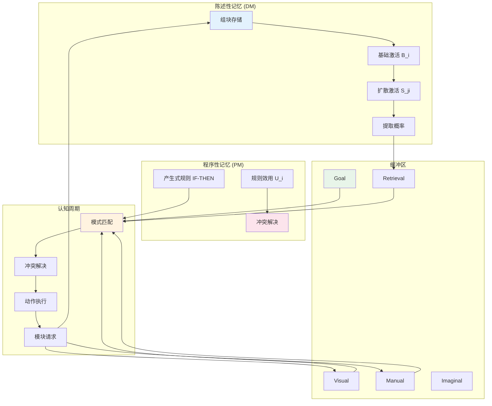

# 13.2.1 认知架构 ACT-R

---

📌 **内容摘要**

本文档深入探讨认知架构 ACT-R的核心原理和关键方法。内容涵盖计算认知科学领域的主要知识点，包括知识逻辑, 形式认识论, 认知科学等关键主题。适合初学者建立基础知识体系。

**关键词**: 知识逻辑, 计算认知科学, 形式认识论, 认知科学

📚 **学习目标**
- 理解认知架构 ACT-R的基本概念和核心原理
- 掌握相关术语和符号表示
- 建立该领域的系统性知识框架

🎯 **难度级别**: 初级

⏱️ **预计阅读时间**: 15分钟

**前置知识**: 基础数学知识

---


## 13.2.1.1 引言

ACT-R（Adaptive Control of Thought–Rational）是由John R. Anderson开发的认知架构，旨在以统一理论解释人类认知。
本节基于Anderson《Unified Theories of Cognition》阐述ACT-R的形式化结构。

> **参考**: Anderson, J. R. (2007). _How Can the Human Mind Occur in the Physical Universe?_. Oxford University Press.
>
> Anderson, J. R., et al. (2004). "An Integrated Theory of the Mind". _Psychological Review_.

## 13.2.1.2 ACT-R体系结构

### 13.2.1.2.1 系统概览

ACT-R由两类记忆系统组成：

| 系统 | 容量 | 持续时间 | 内容 |
|------|------|----------|------|
| **陈述性记忆** (DM) | 无限制 | 长期 | 事实知识 |
| **程序性记忆** (PM) | 无限制 | 长期 | 产生式规则 |
| **工作记忆** (WM) | $7 \pm 2$ 组块 | 短暂 | 当前激活元素 |

### 13.2.1.2.2 模块与缓冲区

**定义 13.2.1.1** (ACT-R模块)

$$
\mathcal{M} = \{M_{goal}, M_{retrieval}, M_{visual}, M_{manual}, M_{imaginal}, \ldots\}
$$

每个模块 $M$ 关联一个**缓冲区** $B_M$，存储当前激活的组块。

**缓冲区状态**:

$$
\text{State}(B_M) \in \{\text{free}, \text{busy}, \text{error}\}
$$

## 13.2.1.3 陈述性记忆的形式化

### 13.2.1.3.1 组块结构

**定义 13.2.1.2** (组块)

组块 $c$ 是一个类型化的属性-值结构：

$$
c = \langle \text{type}: T, (s_1: v_1), (s_2: v_2), \ldots, (s_n: v_n) \rangle
$$

**示例**: 加法事实组块

```
addition-fact123:
  ISA addition-fact
  addend1 3
  addend2 4
  sum 7
```

### 13.2.1.3.2 激活方程

**定义 13.2.1.3** (组块激活)

组块 $i$ 的总激活：

$$
A_i = B_i + \sum_{j \in S} W_j \cdot S_{ji} + \epsilon
$$

其中：

- $B_i$：**基础激活** = $\ln\left(\sum_{k=1}^{n} t_k^{-d}\right)$
- $W_j$：来源 $j$ 的权重
- $S_{ji}$：从来源 $j$ 到组块 $i$ 的关联强度
- $\epsilon \sim N(0, \sigma)$：噪声

**定理 13.2.1.1** (幂律遗忘与练习)

基础激活方程蕴含：

- **练习效应**: 提取时间随练习次数增加而减少
- **遗忘曲线**: 记忆强度随时间呈幂律衰减

### 13.2.1.3.3 提取概率

**定义 13.2.1.4** (提取概率)

$$
P(\text{retrieve } i) = \frac{e^{A_i/\tau}}{\sum_j e^{A_j/\tau}}
$$

其中 $\tau$ 为温度参数（探索-利用权衡）。

提取时间由**Fitts定律**形式描述：

$$
T_{retrieval} = F \cdot e^{-A_i}
$$

## 13.2.1.4 程序性记忆的形式化

### 13.2.1.4.1 产生式规则

**定义 13.2.1.5** (产生式规则)

产生式 $p$ 形如 $IF\; \Phi\; THEN\; \Psi$：

$$
\Phi = \bigwedge_{M} B_M \text{ 匹配 } \text{pattern}_M
$$

$$
\Psi = \bigcup_{M} \{\text{request}_M, \text{modify}_M, \text{clear}_M\}
$$

**示例**: 简单加法规则

```lisp
(p add-numbers
   =goal>
     isa addition-task
     num1 =n1
     num2 =n2
   =retrieval>
     isa addition-fact
     addend1 =n1
     addend2 =n2
     sum =s
   ==>
   =goal>
     result =s
)
```

### 13.2.1.4.2 规则效用与学习

**定义 13.2.1.6** (预期收益)

$$
U_i = P_i \cdot G - C_i
$$

其中：

- $P_i$：规则成功达成目标的概率
- $G$：目标价值
- $C_i$：规则执行成本

**学习机制**: 通过**强化学习**更新 $U_i$：

$$
\Delta U_i = \alpha \cdot (R - U_i)
$$

## 13.2.1.5 认知周期

### 13.2.1.5.1 处理周期

**定义 13.2.1.7** (认知周期)

一个认知周期包含以下阶段：

```
┌─────────────────────────────────────────────────────────┐
│  1. 模式匹配 (Pattern Matching): 识别可触发的产生式    │
│  2. 冲突解决 (Conflict Resolution): 选择最优产生式     │
│  3. 动作执行 (Action Execution): 执行产生式右侧动作    │
│  4. 模块请求 (Module Requests): 向模块发送请求         │
│  5. 结果整合 (Result Integration): 整合模块返回结果    │
└─────────────────────────────────────────────────────────┘
```

**周期时间**: ~50ms（基于认知心理学实验）

### 13.2.1.5.2 并行与串行

**定理 13.2.1.2** (ACT-R并行性约束)

- **模块内串行**: 每个模块一次处理一个请求
- **模块间并行**: 不同模块可并行操作
- **产生式执行串行**: 每周期只执行一条产生式

## 13.2.1.6 形式语义

### 13.2.1.6.1 状态转换系统

**定义 13.2.1.8** (ACT-R状态)

状态 $S = (B, D, t)$，其中：

- $B$：所有缓冲区的内容
- $D$：陈述性记忆的状态（激活向量）
- $t$：当前时间

**定义 13.2.1.9** (状态转换)

$$
S \xrightarrow{p} S' \iff \Phi_p(B) \land B' = \Psi_p(B) \land D' = \text{update}(D, t)
$$

### 13.2.1.6.2 认知复杂性预测

**定理 13.2.1.3** (任务复杂度与周期数)

对于需要 $n$ 次提取和 $m$ 次视觉-手动操作的认知任务：

$$
T_{task} \approx 50n + 100m \quad \text{(ms)}
$$

## 13.2.1.7 Python实现

```python
"""
ACT-R认知架构的形式化实现
基于Anderson (2007)的统一认知理论
"""

import numpy as np
from dataclasses import dataclass, field
from typing import Dict, List, Optional, Callable, Set, Tuple, Any
from collections import defaultdict
import random
import math
from enum import Enum, auto


class BufferState(Enum):
    """缓冲区状态"""
    FREE = auto()
    BUSY = auto()
    ERROR = auto()


@dataclass
class Chunk:
    """
    ACT-R组块

    属性:
        chunk_type: 组块类型 (ISA)
        slots: 属性-值对
        base_activation: 基础激活
        creation_time: 创建时间
        references: 引用历史
    """
    chunk_type: str
    slots: Dict[str, Any] = field(default_factory=dict)
    base_activation: float = 0.0
    creation_time: float = 0.0
    references: List[float] = field(default_factory=list)

    def __hash__(self):
        return hash((self.chunk_type, tuple(sorted(self.slots.items()))))

    def matches(self, pattern: Dict[str, Any]) -> bool:
        """检查组块是否匹配模式"""
        for slot, value in pattern.items():
            if slot == 'ISA':
                if self.chunk_type != value:
                    return False
            elif self.slots.get(slot) != value:
                return False
        return True


class DeclarativeMemory:
    """
    陈述性记忆系统

    实现激活方程和提取机制
    """

    # ACT-R默认参数
    DEFAULT_DECAY = 0.5  # 衰减参数 d
    DEFAULT_NOISE = 0.4  # 激活噪声 s
    DEFAULT_TEMPERATURE = 1.0  # 温度参数 τ
    DEFAULT_LATENCY_FACTOR = 0.2  # 提取延迟因子 F

    def __init__(self,
                 decay: float = DEFAULT_DECAY,
                 noise: float = DEFAULT_NOISE,
                 temperature: float = DEFAULT_TEMPERATURE,
                 latency_factor: float = DEFAULT_LATENCY_FACTOR):
        self.chunks: Set[Chunk] = set()
        self.decay = decay
        self.noise = noise
        self.temperature = temperature
        self.latency_factor = latency_factor
        self.time = 0.0

        # 关联强度学习
        self.associations: Dict[Tuple[str, str], float] = {}

    def add_chunk(self, chunk: Chunk):
        """添加组块到陈述性记忆"""
        chunk.creation_time = self.time
        self.chunks.add(chunk)

    def reference_chunk(self, chunk: Chunk):
        """记录组块引用"""
        chunk.references.append(self.time)

    def compute_base_activation(self, chunk: Chunk) -> float:
        """
        计算基础激活
        B_i = ln(Σ t_k^(-d))
        """
        if not chunk.references:
            return chunk.base_activation

        activation_sum = sum(
            (self.time - t) ** (-self.decay)
            for t in chunk.references
        )

        # 加上噪声
        noise = random.gauss(0, self.noise)
        return math.log(max(activation_sum, 1e-10)) + noise

    def compute_spreading_activation(self, chunk: Chunk,
                                     source_chunks: List[Chunk]) -> float:
        """
        计算扩散激活
        S_ji = Σ W_j * S_ji
        """
        spreading = 0.0
        for source in source_chunks:
            key = (source.chunk_type, chunk.chunk_type)
            assoc_strength = self.associations.get(key, 0.1)
            spreading += assoc_strength
        return spreading

    def compute_activation(self, chunk: Chunk,
                          source_chunks: List[Chunk] = None) -> float:
        """计算总激活"""
        base = self.compute_base_activation(chunk)
        spreading = 0.0
        if source_chunks:
            spreading = self.compute_spreading_activation(chunk, source_chunks)
        return base + spreading

    def retrieval_probability(self, chunk: Chunk,
                             candidates: List[Chunk],
                             source_chunks: List[Chunk] = None) -> float:
        """
        计算组块的提取概率（Softmax）
        P(retrieve i) = exp(A_i/τ) / Σ exp(A_j/τ)
        """
        activations = [
            self.compute_activation(c, source_chunks)
            for c in candidates
        ]

        exp_acts = [math.exp(a / self.temperature) for a in activations]
        sum_exp = sum(exp_acts)

        chunk_idx = candidates.index(chunk)
        return exp_acts[chunk_idx] / sum_exp if sum_exp > 0 else 0

    def retrieve(self, pattern: Dict[str, Any],
                 source_chunks: List[Chunk] = None,
                 threshold: float = None) -> Optional[Tuple[Chunk, float]]:
        """
        从陈述性记忆中提取组块

        Returns:
            (提取的组块, 提取时间) 或 None
        """
        # 匹配候选
        candidates = [c for c in self.chunks if c.matches(pattern)]

        if not candidates:
            return None

        # 计算每个候选的激活和概率
        chunk_probs = []
        for chunk in candidates:
            act = self.compute_activation(chunk, source_chunks)
            prob = self.retrieval_probability(chunk, candidates, source_chunks)
            chunk_probs.append((chunk, act, prob))

        # 选择最可能的组块
        chunk_probs.sort(key=lambda x: x[2], reverse=True)
        best_chunk, best_act, best_prob = chunk_probs[0]

        # 计算提取时间
        retrieval_time = self.latency_factor * math.exp(-best_act)

        # 记录引用
        self.reference_chunk(best_chunk)

        return best_chunk, retrieval_time

    def blend_retrieval(self, pattern: Dict[str, Any],
                        slot: str) -> Optional[Any]:
        """
        混合提取：基于激活加权的值混合
        用于预测数值估计
        """
        candidates = [c for c in self.chunks if c.matches(pattern)]

        if not candidates:
            return None

        activations = [self.compute_activation(c) for c in candidates]

        # 归一化权重
        max_act = max(activations)
        weights = [math.exp(a - max_act) for a in activations]
        total_weight = sum(weights)
        weights = [w / total_weight for w in weights]

        # 加权混合
        values = [c.slots.get(slot, 0) for c in candidates]
        blended = sum(w * v for w, v in zip(weights, values))

        return blended


@dataclass
class ProductionRule:
    """
    ACT-R产生式规则

    IF 缓冲区模式 THEN 动作
    """
    name: str
    conditions: Dict[str, Dict[str, Any]]  # 缓冲区 -> 模式
    actions: List[Tuple[str, str, Any]]  # (缓冲区, 操作, 值)
    utility: float = 0.0  # 预期效用

    def matches(self, buffers: Dict[str, Optional[Chunk]]) -> bool:
        """检查规则是否匹配当前缓冲区状态"""
        for buffer_name, pattern in self.conditions.items():
            chunk = buffers.get(buffer_name)
            if chunk is None:
                return False
            if not chunk.matches(pattern):
                return False
        return True

    def execute(self, buffers: Dict[str, Optional[Chunk]],
                dm: DeclarativeMemory) -> Dict[str, Optional[Chunk]]:
        """执行规则动作"""
        new_buffers = dict(buffers)

        for buffer_name, operation, value in self.actions:
            if operation == 'set':
                new_buffers[buffer_name] = value
            elif operation == 'clear':
                new_buffers[buffer_name] = None
            elif operation == 'retrieve':
                # 触发陈述性记忆提取
                result = dm.retrieve(value)
                if result:
                    new_buffers['retrieval'] = result[0]

        return new_buffers


class ACTRModel:
    """
    ACT-R认知架构完整模型
    """

    CYCLE_TIME = 0.05  # 50ms 认知周期

    def __init__(self):
        # 模块
        self.dm = DeclarativeMemory()

        # 缓冲区
        self.buffers: Dict[str, Optional[Chunk]] = {
            'goal': None,
            'retrieval': None,
            'visual': None,
            'manual': None,
            'imaginal': None
        }

        # 缓冲区状态
        self.buffer_states: Dict[str, BufferState] = {
            name: BufferState.FREE for name in self.buffers
        }

        # 产生式规则
        self.productions: List[ProductionRule] = []

        # 性能统计
        self.cycle_count = 0
        self.total_time = 0.0

    def add_production(self, rule: ProductionRule):
        """添加产生式规则"""
        self.productions.append(rule)

    def set_goal(self, chunk: Chunk):
        """设置目标缓冲区"""
        self.buffers['goal'] = chunk

    def run_cycle(self) -> Optional[ProductionRule]:
        """
        执行一个认知周期

        Returns:
            触发的产生式规则，如果没有则为None
        """
        self.cycle_count += 1

        # 1. 模式匹配
        matching_productions = [
            p for p in self.productions if p.matches(self.buffers)
        ]

        if not matching_productions:
            return None

        # 2. 冲突解决（选择效用最高的规则）
        matching_productions.sort(key=lambda p: p.utility, reverse=True)
        selected = matching_productions[0]

        # 3. 执行动作
        self.buffers = selected.execute(self.buffers, self.dm)

        # 4. 更新DM时间
        self.dm.time += self.CYCLE_TIME
        self.total_time += self.CYCLE_TIME

        return selected

    def run(self, max_cycles: int = 1000) -> Dict:
        """
        运行模型直到目标完成或达到最大周期

        Returns:
            运行统计
        """
        triggered = []

        for _ in range(max_cycles):
            # 检查是否完成（goal为空或特定状态）
            if self.buffers.get('goal') is None:
                break

            rule = self.run_cycle()
            if rule:
                triggered.append(rule.name)
            else:
                break

        return {
            'cycles': self.cycle_count,
            'time': self.total_time,
            'rules_triggered': triggered
        }


# ===== 示例：简单加法任务 =====
class AdditionTask:
    """使用ACT-R模拟简单加法"""

    def __init__(self):
        self.model = ACTRModel()
        self.setup_knowledge()
        self.setup_productions()

    def setup_knowledge(self):
        """设置加法事实到陈述性记忆"""
        facts = [
            (2, 3, 5), (3, 4, 7), (5, 7, 12),
            (1, 1, 2), (4, 5, 9), (6, 8, 14)
        ]

        for a, b, s in facts:
            chunk = Chunk(
                chunk_type='addition-fact',
                slots={'addend1': a, 'addend2': b, 'sum': s}
            )
            self.model.dm.add_chunk(chunk)

    def setup_productions(self):
        """设置产生式规则"""

        # 规则1: 发起检索
        rule1 = ProductionRule(
            name='initiate-retrieval',
            conditions={
                'goal': {'ISA': 'addition-task', 'state': 'start'}
            },
            actions=[
                ('retrieval', 'retrieve', {'ISA': 'addition-fact'}),
                ('goal', 'set', Chunk('addition-task', {'state': 'retrieving'}))
            ],
            utility=1.0
        )

        # 规则2: 记录结果
        rule2 = ProductionRule(
            name='record-result',
            conditions={
                'goal': {'ISA': 'addition-task', 'state': 'retrieving'},
                'retrieval': {'ISA': 'addition-fact'}
            },
            actions=[
                ('goal', 'set', None),  # 完成任务
            ],
            utility=1.0
        )

        self.model.add_production(rule1)
        self.model.add_production(rule2)

    def solve(self, num1: int, num2: int) -> Dict:
        """解决加法问题"""
        goal = Chunk(
            chunk_type='addition-task',
            slots={'num1': num1, 'num2': num2, 'state': 'start'}
        )
        self.model.set_goal(goal)

        return self.model.run()


# ===== 示例运行 =====
if __name__ == "__main__":
    print("=" * 60)
    print("ACT-R认知架构示例")
    print("=" * 60)

    # 简单加法任务
    task = AdditionTask()
    result = task.solve(3, 4)

    print(f"\n加法任务 (3 + 4):")
    print(f"  认知周期: {result['cycles']}")
    print(f"  总时间: {result['time']*1000:.1f} ms")
    print(f"  触发的规则: {result['rules_triggered']}")

    # 陈述性记忆测试
    print(f"\n陈述性记忆测试:")
    dm = task.model.dm
    pattern = {'ISA': 'addition-fact', 'addend1': 3, 'addend2': 4}
    retrieved = dm.retrieve(pattern)

    if retrieved:
        chunk, time = retrieved
        print(f"  检索到: {chunk.slots}")
        print(f"  提取时间: {time*1000:.2f} ms")
```

## 13.2.1.8 认知架构图



## 13.2.1.9 参考文献

1. Anderson, J. R. (2007). _How Can the Human Mind Occur in the Physical Universe?_. Oxford.
2. Anderson, J. R., et al. (2004). "An Integrated Theory of the Mind". _Psychological Review_, 111(4), 1036-1060.
3. Anderson, J. R. (1993). _Rules of the Mind_. Erlbaum.
4. Newell, A. (1990). _Unified Theories of Cognition_. Harvard University Press.
---

## 📚 延伸阅读

- [1.2 形式语义 (Formal Semantics)](./02_形式语言/01_形式语言基础/01.2_形式语义.md)
