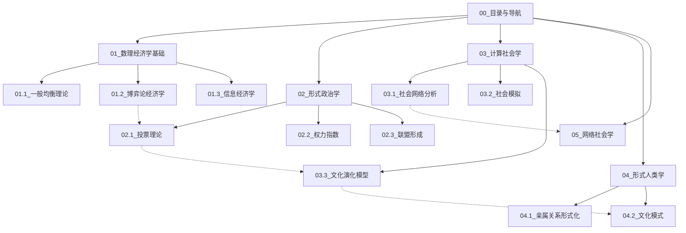
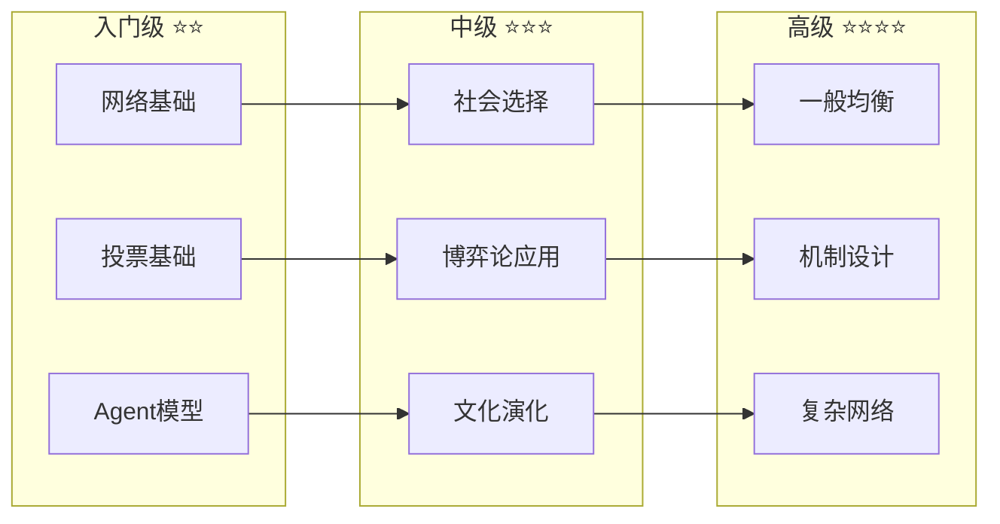
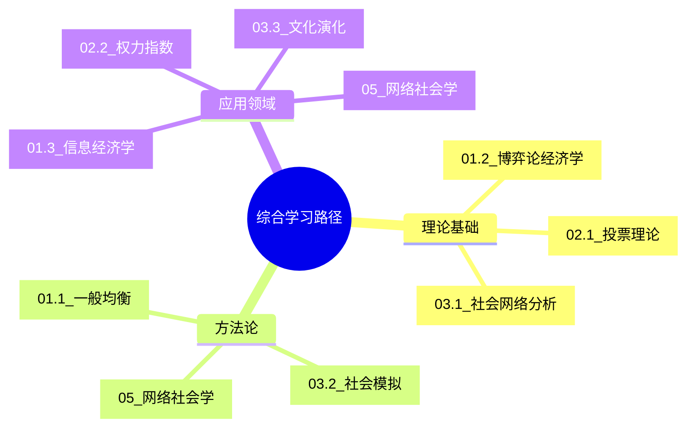

# 15.0 目录与导航

---

📌 **内容摘要**

本文档深入探讨目录与导航的核心原理和关键方法。内容涵盖社会科学形式化领域的主要知识点，包括投票, 博弈, 均衡, 权力指数等关键主题。适合具备相关基础的学习者进行深入研究。

**关键词**: 投票, 社会科学形式化, 博弈, 均衡, 权力指数, 形式政治学, 数理经济学

📚 **学习目标**

- 深入理解目录与导航的理论体系和形式化方法
- 能够进行相关定理的形式化证明
- 建立该领域的系统性知识框架

🎯 **难度级别**: 高级

⏱️ **预计阅读时间**: 15分钟

**前置知识**: 该领域的中级知识, 形式化方法基础

---


> 社会科学形式化模块完整目录与学习导航系统

---

## 1 完整目录树

### 1.1 模块根目录

```
docs/Refactor/15_社会科学形式化/
├── README.md                          [模块概述]
├── 00_目录与导航.md                    [本文档]
├── 01_数理经济学基础.md                 [综合文档]
├── 02_形式政治学.md                     [综合文档]
├── 03_计算社会学.md                     [综合文档]
├── 04_形式人类学.md                     [综合文档]
├── 05_网络社会学.md                     [综合文档]
├── _index.md                          [索引文件]
│
├── 01_数理经济学基础/                   [子目录]
│   ├── 01.1_一般均衡理论.md
│   ├── 01.2_博弈论经济学.md
│   └── 01.3_信息经济学.md
│
├── 02_形式政治学/                       [子目录]
│   ├── 02.1_投票理论.md
│   ├── 02.2_权力指数.md
│   └── 02.3_联盟形成.md
│
├── 03_计算社会学/                       [子目录]
│   ├── 03.1_社会网络分析.md
│   ├── 03.2_社会模拟.md
│   └── 03.3_文化演化模型.md
│
└── 04_形式人类学/                       [子目录]
    ├── 04.1_亲属关系形式化.md
    └── 04.2_文化模式.md
```

### 1.2 文档依赖关系



---

## 2 内容导航

### 2.1 按主题导航

#### 经济决策

| 主题 | 文档 | 核心概念 |
|------|------|---------|
| 市场均衡 | 01.1_一般均衡理论 | Arrow-Debreu模型、Walras法则 |
| 策略互动 | 01.2_博弈论经济学 | 纳什均衡、子博弈精炼 |
| 信息不对称 | 01.3_信息经济学 | 逆向选择、道德风险 |

#### 政治决策

| 主题 | 文档 | 核心概念 |
|------|------|---------|
| 投票规则 | 02.1_投票理论 | Arrow定理、Condorcet循环 |
| 权力分配 | 02.2_权力指数 | Shapley值、Banzhaf指数 |
| 联盟博弈 | 02.3_联盟形成 | 核心、稳定集 |

#### 社会结构

| 主题 | 文档 | 核心概念 |
|------|------|---------|
| 网络分析 | 03.1_社会网络分析 | 中心性、社群检测 |
| 社会模拟 | 03.2_社会模拟 | Agent模型、涌现 |
| 文化演化 | 03.3_文化演化模型 | Axelrod模型、 memetics |
| 亲属系统 | 04.1_亲属关系形式化 | 婚姻代数、交换结构 |
| 文化模式 | 04.2_文化模式 | 符号系统、深层结构 |

#### 数字社会

| 主题 | 文档 | 核心概念 |
|------|------|---------|
| 在线网络 | 05.1_在线社会网络 | 超链接、用户生成内容 |
| 信息传播 | 05.2_信息传播动力学 | 级联、病毒式传播 |
| 数字行为 | 05.3_计算社会行为 | 大数据、机器学习 |

### 2.2 按难度导航



---

## 3 学习路径推荐

### 3.1 经济学路径

```
阶段1: 基础
├── 01.1_一般均衡理论
│   └── Arrow-Debreu模型
│   └── 福利定理
└── 01.2_博弈论经济学
    └── 纳什均衡
    └── 策略形式博弈

阶段2: 应用
├── 01.3_信息经济学
│   └── 信号传递
│   └── 委托-代理
└── 02.3_联盟形成
    └── 合作博弈
    └── 核心概念

阶段3: 综合
└── 03_计算社会学
    └── 社会网络
    └── 经济网络应用
```

### 3.2 政治学路径

```
阶段1: 基础
├── 02.1_投票理论
│   └── Arrow不可能定理
│   └── Condorcet悖论
└── 02.2_权力指数
    └── Shapley-Shubik
    └── Banzhaf指数

阶段2: 机制
├── 02.3_联盟形成
│   └── 稳定匹配
│   └── 政府形成
└── 01.2_博弈论经济学
    └── 机制设计
    └── 拍卖理论

阶段3: 实证
└── 05_网络社会学
    └── 政治网络
    └── 舆论动力学
```

### 3.3 社会学路径

```
阶段1: 结构
├── 03.1_社会网络分析
│   └── 中心性度量
│   └── 社群检测
└── 04.1_亲属关系形式化
    └── 亲属结构
    └── 婚姻规则

阶段2: 动力学
├── 03.2_社会模拟
│   └── Agent模型
│   └── Schelling模型
└── 03.3_文化演化模型
    └── Axelrod模型
    └── 文化扩散

阶段3: 数字
└── 05_网络社会学
    └── 在线网络
    └── 信息传播
```

### 3.4 跨学科综合路径



---

## 4 前置知识索引

### 4.1 数学基础要求

| 主题 | 所需数学 | 参考模块 |
|------|---------|---------|
| 一般均衡 | 凸分析、拓扑 | 01_数学基础/04_分析学 |
| 博弈论 | 优化、概率 | 01_数学基础/04_分析学 |
| 投票理论 | 组合数学、逻辑 | 01_数学基础/01_元数学基础 |
| 社会网络 | 图论、线性代数 | 11_系统科学/05_网络科学 |
| 社会模拟 | 概率论、统计 | 09_统计学 |
| 文化演化 | 动力系统、随机过程 | 11_系统科学/03_复杂系统 |

### 4.2 编程技能要求

| 主题 | 推荐语言 | 用途 |
|------|---------|------|
| 经济模型 | Python/MATLAB | 优化、均衡计算 |
| 博弈论 | Python/Gambit | 均衡求解 |
| 网络分析 | Python(R) | 图算法、可视化 |
| Agent模拟 | Python(NetLogo) | 多Agent仿真 |
| 大数据分析 | Python | 机器学习、NLP |

---

## 5 交叉引用矩阵

### 5.1 内部交叉引用

| 文档 | 引用内容 | 被引用文档 |
|------|---------|-----------|
| 01_数理经济学基础 | 博弈论基础 | 02_形式政治学 |
| 02_形式政治学 | 社会选择 | 03_计算社会学 |
| 03_计算社会学 | 网络分析 | 05_网络社会学 |
| 03.3_文化演化模型 | 文化传播 | 04_形式人类学 |
| 01.2_博弈论经济学 | 拍卖理论 | 02.2_权力指数 |

### 5.2 外部模块引用

| 本文档 | 引用外部模块 | 具体内容 |
|--------|-------------|---------|
| 01_数理经济学基础 | 01_数学基础 | 优化理论、凸分析 |
| 01_数理经济学基础 | 12_决策与博弈论 | 博弈论基础 |
| 02_形式政治学 | 12_决策与博弈论 | 社会选择理论 |
| 03_计算社会学 | 11_系统科学 | 网络科学、复杂系统 |
| 03.2_社会模拟 | 03_编程范式 | Agent编程 |
| 05_网络社会学 | 10_信息论 | 信息传播 |

---

## 6 快速查找表

### 6.1 定理索引

| 定理 | 所在文档 | 页码 |
|------|---------|------|
| Arrow不可能定理 | 02.1_投票理论 | - |
| Arrow-Debreu存在性定理 | 01.1_一般均衡理论 | - |
| 第一福利定理 | 01.1_一般均衡理论 | - |
| Gibbard-Satterthwaite定理 | 02.1_投票理论 | - |
| 中位选民定理 | 02.1_投票理论 | - |
| Shapley值定理 | 02.2_权力指数 | - |
| 小世界定理 | 03.1_社会网络分析 | - |
| 无标度网络定理 | 03.1_社会网络分析 | - |

### 6.2 概念索引

| 概念 | 首次出现 | 相关文档 |
|------|---------|---------|
| 纳什均衡 | 01.2_博弈论经济学 | 01, 02, 12 |
| 帕累托最优 | 01.1_一般均衡理论 | 01, 02, 12 |
| Condorcet赢家 | 02.1_投票理论 | 02 |
| 中心性 | 03.1_社会网络分析 | 03, 05, 11 |
| 优先连接 | 03.1_社会网络分析 | 03, 11 |
| 文化吸引子 | 03.3_文化演化模型 | 03, 04 |

---

## 7 练习与项目

### 7.1 推荐练习

| 文档 | 练习类型 | 难度 |
|------|---------|------|
| 01.1_一般均衡理论 | 均衡计算 | ⭐⭐⭐ |
| 02.1_投票理论 | 投票规则比较 | ⭐⭐ |
| 03.1_社会网络分析 | 网络度量计算 | ⭐⭐ |
| 03.2_社会模拟 | Agent模型实现 | ⭐⭐⭐ |
| 05_网络社会学 | 数据抓取与分析 | ⭐⭐⭐ |

### 7.2 综合项目

1. **市场设计项目**: 设计并模拟一个双边匹配市场
2. **选举模拟项目**: 比较不同投票规则下的选举结果
3. **社交网络分析项目**: 分析真实社交网络数据集
4. **文化演化模拟项目**: 实现Axelrod文化模型并扩展
5. **信息传播项目**: 模拟谣言/信息在社交网络中的传播

---

## 8 更新日志

| 版本 | 日期 | 更新内容 |
|------|------|---------|
| v1.0.0 | 2026-04-12 | 初始版本，创建完整文档结构 |

---

**导航提示**: 使用 Ctrl+F 快速查找关键词，或点击文档链接跳转至相关内容。
---

## 📚 延伸阅读

- [15.4 形式人类学](./04_形式人类学/04.2_文化模式.md)
- [2.2 线性代数](../01_数学基础/02_代数学/02.2_线性代数.md)
- [2.3 线性代数](../01_数学基础/02_代数学/02.3_线性代数.md)
- [11.17 图论基础](../11_系统科学/05_网络科学/05.1_图论基础.md)
- [11.5 网络科学](../11_系统科学/05_网络科学.md)
