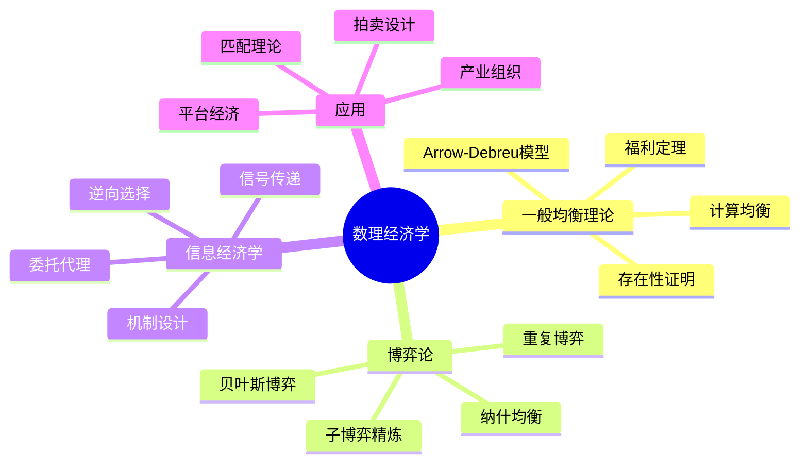

# 15.1 数理经济学基础

> **Mathematical Economics**: 运用严格的数学方法分析经济系统的结构与行为

---

## 目录

- [15.1 数理经济学基础](#151-数理经济学基础)
  - [目录](#目录)
  - [1.1 一般均衡理论](#11-一般均衡理论)
    - [1.1.1 Arrow-Debreu模型](#111-arrow-debreu模型)
    - [1.1.2 均衡存在性定理](#112-均衡存在性定理)
    - [1.1.3 福利经济学基本定理](#113-福利经济学基本定理)
    - [1.1.4 均衡计算](#114-均衡计算)
  - [1.2 博弈论经济学](#12-博弈论经济学)
    - [1.2.1 策略形式博弈](#121-策略形式博弈)
    - [1.2.2 均衡存在性](#122-均衡存在性)
    - [1.2.3 子博弈精炼均衡](#123-子博弈精炼均衡)
    - [1.2.4 博弈论经济学应用](#124-博弈论经济学应用)
  - [1.3 信息经济学](#13-信息经济学)
    - [1.3.1 逆向选择](#131-逆向选择)
    - [1.3.2 信号传递](#132-信号传递)
    - [1.3.3 委托-代理理论](#133-委托-代理理论)
  - [1.4 方法对比](#14-方法对比)
    - [1.4.1 均衡概念对比](#141-均衡概念对比)
    - [1.4.2 经济学方法对比](#142-经济学方法对比)
    - [1.4.3 计算方法对比](#143-计算方法对比)
  - [1.5 应用案例](#15-应用案例)
    - [1.5.1 案例一：拍卖设计](#151-案例一拍卖设计)
    - [1.5.2 案例二：双边匹配](#152-案例二双边匹配)
    - [1.5.3 案例三：平台经济学](#153-案例三平台经济学)
  - [1.6 思维导图](#16-思维导图)
  - [1.7 与其他模块的交叉引用](#17-与其他模块的交叉引用)
    - [前置知识](#前置知识)
    - [后续应用](#后续应用)
  - [参考文献](#参考文献)

---

## 1.1 一般均衡理论

### 1.1.1 Arrow-Debreu模型

**定义 1.1** (Arrow-Debreu经济)

一个Arrow-Debreu经济 $\mathcal{E}$ 定义为五元组：

$$\mathcal{E} = (\mathcal{I}, \mathcal{J}, (X_i, \succsim_i, e_i)_{i \in \mathcal{I}}, (Y_j)_{j \in \mathcal{J}}, (\theta_{ij}))$$

其中：

- $\mathcal{I} = \{1, 2, \ldots, I\}$：消费者集合
- $\mathcal{J} = \{1, 2, \ldots, J\}$：生产者集合
- $X_i \subseteq \mathbb{R}^L_+$：消费者 $i$ 的消费集
- $\succsim_i \subseteq X_i \times X_i$：消费者 $i$ 的偏好关系
- $e_i \in X_i$：消费者 $i$ 的初始禀赋
- $Y_j \subseteq \mathbb{R}^L$：生产者 $j$ 的生产集
- $\theta_{ij} \in [0,1]$：利润份额，满足 $\sum_{i} \theta_{ij} = 1$

**定义 1.2** (效用最大化问题)

给定价格向量 $p \in \mathbb{R}^L_+$，消费者 $i$ 求解：

$$\max_{x_i \in X_i} u_i(x_i) \quad \text{s.t.} \quad p \cdot x_i \leq p \cdot e_i + \sum_{j} \theta_{ij} \pi_j(p)$$

**定义 1.3** (Arrow-Debreu竞争均衡)

配置 $(x^*, y^*, p^*)$ 称为竞争均衡，若满足：

1. **消费者最优**: $x_i^* \in \arg\max\{u_i(x_i) : p^* \cdot x_i \leq w_i(p^*)\}$
2. **生产者最优**: $y_j^* \in \arg\max\{p^* \cdot y_j : y_j \in Y_j\}$
3. **市场出清**: $\sum_i x_i^* = \sum_i e_i + \sum_j y_j^*$

### 1.1.2 均衡存在性定理

**定理 1.1** (Arrow-Debreu存在性定理, 1954)

在满足以下条件时，竞争均衡存在：

- **(H1)** 消费集: $X_i = \mathbb{R}^L_+$，凸、闭、下有界
- **(H2)** 偏好: $\succsim_i$ 完备、传递、连续、凸、强单调
- **(H3)** 初始禀赋: $e_i \in \text{int}(X_i)$
- **(H4)** 生产集: $Y_j$ 闭、凸、包含原点、满足自由处置

**证明概要**:

1. 构造超额需求函数：$z(p) = \sum_i x_i^*(p) - \sum_i e_i - \sum_j y_j^*(p)$
2. 验证Walras法则：$p \cdot z(p) = 0$
3. 应用Kakutani不动点定理
4. 证明 $z(p^*) \leq 0$

### 1.1.3 福利经济学基本定理

**定理 1.2** (第一福利定理)

若偏好局部非餍足，则竞争均衡配置是帕累托最优的。

**定理 1.3** (第二福利定理)

若偏好凸、连续、强单调，则任何帕累托最优配置可通过适当的初始禀赋再分配实现为竞争均衡。

### 1.1.4 均衡计算

```python
"""
Arrow-Debreu一般均衡计算
基于Tatonnement过程
"""
import numpy as np
from scipy.optimize import minimize

class ArrowDebreuEconomy:
    def __init__(self, n_consumers: int, n_goods: int):
        self.I = n_consumers
        self.L = n_goods
        # Cobb-Douglas效用参数
        self.alpha = np.random.dirichlet(np.ones(n_goods), n_consumers)
        self.endowments = np.random.uniform(1, 10, (n_consumers, n_goods))

    def excess_demand(self, p: np.ndarray) -> np.ndarray:
        """计算超额需求函数 z(p)"""
        aggregate_demand = np.zeros(self.L)
        aggregate_supply = np.sum(self.endowments, axis=0)

        for i in range(self.I):
            wealth = np.dot(p, self.endowments[i])
            demand = (self.alpha[i] * wealth) / (p + 1e-10)
            aggregate_demand += demand

        return aggregate_demand - aggregate_supply

    def compute_equilibrium(self, max_iter: int = 1000, tol: float = 1e-6) -> np.ndarray:
        """使用Tatonnement计算均衡"""
        p = np.ones(self.L) / self.L

        for t in range(max_iter):
            z = self.excess_demand(p)
            p_new = p + 0.1 * z
            p_new = np.maximum(p_new, 0.01)
            p_new = p_new / np.sum(p_new)

            if np.linalg.norm(p_new - p) < tol:
                return p_new
            p = p_new

        return p
```

---

## 1.2 博弈论经济学

### 1.2.1 策略形式博弈

**定义 1.4** (正规形式博弈)

一个正规形式博弈 $G$ 定义为三元组：

$$G = (N, (S_i)_{i \in N}, (u_i)_{i \in N})$$

其中：

- $N = \{1, 2, \ldots, n\}$：参与人集合
- $S_i$：参与人 $i$ 的策略集
- $u_i: S \to \mathbb{R}$：参与人 $i$ 的支付函数，$S = \times_{i} S_i$

**定义 1.5** (纳什均衡)

策略组合 $s^* = (s_1^*, \ldots, s_n^*)$ 是纳什均衡，若满足：

$$\forall i \in N, \forall s_i \in S_i: u_i(s_i^*, s_{-i}^*) \geq u_i(s_i, s_{-i}^*)$$

### 1.2.2 均衡存在性

**定理 1.4** (Nash, 1950)

任何有限博弈（$N$ 有限，$S_i$ 有限）至少存在一个混合策略纳什均衡。

**证明**: 应用Kakutani不动点定理于最佳反应对应。

**定理 1.5** (Debreu-Glicksberg-Fan)

若满足：

- $S_i$ 是欧氏空间的非空紧凸子集
- $u_i$ 连续
- $u_i$ 对 $s_i$ 拟凹

则纯策略纳什均衡存在。

### 1.2.3 子博弈精炼均衡

**定义 1.6** (扩展形式博弈)

$$\Gamma = (N, H, P, (U_i), (I_i))$$

其中 $H$ 是历史集合，$P$ 是玩家函数，$I_i$ 是信息划分。

**定义 1.7** (子博弈精炼均衡, Selten 1965)

策略组合 $s^*$ 是子博弈精炼均衡，若它在每一个子博弈上都诱导出纳什均衡。

**定理 1.6** (逆向归纳法)

对于有限完美信息博弈，通过逆向归纳法可以找到一个子博弈精炼均衡。

### 1.2.4 博弈论经济学应用

| 应用领域 | 博弈模型 | 经济学问题 |
|---------|---------|-----------|
| 寡头竞争 | Cournot, Bertrand | 产量/价格竞争 |
| 拍卖理论 | 密封拍卖、公开拍卖 | 最优机制设计 |
| 产业组织 | 进入博弈、信号博弈 | 市场结构 |
| 劳动经济学 | 议价博弈 | 工资决定 |
| 国际贸易 | 关税博弈 | 贸易政策 |

---

## 1.3 信息经济学

### 1.3.1 逆向选择

**模型设定** (Akerlof柠檬市场)

- 卖方知道商品质量 $\theta \in [\underline{\theta}, \overline{\theta}]$
- 买方不知道 $\theta$，仅知分布 $F(\theta)$
- 买方出价 $p$，卖方决策：卖或不卖

**定义 1.8** (分离均衡与混同均衡)

- **分离均衡**: 不同类型选择不同信号，类型被揭示
- **混同均衡**: 不同类型选择相同信号，类型不被揭示

### 1.3.2 信号传递

**模型 1.1** (Spence教育信号模型)

- 两种工人类型：高能力 $\theta_H$，低能力 $\theta_L$
- 教育水平 $e$ 作为信号
- 成本函数：$c(e, \theta) = e/\theta$

**定理 1.7** (分离均衡存在性)

若满足激励相容约束：

$$w_H - c(e_H, \theta_H) \geq w_L - c(e_L, \theta_H)$$
$$w_L - c(e_L, \theta_L) \geq w_H - c(e_H, \theta_L)$$

则存在分离均衡。

### 1.3.3 委托-代理理论

**定义 1.9** (委托-代理问题)

- 委托人设计合同 $w(x)$，基于可观察产出 $x$
- 代理人选择努力 $a$，产生成本 $c(a)$
- 产出分布：$x \sim f(x|a)$

**优化问题**:

$$\max_{w(x), a} \int (x - w(x)) f(x|a) dx$$

约束：

- **参与约束**: $\int u(w(x)) f(x|a) dx - c(a) \geq \underline{U}$
- **激励相容**: $a \in \arg\max_{a'} \int u(w(x)) f(x|a') dx - c(a')$

---

## 1.4 方法对比

### 1.4.1 均衡概念对比

| 均衡类型 | 适用场景 | 存在性 | 唯一性 | 计算方法 |
|---------|---------|--------|--------|---------|
| 竞争均衡 | 完全竞争市场 | 是（凸性假设） | 不一定 | Tatonnement, Scarf算法 |
| 纳什均衡 | 策略互动 | 是（有限博弈） | 不一定 | Lemke-Howson, 支撑枚举 |
| 子博弈精炼 | 动态博弈 | 是（完美信息） | 不一定 | 逆向归纳 |
| 贝叶斯均衡 | 不完全信息 | 是（有限型） | 不一定 | 变分不等式 |
| 相关均衡 | 通信扩展 | 是 | 不一定 | 线性规划 |

### 1.4.2 经济学方法对比

| 维度 | 一般均衡 | 博弈论 | 信息经济学 |
|------|---------|--------|-----------|
| **行为人假设** | 价格接受者 | 策略互动 | 信息不对称 |
| **市场结构** | 完全竞争 | 寡头/垄断 | 各种结构 |
| **信息假设** | 完全信息 | 完全/不完全 | 信息不对称 |
| **核心问题** | 效率、存在性 | 策略、均衡 | 激励、筛选 |
| **数学工具** | 凸分析、拓扑 | 不动点、组合 | 优化、机制设计 |
| **政策含义** | 市场有效性 | 市场势力 | 规制、制度 |

### 1.4.3 计算方法对比

| 方法 | 优点 | 缺点 | 适用问题 |
|------|------|------|---------|
| 解析解 | 精确、可解释 | 仅限于简单模型 | 线性系统、对称博弈 |
| 数值优化 | 通用、精确 | 可能陷入局部最优 | 均衡计算、估计 |
| 蒙特卡洛 | 处理复杂性 | 计算量大 | 随机博弈、模拟估计 |
| 机器学习 | 高维问题 | 黑箱、泛化问题 | 需求预测、策略学习 |

---

## 1.5 应用案例

### 1.5.1 案例一：拍卖设计

**问题**: 政府拍卖无线电频谱

**形式模型**:

- $n$ 个竞拍者，估值 $v_i \sim F_i$
- 机制 $(x, p)$：分配规则 $x$，支付规则 $p$

**最优机制** (Myerson 1981):

$$x_i(v) = 1 \Leftrightarrow \psi_i(v_i) \geq \max_{j \neq i} \psi_j(v_j)$$

其中 $\psi_i(v_i) = v_i - \frac{1 - F_i(v_i)}{f_i(v_i)}$ 为虚拟估值。

**应用结果**: 多轮拍卖设计产生数十亿美元收入

### 1.5.2 案例二：双边匹配

**问题**: 医学院毕业生与医院匹配

**算法** (Gale-Shapley延迟接受):

```python
def gale_shapley(proposers, receivers, preferences):
    """
    Gale-Shapley稳定匹配算法

    参数:
        proposers: 提议方列表
        receivers: 接收方列表
        preferences: 偏好字典

    返回:
        稳定匹配字典
    """
    matches = {}
    free_proposers = set(proposers)
    proposals = {p: 0 for p in proposers}  # 每人已提议次数

    while free_proposers:
        p = free_proposers.pop()
        r = preferences[p][proposals[p]]  # 向最偏好且未提议的提议
        proposals[p] += 1

        if r not in matches:
            matches[r] = p
        elif preferences[r].index(p) < preferences[r].index(matches[r]):
            free_proposers.add(matches[r])
            matches[r] = p
        else:
            free_proposers.add(p)

    return matches
```

**定理**: Gale-Shapley算法产生对提议方最优的稳定匹配。

### 1.5.3 案例三：平台经济学

**问题**: 双边平台定价（如Uber、Airbnb）

**模型**:

- 用户效用：$u^B = v^B - p^B + \alpha^B n^S$
- 供给者效用：$u^S = v^S - p^S + \alpha^S n^B$

其中 $\alpha$ 是网络效应强度。

**平台最优化**:

$$\max_{p^B, p^S} p^B n^B + p^S n^S$$

约束：$n^B = D^B(p^B, n^S)$，$n^S = D^S(p^S, n^B)$

**结论**: 平台往往对一侧补贴（低价或免费），对另一侧收费。

---

## 1.6 思维导图



---

## 1.7 与其他模块的交叉引用

### 前置知识

- **01_数学基础/04_分析学**: 凸分析、优化理论
- **12_决策与博弈论**: 博弈论基础、社会选择

### 后续应用

- **02_形式政治学**: 机制设计在政治中的应用
- **03_计算社会学**: 经济网络、社会仿真
- **04_软件工程/02_微服务架构**: 市场机制设计

---

## 参考文献

1. Arrow, K. J., & Debreu, G. (1954). Existence of an equilibrium for a competitive economy. _Econometrica_.
2. Mas-Colell, A., Whinston, M. D., & Green, J. R. (1995). _Microeconomic Theory_. Oxford.
3. Myerson, R. B. (1991). _Game Theory: Analysis of Conflict_. Harvard.
4. Bolton, P., & Dewatripont, M. (2005). _Contract Theory_. MIT Press.
5. Roth, A. E., & Sotomayor, M. (1990). _Two-Sided Matching_. Cambridge.
