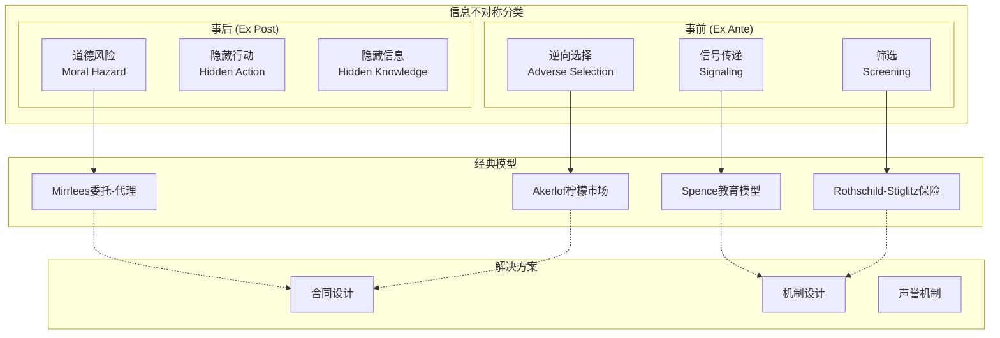

# 15.1 数理经济学基础

## 15.1.3 信息经济学

### 概述

信息经济学研究信息不对称对市场运行的影响，是20世纪经济学最重要的发展之一。
George Akerlof的"柠檬市场"、Michael Spence的信号传递模型以及Joseph Stiglitz的筛选理论奠定了该领域的基础，三人因此获得2001年诺贝尔经济学奖。

**参考文献**: Akerlof (1970), Spence (1973), Stiglitz (1975), Rothschild & Stiglitz (1976)

---

## 15.1.3.1 信息不对称基础

### 分类

**定义 15.1.21** (信息不对称类型)

1. **隐藏行动** (Hidden Action)：道德风险
   - 事后信息不对称
   - 一方行为不可观察

2. **隐藏信息** (Hidden Information)：逆向选择
   - 事前信息不对称
   - 一方拥有私有类型

3. **隐藏知识** (Hidden Knowledge)：信号传递与筛选
   - 类型差异影响市场结果

---

## 15.1.3.2 逆向选择与市场失灵

### Akerlof柠檬市场

**模型设定**:

- 二手车市场，质量 $\theta \sim U[0, 1]$
- 卖方估值：$v_S(\theta) = \theta$
- 买方估值：$v_B(\theta) = \frac{3}{2}\theta$
- 质量私有信息

**分析**:

若价格为 $p$，只有质量 $\theta \leq p$ 的卖方愿意出售

买方期望质量：$\mathbb{E}[\theta | \theta \leq p] = \frac{p}{2}$

买方期望价值：$\frac{3}{2} \cdot \frac{p}{2} = \frac{3p}{4}$

**定理 15.1.15** (Akerlof市场崩溃)

若买方期望价值低于价格，市场完全崩溃。

**证明**:

买方支付意愿：$w(p) = \frac{3p}{4}$

均衡要求：$p = w(p) \Rightarrow p = 0$

唯一均衡：$p^* = 0$，无交易发生。 $\square$

---

### 一般逆向选择模型

**定义 15.1.22** (类型空间)

参与人类型 $\theta \in \Theta$，分布 $F(\theta)$

- 高质量类型：$\theta_H$
- 低质量类型：$theta_L$

比例：$\lambda = P(\theta = \theta_H)$

---

## 15.1.3.3 信号传递

### Spence教育模型

**模型设定** (Spence, 1973):

- 工人能力：$\theta \in \{\theta_L, \theta_H\}$，$\theta_H > \theta_L > 0$
- 企业支付工资：$w(e)$，取决于教育水平 $e$
- 工人效用：$u(w, e, \theta) = w - c(e, \theta)$
- 教育成本：$c(e, \theta) = \frac{e}{\theta}$

**关键假设** (Spence-Mirrlees条件/单交叉性):

$$\frac{\partial}{\partial \theta}\left(-\frac{\partial c/\partial e}{\partial c/\partial w}\right) > 0$$

即高能力者教育成本更低：$c(e, \theta_H) < c(e, \theta_L)$ 对所有 $e > 0$

---

### 分离均衡

**定义 15.1.23** (分离均衡)

不同类型选择不同教育水平：$e_L^* \neq e_H^*$

**定理 15.1.16** (最小成本分离均衡)

存在唯一的最低成本分离均衡：

$$e_L^* = 0, \quad e_H^* = e^*$$

其中 $e^*$ 满足激励相容约束：

$$\theta_L \geq \theta_H - \frac{e^*}{\theta_L}$$

即：$e^* = (\theta_H - \theta_L)\theta_L$

**均衡工资**:

$$w(e) = \begin{cases} \theta_L & e < e^* \\ \theta_H & e \geq e^* \end{cases}$$

**证明**:

1. 低能力者无偏离激励：
   $$u(e_L^*, \theta_L) = \theta_L \geq \theta_H - \frac{e^*}{\theta_L} = u(e^*, \theta_L)$$

2. 高能力者无偏离激励：
   $$u(e^*, \theta_H) = \theta_H - \frac{e^*}{\theta_H} = \theta_H - \frac{(\theta_H - \theta_L)\theta_L}{\theta_H} > \theta_L = u(e_L^*, \theta_H)$$

3. 最小性：任何 $e' < e^*$ 导致混同或低能力模仿 $\square$

---

### 混同均衡

**定义 15.1.24** (混同均衡)

两种类型选择相同教育水平：$e_L^* = e_H^* = e^p$

**定理 15.1.17** (混同均衡存在条件)

若先验概率 $\lambda$ 足够高，存在混同均衡。

均衡工资：$w^p = \lambda \theta_H + (1-\lambda)\theta_L$

需满足非偏离条件：

$$w^p - \frac{e^p}{\theta} \geq \theta_L \quad \text{对所有 } \theta$$

---

## 15.1.3.4 筛选机制

### Rothschild-Stiglitz模型

**模型设定**:

- 两类消费者：高风险 $\theta_H$、低风险 $\theta_L$
- 发生事故概率：$p_H > p_L$
- 损失：$L$，财富：$W$
- 保险合同：$(\alpha, \beta)$，保费 $\alpha$，赔付 $\beta$

**效用函数**:

$$U(\alpha, \beta, \theta) = p_\theta u(W - L + \beta - \alpha) + (1-p_\theta)u(W - \alpha)$$

**定理 15.1.18** (Rothschild-Stiglitz均衡)

在竞争保险市场中：

1. 不存在混同均衡（当 $\lambda$ 不太大时）
2. 若分离均衡存在，则：
   - 低风险类型获得完全保险：$\beta_L = L - \alpha_L$
   - 高风险类型获得完全保险：$\beta_H = L - \alpha_H$
   - 低风险类型激励相容约束紧

---

## 15.1.3.5 道德风险

### 委托-代理模型

**基本设定**:

- 委托人设计合同 $w(x)$，$x$ 为可观察产出
- 代理人选择行动 $a \in \mathcal{A}$，影响产出分布 $f(x|a)$
- 代理人效用：$u(w) - c(a)$
- 委托人效用：$x - w(x)$

**一阶条件方法** (Mirrlees-Holmstrom):

**定理 15.1.19** (最优激励合同)

在最优激励合同 $w^*(x)$ 下，对几乎所有 $x$：

$$\frac{1}{u'(w^*(x))} = \lambda + \mu \frac{f_a(x|a^*)}{f(x|a^*)}$$

其中 $\lambda$ 为参与约束乘子，$\mu$ 为激励约束乘子。

**对数似然比** $\frac{f_a}{f}$ 决定激励强度。

---

## 15.1.3.6 计算模型

### 算法实现

```python
"""
信息经济学模型计算
逆向选择、信号传递、道德风险的数值分析
"""

import numpy as np
from scipy.optimize import minimize_scalar, minimize, brentq
from scipy.stats import beta
from typing import Callable, Tuple, List, Dict
import matplotlib.pyplot as plt
from matplotlib.patches import Polygon

class AkerlofMarket:
    """
    Akerlof柠檬市场模型

    质量分布F(θ), 买卖双方估值差异
    """

    def __init__(self, quality_dist: Callable, v_seller: Callable,
                 v_buyer: Callable):
        """
        参数:
            quality_dist: 质量分布 (可调用，返回样本)
            v_seller: 卖方估值函数 v(θ)
            v_buyer: 买方估值函数 v(θ)
        """
        self.F = quality_dist
        self.v_S = v_seller
        self.v_B = v_buyer

    def expected_buyer_value(self, price: float, n_samples: int = 10000) -> float:
        """给定价格下买方期望价值"""
        samples = self.F(n_samples)
        willing = samples[samples <= price]  # 愿意出售的卖方
        if len(willing) == 0:
            return 0
        return np.mean(self.v_B(willing))

    def find_equilibrium(self, p_max: float = 10, tol: float = 1e-6) -> float:
        """
        寻找市场均衡价格

        均衡条件: p = E[v_B(θ) | θ ≤ p]
        """
        def excess_demand(p):
            if p <= 0:
                return -p
            return p - self.expected_buyer_value(p)

        try:
            p_eq = brentq(excess_demand, 0.01, p_max)
            return p_eq
        except ValueError:
            # 无正根，市场崩溃
            return 0

    def market_quality(self, price: float, n_samples: int = 10000) -> Dict:
        """分析给定价格下的市场质量"""
        samples = self.F(n_samples)
        willing = samples[samples <= price]

        avg_quality = np.mean(willing) if len(willing) > 0 else 0
        avg_seller_val = np.mean(self.v_S(willing)) if len(willing) > 0 else 0
        avg_buyer_val = np.mean(self.v_B(willing)) if len(willing) > 0 else 0

        return {
            'price': price,
            'trade_volume': len(willing) / n_samples,
            'avg_quality': avg_quality,
            'avg_seller_value': avg_seller_val,
            'avg_buyer_value': avg_buyer_val,
            'surplus': (avg_buyer_val - avg_seller_val) * len(willing) / n_samples
        }


class SpenceSignaling:
    """
    Spence信号传递模型

    教育作为能力信号
    """

    def __init__(self, theta_L: float, theta_H: float, lambda_high: float,
                 cost_func: Callable = None):
        """
        参数:
            theta_L: 低能力
            theta_H: 高能力
            lambda_high: 高能力者比例
            cost_func: 教育成本函数 c(e, θ)，默认 e/θ
        """
        self.theta_L = theta_L
        self.theta_H = theta_H
        self.lambda_H = lambda_high

        if cost_func is None:
            self.cost = lambda e, theta: e / theta if e > 0 else 0
        else:
            self.cost = cost_func

    def min_separating_education(self) -> float:
        """计算最低成本分离均衡的教育水平"""
        # 低能力者不模仿高能力者的激励相容约束
        # θ_L ≥ θ_H - c(e*, θ_L)
        # c(e*, θ_L) = θ_H - θ_L
        # e* / θ_L = θ_H - θ_L
        return (self.theta_H - self.theta_L) * self.theta_L

    def pooling_wage(self) -> float:
        """混同均衡工资"""
        return self.lambda_H * self.theta_H + (1 - self.lambda_H) * self.theta_L

    def separating_equilibrium(self) -> Dict:
        """分离均衡分析"""
        e_star = self.min_separating_education()

        # 均衡策略
        e_L = 0
        e_H = e_star

        # 企业信念与工资
        # P(θ_H | e ≥ e*) = 1
        # P(θ_H | e < e*) = 0

        # 效用
        u_L_sep = self.theta_L - self.cost(e_L, self.theta_L)
        u_H_sep = self.theta_H - self.cost(e_H, self.theta_H)

        # 验证无偏离激励
        u_L_deviate = self.theta_H - self.cost(e_H, self.theta_L)  # 低能力模仿高能力

        return {
            'type': 'Separating',
            'e_L': e_L,
            'e_H': e_H,
            'wage_schedule': {f'e < {e_star}': self.theta_L, f'e ≥ {e_star}': self.theta_H},
            'u_L': u_L_sep,
            'u_H': u_H_sep,
            'IC_L_satisfied': u_L_sep >= u_L_deviate,
            'welfare_loss': e_star * self.lambda_H  # 高能力者信号成本
        }

    def pooling_equilibrium(self, e_pool: float = 0) -> Dict:
        """混同均衡分析"""
        w_pool = self.pooling_wage()

        u_L_pool = w_pool - self.cost(e_pool, self.theta_L)
        u_H_pool = w_pool - self.cost(e_pool, self.theta_H)

        # 偏离到 e=0 的收益
        u_L_deviate = self.theta_L  # 被认作低能力
        u_H_deviate = self.theta_L  # 被认作低能力

        # 混同均衡存在条件
        pooling_exists = (u_L_pool >= u_L_deviate) and (u_H_pool >= u_H_deviate)

        return {
            'type': 'Pooling',
            'e_pool': e_pool,
            'wage': w_pool,
            'u_L': u_L_pool,
            'u_H': u_H_pool,
            'exists': pooling_exists
        }

    def plot_equilibrium(self, ax=None):
        """绘制均衡图示"""
        if ax is None:
            fig, ax = plt.subplots(figsize=(10, 8))

        e_range = np.linspace(0, self.theta_H * self.theta_L, 200)

        # 无差异曲线
        # 低能力者通过 (0, θ_L) 的无差异曲线: u = θ_L - 0 = θ_L
        # w - e/θ_L = θ_L  =>  w = θ_L + e/θ_L
        u_L_ref = self.theta_L
        w_L_indiff = u_L_ref + e_range / self.theta_L

        # 高能力者通过 (e*, θ_H) 的无差异曲线
        e_star = self.min_separating_education()
        u_H_ref = self.theta_H - e_star / self.theta_H
        w_H_indiff = u_H_ref + e_range / self.theta_H

        # 绘制
        ax.plot(e_range, w_L_indiff, 'b-', linewidth=2,
               label=f'Low type IC (θ={self.theta_L})')
        ax.plot(e_range, w_H_indiff, 'r-', linewidth=2,
               label=f'High type IC (θ={self.theta_H})')

        # 均衡点
        ax.scatter([0], [self.theta_L], c='blue', s=100, zorder=5, label='Low type choice')
        ax.scatter([e_star], [self.theta_H], c='red', s=100, marker='*',
                  zorder=5, label='High type choice')

        # 工资函数
        e_vals = [0, e_star, e_star, e_range[-1]]
        w_vals = [self.theta_L, self.theta_L, self.theta_H, self.theta_H]
        ax.plot(e_vals, w_vals, 'g--', linewidth=2, label='Equilibrium wage')

        # 填充区域
        ax.fill_between([0, e_star], [self.theta_L, self.theta_L],
                       [self.theta_H, self.theta_H], alpha=0.2, color='yellow',
                       label='Separating region')

        ax.set_xlabel('Education Level (e)', fontsize=12)
        ax.set_ylabel('Wage (w)', fontsize=12)
        ax.set_title('Spence Signaling Model: Separating Equilibrium', fontsize=14)
        ax.legend(loc='lower right')
        ax.grid(True, alpha=0.3)
        ax.set_xlim(0, e_range[-1])

        return ax


class PrincipalAgent:
    """
    委托-代理模型 (道德风险)

    线性合同: w = α + βx
    """

    def __init__(self, effort_cost: Callable, output_dist: Callable,
                 utility_func: Callable, reservation: float):
        """
        参数:
            effort_cost: 努力成本函数 c(a)
            output_dist: 产出分布函数，给定a返回产出样本
            utility_func: 效用函数 u(w)
            reservation: 保留效用
        """
        self.c = effort_cost
        self.dist = output_dist
        self.u = utility_func
        self.U_0 = reservation

    def optimal_linear_contract(self, risk_aversion: float = 1.0) -> Dict:
        """
        计算最优线性激励合同

        简化情形: CARA效用，正态产出
        """
        # 简化分析解
        # 二阶近似下的最优激励强度
        # β* = 1 / (1 + r σ² c''(a))

        sigma_sq = 1.0  # 产出方差
        c_prime = 1.0   # 边际成本

        beta_star = 1 / (1 + risk_aversion * sigma_sq)

        # 满足参与约束
        # E[u(α + βx)] - c(a) = U_0

        return {
            'fixed_component': 0,  # 简化
            'incentive_intensity': beta_star,
            'risk_sharing': 1 - beta_star
        }


# ==================== 演示 ====================
if __name__ == "__main__":
    print("=" * 70)
    print("信息经济学模型计算")
    print("=" * 70)

    # 1. Akerlof柠檬市场
    print("\n【示例1: Akerlof柠檬市场】")

    # 均匀分布 U[0,1]
    np.random.seed(42)
    quality_dist = lambda n: np.random.uniform(0, 1, n)
    v_seller = lambda theta: theta
    v_buyer = lambda theta: 1.5 * theta

    market = AkerlofMarket(quality_dist, v_seller, v_buyer)

    p_eq = market.find_equilibrium(p_max=2)
    print(f"均衡价格: {p_eq:.4f}")

    if p_eq > 0:
        result = market.market_quality(p_eq)
        print(f"交易量: {result['trade_volume']:.2%}")
        print(f"平均质量: {result['avg_quality']:.4f}")
        print(f"总剩余: {result['surplus']:.4f}")
    else:
        print("市场完全崩溃 (Market Breakdown)")

    # 完全信息基准
    samples = quality_dist(10000)
    full_info_surplus = np.mean(v_buyer(samples) - v_seller(samples))
    print(f"完全信息总剩余: {full_info_surplus:.4f}")
    print(f"效率损失: {(1 - (result['surplus'] if p_eq > 0 else 0) / full_info_surplus):.2%}")

    # 2. Spence信号传递
    print("\n【示例2: Spence教育信号模型】")

    spence = SpenceSignaling(theta_L=1.0, theta_H=2.0, lambda_high=0.3)

    sep_eq = spence.separating_equilibrium()
    print(f"\n分离均衡:")
    print(f"  低能力者教育: {sep_eq['e_L']}")
    print(f"  高能力者教育: {sep_eq['e_H']:.4f}")
    print(f"  低能力者效用: {sep_eq['u_L']:.4f}")
    print(f"  高能力者效用: {sep_eq['u_H']:.4f}")
    print(f"  激励相容约束满足: {sep_eq['IC_L_satisfied']}")
    print(f"  社会福利损失 (信号成本): {sep_eq['welfare_loss']:.4f}")

    pool_eq = spence.pooling_equilibrium(e_pool=0)
    print(f"\n混同均衡 (e=0):")
    print(f"  混同工资: {pool_eq['wage']:.4f}")
    print(f"  存在性: {pool_eq['exists']}")

    # 3. 可视化
    fig, axes = plt.subplots(2, 2, figsize=(14, 12))

    # 图1: 柠檬市场动态
    ax1 = axes[0, 0]
    prices = np.linspace(0, 1.5, 50)
    buyer_vals = [market.expected_buyer_value(p) for p in prices]

    ax1.plot(prices, prices, 'k-', label='45°线 (p = p)', linewidth=1.5)
    ax1.plot(prices, buyer_vals, 'b-', label='买方期望价值', linewidth=2)
    ax1.axvline(x=p_eq, color='red', linestyle='--', alpha=0.7, label=f'均衡 p*={p_eq:.3f}')
    ax1.set_xlabel('价格 p')
    ax1.set_ylabel('价值')
    ax1.set_title('Akerlof柠檬市场: 逆向选择')
    ax1.legend()
    ax1.grid(True)
    ax1.set_xlim(0, 1.5)
    ax1.set_ylim(0, 1.5)

    # 图2: 质量分布与交易量
    ax2 = axes[0, 1]
    prices_detailed = np.linspace(0, 1, 30)
    qualities = []
    volumes = []
    for p in prices_detailed:
        r = market.market_quality(p)
        qualities.append(r['avg_quality'])
        volumes.append(r['trade_volume'])

    ax2_twin = ax2.twinx()
    line1 = ax2.plot(prices_detailed, qualities, 'g-o', label='平均质量', markersize=4)
    line2 = ax2_twin.plot(prices_detailed, volumes, 'r-s', label='交易量', markersize=4)
    ax2.axvline(x=p_eq, color='gray', linestyle='--', alpha=0.5)

    ax2.set_xlabel('价格')
    ax2.set_ylabel('平均质量', color='g')
    ax2_twin.set_ylabel('交易量', color='r')
    ax2.set_title('价格对质量与交易量的影响')
    ax2.grid(True)

    lines = line1 + line2
    labels = [l.get_label() for l in lines]
    ax2.legend(lines, labels, loc='center right')

    # 图3: Spence信号传递
    ax3 = axes[1, 0]
    spence.plot_equilibrium(ax3)

    # 图4: 不同参数下的信号成本
    ax4 = axes[1, 1]

    theta_H_range = np.linspace(1.5, 3.0, 50)
    signal_costs = []
    welfare_losses = []

    for th in theta_H_range:
        s = SpenceSignaling(theta_L=1.0, theta_H=th, lambda_high=0.3)
        e_star = s.min_separating_education()
        signal_costs.append(e_star)
        welfare_losses.append(e_star * 0.3)

    ax4.plot(theta_H_range, signal_costs, 'b-', linewidth=2, label='最低分离教育水平')
    ax4_twin = ax4.twinx()
    ax4_twin.plot(theta_H_range, welfare_losses, 'r--', linewidth=2, label='社会福利损失')

    ax4.set_xlabel('高能力水平 (θ_H)')
    ax4.set_ylabel('教育水平 e*', color='b')
    ax4_twin.set_ylabel('福利损失', color='r')
    ax4.set_title('能力差距与信号成本')
    ax4.grid(True)

    # 合并图例
    lines1, labels1 = ax4.get_legend_handles_labels()
    lines2, labels2 = ax4_twin.get_legend_handles_labels()
    ax4.legend(lines1 + lines2, labels1 + labels2, loc='upper left')

    plt.tight_layout()
    plt.savefig('information_economics.png', dpi=150, bbox_inches='tight')
    plt.show()
    print("\n图形已保存至 information_economics.png")
```

---

### 信息结构图



---

## 15.1.3.7 拍卖与机制设计

### 最优拍卖

**定理 15.1.20** (Myerson最优拍卖)

最优拍卖将物品分配给虚拟价值最高的竞标者：

$$J_i(\theta_i) = \theta_i - \frac{1-F_i(\theta_i)}{f_i(\theta_i)}$$

保留价 $r$ 满足 $J(r) = 0$。

---

## 参考文献

1. Akerlof, G. A. (1970). The market for "lemons": Quality uncertainty and the market mechanism. _QJE_, 84(3), 488-500.
2. Spence, M. (1973). Job market signaling. _QJE_, 87(3), 355-374.
3. Rothschild, M., & Stiglitz, J. (1976). Equilibrium in competitive insurance markets. _QJE_, 90(4), 629-649.
4. Mirrlees, J. A. (1971). An exploration in the theory of optimum income taxation. _RES_, 38(2), 175-208.
5. Holmstrom, B. (1979). Moral hazard and observability. _Bell Journal_, 10(1), 74-91.
6. Myerson, R. B. (1981). Optimal auction design. _Mathematics of Operations Research_, 6(1), 58-73.
