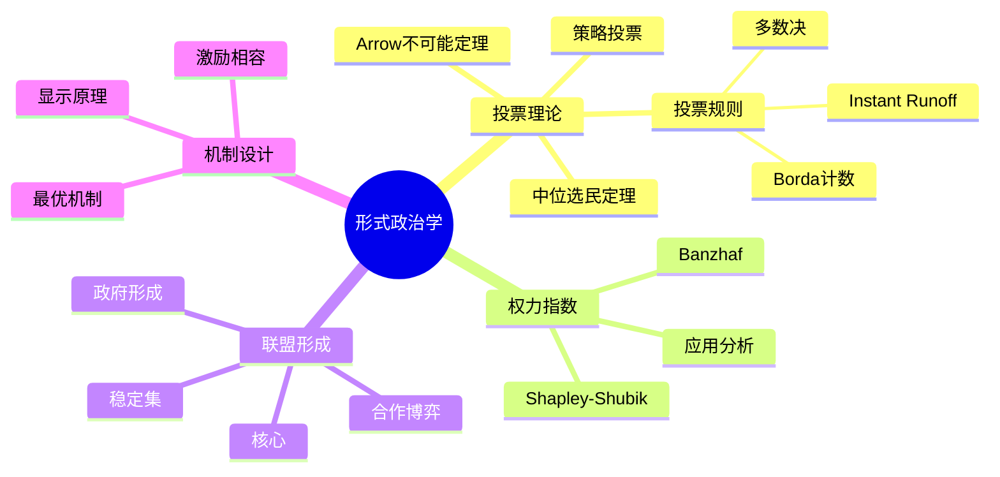

# 15.2 形式政治学

---

📌 **内容摘要**

本文档深入探讨形式政治学的核心原理和关键方法。内容涵盖社会科学形式化领域的主要知识点，包括形式政治学, 投票, 权力指数等关键主题。适合具备相关基础的学习者进行深入研究。

**关键词**: 形式政治学, 投票, 权力指数, 社会科学形式化

📚 **学习目标**
- 深入理解形式政治学的理论体系和形式化方法
- 能够进行相关定理的形式化证明
- 建立该领域的系统性知识框架

🎯 **难度级别**: 高级

⏱️ **预计阅读时间**: 15分钟

**前置知识**: 该领域的中级知识, 形式化方法基础

---


> **Formal Political Theory**: 运用形式化方法分析政治过程与制度

---

## 目录

- [15.2 形式政治学](#152-形式政治学)
  - [目录](#目录)
  - [2.1 投票理论](#21-投票理论)
    - [2.1.1 偏好聚合基础](#211-偏好聚合基础)
    - [2.1.2 Arrow不可能定理](#212-arrow不可能定理)
    - [2.1.3 投票规则](#213-投票规则)
    - [2.1.4 策略投票](#214-策略投票)
    - [2.1.5 投票规则计算](#215-投票规则计算)
  - [2.2 权力指数](#22-权力指数)
    - [2.2.1 投票博弈](#221-投票博弈)
    - [2.2.2 Shapley-Shubik指数](#222-shapley-shubik指数)
    - [2.2.3 Banzhaf指数](#223-banzhaf指数)
    - [2.2.4 权力指数计算](#224-权力指数计算)
    - [2.2.5 权力指数比较](#225-权力指数比较)
  - [2.3 联盟形成](#23-联盟形成)
    - [2.3.1 合作博弈](#231-合作博弈)
    - [2.3.2 核心](#232-核心)
    - [2.3.3 稳定集与核仁](#233-稳定集与核仁)
    - [2.3.4 政府形成应用](#234-政府形成应用)
  - [2.4 方法对比](#24-方法对比)
    - [2.4.1 投票规则对比矩阵](#241-投票规则对比矩阵)
    - [2.4.2 权力指数对比](#242-权力指数对比)
    - [2.4.3 解概念对比](#243-解概念对比)
  - [2.5 应用案例](#25-应用案例)
    - [2.5.1 案例一：欧盟理事会投票权分析](#251-案例一欧盟理事会投票权分析)
    - [2.5.2 案例二：选举制度改革评估](#252-案例二选举制度改革评估)
    - [2.5.3 案例三：立法博弈模拟](#253-案例三立法博弈模拟)
  - [2.6 思维导图](#26-思维导图)
  - [2.7 与其他模块的交叉引用](#27-与其他模块的交叉引用)
    - [前置知识](#前置知识)
    - [横向连接](#横向连接)
    - [后续应用](#后续应用)
  - [参考文献](#参考文献)
  - [📚 延伸阅读](#-延伸阅读)

---

## 2.1 投票理论

### 2.1.1 偏好聚合基础

**定义 2.1** (偏好关系)

设 $X$ 为备选方案集，参与人 $i$ 的偏好 $\succsim_i$ 是 $X$ 上的二元关系：

- **完备性**: $\forall x, y \in X: x \succsim_i y \lor y \succsim_i x$
- **传递性**: $x \succsim_i y \land y \succsim_i z \Rightarrow x \succsim_i z$

**定义 2.2** (社会选择函数)

社会选择函数 $f: \mathcal{R}^n \to X$ 将偏好组合映射到获胜方案：

$$f(\succsim) = x^* \in X$$

**定义 2.3** (社会福利函数)

社会福利函数 $F: \mathcal{R}^n \to \mathcal{R}$ 将偏好组合映射到社会偏好：

$$F(\succsim) = \succsim_S$$

### 2.1.2 Arrow不可能定理

**公理 2.1** (全域性, Universal Domain)

$F$ 定义在所有可能的理性偏好组合上：$\text{dom}(F) = \mathcal{R}^n$

**公理 2.2** (弱帕累托, Weak Pareto)

$$\forall i: x \succ_i y \Rightarrow x \succ_S y$$

**公理 2.3** (无关方案独立性, IIA)

$$\succsim|_A = \succsim'|_A \Rightarrow F(\succsim)|_A = F(\succsim')|_A$$

**公理 2.4** (非独裁性, Non-Dictatorship)

不存在参与人 $i$ 使得：$x \succ_i y \Rightarrow x \succ_S y$

**定理 2.1** (Arrow不可能定理, 1951)

若 $|X| \geq 3$，不存在社会福利函数 $F: \mathcal{P}^n \to \mathcal{R}$ 同时满足全域性、弱帕累托、IIA和非独裁性。

### 2.1.3 投票规则

**定义 2.4** (简单多数规则)

$$x \succ_M y \Leftrightarrow |\{i: x \succ_i y\}| > |\{i: y \succ_i x\}|$$

**定理 2.2** (Condorcet循环)

多数决规则可能产生非传递性社会偏好。

**Condorcet循环示例**:

| 选民 | 偏好排序 |
|------|----------|
| 1    | $A \succ B \succ C$ |
| 2    | $B \succ C \succ A$ |
| 3    | $C \succ A \succ B$ |

成对比较产生循环：$A \succ_M B \succ_M C \succ_M A$

**定义 2.5** (Borda计数法)

$$B(x) = \sum_{i=1}^n (m - \text{rank}_i(x))$$

**定义 2.6** (Instant Runoff Voting)

1. 统计首选得票
2. 若无多数，淘汰末位候选，转移选票
3. 重复直至产生赢家

### 2.1.4 策略投票

**定义 2.7** (占优策略激励相容)

投票规则 $f$ 是策略证明的，若真实报告是占优策略：

$$u_i(f(\succsim_i, \succsim_{-i})) \geq u_i(f(\succsim_i', \succsim_{-i}))$$

**定理 2.3** (Gibbard-Satterthwaite不可能定理)

若 $|X| \geq 3$，满足满射性和策略证明性的社会选择函数是独裁的。

**定义 2.8** (单峰偏好)

设备选方案可排列于直线，偏好 $\succsim_i$ 是单峰的，若存在峰值 $x^*$ 使得：

$$x_k < x_l \leq x^* \text{ 或 } x^* \leq x_l < x_k \Rightarrow x_l \succ_i x_k$$

**定理 2.4** (中位选民定理, Black 1948)

在单峰偏好域下，成对多数决产生传递性社会排序，Condorcet赢家为中位峰值。

### 2.1.5 投票规则计算

```python
"""
投票规则计算分析
"""
import numpy as np
from typing import List, Tuple, Dict
from collections import defaultdict

class VotingSystem:
    """投票系统分析器"""

    def __init__(self, preferences: List[List[int]], names: List[str] = None):
        """
        参数:
            preferences: 每个选民的排序，列表[首选, 次选, ...]
            names: 备选方案名称
        """
        self.prefs = np.array(preferences)
        self.n_voters, self.m = self.prefs.shape
        self.names = names or [f"A{i}" for i in range(self.m)]

    def pairwise_matrix(self) -> np.ndarray:
        """构建成对比较矩阵"""
        M = np.zeros((self.m, self.m))
        for i in range(self.m):
            for j in range(i + 1, self.m):
                i_wins = sum(1 for p in self.prefs
                           if np.where(p == i)[0][0] < np.where(p == j)[0][0])
                j_wins = self.n_voters - i_wins
                if i_wins > j_wins:
                    M[i, j] = 1
                    M[j, i] = -1
                elif j_wins > i_wins:
                    M[i, j] = -1
                    M[j, i] = 1
        return M

    def condorcet_winner(self) -> int:
        """寻找Condorcet赢家"""
        M = self.pairwise_matrix()
        for i in range(self.m):
            if np.all(M[i, :] >= 0) and np.sum(M[i, :] == 1) == self.m - 1:
                return i
        return None

    def borda_winner(self) -> Tuple[int, np.ndarray]:
        """Borda计数法"""
        scores = np.zeros(self.m)
        for voter_pref in self.prefs:
            for rank, alt in enumerate(voter_pref):
                scores[alt] += self.m - 1 - rank
        return np.argmax(scores), scores

    def plurality_winner(self) -> Tuple[int, np.ndarray]:
        """简单多数制"""
        votes = np.zeros(self.m)
        for voter_pref in self.prefs:
            votes[voter_pref[0]] += 1
        return np.argmax(votes), votes

    def instant_runoff(self) -> Tuple[int, List]:
        """Instant Runoff Voting"""
        remaining = list(range(self.m))
        rounds = []
        current_prefs = self.prefs.copy()

        while len(remaining) > 1:
            first_choices = [p[0] for p in current_prefs if p[0] in remaining]
            vote_count = defaultdict(int)
            for c in first_choices:
                vote_count[c] += 1

            rounds.append({'remaining': remaining.copy(), 'votes': dict(vote_count)})

            # 检查多数
            total = sum(vote_count.values())
            for cand, votes in vote_count.items():
                if votes > total / 2:
                    return cand, rounds

            # 淘汰末位
            if len(vote_count) > 0:
                min_votes = min(vote_count.values())
                eliminated = min([c for c, v in vote_count.items() if v == min_votes])
                remaining.remove(eliminated)
                # 更新偏好
                new_prefs = []
                for p in current_prefs:
                    new_p = [x for x in p if x in remaining]
                    if len(new_p) > 0:
                        new_prefs.append(new_p)
                current_prefs = np.array(new_prefs) if new_prefs else np.array([remaining])

        return remaining[0] if remaining else None, rounds
```

---

## 2.2 权力指数

### 2.2.1 投票博弈

**定义 2.9** (简单博弈)

一个简单博弈是二元组 $(N, W)$，其中 $W \subseteq 2^N$ 是获胜联盟集合：

- $N \in W$ (全域性)
- $\emptyset \notin W$ (非空性)
- $S \in W \land S \subseteq T \Rightarrow T \in W$ (单调性)

**定义 2.10** (关键参与人)

在联盟 $S$ 中，参与人 $i$ 是关键的，若：

$$S \in W \text{ 且 } S \setminus \{i\} \notin W$$

### 2.2.2 Shapley-Shubik指数

**定义 2.11** (Shapley-Shubik权力指数)

$$\phi_i = \sum_{S: i \text{ 在 } S \text{ 中关键}} \frac{(|S|-1)!(n-|S|)!}{n!}$$

**解释**: 随机排序下，$i$ 作为关键投票者的概率。

**定理 2.5** (Shapley值性质)

1. **有效性**: $\sum_{i \in N} \phi_i = 1$
2. **对称性**: 对称参与人有相同权力
3. **哑元性**: 哑元（永非关键）权力为0
4. **可加性**: 博弈和的指数为指数和

### 2.2.3 Banzhaf指数

**定义 2.12** (Banzhaf权力指数)

$$\beta_i = \frac{\eta_i}{\sum_{j \in N} \eta_j}$$

其中 $\eta_i = |\{S: i \text{ 在 } S \text{ 中关键}\}|$ 是绝对Banzhaf指数。

**定理 2.6** (Banzhaf指数标准化)

Banzhaf指数是标准化后的绝对Banzhaf指数：$\beta_i = \frac{\eta_i}{2^{n-1}}$（对于均匀分布）。

### 2.2.4 权力指数计算

```python
"""
权力指数计算
Shapley-Shubik和Banzhaf指数
"""
from itertools import combinations, permutations
import numpy as np

class PowerIndex:
    """权力指数计算器"""

    def __init__(self, n_players: int, winning_coalitions: list = None, quota: int = None, weights: list = None):
        """
        参数:
            n_players: 参与人数量
            winning_coalitions: 获胜联盟列表（如不提供则使用加权投票）
            quota: 获胜配额（加权投票）
            weights: 投票权重（加权投票）
        """
        self.n = n_players

        if winning_coalitions is not None:
            self.W = set(tuple(sorted(c)) for c in winning_coalitions)
        elif quota is not None and weights is not None:
            self.weights = weights
            self.quota = quota
            self.W = self._generate_winning_coalitions()
        else:
            raise ValueError("必须提供获胜联盟或配额与权重")

    def _generate_winning_coalitions(self):
        """从权重和配额生成获胜联盟"""
        from itertools import combinations
        W = set()
        for r in range(1, self.n + 1):
            for coalition in combinations(range(self.n), r):
                if sum(self.weights[i] for i in coalition) >= self.quota:
                    W.add(coalition)
        return W

    def is_critical(self, player: int, coalition: tuple) -> bool:
        """检查参与人在联盟中是否关键"""
        S_with = coalition
        S_without = tuple(p for p in coalition if p != player)

        # 使用权重检查（如果是加权投票）
        if hasattr(self, 'weights'):
            weight_with = sum(self.weights[i] for i in S_with)
            weight_without = sum(self.weights[i] for i in S_without) if S_without else 0
            return weight_with >= self.quota and weight_without < self.quota

        return S_with in self.W and S_without not in self.W

    def shapley_shubik(self) -> np.ndarray:
        """计算Shapley-Shubik权力指数"""
        phi = np.zeros(self.n)

        # 枚举所有排列
        for perm in permutations(range(self.n)):
            # 找到关键参与人
            cumulative = []
            for i, player in enumerate(perm):
                if hasattr(self, 'weights'):
                    weight_before = sum(self.weights[p] for p in cumulative)
                    weight_with = weight_before + self.weights[player]
                    if weight_before < self.quota <= weight_with:
                        phi[player] += 1
                        break
                else:
                    coalition_before = tuple(sorted(cumulative))
                    coalition_with = tuple(sorted(cumulative + [player]))
                    if coalition_before not in self.W and coalition_with in self.W:
                        phi[player] += 1
                        break
                cumulative.append(player)

        return phi / np.sum(phi)

    def banzhaf(self) -> np.ndarray:
        """计算Banzhaf权力指数"""
        eta = np.zeros(self.n)  # 绝对Banzhaf指数

        # 枚举所有联盟
        from itertools import combinations
        for r in range(1, self.n + 1):
            for coalition in combinations(range(self.n), r):
                for player in coalition:
                    if self.is_critical(player, coalition):
                        eta[player] += 1

        return eta / np.sum(eta)
```

### 2.2.5 权力指数比较

**示例**: 联合国安理会（改革前）

- 5个常任理事国（否决权）
- 10个非常任理事国
- 决议通过：至少9票，无常任理事国反对

```python
# 安理会权力分析
unsc = PowerIndex(
    n_players=15,
    winning_coalitions=None,
    quota=9,
    weights=[7]*5 + [1]*10  # 常任理事国权重7，非常任权重1
)

print("Shapley-Shubik指数:", unsc.shapley_shubik()[:5])  # 常任理事国
print("Banzhaf指数:", unsc.banzhaf()[:5])
```

---

## 2.3 联盟形成

### 2.3.1 合作博弈

**定义 2.13** (特征函数博弈)

$$v: 2^N \to \mathbb{R}, \quad v(\emptyset) = 0$$

**定义 2.14** (超可加性)

$$v(S \cup T) \geq v(S) + v(T), \quad \forall S, T \subseteq N, S \cap T = \emptyset$$

### 2.3.2 核心

**定义 2.15** (核心, Core)

$$C(v) = \{x \in \mathbb{R}^n : \sum_{i \in N} x_i = v(N), \forall S \subseteq N: \sum_{i \in S} x_i \geq v(S)\}$$

**定理 2.7** (Bondareva-Shapley)

特征函数博弈有非空核心当且仅当它是平衡的。

**定义 2.16** (平衡博弈)

存在权重 $\lambda_S \geq 0$ 使得：

$$\sum_{S: i \in S} \lambda_S = 1 \Rightarrow \sum_{S} \lambda_S v(S) \leq v(N)$$

### 2.3.3 稳定集与核仁

**定义 2.17** (稳定集, von Neumann-Morgenstern)

集合 $V$ 是稳定集，若满足：

1. **内部稳定性**: $\forall x, y \in V$，$x$ 不优超 $y$
2. **外部稳定性**: $\forall z \notin V, \exists x \in V$ 使得 $x$ 优超 $z$

**定义 2.18** (核仁, Nucleolus)

最小化最大过剩的分配：

$$\min_x \max_{S \subseteq N} e(S, x)$$

其中 $e(S, x) = v(S) - \sum_{i \in S} x_i$ 是联盟 $S$ 的过剩。

**定理 2.8** (Schmeidler)

核仁总是存在且唯一。

### 2.3.4 政府形成应用

**模型**: 多党制议会联盟形成

- 政党 $i$ 有 $w_i$ 个席位
- 需要配额 $q > \sum w_i / 2$ 才能执政
- 各政党有政策理想点 $\theta_i$

**形成规则**:

1. 最小获胜联盟（MWC）
2. 最小获胜连接联盟（MWCC）
3. 政策距离最小化

---

## 2.4 方法对比

### 2.4.1 投票规则对比矩阵

| 性质 | 多数决 | Borda | IRV | Condorcet | Approval |
|------|--------|-------|-----|-----------|----------|
| 匿名性 | ✓ | ✓ | ✓ | ✓ | ✓ |
| 中立性 | ✓ | ✓ | ✓ | ✓ | ✓ |
| 单调性 | ✓ | ✓ | ✗ | ✓ | ✓ |
| Condorcet赢家 | ✗ | ✗ | ✗ | ✓ | ✗ |
| Condorcet输家 | ✗ | ✓ | ✓ | ✓ | ✗ |
| 多数准则 | ✓ | ✗ | ✓ | ✗ | ✗ |
| 参与性 | ✓ | ✓ | ✓ | ✓ | ✓ |
| IIA | ✗ | ✗ | ✗ | ✗ | ✗ |

### 2.4.2 权力指数对比

| 特征 | Shapley-Shubik | Banzhaf | Deegan-Packel |
|------|---------------|---------|---------------|
| **概率解释** | 随机排序 | 随机联盟 | 最小获胜联盟 |
| **计算复杂度** | $O(n!)$ | $O(2^n)$ | $O(2^n)$ |
| **哑元性质** | 满足 | 满足 | 满足 |
| **对称性** | 满足 | 满足 | 满足 |
| **效率** | 满足 | 满足 | 不满足 |
| **转移性** | 满足 | 不满足 | 满足 |

### 2.4.3 解概念对比

| 解概念 | 存在性 | 唯一性 | 计算复杂度 | 公理基础 |
|--------|--------|--------|-----------|---------|
| 核心 | 不一定 | 不一定 | NP-hard | 联盟理性 |
| 稳定集 | 不一定 | 不一定 | - | vN-M公理 |
| Shapley值 | 总是 | 总是 | $O(n!)$ | 效率、对称、可加 |
| 核仁 | 总是 | 总是 | LP | 最小化最大过剩 |
| 议价集 | 总是 | 不一定 | - | 异议与反异议 |

---

## 2.5 应用案例

### 2.5.1 案例一：欧盟理事会投票权分析

**问题**: 评估成员国在欧盟理事会中的实际权力

**数据**:

- 27个成员国
- 双重多数制：55%成员国 + 65%人口

**分析结果**:

| 国家 | 人口权重 | Shapley-Shubik | Banzhaf |
|------|---------|---------------|---------|
| 德国 | 18.6% | 9.2% | 8.8% |
| 法国 | 13.1% | 7.1% | 6.9% |
| 波兰 | 8.4% | 5.2% | 5.0% |
| 小国 | <1% | <1% | <1% |

**结论**: 人口大国权力略低于人口比例，小国权力被放大。

### 2.5.2 案例二：选举制度改革评估

**背景**: 某国考虑从多数制改为比例代表制

**形式模型**:

- 选民理想点分布：$F(x)$
- 政党位置：$p_1, p_2, \ldots, p_m$
- 选民投票给最近政党

**比较**:

| 制度 | 赢家位置 | 代表性 | 政府稳定性 |
|------|---------|--------|-----------|
| 多数制 | 中位数 | 低 | 高 |
| 比例制 | 多党 | 高 | 低 |

### 2.5.3 案例三：立法博弈模拟

**模型**: 美国国会立法过程

**形式化**:

1. 提案者选择议案 $x \in X$
2. 委员会修正
3. 全院投票
4. 总统签署或否决
5. 国会可推翻否决（2/3多数）

**均衡分析**:

- 议程设置权的重要性
- 否决权的限制作用
- 中位选民定理的应用

---

## 2.6 思维导图



---

## 2.7 与其他模块的交叉引用

### 前置知识

- **01_数理经济学基础**: 博弈论基础、均衡概念
- **12_决策与博弈论/04_社会选择理论**: 社会选择理论基础

### 横向连接

- **03_计算社会学**: 政治网络、意见动力学
- **05_网络社会学**: 在线政治参与、信息传播

### 后续应用

- **03_计算社会学/03.3_文化演化模型**: 规范演化、制度变迁
- **11_系统科学/03_复杂系统**: 政治系统复杂性

---

## 参考文献

1. Arrow, K. J. (1951). _Social Choice and Individual Values_. Wiley.
2. Sen, A. K. (1970). _Collective Choice and Social Welfare_. Holden-Day.
3. Gibbard, A. (1973). Manipulation of voting schemes. _Econometrica_.
4. Satterthwaite, M. A. (1975). Strategy-proofness and Arrow's conditions. _JET_.
5. Shapley, L. S., & Shubik, M. (1954). A method for evaluating the distribution of power. _APS Review_.
6. Banzhaf, J. F. (1965). Weighted voting doesn't work. _Rutgers Law Review_.
7. Laver, M., & Shepsle, K. A. (1996). _Making and Breaking Governments_. Cambridge.

---

## 📚 延伸阅读

- [11.6 稳定性分析](./11_系统科学/02_控制论/02.2_稳定性分析.md)
- [12.4.2 社会偏好聚合](./12_决策与博弈论/04_社会选择理论/04.2_社会偏好聚合.md)
- [15.3 计算社会学](./03_计算社会学/03.3_文化演化模型.md)
- [15.2 形式政治学](./02_形式政治学/02.2_权力指数.md)
- [12.3.1 显示原理](./12_决策与博弈论/03_机制设计/03.1_显示原理.md)
