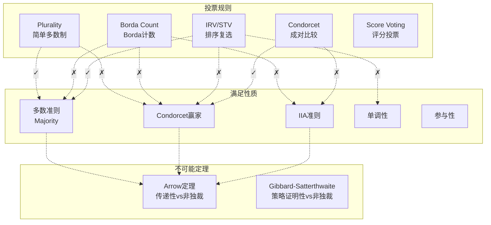

# 15.2 形式政治学

---

📌 **内容摘要**

本文档深入探讨形式政治学的核心原理和关键方法。内容涵盖形式政治学领域的主要知识点，包括决策理论, 风险, 拍卖, 投票, 权力指数等关键主题。适合具备相关基础的学习者进行深入研究。

**关键词**: 决策理论, 风险, 拍卖, 投票, 权力指数, 机制设计, 效用, 形式政治学

📚 **学习目标**
- 深入理解形式政治学的理论体系和形式化方法
- 能够进行相关定理的形式化证明
- 建立该领域的系统性知识框架

🎯 **难度级别**: 高级

⏱️ **预计阅读时间**: 15分钟

**前置知识**: 该领域的中级知识, 形式化方法基础

---


## 15.2.1 投票理论

### 概述

投票理论（Voting Theory）研究集体决策中的偏好聚合问题，是形式政治学的核心领域。
Kenneth Arrow的开创性不可能定理揭示了民主决策中的根本张力，而后续的机制设计理论则探索了可实施的投票规则。

**参考文献**: Arrow (1951), Sen (1970), Gibbard (1973), Satterthwaite (1975)

---

## 15.2.1.1 偏好聚合基础

### 偏好关系

**定义 15.2.1** (偏好关系)

设 $X$ 为备选方案集，参与人 $i$ 的偏好 $\succsim_i$ 是 $X$ 上的二元关系：

- **完备性**: $\forall x, y \in X: x \succsim_i y \lor y \succsim_i x$
- **传递性**: $x \succsim_i y \land y \succsim_i z \Rightarrow x \succsim_i z$

**定义 15.2.2** (偏好类型)

- **严格偏好**: $x \succ_i y \Leftrightarrow x \succsim_i y \land \neg(y \succsim_i x)$
- **无差异**: $x \sim_i y \Leftrightarrow x \succsim_i y \land y \succsim_i x$

**定义 15.2.3** (偏好域)

- $\mathcal{R}$: 所有理性偏好（完备且传递）的集合
- $\mathcal{P}$: 所有严格偏好（完备、传递、反对称）的集合

---

### 社会选择函数

**定义 15.2.4** (社会选择函数)

社会选择函数 $f: \mathcal{R}^n \to X$ 将偏好组合 $\succsim = (\succsim_1, \ldots, \succsim_n)$ 映射到获胜方案：

$$f(\succsim) = x^* \in X$$

**定义 15.2.5** (社会福利函数)

社会福利函数 $F: \mathcal{R}^n \to \mathcal{R}$ 将偏好组合映射到社会偏好：

$$F(\succsim) = \succsim_S$$

---

## 15.2.1.2 Arrow不可能定理

### 公理体系

**公理 15.2.1** (全域性, Universal Domain)

$F$ 定义在所有可能的理性偏好组合上：$\text{dom}(F) = \mathcal{R}^n$

**公理 15.2.2** (弱帕累托, Weak Pareto)

若所有个体都严格偏好 $x$ 胜过 $y$，则社会也严格偏好：

$$\forall i: x \succ_i y \Rightarrow x \succ_S y$$

**公理 15.2.3** (无关方案独立性, IIA)

对 $X$ 的任意子集 $A$，$F$ 在 $A$ 上的排序仅依赖于个体在 $A$ 上的偏好：

$$\succsim|_A = \succsim'|_A \Rightarrow F(\succsim)|_A = F(\succsim')|_A$$

**公理 15.2.4** (非独裁性, Non-Dictatorship)

不存在参与人 $i$ 使得：

$$x \succ_i y \Rightarrow x \succ_S y$$

---

### Arrow定理

**定理 15.2.1** (Arrow不可能定理, 1951)

若 $|X| \geq 3$，不存在社会福利函数 $F: \mathcal{P}^n \to \mathcal{R}$ 同时满足：

1. 全域性
2. 弱帕累托
3. IIA
4. 非独裁性

**证明** (Simplified Version):

_第一步：证明存在决定性集合_

定义集合 $V \subseteq N$ 对 $(x, y)$ 是决定性的，若：

$$(\forall i \in V: x \succ_i y) \land (\forall j \notin V: y \succ_j x) \Rightarrow x \succ_S y$$

由弱帕累托，$N$ 对任意 $(x, y)$ 是决定性的。

_第二步：决定性蕴含全域决定性_

若 $V$ 对某对 $(x, y)$ 决定性，则 $V$ 对所有方案对决定性。

（利用IIA构造偏好显示 $V$ 必须对其他方案对也决定性）

_第三步：最小决定性集合为单元素集_

设 $V$ 为最小决定性集合。若 $|V| \geq 2$，分割 $V = V_1 \cup V_2$。

构造偏好剖面：

- $V_1$: $x \succ y \succ z$
- $V_2$: $y \succ z \succ x$
- $V^c$: $z \succ x \succ y$

由决定性，$V$ 决定 $x \succ_S y$。

若 $y \succsim_S z$，则 $V_2$ 对 $(y, z)$ 决定性（矛盾于最小性）。
若 $z \succ_S y$，结合传递性与 $x \succ_S y$，$V_1$ 对 $(x, z)$ 决定性（矛盾）。

因此 $|V| = 1$，该个体为独裁者。 $\square$

---

## 15.2.1.3 投票规则

### 多数决规则

**定义 15.2.6** (简单多数规则)

$$x \succ_M y \Leftrightarrow |\{i: x \succ_i y\}| > |\{i: y \succ_i x\}|$$

**定理 15.2.2** (Condorcet循环)

多数决规则可能产生非传递性社会偏好（Condorcet悖论）。

**Condorcet循环示例**:

| 选民 | 偏好排序 |
|------|----------|
| 1    | $A \succ B \succ C$ |
| 2    | $B \succ C \succ A$ |
| 3    | $C \succ A \succ B$ |

成对比较：

- $A$ vs $B$: $A$ 得2票，$B$ 得1票 $\Rightarrow A \succ_M B$
- $B$ vs $C$: $B$ 得2票，$C$ 得1票 $\Rightarrow B \succ_M C$
- $C$ vs $A$: $C$ 得2票，$A$ 得1票 $\Rightarrow C \succ_M A$

循环：$A \succ_M B \succ_M C \succ_M A$

---

### Borda计数法

**定义 15.2.7** (Borda得分)

对排序位置 $k$ 赋分 $m-k$（$m = |X|$），总得分为：

$$B(x) = \sum_{i=1}^n (m - \text{rank}_i(x))$$

**定理 15.2.3** (Borda法性质)

Borda计数满足：

- 匿名性、中立性
- 满足Condorcet输家准则
- 不满足Condorcet赢家准则

---

### Instant Runoff Voting (IRV)

**定义 15.2.8** (IRV/STV)

1. 统计首选得票
2. 若无多数，淘汰末位候选，转移选票
3. 重复直至产生赢家

**定理 15.2.4** (IRV的缺陷)

IRV不满足：

- 单调性（提升排名可能反导致失败）
- Condorcet赢家准则

---

## 15.2.1.4 策略投票

### 激励相容性

**定义 15.2.9** (占优策略激励相容)

投票规则 $f$ 是策略证明的，若真实报告是占优策略：

$$u_i(f(\succsim_i, \succsim_{-i})) \geq u_i(f(\succsim_i', \succsim_{-i})), \quad \forall \succsim_i', \succsim_{-i}$$

---

### Gibbard-Satterthwaite定理

**定理 15.2.5** (Gibbard-Satterthwaite不可能定理)

若 $|X| \geq 3$，社会选择函数 $f: \mathcal{P}^n \to X$ 满足：

1. 满射性（ onto ）：每个方案都可能获胜
2. 策略证明性

则 $f$ 是独裁的：存在 $i$ 使得 $f(\succsim) = \arg\max_{\succsim_i} X$

---

### 单峰偏好域

**定义 15.2.10** (单峰偏好)

设备选方案可排列于 $X = \{x_1, \ldots, x_m\}$，偏好 $\succsim_i$ 是单峰的，若存在峰值 $x^*$ 使得：

$$x_k < x_l \leq x^* \text{ 或 } x^* \leq x_l < x_k \Rightarrow x_l \succ_i x_k$$

**定理 15.2.6** (中位选民定理, Black 1948)

在单峰偏好域下，成对多数决产生传递性社会排序，Condorcet赢家为中位峰值。

**证明**:

设 $x_{med}$ 为中位峰值。对任意 $y < x_{med}$：

超过半数选民的峰值 $\geq x_{med} > y$，因此这些选民偏好 $x_{med}$ 胜过 $y$。

故 $x_{med}$ 在成对比较中击败任何其他方案。 $\square$

---

## 15.2.1.5 计算投票均衡

### 算法实现

```python
"""
投票理论计算分析
Arrow定理、投票规则、策略投票的数值实现
"""

import numpy as np
from itertools import permutations, combinations
from typing import List, Tuple, Dict, Callable
import matplotlib.pyplot as plt
from collections import defaultdict

class PreferenceProfile:
    """
    偏好剖面

    表示n个选民在m个备选方案上的偏好
    """

    def __init__(self, preferences: List[List[int]], names: List[str] = None):
        """
        参数:
            preferences: 每个选民的排序，列表[首选, 次选, ...]
            names: 备选方案名称
        """
        self.prefs = np.array(preferences)
        self.n_voters, self.m_alternatives = self.prefs.shape

        if names is None:
            self.names = [f"A{i}" for i in range(self.m_alternatives)]
        else:
            self.names = names

    def pairwise_comparison(self, x: int, y: int) -> Tuple[int, int]:
        """
        比较两个备选方案

        返回: (偏好x的人数, 偏好y的人数)
        """
        x_wins = 0
        y_wins = 0

        for voter_pref in self.prefs:
            rank_x = np.where(voter_pref == x)[0][0]
            rank_y = np.where(voter_pref == y)[0][0]

            if rank_x < rank_y:
                x_wins += 1
            elif rank_y < rank_x:
                y_wins += 1

        return x_wins, y_wins

    def majority_graph(self) -> np.ndarray:
        """
        构建多数图

        返回: m×m矩阵，entry[i,j] = 1 if i beats j in majority
        """
        M = np.zeros((self.m_alternatives, self.m_alternatives))

        for i in range(self.m_alternatives):
            for j in range(i + 1, self.m_alternatives):
                x_wins, y_wins = self.pairwise_comparison(i, j)
                if x_wins > y_wins:
                    M[i, j] = 1
                    M[j, i] = -1
                elif y_wins > x_wins:
                    M[i, j] = -1
                    M[j, i] = 1

        return M

    def condorcet_winner(self) -> int:
        """
        寻找Condorcet赢家

        Condorcet赢家: 在成对比较中击败所有其他方案的方案

        返回: 赢家索引，若不存在返回None
        """
        M = self.majority_graph()

        for i in range(self.m_alternatives):
            if np.all(M[i, :] >= 0) and np.sum(M[i, :] == 1) == self.m_alternatives - 1:
                return i

        return None

    def condorcet_cycles(self) -> List[List[int]]:
        """
        寻找Condorcet循环

        返回: 所有三元循环的列表
        """
        M = self.majority_graph()
        cycles = []

        for i in range(self.m_alternatives):
            for j in range(i + 1, self.m_alternatives):
                for k in range(j + 1, self.m_alternatives):
                    # 检查循环 i -> j -> k -> i
                    if M[i, j] == 1 and M[j, k] == 1 and M[k, i] == 1:
                        cycles.append([i, j, k])
                    # 检查反向循环
                    if M[i, j] == -1 and M[j, k] == -1 and M[k, i] == -1:
                        cycles.append([i, k, j])

        return cycles

    def borda_winner(self) -> Tuple[int, np.ndarray]:
        """
        Borda计数法

        得分规则: 排名第k得 (m-1-k) 分

        返回: (赢家, 得分向量)
        """
        scores = np.zeros(self.m_alternatives)

        for voter_pref in self.prefs:
            for rank, alt in enumerate(voter_pref):
                scores[alt] += self.m_alternatives - 1 - rank

        return np.argmax(scores), scores

    def plurality_winner(self) -> Tuple[int, np.ndarray]:
        """
        简单多数制（Plurality）

        仅统计首选

        返回: (赢家, 得票向量)
        """
        votes = np.zeros(self.m_alternatives)

        for voter_pref in self.prefs:
            votes[voter_pref[0]] += 1

        return np.argmax(votes), votes

    def instant_runoff(self) -> Tuple[int, List[Dict]]:
        """
        Instant Runoff Voting (IRV)

        逐轮淘汰末位候选，直至产生多数赢家

        返回: (最终赢家, 每轮结果)
        """
        remaining = list(range(self.m_alternatives))
        rounds = []

        # 复制偏好
        current_prefs = self.prefs.copy()

        while len(remaining) > 1:
            # 统计当前轮次首选
            first_choices = [p[0] for p in current_prefs if p[0] in remaining]
            vote_count = defaultdict(int)
            for c in first_choices:
                vote_count[c] += 1

            # 记录本轮
            rounds.append({
                'remaining': remaining.copy(),
                'votes': dict(vote_count),
                'eliminated': None
            })

            # 检查是否有多数
            total_votes = sum(vote_count.values())
            for cand, votes in vote_count.items():
                if votes > total_votes / 2:
                    return cand, rounds

            # 淘汰末位
            if len(vote_count) > 0:
                min_votes = min(vote_count.values())
                eliminated = min([c for c, v in vote_count.items() if v == min_votes])
                remaining.remove(eliminated)
                rounds[-1]['eliminated'] = eliminated

                # 更新偏好（移除淘汰者）
                new_prefs = []
                for p in current_prefs:
                    new_p = [x for x in p if x in remaining]
                    if len(new_p) > 0:
                        new_prefs.append(new_p)
                current_prefs = np.array(new_prefs) if new_prefs else np.array([remaining])

        return remaining[0] if remaining else None, rounds

    def is_single_peaked(self) -> Tuple[bool, List[int]]:
        """
        检查是否为单峰偏好

        返回: (是否单峰, 峰值位置列表)
        """
        # 假设备选方案已按自然顺序排列
        peaks = []

        for pref in self.prefs:
            # 找到首选位置
            peak_pos = pref[0]
            peaks.append(peak_pos)

            # 检查单峰性
            left_valid = all(pref[k] < pref[k+1] for k in range(peak_pos))
            right_valid = all(pref[k] > pref[k+1] for k in range(peak_pos, len(pref)-1))

            # 简化为检查：从峰值向两边，偏好递减
            rank_of = {alt: rank for rank, alt in enumerate(pref)}

            for i in range(self.m_alternatives):
                for j in range(i + 1, self.m_alternatives):
                    # 如果在峰值同侧，较远者排名应较低
                    if (i < peak_pos and j < peak_pos) or (i > peak_pos and j > peak_pos):
                        if abs(i - peak_pos) < abs(j - peak_pos):
                            if rank_of[i] > rank_of[j]:
                                return False, peaks

        return True, peaks


class VotingAnalyzer:
    """
    投票规则分析器
    """

    @staticmethod
    def generate_condorcet_cycle(n_voters: int = 3, m_alternatives: int = 3) -> PreferenceProfile:
        """
        生成Condorcet循环的偏好剖面

        经典3人3方案循环
        """
        # 方案: A=0, B=1, C=2
        # 选民1: A > B > C
        # 选民2: B > C > A
        # 选民3: C > A > B
        prefs = [
            [0, 1, 2],
            [1, 2, 0],
            [2, 0, 1]
        ]
        return PreferenceProfile(prefs, ['A', 'B', 'C'])

    @staticmethod
    def generate_single_peaked(n_voters: int, m_alternatives: int) -> PreferenceProfile:
        """
        生成单峰偏好剖面
        """
        np.random.seed(42)
        prefs = []

        for _ in range(n_voters):
            # 随机选择峰值
            peak = np.random.randint(0, m_alternatives)

            # 构建单峰排序：从峰值向两边递减
            ranking = [peak]
            left = peak - 1
            right = peak + 1

            while left >= 0 or right < m_alternatives:
                if right < m_alternatives:
                    ranking.append(right)
                    right += 1
                if left >= 0:
                    ranking.append(left)
                    left -= 1

            prefs.append(ranking)

        names = [f"X{i}" for i in range(m_alternatives)]
        return PreferenceProfile(prefs, names)


# ==================== 演示 ====================
if __name__ == "__main__":
    print("=" * 70)
    print("投票理论计算分析")
    print("=" * 70)

    # 1. Condorcet循环演示
    print("\n【示例1: Condorcet循环】")
    profile = VotingAnalyzer.generate_condorcet_cycle()

    print("偏好剖面:")
    for i, pref in enumerate(profile.prefs):
        print(f"  选民{i+1}: {' > '.join(profile.names[p] for p in pref)}")

    M = profile.majority_graph()
    print("\n成对比较矩阵 (1=胜, -1=负, 0=平):")
    print("     ", "  ".join(profile.names))
    for i, name in enumerate(profile.names):
        row = [f"{M[i,j]:2.0f}" for j in range(len(profile.names))]
        print(f"  {name}: {' '.join(row)}")

    cw = profile.condorcet_winner()
    print(f"\nCondorcet赢家: {profile.names[cw] if cw is not None else '不存在'}")

    cycles = profile.condorcet_cycles()
    print(f"Condorcet循环: {[[profile.names[x] for x in c] for c in cycles]}")

    # 不同规则的结果
    b_winner, b_scores = profile.borda_winner()
    p_winner, p_votes = profile.plurality_winner()
    irv_winner, irv_rounds = profile.instant_runoff()

    print(f"\nBorda赢家: {profile.names[b_winner]} (得分: {b_scores})")
    print(f"Plurality赢家: {profile.names[p_winner]} (得票: {p_votes})")
    print(f"IRV赢家: {profile.names[irv_winner]}")

    # 2. 单峰偏好
    print("\n【示例2: 单峰偏好与中位选民定理】")
    sp_profile = VotingAnalyzer.generate_single_peaked(n_voters=7, m_alternatives=5)

    is_sp, peaks = sp_profile.is_single_peaked()
    print(f"是否为单峰偏好: {is_sp}")
    print(f"各选民峰值: {peaks}")
    print(f"中位峰值: {int(np.median(peaks))}")

    cw_sp = sp_profile.condorcet_winner()
    print(f"Condorcet赢家: {cw_sp} (=中位峰值)")

    # 3. 可视化
    fig, axes = plt.subplots(2, 2, figsize=(14, 12))

    # 图1: Condorcet循环的多数图
    ax1 = axes[0, 0]
    M_vis = profile.majority_graph()

    # 绘制网络图
    pos = {0: (0.5, 0.9), 1: (0.1, 0.1), 2: (0.9, 0.1)}
    for i in range(3):
        ax1.plot(pos[i][0], pos[i][1], 'o', markersize=30,
                color='lightblue', markeredgecolor='black', markeredgewidth=2)
        ax1.text(pos[i][0], pos[i][1], profile.names[i],
                ha='center', va='center', fontsize=14, fontweight='bold')

    # 绘制有向边
    for i in range(3):
        for j in range(3):
            if M_vis[i, j] == 1:
                dx = pos[j][0] - pos[i][0]
                dy = pos[j][1] - pos[i][1]
                ax1.annotate('', xy=pos[j], xytext=pos[i],
                           arrowprops=dict(arrowstyle='->', color='red', lw=2))

    ax1.set_xlim(-0.1, 1.1)
    ax1.set_ylim(-0.1, 1.1)
    ax1.set_aspect('equal')
    ax1.axis('off')
    ax1.set_title('Condorcet循环: 多数偏好图\nA→B→C→A', fontsize=12)

    # 图2: 不同投票规则的结果比较
    ax2 = axes[0, 1]

    # 生成随机偏好剖面
    np.random.seed(123)
    random_prefs = [list(np.random.permutation(3)) for _ in range(5)]
    random_profile = PreferenceProfile(random_prefs, ['A', 'B', 'C'])

    b_w, b_s = random_profile.borda_winner()
    p_w, p_v = random_profile.plurality_winner()
    irv_w, _ = random_profile.instant_runoff()
    cond_w = random_profile.condorcet_winner()

    methods = ['Borda', 'Plurality', 'IRV', 'Condorcet']
    winners = [b_w, p_w, irv_w, cond_w if cond_w is not None else -1]
    colors = ['green' if w == winners[3] else 'orange' if winners[3] != -1 else 'blue'
              for w in winners]

    bars = ax2.bar(methods, [1]*4, color=colors, alpha=0.6, edgecolor='black')
    for i, (method, winner) in enumerate(zip(methods, winners)):
        label = profile.names[winner] if winner >= 0 else 'N/A'
        ax2.text(i, 0.5, label, ha='center', va='center', fontsize=14, fontweight='bold')

    ax2.set_ylim(0, 1)
    ax2.set_ylabel('')
    ax2.set_yticks([])
    ax2.set_title('不同投票规则的赢家\n(绿色=Condorcet赢家)', fontsize=12)

    # 图3: 单峰偏好可视化
    ax3 = axes[1, 0]

    x_pos = np.arange(5)
    for i, pref in enumerate(sp_profile.prefs[:5]):  # 显示前5个
        # 绘制该选民的偏好曲线
        y_vals = [np.where(pref == j)[0][0] for j in range(5)]
        peak = pref[0]
        ax3.plot(x_pos, y_vals, 'o-', alpha=0.6, label=f'Voter {i+1}' if i < 3 else '')
        ax3.plot(peak, 0, '*', markersize=15, color='red')

    ax3.axvline(x=np.median(peaks), color='green', linestyle='--',
               linewidth=2, label='Median Peak')
    ax3.set_xlabel('备选方案')
    ax3.set_ylabel('偏好排名 (0=最高)')
    ax3.set_title('单峰偏好与中位选民定理', fontsize=12)
    ax3.set_xticks(x_pos)
    ax3.legend()
    ax3.grid(True, alpha=0.3)

    # 图4: Borda得分分布
    ax4 = axes[1, 1]

    all_scores = []
    for _ in range(100):
        rand_prefs = [list(np.random.permutation(4)) for _ in range(10)]
        rand_prof = PreferenceProfile(rand_prefs, ['A', 'B', 'C', 'D'])
        _, scores = rand_prof.borda_winner()
        all_scores.append(scores)

    all_scores = np.array(all_scores)
    mean_scores = np.mean(all_scores, axis=0)
    std_scores = np.std(all_scores, axis=0)

    x = np.arange(4)
    ax4.bar(x, mean_scores, yerr=std_scores, capsize=5, alpha=0.6,
           color=['red', 'blue', 'green', 'orange'])
    ax4.set_xticks(x)
    ax4.set_xticklabels(['A', 'B', 'C', 'D'])
    ax4.set_ylabel('平均Borda得分')
    ax4.set_title('Borda得分的随机分布 (100次模拟)', fontsize=12)
    ax4.grid(True, alpha=0.3, axis='y')

    plt.tight_layout()
    plt.savefig('voting_theory.png', dpi=150, bbox_inches='tight')
    plt.show()
    print("\n图形已保存至 voting_theory.png")
```

---

### 投票规则比较图



---

## 15.2.1.6 概率投票模型

### 空间投票模型

**定义 15.2.11** (空间模型)

选民理想点 $x_i \in \mathbb{R}^d$，候选人为位置 $y \in \mathbb{R}^d$

效用函数：$u_i(y) = -||x_i - y||^2$

**定理 15.2.7** (Hotelling-Downs收敛)

两党竞争下，均衡时两党均定位于中位数选民位置。

---

## 参考文献

1. Arrow, K. J. (1951). _Social Choice and Individual Values_. Wiley.
2. Sen, A. K. (1970). _Collective Choice and Social Welfare_. Holden-Day.
3. Gibbard, A. (1973). Manipulation of voting schemes. _Econometrica_, 41(4), 587-601.
4. Satterthwaite, M. A. (1975). Strategy-proofness and Arrow's conditions. _JET_, 10(2), 187-217.
5. Black, D. (1948). On the rationale of group decision-making. _JPE_, 56(1), 23-34.
6. Condorcet, Marquis de (1785). _Essay on the Application of Analysis to the Probability of Majority Decisions_.
---

## 📚 延伸阅读

- [12.4.2 社会偏好聚合](./12_决策与博弈论/04_社会选择理论/04.2_社会偏好聚合.md)
- [15.2 形式政治学](../02_形式政治学.md)
