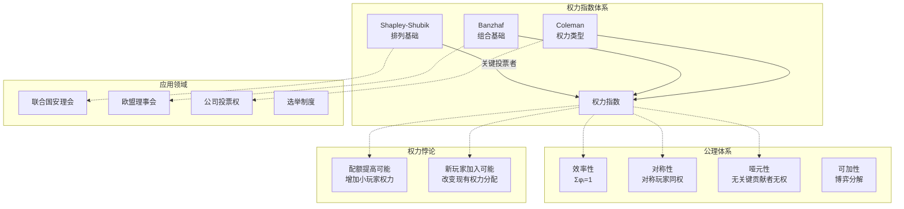

# 15.2 形式政治学

## 15.2.2 权力指数

### 概述

权力指数（Power Indices）形式化度量投票者在集体决策中的实际影响力，超越简单的投票权重。
Shapley-Shubik指数和Banzhaf指数是两种经典的权力度量，分别从排列组合和关键投票者的角度量化权力。

**参考文献**: Shapley & Shubik (1954), Banzhaf (1965), Penrose (1946), Coleman (1971)

---

## 15.2.2.1 投票博弈基础

### 加权投票博弈

**定义 15.2.11** (加权多数博弈)

加权多数博弈定义为三元组 $G = (N, w, q)$：

- $N = \{1, 2, \ldots, n\}$：投票者集合
- $w = (w_1, w_2, \ldots, w_n)$：投票权重
- $q$：配额（通过所需的最小总权重）

联盟 $S \subseteq N$ 是**获胜联盟**，若 $\sum_{i \in S} w_i \geq q$

**定义 15.2.12** (简单博弈)

简单博弈是特征函数 $v: 2^N \to \{0, 1\}$ 满足：

1. **单调性**: $S \subseteq T \Rightarrow v(S) \leq v(T)$
2. **规范性**: $v(\emptyset) = 0, v(N) = 1$

---

### 关键投票者

**定义 15.2.13** (关键投票者/摆动者)

投票者 $i$ 对联盟 $S$ 是关键（pivot/swing）的，若：

$$v(S) = 0 \text{ 且 } v(S \cup \{i\}) = 1$$

或等价地：

$$\sum_{j \in S} w_j < q \leq \sum_{j \in S \cup \{i\}} w_j$$

---

## 15.2.2.2 Shapley-Shubik权力指数

### 定义与直觉

**定义 15.2.14** (Shapley-Shubik指数, 1954)

考虑投票者的所有排列，$i$ 为使联盟首次获胜的关键投票者的概率：

$$\phi_i = \sum_{S \subseteq N \setminus \{i\}} \frac{|S|!(n-|S|-1)!}{n!} [v(S \cup \{i\}) - v(S)]$$

或等价地：

$$\phi_i = \frac{\text{使 } i \text{ 为关键投票者的排列数}}{n!}$$

**解释**: 想象投票者按随机顺序加入联盟，$\phi_i$ 是 $i$ 使联盟从输变赢的概率。

---

### 性质

**定理 15.2.8** (Shapley值公理)

Shapley-Shubik指数是唯一满足以下公理的指数：

1. **效率性**: $\sum_{i \in N} \phi_i = 1$
2. **匿名性**: 对称投票者有相同权力
3. **哑元性**: 若 $v(S \cup \{i\}) = v(S)$ 对所有 $S$，则 $\phi_i = 0$
4. **可加性**: $\phi_i(v + w) = \phi_i(v) + \phi_i(w)$

---

### 计算示例

**示例**: 联合国安理会（简化）

- 5常任理事国：各否决权（$w_i = 7$）
- 10非常任理事国：各 $w_j = 1$
- 配额：$q = 39$（需所有5常任 + 至少4非常任）

**计算**:

对常任理事国 $i$：

- 成为关键的条件：其余4常任已加入，且已有3-9非常任
- 排列数计算得：$\phi_{\text{permanent}} \approx 0.1963$

对非常任理事国：$\phi_{\text{non-permanent}} \approx 0.00186$

**权力比率**: $\frac{\phi_P}{\phi_N} \approx 105$（远大于权重比7:1）

---

## 15.2.2.3 Banzhaf权力指数

### 定义

**定义 15.2.15** (绝对Banzhaf指数)

$$\eta_i = \sum_{S \subseteq N \setminus \{i\}} [v(S \cup \{i\}) - v(S)]$$

即投票者 $i$ 是关键投票者的联盟数。

**定义 15.2.16** (标准化Banzhaf指数)

$$\beta_i = \frac{\eta_i}{\sum_{j \in N} \eta_j}$$

---

### 概率解释

**定理 15.2.9** (Banzhaf概率解释)

假设每个投票者独立以 1/2 概率投票支持提案，则：

$$\beta_i = P(i \text{ 决定投票结果})$$

---

### 与Shapley-Shubik的比较

| 特征 | Shapley-Shubik | Banzhaf |
|------|----------------|---------|
| 基础 | 排列 (顺序加入) | 组合 (子集) |
| 权重 | 所有排列等概率 | 所有联盟等概率 |
| 效率性 | 自动满足 | 标准化后满足 |
| 可加性 | 满足 | 不满足 |

---

## 15.2.2.4 Coleman指数

### 权力概念扩展

**定义 15.2.17** (Coleman权力指数, 1971)

Coleman区分了三种权力概念：

1. **阻止权力** (Power to Prevent Action):
   $$C_i^{(P)} = \frac{\eta_i}{\text{获胜联盟数}}$$

2. **发起权力** (Power to Initiate Action):
   $$C_i^{(I)} = \frac{\eta_i}{\text{失败联盟数}}$$

3. **全面权力**:
   $$C_i = \frac{\eta_i}{2^{n-1}}$$

---

## 15.2.2.5 权力指数计算

### 算法实现

```python
"""
权力指数计算
Shapley-Shubik指数、Banzhaf指数的数值实现
"""

import numpy as np
from itertools import combinations, permutations
from typing import List, Tuple, Dict, Set
import matplotlib.pyplot as plt
from collections import defaultdict

class WeightedVotingGame:
    """
    加权多数博弈

    G = (N, w, q)
    """

    def __init__(self, weights: List[int], quota: int, names: List[str] = None):
        """
        参数:
            weights: 投票权重列表
            quota: 通过所需配额
            names: 投票者名称
        """
        self.weights = np.array(weights)
        self.n = len(weights)
        self.quota = quota

        if names is None:
            self.names = [f"P{i+1}" for i in range(self.n)]
        else:
            self.names = names

        # 预计算所有联盟的获胜状态
        self._precompute_coalitions()

    def _precompute_coalitions(self):
        """预计算所有联盟的获胜状态"""
        self.coalition_value = {}
        self.all_coalitions = []

        for r in range(self.n + 1):
            for coalition in combinations(range(self.n), r):
                S = frozenset(coalition)
                self.all_coalitions.append(S)
                weight_sum = sum(self.weights[i] for i in coalition)
                self.coalition_value[S] = 1 if weight_sum >= self.quota else 0

    def is_winning(self, coalition: Set[int]) -> bool:
        """检查联盟是否获胜"""
        return self.coalition_value[frozenset(coalition)] == 1

    def is_critical(self, i: int, coalition: Set[int]) -> bool:
        """
        检查投票者i对联盟是否关键

        i是关键若: 联盟-i失败，但联盟+i获胜
        """
        S = frozenset(coalition)
        S_without_i = frozenset(coalition - {i})

        if i not in coalition:
            return False

        return (self.coalition_value[S_without_i] == 0 and
                self.coalition_value[S] == 1)

    def shapley_shubik(self) -> Dict[str, float]:
        """
        计算Shapley-Shubik权力指数

        φ_i = Σ |S|!(n-|S|-1)!/n! * [v(S∪{i}) - v(S)]
        """
        phi = np.zeros(self.n)

        for i in range(self.n):
            for S in self.all_coalitions:
                if i not in S:
                    S_with_i = frozenset(S | {i})
                    marginal = self.coalition_value[S_with_i] - self.coalition_value[S]

                    if marginal > 0:
                        s = len(S)
                        weight = np.math.factorial(s) * np.math.factorial(self.n - s - 1) / np.math.factorial(self.n)
                        phi[i] += weight

        return {self.names[i]: phi[i] for i in range(self.n)}

    def banzhaf(self, normalized: bool = True) -> Dict[str, float]:
        """
        计算Banzhaf权力指数

        η_i = Σ [v(S∪{i}) - v(S)] 对所有S⊆N\{i}
        β_i = η_i / Ση_j  (标准化)
        """
        eta = np.zeros(self.n)

        for i in range(self.n):
            for S in self.all_coalitions:
                if i not in S:
                    S_with_i = frozenset(S | {i})
                    marginal = self.coalition_value[S_with_i] - self.coalition_value[S]
                    eta[i] += marginal

        if normalized:
            total = np.sum(eta)
            beta = eta / total if total > 0 else eta
            return {self.names[i]: beta[i] for i in range(self.n)}
        else:
            return {self.names[i]: eta[i] for i in range(self.n)}

    def coleman_index(self, index_type: str = 'prevent') -> Dict[str, float]:
        """
        计算Coleman权力指数

        参数:
            index_type: 'prevent' (阻止权力), 'initiate' (发起权力), 'absolute'
        """
        eta = np.array(list(self.banzhaf(normalized=False).values()))

        if index_type == 'prevent':
            # 阻止权力: η_i / 获胜联盟数
            winning_coalitions = sum(1 for S in self.all_coalitions
                                    if self.coalition_value[S] == 1)
            coleman = eta / winning_coalitions if winning_coalitions > 0 else eta

        elif index_type == 'initiate':
            # 发起权力: η_i / 失败联盟数
            losing_coalitions = sum(1 for S in self.all_coalitions
                                   if self.coalition_value[S] == 0)
            coleman = eta / losing_coalitions if losing_coalitions > 0 else eta

        else:  # absolute
            # 绝对权力: η_i / 2^(n-1)
            coleman = eta / (2 ** (self.n - 1))

        return {self.names[i]: coleman[i] for i in range(self.n)}

    def power_distribution(self) -> Dict:
        """
        返回完整的权力分布分析
        """
        ss = self.shapley_shubik()
        bz = self.banzhaf(normalized=True)
        bz_abs = self.banzhaf(normalized=False)

        # 权重份额
        weight_share = self.weights / np.sum(self.weights)

        return {
            'weights': {self.names[i]: self.weights[i] for i in range(self.n)},
            'weight_share': {self.names[i]: weight_share[i] for i in range(self.n)},
            'shapley_shubik': ss,
            'banzhaf': bz,
            'banzhaf_absolute': bz_abs,
            'coleman_prevent': self.coleman_index('prevent')
        }

    def is_dummy(self, i: int) -> bool:
        """检查是否为哑元（dummy）"""
        eta = list(self.banzhaf(normalized=False).values())
        return eta[i] == 0

    def is_dictator(self, i: int) -> bool:
        """检查是否为独裁者"""
        return self.weights[i] >= self.quota

    def is_veto_player(self, i: int) -> bool:
        """检查是否为否决者"""
        # i是否决者若: N\{i}不是获胜联盟
        N_without_i = frozenset(set(range(self.n)) - {i})
        return self.coalition_value[N_without_i] == 0


def un_scenario():
    """
    创建联合国安理会场景（简化版）

    实际规则复杂，这里使用简化加权模型
    """
    # 5常任理事国 + 10非常任理事国
    # 简化为: 5个有否决权的大玩家 + 10个小玩家
    # 需要所有5大玩家 + 至少4小玩家

    weights = [7]*5 + [1]*10
    quota = 39  # 5*7 + 4 = 39
    names = ['USA', 'CHN', 'RUS', 'GBR', 'FRA'] + [f'N{i}' for i in range(1, 11)]

    return WeightedVotingGame(weights, quota, names)


def eu_council():
    """
    欧盟理事会（特定多数投票规则）

    55%成员国 + 65%人口（简化）
    """
    # 简化: 假设成员国权重与其人口成比例
    # 德法意等大国 vs 小国
    weights = [10, 10, 10, 8, 8, 5, 5, 5, 5, 4, 3, 3, 3, 3, 3, 2, 2, 2, 2, 2, 1, 1, 1, 1, 1, 1, 1]
    quota = 65  # 约65%阈值
    names = ['DEU', 'FRA', 'ITA', 'ESP', 'POL'] + [f'C{i}' for i in range(1, 23)]

    return WeightedVotingGame(weights, quota, names)


# ==================== 演示 ====================
if __name__ == "__main__":
    print("=" * 70)
    print("权力指数计算分析")
    print("=" * 70)

    # 1. 简单示例
    print("\n【示例1: 简单加权博弈】")
    print("博弈: w=[4,3,2,1], q=5")

    game1 = WeightedVotingGame([4, 3, 2, 1], 5, ['A', 'B', 'C', 'D'])

    dist = game1.power_distribution()

    print("\n权重份额 vs Shapley-Shubik vs Banzhaf:")
    print(f"{'玩家':<6} {'权重%':<10} {'Shapley%':<12} {'Banzhaf%':<12}")
    print("-" * 45)
    for name in game1.names:
        w = dist['weight_share'][name] * 100
        s = dist['shapley_shubik'][name] * 100
        b = dist['banzhaf'][name] * 100
        print(f"{name:<6} {w:<10.2f} {s:<12.2f} {b:<12.2f}")

    print(f"\n关键联盟数: {dist['banzhaf_absolute']}")

    # 2. 联合国安理会
    print("\n【示例2: 联合国安理会（简化）】")
    un = un_scenario()

    dist_un = un.power_distribution()

    print("常任理事国 vs 非常任理事国:")
    print(f"{'类别':<15} {'Shapley-Shubik':<15} {'Banzhaf':<15}")
    print("-" * 50)

    # 常任理事国平均
    ss_perm = np.mean([dist_un['shapley_shubik'][n] for n in un.names[:5]])
    bz_perm = np.mean([dist_un['banzhaf'][n] for n in un.names[:5]])
    print(f"{'常任理事国':<15} {ss_perm:<15.4f} {bz_perm:<15.4f}")

    # 非常任理事国平均
    ss_non = np.mean([dist_un['shapley_shubik'][n] for n in un.names[5:]])
    bz_non = np.mean([dist_un['banzhaf'][n] for n in un.names[5:]])
    print(f"{'非常任理事国':<15} {ss_non:<15.4f} {bz_non:<15.4f}")

    print(f"\n权力比率 (常任/非常任):")
    print(f"  Shapley-Shubik: {ss_perm/ss_non:.1f}")
    print(f"  Banzhaf: {bz_perm/bz_non:.1f}")
    print(f"  权重比率: 7.0")

    # 3. 权力悖论示例
    print("\n【示例3: 权力悖论】")
    print("情况A: w=[50, 49, 1], q=51")
    game_A = WeightedVotingGame([50, 49, 1], 51, ['P1', 'P2', 'P3'])

    print("情况B: w=[50, 49, 1], q=75 (配额提高)")
    game_B = WeightedVotingGame([50, 49, 1], 75, ['P1', 'P2', 'P3'])

    for label, game in [("A", game_A), ("B", game_B)]:
        ss = game.shapley_shubik()
        print(f"\n情况{label} - Shapley-Shubik:")
        for name in game.names:
            print(f"  {name}: {ss[name]:.4f}")

    print("\n注意: P3权重最小，但在情况B中权力与P2相等！")

    # 4. 可视化
    fig, axes = plt.subplots(2, 2, figsize=(14, 12))

    # 图1: 权重与权力对比
    ax1 = axes[0, 0]
    names_short = game1.names
    x = np.arange(len(names_short))
    width = 0.25

    weights_pct = [dist['weight_share'][n]*100 for n in names_short]
    ss_pct = [dist['shapley_shubik'][n]*100 for n in names_short]
    bz_pct = [dist['banzhaf'][n]*100 for n in names_short]

    ax1.bar(x - width, weights_pct, width, label='Weight Share', alpha=0.8)
    ax1.bar(x, ss_pct, width, label='Shapley-Shubik', alpha=0.8)
    ax1.bar(x + width, bz_pct, width, label='Banzhaf', alpha=0.8)

    ax1.set_ylabel('Percentage (%)')
    ax1.set_title('权重份额 vs 权力指数')
    ax1.set_xticks(x)
    ax1.set_xticklabels(names_short)
    ax1.legend()
    ax1.grid(True, alpha=0.3, axis='y')

    # 图2: 联合国安理会权力分布
    ax2 = axes[0, 1]

    all_names = ['常任']*5 + ['非常任']*10
    ss_values = [dist_un['shapley_shubik'][n] for n in un.names]

    colors = ['red']*5 + ['blue']*10
    bars = ax2.bar(range(15), ss_values, color=colors, alpha=0.6)
    ax2.axhline(y=ss_perm, color='red', linestyle='--', label='Perm avg')
    ax2.axhline(y=ss_non, color='blue', linestyle='--', label='Non-perm avg')

    ax2.set_ylabel('Shapley-Shubik Index')
    ax2.set_title('UN安理会权力分布')
    ax2.set_xticks(range(15))
    ax2.set_xticklabels(un.names, rotation=45, ha='right')
    ax2.legend()
    ax2.grid(True, alpha=0.3, axis='y')

    # 图3: 权力悖论可视化
    ax3 = axes[1, 0]

    scenarios = ['情况A\n(q=51)', '情况B\n(q=75)']
    p1_power = [game_A.shapley_shubik()['P1'], game_B.shapley_shubik()['P1']]
    p2_power = [game_A.shapley_shubik()['P2'], game_B.shapley_shubik()['P2']]
    p3_power = [game_A.shapley_shubik()['P3'], game_B.shapley_shubik()['P3']]

    x = np.arange(len(scenarios))
    width = 0.25

    ax3.bar(x - width, p1_power, width, label='P1 (w=50)', alpha=0.8)
    ax3.bar(x, p2_power, width, label='P2 (w=49)', alpha=0.8)
    ax3.bar(x + width, p3_power, width, label='P3 (w=1)', alpha=0.8)

    ax3.set_ylabel('Shapley-Shubik Index')
    ax3.set_title('权力悖论: 配额变化对权力的影响')
    ax3.set_xticks(x)
    ax3.set_xticklabels(scenarios)
    ax3.legend()
    ax3.grid(True, alpha=0.3, axis='y')

    # 图4: 不同规模博弈的权力分布
    ax4 = axes[1, 1]

    # 生成不同n的博弈
    n_values = range(3, 11)
    max_power_ratio = []

    for n in n_values:
        # 随机权重
        np.random.seed(n)
        weights = np.random.randint(1, 10, n)
        quota = int(np.sum(weights) * 0.6)

        g = WeightedVotingGame(list(weights), quota)
        ss = list(g.shapley_shubik().values())

        # 最大权力与平均权力的比率
        ratio = max(ss) / (np.mean(ss) + 1e-10)
        max_power_ratio.append(ratio)

    ax4.plot(n_values, max_power_ratio, 'o-', linewidth=2, markersize=8)
    ax4.set_xlabel('投票者数量 (n)')
    ax4.set_ylabel('最大权力 / 平均权力')
    ax4.set_title('权力集中程度随博弈规模变化')
    ax4.grid(True)

    plt.tight_layout()
    plt.savefig('power_indices.png', dpi=150, bbox_inches='tight')
    plt.show()
    print("\n图形已保存至 power_indices.png")
```

---

### 权力结构图



---

## 15.2.2.6 权力指数公理化

### Johnston指数

**定义 15.2.18** (Johnston指数)

仅当投票者在最小获胜联盟中才计为关键：

$$JI_i = \frac{\sum_{S: i \text{ critical}} \frac{1}{|S|}}{\sum_j \sum_{S: j \text{ critical}} \frac{1}{|S|}}$$

---

## 参考文献

1. Shapley, L. S., & Shubik, M. (1954). A method for evaluating the distribution of power in a committee system. _AER_, 48(3), 787-792.
2. Banzhaf, J. F. (1965). Weighted voting doesn't work. _Rutgers Law Review_, 19, 317.
3. Coleman, J. S. (1971). Control of collectives and the power of a collectivity to act. _Social Choice_.
4. Penrose, L. S. (1946). The elementary statistics of majority voting. _JRSS_, 109(1), 53-57.
5. Felsenthal, D. S., & Machover, M. (1998). _The Measurement of Voting Power_. Edward Elgar.
6. Laruelle, A., & Valenciano, F. (2001). Shapley-Shubik and Banzhaf indices revisited. _Mathematics of Operations Research_.
