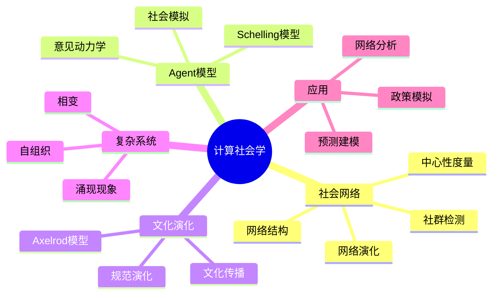

# 15.3 计算社会学

---

📌 **内容摘要**

本文档深入探讨计算社会学的核心原理和关键方法。内容涵盖社会科学形式化领域的主要知识点，包括相变, 复杂系统, 临界现象等关键主题。适合具备相关基础的学习者进行深入研究。

**关键词**: 相变, 复杂系统, 临界现象, 社会科学形式化

📚 **学习目标**

- 深入理解计算社会学的理论体系和形式化方法
- 能够进行相关定理的形式化证明
- 建立该领域的系统性知识框架

🎯 **难度级别**: 高级

⏱️ **预计阅读时间**: 15分钟

**前置知识**: 该领域的中级知识, 形式化方法基础

---


> **Computational Sociology**: 运用计算方法和复杂系统理论分析社会现象

---

## 目录

- [15.3 计算社会学](#153-计算社会学)
  - [目录](#目录)
  - [3.1 社会网络分析](#31-社会网络分析)
    - [3.1.1 网络基础](#311-网络基础)
    - [3.1.2 中心性度量](#312-中心性度量)
    - [3.1.3 网络结构度量](#313-网络结构度量)
    - [3.1.4 网络演化模型](#314-网络演化模型)
    - [3.1.5 社会网络计算](#315-社会网络计算)
  - [3.2 Agent模型与社会模拟](#32-agent模型与社会模拟)
    - [3.2.1 Agent建模基础](#321-agent建模基础)
    - [3.2.2 Schelling隔离模型](#322-schelling隔离模型)
    - [3.2.3 意见动力学模型](#323-意见动力学模型)
    - [3.2.4 Agent模拟实现](#324-agent模拟实现)
  - [3.3 文化演化模型](#33-文化演化模型)
    - [3.3.1 Axelrod文化扩散模型](#331-axelrod文化扩散模型)
    - [3.3.2 演化博弈与社会规范](#332-演化博弈与社会规范)
    - [3.3.3 文化传播模型](#333-文化传播模型)
  - [3.4 方法对比](#34-方法对比)
    - [3.4.1 网络分析方法对比](#341-网络分析方法对比)
    - [3.4.2 模拟方法对比](#342-模拟方法对比)
    - [3.4.3 演化模型对比](#343-演化模型对比)
  - [3.5 应用案例](#35-应用案例)
    - [3.5.1 案例一：组织合作网络分析](#351-案例一组织合作网络分析)
    - [3.5.2 案例二：舆论极化模拟](#352-案例二舆论极化模拟)
    - [3.5.3 案例三：文化演化实证](#353-案例三文化演化实证)
  - [3.6 思维导图](#36-思维导图)
  - [3.7 与其他模块的交叉引用](#37-与其他模块的交叉引用)
    - [前置知识](#前置知识)
    - [横向连接](#横向连接)
    - [后续应用](#后续应用)
  - [参考文献](#参考文献)
  - [📚 延伸阅读](#-延伸阅读)

---

## 3.1 社会网络分析

### 3.1.1 网络基础

**定义 3.1** (社会网络)

社会网络表示为图 $G = (V, E)$：

- $V = \{v_1, v_2, \ldots, v_n\}$：节点集合（行动者）
- $E \subseteq V \times V$：边集合（关系）

**定义 3.2** (网络类型)

| 类型 | 定义 | 示例 |
|------|------|------|
| 无向网络 | $E$ 无序对 | 友谊、合作 |
| 有向网络 | $E$ 有序对 | 建议、信任 |
| 加权网络 | $w: E \to \mathbb{R}_+$ | 关系强度 |
| 二分网络 | $V = A \cup B$ | 隶属关系 |
| 动态网络 | $G_t = (V_t, E_t)$ | 关系演变 |

**定义 3.3** (邻接矩阵)

$$A_{ij} = \begin{cases} 1 & \text{if } (i, j) \in E \\ 0 & \text{otherwise} \end{cases}$$

### 3.1.2 中心性度量

**定义 3.4** (度中心性)

$$C_D(i) = \frac{k_i}{n-1}$$

**定义 3.5** (接近中心性, Freeman 1978)

$$C_C(i) = \frac{n-1}{\sum_{j \neq i} d(i, j)}$$

**定义 3.6** (中介中心性, Freeman 1977)

$$C_B(i) = \sum_{s \neq i \neq t} \frac{\sigma_{st}(i)}{\sigma_{st}}$$

**定义 3.7** (特征向量中心性, Bonacich 1972)

$$\lambda e_i = \sum_j A_{ij} e_j \quad \Leftrightarrow \quad A e = \lambda e$$

**定义 3.8** (PageRank, Brin & Page 1998)

$$PR(i) = \frac{1-d}{n} + d \sum_{j: j \to i} \frac{PR(j)}{k_j^{out}}$$

### 3.1.3 网络结构度量

**定义 3.9** (局部聚类系数, Watts & Strogatz 1998)

$$C_i = \frac{\text{邻居间实际边数}}{\text{邻居间可能边数}} = \frac{\sum_{j,k} A_{ij}A_{jk}A_{ki}}{k_i(k_i-1)}$$

**定理 3.1** (小世界性质)

许多社会网络满足：$L \sim \log n$

**定义 3.10** (模块化, Newman & Girvan 2004)

$$Q = \frac{1}{2m} \sum_{ij} \left(A_{ij} - \frac{k_i k_j}{2m}\right) \delta(c_i, c_j)$$

### 3.1.4 网络演化模型

**模型 3.1** (Erdős-Rényi随机图)

- $G(n, p)$：每对节点以概率 $p$ 连接
- 度分布：泊松分布
- 平均路径：$L \sim \log n$
- 聚类系数：$C = p$

**模型 3.2** (Watts-Strogatz小世界模型)

1. 从环形格开始，每个节点连接 $k$ 个最近邻居
2. 以概率 $p$ 重连每条边

**定理 3.2** (小世界特征)

当 $p$ 较小时：高聚类 + 短路径

**模型 3.3** (Barabási-Albert无标度网络)

**增长**: 每步添加一个新节点

**优先连接**:

$$P(i) = \frac{k_i}{\sum_j k_j}$$

**定理 3.3** (度分布)

$$P(k) \sim k^{-\gamma}, \quad \gamma = 3$$

### 3.1.5 社会网络计算

```python
"""
社会网络分析计算
中心性、社群检测、网络演化
"""
import numpy as np
from collections import defaultdict, deque
from typing import Dict, List, Tuple, Set

class SocialNetwork:
    """社会网络分析类"""

    def __init__(self, n: int, directed: bool = False):
        self.n = n
        self.directed = directed
        self.adj = defaultdict(list)
        self.edges = set()

    def add_edge(self, u: int, v: int):
        """添加边"""
        self.adj[u].append(v)
        self.edges.add((u, v))
        if not self.directed:
            self.adj[v].append(u)
            self.edges.add((v, u))

    def degree(self, u: int) -> int:
        """计算度"""
        return len(self.adj[u])

    def betweenness_centrality(self) -> Dict[int, float]:
        """
        中介中心性 (Brandes算法)
        C_B(v) = Σ_{s≠v≠t} σ_{st}(v) / σ_{st}
        """
        C = {v: 0.0 for v in range(self.n)}

        for s in range(self.n):
            S = []
            P = {w: [] for w in range(self.n)}
            sigma = {w: 0 for w in range(self.n)}
            sigma[s] = 1
            d = {w: -1 for w in range(self.n)}
            d[s] = 0

            Q = deque([s])
            while Q:
                v = Q.popleft()
                S.append(v)
                for w in self.adj[v]:
                    if d[w] < 0:
                        Q.append(w)
                        d[w] = d[v] + 1
                    if d[w] == d[v] + 1:
                        sigma[w] += sigma[v]
                        P[w].append(v)

            delta = {w: 0 for w in range(self.n)}
            while S:
                w = S.pop()
                for v in P[w]:
                    delta[v] += (sigma[v] / sigma[w]) * (1 + delta[w])
                if w != s:
                    C[w] += delta[w]

        # 标准化
        norm = (self.n - 1) * (self.n - 2)
        if not self.directed:
            norm /= 2
        return {v: c / norm for v, c in C.items()}

    def pagerank(self, damping: float = 0.85, max_iter: int = 100) -> Dict[int, float]:
        """PageRank计算"""
        A = self._to_adjacency_matrix()
        M = np.zeros((self.n, self.n))

        for i in range(self.n):
            out_degree = np.sum(A[i, :])
            if out_degree > 0:
                M[:, i] = A[i, :] / out_degree
            else:
                M[:, i] = 1.0 / self.n

        pr = np.ones(self.n) / self.n
        for _ in range(max_iter):
            pr_new = damping * M @ pr + (1 - damping) / self.n
            if np.linalg.norm(pr_new - pr) < 1e-6:
                break
            pr = pr_new

        return {i: pr[i] for i in range(self.n)}

    def _to_adjacency_matrix(self) -> np.ndarray:
        """转换为邻接矩阵"""
        A = np.zeros((self.n, self.n))
        for u in range(self.n):
            for v in self.adj[u]:
                A[u, v] = 1
        return A

    def clustering_coefficient(self) -> Dict[int, float]:
        """局部聚类系数"""
        C = {}
        for i in range(self.n):
            neighbors = set(self.adj[i])
            k = len(neighbors)
            if k < 2:
                C[i] = 0.0
                continue

            edges_between = sum(1 for j in neighbors for k_n in neighbors
                              if j < k_n and k_n in self.adj[j])
            C[i] = (2 * edges_between) / (k * (k - 1))
        return C

    def louvain_communities(self) -> Dict[int, int]:
        """简化的Louvain算法"""
        communities = {i: i for i in range(self.n)}

        for _ in range(10):
            for i in range(self.n):
                current = communities[i]
                neighbor_comms = defaultdict(int)
                for neighbor in self.adj[i]:
                    neighbor_comms[communities[neighbor]] += 1

                if neighbor_comms:
                    best_comm = max(neighbor_comms, key=neighbor_comms.get)
                    if best_comm != current:
                        communities[i] = best_comm

        # 重新编号
        unique = sorted(set(communities.values()))
        mapping = {old: new for new, old in enumerate(unique)}
        return {i: mapping[communities[i]] for i in range(self.n)}


def generate_barabasi_albert(n: int, m: int) -> SocialNetwork:
    """生成Barabási-Albert网络"""
    G = SocialNetwork(n, directed=False)

    # 初始化m个节点的完全图
    for i in range(m):
        for j in range(i + 1, m):
            G.add_edge(i, j)

    # 增长过程
    for new_node in range(m, n):
        degrees = [G.degree(i) for i in range(new_node)]
        probs = np.array(degrees) / sum(degrees)

        targets = np.random.choice(new_node, size=m, replace=False, p=probs)
        for target in targets:
            G.add_edge(new_node, target)

    return G


def generate_small_world(n: int, k: int, p: float) -> SocialNetwork:
    """生成Watts-Strogatz小世界网络"""
    G = SocialNetwork(n, directed=False)

    # 环形格
    for i in range(n):
        for j in range(1, k // 2 + 1):
            neighbor = (i + j) % n
            G.add_edge(i, neighbor)

    # 随机重连
    edges = list(G.edges)
    for u, v in edges:
        if u < v and np.random.rand() < p:
            # 移除边
            if v in G.adj[u]:
                G.adj[u].remove(v)
                G.adj[v].remove(u)
                G.edges.remove((u, v))
                G.edges.remove((v, u))

            # 添加新边
            new_target = np.random.randint(0, n)
            while new_target == u or new_target in G.adj[u]:
                new_target = np.random.randint(0, n)
            G.add_edge(u, new_target)

    return G
```

---

## 3.2 Agent模型与社会模拟

### 3.2.1 Agent建模基础

**定义 3.11** (Agent)

一个Agent $a_i$ 由以下要素定义：

- **属性**: $\theta_i \in \Theta$（特征、状态）
- **行为规则**: $f_i: S \times \Theta \to A$（决策函数）
- **交互规则**: $g: A \times A \to S'$（互动结果）

**定义 3.12** (多Agent系统)

$$MAS = (\{a_i\}_{i=1}^n, E, \{R_k\}_{k=1}^m)$$

其中 $E$ 是交互结构，$R_k$ 是环境规则。

### 3.2.2 Schelling隔离模型

**模型设定**:

- 网格上的Agent，两种类型（红/蓝）
- 每个Agent希望至少 $T$ 比例的邻居是同类型
- 若不满足则随机移动到空位

**定理 3.4** (Schelling 1971)

即使 $T$ 较小（如30%），也会形成高度隔离的模式。

**形式化**:

Agent $i$ 的满意度：

$$U_i = \mathbb{1}\left[\frac{\text{同类型邻居数}}{\text{总邻居数}} \geq T\right]$$

均衡：所有Agent都满意或无法移动。

### 3.2.3 意见动力学模型

**模型 3.4** (DeGroot学习)

意见更新：

$$x_i(t+1) = \sum_{j} T_{ij} x_j(t)$$

其中 $T$ 是信任矩阵，$\sum_j T_{ij} = 1$。

**定理 3.5** (意见收敛)

若 $T$ 是本原的（强连通、非周期），则意见收敛到共识：

$$\lim_{t \to \infty} x(t) = \bar{x} \mathbf{1}$$

**模型 3.5** (Hegselmann-Krause有界置信)

$$x_i(t+1) = \frac{1}{|I_i(t)|} \sum_{j \in I_i(t)} x_j(t)$$

其中 $I_i(t) = \{j : |x_i(t) - x_j(t)| < \epsilon\}$

**定理 3.6** (极化)

意见将收敛到若干簇，簇间距离 $> \epsilon$。

### 3.2.4 Agent模拟实现

```python
"""
Agent模型实现
Schelling隔离模型、意见动力学
"""
import numpy as np
import matplotlib.pyplot as plt
from typing import List, Tuple, Dict

class SchellingModel:
    """Schelling隔离模型"""

    def __init__(self, width: int, height: int, density: float,
                 ratio_red: float, threshold: float):
        """
        参数:
            width, height: 网格大小
            density: 占据率
            ratio_red: 红色Agent比例
            threshold: 满意度阈值
        """
        self.width = width
        self.height = height
        self.threshold = threshold
        self.grid = np.zeros((height, width), dtype=int)  # 0=空, 1=红, 2=蓝

        # 初始化
        n_agents = int(width * height * density)
        n_red = int(n_agents * ratio_red)

        positions = np.random.choice(width * height, n_agents, replace=False)
        for i, pos in enumerate(positions):
            x, y = pos % width, pos // width
            self.grid[y, x] = 1 if i < n_red else 2

        self.empty_cells = [(pos % width, pos // width)
                           for pos in range(width * height)
                           if pos not in positions]

    def get_neighbors(self, x: int, y: int) -> List[int]:
        """获取邻居类型列表"""
        neighbors = []
        for dx in [-1, 0, 1]:
            for dy in [-1, 0, 1]:
                if dx == 0 and dy == 0:
                    continue
                nx, ny = x + dx, y + dy
                if 0 <= nx < self.width and 0 <= ny < self.height:
                    if self.grid[ny, nx] != 0:
                        neighbors.append(self.grid[ny, nx])
        return neighbors

    def is_satisfied(self, x: int, y: int) -> bool:
        """检查Agent是否满意"""
        agent_type = self.grid[y, x]
        if agent_type == 0:
            return True

        neighbors = self.get_neighbors(x, y)
        if not neighbors:
            return True

        same_type = sum(1 for n in neighbors if n == agent_type)
        return same_type / len(neighbors) >= self.threshold

    def step(self) -> int:
        """执行一步模拟，返回移动的Agent数"""
        unsatisfied = []
        for y in range(self.height):
            for x in range(self.width):
                if self.grid[y, x] != 0 and not self.is_satisfied(x, y):
                    unsatisfied.append((x, y))

        np.random.shuffle(unsatisfied)
        moved = 0

        for x, y in unsatisfied:
            if self.empty_cells:
                new_pos = self.empty_cells.pop(0)
                agent_type = self.grid[y, x]
                self.grid[new_pos[1], new_pos[0]] = agent_type
                self.grid[y, x] = 0
                self.empty_cells.append((x, y))
                moved += 1

        return moved

    def simulate(self, max_steps: int = 100) -> List[int]:
        """运行模拟"""
        history = []
        for step in range(max_steps):
            moved = self.step()
            history.append(moved)
            if moved == 0:
                print(f"均衡在步骤 {step} 达到")
                break
        return history

    def calculate_segregation(self) -> float:
        """计算隔离指数"""
        total_same = 0
        total_neighbors = 0

        for y in range(self.height):
            for x in range(self.width):
                if self.grid[y, x] != 0:
                    agent_type = self.grid[y, x]
                    neighbors = self.get_neighbors(x, y)
                    if neighbors:
                        same = sum(1 for n in neighbors if n == agent_type)
                        total_same += same
                        total_neighbors += len(neighbors)

        return total_same / total_neighbors if total_neighbors > 0 else 0


class OpinionDynamics:
    """意见动力学模型"""

    def __init__(self, n_agents: int, initial_range: Tuple[float, float] = (0, 1)):
        self.n = n_agents
        self.opinions = np.random.uniform(*initial_range, n_agents)
        self.history = [self.opinions.copy()]

    def degroot_step(self, trust_matrix: np.ndarray):
        """DeGroot意见更新"""
        self.opinions = trust_matrix @ self.opinions
        self.history.append(self.opinions.copy())

    def hk_step(self, epsilon: float):
        """Hegselmann-Krause有界置信更新"""
        new_opinions = np.zeros(self.n)
        for i in range(self.n):
            neighbors = [j for j in range(self.n)
                        if abs(self.opinions[i] - self.opinions[j]) < epsilon]
            new_opinions[i] = np.mean(self.opinions[neighbors])
        self.opinions = new_opinions
        self.history.append(self.opinions.copy())

    def has_converged(self, tol: float = 1e-4) -> bool:
        """检查是否收敛"""
        if len(self.history) < 2:
            return False
        return np.allclose(self.history[-1], self.history[-2], atol=tol)
```

---

## 3.3 文化演化模型

### 3.3.1 Axelrod文化扩散模型

**模型设定**:

- 每个Agent有文化特征向量 $\sigma_i = (\sigma_i^1, \ldots, \sigma_i^F)$
- 每个特征有 $q$ 个可能的特质值
- 两个Agent互动的概率与相似度成正比

**定义 3.13** (文化相似度)

$$d(i, j) = \frac{1}{F} \sum_{f=1}^F \mathbb{1}[\sigma_i^f = \sigma_j^f]$$

**互动规则**:

1. 随机选择一对邻居
2. 以概率 $d(i, j)$ 互动
3. 若互动，随机选择一个不同特征，$j$ 采纳 $i$ 的值

**定理 3.7** (Axelrod 1997)

系统收敛到文化稳定区域，区域内同质、区域间异质。

### 3.3.2 演化博弈与社会规范

**定义 3.14** (演化稳定策略, ESS)

策略 $s^*$ 是ESS，若：

$$u(s^*, s^*) > u(s, s^*) \text{ 或 }$$
$$u(s^*, s^*) = u(s, s^*) \text{ 且 } u(s^*, s) > u(s, s), \quad \forall s \neq s^*$$

**复制者动态**:

$$\dot{x}_i = x_i [u(e_i, x) - u(x, x)]$$

其中 $x_i$ 是策略 $i$ 的频率。

### 3.3.3 文化传播模型

**模型 3.6** (Conformist传播)

$$P(\text{采纳}) = \frac{n_{popular}}{n_{total}}$$

**模型 3.7** ( prestige偏见)

倾向于从"成功"个体学习：

$$P(i \text{ 是榜样}) \propto \text{Payoff}_i$$

---

## 3.4 方法对比

### 3.4.1 网络分析方法对比

| 方法 | 适用场景 | 计算复杂度 | 优势 | 局限 |
|------|---------|-----------|------|------|
| 中心性分析 | 影响力识别 | $O(n^3)$ | 直观、可解释 | 静态快照 |
| 社群检测 | 群体发现 | $O(n \log n)$ | 发现结构 | 分辨率限制 |
| 网络演化 | 动态过程 | $O(n)$ | 预测网络增长 | 简化假设 |
| 随机图模型 | 基准比较 | $O(n^2)$ | 统计推断 | 缺乏真实结构 |

### 3.4.2 模拟方法对比

| 特征 | ABM | 系统动力学 | 微观仿真 | 机器学习 |
|------|-----|-----------|---------|---------|
| **个体异质性** | 高 | 低 | 高 | 中 |
| **空间显式** | 是 | 否 | 可 | 可 |
| **理论基础** | 行为规则 | 微分方程 | 统计模型 | 数据驱动 |
| **可解释性** | 高 | 高 | 中 | 低 |
| **预测能力** | 场景分析 | 趋势预测 | 政策评估 | 模式识别 |

### 3.4.3 演化模型对比

| 模型 | 选择机制 | 变异来源 | 适用现象 |
|------|---------|---------|---------|
| Axelrod模型 | 同质性吸引 | 随机互动 | 文化分化 |
| 复制者动态 | 收益差异 | 突变 | 规范演化 |
| 遗传算法 | 适应度选择 | 交叉/变异 | 复杂适应 |
| 粒子群 | 社会学习 | 随机探索 | 集体行为 |

---

## 3.5 应用案例

### 3.5.1 案例一：组织合作网络分析

**数据**: 企业合作网络（R&D联盟）

**分析步骤**:

1. **网络构建**: 企业为节点，合作为边
2. **中心性分析**: 识别关键企业
3. **社群检测**: 发现产业集群
4. **动态分析**: 网络演化趋势

**发现**:

- 中心性高的企业具有创新优势
- 跨社群企业充当知识桥梁
- 网络呈现核心-边缘结构

### 3.5.2 案例二：舆论极化模拟

**模型**: Hegselmann-Krause有界置信

**参数设置**:

- 1000个Agent
- 初始意见均匀分布
- $\epsilon$ 从0.1到0.4变化

**结果**:

| $\epsilon$ | 最终簇数 | 极化程度 |
|-----------|---------|---------|
| 0.1 | 15+ | 高 |
| 0.2 | 5-8 | 中 |
| 0.3 | 2-3 | 低 |
| 0.4 | 1 | 共识 |

**政策含义**: 促进跨群体交流可降低极化。

### 3.5.3 案例三：文化演化实证

**数据**: 世界价值观调查

**分析**: Axelrod模型验证

**发现**:

- 地理邻近国家文化更相似
- 语言是文化边界的重要因素
- 全球化促进了某些文化特征的趋同

---

## 3.6 思维导图



---

## 3.7 与其他模块的交叉引用

### 前置知识

- **11_系统科学/05_网络科学**: 网络理论基础
- **11_系统科学/03_复杂系统**: 复杂适应系统
- **03_编程范式**: Agent编程、并发模拟

### 横向连接

- **05_网络社会学**: 在线社会网络
- **13_认知科学形式模型**: 社会认知、决策

### 后续应用

- **04_软件工程**: 团队协作网络
- **06_调度系统**: 组织资源调度

---

## 参考文献

1. Wasserman, S., & Faust, K. (1994). _Social Network Analysis_. Cambridge.
2. Watts, D. J., & Strogatz, S. H. (1998). Collective dynamics of 'small-world' networks. _Nature_.
3. Barabási, A. L., & Albert, R. (1999). Emergence of scaling in random networks. _Science_.
4. Schelling, T. C. (1971). Dynamic models of segregation. _JMS_.
5. Axelrod, R. (1997). The dissemination of culture. _JCR_.
6. Epstein, J. M., & Axtell, R. (1996). _Growing Artificial Societies_. MIT Press.
7. Macy, M. W., & Willer, R. (2002). From factors to actors. _Annual Review of Sociology_.

---

## 📚 延伸阅读

- [15.3 计算社会学](./03_计算社会学/03.3_文化演化模型.md)
- [11.3 涌现与层次](../11_系统科学/01_一般系统论/01.3_涌现与层次.md)
- [15.3 计算社会学](./03_计算社会学/03.1_社会网络分析.md)
- [11.10 相变与临界现象](../11_系统科学/03_复杂系统/03.2_相变与临界现象.md)
- [03.1 系统动力学](../05_形式化理论/03_控制论/03.1_系统动力学.md)
