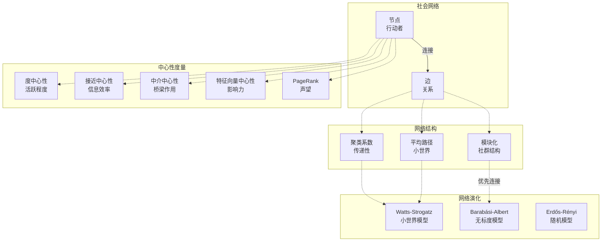

# 15.3 计算社会学

---

📌 **内容摘要**

本文档深入探讨计算社会学的核心原理和关键方法。内容涵盖计算社会学领域的主要知识点，包括相关理论、方法及应用。适合具备相关基础的学习者进行深入研究。

**关键词**: 计算社会学

📚 **学习目标**
- 深入理解计算社会学的理论体系和形式化方法
- 能够进行相关定理的形式化证明
- 建立该领域的系统性知识框架

🎯 **难度级别**: 高级

⏱️ **预计阅读时间**: 15分钟

**前置知识**: 该领域的中级知识, 形式化方法基础

---


## 15.3.1 社会网络分析

### 概述

社会网络分析（Social Network Analysis, SNA）将社会关系形式化为图结构，通过数学和计算方法研究社会结构、影响力和群体动态。该领域融合了图论、统计物理和社会学理论，为理解社会现象提供了独特的结构视角。

**参考文献**: Wasserman & Faust (1994), Newman (2010), Scott (2017)

---

## 15.3.1.1 网络基础

### 图论表示

**定义 15.3.1** (社会网络)

社会网络表示为图 $G = (V, E)$：

- $V = \{v_1, v_2, \ldots, v_n\}$：节点集合（行动者/个体）
- $E \subseteq V \times V$：边集合（关系/连接）

**定义 15.3.2** (网络类型)

| 类型 | 定义 | 应用 |
|------|------|------|
| 无向网络 | $E$ 无序对 | 友谊、合作 |
| 有向网络 | $E$ 有序对 | 建议、信任 |
| 加权网络 | $w: E \to \mathbb{R}_+$ | 关系强度 |
| 二分网络 | $V = A \cup B$, $E \subseteq A \times B$ | 隶属关系 |

---

### 邻接矩阵

**定义 15.3.3** (邻接矩阵)

$$A_{ij} = \begin{cases} 1 & \text{if } (i, j) \in E \\ 0 & \text{otherwise} \end{cases}$$

对于加权网络：$A_{ij} = w(i, j)$

**定义 15.3.4** (度)

- **无向网络**: $k_i = \sum_j A_{ij}$
- **入度**: $k_i^{in} = \sum_j A_{ji}$
- **出度**: $k_i^{out} = \sum_j A_{ij}$

---

## 15.3.1.2 中心性度量

### 度中心性

**定义 15.3.5** (度中心性)

$$C_D(i) = \frac{k_i}{n-1}$$

**解释**: 直接连接数量，反映活跃度或受欢迎程度。

---

### 接近中心性

**定义 15.3.6** (接近中心性, Freeman 1978)

$$C_C(i) = \frac{n-1}{\sum_{j \neq i} d(i, j)}$$

其中 $d(i, j)$ 为最短路径距离。

**解释**: 到其他所有节点的平均距离倒数，反映信息获取效率。

---

### 中介中心性

**定义 15.3.7** (中介中心性, Freeman 1977)

$$C_B(i) = \sum_{s \neq i \neq t} \frac{\sigma_{st}(i)}{\sigma_{st}}$$

其中 $\sigma_{st}$ 为 $s$ 到 $t$ 的最短路径数，$\sigma_{st}(i)$ 为经过 $i$ 的最短路径数。

**解释**: 充当信息桥梁的程度，反映结构洞位置。

---

### 特征向量中心性

**定义 15.3.8** (特征向量中心性, Bonacich 1972)

$$\lambda e_i = \sum_j A_{ij} e_j$$

或矩阵形式：$A e = \lambda e$

取最大特征值对应的特征向量。

**解释**: 连接的重要性取决于其邻居的重要性（递归定义）。

---

### PageRank

**定义 15.3.9** (PageRank, Brin & Page 1998)

$$PR(i) = \frac{1-d}{n} + d \sum_{j: j \to i} \frac{PR(j)}{k_j^{out}}$$

其中 $d$ 为阻尼因子（通常 0.85）。

**矩阵形式**: $PR = d \cdot A^T D^{-1} PR + \frac{1-d}{n} \mathbf{1}$

---

## 15.3.1.3 网络结构

### 聚类系数

**定义 15.3.10** (局部聚类系数, Watts & Strogatz 1998)

$$C_i = \frac{\text{邻居间实际边数}}{\text{邻居间可能边数}} = \frac{\sum_{j,k} A_{ij}A_{jk}A_{ki}}{k_i(k_i-1)}$$

**全局聚类系数**: $C = \frac{1}{n}\sum_i C_i$

**解释**: 我的朋友之间也是朋友的可能性，反映网络传递性。

---

### 平均路径长度

**定义 15.3.11** (平均最短路径)

$$L = \frac{1}{n(n-1)} \sum_{i \neq j} d(i, j)$$

**定理 15.3.1** (小世界性质)

许多社会网络满足：$L \sim \log n$（随网络规模对数增长）

---

### 小世界网络

**定义 15.3.12** (Watts-Strogatz模型参数)

$$\sigma = \frac{C/C_{rand}}{L/L_{rand}}$$

当 $\sigma > 1$ 时，网络表现出小世界特性（高聚类、短路径）。

---

## 15.3.1.4 社群发现

### 模块化

**定义 15.3.13** (模块化, Newman & Girvan 2004)

$$Q = \frac{1}{2m} \sum_{ij} \left(A_{ij} - \frac{k_i k_j}{2m}\right) \delta(c_i, c_j)$$

其中 $m = \frac{1}{2}\sum_{ij} A_{ij}$ 为总边数，$c_i$ 为节点 $i$ 的社群归属。

**解释**: 社群内部边数与随机期望边数之差。

---

### Louvain算法

**算法 15.3.1** (Louvain社群检测)

1. **初始化**: 每个节点为独立社群
2. **局部优化**:
   - 对每个节点，尝试移动到邻居社群，计算 $\Delta Q$
   - 若 $\Delta Q > 0$，执行移动
   - 重复直至收敛
3. **聚合**: 将每个社群收缩为超级节点
4. 重复步骤2-3直至无法改进

**复杂度**: $O(n \log n)$

---

### 谱聚类

**算法 15.3.2** (谱社群检测)

1. 计算拉普拉斯矩阵：$L = D - A$
2. 计算前 $k$ 个特征向量
3. 将节点嵌入到 $k$ 维特征空间
4. 使用K-means聚类

**归一化拉普拉斯**: $L_{sym} = D^{-1/2} L D^{-1/2}$

---

## 15.3.1.5 网络演化

### 优先连接

**模型 15.3.1** (Barabási-Albert模型, 1999)

**增长**: 每步添加一个新节点

**优先连接**: 新节点连接到现有节点 $i$ 的概率：

$$P(i) = \frac{k_i}{\sum_j k_j}$$

**定理 15.3.2** (度分布)

BA网络产生幂律度分布：

$$P(k) \sim k^{-\gamma}, \quad \gamma = 3$$

---

## 15.3.1.6 计算实现

### 算法代码

```python
"""
社会网络分析
中心性、社群发现、网络演化的数值实现
"""

import numpy as np
from collections import defaultdict, deque
from typing import List, Tuple, Dict, Set
import matplotlib.pyplot as plt
from matplotlib.patches import FancyBboxPatch
import heapq

class SocialNetwork:
    """
    社会网络类

    支持有向/无向、加权/无权网络
    """

    def __init__(self, n: int, directed: bool = False, weighted: bool = False):
        self.n = n
        self.directed = directed
        self.weighted = weighted

        # 邻接表表示
        self.adj = defaultdict(list)
        self.weights = {}

        # 节点属性
        self.node_attrs = {}

    def add_edge(self, u: int, v: int, weight: float = 1.0):
        """添加边"""
        self.adj[u].append(v)
        self.weights[(u, v)] = weight

        if not self.directed:
            self.adj[v].append(u)
            self.weights[(v, u)] = weight

    def get_neighbors(self, u: int) -> List[int]:
        """获取邻居"""
        return self.adj[u]

    def get_degree(self, u: int) -> int:
        """获取度"""
        return len(self.adj[u])

    def to_adjacency_matrix(self) -> np.ndarray:
        """转换为邻接矩阵"""
        A = np.zeros((self.n, self.n))
        for u in range(self.n):
            for v in self.adj[u]:
                A[u, v] = self.weights.get((u, v), 1.0)
        return A

    def shortest_path_bfs(self, source: int) -> Dict[int, int]:
        """BFS计算最短路径（无权图）"""
        dist = {i: float('inf') for i in range(self.n)}
        dist[source] = 0
        queue = deque([source])

        while queue:
            u = queue.popleft()
            for v in self.adj[u]:
                if dist[v] == float('inf'):
                    dist[v] = dist[u] + 1
                    queue.append(v)

        return dist

    def all_pairs_shortest_path(self) -> np.ndarray:
        """计算所有点对最短路径"""
        D = np.full((self.n, self.n), float('inf'))

        for i in range(self.n):
            D[i, i] = 0
            dist = self.shortest_path_bfs(i)
            for j, d in dist.items():
                D[i, j] = d

        return D

    def betweenness_centrality(self) -> Dict[int, float]:
        """
        中介中心性 (Brandes算法)

        C_B(v) = Σ_{s≠v≠t} σ_{st}(v) / σ_{st}
        """
        C = {v: 0.0 for v in range(self.n)}

        for s in range(self.n):
            # BFS
            S = []
            P = {w: [] for w in range(self.n)}
            sigma = {w: 0 for w in range(self.n)}
            sigma[s] = 1
            d = {w: -1 for w in range(self.n)}
            d[s] = 0

            Q = deque([s])
            while Q:
                v = Q.popleft()
                S.append(v)
                for w in self.adj[v]:
                    if d[w] < 0:
                        Q.append(w)
                        d[w] = d[v] + 1
                    if d[w] == d[v] + 1:
                        sigma[w] += sigma[v]
                        P[w].append(v)

            # 依赖累积
            delta = {w: 0 for w in range(self.n)}
            while S:
                w = S.pop()
                for v in P[w]:
                    delta[v] += (sigma[v] / sigma[w]) * (1 + delta[w])
                if w != s:
                    C[w] += delta[w]

        # 标准化
        for v in C:
            if not self.directed:
                C[v] /= 2
            C[v] /= ((self.n - 1) * (self.n - 2) / 2) if not self.directed else ((self.n - 1) * (self.n - 2))

        return C

    def eigenvector_centrality(self, max_iter: int = 100, tol: float = 1e-6) -> Dict[int, float]:
        """
        特征向量中心性

        λe = A e
        """
        A = self.to_adjacency_matrix()

        # 幂迭代
        e = np.random.rand(self.n)
        e = e / np.linalg.norm(e)

        for _ in range(max_iter):
            e_new = A @ e
            norm = np.linalg.norm(e_new)
            if norm > 0:
                e_new = e_new / norm

            if np.linalg.norm(e_new - e) < tol:
                break

            e = e_new

        return {i: e[i] for i in range(self.n)}

    def pagerank(self, damping: float = 0.85, max_iter: int = 100) -> Dict[int, float]:
        """
        PageRank

        PR = d * A^T * D^{-1} * PR + (1-d)/n
        """
        A = self.to_adjacency_matrix()

        # 构建转移矩阵
        M = np.zeros((self.n, self.n))
        for i in range(self.n):
            out_degree = np.sum(A[i, :])
            if out_degree > 0:
                M[:, i] = A[i, :] / out_degree  # 列随机矩阵
            else:
                M[:, i] = 1.0 / self.n  # 随机跳转

        # 迭代
        pr = np.ones(self.n) / self.n

        for _ in range(max_iter):
            pr_new = damping * M @ pr + (1 - damping) / self.n
            if np.linalg.norm(pr_new - pr) < 1e-6:
                break
            pr = pr_new

        return {i: pr[i] for i in range(self.n)}

    def clustering_coefficient(self) -> Dict[int, float]:
        """
        局部聚类系数

        C_i = (邻居间实际边数) / (邻居间可能边数)
        """
        C = {}

        for i in range(self.n):
            neighbors = set(self.adj[i])
            k = len(neighbors)

            if k < 2:
                C[i] = 0.0
                continue

            # 邻居间的边数
            edges_between = 0
            for j in neighbors:
                for k_neighbor in neighbors:
                    if j < k_neighbor and k_neighbor in self.adj[j]:
                        edges_between += 1

            C[i] = (2 * edges_between) / (k * (k - 1))

        return C

    def global_clustering(self) -> float:
        """全局聚类系数"""
        C = self.clustering_coefficient()
        return np.mean(list(C.values()))

    def modularity(self, communities: Dict[int, int]) -> float:
        """
        模块化

        Q = 1/(2m) Σ_{ij} [A_{ij} - k_i k_j/(2m)] δ(c_i, c_j)
        """
        A = self.to_adjacency_matrix()
        m = np.sum(A) / 2

        k = np.sum(A, axis=1)

        Q = 0
        for i in range(self.n):
            for j in range(self.n):
                if communities[i] == communities[j]:
                    Q += (A[i, j] - k[i] * k[j] / (2 * m))

        return Q / (2 * m)

    def louvain_communities(self) -> Dict[int, int]:
        """
        简化的Louvain算法

        返回: 节点到社群的映射
        """
        # 初始化: 每个节点一个社群
        communities = {i: i for i in range(self.n)}

        # 简化为基于模块化的贪婪移动
        improved = True
        iterations = 0
        max_iterations = 10

        while improved and iterations < max_iterations:
            improved = False
            iterations += 1

            for i in range(self.n):
                current_comm = communities[i]

                # 计算移动到邻居社群的收益
                neighbor_comms = defaultdict(int)
                for neighbor in self.adj[i]:
                    neighbor_comms[communities[neighbor]] += 1

                best_comm = current_comm
                best_gain = 0

                for comm, count in neighbor_comms.items():
                    # 简化的增益计算
                    gain = count
                    if gain > best_gain:
                        best_gain = gain
                        best_comm = comm

                if best_comm != current_comm:
                    communities[i] = best_comm
                    improved = True

        # 重新编号
        unique_comms = sorted(set(communities.values()))
        comm_map = {old: new for new, old in enumerate(unique_comms)}

        return {i: comm_map[communities[i]] for i in range(self.n)}


def generate_small_world(n: int, k: int, p: float) -> SocialNetwork:
    """
    生成Watts-Strogatz小世界网络

    参数:
        n: 节点数
        k: 每个节点的最近邻居数（偶数）
        p: 重连概率
    """
    G = SocialNetwork(n, directed=False)

    # 环形格
    for i in range(n):
        for j in range(1, k // 2 + 1):
            neighbor = (i + j) % n
            G.add_edge(i, neighbor)

    # 随机重连
    np.random.seed(42)
    edges_to_rewire = []
    for i in range(n):
        for j in G.adj[i]:
            if i < j:  # 避免重复
                if np.random.rand() < p:
                    edges_to_rewire.append((i, j))

    for i, j in edges_to_rewire:
        # 移除边
        if j in G.adj[i]:
            G.adj[i].remove(j)
            G.adj[j].remove(i)

        # 添加新边
        new_target = np.random.randint(0, n)
        while new_target == i or new_target in G.adj[i]:
            new_target = np.random.randint(0, n)

        G.add_edge(i, new_target)

    return G


def generate_barabasi_albert(n: int, m: int) -> SocialNetwork:
    """
    生成Barabási-Albert网络

    参数:
        n: 最终节点数
        m: 每步新增边数
    """
    G = SocialNetwork(n, directed=False)

    # 初始化m个节点的完全图
    for i in range(m):
        for j in range(i + 1, m):
            G.add_edge(i, j)

    # 增长过程
    np.random.seed(42)
    for new_node in range(m, n):
        # 计算优先连接概率
        degrees = np.array([G.get_degree(i) for i in range(new_node)])
        probs = degrees / np.sum(degrees)

        # 选择m个目标
        targets = np.random.choice(new_node, size=min(m, new_node),
                                  replace=False, p=probs)

        for target in targets:
            G.add_edge(new_node, target)

    return G


# ==================== 演示 ====================
if __name__ == "__main__":
    print("=" * 70)
    print("社会网络分析")
    print("=" * 70)

    # 1. 创建Karate Club网络（简化版）
    print("\n【示例1: Karate Club网络分析】")

    # Zachary's Karate Club的简化边列表
    edges = [(0,1), (0,2), (0,3), (0,4), (0,5), (0,6), (0,7), (0,8),
             (0,10), (0,11), (0,12), (0,13), (0,17), (0,19), (0,21), (0,31),
             (1,2), (1,3), (1,7), (1,13), (1,17), (1,19), (1,21), (1,30),
             (2,3), (2,32), (2,7), (2,8), (2,9), (2,13), (2,27), (2,28),
             (3,7), (3,12), (3,13), (4,6), (4,10), (5,6), (5,10), (5,16),
             (6,16), (8,30), (8,32), (8,33), (9,33), (13,33), (14,32), (14,33),
             (15,32), (15,33), (18,32), (18,33), (19,33), (20,32), (20,33),
             (22,32), (22,33), (23,32), (23,25), (23,27), (23,29), (23,32), (23,33),
             (24,32), (24,25), (24,27), (24,31), (25,31), (26,29), (26,33),
             (27,33), (28,31), (28,33), (29,32), (29,33), (30,32), (30,33),
             (31,32), (31,33), (32,33)]

    karate = SocialNetwork(34, directed=False)
    for u, v in edges:
        karate.add_edge(u, v)

    print(f"网络规模: {karate.n} 节点, {len(edges)} 边")

    # 中心性分析
    print("\n中心性分析 (Top 5):")

    degree_cent = {i: karate.get_degree(i) / (karate.n - 1) for i in range(karate.n)}
    betweenness = karate.betweenness_centrality()
    eigenvector = karate.eigenvector_centrality()
    pagerank = karate.pagerank()

    # 排序
    def top_n(d, n=5):
        return sorted(d.items(), key=lambda x: -x[1])[:n]

    print(f"{'节点':<6} {'度中心性':<12} {'中介中心性':<12} {'特征向量':<12} {'PageRank':<12}")
    print("-" * 60)
    for i, (node_deg, _) in enumerate(top_n(degree_cent)):
        print(f"{node_deg:<6} {degree_cent[node_deg]:<12.4f} "
              f"{betweenness[node_deg]:<12.4f} {eigenvector[node_deg]:<12.4f} "
              f"{pagerank[node_deg]:<12.4f}")

    # 社群发现
    communities = karate.louvain_communities()
    n_communities = len(set(communities.values()))
    mod = karate.modularity(communities)

    print(f"\n社群发现: {n_communities} 个社群, 模块化 = {mod:.4f}")

    # 聚类系数
    clustering = karate.global_clustering()
    print(f"全局聚类系数: {clustering:.4f}")

    # 平均路径长度
    D = karate.all_pairs_shortest_path()
    finite_distances = D[D < np.inf]
    avg_path = np.mean(finite_distances[finite_distances > 0])
    print(f"平均最短路径: {avg_path:.4f}")

    # 2. 小世界网络
    print("\n【示例2: 小世界网络特性】")

    # 不同重连概率
    ps = [0, 0.1, 0.3, 0.5, 1.0]
    results = []

    for p in ps:
        G_sw = generate_small_world(100, 6, p)
        C = G_sw.global_clustering()
        D_sw = G_sw.all_pairs_shortest_path()
        finite = D_sw[D_sw < np.inf]
        L = np.mean(finite[finite > 0]) if len(finite[finite > 0]) > 0 else 0
        results.append((p, C, L))
        print(f"p={p:.1f}: C={C:.4f}, L={L:.4f}")

    # 3. 无标度网络
    print("\n【示例3: Barabási-Albert网络度分布】")

    G_ba = generate_barabasi_albert(1000, 3)
    degrees = [G_ba.get_degree(i) for i in range(1000)]

    # 度分布
    from collections import Counter
    degree_counts = Counter(degrees)
    unique_degrees = sorted(degree_counts.keys())
    counts = [degree_counts[d] for d in unique_degrees]

    print(f"平均度: {np.mean(degrees):.2f}")
    print(f"最大度: {max(degrees)}")
    print(f"度分布 (前10): {list(zip(unique_degrees[:10], counts[:10]))}")

    # 4. 可视化
    fig, axes = plt.subplots(2, 2, figsize=(14, 12))

    # 图1: Karate Club网络可视化
    ax1 = axes[0, 0]

    # 使用spring layout的简化版本
    np.random.seed(42)
    pos = {i: (np.random.rand(), np.random.rand()) for i in range(34)}

    # 简单的力导向布局迭代
    for _ in range(50):
        for i in range(34):
            fx, fy = 0, 0
            for j in range(34):
                if i != j:
                    dx = pos[i][0] - pos[j][0]
                    dy = pos[i][1] - pos[j][1]
                    dist = np.sqrt(dx**2 + dy**2) + 0.01
                    if j in karate.adj[i]:
                        # 吸引力
                        fx += 0.01 * dx / dist
                        fy += 0.01 * dy / dist
                    else:
                        # 斥力
                        fx += 0.001 * dx / dist**2
                        fy += 0.001 * dy / dist**2

            pos[i] = (pos[i][0] + 0.1 * fx, pos[i][1] + 0.1 * fy)

    # 根据社群着色
    colors = ['red', 'blue', 'green', 'orange']
    for i in range(34):
        comm = communities[i]
        ax1.scatter(pos[i][0], pos[i][1], c=colors[comm % 4], s=100 + degree_cent[i]*500,
                   alpha=0.7, edgecolors='black')

    # 绘制边
    for u in range(34):
        for v in karate.adj[u]:
            if u < v:
                ax1.plot([pos[u][0], pos[v][0]], [pos[u][1], pos[v][1]],
                        'gray', alpha=0.3, linewidth=0.5)

    ax1.set_title('Zachary\'s Karate Club网络\n(颜色=社群, 大小=度)', fontsize=12)
    ax1.axis('off')

    # 图2: 中心性比较
    ax2 = axes[0, 1]

    nodes = list(range(34))
    deg_vals = [degree_cent[i] for i in nodes]
    bet_vals = [betweenness[i] for i in nodes]
    eig_vals = [eigenvector[i] for i in nodes]
    pr_vals = [pagerank[i] for i in nodes]

    ax2.scatter(deg_vals, bet_vals, alpha=0.6, s=60, label='Degree vs Betweenness')
    ax2.set_xlabel('度中心性')
    ax2.set_ylabel('中介中心性')
    ax2.set_title('中心性指标相关性')
    ax2.grid(True, alpha=0.3)

    # 标注高中心性节点
    for i in nodes:
        if degree_cent[i] > 0.3 or betweenness[i] > 0.3:
            ax2.annotate(str(i), (deg_vals[i], bet_vals[i]),
                        textcoords="offset points", xytext=(5, 5))

    # 图3: 小世界特性
    ax3 = axes[1, 0]

    ps_plot = [r[0] for r in results]
    Cs = [r[1] for r in results]
    Ls = [r[2] for r in results]

    # 归一化（相对于p=0）
    C_norm = [c / Cs[0] for c in Cs]
    L_norm = [l / Ls[0] for l in Ls]

    ax3.semilogx(ps_plot[1:], C_norm[1:], 'o-', label='C(p)/C(0)', linewidth=2)
    ax3.semilogx(ps_plot[1:], L_norm[1:], 's-', label='L(p)/L(0)', linewidth=2)
    ax3.set_xlabel('重连概率 p (对数轴)')
    ax3.set_ylabel('归一化值')
    ax3.set_title('Watts-Strogatz小世界网络')
    ax3.legend()
    ax3.grid(True, alpha=0.3)

    # 图4: 度分布 (BA网络)
    ax4 = axes[1, 1]

    # 对数-对数图
    ax4.loglog(unique_degrees, [c/1000 for c in counts], 'o', markersize=6, alpha=0.6)

    # 拟合幂律
    fit_degrees = unique_degrees[2:20]
    fit_counts = [degree_counts[d]/1000 for d in fit_degrees]
    log_d = np.log(fit_degrees)
    log_c = np.log(fit_counts)
    coeffs = np.polyfit(log_d, log_c, 1)

    x_fit = np.logspace(0, 2, 100)
    y_fit = np.exp(coeffs[1]) * x_fit ** coeffs[0]
    ax4.loglog(x_fit, y_fit, 'r--', label=f'幂律拟合 γ={-coeffs[0]:.2f}')

    ax4.set_xlabel('度 k')
    ax4.set_ylabel('P(k)')
    ax4.set_title('Barabási-Albert网络度分布')
    ax4.legend()
    ax4.grid(True, alpha=0.3, which='both')

    plt.tight_layout()
    plt.savefig('social_network_analysis.png', dpi=150, bbox_inches='tight')
    plt.show()
    print("\n图形已保存至 social_network_analysis.png")
```

---

### 网络分析框架图



---

## 15.3.1.7 扩散与影响

### 独立级联模型

**模型 15.3.2** (Kempe et al., 2003)

每个边 $(u, v)$ 有激活概率 $p_{uv}$

- 初始激活种子集 $S_0$
- 每步：新激活节点有一次机会激活邻居
- 重复直至收敛

**影响最大化**: 寻找 $|S_0| = k$ 使期望影响范围最大

---

## 参考文献

1. Wasserman, S., & Faust, K. (1994). _Social Network Analysis_. Cambridge.
2. Newman, M. E. J. (2010). _Networks: An Introduction_. Oxford.
3. Watts, D. J., & Strogatz, S. H. (1998). Collective dynamics of 'small-world' networks. _Nature_, 393(6684), 440-442.
4. Barabási, A. L., & Albert, R. (1999). Emergence of scaling in random networks. _Science_, 286(5439), 509-512.
5. Girvan, M., & Newman, M. E. (2002). Community structure in social and biological networks. _PNAS_, 99(12), 7821-7826.
6. Kempe, D., Kleinberg, J., & Tardos, É. (2003). Maximizing the spread of influence. _KDD_.
---

## 📋 前置知识

- [11.18 复杂网络模型](./11_系统科学/05_网络科学/05.2_复杂网络模型.md)

---

## 📚 延伸阅读

- [11.17 图论基础](./11_系统科学/05_网络科学/05.1_图论基础.md)
- [11.5 网络科学](./11_系统科学/05_网络科学.md)
- [15.3 计算社会学](../03_计算社会学.md)
