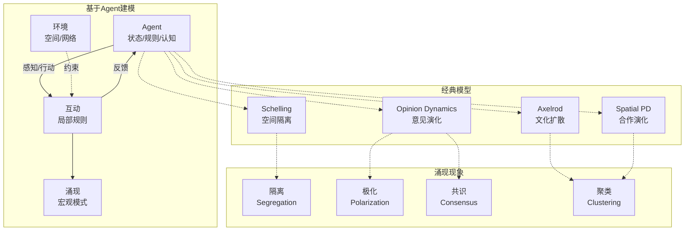

# 15.3 计算社会学

---

📌 **内容摘要**

本文档深入探讨计算社会学的核心原理和关键方法。内容涵盖计算社会学领域的主要知识点，包括相关理论、方法及应用。适合具备相关基础的学习者进行深入研究。

**关键词**: 计算社会学

📚 **学习目标**

- 深入理解计算社会学的理论体系和形式化方法
- 能够进行相关定理的形式化证明
- 建立该领域的系统性知识框架

🎯 **难度级别**: 高级

⏱️ **预计阅读时间**: 15分钟

**前置知识**: 该领域的中级知识, 形式化方法基础

---


## 15.3.2 社会模拟

### 概述

基于Agent的建模（Agent-Based Modeling, ABM）是计算社会学的核心方法论，通过模拟自主Agent的微观互动来涌现宏观社会现象。
该方法特别适用于研究复杂适应系统，如社会规范演化、合作涌现、 opinion dynamics等。

**参考文献**: Axelrod (1997), Epstein & Axtell (1996), Gilbert (2008), Macy & Flache (2009)

---

## 15.3.2.1 基于Agent建模基础

### 模型框架

**定义 15.3.14** (ABM基本要素)

基于Agent模型由四元组 $\mathcal{M} = (\mathcal{A}, \mathcal{E}, \mathcal{R}, \mathcal{U})$ 定义：

- **Agent集合** $\mathcal{A} = \{A_1, A_2, \ldots, A_n\}$
- **环境** $\mathcal{E}$：Agent活动的空间或网络
- **规则** $\mathcal{R}$：Agent行为和互动规则
- **更新机制** $\mathcal{U}$：模型状态更新顺序

**定义 15.3.15** (Agent架构)

每个Agent $A_i$ 的特征：

$$A_i = (S_i, P_i, B_i, M_i)$$

- $S_i$：状态（属性、资源、信念）
- $P_i$：感知函数
- $B_i$：行为规则
- $M_i$：记忆/学习机制

---

### 涌现现象

**定义 15.3.16** (涌现)

宏观模式 $M$ 是涌现的，若：

1. **系统依赖性**: $M$ 不能由个体属性简单加总得到
2. **新奇性**: $M$ 在微观规则中没有显式编码
3. **稳健性**: $M$ 在参数变化下保持稳定

**定理 15.3.3** (涌现的计算不可约性, Wolfram)

某些涌现现象需要完整模拟，不存在 shortcuts。

---

## 15.3.2.2 Schelling隔离模型

### 模型设定

**模型 15.3.3** (Schelling空间隔离模型, 1971)

**空间**: $m \times m$ 网格

**Agent**: 两种类型（红/蓝），占据部分格子

**偏好**: Agent希望至少 $T$ 比例邻居与自己同类

**动态**:

1. 随机选择不满的Agent
2. 移动到最近的满意位置
3. 重复

---

### 隔离度量

**定义 15.3.17** (隔离指数)

$$I = \frac{1}{n} \sum_i \frac{|\text{同类邻居}_i|}{|\text{邻居}_i|}$$

**定理 15.3.4** (温和偏好的强效应)

即使 $T = 0.3$（只要求30%同类邻居），系统收敛到高度隔离状态（$I > 0.7$）。

**解释**: 个体层面的温和偏好通过互动累积，产生宏观层面的强隔离。

---

## 15.3.2.3 Axelrod文化扩散模型

### 模型设定

**模型 15.3.4** (Axelrod文化模型, 1997)

**空间**: $m \times m$ 网格

**文化特征**: 每个Agent有 $F$ 个文化特征，每个特征取值 $\{0, 1, \ldots, q-1\}$

**相似度**: Agent $i$ 和 $j$ 的文化相似度：

$$\sigma_{ij} = \frac{1}{F} \sum_{f=1}^F \mathbb{1}[c_i(f) = c_j(f)]$$

**互动规则**:

1. 随机选择Agent $i$
2. 以概率 $\sigma_{ij}$ 选择邻居 $j$
3. 以概率 $\sigma_{ij}$，$i$ 采纳 $j$ 的一个不同特征

---

### 极化与共识

**定理 15.3.5** (Axelrod文化极化)

1. **低 $q$ (少特征值)**: 系统收敛到全局共识
2. **高 $q$ (多特征值)**: 系统稳定在多个文化区域（极化）
3. **相变**: 存在临界值 $q_c(F)$ 分隔两 regime

**文化区域定义**: 连通的Agent集合，组内 $\sigma = 1$，组间 $\sigma < 1$

---

## 15.3.2.4 意见动态模型

### DeGroot模型

**模型 15.3.5** (DeGroot学习模型, 1974)

**网络**: 社会影响的加权有向图 $W$

**意见更新**:

$$x_i(t+1) = \sum_j W_{ij} x_j(t)$$

或向量形式：$x(t+1) = W x(t)$

**定理 15.3.6** (意见收敛)

若 $W$ 是遍历的（强连通且非周期），则：

$$\lim_{t \to \infty} x(t) = (\pi^T x(0)) \mathbf{1}$$

其中 $\pi$ 是 $W$ 的平稳分布（左特征向量）。

---

### Hegselmann-Krause模型

**模型 15.3.6** (有界置信模型, 2002)

**置信阈值**: $\epsilon > 0$

**影响集**: $I_i(t) = \{j : |x_i(t) - x_j(t)| < \epsilon\}$

**意见更新**:

$$x_i(t+1) = \frac{1}{|I_i(t)|} \sum_{j \in I_i(t)} x_j(t)$$

**定理 15.3.7** (HK模型极化)

随 $\epsilon$ 减小，稳态意见聚类数增加。

---

### 舆论极化

**定义 15.3.18** (极化度量)

$$P = \sqrt{\frac{1}{n} \sum_i (x_i - \bar{x})^2}$$

或使用Esteban-Ray极化指数：

$$ER = \sum_i \sum_j \pi_i^{1+\alpha} \pi_j |y_i - y_j|$$

---

## 15.3.2.5 合作演化

### 囚徒困境博弈

**模型 15.3.7** (空间囚徒困境)

**支付矩阵**:

|        | 合作 | 背叛 |
|--------|------|------|
| **合作** | R, R | S, T |
| **背叛** | T, S | P, P |

满足 $T > R > P > S$ 且 $2R > T + S$

**空间结构**: 网格上Agent仅与邻居互动

---

### 演化稳定策略

**定义 15.3.19** (演化稳定策略, ESS)

策略 $s^*$ 是ESS，若：

1. $(s^*, s^*)$ 是Nash均衡
2. $u(s^*, s') > u(s', s')$ 对所有最佳响应 $s' \neq s^*$

**定理 15.3.8** (Nowak & May, 1992)

空间结构中，合作可以在囚徒困境中稳定存在，即使单次互动中背叛占优。

**机制**: 聚类保护（clustering protection）——合作者形成空间聚类，内部互助抵消外部剥削。

---

## 15.3.2.6 计算实现

### 社会模拟代码

```python
"""
基于Agent的社会模拟
Schelling隔离、Axelrod文化扩散、意见动态
"""

import numpy as np
import matplotlib.pyplot as plt
from matplotlib.colors import ListedColormap
from matplotlib.animation import FuncAnimation
from typing import List, Tuple, Dict, Callable
from collections import defaultdict
import random

class SchellingModel:
    """
    Schelling空间隔离模型

    网格上的两类Agent，基于邻居相似度偏好移动
    """

    EMPTY = -1
    RED = 0
    BLUE = 1

    def __init__(self, size: int = 50, density: float = 0.9,
                 red_ratio: float = 0.5, threshold: float = 0.3):
        """
        参数:
            size: 网格大小
            density: 占据密度
            red_ratio: 红色Agent比例
            threshold: 相似度阈值（最少需要多少比例同类邻居）
        """
        self.size = size
        self.threshold = threshold

        # 初始化网格
        self.grid = np.full((size, size), self.EMPTY)

        n_agents = int(size * size * density)
        n_red = int(n_agents * red_ratio)
        n_blue = n_agents - n_red

        # 随机放置
        positions = random.sample([(i, j) for i in range(size) for j in range(size)], n_agents)

        for i, pos in enumerate(positions[:n_red]):
            self.grid[pos] = self.RED
        for pos in positions[n_red:]:
            self.grid[pos] = self.BLUE

        self.empty_cells = set((i, j) for i in range(size) for j in range(size)
                              if self.grid[i, j] == self.EMPTY)
        self.n_unhappy = 0

    def get_neighbors(self, i: int, j: int) -> Tuple[int, int, int]:
        """获取邻居统计 (红, 蓝, 空)"""
        red = blue = 0

        for di in [-1, 0, 1]:
            for dj in [-1, 0, 1]:
                if di == 0 and dj == 0:
                    continue
                ni, nj = (i + di) % self.size, (j + dj) % self.size
                if self.grid[ni, nj] == self.RED:
                    red += 1
                elif self.grid[ni, nj] == self.BLUE:
                    blue += 1

        return red, blue, 8 - red - blue

    def is_happy(self, i: int, j: int) -> bool:
        """检查Agent是否满意"""
        agent_type = self.grid[i, j]
        if agent_type == self.EMPTY:
            return True

        red, blue, _ = self.get_neighbors(i, j)
        same = red if agent_type == self.RED else blue
        total = red + blue

        if total == 0:
            return True

        return same / total >= self.threshold

    def segregation_index(self) -> float:
        """计算隔离指数"""
        total_similarity = 0
        n_agents = 0

        for i in range(self.size):
            for j in range(self.size):
                if self.grid[i, j] != self.EMPTY:
                    agent_type = self.grid[i, j]
                    red, blue, _ = self.get_neighbors(i, j)
                    same = red if agent_type == self.RED else blue
                    total = red + blue

                    if total > 0:
                        total_similarity += same / total
                        n_agents += 1

        return total_similarity / n_agents if n_agents > 0 else 0

    def step(self) -> int:
        """执行一步模拟，返回移动的Agent数"""
        # 找出所有不满的Agent
        unhappy = []
        for i in range(self.size):
            for j in range(self.size):
                if self.grid[i, j] != self.EMPTY and not self.is_happy(i, j):
                    unhappy.append((i, j))

        self.n_unhappy = len(unhappy)

        if len(unhappy) == 0 or len(self.empty_cells) == 0:
            return 0

        # 随机移动不满的Agent
        n_moved = 0
        random.shuffle(unhappy)

        for i, j in unhappy[:min(len(unhappy), len(self.empty_cells))]:
            if not self.is_happy(i, j):
                # 移动到随机空位
                new_pos = random.choice(list(self.empty_cells))
                self.empty_cells.remove(new_pos)
                self.empty_cells.add((i, j))

                self.grid[new_pos] = self.grid[i, j]
                self.grid[i, j] = self.EMPTY
                n_moved += 1

        return n_moved

    def simulate(self, max_steps: int = 1000) -> List[float]:
        """运行模拟，返回隔离指数历史"""
        history = [self.segregation_index()]

        for step in range(max_steps):
            moved = self.step()
            history.append(self.segregation_index())

            if moved == 0:
                print(f"收敛于步骤 {step}")
                break

        return history


class AxelrodCultureModel:
    """
    Axelrod文化扩散模型

    网格上的文化特征相互作用与趋同
    """

    def __init__(self, size: int = 20, n_features: int = 5, n_traits: int = 10):
        """
        参数:
            size: 网格大小
            n_features: 文化特征数量F
            n_traits: 每个特征的取值数量q
        """
        self.size = size
        self.F = n_features
        self.q = n_traits

        # 初始化文化
        self.culture = np.random.randint(0, n_traits, (size, size, n_features))

    def cultural_similarity(self, i1: int, j1: int, i2: int, j2: int) -> float:
        """计算两个Agent的文化相似度"""
        same = np.sum(self.culture[i1, j1] == self.culture[i2, j2])
        return same / self.F

    def get_neighbors(self, i: int, j: int) -> List[Tuple[int, int]]:
        """获取四个邻居"""
        neighbors = []
        for di, dj in [(-1, 0), (1, 0), (0, -1), (0, 1)]:
            ni, nj = i + di, j + dj
            if 0 <= ni < self.size and 0 <= nj < self.size:
                neighbors.append((ni, nj))
        return neighbors

    def count_regions(self) -> Tuple[int, Dict[int, int]]:
        """
        统计文化区域数量

        返回: (区域数, 区域大小分布)
        """
        visited = np.zeros((self.size, self.size), dtype=bool)
        regions = 0
        region_sizes = []

        for i in range(self.size):
            for j in range(self.size):
                if not visited[i, j]:
                    # BFS找连通区域
                    region_size = 0
                    queue = [(i, j)]
                    visited[i, j] = True
                    region_culture = self.culture[i, j].copy()

                    while queue:
                        ci, cj = queue.pop(0)
                        region_size += 1

                        for ni, nj in self.get_neighbors(ci, cj):
                            if not visited[ni, nj] and np.array_equal(
                                self.culture[ni, nj], region_culture):
                                visited[ni, nj] = True
                                queue.append((ni, nj))

                    regions += 1
                    region_sizes.append(region_size)

        size_dist = defaultdict(int)
        for s in region_sizes:
            size_dist[s] += 1

        return regions, dict(size_dist)

    def step(self) -> bool:
        """执行一步模拟，返回是否发生互动"""
        # 随机选择Agent
        i, j = np.random.randint(0, self.size, 2)

        # 选择随机邻居
        neighbors = self.get_neighbors(i, j)
        if len(neighbors) == 0:
            return False

        ni, nj = random.choice(neighbors)

        # 计算相似度
        sim = self.cultural_similarity(i, j, ni, nj)

        # 互动概率 = 相似度
        if np.random.rand() < sim and sim < 1.0:
            # 选择一个不同特征并复制
            diff_features = np.where(self.culture[i, j] != self.culture[ni, nj])[0]
            if len(diff_features) > 0:
                f = random.choice(diff_features)
                self.culture[i, j][f] = self.culture[ni, nj][f]
                return True

        return False

    def simulate(self, n_steps: int = 100000) -> Tuple[List[int], List[float]]:
        """运行模拟，返回区域数和最大区域比例历史"""
        region_history = []
        max_region_history = []

        for step in range(n_steps):
            self.step()

            if step % 1000 == 0:
                regions, size_dist = self.count_regions()
                region_history.append(regions)
                max_region = max(size_dist.values()) if size_dist else 0
                max_region_history.append(max_region / (self.size ** 2))

        return region_history, max_region_history


class OpinionDynamics:
    """
    意见动态模型

    DeGroot和HK模型
    """

    def __init__(self, n_agents: int = 100, model: str = 'HK', epsilon: float = 0.2):
        """
        参数:
            n_agents: Agent数量
            model: 'DeGroot' 或 'HK'
            epsilon: HK模型的置信阈值
        """
        self.n = n_agents
        self.model_type = model
        self.epsilon = epsilon

        # 初始化意见 (均匀分布)
        self.opinions = np.random.uniform(0, 1, n_agents)

        # DeGroot权重矩阵
        if model == 'DeGroot':
            # 随机权重
            W = np.random.rand(n_agents, n_agents)
            W = W / W.sum(axis=1, keepdims=True)
            self.W = W

    def step(self):
        """执行一步意见更新"""
        if self.model_type == 'DeGroot':
            self.opinions = self.W @ self.opinions

        elif self.model_type == 'HK':
            new_opinions = np.zeros(self.n)

            for i in range(self.n):
                # 找到置信集
                confidence_set = np.abs(self.opinions - self.opinions[i]) < self.epsilon

                if np.sum(confidence_set) > 0:
                    new_opinions[i] = np.mean(self.opinions[confidence_set])
                else:
                    new_opinions[i] = self.opinions[i]

            self.opinions = new_opinions

    def count_clusters(self, tolerance: float = 0.01) -> int:
        """统计意见聚类数"""
        sorted_ops = np.sort(self.opinions)
        clusters = 1

        for i in range(1, len(sorted_ops)):
            if sorted_ops[i] - sorted_ops[i-1] > tolerance:
                clusters += 1

        return clusters

    def polarization(self) -> float:
        """计算意见极化程度"""
        return np.std(self.opinions)

    def simulate(self, n_steps: int = 100) -> Tuple[List[int], List[float]]:
        """运行模拟"""
        cluster_history = [self.count_clusters()]
        polar_history = [self.polarization()]

        for _ in range(n_steps):
            self.step()
            cluster_history.append(self.count_clusters())
            polar_history.append(self.polarization())

        return cluster_history, polar_history


# ==================== 演示 ====================
if __name__ == "__main__":
    print("=" * 70)
    print("基于Agent的社会模拟")
    print("=" * 70)

    # 1. Schelling模型
    print("\n【Schelling空间隔离模型】")

    thresholds = [0.0, 0.3, 0.5, 0.7]
    segregation_results = {}

    for T in thresholds:
        schelling = SchellingModel(size=30, density=0.8, red_ratio=0.5, threshold=T)
        history = schelling.simulate(max_steps=500)
        segregation_results[T] = history
        print(f"阈值 T={T}: 初始隔离={history[0]:.3f}, 最终隔离={history[-1]:.3f}")

    # 2. Axelrod文化模型
    print("\n【Axelrod文化扩散模型】")

    # 不同参数设置
    axelrod_configs = [
        (5, 5),   # 低多样性
        (5, 10),  # 中等
        (5, 20),  # 高多样性
    ]

    axelrod_results = []
    for F, q in axelrod_configs:
        axelrod = AxelrodCultureModel(size=15, n_features=F, n_traits=q)
        regions, max_region = axelrod.simulate(n_steps=50000)
        final_regions = axelrod.count_regions()[0]
        axelrod_results.append((F, q, regions, max_region, final_regions))
        print(f"F={F}, q={q}: 最终区域数={final_regions}")

    # 3. 意见动态
    print("\n【Hegselmann-Krause意见动态】")

    epsilons = [0.1, 0.2, 0.3, 0.5]
    opinion_results = {}

    for eps in epsilons:
        opinion = OpinionDynamics(n_agents=100, model='HK', epsilon=eps)
        clusters, polar = opinion.simulate(n_steps=50)
        opinion_results[eps] = (clusters, polar)
        print(f"ε={eps}: 最终聚类数={clusters[-1]}, 极化程度={polar[-1]:.4f}")

    # 4. 可视化
    fig, axes = plt.subplots(2, 2, figsize=(14, 12))

    # 图1: Schelling隔离演化
    ax1 = axes[0, 0]
    for T, history in segregation_results.items():
        ax1.plot(history, label=f'T={T}', linewidth=2)
    ax1.set_xlabel('步骤')
    ax1.set_ylabel('隔离指数')
    ax1.set_title('Schelling模型: 隔离指数演化')
    ax1.legend()
    ax1.grid(True, alpha=0.3)

    # 图2: Axelrod文化区域数
    ax2 = axes[0, 1]
    for F, q, regions, max_region, final in axelrod_results:
        ax2.plot(regions, label=f'F={F}, q={q}', linewidth=2)
    ax2.set_xlabel('步骤 (×1000)')
    ax2.set_ylabel('文化区域数')
    ax2.set_title('Axelrod模型: 文化区域演化')
    ax2.legend()
    ax2.grid(True, alpha=0.3)

    # 图3: HK模型聚类数
    ax3 = axes[1, 0]
    for eps, (clusters, polar) in opinion_results.items():
        ax3.plot(clusters, label=f'ε={eps}', linewidth=2)
    ax3.set_xlabel('步骤')
    ax3.set_ylabel('意见聚类数')
    ax3.set_title('HK模型: 意见聚类演化')
    ax3.legend()
    ax3.grid(True, alpha=0.3)

    # 图4: 最终状态可视化 (Schelling)
    ax4 = axes[1, 1]

    # 创建最终状态的Schelling网格
    schelling_final = SchellingModel(size=30, density=0.8, red_ratio=0.5, threshold=0.3)
    schelling_final.simulate(max_steps=500)

    # 绘制网格
    colors = ['white', 'red', 'blue']
    cmap = ListedColormap(colors)
    im = ax4.imshow(schelling_final.grid, cmap=cmap, interpolation='nearest')
    ax4.set_title(f'Schelling最终状态 (T=0.3)\n隔离指数={schelling_final.segregation_index():.3f}')
    ax4.axis('off')

    # 添加图例
    from matplotlib.patches import Patch
    legend_elements = [Patch(facecolor='white', edgecolor='black', label='Empty'),
                      Patch(facecolor='red', edgecolor='black', label='Red'),
                      Patch(facecolor='blue', edgecolor='black', label='Blue')]
    ax4.legend(handles=legend_elements, loc='upper right')

    plt.tight_layout()
    plt.savefig('social_simulation.png', dpi=150, bbox_inches='tight')
    plt.show()
    print("\n图形已保存至 social_simulation.png")
```

---

### 社会模拟框架图



---

## 15.3.2.7 模型验证

### 模式导向建模

**定义 15.3.20** (结构真实度)

模型能够复现目标系统的多种宏观模式：

$$SR = \frac{1}{K} \sum_{k=1}^K \mathbb{1}[M_k^{sim} \approx M_k^{obs}]$$

---

## 参考文献

1. Schelling, T. C. (1971). Dynamic models of segregation. _JME_, 1(2), 143-186.
2. Axelrod, R. (1997). The dissemination of culture. _JCR_, 41(2), 203-226.
3. Epstein, J. M., & Axtell, R. (1996). _Growing Artificial Societies_. MIT Press.
4. Hegselmann, R., & Krause, U. (2002). Opinion dynamics and bounded confidence. _JASSS_, 5(3).
5. Nowak, M. A., & May, R. M. (1992). Evolutionary games and spatial chaos. _Nature_, 359(6398), 826-829.
6. DeGroot, M. H. (1974). Reaching a consensus. _JASA_, 69(345), 118-121.

---

## 📚 延伸阅读

- [11.3 涌现与层次](../../11_系统科学/01_一般系统论/01.3_涌现与层次.md)
- [11.10 相变与临界现象](../../11_系统科学/03_复杂系统/03.2_相变与临界现象.md)
