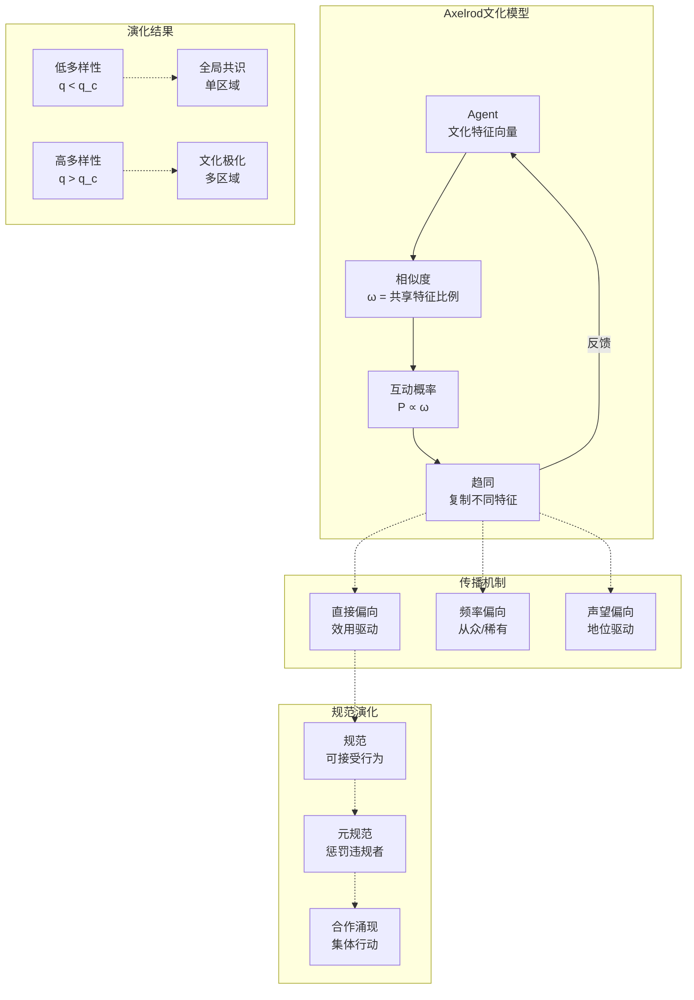

# 15.3 计算社会学

---

📌 **内容摘要**

本文档深入探讨计算社会学的核心原理和关键方法。内容涵盖计算社会学领域的主要知识点，包括知识逻辑, 形式认识论, 认知科学等关键主题。适合具备相关基础的学习者进行深入研究。

**关键词**: 知识逻辑, 计算社会学, 形式认识论, 认知科学

📚 **学习目标**

- 深入理解计算社会学的理论体系和形式化方法
- 能够进行相关定理的形式化证明
- 建立该领域的系统性知识框架

🎯 **难度级别**: 高级

⏱️ **预计阅读时间**: 15分钟

**前置知识**: 该领域的中级知识, 形式化方法基础

---


## 15.3.3 文化演化模型

### 概述

文化演化模型研究文化特征在社会中的传播、变异和选择过程。该领域结合了进化生物学、认知科学和社会学，形式化理解文化动态的普遍规律。Robert Axelrod的里程碑工作展示了文化如何通过局部互动形成区域极化。

**参考文献**: Axelrod (1997), Boyd & Richerson (1985), Cavalli-Sforza & Feldman (1981)

---

## 15.3.3.1 文化演化基础

### 文化传播机制

**定义 15.3.21** (文化特征)

文化特征 $c_i^f$ 是Agent $i$ 在特征维度 $f$ 上的取值。

文化配置：$\mathbf{c}_i = (c_i^1, c_i^2, \ldots, c_i^F)$

**定义 15.3.22** (传播机制)

| 机制 | 描述 | 数学形式 |
|------|------|----------|
| 直接偏向 | 基于特征效用的选择 | $P(\text{采纳}|c) \propto u(c)$ |
| 频率偏向 | 基于流行度的选择 | $P(\text{采纳}|c) \propto f_c$ |
| 声望偏向 | 基于示范者地位 | $P(\text{采纳}|i) \propto p_i$ |
| 从众 | 依多数决策 | 采纳 $c$ 若 $f_c > \theta$ |
| 同质化 | 增加互动者相似度 | $\Delta c \propto (c_j - c_i)$ |

---

### Axelrod模型详解

**模型 15.3.8** (Axelrod文化模型, 1997)

**设置**:

- 空间：$L \times L$ 网格
- 文化特征：$F$ 个维度
- 特征取值：$q$ 个可能值 $\{0, 1, \ldots, q-1\}$

**相似度度量**:

$$\omega_{ij} = \frac{1}{F} \sum_{f=1}^F \mathbb{1}[c_i^f = c_j^f]$$

**互动规则**:

1. 以概率 $\omega_{ij}$ 选择互动
2. 若 $\omega_{ij} < 1$，以概率 $\omega_{ij}$ 复制一个不同特征

**互动概率**:

$$P(\text{互动}|i, j) = \omega_{ij} \cdot \mathbb{1}[j \in \mathcal{N}(i)]$$

---

## 15.3.3.2 区域形成与极化

### 稳态分析

**定义 15.3.23** (文化区域)

文化区域是极大连通子图，其中：

- 组内Agent完全相同：$\mathbf{c}_i = \mathbf{c}_j$ 对所有 $i, j$ 在区域内
- 组间Agent不同：$\mathbf{c}_i \neq \mathbf{c}_j$ 对跨区域

**定义 15.3.24** (文化边界)

边界边的特征是：

- 连接不同文化
- 相似度 $\omega < 1$

**定理 15.3.9** (Axelrod稳态特征)

稳态满足：

1. **区域内**: 所有Agent完全相同
2. **边界上**: 相邻Agent至少在一个特征上不同
3. **边界稳定性**: 边界两边相似度 $\omega = 0$（完全隔离）或互动已停止

---

### 相变现象

**定理 15.3.10** (文化多样性相变)

固定 $F$，存在临界值 $q_c(F)$：

- **$q < q_c$**: 系统收敛到全局共识（单区域）
- **$q > q_c$**: 系统稳定在多个文化区域（极化）

**临界值估计** (Castellano et al., 2000):

$$q_c(F) \approx (F \cdot L^2)^{1/F}$$

对于 $F = 5$，$L = 40$：$q_c \approx 12$

---

## 15.3.3.3 扩展模型

### 噪声与文化漂移

**模型 15.3.9** (Axelrod模型+噪声)

每一步以概率 $\mu$（突变率）：

$$c_i^f \to \text{Uniform}(\{0, \ldots, q-1\})$$

**定理 15.3.11** (噪声效应)

- **低噪声** ($\mu < \mu_c$): 区域结构持续存在
- **高噪声** ($\mu > \mu_c$): 文化完全随机化，无结构

---

### 多层文化

**模型 15.3.10** (层次文化模型)

文化特征按重要性分层：

- 核心特征（难改变）
- 边缘特征（易改变）

互动概率权重：$\omega_{ij} = \sum_f w_f \cdot \mathbb{1}[c_i^f = c_j^f]$

---

### 网络结构影响

**模型 15.3.11** (复杂网络上的文化演化)

**随机网络** (Erdős-Rényi): 促进快速收敛

**小世界网络**: 平衡局部聚类与全局传播

**无标度网络**: 枢纽节点主导文化扩散

**定理 15.3.12** (网络效应)

网络聚类系数与最终文化区域数正相关。

---

## 15.3.3.4 演化博弈与文化

### 合作演化

**模型 15.3.12** (空间囚徒困境+文化)

Agent同时具有：

- **策略基因**: 合作(C)或背叛(D)
- **文化标记**: 影响互动对象选择

**选择规则**: Agent更可能与同文化者互动

**定理 15.3.13** (文化促进合作)

文化标记通过促进群体内合作，可以维持全局合作水平。

---

### 规范演化

**模型 15.3.13** (Ostrom规范演化)

规范 $N$ 定义可接受行为，演化由以下驱动：

1. **元规范惩罚**: 惩罚违反规范者
2. **二级惩罚**: 惩罚不惩罚违规者的人
3. **学习**: 模仿高支付者的规范

---

## 15.3.3.5 计算方法

### 算法实现

```python
"""
文化演化模型
Axelrod模型、文化传播、规范演化
"""

import numpy as np
import matplotlib.pyplot as plt
from matplotlib.colors import LinearSegmentedColormap
from typing import List, Tuple, Dict, Set
from collections import defaultdict
import random

class CulturalEvolutionModel:
    """
    文化演化模型基类
    """

    def __init__(self, n_agents: int, n_traits: int):
        self.n = n_agents
        self.q = n_traits
        self.culture = None
        self.time = 0

    def cultural_distance(self, i: int, j: int) -> float:
        """计算文化距离"""
        raise NotImplementedError

    def step(self):
        """执行一步演化"""
        raise NotImplementedError


class AxelrodModel(CulturalEvolutionModel):
    """
    Axelrod文化扩散模型

    网格空间上的文化趋同与极化
    """

    def __init__(self, size: int = 40, n_features: int = 5, n_traits: int = 10,
                 mutation_rate: float = 0.0):
        """
        参数:
            size: 网格大小
            n_features: 文化特征数量F
            n_traits: 每个特征的取值数量q
            mutation_rate: 文化突变率
        """
        super().__init__(size * size, n_traits)
        self.size = size
        self.F = n_features
        self.mu = mutation_rate

        # 初始化文化: 每个Agent有F个特征，每个特征取值0..q-1
        self.culture = np.random.randint(0, n_traits, (size, size, n_features))

        # 统计
        self.region_history = []
        self.boundary_history = []

    def similarity(self, i1: int, j1: int, i2: int, j2: int) -> float:
        """计算两个Agent的文化相似度"""
        return np.mean(self.culture[i1, j1] == self.culture[i2, j2])

    def get_neighbors(self, i: int, j: int) -> List[Tuple[int, int]]:
        """获取四个正交邻居"""
        neighbors = []
        for di, dj in [(-1, 0), (1, 0), (0, -1), (0, 1)]:
            ni, nj = i + di, j + dj
            if 0 <= ni < self.size and 0 <= nj < self.size:
                neighbors.append((ni, nj))
        return neighbors

    def count_regions(self) -> Tuple[int, Dict]:
        """
        统计文化区域

        使用Flood Fill算法找连通区域
        """
        visited = np.zeros((self.size, self.size), dtype=bool)
        regions = 0
        region_sizes = []

        for i in range(self.size):
            for j in range(self.size):
                if not visited[i, j]:
                    # BFS找连通区域
                    queue = [(i, j)]
                    visited[i, j] = True
                    region_culture = tuple(self.culture[i, j])
                    size = 0

                    while queue:
                        ci, cj = queue.pop(0)
                        size += 1

                        for ni, nj in self.get_neighbors(ci, cj):
                            if not visited[ni, nj]:
                                neighbor_culture = tuple(self.culture[ni, nj])
                                if neighbor_culture == region_culture:
                                    visited[ni, nj] = True
                                    queue.append((ni, nj))

                    regions += 1
                    region_sizes.append(size)

        return regions, {
            'count': regions,
            'sizes': region_sizes,
            'max_size': max(region_sizes) if region_sizes else 0,
            'avg_size': np.mean(region_sizes) if region_sizes else 0
        }

    def count_boundaries(self) -> int:
        """统计文化边界数"""
        boundaries = 0

        for i in range(self.size):
            for j in range(self.size):
                for ni, nj in self.get_neighbors(i, j):
                    if i < ni or j < nj:  # 避免重复计数
                        if not np.array_equal(self.culture[i, j], self.culture[ni, nj]):
                            boundaries += 1

        return boundaries

    def step(self) -> bool:
        """
        执行一步Axelrod动态

        返回: 是否发生互动
        """
        self.time += 1

        # 随机选择Agent
        i, j = np.random.randint(0, self.size, 2)

        # 选择随机邻居
        neighbors = self.get_neighbors(i, j)
        if len(neighbors) == 0:
            return False

        ni, nj = random.choice(neighbors)

        # 计算相似度
        sim = self.similarity(i, j, ni, nj)

        # 突变
        if self.mu > 0 and np.random.rand() < self.mu:
            f = np.random.randint(0, self.F)
            self.culture[i, j, f] = np.random.randint(0, self.q)
            return True

        # 互动（相似度>0且<1）
        if 0 < sim < 1 and np.random.rand() < sim:
            # 找到一个不同特征并复制
            diff_features = np.where(self.culture[i, j] != self.culture[ni, nj])[0]
            if len(diff_features) > 0:
                f = random.choice(diff_features)
                self.culture[i, j, f] = self.culture[ni, nj, f]
                return True

        return False

    def cultural_diversity(self) -> float:
        """计算文化多样性指数"""
        # 统计所有独特的文化配置
        unique_cultures = set()
        for i in range(self.size):
            for j in range(self.size):
                unique_cultures.add(tuple(self.culture[i, j]))

        return len(unique_cultures) / (self.size ** 2)

    def simulate(self, max_steps: int = 100000, measure_interval: int = 1000) -> Dict:
        """
        运行模拟

        返回: 模拟统计历史
        """
        history = {
            'regions': [],
            'boundaries': [],
            'diversity': [],
            'time': []
        }

        for step in range(max_steps):
            self.step()

            if step % measure_interval == 0:
                regions, region_info = self.count_regions()
                boundaries = self.count_boundaries()
                diversity = self.cultural_diversity()

                history['regions'].append(regions)
                history['boundaries'].append(boundaries)
                history['diversity'].append(diversity)
                history['time'].append(step)

                # 检查是否稳定
                if step > 0 and boundaries == 0:
                    print(f"达到完全共识于步骤 {step}")
                    break

        return history

    def visualize(self, ax=None, title: str = None):
        """可视化文化配置"""
        if ax is None:
            fig, ax = plt.subplots(figsize=(8, 8))

        # 为每个独特文化分配颜色
        unique_cultures = {}
        color_grid = np.zeros((self.size, self.size))

        for i in range(self.size):
            for j in range(self.size):
                culture_tuple = tuple(self.culture[i, j])
                if culture_tuple not in unique_cultures:
                    unique_cultures[culture_tuple] = len(unique_cultures)
                color_grid[i, j] = unique_cultures[culture_tuple]

        # 使用HSV色彩空间为不同文化着色
        n_colors = len(unique_cultures)
        colors = plt.cm.hsv(np.linspace(0, 1, max(n_colors, 2)))
        cmap = LinearSegmentedColormap.from_list('custom', colors, N=n_colors)

        im = ax.imshow(color_grid, cmap=cmap, interpolation='nearest')
        ax.set_title(title or f'Culture Map ({n_colors} regions)')
        ax.axis('off')

        return ax


class CulturalTransmissionModel:
    """
    文化传播模型

    基于偏向的传播（直接、频率、声望）
    """

    def __init__(self, n_agents: int = 100, n_traits: int = 5):
        self.n = n_agents
        self.q = n_traits

        # 每个Agent的文化特征
        self.traits = np.random.randint(0, n_traits, n_agents)

        # 特征效用（直接偏向）
        self.utilities = np.random.rand(n_traits)

        # Agent声望
        self.prestige = np.ones(n_agents)

    def trait_frequencies(self) -> np.ndarray:
        """计算特征频率"""
        freqs = np.zeros(self.q)
        for t in range(self.q):
            freqs[t] = np.sum(self.traits == t) / self.n
        return freqs

    def step_direct_bias(self, strength: float = 1.0):
        """直接偏向传播"""
        # 选择示范者
        demonstrator = np.random.randint(0, self.n)
        trait = self.traits[demonstrator]

        # 选择学习者
        learner = np.random.randint(0, self.n)

        # 采纳概率 ∝ 效用^strength
        prob = self.utilities[trait] ** strength
        if np.random.rand() < prob:
            self.traits[learner] = trait

    def step_frequency_bias(self, conformist: bool = True):
        """频率偏向传播（从众）"""
        learner = np.random.randint(0, self.n)

        # 观察样本
        sample_size = 5
        sample = np.random.choice(self.traits, sample_size)

        # 计算众数
        freqs = defaultdict(int)
        for t in sample:
            freqs[t] += 1

        if conformist:
            # 从众：采纳多数
            most_common = max(freqs.items(), key=lambda x: x[1])
            if most_common[1] > sample_size / 2:
                self.traits[learner] = most_common[0]
        else:
            # 稀有偏向：采纳少数
            least_common = min(freqs.items(), key=lambda x: x[1])
            if np.random.rand() < 0.5:
                self.traits[learner] = least_common[0]

    def step_prestige_bias(self):
        """声望偏向传播"""
        # 按声望选择示范者
        probs = self.prestige / np.sum(self.prestige)
        demonstrator = np.random.choice(self.n, p=probs)
        trait = self.traits[demonstrator]

        learner = np.random.randint(0, self.n)

        # 采纳
        self.traits[learner] = trait

        # 更新声望（成功增加声望）
        self.prestige[demonstrator] *= 1.01

    def cultural_entropy(self) -> float:
        """计算文化熵（多样性度量）"""
        freqs = self.trait_frequencies()
        freqs = freqs[freqs > 0]
        return -np.sum(freqs * np.log(freqs))


class NormEvolutionModel:
    """
    规范演化模型

    元规范与合作的共同演化
    """

    def __init__(self, n_agents: int = 100):
        self.n = n_agents

        # 策略: 0=合作, 1=背叛
        self.strategies = np.random.randint(0, 2, n_agents)

        # 规范强度: 惩罚违规者的意愿
        self.norm_strength = np.random.rand(n_agents)

        # 元规范: 惩罚不惩罚者
        self.meta_norm = np.random.rand(n_agents)

        # 收益
        self.payoffs = np.zeros(n_agents)

    def interaction(self, i: int, j: int, R: float = 3, S: float = 0,
                   T: float = 4, P: float = 1):
        """
        两人互动 (囚徒困境)

        参数: R=奖励, S= sucker, T=诱惑, P=惩罚
        """
        s_i, s_j = self.strategies[i], self.strategies[j]

        # 基础收益
        if s_i == 0 and s_j == 0:  # 都合作
            pi, pj = R, R
        elif s_i == 0 and s_j == 1:  # i合作, j背叛
            pi, pj = S, T
        elif s_i == 1 and s_j == 0:  # i背叛, j合作
            pi, pj = T, S
        else:  # 都背叛
            pi, pj = P, P

        # 规范惩罚
        # 若j背叛且i有规范，i惩罚j
        if s_j == 1 and self.norm_strength[i] > 0.5:
            pj -= 1  # 惩罚成本
            pi -= 0.5  # 执行成本

        if s_i == 1 and self.norm_strength[j] > 0.5:
            pi -= 1
            pj -= 0.5

        self.payoffs[i] += pi
        self.payoffs[j] += pj

    def step(self):
        """执行一步演化"""
        # 随机配对互动
        for _ in range(self.n // 2):
            i, j = np.random.choice(self.n, 2, replace=False)
            self.interaction(i, j)

        # 策略更新（复制高支付者）
        for i in range(self.n):
            j = np.random.randint(0, self.n)
            if self.payoffs[j] > self.payoffs[i]:
                if np.random.rand() < 0.1:  # 学习概率
                    self.strategies[i] = self.strategies[j]
                    self.norm_strength[i] = self.norm_strength[j]

        # 重置收益
        self.payoffs.fill(0)

    def cooperation_rate(self) -> float:
        """计算合作率"""
        return 1 - np.mean(self.strategies)


# ==================== 演示 ====================
if __name__ == "__main__":
    print("=" * 70)
    print("文化演化模型")
    print("=" * 70)

    # 1. Axelrod模型相变分析
    print("\n【Axelrod模型: 相变分析】")

    q_values = [2, 5, 10, 15, 20, 30, 50]
    final_regions = []

    for q in q_values:
        print(f"  测试 q={q}...")
        axelrod = AxelrodModel(size=20, n_features=5, n_traits=q)
        history = axelrod.simulate(max_steps=50000, measure_interval=1000)
        final_regions.append(history['regions'][-1])

    print("\n特征多样性 vs 最终区域数:")
    for q, r in zip(q_values, final_regions):
        print(f"  q={q:3d}: {r} 个区域")

    # 2. 文化传播偏向
    print("\n【文化传播偏向比较】")

    n_steps = 10000

    # 直接偏向
    model1 = CulturalTransmissionModel(n_agents=100, n_traits=5)
    entropies_direct = []
    for _ in range(n_steps):
        model1.step_direct_bias(strength=2.0)
        if _ % 100 == 0:
            entropies_direct.append(model1.cultural_entropy())

    # 从众
    model2 = CulturalTransmissionModel(n_agents=100, n_traits=5)
    entropies_conform = []
    for _ in range(n_steps):
        model2.step_frequency_bias(conformist=True)
        if _ % 100 == 0:
            entropies_conform.append(model2.cultural_entropy())

    print(f"直接偏向最终熵: {entropies_direct[-1]:.4f}")
    print(f"从众偏向最终熵: {entropies_conform[-1]:.4f}")

    # 3. 规范演化
    print("\n【规范演化与合作】")

    norm_model = NormEvolutionModel(n_agents=100)
    coop_history = []

    for step in range(1000):
        norm_model.step()
        if step % 10 == 0:
            coop_history.append(norm_model.cooperation_rate())

    print(f"初始合作率: {coop_history[0]:.4f}")
    print(f"最终合作率: {coop_history[-1]:.4f}")

    # 4. 可视化
    fig, axes = plt.subplots(2, 2, figsize=(14, 12))

    # 图1: Axelrod相变
    ax1 = axes[0, 0]
    ax1.plot(q_values, final_regions, 'o-', linewidth=2, markersize=8)
    ax1.set_xlabel('特征取值数量 q')
    ax1.set_ylabel('最终区域数')
    ax1.set_title('Axelrod模型相变: 多样性 vs 区域化')
    ax1.set_xscale('log')
    ax1.grid(True, alpha=0.3)

    # 图2: Axelrod文化地图
    ax2 = axes[0, 1]
    axelrod_vis = AxelrodModel(size=30, n_features=5, n_traits=15)
    axelrod_vis.simulate(max_steps=30000, measure_interval=5000)
    axelrod_vis.visualize(ax=ax2, title='Axelrod文化分布 (q=15)')

    # 图3: 传播偏向比较
    ax3 = axes[1, 0]
    ax3.plot(entropies_direct, label='直接偏向', linewidth=2)
    ax3.plot(entropies_conform, label='从众偏向', linewidth=2)
    ax3.set_xlabel('步骤 (×100)')
    ax3.set_ylabel('文化熵')
    ax3.set_title('不同传播偏向的文化演化')
    ax3.legend()
    ax3.grid(True, alpha=0.3)

    # 图4: 规范演化
    ax4 = axes[1, 1]
    ax4.plot(coop_history, linewidth=2, color='green')
    ax4.set_xlabel('步骤 (×10)')
    ax4.set_ylabel('合作率')
    ax4.set_title('规范演化与合作涌现')
    ax4.axhline(y=0.5, color='gray', linestyle='--', alpha=0.5)
    ax4.set_ylim(0, 1)
    ax4.grid(True, alpha=0.3)

    plt.tight_layout()
    plt.savefig('cultural_evolution.png', dpi=150, bbox_inches='tight')
    plt.show()
    print("\n图形已保存至 cultural_evolution.png")
```

---

### 文化演化框架图



---

## 15.3.3.6 跨文化比较

### Hofstede文化维度

**维度 15.3.1** (文化差异形式化)

| 维度 | 度量 | 形式化 |
|------|------|--------|
| 权力距离 | 接受不平等的程度 | $PD = \mathbb{E}[h_i]$（层级偏好） |
| 个人主义 | 集体vs个人导向 | $IND = \frac{\sigma_{individual}}{\sigma_{collective}}$ |
| 不确定性规避 | 规则依赖 | $UA = P(\text{遵守规范})$ |
| 男性化 | 竞争vs合作 | $MAS = \frac{u_{compete}}{u_{cooperate}}$ |

---

## 参考文献

1. Axelrod, R. (1997). The dissemination of culture. _JCR_, 41(2), 203-226.
2. Boyd, R., & Richerson, P. J. (1985). _Culture and the Evolutionary Process_. Chicago.
3. Cavalli-Sforza, L. L., & Feldman, M. W. (1981). _Cultural Transmission and Evolution_. Princeton.
4. Castellano, C., Marsili, M., & Vespignani, A. (2000). Nonequilibrium phase transition. _PRL_, 85(16), 3536.
5. Henrich, J., & McElreath, R. (2003). The evolution of cultural evolution. _Evolutionary Anthropology_, 12(3), 123-135.
6. Ostrom, E. (2000). Collective action and the evolution of social norms. _JEP_, 14(3), 137-158.

---

## 📚 延伸阅读

- [11.6 稳定性分析](../../11_系统科学/02_控制论/02.2_稳定性分析.md)
- [11.3 涌现与层次](../../11_系统科学/01_一般系统论/01.3_涌现与层次.md)
- [11.18 复杂网络模型](../../11_系统科学/05_网络科学/05.2_复杂网络模型.md)
- [10.1.2 熵的定义与性质](../../10_信息论/01_香农信息论基础/01.2_熵的定义与性质.md)
- [11.10 相变与临界现象](../../11_系统科学/03_复杂系统/03.2_相变与临界现象.md)
