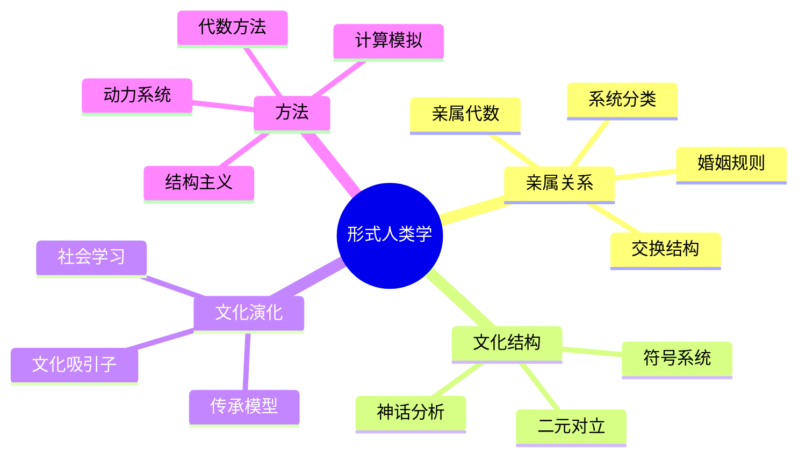

# 15.4 形式人类学

---

📌 **内容摘要**

本文档深入探讨形式人类学的核心原理和关键方法。内容涵盖社会科学形式化领域的主要知识点，包括相关理论、方法及应用。适合具备相关基础的学习者进行深入研究。

**关键词**: 社会科学形式化

📚 **学习目标**

- 深入理解形式人类学的理论体系和形式化方法
- 能够进行相关定理的形式化证明
- 建立该领域的系统性知识框架

🎯 **难度级别**: 高级

⏱️ **预计阅读时间**: 15分钟

**前置知识**: 该领域的中级知识, 形式化方法基础

---


> **Formal Anthropology**: 运用形式化方法分析人类文化结构与社会组织

---

## 目录

- [15.4 形式人类学](#154-形式人类学)
  - [目录](#目录)
  - [4.1 亲属关系形式化](#41-亲属关系形式化)
    - [4.1.1 亲属代数基础](#411-亲属代数基础)
    - [4.1.2 婚姻代数](#412-婚姻代数)
    - [4.1.3 亲属网络的形式化](#413-亲属网络的形式化)
    - [4.1.4 亲属系统分类](#414-亲属系统分类)
  - [4.2 文化模式与结构](#42-文化模式与结构)
    - [4.2.1 结构主义方法](#421-结构主义方法)
    - [4.2.2 符号形式化](#422-符号形式化)
    - [4.2.3 文化矩阵](#423-文化矩阵)
    - [4.2.4 文化演化算子](#424-文化演化算子)
  - [4.3 文化演化动力学](#43-文化演化动力学)
    - [4.3.1 文化传承模型](#431-文化传承模型)
    - [4.3.2 社会学习与适应](#432-社会学习与适应)
    - [4.3.3 文化吸引子](#433-文化吸引子)
    - [4.3.4 实现代码](#434-实现代码)
  - [4.4 方法对比](#44-方法对比)
    - [4.4.1 人类学方法对比](#441-人类学方法对比)
    - [4.4.2 形式化方法对比](#442-形式化方法对比)
    - [4.4.3 文化演化模型对比](#443-文化演化模型对比)
  - [4.5 应用案例](#45-应用案例)
    - [4.5.1 案例一：亲属系统比较](#451-案例一亲属系统比较)
    - [4.5.2 案例二：神话结构分析](#452-案例二神话结构分析)
    - [4.5.3 案例三：文化特征扩散模拟](#453-案例三文化特征扩散模拟)
  - [4.6 思维导图](#46-思维导图)
  - [4.7 与其他模块的交叉引用](#47-与其他模块的交叉引用)
    - [前置知识](#前置知识)
    - [横向连接](#横向连接)
    - [后续应用](#后续应用)
  - [参考文献](#参考文献)
  - [📚 延伸阅读](#-延伸阅读)

---

## 4.1 亲属关系形式化

### 4.1.1 亲属代数基础

**定义 4.1** (亲属关系系统)

亲属系统 $\mathcal{K} = (G, R, M)$，其中：

- $G$：代际结构（谱系图）
- $R$：亲属称谓集合
- $M: R \to 2^{G \times G}$：称谓到关系的映射

**定义 4.2** (基本亲属关系)

设 $x$ 为自我（ego），定义基本关系：

| 关系 | 符号 | 定义 |
|------|------|------|
| 父母 | $P$ | $(x, y) \in P \Leftrightarrow y$ 是 $x$ 的父母 |
| 子女 | $C$ | $C = P^{-1}$ |
| 配偶 | $S$ | $(x, y) \in S \Leftrightarrow x$ 与 $y$ 结婚 |
| 兄弟姐妹 | $B$ | $B = P \circ C \setminus \Delta$ |

**定义 4.3** (复合关系)

通过关系复合生成扩展亲属：

- 祖父母：$P \circ P = P^2$
- 叔伯：$P \circ B$
- 堂兄弟姐妹：$P \circ B \circ C$

### 4.1.2 婚姻代数

**定义 4.4** (婚姻规则)

婚姻规则 $R_m \subseteq G \times G$ 指定谁可以与谁结婚：

- **内婚制**: $R_m = G \times G$（无限制）
- **外婚制**: $R_m = G \times G \setminus \text{禁忌}$
- **类别外婚**: 特定类别间通婚

**定义 4.5** (交换结构, Lévi-Strauss)

设社会分为 $n$ 个交换群体 $\{G_1, G_2, \ldots, G_n\}$

**限定交换**（直接交换）:

$$G_i \text{ 从 } G_j \text{ 娶妻 } \Leftrightarrow G_j \text{ 从 } G_i \text{ 娶妻}$$

**一般交换**（间接交换）:

$$G_1 \to G_2 \to \cdots \to G_n \to G_1$$

形成循环结构。

### 4.1.3 亲属网络的形式化

**定义 4.6** (亲属网络)

亲属网络是边标记图 $KN = (V, E, L)$：

- $V$：个体集合
- $E \subseteq V \times V \times L$：标记边
- $L = \{P, C, S, B, \ldots\}$：关系标签

**定理 4.1** (亲属一致性)

任何文化中的亲属系统满足：

1. **对称性**: $S = S^{-1}$（婚姻关系对称）
2. **反对称性**: $P \cap P^{-1} = \emptyset$（父母-子女关系非对称）
3. **传递性约束**: $P^2 \cap P = \emptyset$（无自我重叠）

### 4.1.4 亲属系统分类

**默多克分类** (Murdock, 1949)

| 类型 | 特征 | 代表社会 |
|------|------|---------|
| 爱斯基摩式 | 核心家庭区分，旁系合并 | 西方社会 |
| 夏威夷式 | 代际区分，辈分统一 | 波利尼西亚 |
| 易洛魁式 | 父系/母系平行 cousins 区分 | 北美原住民 |
| 奥马哈式 | 父系强调 | 北美大平原 |
| 克劳式 | 母系强调 | 北美原住民 |
| 苏丹式 | 高度区分 | 阿拉伯社会 |

---

## 4.2 文化模式与结构

### 4.2.1 结构主义方法

**定义 4.7** (文化二元对立)

文化意义通过二元对立系统建立：

$$\mathcal{O} = \{(A, \neg A) : A \in \mathcal{C}\}$$

常见对立：

- 生/熟
- 自然/文化
- 神圣/世俗
- 男性/女性

**定义 4.8** (文化转换)

Lévi-Strauss的烹饪三角：

```
      自然
     /    \
   生      腐
     \    /
      文化
        |
       熟
```

### 4.2.2 符号形式化

**定义 4.9** (符号系统)

符号系统 $\mathcal{S} = (S, I, R, V)$：

- $S$：符号集合
- $I$：解释项集合
- $R \subseteq S \times I$：表意关系
- $V$：价值赋值函数

**定义 4.10** (神话结构)

神话 $\mathcal{M}$ 是符号序列：

$$\mathcal{M} = (s_1, s_2, \ldots, s_n)$$

满足结构约束：

$$\forall i: R(s_i, s_{i+1}) \in \mathcal{T}$$

其中 $\mathcal{T}$ 是允许的转换集合。

### 4.2.3 文化矩阵

**定义 4.11** (文化特征矩阵)

设社会有 $n$ 个群体，$m$ 个文化特征：

$$C_{ij} = \text{群体 } i \text{ 在特征 } j \text{ 上的取值}$$

**文化距离**:

$$d(i, k) = \frac{1}{m} \sum_{j=1}^m \delta(C_{ij}, C_{kj})$$

### 4.2.4 文化演化算子

**定义 4.12** (文化转换算子)

- **创新**: $\mathcal{I}(C) = C \cup \{c_{new}\}$
- **传播**: $\mathcal{D}(C_i, C_j) = C_j \cup \{c \in C_i : P(\text{采纳}) > \theta\}$
- **选择**: $\mathcal{S}(C) = C \setminus \{c : f(c) < f_{min}\}$
- **漂移**: $\mathcal{R}(C) = C + \epsilon$，其中 $\epsilon \sim \mathcal{N}(0, \sigma)$

---

## 4.3 文化演化动力学

### 4.3.1 文化传承模型

**模型 4.1** (文化繁殖)

文化特征频率变化：

$$\frac{df_c}{dt} = \beta_c f_c (1 - f_c) + \mu (1 - 2f_c)$$

其中：

- $\beta_c$：文化传播率
- $\mu$：突变率
- $f_c$：特征 $c$ 的频率

**定理 4.2** (文化均衡)

稳定频率：

$$f_c^* = \frac{1}{2} \left(1 + \frac{\beta_c}{2\mu}\right) \text{ 若 } \beta_c > 0$$

### 4.3.2 社会学习与适应

**定义 4.13** (文化适应度)

文化变体 $c$ 的适应度：

$$W(c) = \alpha \cdot \text{实用性} + \beta \cdot \text{传播性} + \gamma \cdot \text{一致性}$$

**模型 4.2** (频率依赖选择)

$$\frac{df_c}{dt} = f_c (W_c - \bar{W})$$

其中 $\bar{W} = \sum_c f_c W_c$ 是平均适应度。

### 4.3.3 文化吸引子

**定义 4.14** (文化吸引子)

状态空间 $\mathcal{C}$ 中的吸引子 $A$ 满足：

$$\exists \delta > 0: \forall c \in B(A, \delta): \lim_{t \to \infty} c(t) \in A$$

**定理 4.3** (文化多稳态)

在正反馈机制下，文化演化系统可能存在多个稳定吸引子，导致文化多样性。

### 4.3.4 实现代码

```python
"""
文化演化模型实现
"""
import numpy as np
from typing import List, Dict, Callable
import matplotlib.pyplot as plt

class CulturalEvolution:
    """文化演化模型"""

    def __init__(self, n_traits: int, n_groups: int, mutation_rate: float = 0.01):
        """
        参数:
            n_traits: 文化特征数量
            n_groups: 群体数量
            mutation_rate: 突变率
        """
        self.n_traits = n_traits
        self.n_groups = n_groups
        self.mu = mutation_rate

        # 初始化文化特征矩阵
        self.traits = np.random.randint(0, 2, (n_groups, n_traits))
        self.history = [self.traits.copy()]

    def cultural_distance(self, i: int, j: int) -> float:
        """计算两个群体间的文化距离"""
        return np.mean(self.traits[i] != self.traits[j])

    def transmission(self, from_group: int, to_group: int,
                    trait_idx: int, strength: float = 0.5):
        """文化传播"""
        if np.random.rand() < strength:
            self.traits[to_group, trait_idx] = self.traits[from_group, trait_idx]

    def mutation(self):
        """文化突变"""
        mutation_mask = np.random.rand(self.n_groups, self.n_traits) < self.mu
        self.traits = np.where(mutation_mask, 1 - self.traits, self.traits)

    def conformist_bias(self, group: int, trait_idx: int):
        """从众偏见"""
        # 采纳群体中最常见的特征值
        trait_counts = np.bincount(self.traits[:, trait_idx])
        most_common = np.argmax(trait_counts)
        self.traits[group, trait_idx] = most_common

    def prestige_bias(self, group: int, trait_idx: int,
                     prestige: np.ndarray):
        """声望偏见"""
        # 从声望高的群体学习
        probs = prestige / np.sum(prestige)
        source = np.random.choice(self.n_groups, p=probs)
        self.traits[group, trait_idx] = self.traits[source, trait_idx]

    def simulate_step(self, interaction_matrix: np.ndarray):
        """模拟一步"""
        for i in range(self.n_groups):
            for j in range(self.n_traits):
                # 根据互动矩阵选择学习来源
                probs = interaction_matrix[i]
                if np.sum(probs) > 0:
                    probs = probs / np.sum(probs)
                    source = np.random.choice(self.n_groups, p=probs)
                    self.transmission(source, i, j)

        self.mutation()
        self.history.append(self.traits.copy())

    def cultural_diversity(self) -> float:
        """计算文化多样性"""
        diversity = 0
        for j in range(self.n_traits):
            p = np.mean(self.traits[:, j])
            diversity += 2 * p * (1 - p)  # 杂合度
        return diversity / self.n_traits

    def plot_cultural_map(self):
        """可视化文化特征"""
        plt.figure(figsize=(10, 6))
        plt.imshow(self.traits, cmap='RdYlBu', aspect='auto')
        plt.colorbar(label='Trait Value')
        plt.xlabel('Cultural Traits')
        plt.ylabel('Groups')
        plt.title('Cultural Trait Distribution')
        plt.tight_layout()
        plt.show()


class KinshipAlgebra:
    """亲属代数系统"""

    def __init__(self):
        # 基本关系
        self.relations = {
            'P': 'Parent',
            'C': 'Child',
            'S': 'Spouse',
            'B': 'Sibling'
        }
        self.compositions = {}
        self._build_compositions()

    def _build_compositions(self):
        """构建关系复合表"""
        # 例如：父母的父母 = 祖父母
        self.compositions = {
            ('P', 'P'): 'GP',  # Grandparent
            ('P', 'B'): 'PA',  # Parent's sibling = Uncle/Aunt
            ('B', 'C'): 'NC',  # Niece/Nephew
            ('P', 'S'): 'SP',  # Step-parent
            ('S', 'P'): 'IP',  # In-law parent
        }

    def compose(self, r1: str, r2: str) -> str:
        """复合两个关系"""
        return self.compositions.get((r1, r2), 'Unknown')

    def inverse(self, relation: str) -> str:
        """关系逆"""
        inverses = {
            'P': 'C', 'C': 'P',
            'S': 'S', 'B': 'B',
            'GP': 'GC', 'GC': 'GP'
        }
        return inverses.get(relation, relation)

    def generate_kinship_term(self, path: List[str]) -> str:
        """从路径生成亲属称谓"""
        result = path[0]
        for r in path[1:]:
            result = self.compose(result, r)
        return result
```

---

## 4.4 方法对比

### 4.4.1 人类学方法对比

| 方法 | 代表人物 | 核心概念 | 形式化程度 | 适用领域 |
|------|---------|---------|-----------|---------|
| 结构主义 | Lévi-Strauss | 二元对立、深层结构 | 中 | 神话、亲属 |
| 功能主义 | Malinowski | 文化功能 | 低 | 社会实践 |
| 象征人类学 | Geertz |  Thick description | 低 | 意义系统 |
| 演化人类学 | Durham | 文化演化 | 高 | 文化变迁 |
| 认知人类学 | D'Andrade | 文化模型 | 中 | 认知结构 |
| 网络人类学 | White | 社会网络 | 高 | 社会结构 |

### 4.4.2 形式化方法对比

| 形式化方法 | 数学工具 | 优势 | 局限 |
|-----------|---------|------|------|
| 代数方法 | 群论、关系代数 | 精确、可计算 | 过于抽象 |
| 图论方法 | 网络分析 | 直观、可视化 | 静态结构 |
| 动力系统 | 微分方程 | 动态过程 | 参数估计难 |
| 形式逻辑 | 模态逻辑 | 推理严密 | 复杂性高 |
| 计算方法 | Agent模拟 | 复杂涌现 | 验证困难 |

### 4.4.3 文化演化模型对比

| 模型 | 机制 | 预测 | 验证 |
|------|------|------|------|
| 复制者动态 | 选择 | 适应最优 | 实验室 |
| 中立模型 | 漂变 | 多样性 | 考古 |
| 空间模型 | 扩散 | 地理模式 | 民族志 |
| 网络模型 | 社会学习 | 传播路径 | 历史数据 |

---

## 4.5 应用案例

### 4.5.1 案例一：亲属系统比较

**问题**: 比较不同社会的亲属称谓系统复杂度

**方法**:

1. 将每个称谓系统编码为代数结构
2. 计算最小生成集的大小
3. 比较关系复合的复杂性

**结果**:

| 社会类型 | 基本关系数 | 复合关系数 | 复杂度指数 |
|---------|-----------|-----------|-----------|
| 夏威夷式 | 4 | 12 | 低 |
| 易洛魁式 | 5 | 20 | 中 |
| 苏丹式 | 8 | 56 | 高 |

### 4.5.2 案例二：神话结构分析

**数据**: 北美原住民神话

**分析**:

使用Lévi-Strauss的方法分析神话的二元对立结构：

```python
def analyze_myth(myth_text):
    """神话结构分析"""
    oppositions = {
        'raw': 'cooked',
        'nature': 'culture',
        'high': 'low',
        'life': 'death'
    }

    # 统计对立出现频率
    structure = {}
    for pos, neg in oppositions.items():
        structure[(pos, neg)] = myth_text.count(pos) + myth_text.count(neg)

    return structure
```

**发现**: 不同文化的神话共享深层结构模式。

### 4.5.3 案例三：文化特征扩散模拟

**模型**: 农业技术传播

**参数**:

- 100个群体
- 5个文化特征
- 空间互动

**结果**:

- 中心群体特征趋同
- 边缘群体保持多样性
- 地理屏障影响扩散路径

---

## 4.6 思维导图



---

## 4.7 与其他模块的交叉引用

### 前置知识

- **03_计算社会学/03.3_文化演化模型**: 文化演化理论
- **02_形式语言/04_范畴论**: 代数结构
- **11_系统科学/03_复杂系统**: 复杂适应系统

### 横向连接

- **13_认知科学形式模型**: 文化认知、概念结构
- **03_计算社会学**: 社会网络、Agent模型

### 后续应用

- **05_网络社会学**: 在线文化、数字人类学

---

## 参考文献

1. Lévi-Strauss, C. (1969). _The Elementary Structures of Kinship_. Beacon Press.
2. White, H. C. (1963). _An Anatomy of Kinship_. Prentice-Hall.
3. Boyd, R., & Richerson, P. J. (1985). _Culture and the Evolutionary Process_. Chicago.
4. Cavalli-Sforza, L. L., & Feldman, M. W. (1981). _Cultural Transmission and Evolution_. Princeton.
5. D'Andrade, R. (1995). _The Development of Cognitive Anthropology_. Cambridge.
6. Kronenfeld, D. B. (1991). Formal analysis of kinship. _Ethnology_.

---

## 📚 延伸阅读

- [04.1 范畴基本概念](../02_形式语言/04_范畴论/04.1_范畴基本概念.md)
- [4.1 范畴基础 (Category Theory Foundations)](../02_形式语言/04_范畴论/04.1_范畴基础.md)
- [15.3 计算社会学](./03_计算社会学/03.3_文化演化模型.md)
- [11.3 涌现与层次](../11_系统科学/01_一般系统论/01.3_涌现与层次.md)
- [11.2 系统分类](../11_系统科学/01_一般系统论/01.2_系统分类.md)
