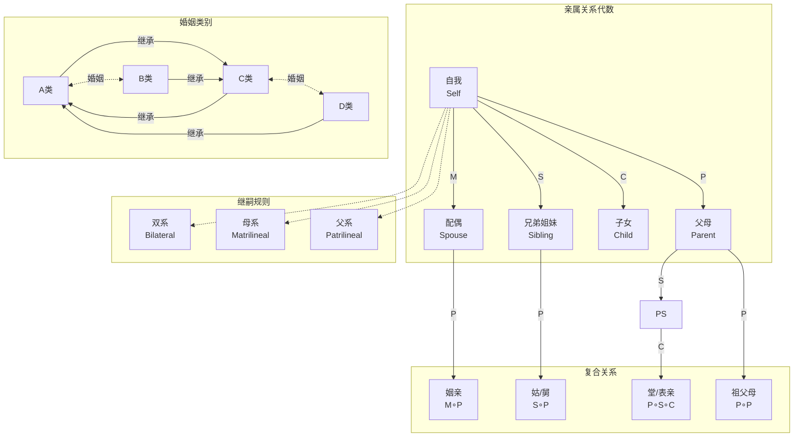

# 15.4 形式人类学

---

📌 **内容摘要**

本文档深入探讨形式人类学的核心原理和关键方法。内容涵盖形式人类学领域的主要知识点，包括相关理论、方法及应用。适合具备相关基础的学习者进行深入研究。

**关键词**: 形式人类学

📚 **学习目标**

- 深入理解形式人类学的理论体系和形式化方法
- 能够进行相关定理的形式化证明
- 建立该领域的系统性知识框架

🎯 **难度级别**: 高级

⏱️ **预计阅读时间**: 15分钟

**前置知识**: 该领域的中级知识, 形式化方法基础

---


## 15.4.1 亲属关系形式化

### 概述

亲属关系形式化是人类学中最早进行数学化的领域之一。
Claude Lévi-Strauss的结构人类学和Harrison White的代数方法为理解婚姻规则、宗族结构提供了形式化工具。
亲属代数通过群论和关系代数描述婚姻制度、世系规则和社会分类。

**参考文献**: Lévi-Strauss (1949), White (1963), Kronenfeld (2013)

---

## 15.4.1.1 亲属关系代数

### 基本关系

**定义 15.4.1** (基本亲属关系)

设个体 $x$ 的基本亲属关系：

| 符号 | 关系 | 代数性质 |
|------|------|----------|
| $P$ | 父母 | $P^{-1} = C$（子女） |
| $C$ | 子女 | $C^{-1} = P$ |
| $S$ | 兄弟姐妹 | $S = S^{-1}$（对称） |
| $M$ | 配偶 | $M = M^{-1}$（对称） |

**定义 15.4.2** (复合关系)

亲属关系通过关系复合生成：

$$R \circ S = \{(x, z) : \exists y, (x, y) \in R \land (y, z) \in S\}$$

**示例**:

- $P \circ P = GP$（祖父母）
- $P \circ S = Z$（姑/姨）
- $M \circ P = IL$（姻亲）

---

### 词位代数

**定义 15.4.3** (词位, Kinterm)

词位是文化上定义的亲属类别，映射到生物学关系：

$$K: \mathcal{B} \to \mathcal{C}$$

其中 $\mathcal{B}$ 为生物学关系集合，$\mathcal{C}$ 为词位类别。

**示例** (易洛魁系统):

| 词位 | 父方 | 母方 |
|------|------|------|
| 父亲 | F | FB（父之兄弟）|
| 母亲 | M | MZ（母之姐妹）|
| 叔/舅 | FB | MB |
| 姑/姨 | FZ | MZ |

---

## 15.4.1.2 婚姻代数

### 婚姻类别系统

**定义 15.4.4** (婚姻类别)

社会将人口划分为互斥的婚姻类别（sections），婚姻只能在类别间发生。

**示例**: 四类别系统 (Kariera)

| 类别 | 男性 | 女性 | 婚姻规则 |
|------|------|------|----------|
| A | $A_m$ | $A_f$ | $A_m \to B_f$ |
| B | $B_m$ | $B_f$ | $B_m \to A_f$ |
| C | $C_m$ | $C_f$ | $C_m \to D_f$ |
| D | $D_m$ | $D_f$ | $D_m \to C_f$ |

**继承规则**: 子女属于父母的对角类别

---

### 代数结构

**定义 15.4.5** (婚姻代数, White 1963)

婚姻代数是半群 $(\mathcal{R}, \circ)$，其中 $\mathcal{R}$ 为关系集合。

**运算**: 关系复合生成结构

$$\mathcal{R} = \langle P, S, M \rangle$$

**定理 15.4.1** (婚姻代数封闭性)

在婚姻类别系统中，亲属关系代数是有限的（封闭于有限集合）。

---

## 15.4.1.3 宗族与继嗣

### 继嗣规则

**定义 15.4.6** (继嗣群体)

继嗣群体 $\mathcal{D}$ 通过以下规则定义：

- **父系** (Patrilineal): $x \in \mathcal{D}(y) \Leftrightarrow x = y \lor P_m(x) \in \mathcal{D}(y)$
- **母系** (Matrilineal): $x \in \mathcal{D}(y) \Leftrightarrow x = y \lor P_f(x) \in \mathcal{D}(y)$
- **双系** (Bilateral): 结合父母双方

---

### 宗族结构

**定义 15.4.7** (宗族树)

宗族是有根树 $T = (V, E)$，其中：

- 根节点：宗族始祖
- 边：父子关系
- 深度：代际距离

**定义 15.4.8** (宗族裂变)

宗族分裂遵循：

$$\text{裂变深度} d = \frac{\log N}{\log b}$$

其中 $N$ 为人口，$b$ 为分支因子。

---

## 15.4.1.4 交换理论

### 联姻理论

**定义 15.4.9** (婚姻交换)

婚姻交换是群体间女人的流动：

$$G_A \xrightarrow{\text{给}} G_B \xrightarrow{\text{给}} G_C \cdots$$

**定义 15.4.10** (交换类型)

| 类型 | 结构 | 代数特征 |
|------|------|----------|
| 限制性交换 | 直接交换 $A \leftrightarrow B$ | 二周期 |
| 广义交换 | 延迟交换 $A \to B \to C \to A$ | 三周期或更长 |
| 一般交换 | 网络结构 | 复杂图 |

**定理 15.4.2** (Lévi-Strauss, 1949)

限制性交换产生对立群体；广义交换产生等级。

---

## 15.4.1.5 计算模型

### 算法实现

```python
"""
亲属关系形式化
亲属代数、婚姻类别、继嗣群体的计算实现
"""

import numpy as np
from typing import Dict, List, Set, Tuple, Optional
from collections import defaultdict
import matplotlib.pyplot as plt
import networkx as nx

class KinshipAlgebra:
    """
    亲属关系代数

    基于关系复合的亲属计算
    """

    # 基本关系
    PARENT = 'P'
    CHILD = 'C'
    SIBLING = 'S'
    SPOUSE = 'M'

    def __init__(self):
        # 关系逆元
        self.inverse = {
            self.PARENT: self.CHILD,
            self.CHILD: self.PARENT,
            self.SIBLING: self.SIBLING,
            self.SPOUSE: self.SPOUSE
        }

        # 简化规则
        self.simplification_rules = {
            # P ∘ C = S (父母的孩子 = 兄弟姐妹或自己)
            (self.PARENT, self.CHILD): self.SIBLING,
            # C ∘ P = S (孩子的父母 = 兄弟姐妹或自己)
            (self.CHILD, self.PARENT): self.SIBLING,
            # S ∘ S = S (兄弟姐妹的兄弟姐妹 = 兄弟姐妹或自己)
            (self.SIBLING, self.SIBLING): self.SIBLING,
            # M ∘ M = I (配偶的配偶 = 自己)
            (self.SPOUSE, self.SPOUSE): None,
            # P ∘ S = P (兄弟姐妹的父母 = 父母)
            (self.PARENT, self.SIBLING): self.PARENT,
            # S ∘ P = P (父母的兄弟姐妹 = 姑/舅/姨)
            (self.SIBLING, self.PARENT): 'A',  # Aunt/Uncle
        }

    def compose(self, rel1: str, rel2: str) -> Optional[str]:
        """
        关系复合: rel1 ∘ rel2

        先应用rel2，再应用rel1
        """
        # 检查简化规则
        if (rel1, rel2) in self.simplification_rules:
            return self.simplification_rules[(rel1, rel2)]

        # 默认：连接关系
        return f"{rel1}{rel2}"

    def inverse_rel(self, rel: str) -> str:
        """计算关系的逆"""
        if rel in self.inverse:
            return self.inverse[rel]
        return f"{rel}^-1"

    def compute_path(self, path: List[str]) -> str:
        """
        计算关系路径的结果

        例如: ['P', 'S', 'C'] = 父母的兄弟姐妹的孩子 = 堂/表兄弟姐妹
        """
        if len(path) == 0:
            return 'Self'

        result = path[0]
        for rel in path[1:]:
            result = self.compose(result, rel)
            if result is None:
                return 'Undefined'

        return result

    def kinship_distance(self, path1: List[str], path2: List[str]) -> int:
        """
        计算两个关系路径的亲属距离

        简化为路径长度之和
        """
        return len(path1) + len(path2)


class MarriageClassSystem:
    """
    婚姻类别系统

    Kariera式四类别系统示例
    """

    def __init__(self):
        """
        四类别系统:
        A_m, A_f, B_m, B_f, C_m, C_f, D_m, D_f

        婚姻规则:
        - A_m 娶 B_f
        - B_m 娶 A_f
        - C_m 娶 D_f
        - D_m 娶 C_f

        继承:
        - A父 + B母 → C子女
        - B父 + A母 → D子女
        - C父 + D母 → A子女
        - D父 + C母 → B子女
        """
        self.classes = ['A', 'B', 'C', 'D']
        self.genders = ['m', 'f']

        # 婚姻规则: 丈夫类别 → 妻子类别
        self.marriage_rules = {
            'A': 'B',
            'B': 'A',
            'C': 'D',
            'D': 'C'
        }

        # 继承规则: (父类, 母类) → 子女类
        self.inheritance = {
            ('A', 'B'): 'C',
            ('B', 'A'): 'D',
            ('C', 'D'): 'A',
            ('D', 'C'): 'B'
        }

    def get_spouse_class(self, ego_class: str, ego_gender: str) -> str:
        """
        获取配偶类别

        若ego为男性，根据marriage_rules
        若ego为女性，反向查找
        """
        if ego_gender == 'm':
            return self.marriage_rules[ego_class]
        else:
            for husband, wife in self.marriage_rules.items():
                if wife == ego_class:
                    return husband
        return None

    def get_child_class(self, father_class: str, mother_class: str) -> str:
        """获取子女类别"""
        return self.inheritance.get((father_class, mother_class))

    def get_relative_class(self, ego_class: str, ego_gender: str,
                          relation: str) -> List[Tuple[str, str]]:
        """
        获取亲属的类别

        relation: 'F'(父), 'M'(母), 'S'(配偶), 'C'(子女), 'B'(兄弟), 'Z'(姐妹)
        """
        results = []

        if relation == 'S':  # 配偶
            spouse = self.get_spouse_class(ego_class, ego_gender)
            spouse_gender = 'f' if ego_gender == 'm' else 'm'
            results.append((spouse, spouse_gender))

        elif relation == 'F':  # 父亲
            # 需要知道配偶类别来推断
            for (f, m), child in self.inheritance.items():
                if child == ego_class:
                    results.append((f, 'm'))

        elif relation == 'M':  # 母亲
            for (f, m), child in self.inheritance.items():
                if child == ego_class:
                    results.append((m, 'f'))

        elif relation == 'C':  # 子女
            if ego_gender == 'm':
                # 男性视角
                spouse = self.get_spouse_class(ego_class, 'm')
                child = self.get_child_class(ego_class, spouse)
                results.append((child, 'm'))
                results.append((child, 'f'))
            else:
                # 女性视角
                spouse = self.get_spouse_class(ego_class, 'f')
                child = self.get_child_class(spouse, ego_class)
                results.append((child, 'm'))
                results.append((child, 'f'))

        # 去重
        return list(set(results))

    def generate_kinship_network(self, generations: int = 3) -> nx.DiGraph:
        """生成亲属关系网络"""
        G = nx.DiGraph()

        # 从始祖开始
        for gen in range(generations):
            for cls in self.classes:
                for gender in self.genders:
                    node = f"{cls}_{gender}_G{gen}"
                    G.add_node(node, class_=cls, gender=gender, gen=gen)

                    if gen > 0:
                        # 连接到父母
                        # 简化：为每个节点添加父母边
                        parents = self._find_parents(cls, gender)
                        for p_cls, p_gender in parents:
                            parent_node = f"{p_cls}_{p_gender}_G{gen-1}"
                            G.add_edge(parent_node, node, relation='parent')

        return G

    def _find_parents(self, child_class: str, child_gender: str) -> List[Tuple[str, str]]:
        """查找可能的父母类别组合"""
        parents = []
        for (f, m), c in self.inheritance.items():
            if c == child_class:
                parents.append((f, 'm'))
                parents.append((m, 'f'))
        return parents

    def visualize(self, ax=None):
        """可视化婚姻类别系统"""
        if ax is None:
            fig, ax = plt.subplots(figsize=(10, 8))

        # 绘制四类别结构
        pos = {
            'A_m': (0, 2), 'A_f': (0.5, 2),
            'B_m': (2, 2), 'B_f': (2.5, 2),
            'C_m': (0, 0), 'C_f': (0.5, 0),
            'D_m': (2, 0), 'D_f': (2.5, 0)
        }

        # 绘制节点
        for node, (x, y) in pos.items():
            cls, gender = node.split('_')
            color = 'lightblue' if gender == 'm' else 'lightpink'
            ax.scatter([x], [y], s=1000, c=color, edgecolors='black', zorder=3)
            ax.text(x, y, f"{cls}\n({gender})", ha='center', va='center', fontsize=10)

        # 绘制婚姻关系
        ax.annotate('', xy=(2, 2), xytext=(0.5, 2),
                   arrowprops=dict(arrowstyle='<->', color='red', lw=2))
        ax.annotate('', xy=(2, 0), xytext=(0.5, 0),
                   arrowprops=dict(arrowstyle='<->', color='red', lw=2))

        # 绘制继承关系
        ax.annotate('', xy=(0.25, 0), xytext=(0.25, 1.8),
                   arrowprops=dict(arrowstyle='->', color='blue', lw=1.5))
        ax.annotate('', xy=(2.25, 0), xytext=(2.25, 1.8),
                   arrowprops=dict(arrowstyle='->', color='blue', lw=1.5))

        ax.set_xlim(-0.5, 3)
        ax.set_ylim(-0.5, 2.5)
        ax.set_title('Kariera四类别系统\n红=婚姻, 蓝=继承', fontsize=12)
        ax.axis('off')

        return ax


class DescentGroup:
    """
    继嗣群体模型

    父系、母系、双系继嗣
    """

    PATRILINEAL = 'patri'
    MATRILINEAL = 'matri'
    BILATERAL = 'bilateral'

    def __init__(self, descent_type: str, founder_id: int = 0):
        """
        参数:
            descent_type: 继嗣类型
            founder_id: 创始人ID
        """
        self.type = descent_type
        self.founder = founder_id

        # 家族树
        self.tree = nx.DiGraph()
        self.tree.add_node(founder_id, gen=0, gender='m')

        # 代际追踪
        self.generations = {0: [founder_id]}
        self.next_id = founder_id + 1

    def add_child(self, parent_id: int, gender: str = 'm') -> int:
        """添加子女"""
        child_id = self.next_id
        self.next_id += 1

        parent_gen = self.tree.nodes[parent_id]['gen']
        self.tree.add_node(child_id, gen=parent_gen + 1, gender=gender)
        self.tree.add_edge(parent_id, child_id, relation='parent')

        if parent_gen + 1 not in self.generations:
            self.generations[parent_gen + 1] = []
        self.generations[parent_gen + 1].append(child_id)

        return child_id

    def get_lineage(self, ego_id: int) -> List[int]:
        """
        获取世系

        根据继嗣类型返回相应的祖先链
        """
        lineage = [ego_id]
        current = ego_id

        while True:
            parents = list(self.tree.predecessors(current))
            if len(parents) == 0:
                break

            if self.type == self.PATRILINEAL:
                # 选男性祖先
                parent = next((p for p in parents if self.tree.nodes[p]['gender'] == 'm'), parents[0])
            elif self.type == self.MATRILINEAL:
                # 选女性祖先
                parent = next((p for p in parents if self.tree.nodes[p]['gender'] == 'f'), parents[0])
            else:
                # 双系：都包括
                parent = parents[0]

            lineage.append(parent)
            current = parent

        return lineage

    def get_clan_members(self, clan_ancestor: int) -> Set[int]:
        """获取宗族成员"""
        # 找到所有后代
        descendants = nx.descendants(self.tree, clan_ancestor)
        return descendants | {clan_ancestor}

    def fission_threshold(self, max_depth: int = 5) -> int:
        """
        计算裂变阈值

        宗族在何时分裂
        """
        return len(self.generations.get(max_depth, []))

    def visualize(self, ax=None, max_gen: int = 4):
        """可视化宗族树"""
        if ax is None:
            fig, ax = plt.subplots(figsize=(12, 8))

        # 分层布局
        pos = {}
        for node in self.tree.nodes():
            gen = self.tree.nodes[node]['gen']
            if gen <= max_gen:
                # 简化的水平布局
                gen_nodes = [n for n in self.tree.nodes()
                           if self.tree.nodes[n]['gen'] == gen and n <= max_gen * 10]
                if node in gen_nodes:
                    idx = gen_nodes.index(node) if node in gen_nodes else 0
                    x = idx - len(gen_nodes) / 2
                    y = -gen
                    pos[node] = (x, y)

        # 绘制
        node_colors = ['lightblue' if self.tree.nodes[n]['gender'] == 'm' else 'lightpink'
                      for n in pos.keys()]

        nx.draw_networkx_nodes(self.tree.subgraph(pos.keys()), pos,
                              node_color=node_colors, node_size=500, ax=ax)
        nx.draw_networkx_edges(self.tree.subgraph(pos.keys()), pos, ax=ax, arrows=True)
        nx.draw_networkx_labels(self.tree.subgraph(pos.keys()), pos, ax=ax, font_size=8)

        ax.set_title(f'{self.type}继嗣群体结构', fontsize=12)
        ax.axis('off')

        return ax


# ==================== 演示 ====================
if __name__ == "__main__":
    print("=" * 70)
    print("亲属关系形式化")
    print("=" * 70)

    # 1. 亲属代数
    print("\n【亲属关系代数】")

    kin = KinshipAlgebra()

    # 计算亲属路径
    paths = {
        '祖父母': ['P', 'P'],
        '叔伯': ['P', 'S'],
        '堂兄弟': ['P', 'S', 'C'],
        '外甥': ['S', 'C'],
        '连襟': ['S', 'M'],
    }

    print("\n关系路径计算:")
    for name, path in paths.items():
        result = kin.compute_path(path)
        print(f"  {name} ({'∘'.join(path)}): {result}")

    # 2. 婚姻类别系统
    print("\n【Kariera四类别婚姻系统】")

    kariera = MarriageClassSystem()

    print("\n婚姻规则:")
    for husband, wife in kariera.marriage_rules.items():
        print(f"  {husband}_m 娶 {wife}_f")

    print("\n继承规则:")
    for (father, mother), child in kariera.inheritance.items():
        print(f"  {father}父 + {mother}母 → {child}子女")

    print("\n亲属类别预测:")
    ego = ('A', 'm')
    print(f"  ego: {ego[0]}_{ego[1]}")

    spouse = kariera.get_spouse_class(*ego)
    print(f"  配偶: {spouse}_f")

    children = kariera.get_relative_class(*ego, 'C')
    print(f"  子女: {children}")

    # 3. 继嗣群体
    print("\n【继嗣群体分析】")

    for descent_type in ['patri', 'matri']:
        group = DescentGroup(descent_type)

        # 构建三代家族
        founder = group.founder
        c1 = group.add_child(founder, 'm')
        c2 = group.add_child(founder, 'f')
        c3 = group.add_child(founder, 'm')

        gc1 = group.add_child(c1, 'm')
        gc2 = group.add_child(c1, 'f')
        gc3 = group.add_child(c2, 'm')

        print(f"\n{descent_type}继嗣:")
        for person in [gc1, gc2, gc3]:
            lineage = group.get_lineage(person)
            print(f"  个体{person}的世系: {lineage}")

    # 4. 可视化
    fig, axes = plt.subplots(2, 2, figsize=(14, 12))

    # 图1: 婚姻类别系统
    ax1 = axes[0, 0]
    kariera.visualize(ax1)

    # 图2: 父系继嗣
    ax2 = axes[0, 1]
    patri_group = DescentGroup('patri')
    founder = patri_group.founder
    for _ in range(3):
        c = patri_group.add_child(founder, 'm')
        for _ in range(2):
            patri_group.add_child(c, np.random.choice(['m', 'f']))
    patri_group.visualize(ax2, max_gen=2)
    ax2.set_title('父系继嗣群体', fontsize=12)

    # 图3: 亲属代数结构
    ax3 = axes[1, 0]

    # 绘制关系图
    rel_graph = nx.DiGraph()
    relations = ['Self', 'P', 'C', 'S', 'M', 'PP', 'PC', 'PS', 'SC', 'MC']
    for r in relations:
        rel_graph.add_node(r)

    # 添加边
    edges = [('Self', 'P'), ('P', 'PP'), ('Self', 'S'), ('Self', 'M'),
             ('Self', 'C'), ('P', 'PS'), ('S', 'SC'), ('M', 'MC')]
    for e in edges:
        if e[0] in relations and e[1] in relations:
            rel_graph.add_edge(e[0], e[1])

    pos = nx.spring_layout(rel_graph, seed=42)
    nx.draw(rel_graph, pos, ax=ax3, with_labels=True, node_color='lightgreen',
           node_size=1000, font_size=9, arrows=True)
    ax3.set_title('亲属关系代数结构', fontsize=12)

    # 图4: 世系深度分析
    ax4 = axes[1, 1]

    depths = range(1, 8)
    patri_sizes = [2**d for d in depths]
    matri_sizes = [2**d for d in depths]

    ax4.plot(depths, patri_sizes, 'o-', label='父系', linewidth=2)
    ax4.plot(depths, matri_sizes, 's-', label='母系', linewidth=2)
    ax4.set_xlabel('世系深度')
    ax4.set_ylabel('潜在成员数')
    ax4.set_title('继嗣群体规模随深度增长')
    ax4.set_yscale('log')
    ax4.legend()
    ax4.grid(True, alpha=0.3)

    plt.tight_layout()
    plt.savefig('kinship_formalization.png', dpi=150, bbox_inches='tight')
    plt.show()
    print("\n图形已保存至 kinship_formalization.png")
```

---

### 亲属关系代数图



---

## 15.4.1.6 结构人类学

### 深层结构

**定义 15.4.11** (Lévi-Strauss结构)

文化现象的表面多样性源于有限的深层结构：

$$\text{表面现象} = f(\text{深层结构}, \text{历史条件})$$

**二元对立**: 文化意义通过对立产生

- 生/熟
- 自然/文化
- 男/女
- 天/地

---

## 参考文献

1. Lévi-Strauss, C. (1949). _Les Structures Élémentaires de la Parenté_.
2. White, H. C. (1963). _An Anatomy of Kinship_. Prentice-Hall.
3. Kronenfeld, D. B. (2013). _Fanti Kinship and the Analysis of Kinship Terminologies_.
4. Buchler, I. R., & Selby, H. A. (1968). _A Formal Study of Myth_.
5. Fox, R. (1967). _Kinship and Marriage_. Penguin.

---

## 📚 延伸阅读

- [2.1 群论基础](../../01_数学基础/02_代数学/02.1_群论基础.md)
- [15.4 形式人类学](../04_形式人类学.md)
