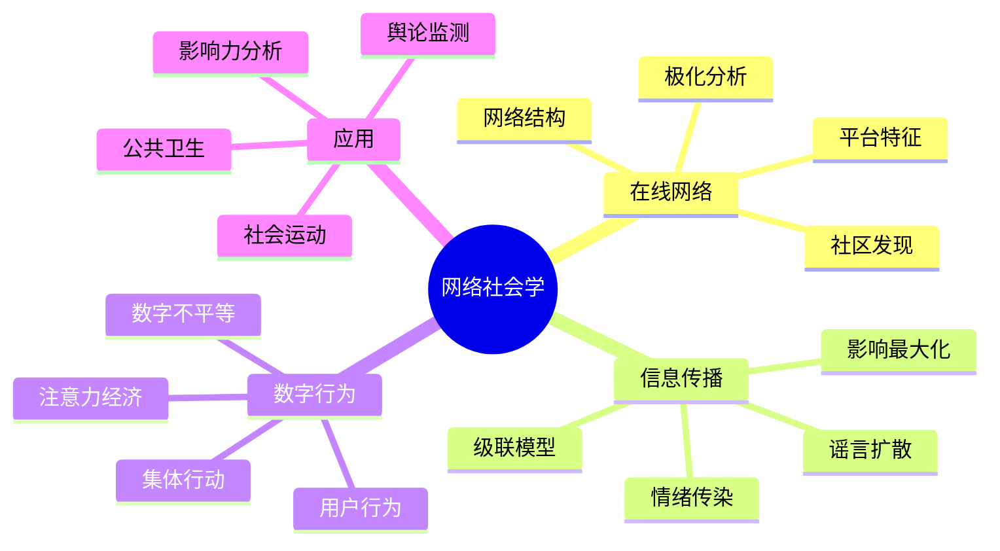

# 15.5 网络社会学

> **Network Sociology**: 研究数字时代的社会结构与在线行为模式

---

## 目录

- [15.5 网络社会学](#155-网络社会学)
  - [目录](#目录)
  - [5.1 在线社会网络](#51-在线社会网络)
    - [5.1.1 在线网络特征](#511-在线网络特征)
    - [5.1.2 网络度量与在线特征](#512-网络度量与在线特征)
    - [5.1.3 社区与极化](#513-社区与极化)
    - [5.1.4 网络演化](#514-网络演化)
  - [5.2 信息传播动力学](#52-信息传播动力学)
    - [5.2.1 级联模型](#521-级联模型)
    - [5.2.2 谣言与虚假信息](#522-谣言与虚假信息)
    - [5.2.3 情绪传播](#523-情绪传播)
    - [5.2.4 传播模拟实现](#524-传播模拟实现)
  - [5.3 数字社会行为](#53-数字社会行为)
    - [5.3.1 用户行为模型](#531-用户行为模型)
    - [5.3.2 集体行为](#532-集体行为)
    - [5.3.3 数字不平等](#533-数字不平等)
  - [5.4 方法对比](#54-方法对比)
    - [5.4.1 在线网络分析方法对比](#541-在线网络分析方法对比)
    - [5.4.2 传播模型对比](#542-传播模型对比)
    - [5.4.3 行为分析方法对比](#543-行为分析方法对比)
  - [5.5 应用案例](#55-应用案例)
    - [5.5.1 案例一：社交媒体影响力分析](#551-案例一社交媒体影响力分析)
    - [5.5.2 案例二：谣言传播控制](#552-案例二谣言传播控制)
    - [5.5.3 案例三：社会运动预测](#553-案例三社会运动预测)
  - [5.6 思维导图](#56-思维导图)
  - [5.7 与其他模块的交叉引用](#57-与其他模块的交叉引用)
    - [前置知识](#前置知识)
    - [横向连接](#横向连接)
    - [后续应用](#后续应用)
  - [参考文献](#参考文献)

---

## 5.1 在线社会网络

### 5.1.1 在线网络特征

**定义 5.1** (在线社会网络)

在线社会网络 $G_{online} = (V, E, A, T)$：

- $V$：用户节点
- $E$：连接关系（关注、好友）
- $A$：用户属性向量
- $T = \{t_e\}$：时间戳集合

**定义 5.2** (网络类型)

| 平台类型 | 网络结构 | 核心特征 |
|---------|---------|---------|
| SNS (Facebook) | 无向、加权 | 互惠好友关系 |
| Twitter/X | 有向 | 非对称关注 |
| LinkedIn | 有向、二分 | 职业网络 |
| Reddit | 超图 | 社区订阅 |
| 即时通讯 | 动态、多重 | 实时交互 |

### 5.1.2 网络度量与在线特征

**定义 5.3** (在线中心性度量)

| 度量 | 公式 | 解释 |
|------|------|------|
| 粉丝比 | $r_i = k_i^{in} / k_i^{out}$ | 影响力不对称性 |
| 活跃度 | $a_i = \frac{\text{发帖数}}{\text{时间窗口}}$ | 参与强度 |
| 互惠率 | $\rho = \frac{|E_{reciprocal}|}{|E|}$ | 关系互惠程度 |
| 聚类时序 | $C(t) = \frac{3 \times \text{三角形}}{\text{连通三元组}}$ | 动态聚类 |

**定义 5.4** (信息级联潜力)

$$\text{Virality}_i = \sum_{j \in N(i)} \frac{a_j \cdot w_{ji}}{k_j^{out}}$$

### 5.1.3 社区与极化

**定义 5.5** (在线社区)

社区 $C \subseteq V$ 满足：

$$\frac{|E_{internal}(C)|}{|E_{external}(C)|} \gg 1$$

**定义 5.6** (信息茧房指数)

$$Bubble_i = 1 - \frac{|N_{outgroup}(i)|}{|N(i)|}$$

其中 $N_{outgroup}(i)$ 是持有不同观点的邻居。

**定理 5.1** (极化与同质性)

在高同质性网络中，意见极化随时间增加：

$$\frac{d\sigma^2}{dt} > 0$$

其中 $\sigma^2$ 是意见方差。

### 5.1.4 网络演化

**模型 5.1** (优先附着+特征同质性)

新节点 $v_{new}$ 连接到现有节点 $i$ 的概率：

$$P(i) = \frac{k_i \cdot \text{sim}(A_{new}, A_i)}{\sum_j k_j \cdot \text{sim}(A_{new}, A_j)}$$

**模型 5.2** (社交关系衰减)

边权重衰减：

$$w_{ij}(t+1) = w_{ij}(t) \cdot e^{-\lambda \Delta t} + \Delta w_{interaction}$$

---

## 5.2 信息传播动力学

### 5.2.1 级联模型

**定义 5.7** (独立级联模型, Kempe et al.)

- 每条边 $(u, v)$ 有激活概率 $p_{uv}$
- 激活节点有一次机会激活邻居
- 过程重复直至收敛

**定理 5.2** (影响最大化)

寻找种子集 $S$，$|S| = k$，最大化期望影响：

$$\sigma(S) = \mathbb{E}[|\text{Reach}(S)|]$$

是NP-hard问题，但贪心算法提供 $(1 - 1/e)$ 近似保证。

**定义 5.8** (线性阈值模型)

节点 $v$ 被激活当：

$$\sum_{u \in N_{active}(v)} w_{uv} \geq \theta_v$$

其中 $\theta_v \sim U[0, 1]$ 是个体阈值。

### 5.2.2 谣言与虚假信息

**定义 5.9** (谣言传播模型)

SI模型扩展：

- **S** (Susceptible): 可能相信
- **I** (Infected): 相信并传播
- **R** (Recovered): 不信/辟谣

**定理 5.3** (谣言持久性)

谣言持久传播的基本再生数：

$$R_0 = \frac{\beta \cdot \langle k \rangle}{\gamma + \delta}$$

其中：

- $\beta$：传播率
- $\gamma$：恢复率
- $\delta$：辟谣率

### 5.2.3 情绪传播

**定义 5.10** (情绪传染)

情绪状态 $e_i \in \{-1, 0, +1\}$（负面、中性、正面）

转移概率：

$$P(e_i(t+1) = s | N(i)) \propto \sum_{j \in N(i)} \mathbb{1}[e_j(t) = s] \cdot w_{ji}$$

**模型 5.3** (情绪动力学)

$$\frac{de_i}{dt} = -\gamma e_i + \beta \sum_{j \in N(i)} A_{ij} e_j + \eta_i(t)$$

其中 $\eta_i(t)$ 是随机扰动。

### 5.2.4 传播模拟实现

```python
"""
信息传播动力学模拟
"""
import numpy as np
from typing import Set, Dict, List, Tuple
from collections import deque
import networkx as nx

class InformationCascade:
    """信息级联模型"""

    def __init__(self, G: nx.Graph, model: str = 'IC'):
        """
        参数:
            G: 网络图
            model: 'IC' (独立级联) 或 'LT' (线性阈值)
        """
        self.G = G
        self.model = model
        self.n = G.number_of_nodes()

        if model == 'IC':
            # 初始化传播概率
            self.probabilities = {
                (u, v): data.get('p', 0.1)
                for u, v, data in G.edges(data=True)
            }
        elif model == 'LT':
            # 初始化阈值
            self.thresholds = {node: np.random.random() for node in G.nodes()}
            # 归一化权重
            self.weights = {}
            for u, v, data in G.edges(data=True):
                self.weights[(u, v)] = data.get('w', 1.0 / G.in_degree(v))

    def simulate_IC(self, seeds: Set[int]) -> Tuple[Set[int], List[int]]:
        """
        模拟独立级联模型

        返回: (激活节点集合, 每步激活数)
        """
        active = set(seeds)
        newly_active = set(seeds)
        history = [len(active)]

        while newly_active:
            next_active = set()
            for node in newly_active:
                for neighbor in self.G.neighbors(node):
                    if neighbor not in active:
                        p = self.probabilities.get((node, neighbor), 0.1)
                        if np.random.random() < p:
                            next_active.add(neighbor)

            active.update(next_active)
            newly_active = next_active
            history.append(len(active))

        return active, history

    def simulate_LT(self, seeds: Set[int]) -> Tuple[Set[int], List[int]]:
        """模拟线性阈值模型"""
        active = set(seeds)
        thresholds = self.thresholds.copy()
        history = [len(active)]

        changed = True
        while changed:
            changed = False
            for node in set(self.G.nodes()) - active:
                # 计算活跃邻居的影响
                influence = sum(
                    self.weights.get((neighbor, node), 0)
                    for neighbor in self.G.predecessors(node)
                    if neighbor in active
                )

                if influence >= thresholds[node]:
                    active.add(node)
                    changed = True

            history.append(len(active))

        return active, history

    def greedy_influence_maximization(self, k: int, n_simulations: int = 100) -> Set[int]:
        """
        贪心算法求解影响最大化

        参数:
            k: 种子集大小
            n_simulations: 蒙特卡洛模拟次数
        """
        seeds = set()

        for _ in range(k):
            best_node = None
            best_marginal_gain = 0

            for node in set(self.G.nodes()) - seeds:
                # 估计边际增益
                marginal_gain = 0
                for _ in range(n_simulations):
                    if self.model == 'IC':
                        active_with, _ = self.simulate_IC(seeds | {node})
                        active_without, _ = self.simulate_IC(seeds)
                    else:
                        active_with, _ = self.simulate_LT(seeds | {node})
                        active_without, _ = self.simulate_LT(seeds)

                    marginal_gain += len(active_with) - len(active_without)

                marginal_gain /= n_simulations

                if marginal_gain > best_marginal_gain:
                    best_marginal_gain = marginal_gain
                    best_node = node

            if best_node is not None:
                seeds.add(best_node)

        return seeds


class RumorSpreading:
    """谣言传播模型 (SIR变种)"""

    def __init__(self, G: nx.Graph, beta: float, gamma: float, delta: float = 0.0):
        """
        参数:
            beta: 传播率
            gamma: 遗忘率
            delta: 辟谣率
        """
        self.G = G
        self.beta = beta
        self.gamma = gamma
        self.delta = delta

    def simulate(self, initial_believers: Set[int], initial_skeptics: Set[int] = None,
                max_steps: int = 100) -> Dict[str, List[Set[int]]]:
        """
        模拟谣言传播

        状态: S (易感), I (相信), R (不信)
        """
        S = set(self.G.nodes()) - initial_believers
        I = set(initial_believers)
        R = set(initial_skeptics) if initial_skeptics else set()

        history = {'S': [S.copy()], 'I': [I.copy()], 'R': [R.copy()]}

        for step in range(max_steps):
            new_I = set()
            new_R = set()

            # I传播给S
            for node in I:
                for neighbor in self.G.neighbors(node):
                    if neighbor in S and np.random.random() < self.beta:
                        new_I.add(neighbor)

            # I转变为R
            for node in I:
                if np.random.random() < self.gamma:
                    new_R.add(node)

            # S遇到R变为R (辟谣)
            for node in S:
                for neighbor in self.G.neighbors(node):
                    if neighbor in R and np.random.random() < self.delta:
                        new_R.add(node)
                        break

            # 更新状态
            S = S - new_I - new_R
            I = (I - new_R) | new_I
            R = R | new_R

            history['S'].append(S.copy())
            history['I'].append(I.copy())
            history['R'].append(R.copy())

            if not new_I:
                break

        return history

    def calculate_R0(self) -> float:
        """计算基本再生数"""
        avg_degree = 2 * self.G.number_of_edges() / self.G.number_of_nodes()
        return self.beta * avg_degree / (self.gamma + self.delta)
```

---

## 5.3 数字社会行为

### 5.3.1 用户行为模型

**定义 5.11** (用户活动模式)

活动强度 $a_i(t)$ 服从非齐次泊松过程：

$$\lambda_i(t) = \lambda_0 \cdot f(t \mod T) \cdot \text{popularity}_i$$

其中 $f$ 是日内活动模式，$T = 24$小时。

**定义 5.12** (注意力经济)

用户 $i$ 对内容 $c$ 的注意力：

$$A(i, c) = \frac{\text{relevance}(c) \cdot \text{novelty}(c)}{\text{competition}(t)}$$

### 5.3.2 集体行为

**定义 5.13** (网络动员)

动员潜力：

$$M(S) = \sum_{i \in S} \alpha_i \cdot \sum_{j \in N(i) \cap T} w_{ij}$$

其中 $T$ 是目标群体，$\alpha_i$ 是参与意愿。

**定理 5.4** (临界质量)

集体行动的成功概率：

$$
P_{success} = \begin{cases}
0 & \text{if } M < M_{critical} \\
1 - e^{-\lambda(M - M_{critical})} & \text{if } M \geq M_{critical}
\end{cases}
$$

### 5.3.3 数字不平等

**定义 5.14** (数字鸿沟指数)

$$DigitalDivide = \frac{\sigma^2_{access}}{\mu_{access}} + \frac{\sigma^2_{skills}}{\mu_{skills}}$$

---

## 5.4 方法对比

### 5.4.1 在线网络分析方法对比

| 方法 | 数据需求 | 计算复杂度 | 优势 | 局限 |
|------|---------|-----------|------|------|
| 网络爬取 | API/网页 | $O(n)$ | 全量数据 | 访问限制 |
| 流式分析 | 实时流 | $O(1)$ | 实时性 | 存储有限 |
| 采样估计 | 子集 | $O(\sqrt{n})$ | 可扩展 | 代表性 |
| 仿真模拟 | 参数 | $O(n^2)$ | 可实验 | 验证困难 |

### 5.4.2 传播模型对比

| 模型 | 适用场景 | 参数数量 | 预测能力 | 验证方法 |
|------|---------|---------|---------|---------|
| 独立级联 | 产品推广 | 少 | 中 | A/B测试 |
| 线性阈值 | 创新采纳 | 少 | 中 | 历史数据 |
| SIR/SEIR | 传染病/谣言 | 中 | 高 | 流行病学 |
| 数据驱动 | 特定平台 | 多 | 高 | 回测 |

### 5.4.3 行为分析方法对比

| 方法 | 粒度 | 隐私风险 | 可解释性 | 代表性 |
|------|------|---------|---------|--------|
| 点击流分析 | 细 | 高 | 高 | 自选择 |
| 内容分析 | 中 | 中 | 中 | 平台依赖 |
| 调查实验 | 粗 | 低 | 高 | 抽样偏差 |
| 自然实验 | 粗 | 低 | 中 | 因果推断 |

---

## 5.5 应用案例

### 5.5.1 案例一：社交媒体影响力分析

**问题**: 识别Twitter上的关键意见领袖(KOL)

**方法**:

1. 构建关注网络
2. 计算多维度中心性
3. 分析内容传播范围
4. 识别社区桥接节点

**指标**:

| 用户类型 | PageRank | 粉丝比 | 传播深度 | 领域集中度 |
|---------|---------|--------|---------|-----------|
| 名人 | 高 | 极高 | 低 | 中 |
| KOL | 高 | 高 | 高 | 高 |
| 媒体 | 极高 | 中 | 中 | 低 |
| 普通用户 | 低 | 低 | 低 | 高 |

### 5.5.2 案例二：谣言传播控制

**问题**: 设计谣言遏制策略

**策略对比**:

| 策略 | 机制 | 效果 | 成本 |
|------|------|------|------|
| 辟谣节点 | 高中心性节点发布真相 | 高 | 中 |
| 边移除 | 切断关键传播路径 | 中 | 高 |
| 延迟算法 | 降低推荐算法传播 | 中 | 低 |
| 用户教育 | 提高媒体素养 | 低 | 高 |

**模拟结果**:

- 早期辟谣最有效
- 结合多种策略效果最佳
- 网络结构影响策略选择

### 5.5.3 案例三：社会运动预测

**数据**: 社交媒体活动与线下抗议

**模型**: 动员潜力 + 情绪强度

$$P(protest) = \sigma(\beta_1 M(S) + \beta_2 E_{negative} + \beta_3 C_{cross-community})$$

**结果**:

- 跨社区传播是关键指标
- 负面情绪峰值后48小时是危险期
- 组织化网络比随机网络更易动员

---

## 5.6 思维导图



---

## 5.7 与其他模块的交叉引用

### 前置知识

- **03_计算社会学/03.1_社会网络分析**: 网络分析方法
- **03_计算社会学/03.2_社会模拟**: Agent模拟
- **10_信息论**: 信息度量

### 横向连接

- **11_系统科学/05_网络科学**: 网络科学基础
- **11_系统科学/03_复杂系统**: 复杂系统理论

### 后续应用

- **04_软件工程**: 社交软件设计
- **06_调度系统**: 内容推荐系统

---

## 参考文献

1. Easley, D., & Kleinberg, J. (2010). _Networks, Crowds, and Markets_. Cambridge.
2. Kempe, D., Kleinberg, J., & Tardos, É. (2003). Maximizing the spread of influence. _KDD_.
3. Lazer, D. M. J., et al. (2009). Computational social science. _Science_.
4. Vosoughi, S., Roy, D., & Aral, S. (2018). The spread of true and false news online. _Science_.
5. Bakshy, E., et al. (2015). Exposure to ideologically diverse news. _Science_.
6. González-Bailón, S., et al. (2011). The dynamics of protest recruitment. _Scientific Reports_.
