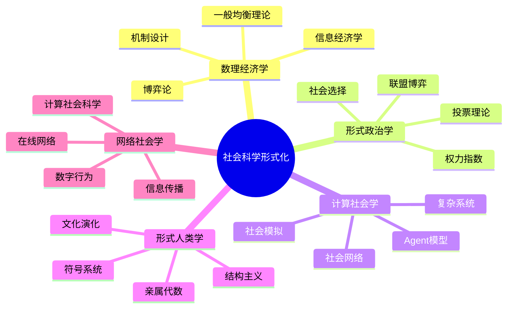

# 15 社会科学形式化模块

> **Formal Social Sciences**: 将形式化方法应用于社会科学研究，构建严格的社会理论数学基础

---

## 模块定位

社会科学形式化模块是 FormalScience 项目的重要组成部分，致力于将数学建模、形式逻辑和计算方法引入社会科学研究，实现社会现象的精确描述、严格推理和可计算分析。

### 核心理念

```
社会现象 → 形式模型 → 数学分析 → 计算验证 → 政策应用
```

---

## 1 模块结构

### 1.1 文档清单

| 序号 | 文档 | 内容 | 难度 |
|------|------|------|------|
| 15.0 | [00_目录与导航](00_目录与导航.md) | 完整目录树与学习路径 | ⭐ |
| 15.1 | [01_数理经济学基础](01_数理经济学基础.md) | 一般均衡、博弈论、信息经济学 | ⭐⭐⭐⭐ |
| 15.2 | [02_形式政治学](02_形式政治学.md) | 投票理论、权力指数、联盟形成 | ⭐⭐⭐ |
| 15.3 | [03_计算社会学](03_计算社会学.md) | 社会网络、Agent模型、社会模拟 | ⭐⭐⭐ |
| 15.4 | [04_形式人类学](04_形式人类学.md) | 亲属关系、文化模式、符号系统 | ⭐⭐⭐ |
| 15.5 | [05_网络社会学](05_网络社会学.md) | 在线网络、信息传播、数字社会 | ⭐⭐⭐ |

### 1.2 子目录结构

```
15_社会科学形式化/
├── 01_数理经济学基础/
│   ├── 01.1_一般均衡理论.md
│   ├── 01.2_博弈论经济学.md
│   └── 01.3_信息经济学.md
├── 02_形式政治学/
│   ├── 02.1_投票理论.md
│   ├── 02.2_权力指数.md
│   └── 02.3_联盟形成.md
├── 03_计算社会学/
│   ├── 03.1_社会网络分析.md
│   ├── 03.2_社会模拟.md
│   └── 03.3_文化演化模型.md
└── 04_形式人类学/
    ├── 04.1_亲属关系形式化.md
    └── 04.2_文化模式.md
```

---

## 2 核心概念图



---

## 3 方法对比矩阵

### 3.1 各学科形式化方法对比

| 维度 | 数理经济学 | 形式政治学 | 计算社会学 | 形式人类学 |
|------|-----------|-----------|-----------|-----------|
| **核心对象** | 市场、行为人 | 投票者、政党 | 个体、网络 | 文化、亲属 |
| **主要工具** | 优化、均衡 | 博弈论、公理 | 网络分析、模拟 | 代数、结构分析 |
| **数学基础** | 凸分析、拓扑 | 组合数学 | 图论、统计物理 | 群论、同构 |
| **计算范式** | 数值优化 | 算法博弈 | Agent模拟 | 符号计算 |
| **验证方式** | 实证数据 | 实验政治 | 大数据 | 田野调查 |
| **时间尺度** | 静态/动态 | 一次性/重复 | 演化过程 | 代际传递 |
| **代表性模型** | Arrow-Debreu | Arrow定理 | Barabási-Albert | 列维-斯特劳斯 |

### 3.2 形式化程度对比

| 学科 | 公理化程度 | 形式化程度 | 可计算性 | 预测能力 |
|------|-----------|-----------|---------|---------|
| 数理经济学 | ⭐⭐⭐⭐⭐ | ⭐⭐⭐⭐⭐ | ⭐⭐⭐⭐ | ⭐⭐⭐⭐ |
| 形式政治学 | ⭐⭐⭐⭐⭐ | ⭐⭐⭐⭐ | ⭐⭐⭐ | ⭐⭐⭐ |
| 计算社会学 | ⭐⭐⭐ | ⭐⭐⭐⭐ | ⭐⭐⭐⭐⭐ | ⭐⭐⭐⭐ |
| 形式人类学 | ⭐⭐⭐⭐ | ⭐⭐⭐ | ⭐⭐ | ⭐⭐ |
| 网络社会学 | ⭐⭐⭐ | ⭐⭐⭐⭐ | ⭐⭐⭐⭐⭐ | ⭐⭐⭐⭐ |

---

## 4 理论基础

### 4.1 共同数学基础

**定义 1** (理性行为人)

行为人 $i$ 的特征：

- 选择集：$X_i$
- 偏好关系：$쳎q_i   ext{ 满足完备性、传递性}$
- 决策规则：$x_i^*   ext{ 是偏好最大化的选择}$

**定义 2** (均衡概念)

状态 $s^*$ 是均衡，若满足：
$$s^* = f(s^*)$$

其中 $f$ 是状态更新函数。

### 4.2 跨学科统一框架

```
微观基础 → 互动结构 → 涌现宏观 → 反馈效应
    ↓           ↓           ↓           ↓
 个体理性    博弈/网络    均衡/演化   内生变化
```

---

## 5 应用场景

### 5.1 政策设计

| 应用领域 | 形式化方法 | 实际应用 |
|---------|-----------|---------|
| 拍卖设计 | 机制设计理论 | 频谱拍卖、碳排放交易 |
| 选举制度 | 投票理论 | 选举改革、代表制度 |
| 传染病控制 | 网络流行病学 | 疫情防控策略 |
| 文化传播 | 演化博弈 | 文化遗产保护 |

### 5.2 商业应用

- **市场设计**：双边匹配、推荐系统
- **社会营销**：影响力最大化、病毒传播
- **组织管理**：层级结构优化、团队协作

---

## 6 与其他模块的交叉引用

### 6.1 前置依赖

```
01_数学基础
├── 微积分 → 优化理论
├── 概率论 → 随机博弈
└── 博弈论 → 经济/政治应用

02_形式语言
├── 逻辑系统 → 社会选择公理
└── 类型论 → 社会范畴

11_系统科学
├── 网络科学 → 社会网络分析
├── 复杂系统 → 社会涌现
└── 演化理论 → 文化演化
```

### 6.2 横向连接

| 本模块 | 连接模块 | 连接点 |
|--------|---------|--------|
| 博弈论经济学 | 12_决策与博弈论 | 博弈表示、均衡概念 |
| 社会网络 | 11_系统科学/05_网络科学 | 网络拓扑、动力学 |
| 社会模拟 | 03_编程范式 | Agent编程、并发模拟 |
| 文化演化 | 13_认知科学形式模型 | 文化传播、认知基础 |

### 6.3 后续应用

```
15_社会科学形式化 → 应用领域
├── 04_软件工程 → 团队组织、项目管理
├── 06_调度系统 → 资源分配、机制设计
└── 07_交叉视角 → 跨学科整合方法论
```

---

## 7 学习路径

### 7.1 入门路径（经济学背景）

```
01_数理经济学基础
    └── 01.1_一般均衡理论
        └── 01.2_博弈论经济学
            └── 02_形式政治学
                └── 03_计算社会学
```

### 7.2 入门路径（计算机背景）

```
03_计算社会学
    └── 03.1_社会网络分析
        └── 03.2_社会模拟
            └── 05_网络社会学
                └── 01_数理经济学基础
```

### 7.3 综合路径

```
理论基础 → 方法论 → 应用领域
    │           │           │
    ▼           ▼           ▼
博弈论+网络  计算模拟    政策设计
```

---

## 8 关键文献

### 8.1 经典文献

1. **Arrow, K. J.** (1951). _Social Choice and Individual Values_. Wiley.
2. **Nash, J. F.** (1950). Equilibrium points in n-person games. _PNAS_.
3. **Simon, H. A.** (1957). _Models of Man_. Wiley.
4. **Axelrod, R.** (1984). _The Evolution of Cooperation_. Basic Books.

### 8.2 现代综合

1. **Easley, D., & Kleinberg, J.** (2010). _Networks, Crowds, and Markets_. Cambridge.
2. **Jackson, M. O.** (2008). _Social and Economic Networks_. Princeton.
3. **Bowles, S.** (2004). _Microeconomics: Behavior, Institutions, and Evolution_. Princeton.

---

## 9 工具与资源

### 9.1 计算工具

| 工具 | 用途 | 语言 |
|------|------|------|
| NetLogo | Agent模拟 | Logo/Java |
| Gephi | 网络可视化 | Java |
| igraph | 网络分析 | R/Python |
| Mesa | ABM框架 | Python |
| Repast | 社会模拟 | Java/C++ |

### 9.2 数据集

- **SNAP**: 斯坦福大学大规模网络数据集
- **ICPSR**: 政治与社会研究数据
- **GDELT**: 全球事件、语言与语调数据库

---

## 10 贡献与反馈

本模块持续更新中。如发现内容错误或有改进建议，请通过以下方式反馈：

- 提交 Issue 至项目仓库
- 联系模块维护者
- 参与社区讨论

---

**最后更新**: 2026-04-12
**维护者**: FormalScience Team
**版本**: v1.0.0
---

## 📚 延伸阅读

- [15.4 形式人类学](./04_形式人类学/04.2_文化模式.md)
- [11.17 图论基础](../11_系统科学/05_网络科学/05.1_图论基础.md)
- [11.5 网络科学](../11_系统科学/05_网络科学.md)
- [15.1 数理经济学基础](./01_数理经济学基础/01.1_一般均衡理论.md)
- [15.1 数理经济学基础](./01_数理经济学基础.md)
