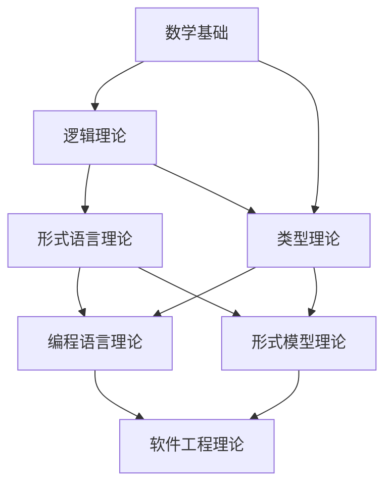
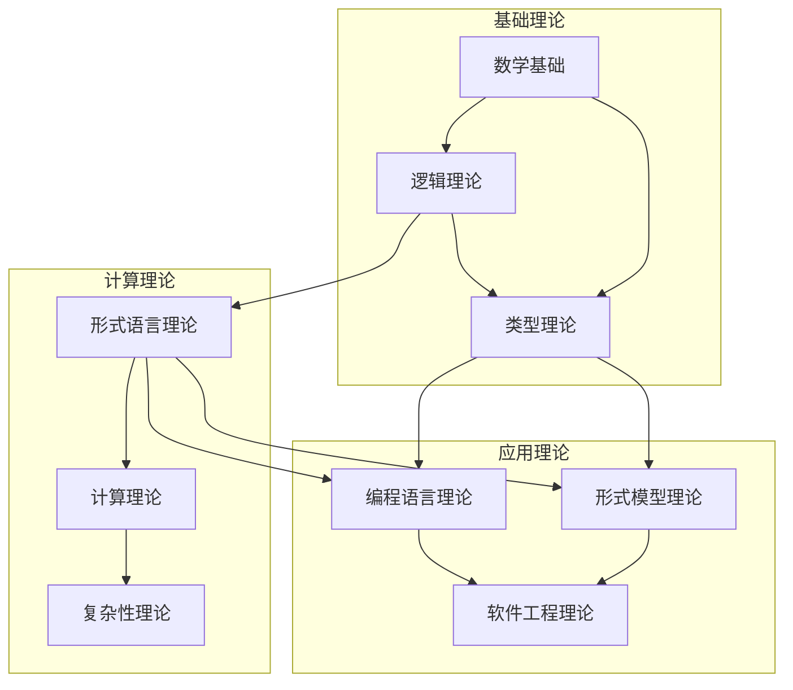
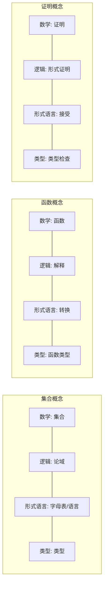
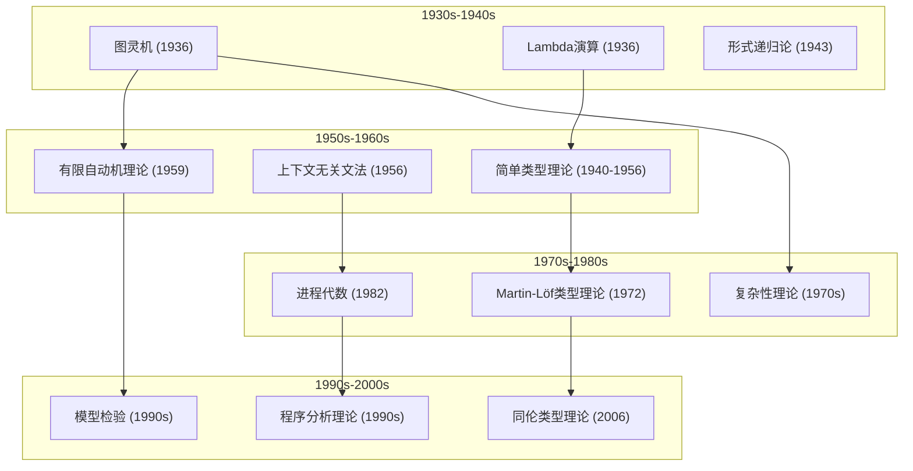

# 形式科学上下文整合

## 1. 整合概述

本文档定义了形式科学重构项目中各理论模块的上下文整合策略，旨在建立一个统一、连贯的形式科学理论体系。通过整合不同理论领域的上下文，我们能够确保概念的一致性、关系的明确性，以及知识的系统性。

### 1.1 整合目标

形式科学上下文整合的主要目标包括：

1. **理论统一**: 建立统一的形式科学理论框架
2. **概念协调**: 确保不同理论领域中概念的一致性
3. **关系明确**: 明确不同理论领域之间的关系
4. **知识连贯**: 建立连贯的知识网络
5. **冗余消除**: 识别和消除不同理论领域中的重复内容

### 1.2 整合范围

本整合工作涵盖以下理论领域：

1. **数学基础**: 集合论、逻辑、代数等
2. **逻辑理论**: 命题逻辑、谓词逻辑、模态逻辑等
3. **形式语言理论**: 自动机理论、形式文法、计算理论等
4. **类型理论**: 简单类型理论、依赖类型理论、线性类型理论等
5. **形式模型理论**: 状态机、Petri网、进程演算等
6. **控制理论**: 线性控制、非线性控制、离散事件控制等
7. **其他相关理论**: 信息论、复杂性理论、分布式系统理论等

## 2. 理论模块结构

### 2.1 标准化目录结构

按照[统一目录结构规范](../../统一目录结构规范.md)，形式科学重构项目采用以下标准化目录结构：

```text
docs/Refactor/
├── 00_Master_Index/                # 主索引
├── 01_Philosophical_Foundations/    # 哲学基础
├── 02_Mathematical_Foundations/     # 数学基础
├── 03_Logic_Theory/                # 逻辑理论
├── 04_Formal_Language_Theory/       # 形式语言理论
├── 05_Type_Theory/                 # 类型理论
├── 06_Formal_Model_Theory/         # 形式模型理论
├── 07_Programming_Language_Theory/  # 编程语言理论
├── 08_Software_Engineering_Theory/  # 软件工程理论
├── 09_Computer_Architecture_Theory/ # 计算机架构理论
├── 10_Distributed_Systems_Theory/   # 分布式系统理论
├── 11_Computer_Network_Theory/      # 计算机网络理论
├── 12_Context_System/              # 上下文系统
├── 13_Algorithm_Theory/            # 算法理论
├── 14_Complexity_Theory/           # 复杂性理论
└── 15_Information_Theory/          # 信息论
```

### 2.2 模块间关系

形式科学理论模块之间存在以下关系：

1. **基础关系**: 一个理论为另一个理论提供基础
   - 例如: 数学基础 → 逻辑理论 → 形式语言理论

2. **应用关系**: 一个理论应用于另一个理论
   - 例如: 类型理论 → 编程语言理论

3. **扩展关系**: 一个理论扩展了另一个理论
   - 例如: 模态逻辑扩展了经典逻辑

4. **综合关系**: 多个理论综合形成新理论
   - 例如: 形式语言理论 + 类型理论 → 类型化形式语言

## 3. 计算理论内容合并

### 3.1 计算理论相关模块

计算理论内容分散在以下模块中：

1. **形式语言理论**: 自动机理论、形式文法、可计算性理论
2. **算法理论**: 算法设计、分析和验证
3. **复杂性理论**: 计算复杂性、问题分类
4. **类型理论**: 计算的类型化表示

### 3.2 内容分析

通过分析，我们发现以下计算理论内容需要合并：

1. **自动机理论**:
   - 分散在 `01_Automata_Theory`、`03.1_Automata_Theory` 等目录
   - 内容重复，格式不一致

2. **形式文法**:
   - 分散在 `3.1_Formal_Grammar`、`03.2_Formal_Grammars` 等目录
   - 命名不一致，内容部分重叠

3. **可计算性理论**:
   - 分散在 `03_Computability_Theory`、`03.6_Computation_Theory` 等目录
   - 概念定义不一致

4. **复杂性理论**:
   - 分散在 `04_Complexity_Theory`、`14_Complexity_Theory` 等目录
   - 内容重复，需要统一

### 3.3 合并策略

我们采用以下策略合并计算理论内容：

1. **明确理论边界**:
   - 将自动机理论和形式文法归入形式语言理论
   - 将可计算性理论核心内容归入形式语言理论
   - 将复杂性理论独立为单独模块

2. **内容整合**:
   - 合并重复内容，保留更完整、更形式化的版本
   - 统一概念定义和符号表示
   - 建立清晰的理论层次结构

3. **交叉引用**:
   - 建立模块间的交叉引用
   - 明确概念的来源和应用

### 3.4 合并执行步骤

1. **形式语言理论整合**:
   - 将 `01_Automata_Theory` 内容合并到 `04_Formal_Language_Theory/03.1_Automata_Theory`
   - 将 `3.1_Formal_Grammar` 内容合并到 `04_Formal_Language_Theory/03.2_Formal_Grammars`
   - 将 `01_Chomsky_Hierarchy` 内容合并到 `04_Formal_Language_Theory/03.3_Language_Hierarchy`
   - 标准化文件命名和内容格式

2. **复杂性理论整合**:
   - 将 `04_Complexity_Theory` 内容合并到 `14_Complexity_Theory`
   - 确保与算法理论的适当交叉引用
   - 标准化复杂性类别和问题分类

3. **算法理论整合**:
   - 确保算法理论与复杂性理论的一致性
   - 建立算法分析的标准框架
   - 与形式验证方法建立连接

## 4. 上下文模型整合

### 4.1 核心概念映射

以下是形式科学中核心概念在不同理论领域中的映射：

| 概念 | 数学基础 | 逻辑理论 | 形式语言理论 | 类型理论 | 形式模型理论 |
|------|---------|---------|------------|---------|------------|
| 集合 | 基本概念 | 模型论基础 | 语言定义 | 类型集合 | 状态集合 |
| 函数 | 映射 | 解释 | 转换 | 函数类型 | 转换函数 |
| 关系 | 集合笛卡尔积 | 关系符号 | 产生式规则 | 子类型关系 | 状态关系 |
| 证明 | 数学证明 | 形式证明 | 语言识别 | 类型检查 | 模型验证 |
| 计算 | 算法 | 推理 | 自动机执行 | 规约 | 状态转换 |

### 4.2 理论关系模型

形式科学理论之间的关系可以建模为以下图结构：



### 4.3 上下文转换规则

在不同理论领域间转换概念时，应遵循以下规则：

1. **保持数学严谨性**:
   - 确保概念的数学定义在转换中保持一致
   - 明确说明任何定义的扩展或限制

2. **明确抽象层次**:
   - 识别概念在不同理论中的抽象层次
   - 在转换时保持适当的抽象层次

3. **保持计算解释**:
   - 确保概念的计算解释在转换中保持一致
   - 明确说明计算模型的变化

4. **维护形式化表示**:
   - 使用适当的形式化表示方法
   - 确保表示方法之间的转换是明确定义的

## 5. 形式语言理论整合

### 5.1 自动机理论与形式文法整合

自动机理论和形式文法之间存在以下对应关系：

| 语言类型 | 文法类型 | 自动机类型 | 复杂性 |
|---------|---------|-----------|-------|
| 正则语言 | 3型文法 | 有限自动机 | 线性时间 |
| 上下文无关语言 | 2型文法 | 下推自动机 | 多项式时间 |
| 上下文相关语言 | 1型文法 | 线性有界自动机 | 指数时间 |
| 递归可枚举语言 | 0型文法 | 图灵机 | 不确定 |

整合策略：

1. **统一表示**:
   - 使用统一的符号系统表示文法和自动机
   - 明确文法和自动机之间的转换算法

2. **层次结构**:
   - 按照Chomsky层次结构组织内容
   - 在每个层次上建立文法、自动机和语言属性的联系

3. **算法整合**:
   - 整合相关算法（如CYK算法、确定化算法等）
   - 确保算法描述的一致性和正确性

### 5.2 计算理论与复杂性理论整合

计算理论与复杂性理论之间存在以下联系：

1. **计算模型**:
   - 不同计算模型（图灵机、RAM、电路等）的计算能力
   - 模型间的等价性和转换

2. **问题分类**:
   - 可判定性问题
   - 复杂性类别（P, NP, PSPACE等）
   - 完全性和归约

整合策略：

1. **模型统一**:
   - 建立统一的计算模型框架
   - 明确不同模型间的关系

2. **问题分类统一**:
   - 统一问题的形式化表示
   - 建立清晰的复杂性层次结构

3. **算法分析框架**:
   - 建立统一的算法分析框架
   - 连接算法设计策略与复杂性分析

## 6. 类型理论整合

### 6.1 类型系统分类

类型理论可以按以下维度分类：

1. **表达能力**:
   - 简单类型系统
   - 多态类型系统
   - 依赖类型系统

2. **资源管理**:
   - 线性类型系统
   - 仿射类型系统
   - 相关类型系统

3. **计算模型**:
   - 函数式类型系统
   - 命令式类型系统
   - 并发类型系统

### 6.2 与逻辑的对应关系

类型系统与逻辑系统之间存在以下对应关系（Curry-Howard同构）：

| 类型构造 | 逻辑构造 |
|---------|---------|
| 函数类型 (→) | 蕴含 (⇒) |
| 积类型 (×) | 合取 (∧) |
| 和类型 (+) | 析取 (∨) |
| 单位类型 (1) | 真 (⊤) |
| 空类型 (0) | 假 (⊥) |
| 全称量化 (∀) | 全称量词 (∀) |
| 存在量化 (∃) | 存在量词 (∃) |

整合策略：

1. **统一表示**:
   - 使用统一的符号系统表示类型和逻辑
   - 明确类型检查和证明检查之间的关系

2. **层次结构**:
   - 按照表达能力组织类型系统
   - 建立类型系统、逻辑系统和计算模型之间的联系

3. **应用整合**:
   - 整合类型系统在编程语言中的应用
   - 整合类型系统在形式验证中的应用

## 7. 交叉引用更新

### 7.1 内部引用

理论模块内的交叉引用应使用以下格式：

```markdown
[有限自动机](../../04_Formal_Language_Theory/01_Automata_Theory/03.1.1_Finite_Automata.md)
[上下文无关文法](../../04_Formal_Language_Theory/03.2_Formal_Grammars/03.2.2_Context_Free_Grammar.md)
```

### 7.2 模块间引用

不同理论模块之间的引用应使用以下格式：

```markdown
[命题逻辑](../../03_Logic_Theory/01_Propositional_Logic.md)
[依赖类型](../../05_Type_Theory/02_Dependent_Type_Theory/01_Martin_Lof_Type_Theory.md)
```

### 7.3 引用更新计划

1. **识别需要更新的引用**:
   - 扫描所有理论模块文件
   - 识别内部和模块间引用

2. **更新引用路径**:
   - 按照标准格式更新路径
   - 确保路径正确

3. **验证引用有效性**:
   - 测试所有更新后的链接
   - 修复无效链接

## 8. 上下文可视化

### 8.1 理论关系图

形式科学理论之间的关系可以通过以下图表可视化：



### 8.2 概念映射图

核心概念在不同理论领域中的映射可以通过以下图表可视化：



### 8.3 理论演化图

形式科学理论的历史演化可以通过以下时间线可视化：



## 9. 未来发展

### 9.1 理论整合计划

1. **深度整合**:
   - 进一步整合形式语言理论与类型理论
   - 建立统一的计算模型框架
   - 整合形式验证方法

2. **广度扩展**:
   - 整合量子计算模型
   - 整合生物计算模型
   - 整合认知计算模型

### 9.2 上下文模型改进

1. **动态上下文模型**:
   - 支持理论演化的动态表示
   - 建立概念演化的跟踪机制

2. **上下文推理**:
   - 实现跨理论的自动推理
   - 支持理论间的知识传递

3. **交互式探索**:
   - 开发交互式理论探索工具
   - 支持理论间关系的可视化探索

---

**最后更新**: 2025-01-16
**文档版本**: 1.0

## 批判性分析

- 本节内容待补充：请从多元理论视角、局限性、争议点、应用前景等方面进行批判性分析。
