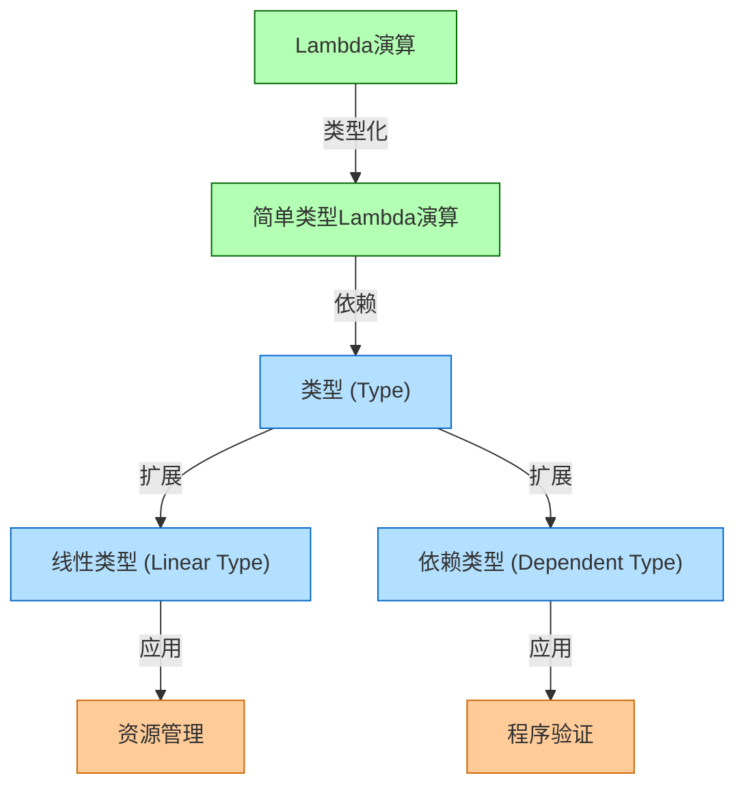
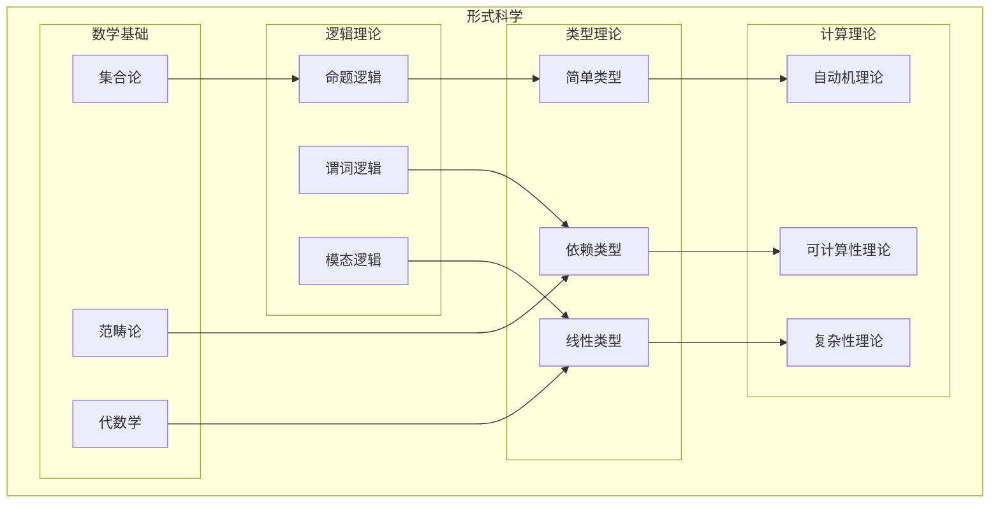
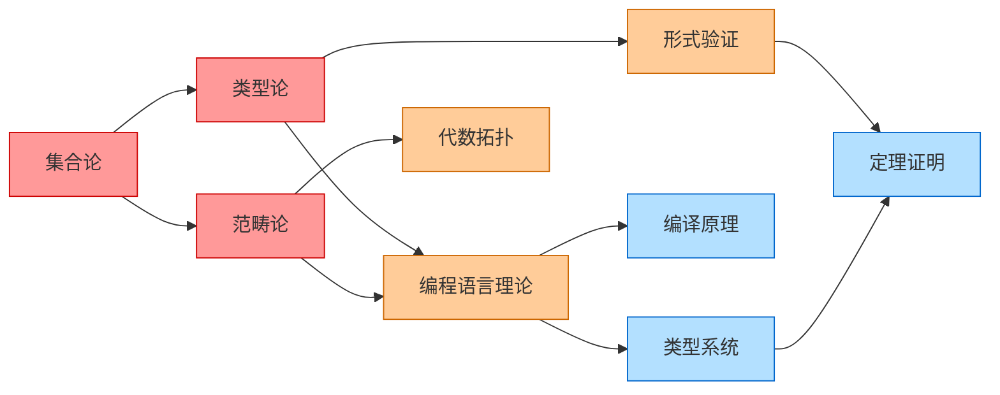
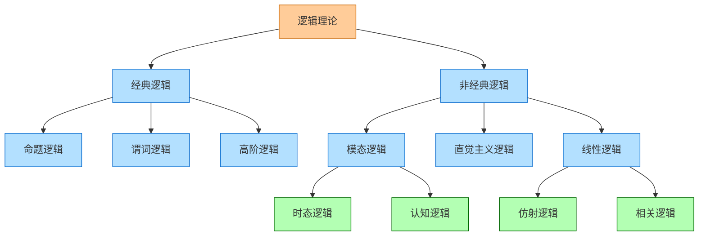
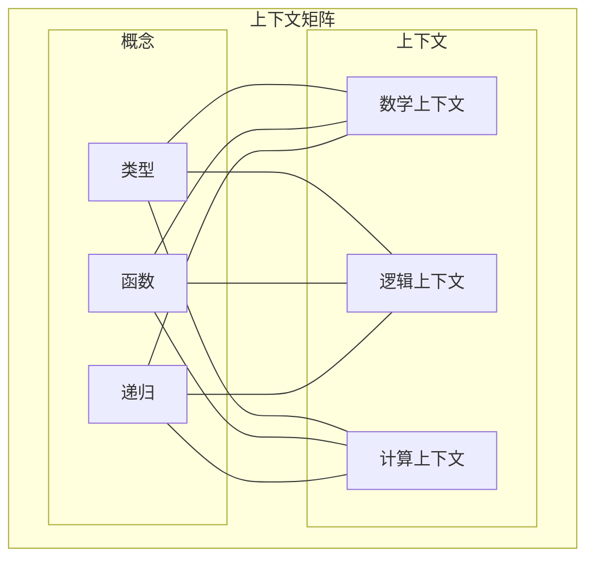

# 上下文可视化

## 1. 可视化概述

上下文可视化是将形式科学重构项目中的上下文关系转化为直观图形表示的方法和工具。通过可视化，复杂的概念关系和知识结构可以更容易地被理解、分析和交流。

### 1.1 可视化目标

上下文可视化旨在实现以下目标：

1. **直观表示**: 将抽象的上下文关系转化为直观的图形表示
2. **结构揭示**: 揭示知识结构中的模式和组织
3. **关系展示**: 清晰展示概念间的各种关系
4. **复杂性管理**: 通过分层和聚合管理复杂性
5. **交互探索**: 支持对知识空间的交互式探索

### 1.2 可视化类型

上下文系统支持以下类型的可视化：

1. **概念图**: 展示概念及其关系
2. **知识地图**: 展示知识的整体结构
3. **依赖网络**: 展示概念间的依赖关系
4. **层次树**: 展示概念的分类层次
5. **上下文矩阵**: 展示概念在不同上下文中的解释

## 2. 概念图可视化

### 2.1 概念图定义

概念图是表示概念及其关系的图形化表示，使用节点表示概念，边表示关系。

### 2.2 视觉编码

概念图使用以下视觉编码：

1. **节点形状**:
   - 圆形: 基础概念
   - 矩形: 复合概念
   - 菱形: 元概念

2. **节点颜色**:
   - 蓝色: 数学概念
   - 绿色: 逻辑概念
   - 橙色: 计算概念
   - 紫色: 哲学概念

3. **边类型**:
   - 实线箭头: 直接关系
   - 虚线箭头: 间接关系
   - 双向箭头: 双向关系

4. **边标签**: 描述关系类型

### 2.3 概念图示例

## 3. 知识地图可视化

### 3.1 知识地图定义

知识地图是表示知识领域整体结构的可视化，通常采用地图隐喻，将知识领域表示为地理区域。

### 3.2 视觉编码

知识地图使用以下视觉编码：

1. **区域**: 表示知识领域或子领域
2. **边界**: 表示领域边界
3. **路径**: 表示知识路径或学习路径
4. **地标**: 表示关键概念或理论
5. **高度**: 表示概念的抽象级别或复杂性

### 3.3 知识地图示例

## 4. 依赖网络可视化

### 4.1 依赖网络定义

依赖网络是表示概念间依赖关系的可视化，通常采用有向图表示。

### 4.2 视觉编码

依赖网络使用以下视觉编码：

1. **节点大小**: 表示概念的重要性或中心性
2. **节点位置**: 使用力导向布局反映依赖结构
3. **边粗细**: 表示依赖强度
4. **边方向**: 表示依赖方向
5. **聚类**: 表示高度相关的概念组

### 4.3 依赖网络示例

## 5. 层次树可视化

### 5.1 层次树定义

层次树是表示概念分类层次的可视化，通常采用树状结构表示。

### 5.2 视觉编码

层次树使用以下视觉编码：

1. **树层级**: 表示概念的抽象级别
2. **节点展开/折叠**: 管理复杂性
3. **分支宽度**: 表示子概念的数量或重要性
4. **路径高亮**: 强调特定的概念路径

### 5.3 层次树示例

## 6. 上下文矩阵可视化

### 6.1 上下文矩阵定义

上下文矩阵是表示概念在不同上下文中解释的可视化，通常采用矩阵形式表示。

### 6.2 视觉编码

上下文矩阵使用以下视觉编码：

1. **行**: 表示概念
2. **列**: 表示上下文
3. **单元格颜色**: 表示概念在上下文中的相关性
4. **单元格内容**: 概念在上下文中的简要解释
5. **边框样式**: 表示解释的确定性或模糊性

### 6.3 上下文矩阵示例

## 7. 交互式可视化

### 7.1 交互功能

交互式可视化支持以下功能：

1. **缩放与平移**: 探索大型知识结构
2. **过滤与搜索**: 聚焦于特定概念或关系
3. **展开与折叠**: 管理可视化复杂性
4. **详情查看**: 获取概念或关系的详细信息
5. **路径追踪**: 探索概念间的连接路径

### 7.2 交互技术

实现交互式可视化的技术包括：

1. **力导向布局**: 自动组织节点位置
2. **焦点+上下文**: 同时显示详细和概览信息
3. **渐进式披露**: 逐步显示复杂信息
4. **视觉提示**: 引导用户注意力
5. **动态查询**: 实时过滤和搜索

## 8. 可视化工具

### 8.1 通用可视化工具

以下工具可用于创建上下文可视化：

1. **D3.js**: 创建自定义交互式可视化
2. **Graphviz**: 创建静态图形可视化
3. **Mermaid**: 创建简单的图表和流程图
4. **Gephi**: 分析和可视化大型网络

### 8.2 专用可视化工具

为上下文系统开发的专用可视化工具：

1. **上下文浏览器**: 交互式探索上下文关系
2. **概念地图生成器**: 自动生成概念地图
3. **依赖分析器**: 可视化分析依赖关系
4. **知识导航器**: 基于可视化的知识导航

## 9. 可视化最佳实践

### 9.1 设计原则

创建有效上下文可视化的原则：

1. **简洁性**: 避免视觉混乱，专注于关键信息
2. **一致性**: 使用一致的视觉语言和编码
3. **层次性**: 通过视觉层次组织信息
4. **可读性**: 确保文本和标签清晰可读
5. **响应性**: 适应不同屏幕尺寸和设备

### 9.2 常见问题与解决方案

上下文可视化中的常见问题及其解决方案：

1. **视觉复杂性**: 使用聚合、过滤和分层
2. **信息过载**: 采用渐进式披露和详情视图
3. **关系密集**: 使用边捆绑和聚类
4. **大规模数据**: 采用抽样和聚合技术
5. **跨领域理解**: 提供上下文相关的解释和图例

---

**最后更新**: 2025-01-16
**文档版本**: 1.0

## 批判性分析

- 本节内容待补充：请从多元理论视角、局限性、争议点、应用前景等方面进行批判性分析。
