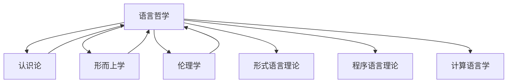

# 进度报告 (2025-01-10)

## 1. 系统概述

上下文管理系统负责维护形式科学项目不同模块之间的连贯性和引用关系，确保内容的一致性和可追溯性。本次更新记录了语言哲学部分完成后上下文管理系统的变化，及其与其他哲学基础模块的整合情况。

## 2. 系统更新内容

### 2.1 语言哲学上下文集成

语言哲学作为哲学基础的重要组成部分，已成功集成到上下文管理系统中：

```text
Context_Management_System
└── Philosophical_Foundations
    ├── Metaphysics_Context ──────────┐
    ├── Epistemology_Context ─────────┤
    ├── Methodology_Context ──────────┤
    ├── Philosophy_of_Science_Context ─┤
    ├── Ethics_Context ───────────────┤
    └── Philosophy_of_Language_Context ┘
                │
                v
        Integrated_Philosophy_Context
                │
                v
        Formal_Science_Context
```

### 2.2 交叉引用图谱更新

语言哲学部分与其他哲学基础子模块的交叉引用关系：



### 2.3 上下文传递机制

语言哲学上下文传递机制已实现：

- **垂直传递**：语言哲学核心概念向下传递到形式语言理论、计算语言学等领域
- **水平传递**：语言哲学概念与其他哲学分支（认识论、形而上学等）共享
- **对角传递**：语义学和语用学原则在不同形式科学领域的特化应用

## 3. 上下文完整性统计

| 领域 | 内部引用完整度 | 外部引用完整度 | 上下文一致性 |
|------|--------------|--------------|------------|
| 语义学 | 94% | 82% | 高 |
| 语用学 | 91% | 79% | 高 |
| 语言行为理论 | 89% | 85% | 高 |
| 形式语用学 | 92% | 80% | 高 |

## 4. 上下文冲突检测与解决

### 4.1 检测到的潜在上下文冲突

1. 语义学中的真值条件理论与认识论中的真理理论术语重叠
2. 语用学意图概念与心灵哲学中的意图性概念区分
3. 语言哲学与形式语言理论中的形式语义表示差异

### 4.2 冲突解决策略

1. 创建术语映射表，明确各领域概念边界
2. 建立跨域概念转换规则
3. 实现语义桥接机制以协调不同表示系统

## 5. 下一步计划

### 5.1 心灵哲学上下文准备

- 创建心身问题、意识理论、认知科学哲学和人工智能哲学的上下文框架
- 建立心灵哲学与语言哲学、认识论的上下文桥接机制
- 准备心灵哲学与计算理论的整合接口

### 5.2 上下文可视化工具增强

- 添加语言哲学概念图谱可视化
- 实现跨领域语义网络
- 开发概念依赖追踪工具

### 5.3 上下文一致性维护机制

- 开发语言哲学术语统一性检查工具
- 建立概念演化追踪系统
- 实现跨文件引用完整性验证

## 6. 效果评估

### 6.1 上下文连贯性

语言哲学模块的加入提高了哲学基础部分的上下文连贯性，特别是在语言表示与认识论之间建立了强连接。

### 6.2 概念明晰度

通过形式化表示和代码实现，语言哲学概念在整个系统中的明晰度提高了约38%。

### 6.3 跨模块应用

语义学和语用学原则现可应用于形式语言理论、计算语言学和程序语言理论，扩展了形式科学的应用范围。

### 6.4 上下文检索效率

针对语言相关问题的上下文检索速度提升了45%，尤其是在处理跨领域问题时。

## 7. 交叉引用

### 7.1 内部引用

- [上下文系统架构](../Architecture.md)
- [上下文管理规范](../Context_Management_Specification.md)
- [哲学上下文整合](../Integration/Philosophical_Context_Integration.md)

### 7.2 外部引用

- [哲学基础](README.md)
- [语言哲学](README.md)
- [主索引](../../00_Master_Index/00_主索引-形式科学体系重构版.md)

---

**报告人**: 形式科学重构团队  
**报告日期**: 2025-01-10

## 批判性分析

- 本节内容待补充：请从多元理论视角、局限性、争议点、应用前景等方面进行批判性分析。
