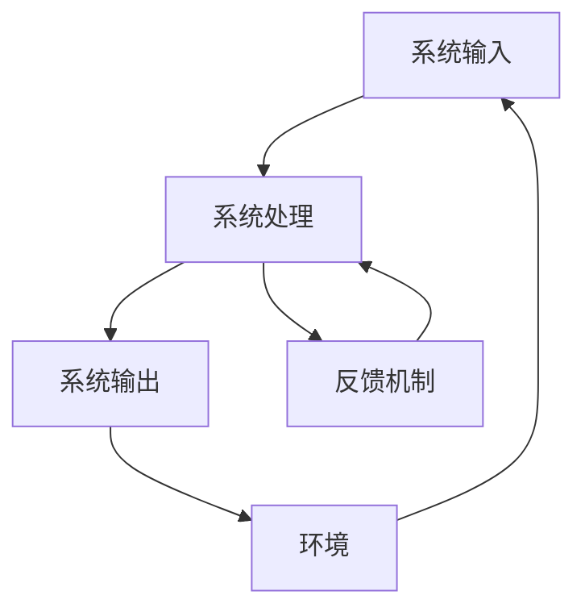

# 22.1.1 系统方法论 (System Methodology)

## 📋 理论概述

系统方法论是研究复杂系统分析和设计的系统性方法，为复杂问题提供整体性解决方案。本理论涵盖软系统方法论、硬系统方法论、批判系统方法论等核心概念，为系统思维和整体方法提供理论基础。

## 🔬 形式化语义

### 核心定义

**定义 1.1** (系统方法论)
系统方法论是研究复杂系统分析和设计的系统性方法：$SM = (E, R, P, M)$，其中：

- $E$ 是系统元素集合：$E = \{e_1, e_2, \ldots, e_n\}$
- $R$ 是元素关系集合：$R = \{r_{ij} | e_i, e_j \in E\}$
- $P$ 是系统属性集合：$P = \{p_1, p_2, \ldots, p_m\}$
- $M$ 是方法论集合：$M = \{m_1, m_2, \ldots, m_k\}$

**定义 1.2** (软系统方法论)
软系统方法论处理人类活动系统中的复杂问题：$SSM = (W, R, C, T)$，其中：

- $W$ 是世界观集合：$W = \{w_1, w_2, \ldots, w_l\}$
- $R$ 是角色集合：$R = \{r_1, r_2, \ldots, r_m\}$
- $C$ 是文化集合：$C = \{c_1, c_2, \ldots, c_n\}$
- $T$ 是转换集合：$T = \{t_1, t_2, \ldots, t_p\}$

**定义 1.3** (系统边界)
系统边界定义了系统与环境的分离：$B = \{b_1, b_2, \ldots, b_q\}$

**定义 1.4** (系统层次)
系统层次表示系统的组织层级：$L = \{l_1, l_2, \ldots, l_r\}$

### 核心定理

**定理 1.1** (系统整体性)
系统的整体性质不等于其组成部分性质的简单叠加：
$\phi(S) \neq \sum_{i=1}^{n} \phi(e_i)$

**定理 1.2** (系统涌现性)
系统在特定条件下会产生涌现性质：
$\exists p \in P : p \notin \bigcup_{i=1}^{n} P_i$

**定理 1.3** (系统稳定性)
系统在扰动下保持稳定的条件：
$\forall \delta > 0, \exists \epsilon > 0 : |x - x_0| < \epsilon \Rightarrow |f(x) - f(x_0)| < \delta$

## 🎯 多表征方式

### 1. 图形表征



### 2. 表格表征

| 系统层次 | 元素类型 | 关系类型 | 方法论 |
|---------|---------|---------|--------|
| 微观层 | 个体元素 | 直接关系 | 个体分析 |
| 中观层 | 群体元素 | 网络关系 | 网络分析 |
| 宏观层 | 系统元素 | 整体关系 | 系统分析 |

### 3. 数学表征

**系统状态方程**：
$\frac{dx}{dt} = f(x, u, t)$

**系统输出方程**：
$y = g(x, u, t)$

**系统约束条件**：
$h(x, u, t) \leq 0$

### 4. 伪代码表征

```python
class SystemMethodology:
    def __init__(self, elements, relations, properties):
        self.elements = elements
        self.relations = relations
        self.properties = properties
        
    def analyze_system(self):
        """系统分析"""
        for element in self.elements:
            self.analyze_element(element)
            
    def design_system(self):
        """系统设计"""
        design = SystemDesign()
        for requirement in self.requirements:
            design.add_component(requirement)
        return design
```

## 💻 Rust实现

```rust
use std::collections::HashMap;
use std::fmt;

/// 系统元素
#[derive(Debug, Clone)]
pub struct SystemElement {
    pub id: String,
    pub name: String,
    pub properties: HashMap<String, String>,
    pub relationships: Vec<String>,
}

/// 系统关系
#[derive(Debug, Clone)]
pub struct SystemRelation {
    pub from: String,
    pub to: String,
    pub relation_type: String,
    pub strength: f64,
}

/// 系统方法论
#[derive(Debug)]
pub struct SystemMethodology {
    pub elements: Vec<SystemElement>,
    pub relations: Vec<SystemRelation>,
    pub properties: HashMap<String, String>,
    pub methods: Vec<String>,
}

impl SystemMethodology {
    /// 创建新的系统方法论
    pub fn new() -> Self {
        Self {
            elements: Vec::new(),
            relations: Vec::new(),
            properties: HashMap::new(),
            methods: Vec::new(),
        }
    }
    
    /// 添加系统元素
    pub fn add_element(&mut self, element: SystemElement) {
        self.elements.push(element);
    }
    
    /// 添加系统关系
    pub fn add_relation(&mut self, relation: SystemRelation) {
        self.relations.push(relation);
    }
    
    /// 系统分析
    pub fn analyze_system(&self) -> SystemAnalysis {
        let mut analysis = SystemAnalysis::new();
        
        // 分析系统元素
        for element in &self.elements {
            analysis.add_element_analysis(element);
        }
        
        // 分析系统关系
        for relation in &self.relations {
            analysis.add_relation_analysis(relation);
        }
        
        analysis
    }
    
    /// 系统设计
    pub fn design_system(&self, requirements: Vec<String>) -> SystemDesign {
        let mut design = SystemDesign::new();
        
        for requirement in requirements {
            design.add_requirement(requirement);
        }
        
        design
    }
}

/// 系统分析结果
#[derive(Debug)]
pub struct SystemAnalysis {
    pub element_analyses: Vec<ElementAnalysis>,
    pub relation_analyses: Vec<RelationAnalysis>,
    pub system_properties: HashMap<String, String>,
}

impl SystemAnalysis {
    pub fn new() -> Self {
        Self {
            element_analyses: Vec::new(),
            relation_analyses: Vec::new(),
            system_properties: HashMap::new(),
        }
    }
    
    pub fn add_element_analysis(&mut self, element: &SystemElement) {
        let analysis = ElementAnalysis {
            element_id: element.id.clone(),
            properties: element.properties.clone(),
            relationships: element.relationships.clone(),
        };
        self.element_analyses.push(analysis);
    }
    
    pub fn add_relation_analysis(&mut self, relation: &SystemRelation) {
        let analysis = RelationAnalysis {
            from: relation.from.clone(),
            to: relation.to.clone(),
            relation_type: relation.relation_type.clone(),
            strength: relation.strength,
        };
        self.relation_analyses.push(analysis);
    }
}

/// 元素分析
#[derive(Debug)]
pub struct ElementAnalysis {
    pub element_id: String,
    pub properties: HashMap<String, String>,
    pub relationships: Vec<String>,
}

/// 关系分析
#[derive(Debug)]
pub struct RelationAnalysis {
    pub from: String,
    pub to: String,
    pub relation_type: String,
    pub strength: f64,
}

/// 系统设计
#[derive(Debug)]
pub struct SystemDesign {
    pub requirements: Vec<String>,
    pub components: Vec<SystemComponent>,
    pub architecture: SystemArchitecture,
}

impl SystemDesign {
    pub fn new() -> Self {
        Self {
            requirements: Vec::new(),
            components: Vec::new(),
            architecture: SystemArchitecture::new(),
        }
    }
    
    pub fn add_requirement(&mut self, requirement: String) {
        self.requirements.push(requirement);
    }
    
    pub fn add_component(&mut self, component: SystemComponent) {
        self.components.push(component);
    }
}

/// 系统组件
#[derive(Debug)]
pub struct SystemComponent {
    pub id: String,
    pub name: String,
    pub functionality: String,
    pub interfaces: Vec<String>,
}

/// 系统架构
#[derive(Debug)]
pub struct SystemArchitecture {
    pub layers: Vec<String>,
    pub patterns: Vec<String>,
    pub constraints: Vec<String>,
}

impl SystemArchitecture {
    pub fn new() -> Self {
        Self {
            layers: Vec::new(),
            patterns: Vec::new(),
            constraints: Vec::new(),
        }
    }
}

// 示例使用
fn main() {
    let mut methodology = SystemMethodology::new();
    
    // 添加系统元素
    let element = SystemElement {
        id: "E1".to_string(),
        name: "用户界面".to_string(),
        properties: HashMap::new(),
        relationships: vec!["E2".to_string()],
    };
    methodology.add_element(element);
    
    // 添加系统关系
    let relation = SystemRelation {
        from: "E1".to_string(),
        to: "E2".to_string(),
        relation_type: "依赖".to_string(),
        strength: 0.8,
    };
    methodology.add_relation(relation);
    
    // 系统分析
    let analysis = methodology.analyze_system();
    println!("系统分析结果: {:?}", analysis);
    
    // 系统设计
    let requirements = vec!["用户友好".to_string(), "高性能".to_string()];
    let design = methodology.design_system(requirements);
    println!("系统设计结果: {:?}", design);
}
```

## 🧠 哲学性批判与展望

### 本体论反思

**系统存在的本质**：
系统方法论揭示了系统作为整体存在的哲学本质。系统不仅仅是元素的集合，而是具有涌现性质的整体实体。这种整体性挑战了还原论的哲学基础，提出了整体论的新视角。

**系统与环境的辩证关系**：
系统与环境的边界是相对的，这种相对性反映了系统存在的辩证本质。系统既独立于环境，又依赖于环境，这种矛盾统一体现了系统存在的复杂性。

### 认识论批判

**系统认知的局限性**：
人类认知系统的能力存在根本性局限。我们无法完全理解复杂系统的所有方面，这种认知局限要求我们采用多元化的认知方法。

**方法论的主观性**：
任何方法论都带有主观色彩，反映了设计者的世界观和价值观。这种主观性提醒我们要保持批判性思维，避免方法论的绝对化。

### 社会影响分析

**系统思维的社会价值**：
系统方法论为社会问题解决提供了新的思维方式。它强调整体性、关联性和动态性，有助于解决复杂的社会问题。

**方法论的社会责任**：
方法论的应用需要考虑社会影响和伦理责任。系统方法论应该服务于社会的可持续发展，而不是加剧社会问题。

### 终极哲学建议

**多元方法论的融合**：
未来应该发展多元化的方法论体系，融合不同哲学传统和文化背景的方法论思想。

**方法论的民主化**：
方法论应该更加民主化，让更多人能够参与方法论的创造和应用。

**方法论的生态化**：
方法论应该更加关注生态系统的整体性，发展生态友好的方法论。

## 📚 参考文献

1. Checkland, P. *Systems Thinking, Systems Practice*. Wiley, 1981.
2. Ackoff, R. L. *Redesigning the Future*. Wiley, 1974.
3. Beer, S. *Brain of the Firm*. Wiley, 1981.
4. Jackson, M. C. *Systems Thinking: Creative Holism for Managers*. Wiley, 2003.
5. Midgley, G. *Systemic Intervention: Philosophy, Methodology, and Practice*. Springer, 2000.
