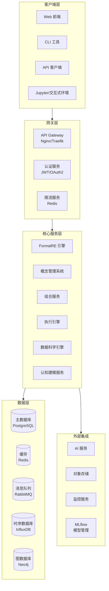
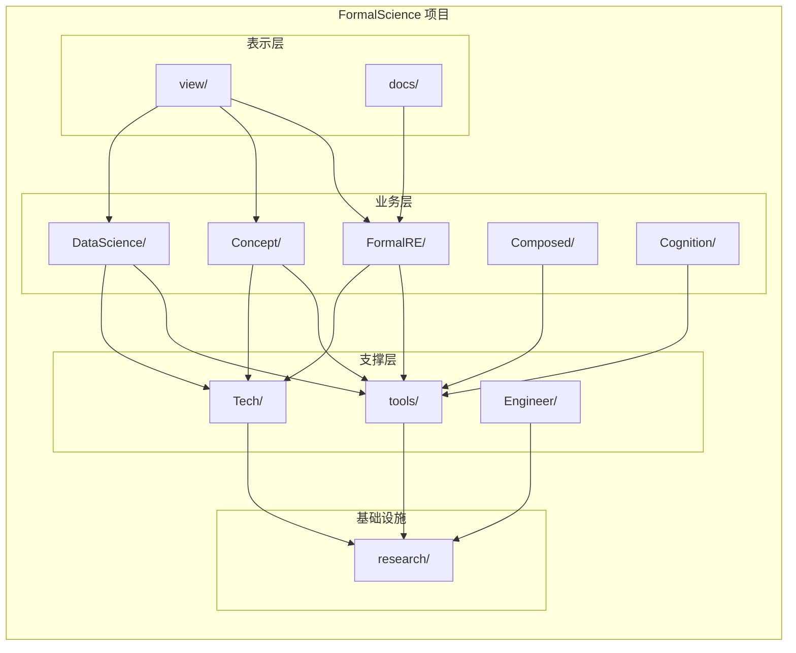
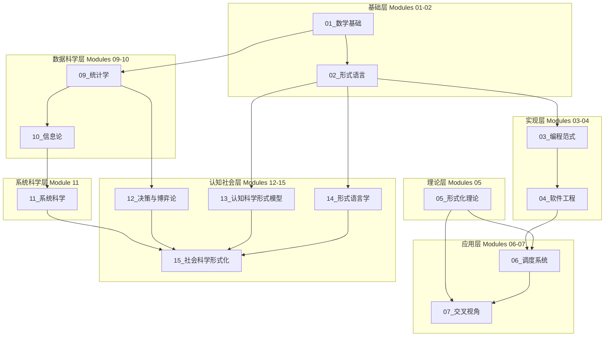
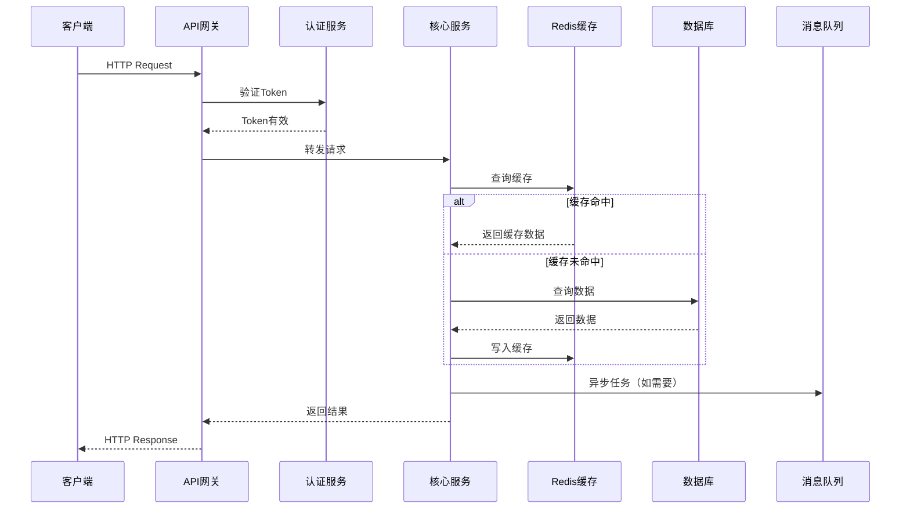
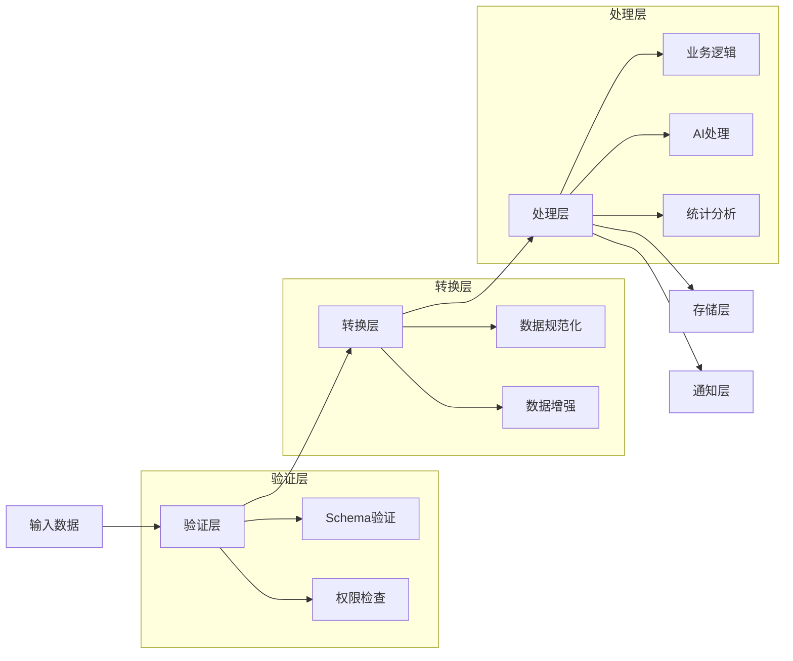
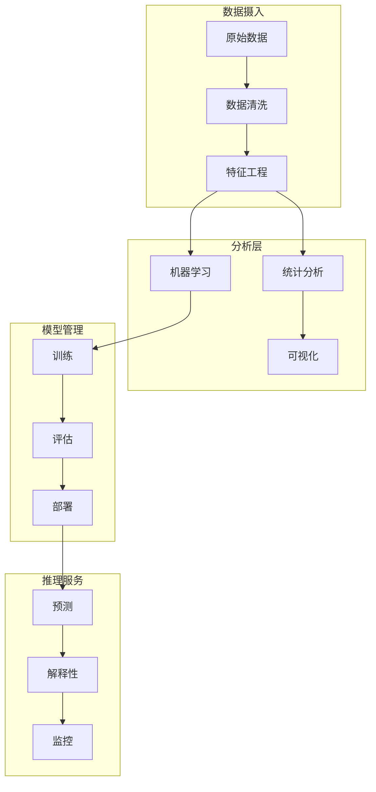
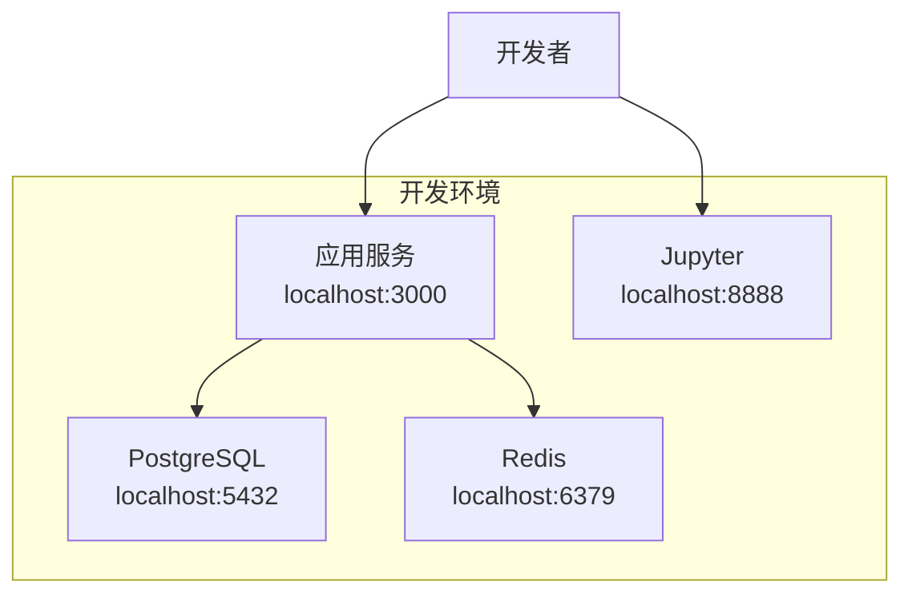
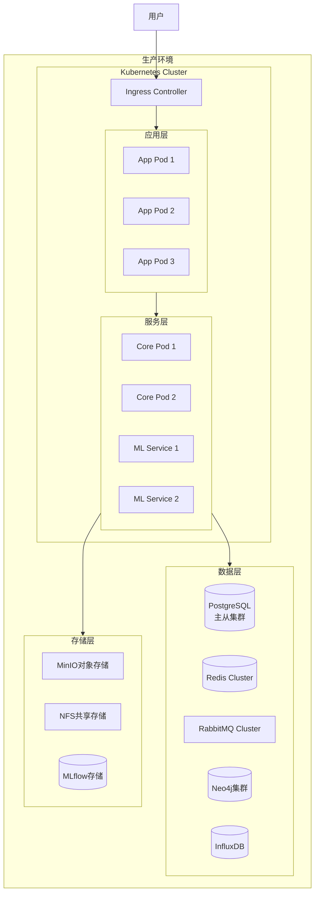
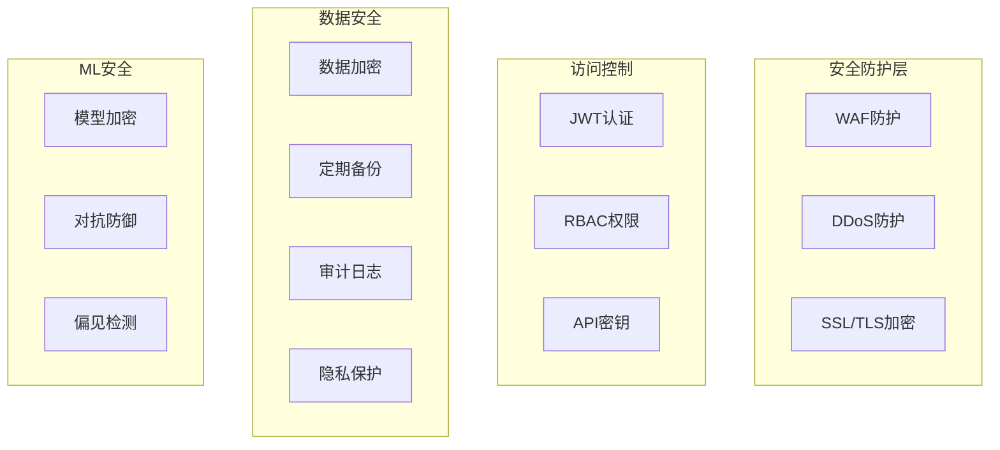

# FormalScience 项目架构文档

> 版本: v5.0.0
> 日期: 2026-04-11
> 状态: UPDATED

---

## 1. 整体架构图



---

## 2. 模块关系图

### 2.1 核心模块架构



### 2.2 文档模块架构 (15个知识模块)



### 模块说明

| 模块 | 路径 | 职责 | 依赖 | 状态 |
|------|------|------|------|------|
| FormalRE | `FormalRE/` | 形式化规则引擎 | Concept, Tools | 稳定 |
| Concept | `Concept/` | 概念与知识管理 | Tools, Tech | 稳定 |
| Composed | `Composed/` | 组合与编排服务 | FormalRE, Concept | 稳定 |
| DataScience | `DataScience/` | 统计与机器学习服务 | Tools, Tech | 新增 |
| Cognition | `Cognition/` | 认知建模与NLP | Concept, DataScience | 新增 |
| Tools | `tools/` | 工具集与公用库 | Core | 稳定 |
| Tech | `Tech/` | 技术基础设施 | Core | 稳定 |
| Engineer | `Engineer/` | 工程化组件 | Tools | 稳定 |
| View | `view/` | 前端展示层 | Core模块 | 稳定 |
| Docs | `docs/` | 文档系统 | Core | 扩展 |
| Research | `research/` | 研究与实验 | Core | 活跃 |

---

## 3. 数据流图

### 3.1 请求处理流程



### 3.2 数据处理流程



### 3.3 新增：数据科学工作流



---

## 4. 技术栈说明

### 4.1 后端技术栈

| 类别 | 技术 | 版本 | 用途 |
|------|------|------|------|
| 运行时 | Node.js | 20.x LTS | JavaScript运行时 |
| 语言 | TypeScript | 5.x | 主要开发语言 |
| Web框架 | Express/Fastify | 4.x/4.x | API服务框架 |
| ORM | Prisma/TypeORM | 5.x | 数据库操作 |
| 验证 | Zod/Joi | 3.x | 数据验证 |
| 测试 | Jest/Vitest | 29.x/1.x | 单元测试 |
| **科学计算** | **Python/PyData** | **3.11+** | **统计/ML** ⭐新增 |
| **ML框架** | **PyTorch/sklearn** | **2.x/1.x** | **机器学习** ⭐新增 |

### 4.2 前端技术栈

| 类别 | 技术 | 版本 | 用途 |
|------|------|------|------|
| 框架 | React/Vue | 18.x/3.x | UI框架 |
| 构建 | Vite | 5.x | 构建工具 |
| 样式 | Tailwind CSS | 3.x | CSS框架 |
| 状态 | Zustand/Pinia | 4.x | 状态管理 |
| 图表 | D3/ECharts | 7.x/5.x | 数据可视化 |
| **Notebook** | **JupyterLite** | **0.2.x** | **交互式计算** ⭐新增 |

### 4.3 基础设施

| 类别 | 技术 | 用途 |
|------|------|------|
| 容器化 | Docker & Docker Compose | 应用容器化 |
| 编排 | Kubernetes (可选) | 容器编排 |
| 反向代理 | Nginx/Traefik | 流量网关 |
| 监控 | Prometheus + Grafana | 指标监控 |
| 日志 | ELK Stack/Loki | 日志聚合 |
| CI/CD | GitHub Actions | 持续集成/部署 |
| **ML平台** | **MLflow/Kubeflow** | **模型生命周期** ⭐新增 |
| **图数据库** | **Neo4j** | **知识图谱** ⭐新增 |

### 4.4 数据存储

| 类型 | 技术 | 用途 |
|------|------|------|
| 关系数据库 | PostgreSQL 16 | 主数据存储 |
| 缓存 | Redis 7 | 会话缓存、热点数据 |
| 消息队列 | RabbitMQ | 异步任务处理 |
| 搜索引擎 | Elasticsearch (可选) | 全文搜索 |
| 对象存储 | MinIO/S3 | 文件存储 |
| **时序数据库** | **InfluxDB** | **指标数据** ⭐新增 |
| **图数据库** | **Neo4j** | **知识关系** ⭐新增 |
| **向量数据库** | **Pinecone/Milvus** | **语义搜索** ⭐新增 |

---

## 5. 部署架构

### 5.1 开发环境



### 5.2 生产环境



### 5.3 Docker Compose 部署

```yaml
# 完整版 docker-compose.yml 结构
version: '3.8'
services:
  app:
    image: formalscience:latest
    ports:
      - "3000:3000"
    environment:
      - NODE_ENV=production
      - DATABASE_URL=postgresql://...
    depends_on:
      - postgres
      - redis

  jupyter:
    image: formalscience/datascience:latest
    ports:
      - "8888:8888"
    volumes:
      - ./notebooks:/home/jovyan/work

  mlflow:
    image: mlflow/mlflow:latest
    ports:
      - "5000:5000"
    depends_on:
      - postgres

  postgres:
    image: postgres:16-alpine
    volumes:
      - pgdata:/var/lib/postgresql/data

  redis:
    image: redis:7-alpine
    volumes:
      - redisdata:/data

  neo4j:
    image: neo4j:5-community
    ports:
      - "7474:7474"
      - "7687:7687"
    volumes:
      - neo4jdata:/data
```

### 5.4 环境配置

| 环境 | 域名 | 资源配置 | 高可用 | 特殊服务 |
|------|------|----------|--------|----------|
| 开发 | localhost | 单实例 | 否 | Jupyter |
| 测试 | test.formalscience.local | 2核4G x 2 | 基础 | - |
| 预发布 | staging.formalscience.com | 4核8G x 3 | 是 | MLflow |
| 生产 | formalscience.com | 8核16G x 3+ | 是 | 全服务 |

---

## 6. 接口规范

### 6.1 REST API 规范

- 基础路径: `/api/v1`
- 认证方式: Bearer Token (JWT)
- 响应格式: JSON
- 状态码遵循 HTTP 标准

### 6.2 新增模块 API

| 模块 | 基础路径 | 主要功能 |
|------|----------|----------|
| 数据科学 | `/api/v1/datascience` | 统计分析、模型训练 |
| 认知建模 | `/api/v1/cognition` | 知识表示、推理 |
| 图查询 | `/api/v1/graph` | 知识图谱查询 |
| ML服务 | `/api/v1/ml` | 预测、解释性 |

### 6.3 WebSocket 接口

- 路径: `/ws`
- 用于实时通信和通知
- 支持房间订阅模式

### 6.4 GraphQL 接口 (新增)

- 路径: `/graphql`
- 用于灵活数据查询
- 支持知识图谱遍历

---

## 7. 安全架构



---

## 8. 监控与运维

### 8.1 监控指标

- **应用指标**: QPS、响应时间、错误率
- **业务指标**: 活跃用户、任务完成率
- **系统指标**: CPU、内存、磁盘、网络
- **业务告警**: 异常检测、阈值告警
- **ML指标**: 模型性能、漂移检测 ⭐新增

### 8.2 日志规范

```json
{
  "timestamp": "2026-04-11T17:56:51Z",
  "level": "INFO",
  "service": "formalscience",
  "trace_id": "uuid",
  "message": "Operation completed",
  "module": "datascience",
  "metadata": {}
}
```

---

## 9. 扩展性设计

- **水平扩展**: 无状态服务设计，支持水平扩容
- **微服务拆分**: 按业务域逐步拆分服务
- **插件系统**: 支持自定义插件扩展功能
- **多租户**: 支持租户隔离的数据模型
- **模块化文档**: 新增模块可独立部署和扩展 ⭐新增

---

## 10. 文档架构演进

### 10.1 版本历史

| 版本 | 日期 | 变更内容 |
|------|------|----------|
| v1.0 | 2026-01 | 初始架构 (Modules 01-06) |
| v2.0 | 2026-02 | 添加交叉视角 (Module 07) |
| v3.0 | 2026-03 | 添加附录 (Module 08) |
| v4.0 | 2026-04-11 | 基础架构完成 |
| **v5.0** | **2026-04-11** | **新增Modules 09-15，扩展数据科学、系统科学、认知社会科学** |

### 10.2 模块分类矩阵

| 类别 | 模块编号 | 数量 | 技术重点 |
|------|----------|------|----------|
| 数学基础 | 01 | 1 | 纯数学 |
| 形式方法 | 02, 05 | 2 | 逻辑、类型论 |
| 软件技术 | 03, 04 | 2 | 编程、工程 |
| 系统应用 | 06, 07 | 2 | 调度、统一 |
| **数据智能** | **09, 10** | **2** | **统计、信息论** ⭐新增 |
| **系统科学** | **11** | **1** | **复杂系统** ⭐新增 |
| **认知社会** | **12-15** | **4** | **决策、认知、语言、社会** ⭐新增 |

---

## 11. 文档维护

- 本文档随版本迭代更新
- 重大架构变更需同步更新
- 新增模块需补充架构说明
- 变更记录见项目 CHANGELOG

---

**导航**: [⬆️ 返回顶部](#formalscience-项目架构文档) | [📑 主索引](00_INDEX.md) | [📊 知识地图](00_MAP.md)
