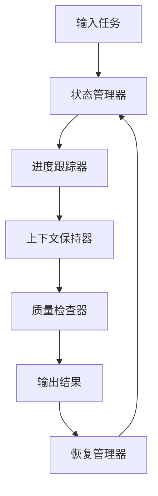

# 持续构建上下文系统

## Continuous Construction Context System

### 1. 系统概述

#### 1.1 设计目标

本系统旨在为形式科学体系的重构项目提供持续性的上下文保持和进度跟踪机制，确保在长时间、多阶段的工作中能够保持知识的一致性和连续性。

#### 1.2 核心功能

1. **上下文保持**: 维护项目状态和知识连续性
2. **进度跟踪**: 记录和监控重构进度
3. **中断恢复**: 支持工作中断后的快速恢复
4. **质量保证**: 确保内容的一致性和完整性

### 2. 系统架构

#### 2.1 核心组件

```text
持续构建上下文系统
├── 状态管理器 (State Manager)
├── 进度跟踪器 (Progress Tracker)
├── 上下文保持器 (Context Keeper)
├── 质量检查器 (Quality Checker)
└── 恢复管理器 (Recovery Manager)
```

#### 2.2 数据流



### 3. 状态管理

#### 3.1 项目状态定义

**定义 3.1.1 (项目状态)**
项目状态 $S$ 是一个五元组：
$$S = (P, C, Q, T, M)$$

其中：

- $P$ 是进度状态
- $C$ 是上下文状态
- $Q$ 是质量状态
- $T$ 是时间状态
- $M$ 是元数据状态

**定义 3.1.2 (状态转换)**
状态转换函数 $\delta: S \times A \rightarrow S$，其中 $A$ 是动作集合。

#### 3.2 状态表示

**示例 3.2.1 (Rust中的状态管理)**

```rust
use std::collections::HashMap;
use chrono::{DateTime, Utc};

#[derive(Debug, Clone)]
struct ProjectState {
    progress: ProgressState,
    context: ContextState,
    quality: QualityState,
    time: TimeState,
    metadata: MetadataState,
}

#[derive(Debug, Clone)]
struct ProgressState {
    completed_tasks: Vec<String>,
    current_task: Option<String>,
    pending_tasks: Vec<String>,
    completion_percentage: f64,
}

#[derive(Debug, Clone)]
struct ContextState {
    active_contexts: HashMap<String, Context>,
    context_stack: Vec<String>,
    global_context: GlobalContext,
}

#[derive(Debug, Clone)]
struct Context {
    name: String,
    description: String,
    variables: HashMap<String, String>,
    dependencies: Vec<String>,
    created_at: DateTime<Utc>,
    updated_at: DateTime<Utc>,
}

#[derive(Debug, Clone)]
struct GlobalContext {
    project_name: String,
    version: String,
    base_directory: String,
    configuration: HashMap<String, String>,
}

impl ProjectState {
    fn new(project_name: String, base_directory: String) -> Self {
        ProjectState {
            progress: ProgressState::new(),
            context: ContextState::new(project_name, base_directory),
            quality: QualityState::new(),
            time: TimeState::new(),
            metadata: MetadataState::new(),
        }
    }
    
    fn update_progress(&mut self, task: String, status: TaskStatus) {
        self.progress.update_task(task, status);
        self.time.record_activity();
    }
    
    fn push_context(&mut self, context: Context) {
        self.context.push_context(context);
    }
    
    fn pop_context(&mut self) -> Option<Context> {
        self.context.pop_context()
    }
    
    fn check_quality(&self) -> QualityReport {
        self.quality.check_all(&self)
    }
}
```

### 4. 进度跟踪

#### 4.1 进度模型

**定义 4.1.1 (任务)**
任务 $T$ 是一个四元组：
$$T = (id, description, status, dependencies)$$

**定义 4.1.2 (进度度量)**
进度度量函数 $\mu: \mathcal{T} \rightarrow [0,1]$，其中 $\mathcal{T}$ 是任务集合。

#### 4.2 进度跟踪实现

**示例 4.2.1 (进度跟踪系统)**

```rust
#[derive(Debug, Clone, PartialEq)]
enum TaskStatus {
    Pending,
    InProgress,
    Completed,
    Failed,
    Blocked,
}

#[derive(Debug, Clone)]
struct Task {
    id: String,
    description: String,
    status: TaskStatus,
    dependencies: Vec<String>,
    created_at: DateTime<Utc>,
    started_at: Option<DateTime<Utc>>,
    completed_at: Option<DateTime<Utc>>,
    estimated_duration: Option<std::time::Duration>,
    actual_duration: Option<std::time::Duration>,
}

impl Task {
    fn new(id: String, description: String) -> Self {
        Task {
            id,
            description,
            status: TaskStatus::Pending,
            dependencies: Vec::new(),
            created_at: Utc::now(),
            started_at: None,
            completed_at: None,
            estimated_duration: None,
            actual_duration: None,
        }
    }
    
    fn start(&mut self) -> Result<(), String> {
        if self.status != TaskStatus::Pending {
            return Err("Task is not in pending status".to_string());
        }
        
        self.status = TaskStatus::InProgress;
        self.started_at = Some(Utc::now());
        Ok(())
    }
    
    fn complete(&mut self) -> Result<(), String> {
        if self.status != TaskStatus::InProgress {
            return Err("Task is not in progress".to_string());
        }
        
        self.status = TaskStatus::Completed;
        self.completed_at = Some(Utc::now());
        
        if let Some(started) = self.started_at {
            self.actual_duration = Some(Utc::now() - started);
        }
        
        Ok(())
    }
    
    fn fail(&mut self, reason: String) {
        self.status = TaskStatus::Failed;
        // 记录失败原因
    }
}

struct ProgressTracker {
    tasks: HashMap<String, Task>,
    task_order: Vec<String>,
}

impl ProgressTracker {
    fn new() -> Self {
        ProgressTracker {
            tasks: HashMap::new(),
            task_order: Vec::new(),
        }
    }
    
    fn add_task(&mut self, task: Task) {
        let id = task.id.clone();
        self.tasks.insert(id.clone(), task);
        self.task_order.push(id);
    }
    
    fn get_ready_tasks(&self) -> Vec<&Task> {
        self.task_order
            .iter()
            .filter_map(|id| self.tasks.get(id))
            .filter(|task| {
                task.status == TaskStatus::Pending &&
                self.are_dependencies_completed(task)
            })
            .collect()
    }
    
    fn are_dependencies_completed(&self, task: &Task) -> bool {
        task.dependencies
            .iter()
            .all(|dep_id| {
                self.tasks.get(dep_id)
                    .map(|dep_task| dep_task.status == TaskStatus::Completed)
                    .unwrap_or(false)
            })
    }
    
    fn calculate_progress(&self) -> f64 {
        let total_tasks = self.tasks.len();
        if total_tasks == 0 {
            return 0.0;
        }
        
        let completed_tasks = self.tasks
            .values()
            .filter(|task| task.status == TaskStatus::Completed)
            .count();
        
        completed_tasks as f64 / total_tasks as f64
    }
    
    fn generate_report(&self) -> ProgressReport {
        ProgressReport {
            total_tasks: self.tasks.len(),
            completed_tasks: self.tasks.values()
                .filter(|t| t.status == TaskStatus::Completed)
                .count(),
            in_progress_tasks: self.tasks.values()
                .filter(|t| t.status == TaskStatus::InProgress)
                .count(),
            pending_tasks: self.tasks.values()
                .filter(|t| t.status == TaskStatus::Pending)
                .count(),
            failed_tasks: self.tasks.values()
                .filter(|t| t.status == TaskStatus::Failed)
                .count(),
            overall_progress: self.calculate_progress(),
        }
    }
}

#[derive(Debug)]
struct ProgressReport {
    total_tasks: usize,
    completed_tasks: usize,
    in_progress_tasks: usize,
    pending_tasks: usize,
    failed_tasks: usize,
    overall_progress: f64,
}
```

### 5. 上下文保持

#### 5.1 上下文模型

**定义 5.1.1 (上下文)**
上下文 $C$ 是一个六元组：
$$C = (name, scope, variables, state, history, metadata)$$

**定义 5.1.2 (上下文栈)**
上下文栈是一个后进先出的栈结构，用于管理嵌套的上下文。

#### 5.2 上下文管理实现

**示例 5.2.1 (上下文管理系统)**

```rust
#[derive(Debug, Clone)]
struct ContextManager {
    context_stack: Vec<Context>,
    global_variables: HashMap<String, String>,
    context_registry: HashMap<String, Context>,
}

impl ContextManager {
    fn new() -> Self {
        ContextManager {
            context_stack: Vec::new(),
            global_variables: HashMap::new(),
            context_registry: HashMap::new(),
        }
    }
    
    fn push_context(&mut self, context: Context) {
        self.context_stack.push(context);
    }
    
    fn pop_context(&mut self) -> Option<Context> {
        self.context_stack.pop()
    }
    
    fn get_current_context(&self) -> Option<&Context> {
        self.context_stack.last()
    }
    
    fn set_variable(&mut self, name: String, value: String) {
        if let Some(context) = self.context_stack.last_mut() {
            context.variables.insert(name, value);
        } else {
            self.global_variables.insert(name, value);
        }
    }
    
    fn get_variable(&self, name: &str) -> Option<&String> {
        // 从当前上下文开始，向上查找变量
        for context in self.context_stack.iter().rev() {
            if let Some(value) = context.variables.get(name) {
                return Some(value);
            }
        }
        self.global_variables.get(name)
    }
    
    fn save_context(&mut self, name: String) {
        if let Some(context) = self.context_stack.last() {
            self.context_registry.insert(name, context.clone());
        }
    }
    
    fn restore_context(&mut self, name: &str) -> Option<Context> {
        self.context_registry.get(name).cloned()
    }
    
    fn export_context(&self) -> ContextSnapshot {
        ContextSnapshot {
            context_stack: self.context_stack.clone(),
            global_variables: self.global_variables.clone(),
            timestamp: Utc::now(),
        }
    }
    
    fn import_context(&mut self, snapshot: ContextSnapshot) {
        self.context_stack = snapshot.context_stack;
        self.global_variables = snapshot.global_variables;
    }
}

#[derive(Debug, Clone)]
struct ContextSnapshot {
    context_stack: Vec<Context>,
    global_variables: HashMap<String, String>,
    timestamp: DateTime<Utc>,
}
```

### 6. 质量检查

#### 6.1 质量标准

**定义 6.1.1 (质量度量)**
质量度量函数 $Q: \mathcal{C} \rightarrow [0,1]$，其中 $\mathcal{C}$ 是内容集合。

**定义 6.1.2 (一致性检查)**
一致性检查函数 $C: \mathcal{C} \times \mathcal{C} \rightarrow \text{Bool}$。

#### 6.2 质量检查实现

**示例 6.2.1 (质量检查系统)**

```rust
#[derive(Debug, Clone)]
struct QualityChecker {
    rules: Vec<QualityRule>,
    checks: Vec<QualityCheck>,
}

#[derive(Debug, Clone)]
struct QualityRule {
    name: String,
    description: String,
    check_function: Box<dyn Fn(&Content) -> QualityResult>,
}

#[derive(Debug, Clone)]
struct QualityCheck {
    name: String,
    status: CheckStatus,
    result: Option<QualityResult>,
    timestamp: DateTime<Utc>,
}

#[derive(Debug, Clone)]
enum CheckStatus {
    Pending,
    Running,
    Passed,
    Failed,
    Warning,
}

#[derive(Debug, Clone)]
struct QualityResult {
    passed: bool,
    score: f64,
    issues: Vec<QualityIssue>,
    recommendations: Vec<String>,
}

#[derive(Debug, Clone)]
struct QualityIssue {
    severity: IssueSeverity,
    message: String,
    location: Option<String>,
    suggestion: Option<String>,
}

#[derive(Debug, Clone)]
enum IssueSeverity {
    Error,
    Warning,
    Info,
}

impl QualityChecker {
    fn new() -> Self {
        let mut checker = QualityChecker {
            rules: Vec::new(),
            checks: Vec::new(),
        };
        
        // 添加默认规则
        checker.add_rule(QualityRule {
            name: "consistency_check".to_string(),
            description: "Check content consistency".to_string(),
            check_function: Box::new(|content| {
                // 一致性检查实现
                QualityResult {
                    passed: true,
                    score: 1.0,
                    issues: Vec::new(),
                    recommendations: Vec::new(),
                }
            }),
        });
        
        checker.add_rule(QualityRule {
            name: "completeness_check".to_string(),
            description: "Check content completeness".to_string(),
            check_function: Box::new(|content| {
                // 完整性检查实现
                QualityResult {
                    passed: true,
                    score: 0.9,
                    issues: Vec::new(),
                    recommendations: vec!["Consider adding more examples".to_string()],
                }
            }),
        });
        
        checker
    }
    
    fn add_rule(&mut self, rule: QualityRule) {
        self.rules.push(rule);
    }
    
    fn check_content(&mut self, content: &Content) -> QualityReport {
        let mut results = Vec::new();
        
        for rule in &self.rules {
            let result = (rule.check_function)(content);
            results.push(result);
        }
        
        let overall_score = results.iter()
            .map(|r| r.score)
            .sum::<f64>() / results.len() as f64;
        
        let all_passed = results.iter().all(|r| r.passed);
        
        QualityReport {
            overall_score,
            passed: all_passed,
            results,
            timestamp: Utc::now(),
        }
    }
}

#[derive(Debug, Clone)]
struct QualityReport {
    overall_score: f64,
    passed: bool,
    results: Vec<QualityResult>,
    timestamp: DateTime<Utc>,
}

#[derive(Debug, Clone)]
struct Content {
    id: String,
    title: String,
    body: String,
    metadata: HashMap<String, String>,
    created_at: DateTime<Utc>,
    updated_at: DateTime<Utc>,
}
```

### 7. 恢复管理

#### 7.1 恢复策略

**定义 7.1.1 (检查点)**
检查点 $CP$ 是一个三元组：
$$CP = (state, timestamp, metadata)$$

**定义 7.1.2 (恢复操作)**
恢复操作 $R: CP \rightarrow S$，将检查点恢复到项目状态。

#### 7.2 恢复管理实现

**示例 7.2.1 (恢复管理系统)**

```rust
#[derive(Debug, Clone)]
struct RecoveryManager {
    checkpoints: Vec<Checkpoint>,
    auto_save_interval: std::time::Duration,
    max_checkpoints: usize,
}

#[derive(Debug, Clone)]
struct Checkpoint {
    id: String,
    state: ProjectState,
    timestamp: DateTime<Utc>,
    description: String,
    metadata: HashMap<String, String>,
}

impl RecoveryManager {
    fn new() -> Self {
        RecoveryManager {
            checkpoints: Vec::new(),
            auto_save_interval: std::time::Duration::from_secs(300), // 5分钟
            max_checkpoints: 10,
        }
    }
    
    fn create_checkpoint(&mut self, state: ProjectState, description: String) -> String {
        let id = format!("cp_{}", Utc::now().timestamp());
        
        let checkpoint = Checkpoint {
            id: id.clone(),
            state,
            timestamp: Utc::now(),
            description,
            metadata: HashMap::new(),
        };
        
        self.checkpoints.push(checkpoint);
        
        // 保持检查点数量在限制内
        if self.checkpoints.len() > self.max_checkpoints {
            self.checkpoints.remove(0);
        }
        
        id
    }
    
    fn restore_checkpoint(&self, checkpoint_id: &str) -> Option<ProjectState> {
        self.checkpoints
            .iter()
            .find(|cp| cp.id == checkpoint_id)
            .map(|cp| cp.state.clone())
    }
    
    fn list_checkpoints(&self) -> Vec<CheckpointInfo> {
        self.checkpoints
            .iter()
            .map(|cp| CheckpointInfo {
                id: cp.id.clone(),
                timestamp: cp.timestamp,
                description: cp.description.clone(),
            })
            .collect()
    }
    
    fn auto_save(&mut self, state: ProjectState) {
        let now = Utc::now();
        
        if let Some(last_checkpoint) = self.checkpoints.last() {
            let time_since_last = now - last_checkpoint.timestamp;
            if time_since_last.num_seconds() < self.auto_save_interval.as_secs() as i64 {
                return;
            }
        }
        
        self.create_checkpoint(state, "Auto-save".to_string());
    }
}

#[derive(Debug, Clone)]
struct CheckpointInfo {
    id: String,
    timestamp: DateTime<Utc>,
    description: String,
}
```

### 8. 系统集成

#### 8.1 主控制器

**示例 8.1.1 (系统主控制器)**

```rust
#[derive(Debug)]
struct ContextSystem {
    state_manager: ProjectState,
    progress_tracker: ProgressTracker,
    context_manager: ContextManager,
    quality_checker: QualityChecker,
    recovery_manager: RecoveryManager,
}

impl ContextSystem {
    fn new(project_name: String, base_directory: String) -> Self {
        ContextSystem {
            state_manager: ProjectState::new(project_name.clone(), base_directory.clone()),
            progress_tracker: ProgressTracker::new(),
            context_manager: ContextManager::new(),
            quality_checker: QualityChecker::new(),
            recovery_manager: RecoveryManager::new(),
        }
    }
    
    fn start_task(&mut self, task_id: String) -> Result<(), String> {
        // 创建任务上下文
        let context = Context {
            name: format!("task_{}", task_id),
            description: format!("Context for task {}", task_id),
            variables: HashMap::new(),
            dependencies: Vec::new(),
            created_at: Utc::now(),
            updated_at: Utc::now(),
        };
        
        self.context_manager.push_context(context);
        self.state_manager.update_progress(task_id.clone(), TaskStatus::InProgress);
        
        // 创建检查点
        self.recovery_manager.create_checkpoint(
            self.state_manager.clone(),
            format!("Started task {}", task_id)
        );
        
        Ok(())
    }
    
    fn complete_task(&mut self, task_id: String) -> Result<(), String> {
        // 更新进度
        self.state_manager.update_progress(task_id.clone(), TaskStatus::Completed);
        
        // 弹出任务上下文
        self.context_manager.pop_context();
        
        // 质量检查
        let quality_report = self.quality_checker.check_content(&self.get_current_content());
        
        // 创建检查点
        self.recovery_manager.create_checkpoint(
            self.state_manager.clone(),
            format!("Completed task {} with quality score {}", task_id, quality_report.overall_score)
        );
        
        Ok(())
    }
    
    fn get_current_content(&self) -> Content {
        // 从当前状态生成内容
        Content {
            id: "current".to_string(),
            title: "Current Project State".to_string(),
            body: format!("{:?}", self.state_manager),
            metadata: HashMap::new(),
            created_at: Utc::now(),
            updated_at: Utc::now(),
        }
    }
    
    fn generate_report(&self) -> SystemReport {
        SystemReport {
            progress: self.progress_tracker.generate_report(),
            quality: self.quality_checker.check_content(&self.get_current_content()),
            checkpoints: self.recovery_manager.list_checkpoints(),
            current_context: self.context_manager.get_current_context().cloned(),
            timestamp: Utc::now(),
        }
    }
    
    fn save_state(&self, file_path: &str) -> Result<(), String> {
        let snapshot = SystemSnapshot {
            state: self.state_manager.clone(),
            context: self.context_manager.export_context(),
            checkpoints: self.recovery_manager.checkpoints.clone(),
        };
        
        let json = serde_json::to_string_pretty(&snapshot)
            .map_err(|e| format!("Failed to serialize state: {}", e))?;
        
        std::fs::write(file_path, json)
            .map_err(|e| format!("Failed to write state file: {}", e))?;
        
        Ok(())
    }
    
    fn load_state(&mut self, file_path: &str) -> Result<(), String> {
        let json = std::fs::read_to_string(file_path)
            .map_err(|e| format!("Failed to read state file: {}", e))?;
        
        let snapshot: SystemSnapshot = serde_json::from_str(&json)
            .map_err(|e| format!("Failed to deserialize state: {}", e))?;
        
        self.state_manager = snapshot.state;
        self.context_manager.import_context(snapshot.context);
        self.recovery_manager.checkpoints = snapshot.checkpoints;
        
        Ok(())
    }
}

#[derive(Debug, Clone, serde::Serialize, serde::Deserialize)]
struct SystemSnapshot {
    state: ProjectState,
    context: ContextSnapshot,
    checkpoints: Vec<Checkpoint>,
}

#[derive(Debug)]
struct SystemReport {
    progress: ProgressReport,
    quality: QualityReport,
    checkpoints: Vec<CheckpointInfo>,
    current_context: Option<Context>,
    timestamp: DateTime<Utc>,
}
```

### 9. 使用示例

#### 9.1 基本使用流程

```rust
fn main() -> Result<(), String> {
    // 初始化系统
    let mut system = ContextSystem::new(
        "Formal Science Refactor".to_string(),
        "/docs/Refactor".to_string()
    );
    
    // 开始任务
    system.start_task("analyze_content".to_string())?;
    
    // 设置上下文变量
    system.context_manager.set_variable(
        "current_directory".to_string(),
        "/docs/Theory".to_string()
    );
    
    // 执行工作
    println!("Working on content analysis...");
    
    // 完成任务
    system.complete_task("analyze_content".to_string())?;
    
    // 生成报告
    let report = system.generate_report();
    println!("Progress: {:.1}%", report.progress.overall_progress * 100.0);
    println!("Quality Score: {:.1}", report.quality.overall_score);
    
    // 保存状态
    system.save_state("project_state.json")?;
    
    Ok(())
}
```

#### 9.2 中断恢复示例

```rust
fn resume_work() -> Result<(), String> {
    // 加载之前的状态
    let mut system = ContextSystem::new(
        "Formal Science Refactor".to_string(),
        "/docs/Refactor".to_string()
    );
    
    system.load_state("project_state.json")?;
    
    // 查看当前状态
    let report = system.generate_report();
    println!("Resuming work...");
    println!("Current progress: {:.1}%", report.progress.overall_progress * 100.0);
    
    // 继续工作
    system.start_task("continue_analysis".to_string())?;
    
    // ... 继续执行任务 ...
    
    Ok(())
}
```

### 10. 总结

持续构建上下文系统为形式科学体系重构项目提供了完整的上下文管理和进度跟踪解决方案：

1. **状态管理**确保项目状态的一致性和可追踪性
2. **进度跟踪**提供详细的进度监控和报告
3. **上下文保持**维护工作连续性和知识一致性
4. **质量检查**确保输出内容的质量和一致性
5. **恢复管理**支持工作中断后的快速恢复

这个系统为长期、复杂的重构项目提供了必要的工具和机制，确保项目能够持续、高效地进行。

---

**版本**: v1.0.0  
**更新时间**: 2024-12-19  
**维护者**: Formal Science Team
