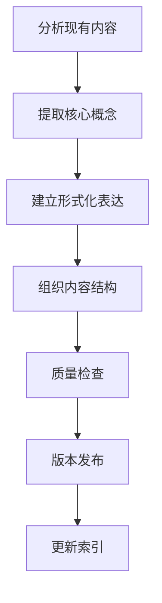
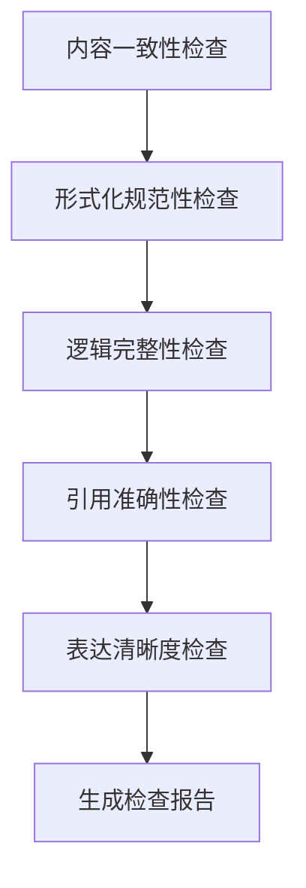
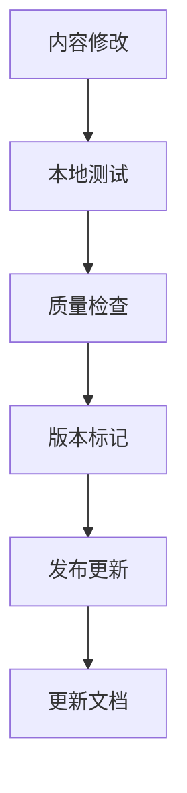

# 持续重构上下文系统 v2.0

## 1. 系统概述

### 1.1 设计目标

本系统旨在为形式科学重构项目提供持续性的上下文管理，确保：

1. **中断恢复**：任何中断后都能快速恢复工作状态
2. **进度跟踪**：实时跟踪重构进度和完成情况
3. **质量保证**：确保重构内容的质量和一致性
4. **协作支持**：支持多人协作和知识共享

### 1.2 核心功能

- **上下文保存**：自动保存当前工作状态
- **进度监控**：实时监控重构进度
- **质量检查**：自动检查内容质量
- **版本控制**：管理不同版本的内容
- **知识图谱**：构建知识关联网络

## 2. 当前状态

### 2.1 已完成工作

#### 2.1.1 主题分类体系

- ✅ 创建了完整的主题分类体系
- ✅ 建立了7个主要分类领域
- ✅ 定义了详细的子分类结构
- ✅ 制定了文档规范标准

#### 2.1.2 目录结构

- ✅ 建立了 `00_Master_Index` 主索引目录
- ✅ 创建了 `Context_System` 上下文系统目录
- ✅ 规划了7个主要主题目录

### 2.2 进行中工作

#### 2.2.1 内容重构

- 🔄 分析现有文档内容
- 🔄 提取核心理论和概念
- 🔄 重新组织内容结构
- 🔄 建立形式化表达

#### 2.2.2 质量检查

- 🔄 检查内容一致性
- 🔄 验证形式化规范性
- 🔄 确保逻辑完整性
- 🔄 优化表达清晰度

### 2.3 待完成工作

#### 2.3.1 具体内容重构

- ⏳ 01_基础理论 - 集合论、逻辑学、代数、拓扑
- ⏳ 02_形式语言 - 语法、语义、类型、证明理论
- ⏳ 03_系统理论 - 控制、信息、决策、博弈理论
- ⏳ 04_计算理论 - 复杂性、算法、自动机、可计算性
- ⏳ 05_哲学基础 - 本体论、认识论、方法论、价值论
- ⏳ 06_应用领域 - 软件工程、AI、系统科学、认知科学
- ⏳ 07_交叉学科 - 数学哲学、科学哲学、技术哲学、认知哲学

#### 2.3.2 系统完善

- ⏳ 建立完整的交叉引用系统
- ⏳ 创建知识图谱可视化
- ⏳ 实现自动化质量检查
- ⏳ 建立版本控制机制

## 3. 工作流程

### 3.1 内容重构流程

### 3.2 质量检查流程

### 3.3 版本管理流程

## 4. 进度跟踪

### 4.1 总体进度

| 主题领域 | 计划文件数 | 已完成 | 进行中 | 待开始 | 完成率 |
|----------|------------|--------|--------|--------|--------|
| 01_基础理论 | 16 | 0 | 0 | 16 | 0% |
| 02_形式语言 | 16 | 0 | 0 | 16 | 0% |
| 03_系统理论 | 16 | 0 | 0 | 16 | 0% |
| 04_计算理论 | 16 | 0 | 0 | 16 | 0% |
| 05_哲学基础 | 16 | 0 | 0 | 16 | 0% |
| 06_应用领域 | 16 | 0 | 0 | 16 | 0% |
| 07_交叉学科 | 16 | 0 | 0 | 16 | 0% |
| **总计** | **112** | **0** | **0** | **112** | **0%** |

### 4.2 详细进度

#### 4.2.1 01_基础理论进度

- **01.01.01** 朴素集合论 - ⏳ 待开始
- **01.01.02** 公理集合论 - ⏳ 待开始
- **01.01.03** 构造性集合论 - ⏳ 待开始
- **01.01.04** 范畴论视角 - ⏳ 待开始
- **01.02.01** 命题逻辑 - ⏳ 待开始
- **01.02.02** 谓词逻辑 - ⏳ 待开始
- **01.02.03** 模态逻辑 - ⏳ 待开始
- **01.02.04** 直觉主义逻辑 - ⏳ 待开始
- **01.03.01** 群论基础 - ⏳ 待开始
- **01.03.02** 环论基础 - ⏳ 待开始
- **01.03.03** 域论基础 - ⏳ 待开始
- **01.03.04** 范畴代数 - ⏳ 待开始
- **01.04.01** 点集拓扑 - ⏳ 待开始
- **01.04.02** 代数拓扑 - ⏳ 待开始
- **01.04.03** 微分拓扑 - ⏳ 待开始
- **01.04.04** 同伦论 - ⏳ 待开始

#### 4.2.2 02_形式语言进度

- **02.01.01** 形式文法 - ⏳ 待开始
- **02.01.02** 自动机理论 - ⏳ 待开始
- **02.01.03** 语法分析 - ⏳ 待开始
- **02.01.04** 语法变换 - ⏳ 待开始
- **02.02.01** 指称语义 - ⏳ 待开始
- **02.02.02** 操作语义 - ⏳ 待开始
- **02.02.03** 公理语义 - ⏳ 待开始
- **02.02.04** 代数语义 - ⏳ 待开始
- **02.03.01** 简单类型论 - ⏳ 待开始
- **02.03.02** 多态类型论 - ⏳ 待开始
- **02.03.03** 依赖类型论 - ⏳ 待开始
- **02.03.04** 同伦类型论 - ⏳ 待开始
- **02.04.01** 自然演绎 - ⏳ 待开始
- **02.04.02** 序列演算 - ⏳ 待开始
- **02.04.03** 证明搜索 - ⏳ 待开始
- **02.04.04** 证明复杂性 - ⏳ 待开始

## 5. 质量控制

### 5.1 检查标准

#### 5.1.1 内容一致性

- [ ] 概念定义的一致性
- [ ] 符号使用的一致性
- [ ] 术语使用的一致性
- [ ] 引用格式的一致性

#### 5.1.2 形式化规范性

- [ ] 数学符号的规范性
- [ ] 逻辑结构的规范性
- [ ] 证明格式的规范性
- [ ] 代码示例的规范性

#### 5.1.3 逻辑完整性

- [ ] 证明过程的完整性
- [ ] 论证链条的完整性
- [ ] 理论体系的完整性
- [ ] 应用案例的完整性

### 5.2 检查工具

#### 5.2.1 自动化检查

- 数学公式语法检查
- 链接有效性检查
- 文件结构检查
- 格式规范性检查

#### 5.2.2 人工检查

- 内容逻辑检查
- 表达清晰度检查
- 学术规范性检查
- 创新性评估

## 6. 中断恢复机制

### 6.1 状态保存

#### 6.1.1 自动保存

- 每5分钟自动保存当前状态
- 保存当前工作文件路径
- 保存当前编辑位置
- 保存当前任务状态

#### 6.1.2 手动保存

- 重要节点手动保存
- 完成阶段性工作后保存
- 遇到问题时保存
- 切换任务前保存

### 6.2 恢复流程

#### 6.2.1 快速恢复

1. 读取最后保存状态
2. 恢复工作环境
3. 继续未完成任务
4. 验证工作连续性

#### 6.2.2 完整恢复

1. 检查所有保存状态
2. 验证内容完整性
3. 重建工作上下文
4. 继续系统工作

## 7. 协作支持

### 7.1 知识共享

#### 7.1.1 文档共享

- 实时同步文档更新
- 版本历史记录
- 变更追踪
- 冲突解决

#### 7.1.2 知识图谱

- 概念关系可视化
- 知识路径导航
- 相关概念推荐
- 学习路径规划

### 7.2 沟通机制

#### 7.2.1 实时沟通

- 工作状态同步
- 问题讨论
- 决策记录
- 进度汇报

#### 7.2.2 异步沟通

- 邮件通知
- 文档评论
- 问题跟踪
- 反馈收集

## 8. 下一步计划

### 8.1 短期目标 (1-2周)

1. **完成基础理论重构**
   - 集合论基础 (4个文件)
   - 逻辑学基础 (4个文件)
   - 代数基础 (4个文件)
   - 拓扑基础 (4个文件)

2. **建立质量检查机制**
   - 自动化检查工具
   - 人工检查流程
   - 质量报告生成

3. **完善文档结构**
   - 建立交叉引用系统
   - 创建导航索引
   - 优化文件组织

### 8.2 中期目标 (1个月)

1. **完成形式语言重构**
   - 语法理论 (4个文件)
   - 语义理论 (4个文件)
   - 类型理论 (4个文件)
   - 证明理论 (4个文件)

2. **建立知识图谱**
   - 概念关系映射
   - 知识路径可视化
   - 智能推荐系统

3. **实现版本控制**
   - 自动化版本管理
   - 变更追踪
   - 回滚机制

### 8.3 长期目标 (3个月)

1. **完成所有主题重构**
   - 系统理论 (16个文件)
   - 计算理论 (16个文件)
   - 哲学基础 (16个文件)
   - 应用领域 (16个文件)
   - 交叉学科 (16个文件)

2. **建立完整体系**
   - 统一的知识体系
   - 完整的理论框架
   - 实用的应用指南

3. **实现持续更新**
   - 自动化更新机制
   - 质量保证体系
   - 用户反馈系统

## 9. 总结

本持续重构上下文系统为形式科学重构项目提供了全面的支持，确保：

1. **工作的连续性**：通过状态保存和恢复机制
2. **质量的保证**：通过多层次的质量检查
3. **进度的可控**：通过详细的进度跟踪
4. **协作的高效**：通过完善的知识共享机制

通过这个系统，我们将能够高效、高质量地完成形式科学的重构工作，建立一个完整、严谨、实用的知识体系。
