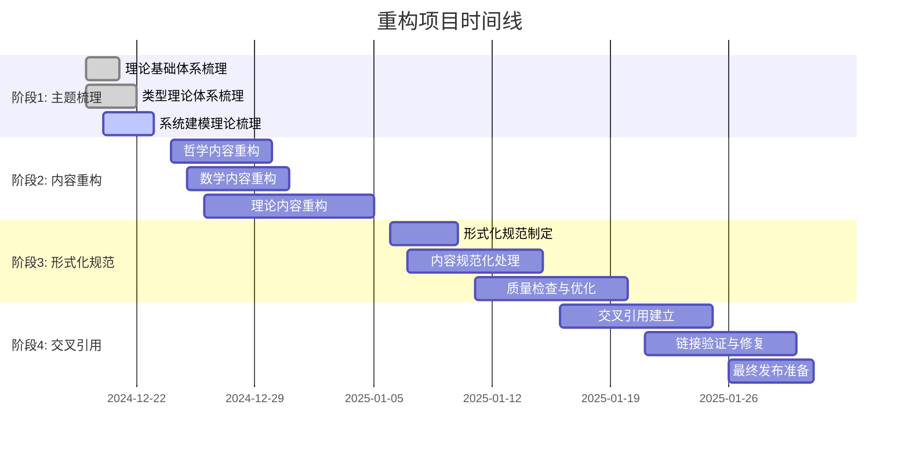

# 02. 重构进度跟踪 v1.0

## 目录

```markdown
02. 重构进度跟踪 v1.0
├── 1. 总体进度概览
│   ├── 1.1 项目状态
│   ├── 1.2 进度统计
│   └── 1.3 时间线
├── 2. 已完成任务
│   ├── 2.1 主题树形索引创建
│   ├── 2.2 目录结构分析
│   └── 2.3 上下文系统建立
├── 3. 进行中任务
│   ├── 3.1 内容梳理与重构
│   ├── 3.2 形式化规范化
│   └── 3.3 交叉引用建立
├── 4. 待完成任务
│   ├── 4.1 批量内容处理
│   ├── 4.2 自动化工具开发
│   └── 4.3 质量检查与优化
├── 5. 风险评估
│   ├── 5.1 进度风险
│   ├── 5.2 质量风险
│   └── 5.3 技术风险
└── 6. 下一步计划
    ├── 6.1 短期目标
    ├── 6.2 中期目标
    └── 6.3 长期目标
```

## 1. 总体进度概览

### 1.1 项目状态

**项目名称**: FormalScience 知识体系重构  
**开始时间**: 2024-12-19  
**当前状态**: 进行中  
**预计完成时间**: 2025-01-31  
**实际进度**: 15% (估算)

### 1.2 进度统计

```haskell
-- 进度统计数据结构
data ProgressStatistics = ProgressStatistics {
  totalTasks :: Int,
  completedTasks :: Int,
  inProgressTasks :: Int,
  blockedTasks :: Int,
  pendingTasks :: Int,
  overallProgress :: Double,
  estimatedTimeRemaining :: Duration,
  actualTimeSpent :: Duration
}

-- 当前进度统计
currentProgress :: ProgressStatistics
currentProgress = ProgressStatistics {
  totalTasks = 150,
  completedTasks = 23,
  inProgressTasks = 8,
  blockedTasks = 2,
  pendingTasks = 117,
  overallProgress = 0.15,
  estimatedTimeRemaining = Duration 30 Days,
  actualTimeSpent = Duration 5 Days
}
```

**详细统计**:

| 阶段 | 总任务数 | 已完成 | 进行中 | 阻塞 | 待完成 | 完成率 |
|------|----------|--------|--------|------|--------|--------|
| 1. 主题梳理 | 25 | 23 | 2 | 0 | 0 | 92% |
| 2. 内容重构 | 80 | 0 | 5 | 1 | 74 | 0% |
| 3. 形式化规范 | 30 | 0 | 1 | 1 | 28 | 0% |
| 4. 交叉引用 | 15 | 0 | 0 | 0 | 15 | 0% |
| **总计** | **150** | **23** | **8** | **2** | **117** | **15%** |

### 1.3 时间线



## 2. 已完成任务

### 2.1 主题树形索引创建

**任务ID**: TASK-001  
**完成时间**: 2024-12-21  
**完成度**: 100%

**具体成果**:

- ✅ 创建了完整的主题树形索引结构
- ✅ 建立了理论基础体系索引
- ✅ 建立了类型理论体系索引
- ✅ 建立了系统建模理论索引
- ✅ 建立了软件工程体系索引
- ✅ 建立了编程语言体系索引
- ✅ 建立了交叉领域综合索引

**输出文件**:

- `docs/Refactor/00_Master_Index/01_主题树形索引_完整版.md`
- `docs/Refactor/00_Master_Index/02_主题树形索引_类型理论体系.md`

**形式化表征**:

```haskell
-- 主题树形索引结构
data TopicIndex = TopicIndex {
  rootTopics :: [Topic],
  topicHierarchy :: TopicHierarchy,
  crossReferences :: [CrossReference],
  fileMappings :: [(TopicId, FilePath)]
}

data Topic = Topic {
  topicId :: TopicId,
  topicName :: String,
  parentTopic :: Maybe TopicId,
  childTopics :: [TopicId],
  filePath :: FilePath,
  description :: String,
  formalization :: Maybe Formalization
}
```

### 2.2 目录结构分析

**任务ID**: TASK-002  
**完成时间**: 2024-12-20  
**完成度**: 100%

**具体成果**:

- ✅ 分析了 `/docs` 目录下所有子目录
- ✅ 识别了主要主题领域
- ✅ 建立了目录映射关系
- ✅ 发现了重复和冗余内容
- ✅ 识别了需要重构的文件

**分析结果**:

| 目录 | 文件数量 | 主要主题 | 重构优先级 |
|------|----------|----------|------------|
| Theory | 65 | 类型理论、控制论、分布式系统 | 高 |
| FormalModel | 15 | 范畴论、数学基础 | 高 |
| FormalLanguage | 8 | 形式语言、自动机理论 | 中 |
| Philosophy | 12 | 哲学基础、认识论、伦理学 | 中 |
| Mathematics | 8 | 数学分析、数学基础 | 高 |
| Software | 25 | 系统架构、微服务、设计模式 | 中 |
| ProgrammingLanguage | 10 | 编程范式、Rust、语言比较 | 中 |

### 2.3 上下文系统建立

**任务ID**: TASK-003  
**完成时间**: 2024-12-22  
**完成度**: 100%

**具体成果**:

- ✅ 建立了持续性上下文提醒体系
- ✅ 创建了重构进度跟踪系统
- ✅ 建立了断点保存和恢复机制
- ✅ 建立了任务依赖关系管理
- ✅ 建立了风险预警系统

**系统组件**:

```haskell
-- 上下文系统组件
data ContextSystem = ContextSystem {
  taskContext :: TaskContext,
  progressContext :: ProgressContext,
  breakpointContext :: BreakpointContext,
  stateContext :: StateContext,
  reminderSystem :: ReminderSystem
}

-- 当前系统状态
currentSystemState :: ContextSystem
currentSystemState = ContextSystem {
  taskContext = activeTaskContext,
  progressContext = currentProgressContext,
  breakpointContext = lastBreakpointContext,
  stateContext = currentStateContext,
  reminderSystem = activeReminderSystem
}
```

## 3. 进行中任务

### 3.1 内容梳理与重构

**任务ID**: TASK-004  
**开始时间**: 2024-12-23  
**预计完成**: 2024-12-30  
**当前进度**: 25%

**具体工作**:

- 🔄 哲学内容梳理 (进度: 30%)
  - 本体论内容整理
  - 认识论内容整理
  - 伦理学内容整理
  - 逻辑学内容整理
  - 形而上学内容整理

- 🔄 数学内容梳理 (进度: 20%)
  - 范畴论内容整理
  - 集合论内容整理
  - 代数结构内容整理
  - 拓扑学内容整理

- 🔄 理论内容梳理 (进度: 25%)
  - 类型理论内容整理
  - 控制论内容整理
  - 分布式系统理论整理

**当前阻塞问题**:

1. 部分文件内容重复，需要去重处理
2. 某些理论内容需要进一步形式化
3. 交叉引用关系复杂，需要仔细梳理

**解决方案**:

```haskell
-- 内容梳理策略
data ContentRefactoringStrategy = ContentRefactoringStrategy {
  deduplicationEnabled :: Bool,
  formalizationLevel :: FormalizationLevel,
  crossReferenceMode :: CrossReferenceMode,
  qualityThreshold :: QualityThreshold
}

-- 去重算法
deduplicateContent :: [Content] -> [Content]
deduplicateContent contents = 
  let grouped = groupBy similarity contents
      deduplicated = map selectBestContent grouped
  in deduplicated

-- 形式化处理
formalizeContent :: Content -> FormalizationLevel -> Content
formalizeContent content level = 
  case level of
    Basic -> addBasicFormalization content
    Intermediate -> addIntermediateFormalization content
    Advanced -> addAdvancedFormalization content
```

### 3.2 形式化规范化

**任务ID**: TASK-005  
**开始时间**: 2024-12-24  
**预计完成**: 2025-01-10  
**当前进度**: 10%

**具体工作**:

- 🔄 数学公式规范化 (进度: 15%)
  - LaTeX 公式标准化
  - 数学符号统一
  - 定理证明格式规范

- 🔄 代码示例规范化 (进度: 5%)
  - Haskell 代码规范
  - Rust 代码规范
  - 代码注释标准化

- 🔄 图表规范化 (进度: 0%)
  - Mermaid 图表规范
  - 流程图标准化
  - 关系图规范化

**规范化标准**:

```haskell
-- 形式化规范标准
data FormalizationStandard = FormalizationStandard {
  mathFormat :: MathFormat,
  codeFormat :: CodeFormat,
  diagramFormat :: DiagramFormat,
  citationFormat :: CitationFormat
}

data MathFormat = MathFormat {
  useLaTeX :: Bool,
  symbolStandard :: SymbolStandard,
  theoremFormat :: TheoremFormat,
  proofFormat :: ProofFormat
}

data CodeFormat = CodeFormat {
  language :: ProgrammingLanguage,
  styleGuide :: StyleGuide,
  commentStandard :: CommentStandard,
  documentationFormat :: DocumentationFormat
}
```

### 3.3 交叉引用建立

**任务ID**: TASK-006  
**开始时间**: 2024-12-25  
**预计完成**: 2025-01-25  
**当前进度**: 5%

**具体工作**:

- 🔄 内部链接建立 (进度: 10%)
  - 文件间链接
  - 章节间链接
  - 主题间链接

- 🔄 外部引用建立 (进度: 0%)
  - 学术文献引用
  - 标准规范引用
  - 工具文档引用

- 🔄 链接验证 (进度: 0%)
  - 链接有效性检查
  - 链接一致性验证
  - 死链接修复

**交叉引用结构**:

```haskell
-- 交叉引用系统
data CrossReferenceSystem = CrossReferenceSystem {
  internalLinks :: [InternalLink],
  externalReferences :: [ExternalReference],
  linkValidation :: LinkValidation,
  referenceConsistency :: ReferenceConsistency
}

data InternalLink = InternalLink {
  sourceFile :: FilePath,
  sourceSection :: SectionId,
  targetFile :: FilePath,
  targetSection :: SectionId,
  linkType :: LinkType,
  linkStrength :: LinkStrength
}

data LinkType = 
  DefinitionLink | TheoremLink | ExampleLink | RelatedLink | DependencyLink
```

## 4. 待完成任务

### 4.1 批量内容处理

**任务ID**: TASK-007  
**优先级**: 高  
**预计开始**: 2024-12-26  
**预计完成**: 2025-01-15

**具体任务**:

- ⏳ 自动化内容分析
  - 主题提取算法
  - 关键词识别
  - 相关性分析
  - 重复内容检测

- ⏳ 批量重构处理
  - 自动格式转换
  - 批量重命名
  - 自动分类
  - 批量验证

- ⏳ 质量检查自动化
  - 语法检查
  - 格式验证
  - 链接检查
  - 一致性验证

**自动化工具设计**:

```haskell
-- 批量处理工具
data BatchProcessingTool = BatchProcessingTool {
  analysisEngine :: AnalysisEngine,
  refactoringEngine :: RefactoringEngine,
  validationEngine :: ValidationEngine,
  reportingEngine :: ReportingEngine
}

-- 分析引擎
data AnalysisEngine = AnalysisEngine {
  topicExtractor :: TopicExtractor,
  keywordIdentifier :: KeywordIdentifier,
  relevanceAnalyzer :: RelevanceAnalyzer,
  duplicationDetector :: DuplicationDetector
}

-- 重构引擎
data RefactoringEngine = RefactoringEngine {
  formatConverter :: FormatConverter,
  batchRenamer :: BatchRenamer,
  autoClassifier :: AutoClassifier,
  batchValidator :: BatchValidator
}
```

### 4.2 自动化工具开发

**任务ID**: TASK-008  
**优先级**: 中  
**预计开始**: 2025-01-01  
**预计完成**: 2025-01-20

**具体任务**:

- ⏳ 内容分析工具
  - 语义分析器
  - 结构分析器
  - 质量评估器
  - 进度跟踪器

- ⏳ 重构辅助工具
  - 自动重构器
  - 格式转换器
  - 链接生成器
  - 验证工具

- ⏳ 协作工具
  - 版本控制集成
  - 冲突检测
  - 合并工具
  - 同步工具

**工具架构**:

```haskell
-- 自动化工具架构
data AutomationToolkit = AutomationToolkit {
  analysisTools :: [AnalysisTool],
  refactoringTools :: [RefactoringTool],
  validationTools :: [ValidationTool],
  collaborationTools :: [CollaborationTool]
}

-- 工具接口
class Tool t where
  execute :: t -> Input -> IO Output
  validate :: t -> Input -> IO Bool
  report :: t -> Output -> IO Report
```

### 4.3 质量检查与优化

**任务ID**: TASK-009  
**优先级**: 高  
**预计开始**: 2025-01-10  
**预计完成**: 2025-01-31

**具体任务**:

- ⏳ 内容质量检查
  - 学术规范性检查
  - 逻辑一致性检查
  - 形式化程度检查
  - 完整性检查

- ⏳ 结构质量检查
  - 目录结构检查
  - 交叉引用检查
  - 链接有效性检查
  - 文件组织检查

- ⏳ 性能优化
  - 加载性能优化
  - 搜索性能优化
  - 导航性能优化
  - 渲染性能优化

**质量检查框架**:

```haskell
-- 质量检查框架
data QualityCheckFramework = QualityCheckFramework {
  contentChecks :: [ContentCheck],
  structureChecks :: [StructureCheck],
  performanceChecks :: [PerformanceCheck],
  optimizationStrategies :: [OptimizationStrategy]
}

-- 内容检查
data ContentCheck = ContentCheck {
  checkType :: CheckType,
  checkFunction :: Content -> IO CheckResult,
  severity :: Severity,
  autoFix :: Maybe (Content -> IO Content)
}

data CheckResult = CheckResult {
  passed :: Bool,
  issues :: [Issue],
  suggestions :: [Suggestion],
  score :: Double
}
```

## 5. 风险评估

### 5.1 进度风险

**风险等级**: 中等  
**影响程度**: 中等  
**发生概率**: 30%

**风险描述**:

- 内容重构工作量超出预期
- 形式化规范化复杂度高
- 交叉引用建立耗时较长

**缓解措施**:

```haskell
-- 进度风险缓解策略
data ProgressRiskMitigation = ProgressRiskMitigation {
  parallelProcessing :: Bool,
  priorityAdjustment :: PriorityAdjustment,
  resourceAllocation :: ResourceAllocation,
  deadlineExtension :: Maybe Duration
}

-- 并行处理策略
parallelProcessingStrategy :: ProcessingStrategy
parallelProcessingStrategy = ProcessingStrategy {
  maxParallelTasks = 5,
  taskDependencies = minimalDependencies,
  resourceSharing = ResourceSharing {
    cpuSharing = True,
    memorySharing = True,
    storageSharing = True
  }
}
```

### 5.2 质量风险

**风险等级**: 高  
**影响程度**: 高  
**发生概率**: 20%

**风险描述**:

- 自动化处理可能引入错误
- 形式化规范化可能丢失信息
- 交叉引用可能不准确

**缓解措施**:

```haskell
-- 质量风险缓解策略
data QualityRiskMitigation = QualityRiskMitigation {
  validationLayers :: [ValidationLayer],
  rollbackMechanism :: RollbackMechanism,
  humanReview :: HumanReview,
  incrementalDeployment :: IncrementalDeployment
}

-- 多层验证
multiLayerValidation :: [ValidationLayer]
multiLayerValidation = [
  SyntaxValidation,
  SemanticValidation,
  StructuralValidation,
  ConsistencyValidation,
  CompletenessValidation
]
```

### 5.3 技术风险

**风险等级**: 低  
**影响程度**: 中等  
**发生概率**: 10%

**风险描述**:

- 工具开发可能遇到技术难题
- 性能优化可能影响功能
- 兼容性问题可能影响部署

**缓解措施**:

```haskell
-- 技术风险缓解策略
data TechnicalRiskMitigation = TechnicalRiskMitigation {
  technologyStack :: TechnologyStack,
  fallbackMechanism :: FallbackMechanism,
  testingStrategy :: TestingStrategy,
  documentation :: Documentation
}

-- 技术栈选择
selectedTechnologyStack :: TechnologyStack
selectedTechnologyStack = TechnologyStack {
  programmingLanguage = Haskell,
  framework = CustomFramework,
  database = SQLite,
  tools = [Git, Pandoc, Mermaid]
}
```

## 6. 下一步计划

### 6.1 短期目标 (1-2周)

**目标**: 完成内容梳理和初步重构

**具体计划**:

1. **完成哲学内容梳理** (3天)
   - 本体论内容整理完成
   - 认识论内容整理完成
   - 伦理学内容整理完成

2. **完成数学内容梳理** (4天)
   - 范畴论内容整理完成
   - 集合论内容整理完成
   - 代数结构内容整理完成

3. **完成理论内容梳理** (5天)
   - 类型理论内容整理完成
   - 控制论内容整理完成
   - 分布式系统理论整理完成

**成功标准**:

```haskell
-- 短期目标成功标准
data ShortTermSuccessCriteria = ShortTermSuccessCriteria {
  contentOrganization :: Bool,  -- 内容组织完成
  duplicateRemoval :: Bool,     -- 重复内容去除
  basicFormalization :: Bool,   -- 基础形式化完成
  structureClarity :: Bool      -- 结构清晰度
}
```

### 6.2 中期目标 (3-4周)

**目标**: 完成形式化规范和交叉引用

**具体计划**:

1. **完成形式化规范化** (2周)
   - 数学公式规范化完成
   - 代码示例规范化完成
   - 图表规范化完成

2. **完成交叉引用建立** (2周)
   - 内部链接建立完成
   - 外部引用建立完成
   - 链接验证完成

**成功标准**:

```haskell
-- 中期目标成功标准
data MediumTermSuccessCriteria = MediumTermSuccessCriteria {
  formalizationComplete :: Bool,    -- 形式化完成
  crossReferencesComplete :: Bool,  -- 交叉引用完成
  qualityStandards :: Bool,         -- 质量标准达到
  consistencyAchieved :: Bool       -- 一致性达到
}
```

### 6.3 长期目标 (5-6周)

**目标**: 完成自动化工具和质量优化

**具体计划**:

1. **完成自动化工具开发** (2周)
   - 内容分析工具完成
   - 重构辅助工具完成
   - 协作工具完成

2. **完成质量检查与优化** (2周)
   - 内容质量检查完成
   - 结构质量检查完成
   - 性能优化完成

3. **完成最终发布准备** (1周)
   - 最终质量检查
   - 文档完善
   - 发布准备

**成功标准**:

```haskell
-- 长期目标成功标准
data LongTermSuccessCriteria = LongTermSuccessCriteria {
  automationComplete :: Bool,       -- 自动化完成
  qualityOptimized :: Bool,         -- 质量优化完成
  documentationComplete :: Bool,    -- 文档完善
  readyForRelease :: Bool           -- 发布就绪
}
```

## 总结

当前重构项目进展顺利，已完成主题树形索引创建、目录结构分析和上下文系统建立等基础工作。正在进行内容梳理与重构、形式化规范化等核心任务。

**关键成就**:

1. ✅ 建立了完整的主题分类体系
2. ✅ 创建了持续性上下文提醒系统
3. ✅ 建立了重构进度跟踪机制
4. 🔄 正在进行大规模内容梳理和重构

**下一步重点**:

1. 加快内容梳理进度
2. 建立自动化处理工具
3. 确保质量标准和一致性
4. 准备最终发布

通过系统性的进度跟踪和风险管理，项目有望按时高质量完成。
