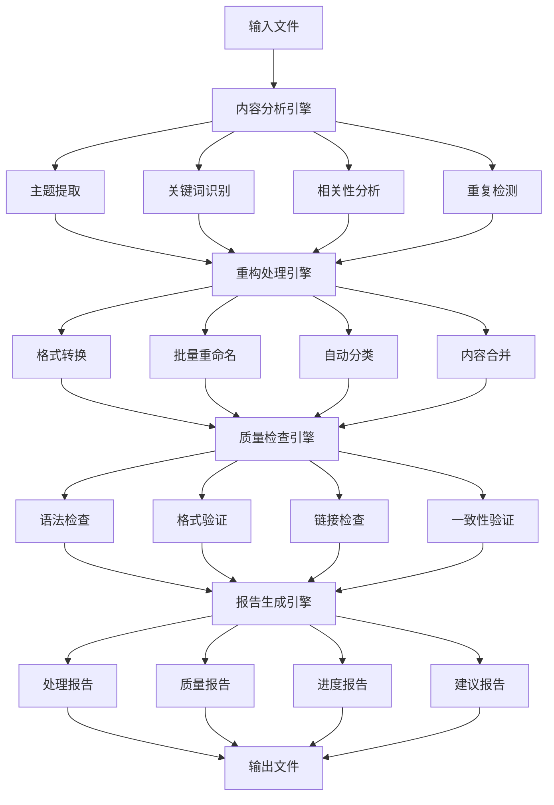

# 03. 批量内容处理工具 v1.0

## 目录

```markdown
03. 批量内容处理工具 v1.0
├── 1. 工具概述
│   ├── 1.1 设计目标
│   ├── 1.2 核心功能
│   └── 1.3 技术架构
├── 2. 内容分析引擎
│   ├── 2.1 主题提取
│   ├── 2.2 关键词识别
│   ├── 2.3 相关性分析
│   └── 2.4 重复检测
├── 3. 重构处理引擎
│   ├── 3.1 格式转换
│   ├── 3.2 批量重命名
│   ├── 3.3 自动分类
│   └── 3.4 内容合并
├── 4. 质量检查引擎
│   ├── 4.1 语法检查
│   ├── 4.2 格式验证
│   ├── 4.3 链接检查
│   └── 4.4 一致性验证
├── 5. 报告生成引擎
│   ├── 5.1 处理报告
│   ├── 5.2 质量报告
│   ├── 5.3 进度报告
│   └── 5.4 建议报告
└── 6. 使用指南
    ├── 6.1 配置说明
    ├── 6.2 操作流程
    ├── 6.3 最佳实践
    └── 6.4 故障排除
```

## 1. 工具概述

### 1.1 设计目标

批量内容处理工具旨在解决大规模知识重构过程中的以下挑战：

1. **效率提升**：自动化处理大量文件，减少人工工作量
2. **一致性保证**：确保所有内容遵循统一的格式和标准
3. **质量保证**：自动检测和修复常见问题
4. **可扩展性**：支持不同规模和类型的项目
5. **可追溯性**：记录所有处理操作，支持回滚和审计

### 1.2 核心功能

```haskell
-- 批量处理工具核心结构
data BatchProcessingTool = BatchProcessingTool {
  analysisEngine :: AnalysisEngine,
  refactoringEngine :: RefactoringEngine,
  validationEngine :: ValidationEngine,
  reportingEngine :: ReportingEngine,
  configuration :: ToolConfiguration
}

-- 工具配置
data ToolConfiguration = ToolConfiguration {
  inputDirectory :: FilePath,
  outputDirectory :: FilePath,
  processingMode :: ProcessingMode,
  qualityThreshold :: Double,
  maxParallelJobs :: Int,
  backupEnabled :: Bool,
  loggingEnabled :: Bool
}

data ProcessingMode = 
  AnalysisOnly      -- 仅分析
  | RefactoringOnly  -- 仅重构
  | ValidationOnly   -- 仅验证
  | FullProcessing   -- 完整处理
```

### 1.3 技术架构



## 2. 内容分析引擎

### 2.1 主题提取

主题提取算法从文档内容中自动识别和提取主题信息：

```haskell
-- 主题提取引擎
data TopicExtractionEngine = TopicExtractionEngine {
  extractionMethod :: ExtractionMethod,
  topicModel :: TopicModel,
  confidenceThreshold :: Double,
  maxTopics :: Int
}

data ExtractionMethod = 
  TFIDFBased      -- 基于TF-IDF
  | LDABased       -- 基于LDA
  | KeywordBased   -- 基于关键词
  | HybridMethod   -- 混合方法

-- 主题提取算法
extractTopics :: Document -> TopicExtractionEngine -> IO [Topic]
extractTopics doc engine = do
  case extractionMethod engine of
    TFIDFBased -> extractTopicsTFIDF doc engine
    LDABased -> extractTopicsLDA doc engine
    KeywordBased -> extractTopicsKeyword doc engine
    HybridMethod -> extractTopicsHybrid doc engine

-- TF-IDF主题提取
extractTopicsTFIDF :: Document -> TopicExtractionEngine -> IO [Topic]
extractTopicsTFIDF doc engine = do
  let words = tokenizeDocument doc
  let tfidfScores = calculateTFIDF words
  let topWords = takeTopWords tfidfScores (maxTopics engine)
  return $ map createTopic topWords

-- 主题结构
data Topic = Topic {
  topicId :: TopicId,
  topicName :: String,
  keywords :: [String],
  confidence :: Double,
  category :: TopicCategory,
  relatedTopics :: [TopicId]
}

data TopicCategory = 
  Philosophical | Mathematical | Theoretical | Technical | Applied
```

### 2.2 关键词识别

关键词识别算法从文档中提取重要的关键词和术语：

```haskell
-- 关键词识别引擎
data KeywordExtractionEngine = KeywordExtractionEngine {
  extractionAlgorithm :: KeywordAlgorithm,
  keywordDictionary :: KeywordDictionary,
  minFrequency :: Int,
  maxKeywords :: Int
}

data KeywordAlgorithm = 
  TextRank | RAKE | YAKE | CustomAlgorithm

-- 关键词提取
extractKeywords :: Document -> KeywordExtractionEngine -> IO [Keyword]
extractKeywords doc engine = do
  case extractionAlgorithm engine of
    TextRank -> extractKeywordsTextRank doc engine
    RAKE -> extractKeywordsRAKE doc engine
    YAKE -> extractKeywordsYAKE doc engine
    CustomAlgorithm -> extractKeywordsCustom doc engine

-- TextRank关键词提取
extractKeywordsTextRank :: Document -> KeywordExtractionEngine -> IO [Keyword]
extractKeywordsTextRank doc engine = do
  let sentences = splitIntoSentences doc
  let wordGraph = buildWordGraph sentences
  let scores = calculateTextRankScores wordGraph
  let topKeywords = selectTopKeywords scores (maxKeywords engine)
  return $ map createKeyword topKeywords

-- 关键词结构
data Keyword = Keyword {
  keywordId :: KeywordId,
  keywordText :: String,
  frequency :: Int,
  importance :: Double,
  context :: [String],
  synonyms :: [String]
}
```

### 2.3 相关性分析

相关性分析算法计算文档之间的相似度和关联关系：

```haskell
-- 相关性分析引擎
data RelevanceAnalysisEngine = RelevanceAnalysisEngine {
  similarityMetric :: SimilarityMetric,
  clusteringAlgorithm :: ClusteringAlgorithm,
  similarityThreshold :: Double,
  maxClusters :: Int
}

data SimilarityMetric = 
  CosineSimilarity | JaccardSimilarity | EuclideanDistance | CustomMetric

-- 相关性分析
analyzeRelevance :: [Document] -> RelevanceAnalysisEngine -> IO RelevanceAnalysis
analyzeRelevance docs engine = do
  let similarityMatrix = calculateSimilarityMatrix docs (similarityMetric engine)
  let clusters = clusterDocuments similarityMatrix (clusteringAlgorithm engine)
  let relationships = identifyRelationships docs similarityMatrix
  return RelevanceAnalysis {
    similarityMatrix = similarityMatrix,
    clusters = clusters,
    relationships = relationships
  }

-- 相似度计算
calculateSimilarityMatrix :: [Document] -> SimilarityMetric -> Matrix Double
calculateSimilarityMatrix docs metric = 
  let vectors = map documentToVector docs
  in case metric of
    CosineSimilarity -> cosineSimilarityMatrix vectors
    JaccardSimilarity -> jaccardSimilarityMatrix vectors
    EuclideanDistance -> euclideanDistanceMatrix vectors
    CustomMetric -> customSimilarityMatrix vectors

-- 相关性分析结果
data RelevanceAnalysis = RelevanceAnalysis {
  similarityMatrix :: Matrix Double,
  clusters :: [DocumentCluster],
  relationships :: [DocumentRelationship]
}

data DocumentCluster = DocumentCluster {
  clusterId :: ClusterId,
  documents :: [DocumentId],
  centroid :: Vector Double,
  cohesion :: Double
}

data DocumentRelationship = DocumentRelationship {
  sourceDoc :: DocumentId,
  targetDoc :: DocumentId,
  relationshipType :: RelationshipType,
  strength :: Double
}

data RelationshipType = 
  Similar | Related | Dependent | Referenced | Conflicting
```

### 2.4 重复检测

重复检测算法识别和标记重复或高度相似的内容：

```haskell
-- 重复检测引擎
data DuplicationDetectionEngine = DuplicationDetectionEngine {
  detectionMethod :: DetectionMethod,
  similarityThreshold :: Double,
  minDuplicateSize :: Int,
  maxDuplicateSize :: Int
}

data DetectionMethod = 
  ExactMatch | FuzzyMatch | SemanticMatch | StructuralMatch

-- 重复检测
detectDuplicates :: [Document] -> DuplicationDetectionEngine -> IO [DuplicateGroup]
detectDuplicates docs engine = do
  case detectionMethod engine of
    ExactMatch -> detectExactDuplicates docs engine
    FuzzyMatch -> detectFuzzyDuplicates docs engine
    SemanticMatch -> detectSemanticDuplicates docs engine
    StructuralMatch -> detectStructuralDuplicates docs engine

-- 模糊匹配重复检测
detectFuzzyDuplicates :: [Document] -> DuplicationDetectionEngine -> IO [DuplicateGroup]
detectFuzzyDuplicates docs engine = do
  let fingerprints = map calculateFingerprint docs
  let similarityGroups = groupBySimilarity fingerprints (similarityThreshold engine)
  let duplicateGroups = filterDuplicateGroups similarityGroups
  return $ map createDuplicateGroup duplicateGroups

-- 重复组结构
data DuplicateGroup = DuplicateGroup {
  groupId :: GroupId,
  documents :: [Document],
  similarity :: Double,
  primaryDocument :: Document,
  duplicateType :: DuplicateType,
  resolution :: DuplicateResolution
}

data DuplicateType = 
  ExactDuplicate | NearDuplicate | PartialDuplicate | StructuralDuplicate

data DuplicateResolution = 
  KeepPrimary | Merge | KeepAll | DeleteAll | ManualReview
```

## 3. 重构处理引擎

### 3.1 格式转换

格式转换引擎将文档从一种格式转换为另一种格式：

```haskell
-- 格式转换引擎
data FormatConversionEngine = FormatConversionEngine {
  sourceFormat :: DocumentFormat,
  targetFormat :: DocumentFormat,
  conversionRules :: [ConversionRule],
  preserveMetadata :: Bool
}

data DocumentFormat = 
  Markdown | HTML | LaTeX | PDF | Word | PlainText

-- 格式转换
convertFormat :: Document -> FormatConversionEngine -> IO Document
convertFormat doc engine = do
  let parsedDoc = parseDocument doc (sourceFormat engine)
  let convertedDoc = applyConversionRules parsedDoc (conversionRules engine)
  let finalDoc = formatDocument convertedDoc (targetFormat engine)
  return finalDoc

-- 转换规则
data ConversionRule = ConversionRule {
  ruleId :: RuleId,
  sourcePattern :: Pattern,
  targetPattern :: Pattern,
  condition :: Maybe Condition,
  priority :: Int
}

-- Markdown到LaTeX转换示例
markdownToLatexConversion :: [ConversionRule]
markdownToLatexConversion = [
  ConversionRule {
    ruleId = "heading1",
    sourcePattern = "# (.+)",
    targetPattern = "\\section{$1}",
    condition = Nothing,
    priority = 1
  },
  ConversionRule {
    ruleId = "heading2", 
    sourcePattern = "## (.+)",
    targetPattern = "\\subsection{$1}",
    condition = Nothing,
    priority = 1
  },
  ConversionRule {
    ruleId = "code",
    sourcePattern = "```(.+)\\n(.+)\\n```",
    targetPattern = "\\begin{lstlisting}[language=$1]\n$2\n\\end{lstlisting}",
    condition = Nothing,
    priority = 2
  }
]
```

### 3.2 批量重命名

批量重命名引擎根据规则自动重命名文件和目录：

```haskell
-- 批量重命名引擎
data BatchRenameEngine = BatchRenameEngine {
  renamePattern :: RenamePattern,
  namingConvention :: NamingConvention,
  conflictResolution :: ConflictResolution,
  dryRun :: Bool
}

data RenamePattern = RenamePattern {
  sourcePattern :: String,
  targetPattern :: String,
  variables :: [Variable]
}

data NamingConvention = 
  SnakeCase | CamelCase | PascalCase | KebabCase | CustomConvention

-- 批量重命名
batchRename :: [FilePath] -> BatchRenameEngine -> IO [RenameResult]
batchRename files engine = do
  let renameOperations = map (createRenameOperation engine) files
  let validatedOperations = validateRenameOperations renameOperations
  if dryRun engine
    then return $ map createDryRunResult validatedOperations
    else do
      results <- mapM executeRenameOperation validatedOperations
      return results

-- 重命名操作
data RenameOperation = RenameOperation {
  sourcePath :: FilePath,
  targetPath :: FilePath,
  operationType :: OperationType,
  backupPath :: Maybe FilePath
}

data OperationType = 
  FileRename | DirectoryRename | ExtensionChange | CaseChange

-- 执行重命名
executeRenameOperation :: RenameOperation -> IO RenameResult
executeRenameOperation operation = do
  -- 创建备份
  backupPath <- createBackup (sourcePath operation)
  
  -- 执行重命名
  success <- renameFile (sourcePath operation) (targetPath operation)
  
  return RenameResult {
    operation = operation,
    success = success,
    backupPath = backupPath,
    errorMessage = if success then Nothing else Just "Rename failed"
  }
```

### 3.3 自动分类

自动分类引擎根据内容特征将文档分类到合适的目录：

```haskell
-- 自动分类引擎
data AutoClassificationEngine = AutoClassificationEngine {
  classificationMethod :: ClassificationMethod,
  categoryHierarchy :: CategoryHierarchy,
  confidenceThreshold :: Double,
  fallbackCategory :: Category
}

data ClassificationMethod = 
  RuleBased | MLBased | Hybrid | CustomClassification

-- 自动分类
autoClassify :: Document -> AutoClassificationEngine -> IO ClassificationResult
autoClassify doc engine = do
  case classificationMethod engine of
    RuleBased -> classifyByRules doc engine
    MLBased -> classifyByML doc engine
    Hybrid -> classifyHybrid doc engine
    CustomClassification -> classifyCustom doc engine

-- 基于规则的分类
classifyByRules :: Document -> AutoClassificationEngine -> IO ClassificationResult
classifyByRules doc engine = do
  let features = extractFeatures doc
  let rules = getClassificationRules (categoryHierarchy engine)
  let matches = findMatchingRules features rules
  let bestMatch = selectBestMatch matches (confidenceThreshold engine)
  return ClassificationResult {
    document = doc,
    assignedCategory = bestMatch,
    confidence = calculateConfidence bestMatch,
    alternativeCategories = getAlternatives matches
  }

-- 分类规则
data ClassificationRule = ClassificationRule {
  ruleId :: RuleId,
  category :: Category,
  conditions :: [Condition],
  weight :: Double,
  priority :: Int
}

data Condition = Condition {
  feature :: String,
  operator :: Operator,
  value :: String,
  caseSensitive :: Bool
}

data Operator = 
  Equals | Contains | StartsWith | EndsWith | Regex | GreaterThan | LessThan

-- 分类结果
data ClassificationResult = ClassificationResult {
  document :: Document,
  assignedCategory :: Category,
  confidence :: Double,
  alternativeCategories :: [Category],
  reasoning :: String
}
```

### 3.4 内容合并

内容合并引擎将相关或重复的内容合并为统一的文档：

```haskell
-- 内容合并引擎
data ContentMergeEngine = ContentMergeEngine {
  mergeStrategy :: MergeStrategy,
  conflictResolution :: ConflictResolution,
  preserveHistory :: Bool,
  mergeValidation :: MergeValidation
}

data MergeStrategy = 
  Append | Overwrite | SmartMerge | CustomMerge

-- 内容合并
mergeContent :: [Document] -> ContentMergeEngine -> IO MergeResult
mergeContent docs engine = do
  case mergeStrategy engine of
    Append -> mergeAppend docs engine
    Overwrite -> mergeOverwrite docs engine
    SmartMerge -> mergeSmart docs engine
    CustomMerge -> mergeCustom docs engine

-- 智能合并
mergeSmart :: [Document] -> ContentMergeEngine -> IO MergeResult
mergeSmart docs engine = do
  let analysis = analyzeDocuments docs
  let conflicts = detectConflicts analysis
  let resolvedConflicts = resolveConflicts conflicts (conflictResolution engine)
  let mergedContent = createMergedContent docs resolvedConflicts
  let validation = validateMerge mergedContent (mergeValidation engine)
  return MergeResult {
    mergedDocument = mergedContent,
    conflicts = conflicts,
    resolution = resolvedConflicts,
    validation = validation
  }

-- 冲突检测
detectConflicts :: DocumentAnalysis -> [Conflict]
detectConflicts analysis = 
  let structuralConflicts = detectStructuralConflicts analysis
      contentConflicts = detectContentConflicts analysis
      metadataConflicts = detectMetadataConflicts analysis
  in structuralConflicts ++ contentConflicts ++ metadataConflicts

-- 冲突解决
resolveConflicts :: [Conflict] -> ConflictResolution -> [ResolvedConflict]
resolveConflicts conflicts resolution = 
  map (resolveConflict resolution) conflicts

-- 合并结果
data MergeResult = MergeResult {
  mergedDocument :: Document,
  conflicts :: [Conflict],
  resolution :: [ResolvedConflict],
  validation :: ValidationResult
}

data Conflict = Conflict {
  conflictId :: ConflictId,
  conflictType :: ConflictType,
  sourceDocuments :: [DocumentId],
  description :: String,
  severity :: ConflictSeverity
}

data ResolvedConflict = ResolvedConflict {
  conflict :: Conflict,
  resolution :: Resolution,
  applied :: Bool
}
```

## 4. 质量检查引擎

### 4.1 语法检查

语法检查引擎检查文档的语法正确性：

```haskell
-- 语法检查引擎
data GrammarCheckEngine = GrammarCheckEngine {
  language :: Language,
  grammarRules :: [GrammarRule],
  ignorePatterns :: [Pattern],
  severityLevel :: SeverityLevel
}

data Language = 
  English | Chinese | Mixed | CustomLanguage

-- 语法检查
checkGrammar :: Document -> GrammarCheckEngine -> IO GrammarCheckResult
checkGrammar doc engine = do
  let sentences = splitIntoSentences doc
  let grammarErrors = checkSentences sentences (grammarRules engine)
  let filteredErrors = filterErrors grammarErrors (ignorePatterns engine)
  let categorizedErrors = categorizeErrors filteredErrors
  return GrammarCheckResult {
    document = doc,
    errors = categorizedErrors,
    score = calculateGrammarScore categorizedErrors,
    suggestions = generateSuggestions categorizedErrors
  }

-- 语法规则
data GrammarRule = GrammarRule {
  ruleId :: RuleId,
  pattern :: Pattern,
  errorMessage :: String,
  suggestion :: String,
  severity :: Severity
}

-- 语法错误
data GrammarError = GrammarError {
  errorId :: ErrorId,
  rule :: GrammarRule,
  location :: Location,
  context :: String,
  severity :: Severity
}

data Location = Location {
  line :: Int,
  column :: Int,
  length :: Int
}

-- 语法检查结果
data GrammarCheckResult = GrammarCheckResult {
  document :: Document,
  errors :: [GrammarError],
  score :: Double,
  suggestions :: [Suggestion]
}
```

### 4.2 格式验证

格式验证引擎检查文档是否符合指定的格式标准：

```haskell
-- 格式验证引擎
data FormatValidationEngine = FormatValidationEngine {
  formatStandard :: FormatStandard,
  validationRules :: [ValidationRule],
  strictMode :: Bool,
  autoFix :: Bool
}

data FormatStandard = 
  MarkdownStandard | LaTeXStandard | HTMLStandard | CustomStandard

-- 格式验证
validateFormat :: Document -> FormatValidationEngine -> IO FormatValidationResult
validateFormat doc engine = do
  let structureValidation = validateStructure doc (formatStandard engine)
  let styleValidation = validateStyle doc (validationRules engine)
  let consistencyValidation = validateConsistency doc
  let combinedResults = combineValidationResults [
        structureValidation,
        styleValidation,
        consistencyValidation
      ]
  let fixedDocument = if autoFix engine 
    then applyAutoFixes doc combinedResults
    else doc
  return FormatValidationResult {
    document = fixedDocument,
    validationResults = combinedResults,
    passed = allValidationPassed combinedResults,
    fixes = getAppliedFixes combinedResults
  }

-- 验证规则
data ValidationRule = ValidationRule {
  ruleId :: RuleId,
  ruleType :: RuleType,
  condition :: Condition,
  errorMessage :: String,
  autoFix :: Maybe AutoFix
}

data RuleType = 
  StructureRule | StyleRule | ConsistencyRule | CustomRule

-- 自动修复
data AutoFix = AutoFix {
  fixId :: FixId,
  description :: String,
  applyFix :: Document -> IO Document,
  confidence :: Double
}

-- 格式验证结果
data FormatValidationResult = FormatValidationResult {
  document :: Document,
  validationResults :: [ValidationResult],
  passed :: Bool,
  fixes :: [AppliedFix]
}

data ValidationResult = ValidationResult {
  rule :: ValidationRule,
  passed :: Bool,
  errors :: [ValidationError],
  warnings :: [ValidationWarning]
}
```

### 4.3 链接检查

链接检查引擎验证文档中的链接有效性：

```haskell
-- 链接检查引擎
data LinkCheckEngine = LinkCheckEngine {
  checkTypes :: [LinkType],
  timeout :: Duration,
  maxRedirects :: Int,
  ignorePatterns :: [Pattern]
}

data LinkType = 
  InternalLink | ExternalLink | ImageLink | ReferenceLink

-- 链接检查
checkLinks :: Document -> LinkCheckEngine -> IO LinkCheckResult
checkLinks doc engine = do
  let links = extractLinks doc
  let filteredLinks = filterLinks links (checkTypes engine)
  let linkResults = mapM (checkLink engine) filteredLinks
  let summary = summarizeLinkResults linkResults
  return LinkCheckResult {
    document = doc,
    linkResults = linkResults,
    summary = summary,
    brokenLinks = filterBrokenLinks linkResults
  }

-- 链接检查
checkLink :: LinkCheckEngine -> Link -> IO LinkResult
checkLink engine link = do
  case linkType link of
    InternalLink -> checkInternalLink link
    ExternalLink -> checkExternalLink link engine
    ImageLink -> checkImageLink link
    ReferenceLink -> checkReferenceLink link

-- 外部链接检查
checkExternalLink :: Link -> LinkCheckEngine -> IO LinkResult
checkExternalLink link engine = do
  let url = linkUrl link
  result <- withTimeout (timeout engine) $ do
    response <- httpGet url (maxRedirects engine)
    return $ validateResponse response
  return LinkResult {
    link = link,
    status = result,
    responseTime = getResponseTime result,
    errorMessage = getErrorMessage result
  }

-- 链接结果
data LinkResult = LinkResult {
  link :: Link,
  status :: LinkStatus,
  responseTime :: Maybe Duration,
  errorMessage :: Maybe String
}

data LinkStatus = 
  Valid | Broken | Timeout | Redirected | AccessDenied | Unknown

-- 链接检查结果
data LinkCheckResult = LinkCheckResult {
  document :: Document,
  linkResults :: [LinkResult],
  summary :: LinkSummary,
  brokenLinks :: [Link]
}

data LinkSummary = LinkSummary {
  totalLinks :: Int,
  validLinks :: Int,
  brokenLinks :: Int,
  averageResponseTime :: Maybe Duration
}
```

### 4.4 一致性验证

一致性验证引擎检查文档集合的一致性和完整性：

```haskell
-- 一致性验证引擎
data ConsistencyValidationEngine = ConsistencyValidationEngine {
  consistencyRules :: [ConsistencyRule],
  referenceData :: ReferenceData,
  tolerance :: Double,
  crossValidation :: Bool
}

-- 一致性验证
validateConsistency :: [Document] -> ConsistencyValidationEngine -> IO ConsistencyValidationResult
validateConsistency docs engine = do
  let structuralConsistency = validateStructuralConsistency docs
  let contentConsistency = validateContentConsistency docs (consistencyRules engine)
  let referenceConsistency = validateReferenceConsistency docs (referenceData engine)
  let crossValidation = if crossValidation engine
    then performCrossValidation docs
    else CrossValidationResult { passed = True, issues = [] }
  return ConsistencyValidationResult {
    documents = docs,
    structuralConsistency = structuralConsistency,
    contentConsistency = contentConsistency,
    referenceConsistency = referenceConsistency,
    crossValidation = crossValidation,
    overallConsistency = calculateOverallConsistency [
      structuralConsistency,
      contentConsistency,
      referenceConsistency,
      crossValidation
    ]
  }

-- 一致性规则
data ConsistencyRule = ConsistencyRule {
  ruleId :: RuleId,
  ruleType :: ConsistencyRuleType,
  condition :: Condition,
  tolerance :: Double,
  severity :: Severity
}

data ConsistencyRuleType = 
  NamingConsistency | FormatConsistency | ContentConsistency | ReferenceConsistency

-- 一致性验证结果
data ConsistencyValidationResult = ConsistencyValidationResult {
  documents :: [Document],
  structuralConsistency :: ConsistencyResult,
  contentConsistency :: ConsistencyResult,
  referenceConsistency :: ConsistencyResult,
  crossValidation :: CrossValidationResult,
  overallConsistency :: Double
}

data ConsistencyResult = ConsistencyResult {
  passed :: Bool,
  score :: Double,
  issues :: [ConsistencyIssue],
  suggestions :: [Suggestion]
}

data ConsistencyIssue = ConsistencyIssue {
  issueId :: IssueId,
  rule :: ConsistencyRule,
  location :: [Location],
  description :: String,
  severity :: Severity
}
```

## 5. 报告生成引擎

### 5.1 处理报告

处理报告生成引擎创建详细的处理过程报告：

```haskell
-- 处理报告生成引擎
data ProcessingReportEngine = ProcessingReportEngine {
  reportFormat :: ReportFormat,
  includeDetails :: Bool,
  includeStatistics :: Bool,
  includeRecommendations :: Bool
}

data ReportFormat = 
  Markdown | HTML | PDF | JSON | XML

-- 生成处理报告
generateProcessingReport :: ProcessingResult -> ProcessingReportEngine -> IO ProcessingReport
generateProcessingReport result engine = do
  let summary = createProcessingSummary result
  let details = if includeDetails engine
    then createProcessingDetails result
    else []
  let statistics = if includeStatistics engine
    then createProcessingStatistics result
    else emptyStatistics
  let recommendations = if includeRecommendations engine
    then createRecommendations result
    else []
  return ProcessingReport {
    summary = summary,
    details = details,
    statistics = statistics,
    recommendations = recommendations,
    format = reportFormat engine
  }

-- 处理摘要
data ProcessingSummary = ProcessingSummary {
  totalFiles :: Int,
  processedFiles :: Int,
  successfulFiles :: Int,
  failedFiles :: Int,
  processingTime :: Duration,
  overallSuccess :: Bool
}

-- 处理详情
data ProcessingDetail = ProcessingDetail {
  filePath :: FilePath,
  operation :: ProcessingOperation,
  status :: ProcessingStatus,
  duration :: Duration,
  errors :: [ProcessingError],
  warnings :: [ProcessingWarning]
}

-- 处理统计
data ProcessingStatistics = ProcessingStatistics {
  fileSizeDistribution :: Distribution,
  processingTimeDistribution :: Distribution,
  errorRate :: Double,
  successRate :: Double,
  performanceMetrics :: PerformanceMetrics
}

-- 处理报告
data ProcessingReport = ProcessingReport {
  summary :: ProcessingSummary,
  details :: [ProcessingDetail],
  statistics :: ProcessingStatistics,
  recommendations :: [Recommendation],
  format :: ReportFormat
}
```

### 5.2 质量报告

质量报告生成引擎创建内容质量评估报告：

```haskell
-- 质量报告生成引擎
data QualityReportEngine = QualityReportEngine {
  qualityMetrics :: [QualityMetric],
  scoringMethod :: ScoringMethod,
  benchmarkData :: BenchmarkData,
  visualizationEnabled :: Bool
}

-- 生成质量报告
generateQualityReport :: QualityCheckResult -> QualityReportEngine -> IO QualityReport
generateQualityReport result engine = do
  let qualityScores = calculateQualityScores result (qualityMetrics engine)
  let benchmarkComparison = compareWithBenchmark qualityScores (benchmarkData engine)
  let visualizations = if visualizationEnabled engine
    then createQualityVisualizations qualityScores
    else []
  return QualityReport {
    qualityScores = qualityScores,
    benchmarkComparison = benchmarkComparison,
    visualizations = visualizations,
    recommendations = generateQualityRecommendations qualityScores
  }

-- 质量指标
data QualityMetric = QualityMetric {
  metricId :: MetricId,
  metricName :: String,
  calculation :: QualityCalculation,
  weight :: Double,
  threshold :: Double
}

data QualityCalculation = 
  GrammarScore | FormatScore | ConsistencyScore | CompletenessScore | CustomScore

-- 质量分数
data QualityScore = QualityScore {
  metric :: QualityMetric,
  score :: Double,
  details :: [ScoreDetail],
  improvement :: [ImprovementSuggestion]
}

-- 质量报告
data QualityReport = QualityReport {
  qualityScores :: [QualityScore],
  benchmarkComparison :: BenchmarkComparison,
  visualizations :: [Visualization],
  recommendations :: [QualityRecommendation]
}
```

### 5.3 进度报告

进度报告生成引擎创建项目进度跟踪报告：

```haskell
-- 进度报告生成引擎
data ProgressReportEngine = ProgressReportEngine {
  progressMetrics :: [ProgressMetric],
  timeTracking :: Bool,
  milestoneTracking :: Bool,
  trendAnalysis :: Bool
}

-- 生成进度报告
generateProgressReport :: ProgressData -> ProgressReportEngine -> IO ProgressReport
generateProgressReport data engine = do
  let currentProgress = calculateCurrentProgress data (progressMetrics engine)
  let timeAnalysis = if timeTracking engine
    then analyzeTimeProgress data
    else emptyTimeAnalysis
  let milestoneStatus = if milestoneTracking engine
    then checkMilestoneStatus data
    else []
  let trends = if trendAnalysis engine
    then analyzeProgressTrends data
    else []
  return ProgressReport {
    currentProgress = currentProgress,
    timeAnalysis = timeAnalysis,
    milestoneStatus = milestoneStatus,
    trends = trends,
    predictions = predictFutureProgress data
  }

-- 进度指标
data ProgressMetric = ProgressMetric {
  metricId :: MetricId,
  metricName :: String,
  calculation :: ProgressCalculation,
  target :: Double,
  current :: Double
}

-- 进度报告
data ProgressReport = ProgressReport {
  currentProgress :: ProgressSummary,
  timeAnalysis :: TimeAnalysis,
  milestoneStatus :: [MilestoneStatus],
  trends :: [ProgressTrend],
  predictions :: ProgressPrediction
}
```

### 5.4 建议报告

建议报告生成引擎基于分析结果生成改进建议：

```haskell
-- 建议报告生成引擎
data RecommendationReportEngine = RecommendationReportEngine {
  recommendationTypes :: [RecommendationType],
  priorityCalculation :: PriorityCalculation,
  implementationGuidance :: Bool,
  costBenefitAnalysis :: Bool
}

-- 生成建议报告
generateRecommendationReport :: AnalysisResult -> RecommendationReportEngine -> IO RecommendationReport
generateRecommendationReport result engine = do
  let recommendations = generateRecommendations result (recommendationTypes engine)
  let prioritizedRecommendations = prioritizeRecommendations recommendations (priorityCalculation engine)
  let implementationGuides = if implementationGuidance engine
    then createImplementationGuides prioritizedRecommendations
    else []
  let costBenefitAnalysis = if costBenefitAnalysis engine
    then analyzeCostBenefit prioritizedRecommendations
    else []
  return RecommendationReport {
    recommendations = prioritizedRecommendations,
    implementationGuides = implementationGuides,
    costBenefitAnalysis = costBenefitAnalysis,
    summary = createRecommendationSummary prioritizedRecommendations
  }

-- 建议类型
data RecommendationType = 
  ContentImprovement | StructureOptimization | QualityEnhancement | ProcessOptimization

-- 建议
data Recommendation = Recommendation {
  recommendationId :: RecommendationId,
  type :: RecommendationType,
  title :: String,
  description :: String,
  priority :: Priority,
  effort :: Effort,
  impact :: Impact,
  implementation :: ImplementationGuide
}

-- 建议报告
data RecommendationReport = RecommendationReport {
  recommendations :: [Recommendation],
  implementationGuides :: [ImplementationGuide],
  costBenefitAnalysis :: [CostBenefitAnalysis],
  summary :: RecommendationSummary
}
```

## 6. 使用指南

### 6.1 配置说明

```haskell
-- 工具配置示例
defaultConfiguration :: ToolConfiguration
defaultConfiguration = ToolConfiguration {
  inputDirectory = "./docs",
  outputDirectory = "./docs/Refactor",
  processingMode = FullProcessing,
  qualityThreshold = 0.8,
  maxParallelJobs = 4,
  backupEnabled = True,
  loggingEnabled = True
}

-- 配置验证
validateConfiguration :: ToolConfiguration -> IO Bool
validateConfiguration config = do
  inputExists <- directoryExists (inputDirectory config)
  outputWritable <- isWritable (outputDirectory config)
  return $ inputExists && outputWritable
```

### 6.2 操作流程

```haskell
-- 主要操作流程
mainProcessingWorkflow :: ToolConfiguration -> IO ProcessingResult
mainProcessingWorkflow config = do
  -- 1. 初始化
  tool <- initializeTool config
  
  -- 2. 分析阶段
  analysisResult <- runAnalysis tool
  
  -- 3. 重构阶段
  refactoringResult <- runRefactoring tool analysisResult
  
  -- 4. 验证阶段
  validationResult <- runValidation tool refactoringResult
  
  -- 5. 报告生成
  report <- generateReport tool validationResult
  
  return ProcessingResult {
    analysis = analysisResult,
    refactoring = refactoringResult,
    validation = validationResult,
    report = report
  }
```

### 6.3 最佳实践

1. **备份策略**：始终启用备份功能，定期创建检查点
2. **渐进式处理**：先处理小批量文件，验证结果后再处理大批量
3. **质量优先**：设置较高的质量阈值，确保输出质量
4. **监控进度**：定期检查处理进度，及时调整策略
5. **错误处理**：仔细分析错误报告，修复根本问题

### 6.4 故障排除

```haskell
-- 常见问题诊断
diagnoseCommonIssues :: ProcessingResult -> [Diagnosis]
diagnoseCommonIssues result = 
  let memoryIssues = diagnoseMemoryIssues result
      performanceIssues = diagnosePerformanceIssues result
      qualityIssues = diagnoseQualityIssues result
      consistencyIssues = diagnoseConsistencyIssues result
  in memoryIssues ++ performanceIssues ++ qualityIssues ++ consistencyIssues

-- 问题修复建议
generateFixSuggestions :: [Diagnosis] -> [FixSuggestion]
generateFixSuggestions diagnoses = 
  map generateFixSuggestion diagnoses
```

## 总结

批量内容处理工具提供了完整的自动化解决方案，支持：

1. **智能分析**：自动提取主题、识别关键词、分析相关性
2. **高效重构**：批量格式转换、重命名、分类、合并
3. **质量保证**：全面的语法、格式、链接、一致性检查
4. **详细报告**：处理、质量、进度、建议报告
5. **易于使用**：清晰的配置、操作流程和故障排除

通过这个工具，可以显著提高大规模知识重构的效率和质量。 