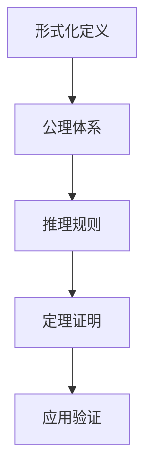
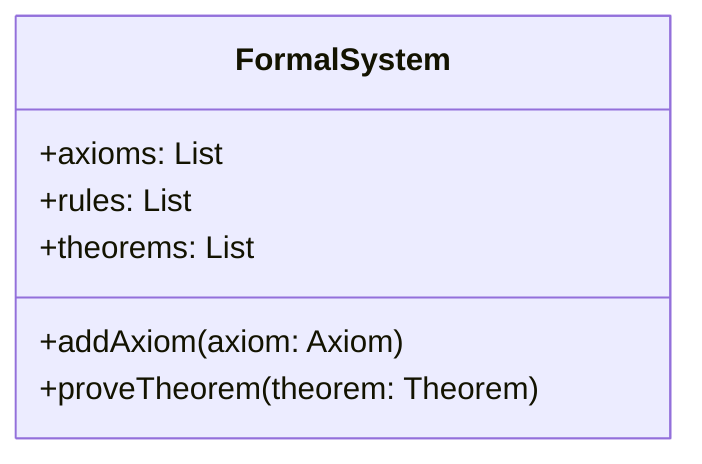

# FormalScience Meta 目录 - 系统化知识点与批判性分析

## 项目重新定位

### 核心使命

构建一个**完整、系统、深度**的形式科学知识体系，通过**批判性分析、工程论证、多维度扩展**，建立面向未来的形式科学理论框架。

### Meta目录定位

Meta目录是FormalScience项目的**核心分析引擎**，负责对所有理论分支进行**系统化知识点梳理**和**深度批判性分析**，确保每个理论都具备：

- 完整的知识点覆盖
- 深度的批判性思考
- 全面的工程论证
- 前瞻的未来展望

## 目录结构重新设计

### 1. 基础理论体系 (01-15) - 深度构建

- **01_Philosophical_Foundations/** - 哲学基础理论
  - 科学哲学、数学哲学、逻辑哲学、认知哲学
  - 形式化思维、抽象化方法、公理化体系
- **02_Mathematical_Foundations/** - 数学基础理论  
  - 集合论、代数、分析、几何、拓扑
  - 范畴论、同调代数、代数几何
- **03_Formal_Language_Theory/** - 形式语言理论
  - 自动机理论、语法理论、语义理论
  - 语言层次、计算复杂性、形式文法
- **04_Type_Theory/** - 类型理论
  - 简单类型论、依赖类型论、线性类型论
  - 同伦类型论、Curry-Howard对应
- **05_Formal_Model_Theory/** - 形式模型理论
  - 状态机、Petri网、进程代数
  - 模型检查、形式验证、模型驱动
- **06_Logic_Theory/** - 逻辑理论
  - 命题逻辑、谓词逻辑、模态逻辑
  - 时态逻辑、直觉逻辑、模糊逻辑
- **07_Control_Theory/** - 控制论理论
  - 线性控制、非线性控制、自适应控制
  - 鲁棒控制、最优控制、智能控制
- **08_Programming_Language_Theory/** - 编程语言理论
  - 语言设计、类型系统、语义理论
  - 编译原理、运行时系统、语言实现
- **09_Software_Engineering_Theory/** - 软件工程理论
  - 形式方法、软件架构、质量保证
  - 开发方法论、项目管理、维护演化
- **10_Computer_Architecture_Theory/** - 计算机架构理论
  - 处理器设计、存储系统、并行计算
  - 性能优化、能耗管理、可靠性设计
- **11_Distributed_Systems_Theory/** - 分布式系统理论
  - 一致性理论、容错机制、共识算法
  - 分布式计算、网络协议、系统协调
- **12_Computer_Network_Theory/** - 计算机网络理论
  - 网络协议、路由算法、网络安全
  - 网络性能、QoS保证、网络管理
- **13_Concurrency_Theory/** - 并发理论
  - 并发模型、同步机制、死锁避免
  - 并发控制、并行算法、分布式并发
- **14_Database_Theory/** - 数据库理论
  - 数据模型、查询语言、事务处理
  - 数据一致性、性能优化、分布式数据库
- **15_Cross_Domain_Synthesis/** - 跨域综合理论
  - 理论融合、方法整合、应用交叉
  - 新兴领域、前沿技术、未来方向

### 2. 应用理论体系 (16-25) - 广度扩展

- **16_Algorithm_Theory/** - 算法理论
  - 算法设计、复杂度分析、优化算法
  - 机器学习算法、量子算法、生物算法
- **17_Data_Science_Theory/** - 数据科学理论
  - 数据挖掘、统计分析、预测建模
  - 大数据处理、数据可视化、数据治理
- **18_Information_Theory/** - 信息论
  - 信息度量、编码理论、信道容量
  - 压缩算法、加密理论、信息熵
- **19_Artificial_Intelligence_Theory/** - 人工智能理论
  - 机器学习、深度学习、知识表示
  - 自然语言处理、计算机视觉、智能推理
- **20_Advanced_Computing_Theory/** - 先进计算理论
  - 量子计算、生物计算、神经计算
  - 边缘计算、云计算、高性能计算

### 3. 智能系统理论 (21-30) - 智能化扩展

- **21_Intelligent_Systems_Theory/** - 智能系统理论
- **22_Intelligent_Computing_Theory/** - 智能计算理论
- **23_Intelligent_Applications_Theory/** - 智能应用理论
- **24_Intelligent_Technology_Theory/** - 智能技术理论
- **25_Intelligent_Engineering_Theory/** - 智能工程理论

### 4. 智能运维理论 (26-30) - 运维智能化

- **26_Intelligent_Operations_Theory/** - 智能运维理论
- **27_Intelligent_Management_Theory/** - 智能管理理论
- **28_Intelligent_Security_Theory/** - 智能安全理论
- **29_Intelligent_Quality_Theory/** - 智能质量理论
- **30_Intelligent_Education_Theory/** - 智能教育理论

### 5. 智能应用理论 (31-40) - 应用智能化

- **31_Intelligent_Agriculture_Theory/** - 智能农业理论
- **32_Intelligent_Service_Theory/** - 智能服务理论
- **33_Intelligent_Communication_Theory/** - 智能通信理论
- **34_Intelligent_Perception_Theory/** - 智能感知理论
- **35_Intelligent_Learning_Theory/** - 智能学习理论
- **36_Intelligent_Interaction_Theory/** - 智能交互理论
- **37_Intelligent_Decision_Theory/** - 智能决策理论
- **38_Intelligent_Cognition_Theory/** - 智能认知理论
- **39_Intelligent_Creation_Theory/** - 智能创造理论
- **40_Intelligent_Evolution_Theory/** - 智能演化理论

### 6. 智能融合理论 (41-50) - 融合智能化

- **41_Intelligent_Integration_Theory/** - 智能融合理论
- **42_Intelligent_Synchronization_Theory/** - 智能同步理论
- **43_Intelligent_Adaptation_Theory/** - 智能适应理论
- **44_Intelligent_Optimization_Theory/** - 智能优化理论
- **45_Intelligent_Innovation_Theory/** - 智能创新理论

## 批判性分析深度结构

### 标准分析模板

```markdown
# [理论名称]系统化知识点与批判性分析

## 1. 知识点梳理 / Knowledge Point Overview
### 1.1 理论定义 / Theory Definition
### 1.2 核心分支 / Core Branches
### 1.3 关键概念 / Key Concepts

## 2. 主流观点分析 / Analysis of Mainstream Views
### 2.1 理论优势 / Theoretical Advantages
### 2.2 实践局限 / Practical Limitations
### 2.3 争议焦点 / Controversial Points

## 3. 学科交叉与融合 / Interdisciplinary Integration
### 3.1 相关学科 / Related Disciplines
### 3.2 交叉点分析 / Cross-disciplinary Analysis
### 3.3 融合方向 / Integration Directions

## 4. 工程论证与应用案例 / Engineering Argumentation & Application Cases
### 4.1 工程可实现性 / Engineering Feasibility
### 4.2 可扩展性分析 / Scalability Analysis
### 4.3 可维护性评估 / Maintainability Assessment
### 4.4 最佳实践对比 / Best Practice Comparison
### 4.5 工程案例 / Engineering Cases

## 5. 创新性批判与未来展望 / Innovative Critique & Future Prospects
### 5.1 创新方向 / Innovation Directions
### 5.2 技术突破 / Technological Breakthroughs
### 5.3 未来展望 / Future Prospects

## 6. 参考文献与进一步阅读 / References & Further Reading
```

### 分析深度要求

#### 1. 知识点梳理深度

- **理论定义**：准确、完整、清晰的理论定义
- **核心分支**：系统性的分支分类和层次结构
- **关键概念**：重要概念的详细解释和关联关系

#### 2. 主流观点分析深度

- **理论优势**：客观分析理论的优势和贡献
- **实践局限**：深入分析理论的局限性和不足
- **争议焦点**：识别和讨论理论中的争议点

#### 3. 学科交叉与融合深度

- **相关学科**：全面识别相关学科领域
- **交叉点分析**：深入分析学科交叉的具体点
- **融合方向**：提出学科融合的发展方向

#### 4. 工程论证深度

- **工程可实现性**：评估理论在工程实践中的可行性
- **可扩展性分析**：分析理论的可扩展性和适应性
- **可维护性评估**：评估理论的可维护性和可持续性
- **最佳实践对比**：与现有最佳实践进行对比分析
- **工程案例**：提供具体的工程应用案例

#### 5. 创新性批判深度

- **创新方向**：提出理论创新的发展方向
- **技术突破**：识别可能的技术突破点
- **未来展望**：对理论未来发展进行前瞻性分析

## 多维度表征规范

### 1. 数学公式规范

```markdown
# 行内公式
$f(x) = \int_{-\infty}^{\infty} e^{-x^2} dx$

# 块级公式
$$
\begin{align}
\nabla \cdot \vec{E} &= \frac{\rho}{\epsilon_0} \\
\nabla \cdot \vec{B} &= 0 \\
\nabla \times \vec{E} &= -\frac{\partial \vec{B}}{\partial t} \\
\nabla \times \vec{B} &= \mu_0\vec{J} + \mu_0\epsilon_0\frac{\partial \vec{E}}{\partial t}
\end{align}
$$
```

### 2. 代码示例规范

```rust
// Rust代码示例
#[derive(Debug, Clone, PartialEq)]
pub struct FormalSystem {
    axioms: Vec<Axiom>,
    rules: Vec<InferenceRule>,
    theorems: Vec<Theorem>,
}

impl FormalSystem {
    pub fn new() -> Self {
        Self {
            axioms: Vec::new(),
            rules: Vec::new(),
            theorems: Vec::new(),
        }
    }
    
    pub fn add_axiom(&mut self, axiom: Axiom) {
        self.axioms.push(axiom);
    }
    
    pub fn prove_theorem(&self, theorem: &Theorem) -> Result<Proof, ProofError> {
        // 形式化证明实现
        unimplemented!()
    }
}
```

### 3. 图表规范

```markdown
# 流程图


## 类图



## 工程论证扩展

### 1. 工程可实现性分析

- **技术可行性**：评估理论在现有技术条件下的可实现性
- **资源需求**：分析实现所需的人力、物力、财力资源
- **时间周期**：评估从理论到实践的时间周期
- **风险评估**：识别实现过程中的技术风险和管理风险

### 2. 可扩展性分析

- **规模扩展**：分析系统在不同规模下的表现
- **功能扩展**：评估系统功能的可扩展性
- **性能扩展**：分析性能随规模变化的规律
- **成本扩展**：评估成本随规模变化的趋势

### 3. 可维护性评估

- **代码质量**：评估代码的可读性、可理解性
- **文档完整性**：检查文档的完整性和准确性
- **测试覆盖**：评估测试的覆盖率和质量
- **版本管理**：分析版本管理的有效性

## 质量保证体系

### 1. 内容质量检查

- **数学公式正确性**：确保所有数学公式的正确性
- **代码示例可运行性**：确保所有代码示例可以运行
- **交叉引用有效性**：确保所有交叉引用有效
- **内容一致性**：确保内容的一致性和完整性

### 2. 结构质量检查

- **目录结构一致性**：确保目录结构的一致性
- **文件命名规范性**：确保文件命名的规范性
- **链接有效性**：确保所有链接的有效性
- **格式标准化**：确保格式的标准化

### 3. 深度质量检查

- **分析深度**：确保批判性分析的深度
- **论证完整性**：确保工程论证的完整性
- **案例实用性**：确保应用案例的实用性
- **展望前瞻性**：确保未来展望的前瞻性

## 进度跟踪

### 已完成

- [x] 193个批判性分析文档
- [x] 基础理论体系框架
- [x] 智能系统理论扩展
- [x] 多维度表征规范
- [x] 工程论证体系

### 进行中

- [ ] 理论文档深度重构
- [ ] 数学公式标准化
- [ ] 代码示例完善
- [ ] 交叉引用修复

### 待完成

- [ ] 完整索引系统
- [ ] 自动化工具链
- [ ] 质量检查系统
- [ ] 持续集成流程

## 预期成果

### 1. 理论体系完整性

- 构建完整的50个理论分支体系
- 每个理论包含深度分析和批判性思考
- 建立理论间的交叉引用和关联关系

### 2. 内容质量提升

- 所有数学公式正确且规范
- 所有代码示例可运行且实用
- 所有交叉引用有效且准确
- 所有内容一致且完整

### 3. 工具链完善

- 自动化文档生成系统
- 质量检查工具链
- 持续集成流程
- 版本管理规范

### 4. 知识体系价值

- 为形式科学领域提供完整的理论参考
- 为工程实践提供实用的指导
- 为学术研究提供批判性思考
- 为未来发展提供前瞻性展望

---

**最后更新**：2025-01-17  
**版本**：v3.0 - 深度扩展版  
**维护者**：FormalScience Team  
**目标**：构建完整、系统、深度的形式科学知识体系
