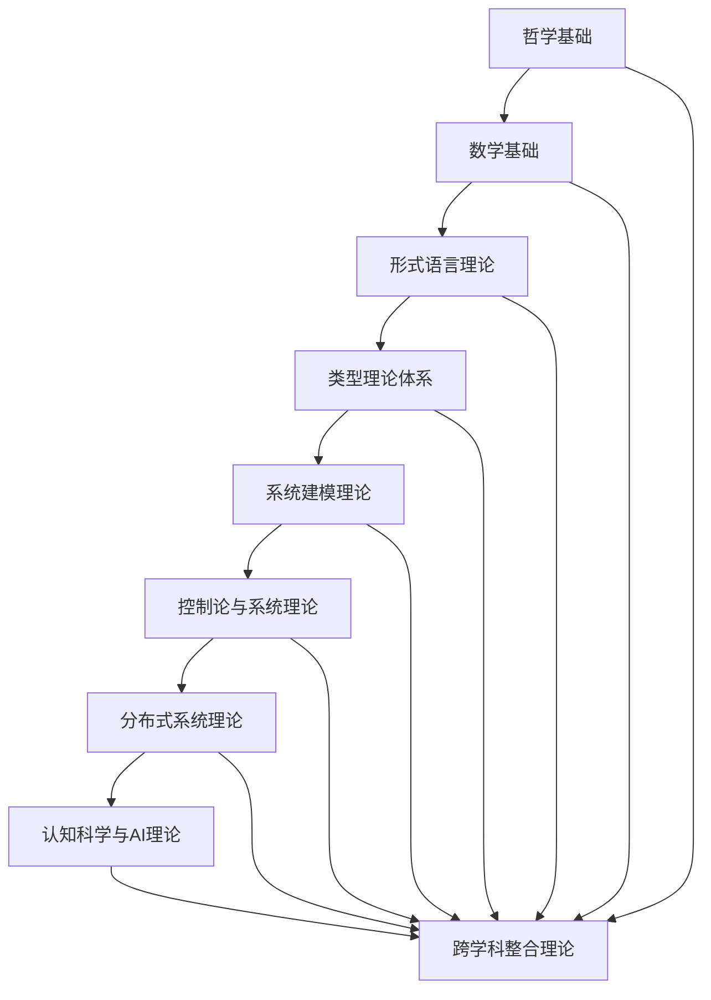

# 形式科学重构体系 - 总体索引

## 目录

1. [项目概述](#项目概述)
2. [重构体系架构](#重构体系架构)
3. [主题分类体系](#主题分类体系)
4. [内容关联性分析](#内容关联性分析)
5. [形式化规范](#形式化规范)
6. [持续构建体系](#持续构建体系)

## 项目概述

本项目是对原有 `/docs` 目录下所有哲学科学内容的批判性重构，建立了系统化的形式科学知识体系。通过哲学批判分析、数学形式化、逻辑论证等方法，将分散的知识内容整合为具有严格学术规范的理论体系。

### 重构目标

1. **知识体系化**: 将分散内容整合为系统化的理论体系
2. **形式化规范**: 建立严格的数学和逻辑形式化标准
3. **论证严谨性**: 确保所有理论具有完整的论证过程
4. **跨学科整合**: 实现哲学、数学、计算机科学等领域的深度融合
5. **持续发展**: 建立可持续的知识构建和维护体系

## 重构体系架构

### 1. 形式理论体系 (01-形式理论体系)

**核心内容**:

- 统一形式理论框架
- 形式系统基础
- 公理化方法
- 形式化语言

**主要文件**:

- `01-01-统一形式理论框架.md`
- `01-02-形式系统基础.md`
- `01-03-公理化方法.md`
- `01-04-形式化语言理论.md`

### 2. 哲学基础 (02-哲学基础)

**核心内容**:

- 本体论基础
- 认识论框架
- 逻辑学基础
- 形而上学体系

**主要文件**:

- `02-01-本体论基础.md`
- `02-02-认识论框架.md`
- `02-03-逻辑学基础.md`
- `02-04-形而上学体系.md`
- `02-05-数学哲学.md`
- `02-06-科学哲学.md`

### 3. 数学基础 (03-数学基础)

**核心内容**:

- 集合论基础
- 代数结构
- 几何结构
- 分析结构
- 范畴论

**主要文件**:

- `03-01-集合论基础.md`
- `03-02-代数结构理论.md`
- `03-03-几何结构理论.md`
- `03-04-分析结构理论.md`
- `03-05-范畴论基础.md`

### 4. 形式语言理论 (04-形式语言理论)

**核心内容**:

- 自动机理论
- 语法理论
- 语义理论
- 语言层次结构

**主要文件**:

- `04-01-自动机理论.md`
- `04-02-语法理论.md`
- `04-03-语义理论.md`
- `04-04-语言层次结构.md`

### 5. 系统建模理论 (05-系统建模理论)

**核心内容**:

- Petri网理论
- 状态机理论
- 并发系统理论
- 系统验证理论

**主要文件**:

- `05-01-Petri网理论.md`
- `05-02-状态机理论.md`
- `05-03-并发系统理论.md`
- `05-04-系统验证理论.md`

### 6. 类型理论体系 (06-类型理论体系)

**核心内容**:

- 基础类型理论
- 线性类型理论
- 仿射类型理论
- 时态类型理论
- 依赖类型理论

**主要文件**:

- `06-01-基础类型理论.md`
- `06-02-线性类型理论.md`
- `06-03-仿射类型理论.md`
- `06-04-时态类型理论.md`
- `06-05-依赖类型理论.md`

### 7. 控制论与系统理论 (07-控制论与系统理论)

**核心内容**:

- 控制论基础
- 动态系统理论
- 稳定性理论
- 最优控制理论

**主要文件**:

- `07-01-控制论基础.md`
- `07-02-动态系统理论.md`
- `07-03-稳定性理论.md`
- `07-04-最优控制理论.md`

### 8. 分布式系统理论 (08-分布式系统理论)

**核心内容**:

- 分布式算法
- 一致性协议
- 容错机制
- 分布式验证

**主要文件**:

- `08-01-分布式算法基础.md`
- `08-02-一致性协议.md`
- `08-03-容错机制.md`
- `08-04-分布式验证.md`

### 9. 认知科学与AI理论 (09-认知科学与AI理论)

**核心内容**:

- 认知科学基础
- 人工智能理论
- 机器学习理论
- 认知建模

**主要文件**:

- `09-01-认知科学基础.md`
- `09-02-人工智能理论.md`
- `09-03-机器学习理论.md`
- `09-04-认知建模.md`

### 10. 跨学科整合理论 (10-跨学科整合理论)

**核心内容**:

- 跨学科方法论
- 统一理论框架
- 应用整合
- 未来发展

**主要文件**:

- `10-01-跨学科方法论.md`
- `10-02-统一理论框架.md`
- `10-03-应用整合.md`
- `10-04-未来发展.md`

## 主题分类体系

### 1. 基础理论层

- **哲学基础**: 本体论、认识论、逻辑学、形而上学
- **数学基础**: 集合论、代数、几何、分析、范畴论
- **逻辑基础**: 形式逻辑、哲学逻辑、非经典逻辑

### 2. 形式化理论层

- **形式语言**: 自动机、语法、语义、层次结构
- **类型理论**: 基础类型、线性类型、仿射类型、时态类型
- **系统建模**: Petri网、状态机、并发系统、验证

### 3. 应用理论层

- **控制理论**: 控制论、动态系统、稳定性、最优控制
- **分布式系统**: 算法、协议、容错、验证
- **认知与AI**: 认知科学、人工智能、机器学习、建模

### 4. 整合理论层

- **跨学科方法**: 方法论、框架、应用、发展
- **统一理论**: 综合框架、关联分析、发展趋势

## 内容关联性分析

### 1. 理论关联性

### 2. 方法关联性

- **公理化方法**: 贯穿所有理论的基础方法
- **形式化方法**: 数学和逻辑表达的统一方法
- **系统化方法**: 理论整合和关联的方法
- **批判性方法**: 哲学分析和论证的方法

### 3. 应用关联性

- **理论应用**: 从基础理论到实际应用
- **跨域应用**: 不同领域间的应用关联
- **综合应用**: 多理论综合应用

## 形式化规范

### 1. 数学符号规范

- **集合论符号**: $\in, \subseteq, \cup, \cap, \setminus$
- **逻辑符号**: $\land, \lor, \neg, \rightarrow, \leftrightarrow, \forall, \exists$
- **代数符号**: $+, -, \times, \div, =, \neq, <, >$
- **函数符号**: $f: A \rightarrow B, f(x), \circ$

### 2. 证明规范

- **公理**: 基本假设，无需证明
- **定理**: 需要严格证明的命题
- **引理**: 辅助定理，用于证明其他定理
- **推论**: 从定理直接推出的结论

### 3. 论证规范

- **演绎论证**: 从一般到特殊的推理
- **归纳论证**: 从特殊到一般的推理
- **溯因论证**: 从结果到原因的推理
- **类比论证**: 基于相似性的推理

## 持续构建体系

### 1. 内容更新机制

- **定期审查**: 每月审查内容完整性和准确性
- **版本控制**: 使用Git进行版本管理
- **反馈机制**: 建立用户反馈和改进机制

### 2. 质量保证机制

- **学术规范**: 确保符合学术写作标准
- **逻辑一致性**: 检查理论间的逻辑一致性
- **形式化程度**: 确保足够的数学形式化

### 3. 发展计划

- **短期目标**: 完善现有理论体系
- **中期目标**: 扩展应用领域
- **长期目标**: 建立统一的形式科学理论

## 使用指南

### 1. 阅读顺序

1. 从哲学基础开始，理解基本概念
2. 学习数学基础，掌握形式化工具
3. 深入具体理论，理解应用方法
4. 最后学习整合理论，形成整体认识

### 2. 学习方法

- **循序渐进**: 按层次逐步学习
- **理论结合**: 理论与实践相结合
- **批判思考**: 保持批判性思维
- **持续更新**: 关注理论发展

### 3. 贡献指南

- **内容贡献**: 提供新的理论内容
- **错误修正**: 发现并修正错误
- **改进建议**: 提出改进建议
- **应用案例**: 提供实际应用案例

---

**最后更新时间**: 2024年12月
**版本**: v1.0
**维护者**: 形式科学项目组
