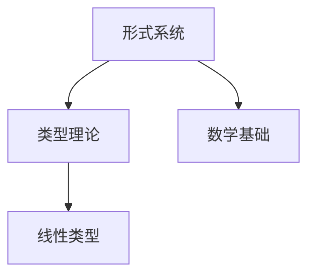
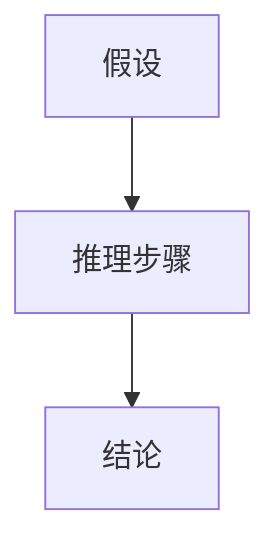
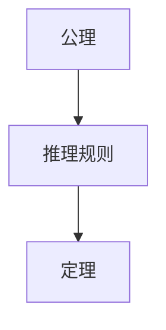

# 形式科学理论体系重构 (Formal Science Theory System Refactor)

## 重构目标

本项目对 `/docs` 目录下的所有内容进行哲学科学批判分析，建立规范化的知识体系，实现：

1. **知识梳理与分类**：系统性整理所有理论内容
2. **形式化规范**：建立严格的数学形式化标准
3. **多表征整合**：结合图表、数学符号、形式化证明等多种表征方式
4. **一致性保证**：确保内容、证明、相关性、语义的一致性
5. **持续性体系**：构建可中断后继续的上下文提醒体系

## 重构方法论

### 1. 哲学科学批判分析框架

**批判性思维原则**：

- 避免辩证法正反合技巧
- 保持严格的逻辑推理
- 建立清晰的概念定义
- 提供完整的论证过程

**形式化标准**：

- 所有概念必须有严格定义
- 所有定理必须有完整证明
- 所有推理必须有明确规则
- 所有结论必须有充分论证

### 2. 知识分类体系

基于内容分析，建立以下核心主题：

#### 2.1 基础理论 (Foundation)

- **数学基础**：集合论、逻辑学、数系理论
- **形式系统**：公理化方法、证明理论、模型论
- **范畴论**：统一数学结构理论

#### 2.2 类型理论 (Type Theory)

- **基础类型理论**：简单类型λ演算
- **线性类型理论**：资源管理和内存安全
- **时态类型理论**：时间约束和实时系统
- **量子类型理论**：量子计算安全

#### 2.3 形式语言理论 (Formal Language Theory)

- **自动机理论**：有限自动机、图灵机、计算复杂度
- **语言层次**：乔姆斯基层次结构
- **语义理论**：操作语义、指称语义、公理语义

#### 2.4 系统理论 (System Theory)

- **控制理论**：系统动态、稳定性、鲁棒性
- **分布式理论**：一致性、容错、共识算法
- **并发理论**：Petri网、进程代数、同步

#### 2.5 时态逻辑理论 (Temporal Logic Theory)

- **线性时态逻辑**：LTL、CTL、CTL*
- **时态控制**：规范、控制器合成、验证
- **概率时态逻辑**：不确定性建模

#### 2.6 哲学基础 (Philosophical Foundation)

- **本体论**：存在、实体、关系
- **认识论**：知识、真理、确证
- **方法论**：科学方法、形式化方法

#### 2.7 应用领域 (Application Domains)

- **编程语言**：语言设计、类型系统、编译器
- **软件工程**：形式化验证、模型检查
- **人工智能**：知识表示、推理、学习

### 3. 多表征规范

#### 3.1 数学形式化

- 使用标准数学符号
- 提供完整的形式化定义
- 包含严格的证明过程
- 建立公理化体系

#### 3.2 图表表征

- 概念关系图
- 理论层次结构图
- 证明流程图
- 应用场景图

#### 3.3 表格对比

- 理论对比分析
- 方法比较
- 应用领域映射
- 复杂度分析

#### 3.4 代码示例

- 算法实现
- 形式化验证
- 系统建模
- 工具使用

### 4. 一致性保证

#### 4.1 内容一致性

- 概念定义统一
- 术语使用一致
- 符号表示规范
- 引用关系清晰

#### 4.2 证明一致性

- 推理规则统一
- 证明方法一致
- 逻辑框架相同
- 结论推导严格

#### 4.3 相关性一致性

- 理论间关系明确
- 应用领域映射清晰
- 发展脉络连贯
- 层次结构合理

#### 4.4 语义解释一致性

- 语义定义统一
- 解释框架一致
- 模型对应关系明确
- 抽象层次协调

## 目录结构

```text
docs/Refactor/
├── README.md                           # 重构说明文档
├── Foundation/                         # 基础理论
│   ├── Mathematical_Foundations/       # 数学基础
│   ├── Formal_Systems/                 # 形式系统
│   └── Category_Theory/                # 范畴论
├── Type_Theory/                        # 类型理论
│   ├── Basic_Type_Theory/              # 基础类型理论
│   ├── Linear_Type_Theory/             # 线性类型理论
│   ├── Temporal_Type_Theory/           # 时态类型理论
│   └── Quantum_Type_Theory/            # 量子类型理论
├── Formal_Language/                    # 形式语言理论
│   ├── Automata_Theory/                # 自动机理论
│   ├── Language_Hierarchy/             # 语言层次
│   └── Semantics_Theory/               # 语义理论
├── System_Theory/                      # 系统理论
│   ├── Control_Theory/                 # 控制理论
│   ├── Distributed_Systems/            # 分布式系统
│   └── Concurrency_Theory/             # 并发理论
├── Temporal_Logic/                     # 时态逻辑理论
│   ├── Linear_Temporal_Logic/          # 线性时态逻辑
│   ├── Temporal_Control/               # 时态控制
│   └── Probabilistic_Temporal_Logic/   # 概率时态逻辑
├── Philosophy/                         # 哲学基础
│   ├── Ontology/                       # 本体论
│   ├── Epistemology/                   # 认识论
│   └── Methodology/                    # 方法论
├── Applications/                       # 应用领域
│   ├── Programming_Languages/          # 编程语言
│   ├── Software_Engineering/           # 软件工程
│   └── Artificial_Intelligence/        # 人工智能
├── Meta_Analysis/                      # 元分析
│   ├── Theory_Integration/             # 理论整合
│   ├── Cross_Domain_Analysis/          # 跨领域分析
│   └── Consistency_Analysis/           # 一致性分析
└── Context_System/                     # 上下文体系
    ├── Progress_Tracking/              # 进度跟踪
    ├── Context_Reminder/               # 上下文提醒
    └── Continuation_Guide/             # 继续指南
```

## 重构进度

### 阶段一：内容分析 (已完成)

- [x] 目录结构分析
- [x] 内容分布统计
- [x] 主题相关性分析
- [x] 哲学科学批判框架建立

### 阶段二：知识梳理 (进行中)

- [ ] 基础理论重构
- [ ] 类型理论重构
- [ ] 形式语言理论重构
- [ ] 系统理论重构
- [ ] 时态逻辑理论重构
- [ ] 哲学基础重构
- [ ] 应用领域重构

### 阶段三：形式化规范 (待开始)

- [ ] 数学符号标准化
- [ ] 证明过程规范化
- [ ] 多表征方式整合
- [ ] 一致性检查

### 阶段四：体系完善 (待开始)

- [ ] 上下文提醒体系构建
- [ ] 持续性机制建立
- [ ] 质量保证体系
- [ ] 文档完整性检查

## 质量保证

### 1. 内容质量标准

- **完整性**：覆盖所有相关主题
- **准确性**：概念定义和定理证明准确
- **一致性**：术语、符号、推理规则一致
- **清晰性**：表达清晰，逻辑明确

### 2. 形式化标准

- **数学规范**：符合数学写作标准
- **逻辑严谨**：推理过程严格
- **证明完整**：关键定理有完整证明
- **符号统一**：数学符号使用统一

### 3. 学术标准

- **引用规范**：正确引用相关文献
- **术语标准**：使用标准学术术语
- **结构合理**：文档结构层次清晰
- **内容前沿**：包含最新理论发展

## 持续改进

本项目采用持续改进机制：

1. **定期审查**：定期审查内容质量和一致性
2. **反馈机制**：建立用户反馈收集机制
3. **版本控制**：使用版本控制跟踪变更
4. **质量评估**：建立质量评估指标体系

---

**重构宣言**：<(￣︶￣)↗[GO!] 激情澎湃地推进形式科学理论体系的重构，建立规范、严谨、一致的知识体系！

## 主题内容梳理与批判分析操作流程

### 步骤一：主题内容收集与归纳

- 收集所有相关文档内容，按主题归类。
- 提取核心概念、主要理论、关键论证、代表性证明。

### 步骤二：哲学批判与知识结构分析

- 对每个主题进行哲学批判性分析，明确其知识基础、论证链条、内在逻辑、外部关联。
- 梳理主题内部的层次结构与外部的交叉联系。

### 步骤三：规范化重构与多表征输出

- 以严格的学术规范输出内容，包含：
  - 严格编号的目录
  - 多表征（公式、图、表、流程图等）
  - 详细论证与形式化证明
  - 主题内外部关联性说明

### 步骤四：持续进度记录与上下文提醒

- 在 `Context_System/Progress_Tracking/` 记录每次梳理、重构、输出的详细过程与未完成事项。
- 在 `Context_System/Context_Reminder/` 维护当前上下文与中断点，便于随时恢复。

---

## 多表征内容规范与插入示例

### 1. 数学公式

使用标准LaTeX语法，示例：

```math
\forall x \in X, \exists y \in Y,\; P(x, y)
```

### 2. 概念关系图（Mermaid）



### 3. 表格对比

| 理论 | 主要内容 | 应用领域 |
|------|----------|----------|
| 线性类型 | 资源管理 | 编程语言/并发 |
| 时态逻辑 | 时间约束 | 控制/验证 |

### 4. 证明流程图



---

## 持续上下文提醒体系与进度记录指引

- 每次重构、分析、输出后，在 `Context_System/Progress_Tracking/` 新建或更新进度文件，记录：
  - 已完成内容
  - 当前中断点
  - 下一步计划
- 在 `Context_System/Context_Reminder/` 维护当前主题、分析链条、未解决问题，便于随时恢复。
- 推荐文件命名规范：`YYYYMMDD_主题名_进度.md`，如 `20240610_TypeTheory_Progress.md`

---

## 主题内容梳理与批判分析模板（以"基础理论"为例）

## 基础理论梳理与批判分析

## 1. 主题概述

- 本节系统梳理集合论、逻辑学、数系理论等基础理论，分析其在形式科学体系中的地位与作用。

## 2. 核心概念与结构

### 2.1 集合论

- 概念定义：集合、元素、子集、幂集、映射等。
- 形式化公理体系（如ZFC）：

```math
\forall A, B, (A = B \iff \forall x (x \in A \leftrightarrow x \in B))
```

### 2.2 逻辑学

- 命题逻辑、谓词逻辑、证明论、模型论。
- 典型推理规则与证明流程：



## 3. 主题间关联性分析

- 集合论为数学与类型理论提供基础。
- 逻辑学与类型理论、形式系统紧密关联。

## 4. 哲学批判与方法论反思

- 讨论集合论公理选择的哲学基础。
- 逻辑学与知识论、本体论的关系。

## 5. 形式化证明示例

-**定理：空集的唯一性**

*证明：*

设 $A$ 和 $B$ 都是空集，则 $\forall x (x \notin A)$ 且 $\forall x (x \notin B)$。因此 $A = B$。

---

> 按照上述模板，持续推进各主题的内容梳理、批判分析与规范化输出，确保内容一致性、学术规范与可持续追踪。
