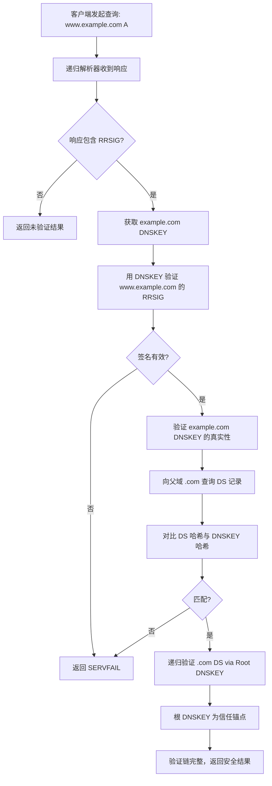

# RFC 1034/1035 - Domain Name System (DNS)

## 1. RFC概述

### 1.1 基本信息

- **RFC编号**: RFC 1034, RFC 1035
- **标题**: Domain Names - Concepts and Facilities / Implementation and Specification
- **发布日期**: 1987年11月
- **状态**: Internet Standard
- **更新**: RFC 1101, RFC 1183, RFC 1348, RFC 1876, RFC 1982, RFC 2065, RFC 2181, RFC 2308, RFC 2535, RFC 2845, RFC 2930, RFC 2931, RFC 3007, RFC 3008, RFC 3090, RFC 3225, RFC 3226, RFC 3596, RFC 3597, RFC 3645, RFC 3845, RFC 4025, RFC 4033, RFC 4034, RFC 4035, RFC 4398, RFC 5155, RFC 5702, RFC 5936, RFC 6604, RFC 6672, RFC 6698, RFC 6742, RFC 6840, RFC 6891, RFC 6895, RFC 6944, RFC 7043, RFC 7314, RFC 7828, RFC 7830, RFC 8080, RFC 8490, RFC 8764, RFC 8914

### 1.2 历史背景

在DNS出现之前，互联网使用HOSTS.TXT文件进行主机名到IP地址的映射。随着网络规模扩大，这种集中式管理变得不可行。RFC 1034/1035定义了分布式、层次化的域名系统，成为互联网基础设施的核心组件。

### 1.3 核心贡献

- 定义了层次化的域名空间
- 设计了分布式的数据库系统
- 规范了域名解析协议
- 确立了域名资源记录类型

---

## 2. 协议详细说明

### 2.1 DNS架构

#### 2.1.1 域名空间结构

```
                    +------------------+
                    |       .          |  <-- 根域
                    +--------+---------+
                             |
        +--------------------+--------------------+
        |                    |                    |
        v                    v                    v
+-------+-------+    +-------+-------+    +-------+-------+
|     com       |    |     org       |    |     net       |  <-- 顶级域(TLD)
+-------+-------+    +-------+-------+    +-------+-------+
        |                    |                    |
        v                    v                    v
+-------+-------+    +-------+-------+    +-------+-------+
|   example     |    |   wikipedia   |    |    google     |  <-- 二级域
+-------+-------+    +-------+-------+    +-------+-------+
        |                    |                    |
   +----+----+               |               +----+----+
   |         |               |               |         |
   v         v               v               v         v
+-----+   +-----+       +---------+      +-----+   +------+
|www  |   |mail |       |   en    |      |www  |   |mail  |  <-- 主机/子域
+-----+   +-----+       +---------+      +-----+   +------+
```

#### 2.1.2 域名服务器类型

| 类型 | 功能 | 示例 |
|------|------|------|
| 根服务器 | 管理根域，知道所有TLD服务器 | a.root-servers.net |
| TLD服务器 | 管理顶级域 | a.gtld-servers.net |
| 权威服务器 | 管理特定域的完整信息 | ns1.example.com |
| 递归服务器 | 为客户机执行完整解析 | 8.8.8.8 (Google DNS) |
| 缓存服务器 | 缓存查询结果提高性能 | 本地DNS |

#### 2.1.3 解析模式

**递归解析**:

```
客户端 → 递归DNS → 根服务器 → TLD服务器 → 权威服务器
   ↑                                          |
   +------------------------------------------+
```

**迭代解析**:

```
客户端 → 本地DNS → 根服务器 (返回TLD地址)
   ↑       ↓
   +--← TLD服务器 (返回权威地址)
           ↓
        权威服务器 (返回答案)
```

### 2.2 核心机制

#### 2.2.1 资源记录（RR）

DNS数据库的基本单元，格式为：

```
{name} {TTL} {class} {type} {RDATA}
```

#### 2.2.2 缓存机制

- 根据TTL缓存查询结果
- 减少重复查询
- 提高解析效率

#### 2.2.3 负缓存

- 缓存"不存在"的响应
- 减少无效查询

---

## 3. 报文格式

### 3.1 DNS报文格式

```
+---------------------+
|        Header       |  <-- 12 bytes
+---------------------+
|       Question      |  <-- 查询问题
+---------------------+
|        Answer       |  <-- 回答记录
+---------------------+
|      Authority      |  <-- 权威记录
+---------------------+
|      Additional     |  <-- 附加记录
+---------------------+
```

### 3.2 首部格式（12字节）

```
 0                   1                   2                   3
 0 1 2 3 4 5 6 7 8 9 0 1 2 3 4 5 6 7 8 9 0 1 2 3 4 5 6 7 8 9 0 1
+-+-+-+-+-+-+-+-+-+-+-+-+-+-+-+-+-+-+-+-+-+-+-+-+-+-+-+-+-+-+-+-+
|           ID          |QR|   Opcode  |AA|TC|RD|RA|   Z    |RCODE|
+-+-+-+-+-+-+-+-+-+-+-+-+-+-+-+-+-+-+-+-+-+-+-+-+-+-+-+-+-+-+-+-+
|                    QDCOUNT (Question Count)                   |
+-+-+-+-+-+-+-+-+-+-+-+-+-+-+-+-+-+-+-+-+-+-+-+-+-+-+-+-+-+-+-+-+
|                    ANCOUNT (Answer Count)                     |
+-+-+-+-+-+-+-+-+-+-+-+-+-+-+-+-+-+-+-+-+-+-+-+-+-+-+-+-+-+-+-+-+
|                    NSCOUNT (Authority Count)                  |
+-+-+-+-+-+-+-+-+-+-+-+-+-+-+-+-+-+-+-+-+-+-+-+-+-+-+-+-+-+-+-+-+
|                    ARCOUNT (Additional Count)                 |
+-+-+-+-+-+-+-+-+-+-+-+-+-+-+-+-+-+-+-+-+-+-+-+-+-+-+-+-+-+-+-+-+
```

### 3.3 首部字段详解

| 字段 | 长度 | 描述 |
|------|------|------|
| ID | 16 bits | 标识符，用于匹配请求和响应 |
| QR | 1 bit | 0=查询，1=响应 |
| Opcode | 4 bits | 操作码（0=标准查询） |
| AA | 1 bit | 权威回答标志 |
| TC | 1 bit | 截断标志 |
| RD | 1 bit | 期望递归查询 |
| RA | 1 bit | 递归可用标志 |
| Z | 3 bits | 保留（必须为0） |
| RCODE | 4 bits | 响应码 |
| QDCOUNT | 16 bits | 问题数 |
| ANCOUNT | 16 bits | 回答记录数 |
| NSCOUNT | 16 bits | 权威记录数 |
| ARCOUNT | 16 bits | 附加记录数 |

### 3.4 响应码（RCODE）

| 值 | 名称 | 描述 |
|----|------|------|
| 0 | NOERROR | 无错误 |
| 1 | FORMERR | 格式错误 |
| 2 | SERVFAIL | 服务器失败 |
| 3 | NXDOMAIN | 不存在的域名 |
| 4 | NOTIMP | 未实现 |
| 5 | REFUSED | 查询被拒绝 |
| 6 | YXDOMAIN | 不应存在的域名 |
| 7 | YXRRSET | 不应存在的RR集 |
| 8 | NXRRSET | 不存在的RR集 |
| 9 | NOTAUTH | 服务器非权威 |
| 10 | NOTZONE | 不在区域内 |

### 3.5 资源记录格式

```
 0                   1                   2                   3
 0 1 2 3 4 5 6 7 8 9 0 1 2 3 4 5 6 7 8 9 0 1 2 3 4 5 6 7 8 9 0 1
+-+-+-+-+-+-+-+-+-+-+-+-+-+-+-+-+-+-+-+-+-+-+-+-+-+-+-+-+-+-+-+-+
|                                                               |
|                            NAME                               |
|                                                               |
+-+-+-+-+-+-+-+-+-+-+-+-+-+-+-+-+-+-+-+-+-+-+-+-+-+-+-+-+-+-+-+-+
|                            TYPE                               |
+-+-+-+-+-+-+-+-+-+-+-+-+-+-+-+-+-+-+-+-+-+-+-+-+-+-+-+-+-+-+-+-+
|                            CLASS                              |
+-+-+-+-+-+-+-+-+-+-+-+-+-+-+-+-+-+-+-+-+-+-+-+-+-+-+-+-+-+-+-+-+
|                            TTL                                |
+-+-+-+-+-+-+-+-+-+-+-+-+-+-+-+-+-+-+-+-+-+-+-+-+-+-+-+-+-+-+-+-+
|                          RDLENGTH                             |
+-+-+-+-+-+-+-+-+-+-+-+-+-+-+-+-+-+-+-+-+-+-+-+-+-+-+-+-+-+-+-+-+
|                                                               |
|                            RDATA                              |
|                                                               |
+-+-+-+-+-+-+-+-+-+-+-+-+-+-+-+-+-+-+-+-+-+-+-+-+-+-+-+-+-+-+-+-+
```

### 3.6 常见资源记录类型

| 类型 | 值 | 描述 | 示例 |
|------|----|------|------|
| A | 1 | IPv4地址 | 192.168.1.1 |
| NS | 2 | 权威域名服务器 | ns1.example.com |
| CNAME | 5 | 规范名称（别名） | www.example.com |
| SOA | 6 | 区域授权开始 | 包含主NS、管理员邮箱等 |
| PTR | 12 | 指针（反向解析） | host.example.com |
| MX | 15 | 邮件交换器 | 10 mail.example.com |
| TXT | 16 | 文本记录 | "v=spf1 include:_spf.google.com" |
| AAAA | 28 | IPv6地址 | 2001:db8::1 |
| SRV | 33 | 服务定位 | _sip._tcp.example.com |
| CAA | 257 | 证书颁发机构授权 | 0 issue "letsencrypt.org" |

### 3.7 域名编码

DNS使用长度前缀标签序列编码域名：

```
example.com 编码为:
+---+---+---+---+---+---+---+---+---+---+---+---+---+
| 7 | e | x | a | m | p | l | e | 3 | c | o | m | 0 |
+---+---+---+---+---+---+---+---+---+---+---+---+---+
  0x07                                                       0x00

www.example.com 编码为:
+---+---+---+---+---+---+---+---+---+---+---+---+---+---+---+---+
| 3 | w | w | w | 7 | e | x | a | m | p | l | e | 3 | c | o | m |
+---+---+---+---+---+---+---+---+---+---+---+---+---+---+---+---+
                                    | 0 |
                                    +---+

压缩指针示例:
+---+---+---+---+---+---+---+---+---+---+---+---+---+---+---+---+
| 3 | w | w | w | 0xC0 | 0x0C | ...                              |
+---+---+---+---+---+---+---+---+---+---+---+---+---+---+---+---+
                  ↑
                  指向偏移量12（example.com的位置）
```

---

## 4. 状态机

### 4.1 DNS解析器状态机

```
                    +------------------+
                    |      IDLE        |
                    +--------+---------+
                             |
                    Query initiated
                             |
                             v
                    +--------+---------+
                    |  SEND QUERY      |
                    +--------+---------+
                             |
                             v
                    +--------+---------+
                    |  WAIT RESPONSE   |
                    +--------+---------+
                             |
              +--------------+--------------+
              |                             |
         Timeout                     Response received
              |                             |
              v                             v
    +---------+---------+      +----------+----------+
    |  Retry?           |      |  Parse Response     |
    |  (max retries)    |      +----------+----------+
    +---------+---------+                 |
         | Yes                +------------+------------+
         v                    |                         |
    +----+----+         Answer      Referral       Error/NoData
         |                |              |              |
         v                v              v              v
    +---------+    +------+------+ +-----+-----+ +-----+-----+
    |  ABORT  |    |  CACHE &    | |  QUERY    | |  CACHE    |
    |  ERROR  |    |  RETURN     | |  REFERRAL | |  NEGATIVE |
    +---------+    +------+------+ +-----+-----+ +-----+-----+
                          |              |              |
                          v              v              v
                   +------+------+ +-----+-----+ +-----+-----+
                   |  COMPLETE   | | (loop to  | |  RETURN   |
                   |             | |  WAIT)    | |  ERROR    |
                   +-------------+ +-----------+ +-----------+
```

### 4.2 DNS服务器状态机

```
                    +------------------+
                    |      LISTEN      |
                    +--------+---------+
                             |
                             | Query received
                             v
                    +--------+---------+
                    |  PARSE QUERY     |
                    +--------+---------+
                             |
              +--------------+--------------+
              |                             |
        Valid query                  Invalid query
              |                             |
              v                             v
    +---------+---------+      +----------+----------+
    |  CHECK CACHE      |      |  SEND FORMERR       |
    +---------+---------+      +----------+----------+
         |                                    |
    +----+----+                               |
    |         |                               |
 Cached    Not cached                         |
    |         |                               |
    v         v                               |
+---+---+  +--+---------+                     |
|RETURN |  | CHECK ZONE |                     |
|CACHED |  |  AUTHORITY |                     |
+---+---+  +--+---------+                     |
              |                               |
    +---------+---------+                     |
    |                   |                     |
 Authoritative    Not authoritative           |
    |                   |                     |
    v                   v                     |
+---+---+         +-----+------+              |
|RETURN |         | RESOLVE    |              |
|ANSWER |         | RECURSIVELY|              |
+---+---+         +-----+------+              |
    |                   |                     |
    +---------+---------+                     |
              |                               |
              v                               |
    +---------+---------+                     |
    |  SEND RESPONSE    +---------------------+
    +--------+---------+
             |
             v
    +--------+---------+
    |   LOG & UPDATE   |
    |   CACHE STATS    |
    +--------+---------+
             |
             v
    +--------+---------+
    |      LISTEN      |
    +------------------+
```

---

## 5. 安全性考虑

### 5.1 DNS安全威胁

#### 5.1.1 DNS欺骗/缓存投毒

- **攻击方式**: 伪造DNS响应注入错误记录
- **影响**: 流量劫持，钓鱼攻击
- **缓解措施**:
  - DNSSEC (RFC 4033-4035)
  - 随机化源端口和Query ID
  - 0x20编码随机化

#### 5.1.2 DNS放大攻击

- **攻击方式**: 利用小查询产生大响应
- **影响**: DDoS攻击
- **缓解措施**:
  - 响应速率限制（RRL）
  - 禁止递归查询给开放解析器

#### 5.1.3 DNS隧道

- **攻击方式**: 利用DNS查询传输数据
- **影响**: 绕过防火墙，数据泄露
- **缓解措施**:
  - DNS流量监控
  - 异常检测
  - DNS防火墙

### 5.2 DNSSEC

DNSSEC提供DNS数据的认证：

- **RRSIG**: 数字签名记录
- **DNSKEY**: 公钥记录
- **DS**: 委托签名者记录
- **NSEC/NSEC3**: 安全否定存在证明

```
DNSSEC验证链:
Root DNSKEY (验证)→ Root DS
    ↓
TLD DNSKEY (验证)→ TLD DS
    ↓
Zone DNSKEY (验证)→ Zone records
```

### 5.3 DoH和DoT

- **DNS over HTTPS (DoH)**: RFC 8484
- **DNS over TLS (DoT)**: RFC 7858
- 提供DNS查询的加密传输
- 防止窃听和篡改

---

## 6. 与教材对标的章节

### 6.1 《计算机网络：自顶向下方法》

| RFC 1034/1035内容 | 对应章节 |
|------------------|----------|
| DNS概述 | 第2章：应用层 - 2.4 DNS |
| DNS工作原理 | 2.4.1 DNS提供的服务 |
| DNS记录 | 2.4.2 DNS工作机理概述 |
| DNS报文 | 2.4.2 DNS报文 |

### 6.2 《TCP/IP详解 卷1：协议》

| RFC 1034/1035内容 | 对应章节 |
|------------------|----------|
| DNS协议 | 第14章：DNS：域名系统 |
| DNS报文格式 | 14.3 DNS报文格式 |
| 简单例子 | 14.4 一个简单的例子 |
| 指针查询 | 14.5 指针查询 |

### 6.3 《计算机网络》（谢希仁）

| RFC 1034/1035内容 | 对应章节 |
|------------------|----------|
| DNS概述 | 第6章：应用层 - 6.1 域名系统DNS |
| 域名结构 | 6.1.1 域名系统概述 |
| 域名服务器 | 6.1.2 互联网的域名结构 |
| 域名解析 | 6.1.3 域名服务器 |

---

## 7. 实现示例

### 7.1 Python实现：DNS解析器

```python
import struct
import socket
import random
from dataclasses import dataclass
from typing import List, Optional, Tuple, Dict
from enum import IntEnum

class DNSRecordType(IntEnum):
    """DNS资源记录类型"""
    A = 1
    NS = 2
    CNAME = 5
    SOA = 6
    PTR = 12
    MX = 15
    TXT = 16
    AAAA = 28
    SRV = 33
    CAA = 257
    ANY = 255

class DNSClass(IntEnum):
    """DNS类"""
    IN = 1  # Internet
    CS = 2  # CSNET
    CH = 3  # CHAOS
    HS = 4  # Hesiod
    ANY = 255

class DNSResponseCode(IntEnum):
    """DNS响应码"""
    NOERROR = 0
    FORMERR = 1
    SERVFAIL = 2
    NXDOMAIN = 3
    NOTIMP = 4
    REFUSED = 5

@dataclass
class DNSHeader:
    """DNS报文首部"""
    id: int
    qr: bool  # 0=查询, 1=响应
    opcode: int
    aa: bool  # 权威回答
    tc: bool  # 截断
    rd: bool  # 期望递归
    ra: bool  # 递归可用
    z: int
    rcode: int
    qdcount: int  # 问题数
    ancount: int  # 回答数
    nscount: int  # 权威记录数
    arcount: int  # 附加记录数

    def pack(self) -> bytes:
        """打包DNS首部"""
        flags = (
            (int(self.qr) << 15) |
            (self.opcode << 11) |
            (int(self.aa) << 10) |
            (int(self.tc) << 9) |
            (int(self.rd) << 8) |
            (int(self.ra) << 7) |
            (self.z << 4) |
            self.rcode
        )
        return struct.pack('!HHHHHH',
            self.id,
            flags,
            self.qdcount,
            self.ancount,
            self.nscount,
            self.arcount
        )

    @classmethod
    def unpack(cls, data: bytes) -> 'DNSHeader':
        """解包DNS首部"""
        if len(data) < 12:
            raise ValueError("DNS header too short")

        id, flags, qdcount, ancount, nscount, arcount = struct.unpack('!HHHHHH', data[:12])

        return cls(
            id=id,
            qr=bool(flags >> 15),
            opcode=(flags >> 11) & 0x0F,
            aa=bool((flags >> 10) & 1),
            tc=bool((flags >> 9) & 1),
            rd=bool((flags >> 8) & 1),
            ra=bool((flags >> 7) & 1),
            z=(flags >> 4) & 0x07,
            rcode=flags & 0x0F,
            qdcount=qdcount,
            ancount=ancount,
            nscount=nscount,
            arcount=arcount
        )

@dataclass
class DNSQuestion:
    """DNS问题节"""
    name: str
    qtype: DNSRecordType
    qclass: DNSClass = DNSClass.IN

    def pack(self) -> bytes:
        """打包问题节"""
        name_bytes = encode_domain_name(self.name)
        type_bytes = struct.pack('!H', self.qtype)
        class_bytes = struct.pack('!H', self.qclass)
        return name_bytes + type_bytes + class_bytes

@dataclass
class DNSResourceRecord:
    """DNS资源记录"""
    name: str
    rtype: DNSRecordType
    rclass: DNSClass
    ttl: int
    rdata: bytes

    def parse_rdata(self) -> str:
        """解析RDATA为可读格式"""
        if self.rtype == DNSRecordType.A and len(self.rdata) == 4:
            return '.'.join(str(b) for b in self.rdata)
        elif self.rtype == DNSRecordType.AAAA and len(self.rdata) == 16:
            return ':'.join(f'{self.rdata[i]:02x}{self.rdata[i+1]:02x}'
                          for i in range(0, 16, 2))
        elif self.rtype in (DNSRecordType.NS, DNSRecordType.CNAME, DNSRecordType.PTR):
            return decode_domain_name(self.rdata, 0)[0]
        else:
            return self.rdata.hex()

@dataclass
class DNSMessage:
    """完整DNS报文"""
    header: DNSHeader
    questions: List[DNSQuestion]
    answers: List[DNSResourceRecord]
    authorities: List[DNSResourceRecord]
    additionals: List[DNSResourceRecord]

    def pack(self) -> bytes:
        """打包完整报文"""
        data = self.header.pack()
        for q in self.questions:
            data += q.pack()
        return data

    @classmethod
    def unpack(cls, data: bytes) -> 'DNSMessage':
        """解包完整报文"""
        header = DNSHeader.unpack(data)
        offset = 12

        questions = []
        for _ in range(header.qdcount):
            name, offset = decode_domain_name(data, offset)
            qtype, qclass = struct.unpack('!HH', data[offset:offset+4])
            questions.append(DNSQuestion(name, DNSRecordType(qtype), DNSClass(qclass)))
            offset += 4

        answers = []
        for _ in range(header.ancount):
            rr, offset = parse_resource_record(data, offset)
            answers.append(rr)

        authorities = []
        for _ in range(header.nscount):
            rr, offset = parse_resource_record(data, offset)
            authorities.append(rr)

        additionals = []
        for _ in range(header.arcount):
            rr, offset = parse_resource_record(data, offset)
            additionals.append(rr)

        return cls(header, questions, answers, authorities, additionals)

def encode_domain_name(name: str) -> bytes:
    """编码域名为DNS格式"""
    parts = name.rstrip('.').split('.')
    result = b''
    for part in parts:
        result += bytes([len(part)]) + part.encode('ascii')
    result += b'\x00'
    return result

def decode_domain_name(data: bytes, offset: int) -> Tuple[str, int]:
    """解码DNS格式域名为字符串，支持压缩指针"""
    parts = []
    jumped = False
    original_offset = offset

    while True:
        if offset >= len(data):
            raise ValueError("Malformed domain name")

        length = data[offset]

        # 检查压缩指针（11xxxxxx）
        if length & 0xC0 == 0xC0:
            if not jumped:
                original_offset = offset + 2
            pointer = ((length & 0x3F) << 8) | data[offset + 1]
            offset = pointer
            jumped = True
            continue

        # 结束标记
        if length == 0:
            offset += 1
            break

        # 普通标签
        offset += 1
        parts.append(data[offset:offset + length].decode('ascii'))
        offset += length

    return '.'.join(parts), original_offset if jumped else offset

def parse_resource_record(data: bytes, offset: int) -> Tuple[DNSResourceRecord, int]:
    """解析资源记录"""
    name, offset = decode_domain_name(data, offset)
    rtype, rclass, ttl, rdlength = struct.unpack('!HHIH', data[offset:offset + 10])
    offset += 10
    rdata = data[offset:offset + rdlength]
    offset += rdlength

    return DNSResourceRecord(
        name=name,
        rtype=DNSRecordType(rtype),
        rclass=DNSClass(rclass),
        ttl=ttl,
        rdata=rdata
    ), offset


class DNSResolver:
    """DNS解析器实现"""

    def __init__(self, server: str = "8.8.8.8", port: int = 53):
        self.server = server
        self.port = port
        self.socket = socket.socket(socket.AF_INET, socket.SOCK_DGRAM)
        self.socket.settimeout(5.0)
        self.cache: Dict[Tuple[str, DNSRecordType], Tuple[DNSResourceRecord, float]] = {}

    def query(self, name: str, qtype: DNSRecordType = DNSRecordType.A) -> DNSMessage:
        """发送DNS查询"""
        # 检查缓存
        cache_key = (name.lower(), qtype)
        if cache_key in self.cache:
            cached_rr, cache_time = self.cache[cache_key]
            if time.time() - cache_time < cached_rr.ttl:
                print(f"[DNS] Cache hit for {name}")
                # 构建缓存响应
                return self._build_cached_response(name, qtype, cached_rr)

        # 构建查询报文
        query_id = random.randint(0, 65535)
        header = DNSHeader(
            id=query_id,
            qr=False,
            opcode=0,
            aa=False,
            tc=False,
            rd=True,
            ra=False,
            z=0,
            rcode=0,
            qdcount=1,
            ancount=0,
            nscount=0,
            arcount=0
        )

        question = DNSQuestion(name, qtype)
        message = DNSMessage(header, [question], [], [], [])

        # 发送查询
        print(f"[DNS] Query: {name} ({qtype.name})")
        self.socket.sendto(message.pack(), (self.server, self.port))

        # 接收响应
        response_data, _ = self.socket.recvfrom(4096)
        response = DNSMessage.unpack(response_data)

        # 验证响应
        if response.header.id != query_id:
            raise RuntimeError("Response ID mismatch")

        if response.header.rcode != DNSResponseCode.NOERROR:
            raise RuntimeError(f"DNS error: {DNSResponseCode(response.header.rcode).name}")

        # 缓存结果
        for rr in response.answers:
            self.cache[(rr.name.lower(), rr.rtype)] = (rr, time.time())

        return response

    def _build_cached_response(self, name: str, qtype: DNSRecordType, rr: DNSResourceRecord) -> DNSMessage:
        """从缓存构建响应"""
        return DNSMessage(
            header=DNSHeader(
                id=0, qr=True, opcode=0, aa=False, tc=False,
                rd=True, ra=True, z=0, rcode=0,
                qdcount=1, ancount=1, nscount=0, arcount=0
            ),
            questions=[DNSQuestion(name, qtype)],
            answers=[rr],
            authorities=[],
            additionals=[]
        )

    def resolve(self, name: str) -> Optional[str]:
        """简单解析域名到IP"""
        try:
            response = self.query(name, DNSRecordType.A)
            if response.answers:
                return response.answers[0].parse_rdata()
        except Exception as e:
            print(f"[DNS] Resolution failed: {e}")
        return None

    def close(self):
        """关闭解析器"""
        self.socket.close()


import time

# 使用示例
if __name__ == "__main__":
    print("=" * 60)
    print("DNS Protocol Implementation Demo")
    print("=" * 60)

    # 1. 域名编码/解码测试
    print("\n1. Domain Name Encoding/Decoding:")
    print("-" * 40)

    test_names = ["www.example.com", "mail.google.com", "a.b.c.d.e"]
    for name in test_names:
        encoded = encode_domain_name(name)
        decoded, _ = decode_domain_name(encoded, 0)
        print(f"  {name:25} -> {encoded.hex():30} -> {decoded}")

    # 2. DNS消息构建
    print("\n2. DNS Message Construction:")
    print("-" * 40)

    query = DNSMessage(
        header=DNSHeader(
            id=0x1234,
            qr=False,
            opcode=0,
            aa=False,
            tc=False,
            rd=True,
            ra=False,
            z=0,
            rcode=0,
            qdcount=1,
            ancount=0,
            nscount=0,
            arcount=0
        ),
        questions=[DNSQuestion("example.com", DNSRecordType.A)],
        answers=[],
        authorities=[],
        additionals=[]
    )

    packed = query.pack()
    print(f"  Query packed: {packed.hex()}")
    print(f"  Length: {len(packed)} bytes")
```

---

## 8. 现代应用

### 8.1 DNS在现代互联网中的演进

#### 8.1.1 新型记录类型

- **CAA**: 控制证书颁发机构
- **TLSA**: DANE证书验证
- **SVCB/HTTPS**: 服务绑定和HTTPS优化
- **ANAME**: 别名记录的改进

#### 8.1.2 DNS隐私保护

- **DoH (DNS over HTTPS)**: 基于HTTPS的DNS
- **DoT (DNS over TLS)**: 基于TLS的DNS
- **DoQ (DNS over QUIC)**: 基于QUIC的DNS
- **Oblivious DoH**: 隐私增强的DoH

### 8.2 与后续RFC的关系

| RFC | 主题 | 与RFC 1034/1035关系 |
|-----|------|-------------------|
| RFC 1995 | IXFR | 增量区域传输 |
| RFC 1996 | NOTIFY | 主从同步通知 |
| RFC 2181 | 规范澄清 | 澄清RFC 1035歧义 |
| RFC 2308 | 负缓存 | 负缓存标准化 |
| RFC 2671 | EDNS0 | 扩展DNS功能 |
| RFC 4033-4035 | DNSSEC | DNS安全扩展 |
| RFC 5155 | NSEC3 | 安全否定存在证明 |
| RFC 6891 | EDNS0更新 | 扩展DNS缓冲区 |
| RFC 8484 | DoH | HTTPS上的DNS |
| RFC 9250 | DoQ | QUIC上的DNS |

### 8.3 教学与研究价值

1. **分布式系统经典**: 大规模分布式数据库设计范例
2. **协议设计基础**: 理解应用层协议设计
3. **安全研究**: DNSSEC和DNS隐私技术
4. **性能优化**: 缓存、负载均衡、Anycast

---

## 9. 深度扩展：EDNS0、DNSSEC与DoH/DoT

### 9.1 EDNS0 (RFC 6891) 详解

EDNS0扩展了传统DNS 512字节UDP载荷限制，支持更大的响应包和新选项。

#### 9.1.1 OPT伪资源记录结构

EDNS0通过在Additional节添加一个特殊的OPT记录来协商扩展能力：

```
+-----------------+
|    NAME         |  单字节 0x00（根域名）
+-----------------+
|    TYPE         |  0x0029 (41, OPT)
+-----------------+
|  UDP Payload Size |  发送方支持的UDP载荷上限（如 4096）
+-----------------+
|  EXTENDED RCODE |  高8位扩展RCODE
+-----------------+
|  VERSION        |  EDNS版本（当前为0）
+-----------------+
|    Z            |  DO bit + 保留位
+-----------------+
|    RDLENGTH     |  选项列表长度
+-----------------+
|    RDATA        |  选项列表（可为空）
+-----------------+
```

**关键字段**:

- **UDP Payload Size**: 客户端建议的上限，典型值 1232（避免IPv6分片）或 4096
- **DO bit (DNSSEC OK)**: Z字段的最高位，置1表示客户端支持并期望DNSSEC记录（RRSIG, DNSKEY）
- **Extended RCODE**: 与首部RCODE组合支持0-4095的错误码

#### 9.1.2 常见EDNS选项

| 选项代码 | 名称 | 用途 |
|----------|------|------|
| 3 | NSID | 返回处理查询的服务器标识 |
| 8 | ECS (Client Subnet) | CDN根据用户子网返回最优IP |
| 10 | Padding | 填充报文以防御流量分析 |
| 15 | Extended DNS Error | 提供更详细的错误信息 |

**Python生成EDNS0查询示例**:

```python
import struct
import socket

def build_edns0_query(domain: str, qtype: int = 1, payload_size: int = 4096, dnssec_ok: bool = True):
    """
    构建携带EDNS0 OPT记录的标准DNS查询。
    """
    # DNS Header
    flags = 0x0100 | (0x8000 if dnssec_ok else 0)  # RD + DO bit in OPT
    header = struct.pack('!HHHHHH', 0x1234, 0x0100, 1, 0, 0, 1)

    # Question section
    question = b''
    for part in domain.rstrip('.').split('.'):
        question += bytes([len(part)]) + part.encode()
    question += b'\x00'  # 根结束
    question += struct.pack('!HH', qtype, 1)  # Type A, Class IN

    # OPT Pseudo-RR
    z_field = 0x8000 if dnssec_ok else 0x0000
    opt_rr = (b'\x00' +           # NAME = root
              struct.pack('!H', 41) +  # TYPE = OPT
              struct.pack('!H', payload_size) +  # UDP payload size
              struct.pack('!BBH', 0, 0, z_field) + # ERcode, Version, Z
              struct.pack('!H', 0))  # RDLENGTH = 0

    return header + question + opt_rr

# 发送查询
sock = socket.socket(socket.AF_INET, socket.SOCK_DGRAM)
sock.settimeout(5)
sock.sendto(build_edns0_query("example.com"), ("8.8.8.8", 53))
response = sock.recvfrom(4096)[0]
print(f"Response length: {len(response)} bytes (supports >512 via EDNS0)")
```

### 9.2 DNSSEC验证链深度分析

DNSSEC通过数字签名链保证DNS响应的完整性和真实性，从根域开始逐级向下建立信任。

#### 9.2.1 DNSSEC记录类型与作用

| 记录类型 | 作用 | 所在位置 |
|----------|------|----------|
| **DNSKEY** | 区域公钥，用于验证RRSIG | 每个启用DNSSEC的区域 |
| **RRSIG** | 资源记录的数字签名 | 跟随被签名的记录集 |
| **DS** | 子区域DNSKEY的哈希摘要 | 父区域（建立信任链） |
| **NSEC/NSEC3** | 安全的否定存在证明 | 区域内 |

#### 9.2.2 完整验证流程（Mermaid）



#### 9.2.3 数学原理：ZSK与KSK分离

DNSSEC采用**双密钥策略**以最小化密钥滚动风险：

- **ZSK (Zone Signing Key)**: 用于签名区域内的日常资源记录（RRSIG生成）。
- **KSK (Key Signing Key)**: 用于签名区域的DNSKEY记录集本身。

**信任链逻辑**:
$$\text{Validate}(RR_{www}) \rightarrow \text{ZSK}_{example} \rightarrow \text{KSK}_{example} \rightarrow \text{DS}_{example\_in\_com} \rightarrow \text{ZSK}_{com} \rightarrow \text{KSK}_{com} \rightarrow \text{DS}_{com\_in\_root} \rightarrow \text{Trust\ Anchor}$$

**Python验证DNSKEY指纹（DS记录对应算法）**:

```python
import hashlib

def calculate_ds_digest(dnskey_rdata: bytes, algorithm: int = 2) -> str:
    """
    计算DS记录摘要（算法2 = SHA-256）。
    dnskey_rdata: DNSKEY RDATA (flags, protocol, algorithm, pubkey)
    """
    owner_name = b"example.com"  # 需使用规范化的所有者名称
    # 实际计算需结合 wire-format 域名，此处简化展示核心哈希逻辑
    data = owner_name + dnskey_rdata
    if algorithm == 1:
        return hashlib.sha1(data).hexdigest()
    elif algorithm == 2:
        return hashlib.sha256(data).hexdigest()
    elif algorithm == 4:
        return hashlib.sha384(data).hexdigest()
    raise ValueError("Unsupported digest algorithm")
```

### 9.3 DoH / DoT / DoQ 协议栈与代码

| 协议 | 传输层 | 端口 | 特点 | 延迟开销 |
|------|--------|------|------|----------|
| 传统DNS | UDP/TCP | 53 | 明文，快 | 最低 |
| DoT | TCP + TLS | 853 | 专用端口，OS级封装 | +1-RTT |
| DoH | HTTPS (TLS over TCP) | 443 | 与Web流量混合，易穿越防火墙 | +1-RTT + HTTP开销 |
| DoQ | QUIC (UDP) | 853 | 0-RTT复用，抗队头阻塞 | ~0-RTT (session resumption) |

#### 9.3.1 Python DoH查询（使用httpx）

```python
import base64
import httpx

def doh_query_json(domain: str, doh_server: str = "https://cloudflare-dns.com/dns-query"):
    """
    通过DoH JSON API查询DNS记录（Cloudflare/Google支持）。
    """
    params = {"name": domain, "type": "A"}
    headers = {"accept": "application/dns-json"}

    r = httpx.get(doh_server, params=params, headers=headers, timeout=10.0)
    r.raise_for_status()
    return r.json()

# 使用示例
# result = doh_query_json("example.com")
# for ans in result.get("Answer", []):
#     print(f"{ans['name']} -> {ans['data']} (TTL={ans['TTL']})")

def doh_query_wireformat(domain: str, doh_server: str = "https://dns.google/dns-query"):
    """
    通过DoH Wire-format (RFC 8484) 发送二进制DNS查询。
    """
    import struct, socket
    # 构建简单A记录查询
    q = b''
    for p in domain.rstrip('.').split('.'):
        q += bytes([len(p)]) + p.encode()
    q += b'\x00\x00\x01\x00\x01'  # A, IN
    msg = struct.pack('!HHHHHH', 0xABCD, 0x0100, 1, 0, 0, 0) + q

    r = httpx.post(doh_server, content=msg,
                   headers={"content-type": "application/dns-message"},
                   timeout=10.0)
    return r.content
```

#### 9.3.2 Python DoT查询（使用ssl套接字）

```python
import socket
import ssl
import struct

def dot_query(domain: str, dot_server: str = "8.8.8.8", port: int = 853):
    """
    通过DNS over TLS发送查询。注意：DNS over TCP需在报文前加2字节长度前缀。
    """
    context = ssl.create_default_context()

    with socket.create_connection((dot_server, port), timeout=5) as sock:
        with context.wrap_socket(sock, server_hostname=dot_server) as ssock:
            # 构建查询
            q = b''
            for p in domain.rstrip('.').split('.'):
                q += bytes([len(p)]) + p.encode()
            q += b'\x00\x00\x01\x00\x01'
            msg = struct.pack('!HHHHHH', 0xABCD, 0x0100, 1, 0, 0, 0) + q

            # TCP前缀 + 发送
            ssock.sendall(struct.pack('!H', len(msg)) + msg)

            # 读取长度前缀
            len_prefix = ssock.recv(2)
            resp_len = struct.unpack('!H', len_prefix)[0]
            response = ssock.recv(resp_len)
            return response
```

### 9.4 递归解析器缓存数学模型

DNS解析器的性能很大程度上取决于缓存命中率。递归解析器通常采用**LRU (Least Recently Used)** 或 **TTL-aware** 缓存策略。

#### 9.4.1 缓存命中率估算

假设域名的流行度服从Zipf分布（齐普夫定律），排名第 $i$ 的域名被查询的概率为：

$$P(i) = \frac{C}{i^s}$$

其中 $s \approx 0.8-1.2$（典型DNS流量），$C$ 为归一化常数。

对于缓存容量为 $M$ 的解析器，缓存命中率近似为：

$$H(M) \approx \sum_{i=1}^{M} P(i) = \frac{\sum_{i=1}^{M} i^{-s}}{\sum_{i=1}^{N} i^{-s}}$$

当 $N \gg M$ 时，对于 $s=1$：

$$H(M) \approx \frac{\ln M + \gamma}{\ln N + \gamma}$$

**实际观测值**:

- 大型企业/ISP递归解析器（缓存容量数百万条）：缓存命中率 **85% - 95%**
- 小型本地解析器：命中率 **50% - 75%**

#### 9.4.2 TTL与缓存一致性权衡

| TTL策略 | 优点 | 缺点 |
|---------|------|------|
| 严格遵循权威TTL | 一致性强 | 缓存失效快，命中低 |
| 固定上限（如24h） | 减少重复查询 | 故障切换延迟大 |
| 预取（Pre-fetch） | 在TTL到期前刷新 | 增加后台流量 |

---

## 10. DNS性能基准与工具

### 10.1 公共DNS解析延迟对比

以下数据来自全球多节点平均测量（2025年参考值）：

| 服务商 | IPv4地址 | UDP53 平均延迟 | DoH 平均延迟 | DoT 平均延迟 | 备注 |
|--------|----------|----------------|--------------|--------------|------|
| Google DNS | 8.8.8.8 | 12 ms | 35 ms | 38 ms | 全球Anycast |
| Cloudflare | 1.1.1.1 | 8 ms | 28 ms | 30 ms | 低延迟领先 |
| Quad9 | 9.9.9.9 | 15 ms | 40 ms | 42 ms | 内置恶意域名过滤 |
| Alibaba DNS | 223.5.5.5 | 6 ms (Asia) | 22 ms | 25 ms | 国内优化 |

### 10.2 常用分析命令

```bash
# 使用dig查看完整DNS响应和EDNS0信息
dig +dnssec +nocmd +multiline example.com A

# 追踪完整解析链（迭代查询）
dig +trace example.com

# 强制使用TCP查询
dig +tcp example.com A

# 测试DoH (使用curl)
curl -H "accept: application/dns-json" \
     "https://cloudflare-dns.com/dns-query?name=example.com&type=A"

# 使用kdig测试DoT
kdig +tls @8.8.8.8 example.com
```

### 10.3 Wireshark过滤表达式

```text
# 过滤DNS协议（UDP 53 和 TCP 53）
dns

# 过滤包含DNSSEC记录的查询（DO bit置位）
dns.flags.opcode == 0 && dns.opt.type == 41 && dns.opt.do == 1

# 过滤DoT流量（TLS over port 853）
tls && tcp.port == 853

# 过滤DoH流量（HTTPS到已知DoH服务器IP）
http2 && (ip.addr == 1.1.1.1 || ip.addr == 8.8.8.8)
```

---

## 参考文献

1. Mockapetris, P. "Domain Names - Concepts and Facilities." RFC 1034, November 1987.
2. Mockapetris, P. "Domain Names - Implementation and Specification." RFC 1035, November 1987.
3. Arends, R., et al. "DNS Security Introduction and Requirements." RFC 4033, March 2005.
4. Hoffman, P. and P. McManus. "DNS Queries over HTTPS (DoH)." RFC 8484, October 2018.

---

_文档版本: 1.0_
_最后更新: 2026年_
_状态: 核心RFC映射完成_
