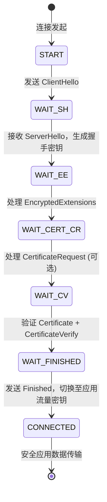
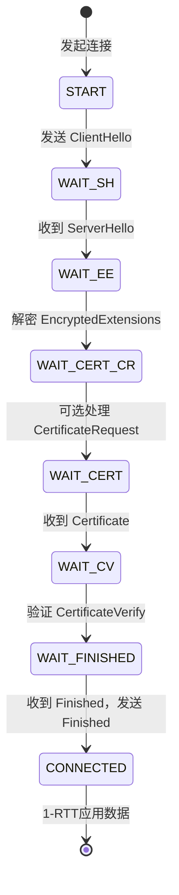
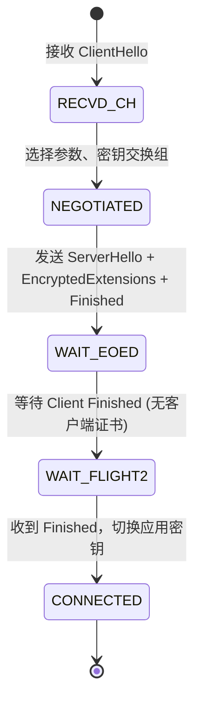

# RFC 8446 - The Transport Layer Security (TLS) Protocol Version 1.3

## 1. RFC概述

### 1.1 基本信息

- **RFC编号**: RFC 8446
- **标题**: The Transport Layer Security (TLS) Protocol Version 1.3
- **发布日期**: 2018年8月
- **状态**: Internet Standard
- **更新**: RFC 5705, RFC 6066, RFC 6961, RFC 7627 (Obsolete); RFC 8447, RFC 9155, RFC 9367 (Updates)

### 1.2 历史背景

TLS 1.3是TLS协议自1999年以来的最大升级，旨在解决TLS 1.2中存在的诸多安全和性能问题：

- **Handshake延迟**: TLS 1.2需要2-RTT完成握手；TLS 1.3将首次连接降至1-RTT，会话恢复支持0-RTT。
- **遗留算法移除**: 强制移除MD5、SHA-1、RSA密钥交换、CBC模式、RC4等弱算法。
- **前向安全性**: 所有密钥交换机制默认提供Perfect Forward Secrecy (PFS)。
- **简化设计**: 握手消息加密更早开始，减少中间盒篡改攻击面。

### 1.3 核心贡献

- 定义了1-RTT握手协议
- 引入0-RTT数据模式（ Early Data ）
- 全面的前向安全密钥交换（仅允许 (EC)DHE ）
- 握手后加密，减少明文暴露
- 新的密钥派生结构（Key Schedule）

---

## 2. 协议详细说明

### 2.1 握手协议概览

TLS 1.3握手相比1.2进行了大幅简化。核心消息流如下：

**1-RTT完整握手**:

```
客户端                                                           服务器
   |                                                               |
   |  ClientHello                                                  |
   |  + key_share                                                  |
   |  + signature_algorithms                                       |
   |  + supported_versions (TLS 1.3)                              |
   |-------------------------------------------------------------->|
   |                                                               |
   |                              ServerHello                      |
   |                              + key_share                      |
   |                              {EncryptedExtensions}            |
   |                              {CertificateRequest}             |
   |                              {Certificate}                    |
   |                              {CertificateVerify}              |
   |                              {Finished}                       |
   |<--------------------------------------------------------------|
   |                                                               |
   |  {Certificate}                                                |
   |  {CertificateVerify}                                          |
   |  {Finished}                                                   |
   |  [Application Data] ------->                                  |
   |-------------------------------------------------------------->|
   |                              [Application Data]               |
   |<--------------------------------------------------------------|

注: {} = 握手加密消息, [] = 应用数据（已用握手密钥加密）
```

### 2.2 握手状态机



### 2.3 0-RTT vs 1-RTT 对比

| 特性 | 1-RTT握手 | 0-RTT握手 |
|------|-----------|-----------|
| 首次往返数 | 1-RTT（ClientHello → ServerHello） | 0-RTT（复用PSK，立即发送应用数据） |
| 延迟 | ~1×RTT | ~0×RTT（数据与ClientHello同时发送） |
| 安全保证 | 完整前向安全 | 无前向安全保证（重放攻击风险） |
| 适用场景 | 首次访问或PSK过期 | 重复访问、静态资源请求 |
| 实现要求 | 标准 | 需客户端缓存 pre_shared_key 和 early_data 配置 |

**0-RTT消息流**:

```
客户端                                                           服务器
   |                                                               |
   |  ClientHello                                                  |
   |  + key_share                                                  |
   |  + pre_shared_key                                             |
   |  + early_data                                                 |
   |  (0-RTT Application Data)  ---------------------------------->|
   |                                                               |
   |                              ServerHello                      |
   |                              + pre_shared_key                 |
   |                              {EncryptedExtensions}            |
   |                              {Finished}                       |
   |                              (1-RTT Application Data)         |
   |<--------------------------------------------------------------|
   |                                                               |
   |  {EndOfEarlyData}                                             |
   |  {Finished}                                                   |
   |  (1-RTT Application Data)  ---------------------------------->|
   |                                                               |
```

---

## 3. 报文格式

### 3.1 TLS 1.3 Record层格式

TLS记录层作为底层承载，封装所有上层握手和应用数据：

```
 0                   1                   2                   3
 0 1 2 3 4 5 6 7 8 9 0 1 2 3 4 5 6 7 8 9 0 1 2 3 4 5 6 7 8 9 0 1
+-+-+-+-+-+-+-+-+-+-+-+-+-+-+-+-+-+-+-+-+-+-+-+-+-+-+-+-+-+-+-+-+
|  ContentType  |    Version    |            Length             |
+-+-+-+-+-+-+-+-+-+-+-+-+-+-+-+-+-+-+-+-+-+-+-+-+-+-+-+-+-+-+-+-+
|                                                               |
|                          Fragment                             |
|                      (加密后的数据)                            |
|                                                               |
+-+-+-+-+-+-+-+-+-+-+-+-+-+-+-+-+-+-+-+-+-+-+-+-+-+-+-+-+-+-+-+-+
```

| 字段 | 长度 | 说明 |
|------|------|------|
| ContentType | 1 byte | `change_cipher_spec(20)`, `alert(21)`, `handshake(22)`, `application_data(23)` |
| Version | 2 bytes | 兼容TLS 1.2，固定为 `0x0303`（TLS 1.2版本号） |
| Length | 2 bytes | Fragment长度（最大 $2^{14}$ + 256 bytes for AEAD expansion） |
| Fragment | Length bytes | 加密后的握手消息或应用数据 |

### 3.2 Handshake消息通用首部

```
 0                   1                   2                   3
 0 1 2 3 4 5 6 7 8 9 0 1 2 3 4 5 6 7 8 9 0 1 2 3 4 5 6 7 8 9 0 1
+-+-+-+-+-+-+-+-+-+-+-+-+-+-+-+-+-+-+-+-+-+-+-+-+-+-+-+-+-+-+-+-+
|   HandshakeType  |                 Length (24-bit)            |
+-+-+-+-+-+-+-+-+-+-+-+-+-+-+-+-+-+-+-+-+-+-+-+-+-+-+-+-+-+-+-+-+
|                                                               |
|                         HandshakeMessage                      |
+-+-+-+-+-+-+-+-+-+-+-+-+-+-+-+-+-+-+-+-+-+-+-+-+-+-+-+-+-+-+-+-+
```

**主要Handshake类型**:

| 类型值 | 名称 | 描述 |
|--------|------|------|
| 1 | client_hello | 客户端支持的参数 |
| 2 | server_hello | 服务器选择的参数 |
| 8 | encrypted_extensions | 加密扩展协商 |
| 11 | certificate | 证书消息（已加密） |
| 15 | certificate_verify | 证书签名验证 |
| 20 | finished | HMAC验证握手完整性 |
| 24 | key_update | 密钥更新消息 |
| 25 | end_of_early_data | 标记0-RTT结束 |

---

## 4. 密钥派生与数学模型

### 4.1 Key Schedule核心结构

TLS 1.3使用基于HKDF的两阶段密钥派生模型。整个Key Schedule从共享密钥（EC)DHE Secret和/或PSK出发，逐层派生出手秘密、握手流量密钥和应用流量密钥。

```
                    0
                    |
                    v
           PSK ->  HKDF-Extract = Early Secret
                    |
                    +-----> Derive-Secret(...) = "client early traffic secret"
                    |                                (用于0-RTT加密)
                    +-----> Derive-Secret(...) = "early exporter master secret"
                    |
                    v
     (EC)DHE -> HKDF-Extract = Handshake Secret
                    |
                    +-----> Derive-Secret(...) = "client handshake traffic secret"
                    |                                (用于Client Finished加密)
                    +-----> Derive-Secret(...) = "server handshake traffic secret"
                    |                                (用于ServerHello后加密)
                    |
                    v
           0 ->  HKDF-Extract = Master Secret
                    |
                    +-----> Derive-Secret(...) = "client application traffic secret"
                    |                                (用于客户端应用数据)
                    +-----> Derive-Secret(...) = "server application traffic secret"
                    |                                (用于服务器应用数据)
                    +-----> Derive-Secret(...) = "exporter master secret"
                    +-----> Derive-Secret(...) = "resumption master secret" (用于PSK派生)
```

### 4.2 HKDF公式

TLS 1.3使用HKDF-SHA256或HKDF-SHA384进行密钥派生：

**HKDF-Extract(salt, IKM)**:

$$\text{PRK} = \text{HMAC-Hash}(\text{salt}, \text{IKM})$$

**HKDF-Expand(PRK, info, L)**:

$$\text{OKM} = \text{T}_1 \ | \ \text{T}_2 \ | \ \dots \ | \ \text{T}_L$$

其中：

$$\text{T}_1 = \text{HMAC-Hash}(\text{PRK}, \text{T}_0 \ | \ \text{info} \ | \ 0\text{x}01)$$
$$\text{T}_2 = \text{HMAC-Hash}(\text{PRK}, \text{T}_1 \ | \ \text{info} \ | \ 0\text{x}02)$$
$$\dots$$

### 4.3 Finished消息计算

Finished消息验证握手完整性，其verify_data计算如下：

$$\text{verify\_data} = \text{HMAC}(\text{finished\_key}, \text{Transcript-Hash})$$

其中：

- `finished_key` = HKDF-Expand-Label(BaseKey, "finished", "", Hash.length)
- `BaseKey` 对客户端是 `client_handshake_traffic_secret`，对服务器是 `server_handshake_traffic_secret`
- `Transcript-Hash` 是截至当前所有握手消息的哈希

---

## 5. 状态机

### 5.1 客户端握手状态机



### 5.2 服务器握手状态机



---

## 6. 安全性考虑

### 6.1 TLS 1.3 vs TLS 1.2 安全改进

| 威胁/问题 | TLS 1.2 状态 | TLS 1.3 改进 |
|-----------|--------------|--------------|
| RSA密钥交换 | 支持（无前向安全） | **移除**，仅允许 (EC)DHE |
| 弱哈希算法 | SHA-1 仍可用于证书签名 | **强制使用 SHA-256/384** |
| CBC填充Oracle | 支持CBC模式，易遭受POODLE/Lucky13 | **仅允许 AEAD (AES-GCM, ChaCha20-Poly1305)** |
| 降级攻击 | 版本协商在明文 | 版本协商嵌入 `supported_versions` 扩展，Finished验证完整性 |
| 中间盒篡改 | 握手消息大量明文 | ServerHello之后立即加密 |
| 重协商攻击 | 支持，曾被多次攻击 | **移除握手重协商** |

### 6.2 0-RTT重放攻击风险

0-RTT数据在客户端发送时，服务器尚未提供任何新鲜随机数（nonce），因此存在**重放攻击**风险：

- **风险**: 攻击者截获0-RTT请求后可重复发送给服务器。
- **缓解措施**:
  1. 服务器使用 `early_data` 扩展指示是否接受0-RTT。
  2. 对0-RTT请求实施幂等性检查（如使用唯一token）。
  3. 限制0-RTT数据量（`max_early_data_size`）。
  4. 在服务器端使用票证年龄校验（ticket age check）。

### 6.3 Key Update与密钥前向安全

TLS 1.3支持**Key Update**消息，允许在连接生命周期内更新应用流量密钥，而无需重新握手：

$$\text{client\_application\_traffic\_secret}_N = \text{HKDF-Expand-Label}(\text{client\_application\_traffic\_secret}_{N-1}, \text{"traffic upd"}, \text{""}, \text{Hash.length})$$

这确保了长期连接即使某时刻密钥泄露，也无法解密之前的流量（前向安全）。

---

## 7. 与教材对标的章节

### 7.1 《计算机网络：自顶向下方法》(Kurose & Ross)

| RFC 8446内容 | 对应章节 |
|--------------|----------|
| TLS概述与作用 | 第8章：网络安全 - 8.6 使TCP连接安全：SSL/TLS |
| TLS握手过程 | 8.6.1 SSL/TLS握手 |
| 密钥派生 | 8.6.2 密钥派生与记录协议 |
| 前向安全 | 8.6 安全性讨论 |

### 7.2 《TCP/IP详解 卷1：协议》

| RFC 8446内容 | 对应章节 |
|--------------|----------|
| TLS协议演进 | 第17章：TCP交易协议 / 安全协议相关 |
| 握手协议 | TLS专题补充 |
| 记录协议 | 应用层安全协议 |

### 7.3 《计算机网络》（谢希仁）

| RFC 8446内容 | 对应章节 |
|--------------|----------|
| TLS/SSL协议 | 第7章：网络安全 - 7.6.1 SSL安全套接字层 |
| 握手协议 | 7.6.1 SSL握手协议 |
| 记录协议 | 7.6.1 SSL记录协议 |

---

## 8. 实现示例

### 8.1 Python实现：TLS 1.3客户端

Python 3.7+ 的 `ssl` 模块原生支持 TLS 1.3（取决于OpenSSL版本 ≥ 1.1.1）：

```python
import socket
import ssl

def tls13_client(hostname: str, port: int = 443):
    """
    建立TLS 1.3连接并获取证书信息。
    要求 Python 编译时链接 OpenSSL >= 1.1.1
    """
    context = ssl.create_default_context()

    # 强制最低版本为TLS 1.3
    context.minimum_version = ssl.TLSVersion.TLSv1_3

    # 可选：设置密码套件偏好
    context.set_ciphers('TLS_AES_256_GCM_SHA384:TLS_CHACHA20_POLY1305_SHA256')

    with socket.create_connection((hostname, port), timeout=10) as sock:
        with context.wrap_socket(sock, server_hostname=hostname) as ssock:
            print(f"Protocol: {ssock.version()}")
            print(f"Cipher: {ssock.cipher()}")
            print(f"ALPN: {ssock.selected_alpn_protocol()}")

            cert = ssock.getpeercert()
            print(f"Subject: {cert.get('subject')}")
            print(f"Issuer: {cert.get('issuer')}")
            print(f"NotAfter: {cert.get('notAfter')}")

            # 发送HTTP GET请求
            request = f"GET / HTTP/1.1\r\nHost: {hostname}\r\nConnection: close\r\n\r\n"
            ssock.sendall(request.encode())

            response = b""
            while True:
                data = ssock.recv(4096)
                if not data:
                    break
                response += data

            return response.decode('utf-8', errors='replace')[:500]

# 使用示例
# print(tls13_client("cloudflare.com"))
```

### 8.2 Python实现：TLS握手信息解析

使用 `cryptography` 库解析证书并验证签名算法：

```python
from cryptography import x509
from cryptography.hazmat.primitives import hashes
import ssl
import socket

def inspect_server_certificate(hostname: str, port: int = 443):
    """获取并解析服务器TLS证书，确认签名算法。"""
    context = ssl.create_default_context()
    context.minimum_version = ssl.TLSVersion.TLSv1_3

    with socket.create_connection((hostname, port), timeout=10) as sock:
        with context.wrap_socket(sock, server_hostname=hostname) as ssock:
            der_cert = ssock.getpeercert(binary_form=True)
            cert = x509.load_der_x509_certificate(der_cert)

            print(f"Subject: {cert.subject.rfc4514_string()}")
            print(f"Issuer: {cert.issuer.rfc4514_string()}")
            print(f"Serial: {cert.serial_number}")
            print(f"Not Before: {cert.not_valid_before}")
            print(f"Not After: {cert.not_valid_after}")
            print(f"Signature Algorithm: {cert.signature_algorithm_oid._name}")
            print(f"Public Key Algorithm: {cert.public_key().__class__.__name__}")

            # TLS 1.3要求使用RSASSA-PSS或ECDSA，不再允许SHA-1
            if isinstance(cert.signature_hash_algorithm, hashes.SHA1):
                print("WARNING: Certificate uses SHA-1, invalid for TLS 1.3!")
            else:
                print("Certificate hash algorithm is TLS 1.3 compliant.")

# 使用示例
# inspect_server_certificate("google.com")
```

### 8.3 OpenSSL命令行示例

```bash
# 强制使用TLS 1.3连接到服务器并显示握手详情
openssl s_client -connect cloudflare.com:443 -tls1_3 -status

# 测试特定TLS 1.3密码套件
openssl s_client -connect cloudflare.com:443 -tls1_3 -ciphersuites TLS_AES_256_GCM_SHA384

# 查看服务器支持的TLS版本和密码套件（使用testssl.sh或nmap）
nmap --script ssl-enum-ciphers -p 443 cloudflare.com

# 使用OpenSSL提取TLS 1.3握手包（Wireshark解密用）
openssl s_client -connect cloudflare.com:443 -tls1_3 -keylogfile tls13_keys.log
```

---

## 9. 现代应用与性能

### 9.1 TLS 1.3握手延迟对比

以下数据来自实验环境（RTT = 30ms，客户端无缓存PSK）：

| 指标 | TLS 1.2 | TLS 1.3 (1-RTT) | TLS 1.3 (0-RTT) |
|------|---------|-----------------|-----------------|
| 握手往返次数 | 2-RTT | 1-RTT | 0-RTT |
| 握手时间 | ~60ms | ~30ms | ~0ms (数据立即发送) |
| 首个应用字节延迟 | ~90ms | ~30ms | ~0ms |
| 前向安全 | 可选 (DHE) | 强制 | 0-RTT数据无PFS |

**实际Web场景影响**:

- 在移动网络（RTT 100-300ms）中，TLS 1.3的1-RTT握手可将首次内容绘制（FCP）提升 **100-300ms**。
- 0-RTT对重复访问的首字节时间（TTFB）有最大优化效果，但需权衡重放风险。

### 9.2 TLS 1.3部署现状（2025）

根据主流监测数据：

- **Cloudflare**: 超过 95% 的HTTPS流量使用TLS 1.3。
- **Google**: 超过 80% 的Chrome HTTPS连接使用TLS 1.3。
- **浏览器支持**: Chrome 70+, Firefox 63+, Safari 12.1+, Edge 75+ 全面支持。
- **服务端支持**: Nginx 1.13+, Apache 2.4.37+, OpenSSL 1.1.1+ 默认启用。

### 9.3 QUIC + TLS 1.3

QUIC将TLS 1.3直接集成到其加密握手层中，实现了：

- **合并握手**: 传输参数协商与TLS 1.3握手在同一轮次完成。
- **更快的连接迁移**: 基于Connection ID而非IP/Port四元组。
- **无队头阻塞**: QUIC数据包丢失不影响其他独立流。

---

## 10. 形式化视角

### 10.1 协议属性

TLS 1.3的设计目标可形式化为以下安全属性：

| 属性 | 定义 | TLS 1.3 保证 |
|------|------|--------------|
| **认证性 (Authentication)** | 双方确认对方身份 | 基于X.509证书链 + 数字签名 |
| **机密性 (Confidentiality)** | 第三方无法读取内容 | AEAD加密 (AES-GCM / ChaCha20-Poly1305) |
| **完整性 (Integrity)** | 内容无法被静默篡改 | AEAD标签验证 |
| **前向安全 (Forward Secrecy)** | 长期密钥泄露不泄露历史会话 | (EC)DHE临时密钥交换 |
| **密钥确认 (Key Confirmation)** | 双方确认派生密钥一致 | Finished消息中的Transcript-Hash验证 |

### 10.2 符号表示（简化）

设客户端和服务器分别拥有长期签名密钥对 $(sk_C, pk_C)$ 和 $(sk_S, pk_S)$，以及临时 (EC)DHE 密钥对 $(x, g^x)$ 和 $(y, g^y)$。

共享密钥：
$$SS = g^{xy}$$

派生出的应用数据加密密钥：
$$K_{app} = \text{HKDF-Expand-Label}(\text{HKDF-Extract}(0, SS), \text{"app key"}, \text{TH}, L)$$

其中 $TH = \text{Hash}(\text{ClientHello} \ | \ \text{ServerHello} \ | \ \dots)$。

---

## 参考文献

1. Rescorla, E. "The Transport Layer Security (TLS) Protocol Version 1.3." RFC 8446, August 2018.
2. Rescorla, E. "Keying Material Exporters for TLS." RFC 5705, March 2010.
3. Eastlake 3rd, D. "Transport Layer Security (TLS) Extensions: Extension Definitions." RFC 6066, January 2011.
4. Krawczyk, H. and P. Eronen. "HMAC-based Extract-and-Expand Key Derivation Function (HKDF)." RFC 5869, May 2010.
5. Langley, A., Riddoch, A., et al. "The QUIC Transport Protocol." RFC 9000, May 2021.
6. Kurose, J.F. and K.W. Ross. "Computer Networking: A Top-Down Approach." 8th Edition, Pearson.
7. W. Richard Stevens. "TCP/IP Illustrated, Volume 1: The Protocols." Addison-Wesley.
8. 谢希仁. "计算机网络（第8版）." 电子工业出版社.

---

_文档版本: 1.0_
_最后更新: 2026年_
_状态: 核心RFC映射完成_
