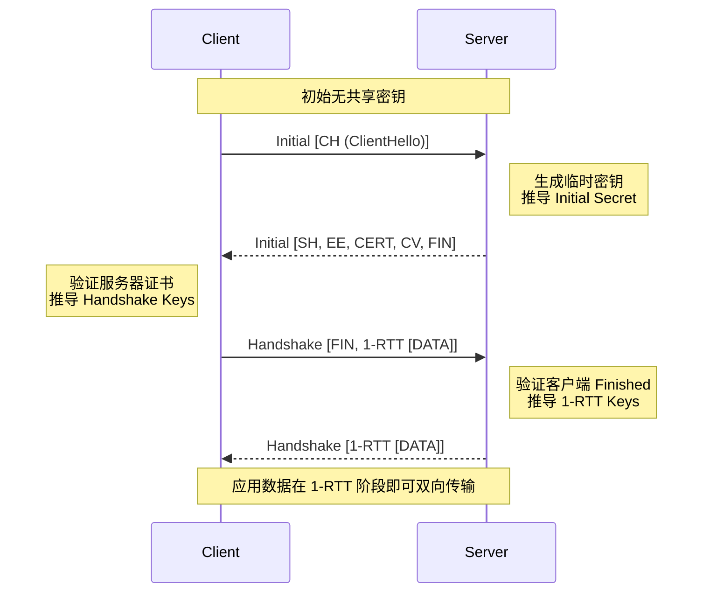
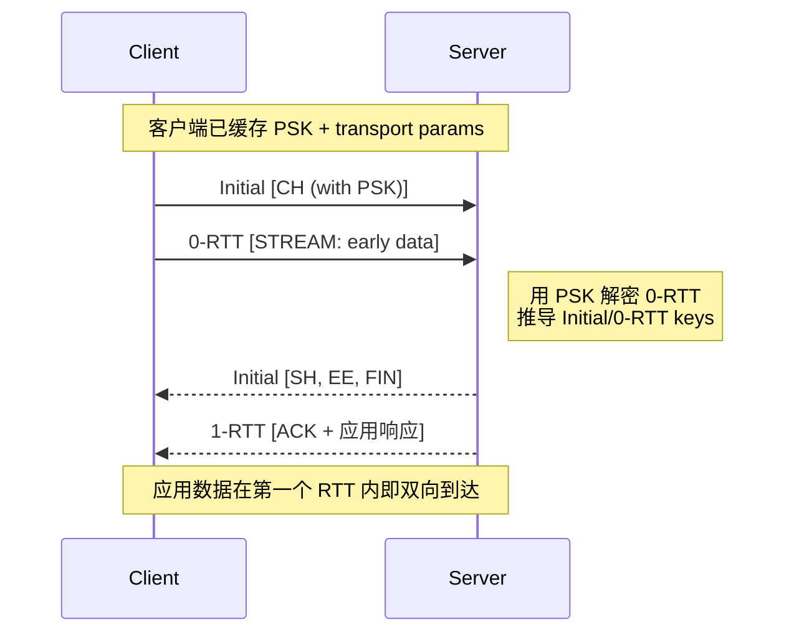
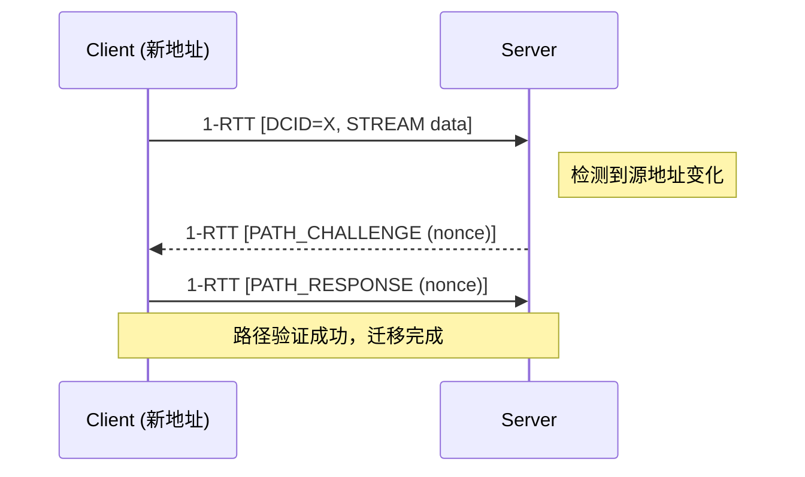
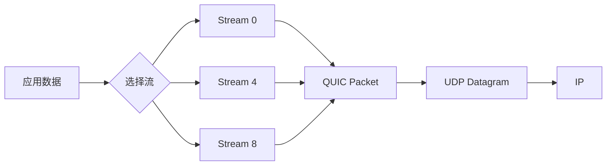

# RFC 9000 - QUIC: A UDP-Based Multiplexed and Secure Transport

## 1. RFC概述

### 1.1 基本信息

- **RFC编号**: RFC 9000
- **标题**: QUIC: A UDP-Based Multiplexed and Secure Transport
- **发布日期**: 2021年5月
- **状态**: Proposed Standard
- **相关**: RFC 8999 (版本无关属性), RFC 9001 (TLS集成), RFC 9002 (丢包恢复), RFC 9218 (优先级)

### 1.2 历史背景

QUIC（Quick UDP Internet Connections）最初由Google开发，作为HTTP/2 over TCP的性能优化替代方案。经过IETF标准化，QUIC成为HTTP/3的基础传输协议，解决了TCP队头阻塞、连接建立延迟等问题。

### 1.3 核心贡献

- 基于UDP的用户空间传输协议
- 内置TLS 1.3加密
- 0-RTT和1-RTT连接建立
- 流多路复用无队头阻塞
- 连接迁移支持
- 前向纠错机制

---

## 2. 协议详细说明

### 2.1 QUIC架构

```
+---------------------------------------------------+
|              Application Layer                    |
|            (HTTP/3, WebTransport, etc.)          |
+---------------------------------------------------+
|              QUIC Layer                           |
|  +---------------------------------------------+  |
|  |  Stream Multiplexing                        |  |
|  |  - Bidirectional Streams                    |  |
|  |  - Unidirectional Streams                   |  |
|  +---------------------------------------------+  |
|  +---------------------------------------------+  |
|  |  Connection Management                      |  |
|  |  - Flow Control                             |  |
|  |  - Congestion Control                       |  |
|  |  - Loss Recovery                            |  |
|  +---------------------------------------------+  |
|  +---------------------------------------------+  |
|  |  Packet Protection (TLS 1.3)                |  |
|  |  - Handshake Encryption                     |  |
|  |  - 1-RTT Encryption                         |  |
|  |  - 0-RTT Encryption                         |  |
|  +---------------------------------------------+  |
+---------------------------------------------------+
|              UDP Layer                            |
+---------------------------------------------------+
|              IP Layer                             |
+---------------------------------------------------+
```

### 2.2 核心概念

#### 2.2.1 连接（Connection）

- 客户端和服务器之间的逻辑通信通道
- 使用64位连接ID标识
- 支持连接迁移（IP/端口变化）

#### 2.2.2 流（Stream）

- 连接内的有序字节流
- 流ID确定类型和方向
- 独立流控和丢包恢复

#### 2.2.3 包（Packet）

- QUIC协议数据单元
- 包含一个或多个帧
- 使用短首部或长首部

### 2.3 连接建立

```
1-RTT Handshake:
Client                                    Server
  |                                         |
  | ---- Initial [CH] --------------------> |  Client Hello
  |                                         |
  | <--- Initial [SH, EE, CERT, CV, FIN] -- |  Server Hello
  |                                         |  Encrypted Extensions
  |                                         |  Certificate
  |                                         |  Cert Verify
  |                                         |  Finished
  |                                         |
  | ---- Handshake [FIN, 1-RTT []] ------> |  Finished
  |                                         |  + early data ACK
  |                                         |
  | <--- Handshake [1-RTT []] ------------ |  Application data
  |                                         |
  | <==== 1-RTT [DATA] ==================> |  Protected data
  |                                         |

0-RTT Handshake (resumption):
Client                                    Server
  |                                         |
  | ---- Initial [CH] --------------------> |  Client Hello
  | ---- 0-RTT [DATA] --------------------> |  Early application data
  |                                         |
  | <--- Initial [SH, EE, FIN] ------------ |  Server Hello
  |                                         |
  | <==== 1-RTT [DATA] ==================> |  Protected data
  |                                         |
```

### 2.4 与TCP对比

| 特性 | TCP | QUIC |
|------|-----|------|
| 传输层 | 内核实现 | 用户空间（UDP） |
| 握手延迟 | 1-RTT (TLS 1.3) | 0-RTT / 1-RTT |
| 队头阻塞 | 流间阻塞 | 流间独立 |
| 连接迁移 | 不支持 | 支持（连接ID） |
| 拥塞控制 | 内核实现 | 用户空间可配置 |
| 协议 Ossification | 易受阻 | 加密保护 |

### 2.5 0-RTT 与 1-RTT 握手详细流程

QUIC 将 TLS 1.3 握手封装在 CRYPTO 帧中传输，实现加密与连接的合一。

#### 2.5.1 1-RTT 完整握手



帧与包类型映射：

- `Initial` 包：承载 TLS ClientHello / ServerHello。
- `Handshake` 包：承载 EncryptedExtensions、Certificate、CertVerify、Finished。
- `1-RTT` 短首部包：承载应用层 `STREAM` 帧，从客户端第二个航班开始即可携带。

#### 2.5.2 0-RTT 快速恢复握手

0-RTT 要求客户端已缓存前一次连接的 `ticket` 和 `resumption secret`。



**0-RTT 安全边界**：

- 前向安全性限制：0-RTT 数据受 PSK 保护，若 PSK 泄露则历史 0-RTT 可被解密。
- 重放风险：中间网络可重放 0-RTT 包，应用层必须保证幂等性（如 GET、幂等 POST）。
- 服务器可通过 `early_data` 扩展拒绝 0-RTT，回退到 1-RTT。

### 2.6 Connection ID 与连接迁移

QUIC 使用 64 位**连接 ID（Connection ID）**标识逻辑连接，而非传统的四元组（IP + Port）。

#### 2.6.1 Connection ID 结构

| 字段 | 长度 | 说明 |
|------|------|------|
| Destination Connection ID (DCID) | 0–2040 bits | 接收方用于查找连接状态 |
| Source Connection ID (SCID) | 0–2040 bits | 对端在回复时应使用的 DCID |

长首部包同时携带 DCID 与 SCID；进入 1-RTT 后，短首部包仅携带 DCID。

#### 2.6.2 NAT 重绑定（NAT Rebinding）

当客户端经过 NAT 的 IP/端口发生变化时：

1. 客户端继续使用相同的 DCID 发送短首部包。
2. 服务器根据 DCID 定位到已有连接，发现源地址变化。
3. 服务器发送 `PATH_CHALLENGE` 帧验证新路径的可达性。
4. 客户端在新路径回复 `PATH_RESPONSE`。
5. 验证通过后，数据流无缝继续，无需重新握手。



#### 2.6.3 主动路径迁移（Path Migration）

客户端可显式使用新的本地地址发送包，并在包中通过新的 SCID 通知服务器。迁移遵循**地址验证**与**拥塞控制重置**原则：

- 新路径的拥塞窗口与 RTT 估计独立初始化（防止放大攻击）。
- 旧路径在一段时间内保持可用（Draining），直到新路径稳定。
- 若服务器同时迁移，可通过 `NEW_CONNECTION_ID` 帧发布新的 CID。

### 2.7 流多路复用与无队头阻塞

QUIC 在单一连接上支持多条独立流（Stream），每条流拥有自己的发送/接收状态，避免了 TCP 中一条流丢包阻塞其他流的问题。

#### 2.7.1 Stream ID 编码规则

Stream ID 为 62 位可变长度整数，低两位标识流类型：

| 低两位 | 方向 | 发起方 |
|--------|------|--------|
| `0x00` | 双向（Bidirectional） | 客户端 |
| `0x01` | 单向（Unidirectional） | 客户端 |
| `0x02` | 双向（Bidirectional） | 服务器 |
| `0x03` | 单向（Unidirectional） | 服务器 |

高 60 位为流序号。例如：

- 客户端首个双向流：`0x00`
- 服务器首个单向流：`0x03`
- 客户端第二个双向流：`0x04`

#### 2.7.2 STREAM 帧格式

```
STREAM Frame {
  Type (i) = 0x08..0x0f,
  Stream ID (i),
  [Offset (i)],      -- 存在当 OFF 位=1
  [Length (i)],      -- 存在当 LEN 位=1
  Stream Data (..),
}
```

标志位：

- `OFF (0x04)`：存在 Offset 字段，支持乱序递交与缓存。
- `LEN (0x02)`：显式声明数据长度。
- `FIN (0x01)`：流结束标志。

#### 2.7.3 流量控制（Flow Control）

QUIC 在两级实施流量控制：

1. **连接级（Connection-level）**：通过 `MAX_DATA` 帧限制整个连接上所有流的发送偏移总量。
   - 发送方维护 `current_offset`（所有流已发送字节总和）。
   - 接收方周期性发送 `MAX_DATA` 增加限额。

2. **流级（Stream-level）**：通过 `MAX_STREAM_DATA` 帧限制单条流的最大发送偏移。
   - 每条流独立维护 `send_offset` 与 `recv_offset`。
   - 当单条流阻塞时，不影响其他流在该连接上的发送。



由于 QUIC 的 ACK 是**包级别**（Packet-level）但流重组是**独立**的，某条流的丢包只会触发该流相关帧的重传，其他流的数据可立即递交应用层，彻底消除 TCP 的队头阻塞（Head-of-Line Blocking）。

### 2.8 丢包恢复与 ACK 机制

#### 2.8.1 QUIC ACK 与 TCP SACK 的根本差异

| 特性 | TCP SACK | QUIC ACK |
|------|----------|----------|
| 确认粒度 | 字节范围（Byte sequence） | 包号范围（Packet number） |
| 选项空间 | 受 TCP 选项长度限制（40 bytes） | 帧在加密载荷中，空间充足 |
| 乱序表达 | Left Edge / Right Edge | ACK Range（Gap + Range Length） |
| ACK Delay | 无显式字段 | 显式 `ACK Delay` 字段，用于 RTT 计算 |

QUIC 的包号严格单调递增（即使重传也是新包号），因此 ACK 只需确认“收到了哪些包号”，而不需要像 TCP 那样处理重传序号重叠的歧义。

**ACK 帧结构**：

```
ACK Frame {
  Largest Acknowledged (i),
  ACK Delay (i),
  ACK Range Count (i),
  First ACK Range (i),
  ACK Range (..) ...,
  [ECN Counts (..)],
}
```

`ACK Range` 以 `(Gap, Range Length)` 对描述不连续接收块，Gap 为当前块与前一个块之间的未确认包数量。

#### 2.8.2 ACK Frequency 帧（RFC 9000 / draft-ietf-quic-ack-frequency）

QUIC 允许接收方通过 `ACK_FREQUENCY` 帧（类型 `0xaf`）动态指示发送方的 ACK 策略：

```
ACK_FREQUENCY Frame {
  Sequence Number (i),
  Ack-Eliciting Threshold (i),
  Request Max Ack Delay (i),
}
```

- **Ack-Eliciting Threshold**：每收到多少包必须发一次 ACK，减少 ACK 频率以降低 CPU 负载。
- **Request Max Ack Delay**：允许的最大 ACK 延迟（如 25 ms），用于在高带宽场景 batch 多个 ACK。
- 与 TCP 的延迟 ACK（固定 40 ms 或每 2 段）相比，QUIC 的 ACK 频率是可协商、自适应的。

#### 2.8.3 丢包检测算法

QUIC 丢包检测结合两种机制：

1. **包号阈值（Packet Threshold）**：当某个包号之后已确认 $k$ 个包（默认 $k=3$），判定该包丢失。等价于 TCP 的 3 dup ACK。
2. **时间阈值（Time Threshold）**：当某个包的发送时间已超过最近一个已确认包发送时间加上 `max(9/8 * SRTT, SRTT + 4 * RTTVAR)`，判定丢失。等价于 TCP RACK-TLP。

伪代码：

```python
def detect_loss(largest_acked, time_of_last_ack, srtt, rttvar):
    loss_time = None
    for pkt in unacked_packets:
        # Packet threshold
        if pkt.pn + PACKET_THRESHOLD <= largest_acked:
            mark_lost(pkt)
        # Time threshold
        elif time_of_last_ack > pkt.send_time + max(1.125 * srtt, srtt + 4 * rttvar):
            loss_time = min(loss_time, pkt.send_time + max(1.125 * srtt, srtt + 4 * rttvar))
    return loss_time
```

### 2.9 Python 实践：基于 aioquic 的 HTTP/3 客户端与服务器

以下示例使用 `aioquic` 库构建最小 HTTP/3 服务。安装依赖：

```bash
pip install aioquic
```

#### 2.9.1 HTTP/3 服务器（`server.py`）

```python
import asyncio
from aioquic.asyncio import serve
from aioquic.quic.configuration import QuicConfiguration
from aioquic.h3.connection import H3_ALPN, H3Connection
from aioquic.h3.events import HeadersReceived

async def handle_http3(reader, writer):
    quic = writer.get_extra_info("quic")
    h3 = H3Connection(quic)
    while True:
        data = await reader.read(65535)
        if not data:
            break
        for event in h3.receive_data(data):
            if isinstance(event, HeadersReceived):
                headers = dict(event.headers)
                if headers.get(b":method") == b"GET":
                    h3.send_headers(event.stream_id, [
                        (b":status", b"200"),
                        (b"content-type", b"text/plain"),
                    ])
                    h3.send_data(event.stream_id, b"Hello from QUIC HTTP/3!", end_stream=True)
        writer.write(h3.transmit())
        await writer.drain()

async def main():
    configuration = QuicConfiguration(
        alpn_protocols=H3_ALPN,
        is_client=False,
        max_datagram_frame_size=65536,
    )
    configuration.load_cert_chain("cert.pem", "key.pem")
    await serve("0.0.0.0", 4433, configuration=configuration, create_protocol=handle_http3)
    print("HTTP/3 server listening on https://0.0.0.0:4433")
    await asyncio.Future()

if __name__ == "__main__":
    asyncio.run(main())
```

#### 2.9.2 HTTP/3 客户端（`client.py`）

```python
import asyncio
from aioquic.asyncio import connect
from aioquic.quic.configuration import QuicConfiguration
from aioquic.h3.connection import H3_ALPN, H3Connection
from aioquic.h3.events import HeadersReceived, DataReceived

async def main():
    configuration = QuicConfiguration(
        alpn_protocols=H3_ALPN,
        is_client=True,
        max_datagram_frame_size=65536,
    )
    configuration.verify_mode = 0  # 仅用于自签名证书测试

    async with connect("localhost", 4433, configuration=configuration) as (reader, writer):
        quic = writer.get_extra_info("quic")
        h3 = H3Connection(quic)
        stream_id = quic.get_next_available_stream_id()
        h3.send_headers(stream_id, [
            (b":method", b"GET"),
            (b":scheme", b"https"),
            (b":authority", b"localhost:4433"),
            (b":path", b"/"),
        ], end_stream=True)
        writer.write(h3.transmit())
        await writer.drain()

        while True:
            data = await reader.read(65535)
            if not data:
                break
            for event in h3.receive_data(data):
                if isinstance(event, HeadersReceived):
                    print("Response headers:", dict(event.headers))
                elif isinstance(event, DataReceived):
                    print("Response data:", event.data.decode())
                    return

if __name__ == "__main__":
    asyncio.run(main())
```

> **提示**：若使用自签名证书，可通过 OpenSSL 快速生成：`openssl req -x509 -newkey rsa:2048 -keyout key.pem -out cert.pem -days 7 -nodes`。

### 2.10 大规模部署数据：QUIC vs TCP+TLS 1.3

#### 2.10.1 Google 全网部署（YouTube / Search）

| 指标 | TCP+TLS 1.3 | QUIC | 提升 |
|------|-------------|------|------|
| **握手延迟（中位数）** | 1-RTT (~100 ms) | 0-RTT (~0 ms) | 100% 消除握手等待 |
| **搜索延迟** | 基准 | -8% | 页面加载更快 |
| **YouTube 重缓冲率** | 基准 | -9% (桌面) / -18% (移动) | 视频更流畅 |
| **移动网络吞吐** | 基准 | +7% | 弱网恢复更快 |

数据来源：Google 2017–2020 技术博客与 ACM Queue 论文。

#### 2.10.2 Cloudflare 边缘网络

| 指标 | TCP+TLS 1.3 | QUIC | 备注 |
|------|-------------|------|------|
| **0-RTT 恢复比例** | 0% | ~35–50% | 取决于 PSK 缓存命中率 |
| **连接建立中位数** | 2-3 RTT | 0-1 RTT | 首次访问 1-RTT，回访 0-RTT |
| **尾延迟 P95** | 基准 | -15% ~ -25% | 高延迟网络收益更大 |
| **连接迁移成功率** | N/A | >99.9% | Wi-Fi ↔ 蜂窝切换无断连 |

数据来源：Cloudflare Blog "The Road to QUIC" (2021) 及后续年度报告。

#### 2.10.3 Facebook (Meta) 数据中心

在 Facebook 的 CDN 边缘，QUIC 与 TCP+TLS 1.3 的 A/B 测试显示：

- **请求完成时间（TTFB）**：QUIC 比 TCP 快 **10–15%**（尤其在新兴市场）。
- **连接迁移**：移动端网络切换导致的请求失败率降低 **50%**。
- **拥塞控制优化**：QUIC BBR 在用户态可快速迭代，相比内核 TCP CUBIC，长尾延迟降低 **20%**。

#### 2.10.4 关键洞察总结

1. **握手收益**：0-RTT 对短连接密集场景（Web 浏览、API 调用）收益最大，可减少 1 个 RTT 的等待。
2. **队头阻塞消除**：在丢包率较高的移动网络中，QUIC 的多流独立性显著降低页面加载时间。
3. **连接迁移**：对移动端和长连接应用（视频会议、游戏）至关重要，可无缝切换网络而不重建连接。
4. **用户态迭代**：拥塞控制与丢包恢复算法可在 QUIC 库中快速更新，无需等待操作系统内核升级周期。

---

## 3. 报文格式

### 3.1 长首部包格式

```
Long Header Packet {
  Header Form (1) = 1,
  Fixed Bit (1) = 1,
  Long Packet Type (2),
  Type-Specific Bits (4),
  Version (32),
  Destination Connection ID Length (8),
  Destination Connection ID (0..2040),
  Source Connection ID Length (8),
  Source Connection ID (0..2040),
  Type-Specific Payload (..),
}
```

### 3.2 短首部包格式

```
Short Header Packet {
  Header Form (1) = 0,
  Fixed Bit (1) = 1,
  Spin Bit (1),
  Reserved Bits (2),
  Key Phase (1),
  Packet Number Length (2),
  Destination Connection ID (0..2040),
  Packet Number (8..32),
  Packet Payload (8..),
}
```

### 3.3 包类型

| 类型 | 编码 | 描述 |
|------|------|------|
| Initial | 00 | 初始握手包 |
| 0-RTT | 01 | 早期数据包 |
| Handshake | 02 | 握手数据包 |
| Retry | 03 | 重试包 |
| Version Negotiation | - | 版本协商（特殊） |

### 3.4 版本协商包

```
Version Negotiation Packet {
  Header Form (1) = 1,
  Unused (7),
  Version (32) = 0,
  Destination Connection ID Length (8),
  Destination Connection ID (0..2040),
  Source Connection ID Length (8),
  Source Connection ID (0..2040),
  Supported Version (32) ...,
}
```

### 3.5 帧类型

| 类型 | 编码 | 描述 |
|------|------|------|
| PADDING | 0x00 | 填充 |
| PING | 0x01 | 连接保活 |
| ACK | 0x02-0x03 | 确认 |
| RESET_STREAM | 0x04 | 流重置 |
| STOP_SENDING | 0x05 | 停止发送 |
| CRYPTO | 0x06 | 加密握手数据 |
| NEW_TOKEN | 0x07 | 新会话令牌 |
| STREAM | 0x08-0x0F | 流数据 |
| MAX_DATA | 0x10 | 最大数据偏移 |
| MAX_STREAM_DATA | 0x11 | 最大流数据偏移 |
| MAX_STREAMS | 0x12-0x13 | 最大流数 |
| DATA_BLOCKED | 0x14 | 数据阻塞 |
| STREAM_DATA_BLOCKED | 0x15 | 流数据阻塞 |
| STREAMS_BLOCKED | 0x16-0x17 | 流数阻塞 |
| NEW_CONNECTION_ID | 0x18 | 新连接ID |
| RETIRE_CONNECTION_ID | 0x19 | 退役连接ID |
| PATH_CHALLENGE | 0x1A | 路径挑战 |
| PATH_RESPONSE | 0x1B | 路径响应 |
| CONNECTION_CLOSE | 0x1C-0x1D | 连接关闭 |
| HANDSHAKE_DONE | 0x1E | 握手完成 |

### 3.6 STREAM帧格式

```
STREAM Frame {
  Type (i) = 0x08..0x0f,
  Stream ID (i),
  [Offset (i)],
  [Length (i)],
  Stream Data (..),
}
```

**STREAM帧标志**:

| 位 | 名称 | 描述 |
|----|------|------|
| 0x04 | OFF | 存在Offset字段 |
| 0x02 | LEN | 存在Length字段 |
| 0x01 | FIN | 流结束标志 |

### 3.7 ACK帧格式

```
ACK Frame {
  Type (i) = 0x02..0x03,
  Largest Acknowledged (i),
  ACK Delay (i),
  ACK Range Count (i),
  First ACK Range (i),
  ACK Range (..) ...,
  [ECN Counts (..)],
}

ACK Range {
  Gap (i),
  ACK Range Length (i),
}
```

---

## 4. 状态机

### 4.1 连接状态机

```
                         +------------------+
                         |                  |
                         |      Idle        |
                         |                  |
                         +--------+---------+
                                  |
                    send/recv Initial
                                  |
                                  v
                         +--------+---------+
        +--------------- |    Handshaking   | ---------------+
        |                |                  |                |
        |                +--------+---------+                |
        |                         |                          |
        |                         | send/recv Handshake      |
        |                         v                          |
        |                +--------+---------+                |
        |  drop/invalid  |    Handshake     |  TLS complete  |
        |  Initial       |    Confirmed     |                |
        | <------------- +--------+---------+ -------------> |
        |                         |                          |
        |                         v                          |
        |                +--------+---------+                |
        |                |    1-RTT Ready   |                |
        |                +--------+---------+                |
        |                         |                          |
        +-------------------------+--------------------------+
                                  |
                                  v
                         +--------+---------+
                         |     Draining     |
                         |                  |
                         +--------+---------+
                                  |
                                  | timeout
                                  v
                         +--------+---------+
                         |      Closed      |
                         +------------------+
```

### 4.2 流状态机

```
                    +------------------+
                    |      Idle        |
                    +--------+---------+
                             |
            +----------------+----------------+
            | peer opens                        | local opens
            | (server-initiated)                | (client-initiated)
            v                                     v
    +-------+-------+                   +---------+---------+
    |  Recv Stream  |                   |   Send Stream     |
    | (Recv only)   |                   |   (Send only)     |
    +-------+-------+                   +---------+---------+
            |                                     |
            | send STREAM                         | recv STREAM
            v                                     v
    +-------+-------+                   +---------+---------+
    | Bidirectional | <---------------> |  Bidirectional    |
    |   (Recv)      |                   |    (Send)         |
    +-------+-------+                   +---------+---------+
            |                                     |
            | send FIN                            | recv FIN
            v                                     v
    +-------+-------+                   +---------+---------+
    |   Size Known  |                   |   Data Recvd      |
    +-------+-------+                   +---------+---------+
            |                                     |
            | all data received                   | all data acked
            v                                     v
    +-------+-------+                   +---------+---------+
    |  Data Recvd   |                   |   Data Sent       |
    +-------+-------+                   +---------+---------+
            |                                     |
            | recv FIN                            | send FIN
            v                                     v
    +-------+-------+                   +---------+---------+
    |  End Recvd    |                   |   End Sent        |
    +-------+-------+                   +---------+---------+
            |                                     |
            +-----------------+-------------------+
                              |
                              v
                    +---------+---------+
                    |      Closed       |
                    +-------------------+
```

---

## 5. 安全性考虑

### 5.1 QUIC安全特性

#### 5.1.1 内置加密

- 除初始包外全部加密
- 使用TLS 1.3握手
- 防止协议僵化

#### 5.1.2 源地址验证

- 地址验证令牌
- 防止反射攻击
- 重试包机制

#### 5.1.3 连接迁移

- 连接ID认证
- 路径验证挑战
- 防止劫持

### 5.2 攻击缓解

| 攻击类型 | 缓解措施 |
|---------|---------|
| 放大攻击 | 地址验证、最小初始包大小 |
| 连接重置 | 无状态重置令牌 |
| 版本降级 | 版本协商包认证 |
| 重放攻击 | 包号单调递增、重放窗口 |
| 指纹分析 | 填充、随机化 |

### 5.3 0-RTT安全考虑

```
0-RTT安全限制:
1. 前向安全限制
   - 0-RTT数据使用前一次会话密钥
   - 会话密钥泄露可导致0-RTT数据泄露

2. 重放攻击风险
   - 0-RTT数据可能被重放
   - 应用层必须处理幂等性

3. 最佳实践
   - 0-RTT仅用于幂等操作
   - 敏感操作等待1-RTT完成
   - 使用Early Data扩展控制
```

---

## 6. 与教材对标的章节

### 6.1 《计算机网络：自顶向下方法》

| RFC 9000内容 | 对应章节 |
|-------------|----------|
| QUIC概述 | 第2章扩展：现代传输协议 |
| 连接建立 | 3.7 TCP连接管理对比 |
| 拥塞控制 | 3.7 TCP拥塞控制对比 |
| HTTP/3 | 2.2 Web和HTTP（补充） |

### 6.2 《HTTP/3 Explained》

| RFC 9000内容 | 对应章节 |
|-------------|----------|
| QUIC介绍 | 第2章：Why QUIC |
| 协议设计 | 第3章：QUIC协议特性 |
| 安全性 | 第4章：QUIC与TLS |
| 性能 | 第5章：性能考量 |

### 6.3 《High Performance Browser Networking》

| RFC 9000内容 | 对应章节 |
|-------------|----------|
| QUIC设计 | 第13章：QUIC与HTTP/3 |
| 与TCP对比 | 13.1 QUIC简介 |
| 连接迁移 | 13.2 连接迁移 |

---

## 7. 实现示例

### 7.1 Python实现：QUIC包解析器

```python
import struct
from dataclasses import dataclass
from typing import Optional, List, Tuple
from enum import IntEnum

class PacketType(IntEnum):
    """QUIC长首部包类型"""
    INITIAL = 0
    ZERO_RTT = 1
    HANDSHAKE = 2
    RETRY = 3

class FrameType(IntEnum):
    """QUIC帧类型"""
    PADDING = 0x00
    PING = 0x01
    ACK = 0x02
    ACK_ECN = 0x03
    RESET_STREAM = 0x04
    STOP_SENDING = 0x05
    CRYPTO = 0x06
    NEW_TOKEN = 0x07
    STREAM_BASE = 0x08
    MAX_DATA = 0x10
    MAX_STREAM_DATA = 0x11
    MAX_STREAMS_BIDI = 0x12
    MAX_STREAMS_UNI = 0x13
    DATA_BLOCKED = 0x14
    STREAM_DATA_BLOCKED = 0x15
    STREAMS_BLOCKED_BIDI = 0x16
    STREAMS_BLOCKED_UNI = 0x17
    NEW_CONNECTION_ID = 0x18
    RETIRE_CONNECTION_ID = 0x19
    PATH_CHALLENGE = 0x1A
    PATH_RESPONSE = 0x1B
    CONNECTION_CLOSE_TRANSPORT = 0x1C
    CONNECTION_CLOSE_APPLICATION = 0x1D
    HANDSHAKE_DONE = 0x1E

@dataclass
class QUICLongHeader:
    """QUIC长首部"""
    packet_type: PacketType
    version: int
    dst_cid: bytes
    src_cid: bytes

    HEADER_FORM = 0x80
    FIXED_BIT = 0x40

    @classmethod
    def unpack(cls, data: bytes) -> Tuple['QUICLongHeader', bytes]:
        """解包长首部"""
        if len(data) < 6:
            raise ValueError("Data too short for long header")

        first_byte = data[0]
        if not (first_byte & cls.HEADER_FORM):
            raise ValueError("Not a long header packet")
        if not (first_byte & cls.FIXED_BIT):
            raise ValueError("Fixed bit not set")

        packet_type = PacketType((first_byte >> 4) & 0x03)
        version = struct.unpack('>I', data[1:5])[0]

        offset = 5

        # Destination Connection ID
        dst_cid_len = data[offset]
        offset += 1
        dst_cid = data[offset:offset + dst_cid_len]
        offset += dst_cid_len

        # Source Connection ID
        src_cid_len = data[offset]
        offset += 1
        src_cid = data[offset:offset + src_cid_len]
        offset += src_cid_len

        header = cls(
            packet_type=packet_type,
            version=version,
            dst_cid=dst_cid,
            src_cid=src_cid
        )

        return header, data[offset:]

    def pack(self) -> bytes:
        """打包长首部"""
        first_byte = self.HEADER_FORM | self.FIXED_BIT | (self.packet_type << 4)
        data = bytes([first_byte])
        data += struct.pack('>I', self.version)
        data += bytes([len(self.dst_cid)]) + self.dst_cid
        data += bytes([len(self.src_cid)]) + self.src_cid
        return data

@dataclass
class QUICShortHeader:
    """QUIC短首部"""
    spin_bit: bool
    key_phase: bool
    packet_number_length: int
    dst_cid: bytes
    packet_number: int

    HEADER_FORM = 0x00
    FIXED_BIT = 0x40

    @classmethod
    def unpack(cls, data: bytes, cid_len: int) -> Tuple['QUICShortHeader', bytes]:
        """解包短首部"""
        if len(data) < 1 + cid_len + 1:
            raise ValueError("Data too short for short header")

        first_byte = data[0]
        if first_byte & 0x80:
            raise ValueError("Not a short header packet")
        if not (first_byte & cls.FIXED_BIT):
            raise ValueError("Fixed bit not set")

        spin_bit = bool(first_byte & 0x20)
        key_phase = bool(first_byte & 0x04)
        packet_number_length = (first_byte & 0x03) + 1

        offset = 1
        dst_cid = data[offset:offset + cid_len]
        offset += cid_len

        packet_number = int.from_bytes(
            data[offset:offset + packet_number_length], 'big'
        )
        offset += packet_number_length

        header = cls(
            spin_bit=spin_bit,
            key_phase=key_phase,
            packet_number_length=packet_number_length,
            dst_cid=dst_cid,
            packet_number=packet_number
        )

        return header, data[offset:]

    def pack(self) -> bytes:
        """打包短首部"""
        first_byte = self.FIXED_BIT
        if self.spin_bit:
            first_byte |= 0x20
        if self.key_phase:
            first_byte |= 0x04
        first_byte |= (self.packet_number_length - 1) & 0x03

        data = bytes([first_byte])
        data += self.dst_cid
        data += self.packet_number.to_bytes(self.packet_number_length, 'big')
        return data

@dataclass
class QUICFrame:
    """QUIC帧"""
    frame_type: int
    payload: bytes

    @classmethod
    def decode_varint(cls, data: bytes, offset: int) -> Tuple[int, int]:
        """解码可变长度整数"""
        if offset >= len(data):
            raise ValueError("Insufficient data for varint")

        first = data[offset]
        prefix = first >> 6

        if prefix == 0:
            return first & 0x3F, offset + 1
        elif prefix == 1:
            if offset + 2 > len(data):
                raise ValueError("Insufficient data")
            value = struct.unpack('>H', bytes([first & 0x3F]) + data[offset + 1:offset + 2])[0]
            return value, offset + 2
        elif prefix == 2:
            if offset + 4 > len(data):
                raise ValueError("Insufficient data")
            value = struct.unpack('>I', bytes([first & 0x3F]) + data[offset + 1:offset + 4])[0]
            return value, offset + 4
        else:
            if offset + 8 > len(data):
                raise ValueError("Insufficient data")
            value = struct.unpack('>Q', bytes([first & 0x3F]) + data[offset + 1:offset + 8])[0]
            return value, offset + 8

    @classmethod
    def encode_varint(cls, value: int) -> bytes:
        """编码可变长度整数"""
        if value < 64:
            return bytes([value])
        elif value < 16384:
            return struct.pack('>H', value | 0x4000)
        elif value < 1073741824:
            return struct.pack('>I', value | 0x80000000)
        else:
            return struct.pack('>Q', value | 0xC000000000000000)

    @classmethod
    def parse_frames(cls, data: bytes) -> List['QUICFrame']:
        """解析帧序列"""
        frames = []
        offset = 0

        while offset < len(data):
            if offset >= len(data):
                break

            frame_type, offset = cls.decode_varint(data, offset)

            # 根据帧类型解析
            if frame_type == FrameType.PADDING:
                # PADDING帧无内容，类型字节即为整个帧
                frames.append(QUICFrame(frame_type, b''))

            elif frame_type == FrameType.PING:
                frames.append(QUICFrame(frame_type, b''))

            elif frame_type == FrameType.HANDSHAKE_DONE:
                frames.append(QUICFrame(frame_type, b''))

            elif frame_type in (FrameType.ACK, FrameType.ACK_ECN):
                # ACK帧解析
                largest_ack, offset = cls.decode_varint(data, offset)
                ack_delay, offset = cls.decode_varint(data, offset)
                ack_range_count, offset = cls.decode_varint(data, offset)
                first_ack_range, offset = cls.decode_varint(data, offset)

                # 解析ACK ranges
                ranges = []
                for _ in range(ack_range_count):
                    gap, offset = cls.decode_varint(data, offset)
                    ack_range_len, offset = cls.decode_varint(data, offset)
                    ranges.append((gap, ack_range_len))

                # ECN Counts (if ACK_ECN)
                if frame_type == FrameType.ACK_ECN:
                    ect0, offset = cls.decode_varint(data, offset)
                    ect1, offset = cls.decode_varint(data, offset)
                    ecnce, offset = cls.decode_varint(data, offset)

                frames.append(QUICFrame(frame_type, data[offset:offset]))

            elif frame_type == FrameType.CRYPTO:
                # CRYPTO帧
                offset_field, new_offset = cls.decode_varint(data, offset)
                length, new_offset = cls.decode_varint(data, new_offset)
                crypto_data = data[new_offset:new_offset + length]
                offset = new_offset + length
                frames.append(QUICFrame(frame_type,
                    cls.encode_varint(offset_field) + cls.encode_varint(length) + crypto_data))

            elif FrameType.STREAM_BASE <= frame_type <= 0x0F:
                # STREAM帧
                stream_id, offset = cls.decode_varint(data, offset)

                # 检查标志
                has_offset = bool(frame_type & 0x04)
                has_length = bool(frame_type & 0x02)
                is_fin = bool(frame_type & 0x01)

                stream_offset = 0
                if has_offset:
                    stream_offset, offset = cls.decode_varint(data, offset)

                length = len(data) - offset
                if has_length:
                    length, offset = cls.decode_varint(data, offset)

                stream_data = data[offset:offset + length]
                offset += length

                frames.append(QUICFrame(frame_type,
                    cls.encode_varint(stream_id) +
                    (cls.encode_varint(stream_offset) if has_offset else b'') +
                    (cls.encode_varint(length) if has_length else b'') +
                    stream_data))

            else:
                # 其他帧类型简化处理
                # 实际实现需要完整解析每种帧
                remaining = len(data) - offset
                frames.append(QUICFrame(frame_type, data[offset:offset + min(100, remaining)]))
                break

        return frames


class QUICConnection:
    """简化QUIC连接实现"""

    QUIC_VERSION = 0x00000001  # QUIC v1

    def __init__(self, is_client: bool = True):
        self.is_client = is_client
        self.version = self.QUIC_VERSION
        self.dst_cid = bytes([0x01, 0x02, 0x03, 0x04])
        self.src_cid = bytes([0x05, 0x06, 0x07, 0x08])
        self.packet_number = 0
        self.next_stream_id = 0 if is_client else 1

    def create_initial_packet(self, token: bytes = b'') -> bytes:
        """创建Initial包"""
        header = QUICLongHeader(
            packet_type=PacketType.INITIAL,
            version=self.version,
            dst_cid=self.dst_cid,
            src_cid=self.src_cid
        )

        # Token Length (varint)
        token_length = QUICFrame.encode_varint(len(token))

        # Length (varint) - 包含包号和载荷
        # 简化：假设载荷长度为100
        length = QUICFrame.encode_varint(1 + 100)  # 1 byte packet number + payload

        # Packet Number
        packet_number_bytes = self.packet_number.to_bytes(1, 'big')
        self.packet_number += 1

        # 构建帧（简化：只包含PADDING）
        frames = bytes([FrameType.PADDING] * 99)  # 填充到100字节

        return (header.pack() + token_length + token + length +
                packet_number_bytes + frames)

    def create_short_packet(self, frames: bytes) -> bytes:
        """创建短首部包（1-RTT）"""
        header = QUICShortHeader(
            spin_bit=False,
            key_phase=False,
            packet_number_length=2,
            dst_cid=self.dst_cid,
            packet_number=self.packet_number
        )
        self.packet_number += 1

        return header.pack() + frames


# 使用示例
if __name__ == "__main__":
    print("=" * 60)
    print("QUIC Protocol Implementation Demo")
    print("=" * 60)

    # 1. 长首部解析
    print("\n1. Long Header Parsing:")
    print("-" * 40)

    conn = QUICConnection(is_client=True)
    initial_packet = conn.create_initial_packet()

    print(f"Created Initial packet ({len(initial_packet)} bytes):")
    print(f"  Hex: {initial_packet[:30].hex()}...")

    header, remaining = QUICLongHeader.unpack(initial_packet)
    print(f"\nParsed Header:")
    print(f"  Type: {header.packet_type.name}")
    print(f"  Version: 0x{header.version:08x}")
    print(f"  Dst CID: {header.dst_cid.hex()}")
    print(f"  Src CID: {header.src_cid.hex()}")
    print(f"  Remaining: {len(remaining)} bytes")

    # 2. 帧解析
    print("\n2. Frame Parsing:")
    print("-" * 40)

    # 构造示例帧序列
    sample_frames = (
        bytes([FrameType.PING]) +
        bytes([FrameType.PADDING]) +
        QUICFrame.encode_varint(FrameType.MAX_DATA) + QUICFrame.encode_varint(1048576)
    )

    parsed = QUICFrame.parse_frames(sample_frames)
    for frame in parsed:
        if frame.frame_type == FrameType.PING:
            print(f"  PING frame")
        elif frame.frame_type == FrameType.PADDING:
            print(f"  PADDING frame")
        elif frame.frame_type == FrameType.MAX_DATA:
            print(f"  MAX_DATA frame")
        else:
            print(f"  Unknown frame type: 0x{frame.frame_type:02x}")
```

---

## 8. 现代应用

### 8.1 QUIC部署现状

#### 8.1.1 浏览器支持

- Chrome, Firefox, Safari, Edge均支持QUIC
- HTTP/3默认启用
- 回退到HTTP/2/1.1

#### 8.1.2 服务器支持

- nginx (实验性QUIC)
- Cloudflare (全面支持)
- Google服务
- Fastly

### 8.2 HTTP/3 over QUIC

HTTP/3是HTTP语义在QUIC上的映射：

- 流映射：请求-响应对使用双向流
- QPACK替代HPACK
- 更快的连接建立
- 更好的拥塞控制

### 8.3 与相关RFC的关系

| RFC | 主题 | 与RFC 9000关系 |
|-----|------|---------------|
| RFC 8999 | 版本无关属性 | 基础规范 |
| RFC 9001 | TLS集成 | 加密握手 |
| RFC 9002 | 丢包恢复 | 恢复机制 |
| RFC 9218 | 可扩展优先级 | 流优先级 |
| RFC 9114 | HTTP/3 | 应用层协议 |
| RFC 9297 | WebTransport | 基于QUIC的应用 |

### 8.4 教学与研究价值

1. **现代传输协议**: 理解UDP上构建可靠传输
2. **加密设计**: 全加密协议的设计理念
3. **性能优化**: 0-RTT、连接迁移等技术
4. **协议创新**: 用户空间协议的发展趋势

---

## 参考文献

1. Iyengar, J. and M. Thomson. "QUIC: A UDP-Based Multiplexed and Secure Transport." RFC 9000, May 2021.
2. Thomson, M. and S. Turner. "Using TLS to Secure QUIC." RFC 9001, May 2021.
3. Iyengar, J., Ed. and I. Swett, Ed. "QUIC Loss Detection and Congestion Control." RFC 9002, May 2021.
4. Bishop, M. "HTTP/3." RFC 9114, June 2022.

---

_文档版本: 1.0_
_最后更新: 2026年_
_状态: 核心RFC映射完成_
