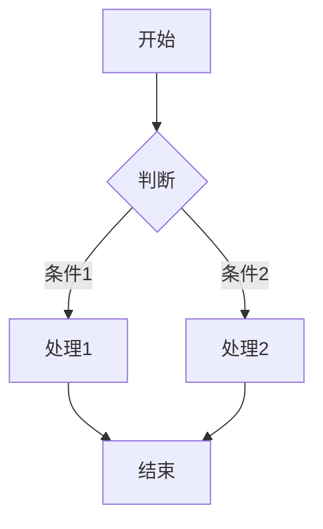
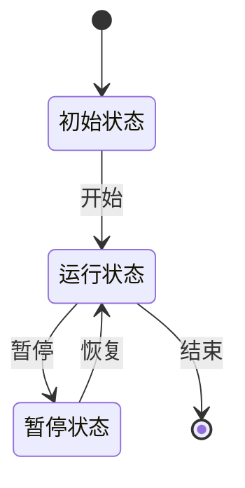
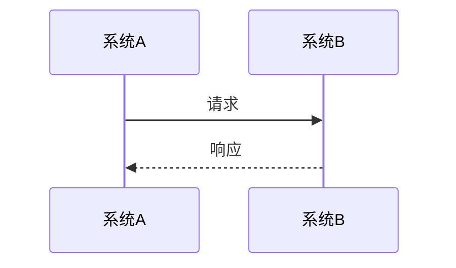

# FormalScience 文档规范化指南

---

📌 **内容摘要**

本文档深入探讨FormalScience 文档规范化指南的核心原理和关键方法。内容涵盖其他领域的主要知识点，包括相关理论、方法及应用。适合有一定基础的学习者系统学习。

**关键词**: 其他

📚 **学习目标**
- 掌握FormalScience 文档规范化指南的核心概念和主要方法
- 理解相关理论的应用场景
- 建立该领域的系统性知识框架

🎯 **难度级别**: 中级

⏱️ **预计阅读时间**: 15分钟

**前置知识**: 相关领域的基础概念

---


> **文档版本**: 1.0.0
> **最后更新**: 2026-04-12
> **适用范围**: FormalScience 项目所有 Markdown 文档

---

## 目录

1. [命名规范](#命名规范)
2. [格式规范](#格式规范)
3. [内容规范](#内容规范)
4. [链接规范](#链接规范)

---

## 命名规范

### 文件命名

#### 基本原则

| 规则 | 说明 | 示例 |
|------|------|------|
| **小写优先** | 文件名使用小写字母 | `document_guide.md` ✓ `Document_Guide.MD` ✗ |
| **单词分隔** | 使用连字符 `-` 或下划线 `_` | `style-guide.md` 或 `style_guide.md` |
| **语义明确** | 文件名反映内容主题 | `recursion-theory.md` ✓ `doc1.md` ✗ |
| **版本标识** | 必要时添加版本号 | `api-guide-v2.md` |
| **避免特殊字符** | 不使用空格、中文标点 | `user-guide.md` ✓ `user guide.md` ✗ |

#### 编号体系

**章节文件命名**:

```
XX.YY_章节名称.md

示例:
01_概述.md
02.1_基本定义.md
02.2_核心定理.md
03_实践应用.md
```

**深度专题命名**:

```
【专题类型】_专题名称.md

示例:
【深度专题】_类型系统高级理论.md
【案例研究】_区块链共识算法.md
【批判性反思】_递归的本体论地位.md
```

#### 目录结构命名

```
project-root/
├── README.md                    # 项目根文档
├── docs/
│   ├── README.md                # 文档目录索引
│   ├── guide/                   # 指南类文档
│   ├── reference/               # 参考类文档
│   └── Refactor/                # 重构相关工作
│       ├── .templates/          # 文档模板（隐藏目录）
│       └── docs/                # 重构指南
├── Concept/                     # 概念视角文档
│   ├── README.md
│   ├── 01_核心理论/
│   │   ├── 01.1_子章节.md
│   │   └── README.md
│   └── 02_应用实践/
├── Composed/                    # 综合视角文档
├── FormalRE/                    # FormalRE 模块
└── tools/                       # 工具脚本
```

---

### 章节编号

#### 编号规则

| 层级 | 格式 | 示例 | 说明 |
|------|------|------|------|
| **一级** | `## N.` | `## 1. 概述` | 主要章节 |
| **二级** | `## N.M` | `## 1.1 背景` | 子章节 |
| **三级** | `### N.M.K` | `### 1.1.1 动机` | 细分内容 |
| **四级** | `####` | `#### 具体要点` | 不建议再细分 |

#### 编号示例

```markdown
## 1. 概述 {#概述}

### 1.1 背景 {#背景}

#### 1.1.1 历史发展

#### 1.1.2 现状分析

### 1.2 目标 {#目标}

## 2. 理论体系 {#理论体系}

### 2.1 形式化定义 {#形式化定义}

### 2.2 核心定理 {#核心定理}
```

#### 锚点命名

每个主要章节应添加锚点，便于交叉引用：

```markdown
## 3. 实践应用 {#实践应用}          ← 添加锚点

### 3.1 案例研究 {#案例研究}        ← 子章节锚点
```

锚点命名规则：

- 使用小写字母
- 使用连字符分隔单词
- 与章节标题语义一致
- 唯一性保证

---

## 格式规范

### Markdown 标准

#### 基础语法

| 元素 | 标准写法 | 示例 |
|------|----------|------|
| **标题** | `#` 后加空格 | `# 一级标题` |
| **列表** | `-` 或 `*` 后加空格 | `- 列表项` |
| **有序列表** | `1.` 后加空格 | `1. 第一项` |
| **代码块** | 三个反引号 + 语言 | ` ```python ` |
| **行内代码** | 单个反引号包裹 | `` `code` `` |
| **粗体** | 两个星号 | `**粗体**` |
| **斜体** | 一个星号 | `*斜体*` |
| **引用** | `>` 后加空格 | `> 引用内容` |
| **分隔线** | 三个连字符 | `---` |

#### 格式检查清单

- [ ] 标题 `#` 后有空格
- [ ] 列表符号后有空格
- [ ] 代码块指定语言
- [ ] 行内代码不过长
- [ ] 表格列对齐
- [ ] 中英文之间有空格

---

### LaTeX 公式

#### 行内公式

使用单个美元符号 `$...$`：

```markdown
递归函数定义为 $f(n) = f(n-1) + f(n-2)$，其中 $n \geq 2$。
```

**规范**:

- 公式前后加空格
- 使用标准LaTeX语法
- 避免过长行内公式

#### 块级公式

使用双美元符号 `$$...$$`：

```markdown
$$
\forall x \in X, \exists y \in Y : P(x, y) \implies Q(x)
$$
```

**规范**:

- 单独成行
- 重要公式添加编号
- 复杂公式使用对齐环境

#### 高级公式示例

```markdown
$$
\begin{aligned}
f(n) &= \begin{cases}
0 & \text{if } n = 0 \\
1 & \text{if } n = 1 \\
f(n-1) + f(n-2) & \text{if } n > 1
\end{cases} \\
&= \sum_{i=0}^{n} \binom{n-i}{i}
\end{aligned}
\tag{1}
$$
```

#### 公式检查清单

- [ ] 括号成对出现
- [ ] 下标 `_{}` 和花括号完整
- [ ] 特殊符号正确转义
- [ ] 公式可渲染
- [ ] 复杂公式有注释

---

### Mermaid 图表

#### 流程图

```markdown


```

**规范**:
- 使用标准Mermaid语法
- 节点命名语义化
- 添加样式区分关键节点
- 复杂图分层次组织

#### 状态机

```markdown


```

#### 时序图

```markdown


```

#### 图表检查清单

- [ ] 语法正确可渲染
- [ ] 节点命名清晰
- [ ] 颜色区分层次
- [ ] 有文字说明
- [ ] 不超出页面宽度

---

## 内容规范

### 形式化定义格式

#### 标准结构

```markdown
> **定义 X.Y** (定义名称)
>
> **前提**: 列出所有前提条件
>
> **定义**: 形式化定义内容
>
> $$\text{数学表达: } \forall x \in X, P(x)$$
>
> **说明**:
> - 条件1的解释
> - 条件2的解释
```

#### 定义模板

```markdown
#### 2.1.1 概念名称 {#概念名称}

> **定义 2.1** (概念名称)
>
> 给定：
> - 集合 $A$ (定义域)
> - 集合 $B$ (值域)
> - 关系 $R \subseteq A \times B$
>
> 概念 $C$ 定义为满足以下条件的最小集合：
> 1. **基础条件**: $C_0 \subseteq C$
> 2. **归纳条件**: 若 $x \in C$，则 $f(x) \in C$
> 3. **封闭条件**: $C$ 不包含其他元素
>
> **记法**: $C = \mu X.(C_0 \cup f(X))$
>
> **直观解释**: 用通俗语言解释定义含义
```

---

### 定理证明格式

#### 定理陈述

```markdown
> **定理 X.Y** (定理名称)
>
> **前提**:
> - 前提条件1
> - 前提条件2
>
> **结论**: 定理结论内容
>
> $$P \implies Q$$
>
> **重要性**: 解释定理的意义和应用价值
```

#### 证明结构

```markdown
**证明** [定理 X.Y]

1. **基础步骤**: 证明基本情况
   - 给定: $n = 0$
   - 需证: $P(0)$ 成立
   - 证明: 直接验证...
   - 结论: 基础情况成立

2. **归纳步骤**: 归纳假设并推导
   - 归纳假设: 假设 $P(n)$ 成立
   - 需证: $P(n+1)$ 成立
   - 推导:
     ```
     P(n+1) = ... (定义展开)
            = ... (归纳假设)
            = ... (代数变形)
            = ... (结论)
     ```
   - 结论: 归纳步骤成立

3. **总结**: 由数学归纳法，定理得证 ∎
```

#### 证明技巧参考

| 技巧 | 适用场景 | 模板 |
|------|----------|------|
| 数学归纳法 | 递归结构、序列 | `对$n$归纳：基础步骤...归纳步骤...` |
| 反证法 | 否定性结论 | `假设结论不成立，推出矛盾...` |
| 构造法 | 存在性证明 | `构造具体实例$x = ...$，验证...` |
| 对角线法 | 不可数性 | `假设可枚举，构造不在列表中的元素...` |
| 鸽巢原理 | 存在性证明 | `有$n+1$个对象放入$n$个盒子...` |

---

### 内容质量检查清单

#### 完整性检查

- [ ] 文档有明确的主题和定位
- [ ] 包含概述章节
- [ ] 理论体系完整（定义→定理→证明）
- [ ] 有实践应用或示例
- [ ] 有总结或关联网络

#### 准确性检查

- [ ] 数学公式正确
- [ ] 引用来源准确
- [ ] 术语使用一致
- [ ] 逻辑推导严密
- [ ] 没有事实性错误

#### 可读性检查

- [ ] 语言简洁明了
- [ ] 段落长度适中
- [ ] 有适当的视觉分隔
- [ ] 代码/公式可理解
- [ ] 有必要的注释说明

---

## 链接规范

### 内部链接

#### 相对路径

```markdown
<!-- 同级目录 -->
[相关文档](./related-doc.md)

<!-- 上级目录 -->
[父文档](../parent-doc.md)

<!-- 子目录 -->
[子文档](./subfolder/child-doc.md)

<!-- 跨模块 -->
[其他模块](../../OtherModule/guide.md)
```

#### 锚点链接

```markdown
<!-- 链接到本文档的锚点 -->
[跳转到定义](#形式化定义)

<!-- 链接到其他文档的锚点 -->
[查看定义](../../Concept/theory.md#核心定义)
```

#### 链接检查清单

- [ ] 使用相对路径
- [ ] 路径大小写正确
- [ ] 锚点存在且准确
- [ ] 链接文本描述性强
- [ ] 没有死链

---

### 交叉引用

#### 引用格式

```markdown
<!-- 引用本文档内容 -->
如 [2.1 节](#形式化定义) 所述...

<!-- 引用其他文档 -->
根据 [形式化定义](../../Concept/formal.md) ...

<!-- 引用定理 -->
由 [定理 2.1](#核心定理) 可知...
```

#### 引用矩阵

在文档末尾添加引用矩阵：

```markdown
### 交叉引用矩阵

| 引用来源 | 引用内容 | 位置 |
|----------|----------|------|
| [docA.md](../a.md) | 定义 X.Y | 2.1 节 |
| [docB.md](../b.md) | 定理 Z.W | 3.2 节 |
```

---

### 外部链接

#### 学术引用

```markdown
 Smith, J. (2020). Title of Paper. Journal Name. [DOI](https://doi.org/xxx)
```

#### 资源链接

```markdown
- [官方文档](https://docs.example.com)
- [GitHub 仓库](https://github.com/user/repo)
- [在线工具](https://tool.example.com) (备用: [mirror](https://mirror.example.com))
```

#### 外部链接规范

- 使用HTTPS
- 添加描述性文本
- 重要资源提供备用链接
- 定期检查有效性

---

## 附录

### 快速参考

#### 文档头部模板

```markdown
---
topic: "主题名称"
dependencies: ["依赖1", "依赖2"]
status: "draft|review|complete"
author: "作者"
date: "2026-04-12"
version: "1.0.0"
tags: ["标签1", "标签2"]
category: "theory|practice|reference"
priority: "high|medium|low"
---

# 文档标题

> **文档定位**: 一句话描述
> **目标读者**: 读者群体描述
> **前置知识**: 所需基础知识
```

#### 常用符号表

| 符号 | Markdown | 含义 |
|------|----------|------|
| ∀ | `\forall` | 全称量词 |
| ∃ | `\exists` | 存在量词 |
| ∈ | `\in` | 属于 |
| ⊆ | `\subseteq` | 子集 |
| ∪ | `\cup` | 并集 |
| ∩ | `\cap` | 交集 |
| ⇒ | `\implies` | 蕴含 |
| ⇔ | `\iff` | 等价 |
| ∎ | `\qed` | 证毕 |

#### 命名速查

```
文件: lowercase-with-hyphens.md
章节: ## N. Title {#anchor-name}
锚点: lowercase-with-hyphens
图片: descriptive-name-v1.png
代码: descriptive_name.py
```

---

### 工具推荐

| 工具 | 用途 | 链接 |
|------|------|------|
| document_linter.py | 质量检查 | `../../tools/document_linter.py` |
| Markdown Lint | 格式检查 | VS Code 插件 |
| Mermaid Preview | 图表预览 | VS Code 插件 |
| LaTeX Workshop | 公式编辑 | VS Code 插件 |

---

**文档结束**

> 如有疑问或建议，请在项目讨论区提出。
