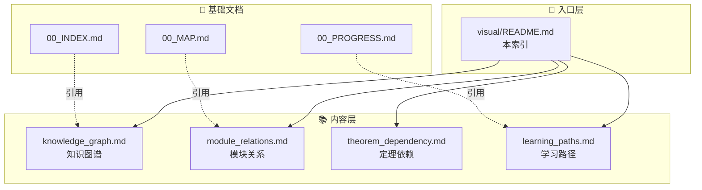
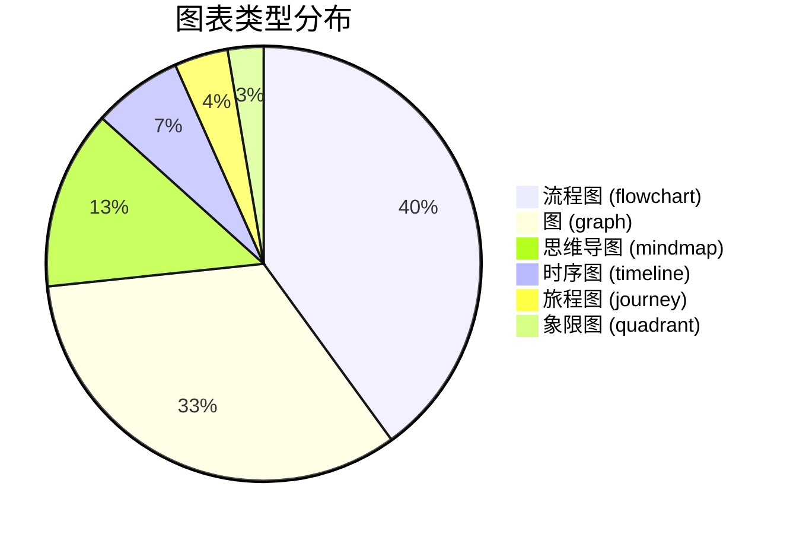

# FormalScience 可视化资源索引

> **项目**: FormalScience 形式科学知识库可视化中心
> **版本**: 1.0.0
> **最后更新**: 2026-04-11
> **图表总数**: 25+

---

## 📊 可视化文档概览

本文档汇总了 FormalScience 项目所有的可视化资源，提供统一入口和导航。

| 文档 | 图表类型 | 描述 | 适用场景 |
|------|----------|------|----------|
| [📈 知识图谱](knowledge_graph.md) | 概念关系图、依赖图、层次图 | 完整的概念网络与学习依赖 | 理解知识架构 |
| [🔧 模块关系图](module_relations.md) | 流程图、架构图、数据流图 | 8大模块间的引用与数据流 | 系统架构分析 |
| [📐 定理依赖图](theorem_dependency.md) | 依赖图、证明链、层次图 | 重要定理的证明依赖关系 | 深入理论研究 |
| [🎓 学习路径图](learning_paths.md) | 路线图、阶段图、里程碑 | 3条详细学习路径可视化 | 规划学习路线 |

---

## 🗺️ 可视化资源架构



---

## 📈 图表类型统计

### 按类型分类



### 按模块分类

| 模块 | 图表数量 | 主要图表 |
|------|----------|----------|
| 知识图谱 | 8 | 概念网络、层次结构、依赖关系 |
| 模块关系 | 6 | 架构图、数据流、引用关系 |
| 定理依赖 | 5 | 证明链、定理层次、引理网络 |
| 学习路径 | 6 | 路线图、阶段图、里程碑 |

---

## 🎯 使用指南

### 快速导航

#### 我需要理解知识架构

→ 查看 [知识图谱](knowledge_graph.md)

- 概念层次图
- 学习依赖关系
- 知识网络可视化

#### 我需要分析系统架构

→ 查看 [模块关系图](module_relations.md)

- 模块引用关系
- 数据流图
- 接口映射图

#### 我需要研究定理证明

→ 查看 [定理依赖图](theorem_dependency.md)

- 定理依赖链
- 证明结构图
- 关键引理标注

#### 我需要规划学习路线

→ 查看 [学习路径图](learning_paths.md)

- 阶段路线图
- 知识结构图
- 里程碑时间线

---

## 📋 详细内容清单

### 1. 知识图谱 (knowledge_graph.md)

**包含图表:**

| 图表编号 | 名称 | 类型 | 描述 |
|----------|------|------|------|
| KG-01 | 完整概念网络 | graph | 所有核心概念的关联关系 |
| KG-02 | 概念层次结构 | graph | 按抽象层次的分类 |
| KG-03 | 学习依赖图 | flowchart | 概念间的先修关系 |
| KG-04 | 形式科学全景图 | mindmap | 形式科学的知识体系 |
| KG-05 | 跨领域连接图 | graph | 不同领域间的桥梁概念 |

**交叉引用:**

- [00_MAP.md](../00_MAP.md) - 概念依赖关系
- [00_GLOSSARY.md](../00_GLOSSARY.md) - 术语定义
- [07_交叉视角/02_多视角映射](../07_交叉视角/02_多视角映射/) - 领域映射

---

### 2. 模块关系图 (module_relations.md)

**包含图表:**

| 图表编号 | 名称 | 类型 | 描述 |
|----------|------|------|------|
| MR-01 | 8大模块架构 | graph | 整体架构与层次 |
| MR-02 | 模块引用矩阵 | flowchart | 模块间的引用关系 |
| MR-03 | 数据流全景 | flowchart | 跨模块数据流 |
| MR-04 | 概念映射网络 | graph | 概念在不同模块的映射 |
| MR-05 | 接口依赖图 | graph | 模块接口的依赖关系 |

**交叉引用:**

- [00_INDEX.md](../00_INDEX.md) - 模块文件索引
- [07_交叉视角/01_形式化方法统一](../07_交叉视角/01_形式化方法统一/) - 统一框架

---

### 3. 定理依赖图 (theorem_dependency.md)

**包含图表:**

| 图表编号 | 名称 | 类型 | 描述 |
|----------|------|------|------|
| TD-01 | 核心定理依赖 | graph | 最重要定理的依赖关系 |
| TD-02 | 证明链可视化 | flowchart | 从公理到定理的证明链 |
| TD-03 | 引理网络 | graph | 关键引理及其关系 |
| TD-04 | 定理分类层次 | mindmap | 按领域的定理分类 |
| TD-05 | 证明复杂度图 | graph | 证明难度的可视化 |

**交叉引用:**

- [08_附录/03_索引/03.2_定理索引](../08_附录/03_索引/03.2_定理索引.md) - 定理清单
- [08_附录/02_符号表](../08_附录/02_符号表/) - 符号约定

---

### 4. 学习路径图 (learning_paths.md)

**包含图表:**

| 图表编号 | 名称 | 类型 | 描述 |
|----------|------|------|------|
| LP-01 | 形式化基础路径 | flowchart | 基础路线详细图示 |
| LP-02 | 编程语言理论路径 | flowchart | PLT路线详细图示 |
| LP-03 | 系统软件工程路径 | flowchart | 系统工程路线图示 |
| LP-04 | 路径对比矩阵 | quadrant | 路径复杂度vs价值 |
| LP-05 | 阶段里程碑 | timeline | 各阶段里程碑时间线 |
| LP-06 | 知识结构演进 | graph | 学习过程中的知识结构变化 |

**交叉引用:**

- [00_INDEX.md#学习路径推荐](../00_INDEX.md#学习路径推荐) - 路径概述
- [07_交叉视角/03_学习路线图](../07_交叉视角/03_学习路线图.md) - 详细路线

---

## 🔗 Mermaid 图表使用说明

### 支持的图表类型

本项目使用 [Mermaid](https://mermaid.js.org/) 语法创建图表，支持以下类型：

```mermaid
mindmap
  root((Mermaid图表))
    流程图
      flowchart LR
      flowchart TB
    图
      graph LR
      graph TB
    时序图
      timeline
    思维导图
      mindmap
    旅程图
      journey
    象限图
      quadrantChart
```

### 阅读提示

1. **交互式查看**: 使用支持 Mermaid 的 Markdown 阅读器（如 VS Code、GitHub）
2. **导出图片**: 可使用 Mermaid CLI 导出为 PNG/SVG
3. **编辑修改**: 复制代码块到 [Mermaid Live Editor](https://mermaid.live/) 在线编辑

---

## 📊 可视化最佳实践

### 图表设计原则


### 颜色约定

| 颜色 | 含义 | 使用场景 |
|------|------|----------|
| 🔵 蓝色 (#e3f2fd) | 基础/入口 | 起点、基础概念 |
| 🟢 绿色 (#e8f5e9) | 完成/成功 | 已掌握、完成状态 |
| 🟡 黄色 (#fff3e0) | 注意/进行 | 进行中、警告 |
| 🔴 红色 (#ffebee) | 关键/重要 | 核心概念、重要定理 |
| 🟣 紫色 (#f3e5f5) | 高级/进阶 | 高级主题、研究前沿 |

---

## 🔄 更新与维护

### 更新日志

| 版本 | 日期 | 更新内容 |
|------|------|----------|
| 1.0.0 | 2026-04-11 | 初始版本，创建4个可视化文档 |

### 维护责任

- 新增图表时同步更新本索引
- 每季度检查交叉引用有效性
- 根据内容变化更新图表

---

## 📚 相关资源

### 内部文档

- [00_INDEX.md](../00_INDEX.md) - 主索引
- [00_MAP.md](../00_MAP.md) - 知识地图
- [00_GLOSSARY.md](../00_GLOSSARY.md) - 术语表
- [00_PROGRESS.md](../00_PROGRESS.md) - 进度追踪

### 外部工具

- [Mermaid 文档](https://mermaid.js.org/intro/)
- [Mermaid Live Editor](https://mermaid.live/)
- [Markdown 指南](https://www.markdownguide.org/)

---

**导航**: [⬆️ 返回顶部](#formalscience-可视化资源索引) | [📈 知识图谱](knowledge_graph.md) | [🔧 模块关系](module_relations.md) | [📐 定理依赖](theorem_dependency.md) | [🎓 学习路径](learning_paths.md)
