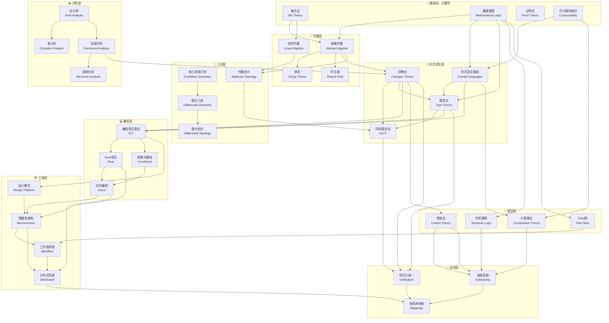
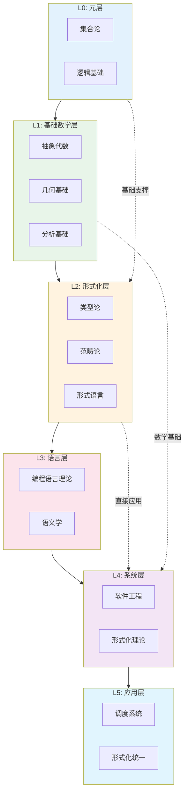
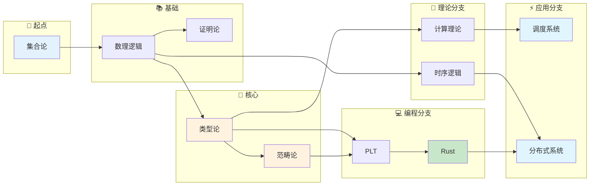
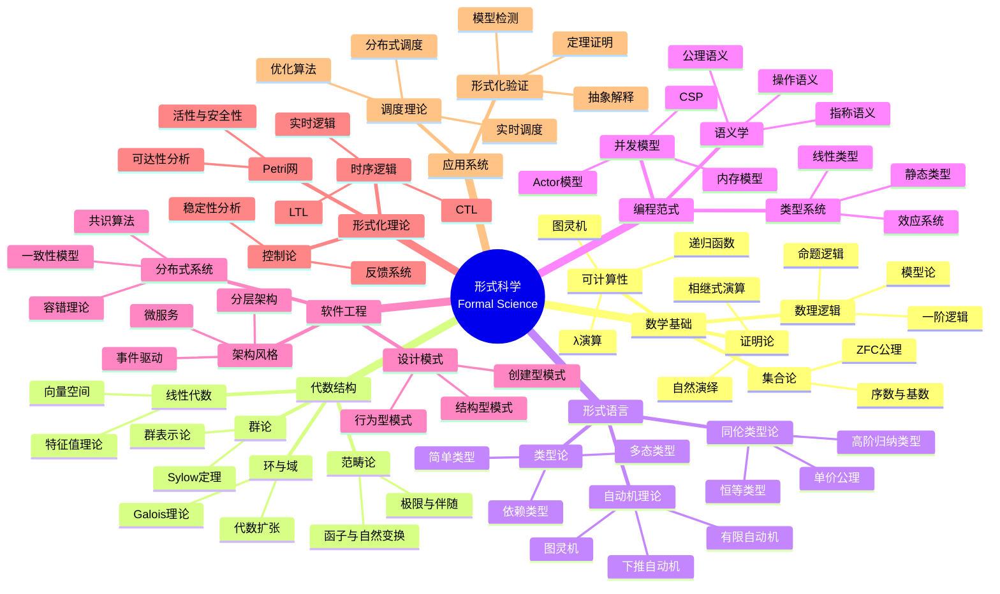
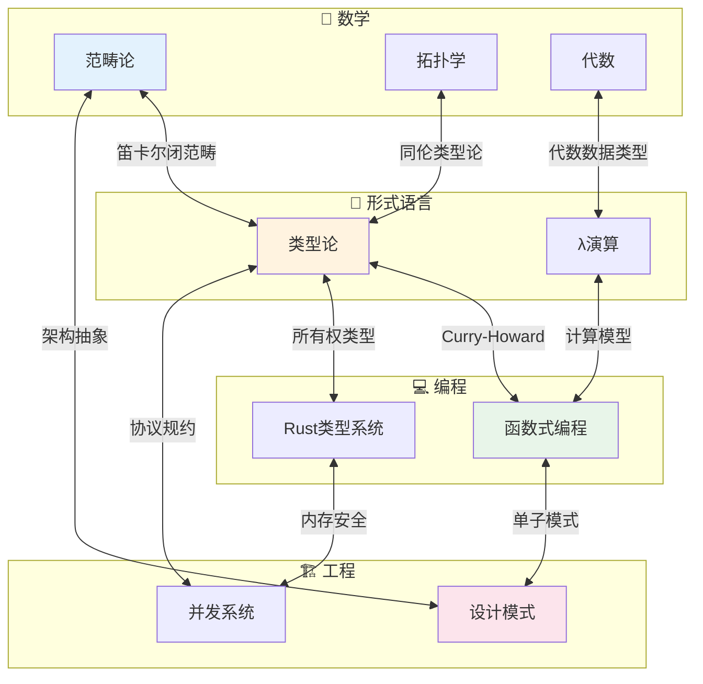
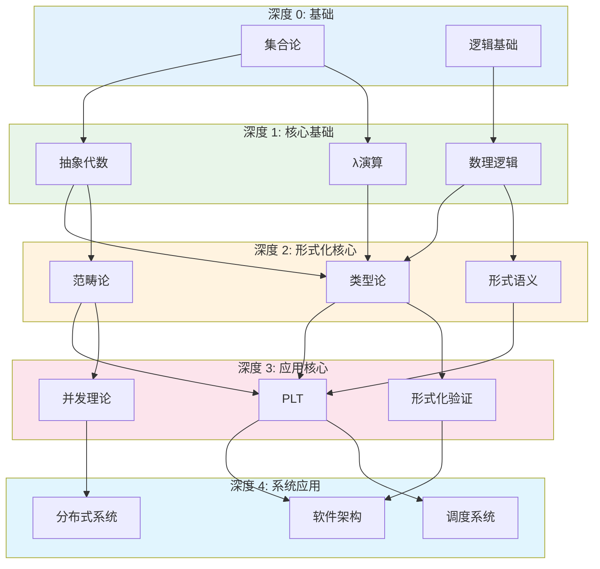
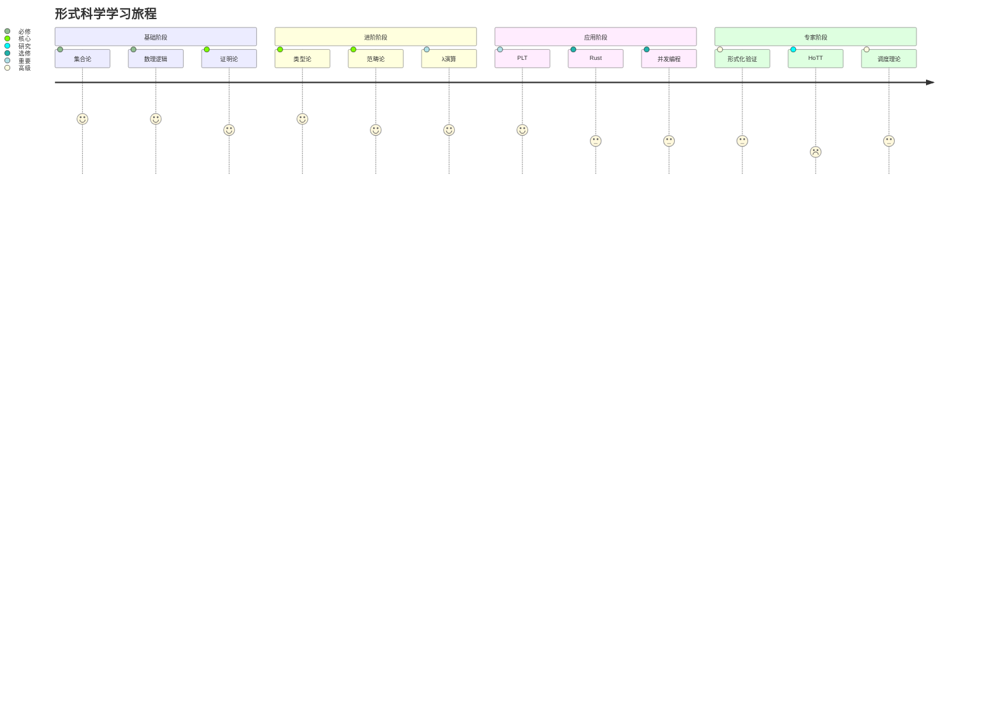
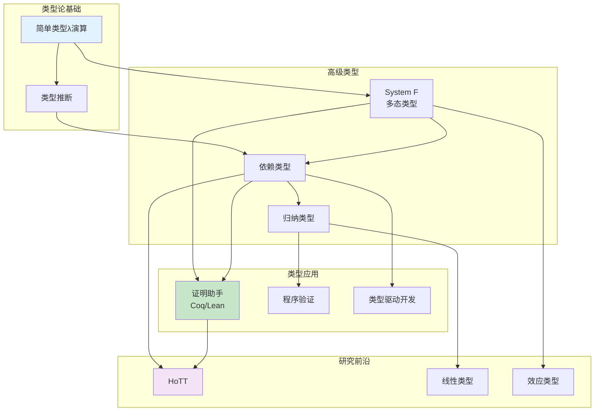
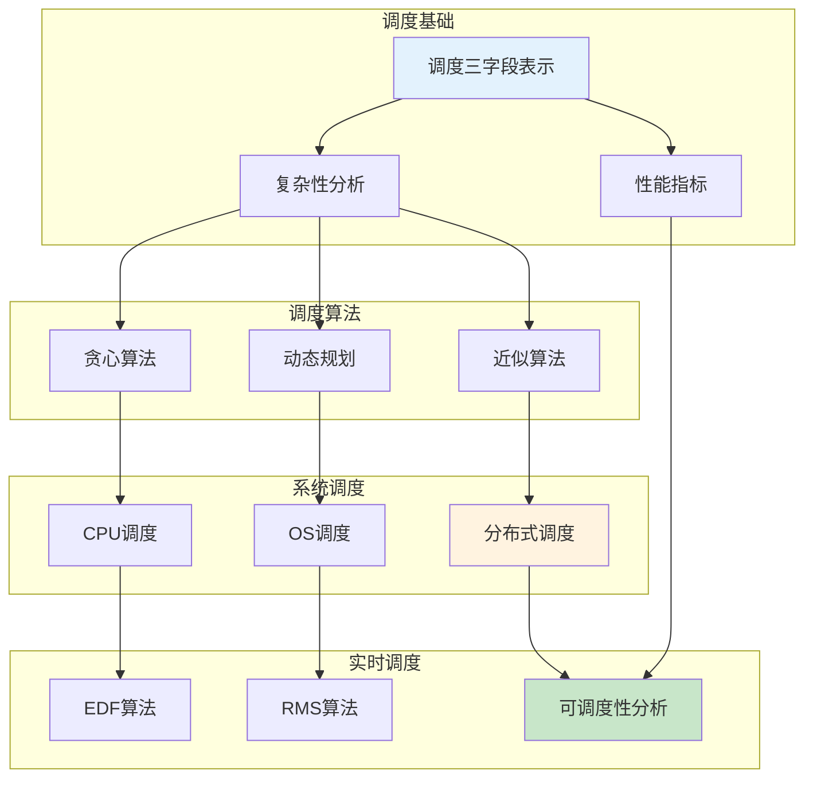
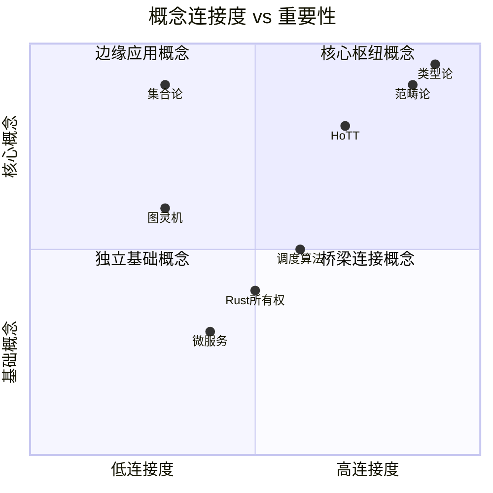

# FormalScience 知识图谱

> **项目**: FormalScience 形式科学概念关系可视化
> **版本**: 1.0.0
> **最后更新**: 2026-04-11
> **图表总数**: 8

---

## 1. 完整概念网络

### 1.1 形式科学全景图

**说明**: 本图展示了 FormalScience 项目中所有核心概念及其依赖关系。箭头表示知识依赖方向（先修关系）。

---

### 1.2 概念层次结构

---

## 2. 概念间依赖关系

### 2.1 核心依赖路径

---

### 2.2 形式科学知识树

---

### 2.3 跨领域连接

---

## 3. 学习路径可视化

### 3.1 知识依赖深度图

---

### 3.2 学习进度追踪图

---

## 4. 领域专题图

### 4.1 类型论知识图谱

---

### 4.2 调度理论知识图谱

---

## 5. 知识网络统计

### 5.1 概念连接度分析

### 5.2 知识密度分布

| 领域 | 概念数量 | 连接数 | 密度 |
|------|----------|--------|------|
| 形式语言 | 25 | 68 | 高 |
| 数学基础 | 20 | 45 | 中 |
| 编程范式 | 18 | 52 | 高 |
| 软件工程 | 15 | 38 | 中 |
| 形式化理论 | 12 | 28 | 中 |
| 调度系统 | 10 | 24 | 低 |

---

## 交叉引用

### 相关文档

- [00_MAP.md](../00_MAP.md) - 知识地图与依赖关系
- [00_INDEX.md](../00_INDEX.md) - 完整文档索引
- [00_GLOSSARY.md](../00_GLOSSARY.md) - 术语定义
- [module_relations.md](module_relations.md) - 模块关系图
- [learning_paths.md](learning_paths.md) - 学习路径可视化

### 概念定义索引

| 概念 | 定义位置 | 相关定理 |
|------|----------|----------|
| 类型论 | [02_形式语言/02_类型论](../02_形式语言/02_类型论/) | Curry-Howard同构 |
| 范畴论 | [02_形式语言/04_范畴论](../02_形式语言/04_范畴论/) | Yoneda引理 |
| HoTT | [02_形式语言/03_同伦类型论](../02_形式语言/03_同伦类型论_HoTT/) | 单价公理 |
| 调度理论 | [06_调度系统](../06_调度系统/) | EDF最优性 |

---

**导航**: [⬆️ 返回顶部](#formalscience-知识图谱) | [📊 索引](README.md) | [🔧 模块关系](module_relations.md) | [📐 定理依赖](theorem_dependency.md) | [🎓 学习路径](learning_paths.md)
