# FormalScience 学习路径可视化

> **项目**: FormalScience 3条学习路径详细图示
> **版本**: 1.0.0
> **最后更新**: 2026-04-11
> **图表总数**: 6

---

## 1. 路径一：形式化基础路线

### 1.1 路径总览

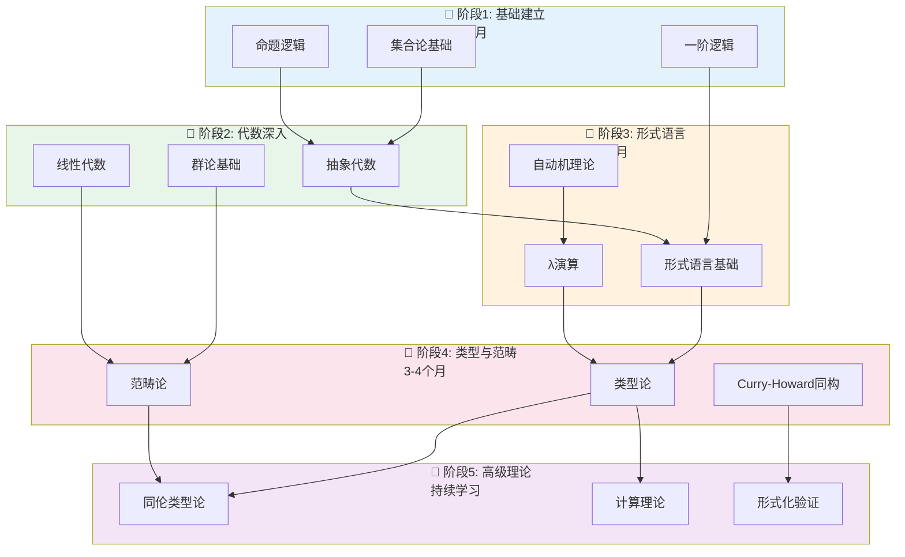

---

### 1.2 路径详细知识结构

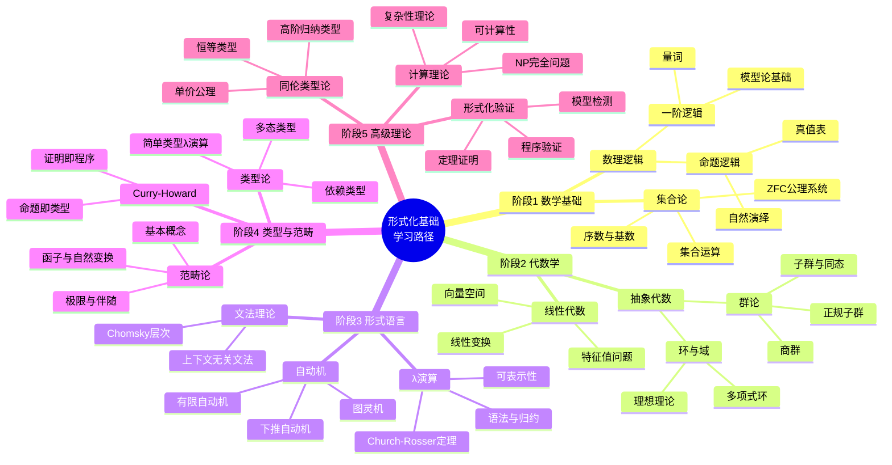

---

### 1.3 里程碑时间线

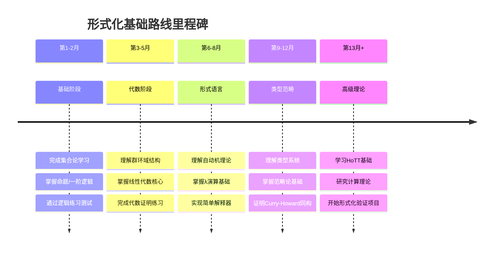

---

## 2. 路径二：编程语言理论路线

### 2.1 路径总览

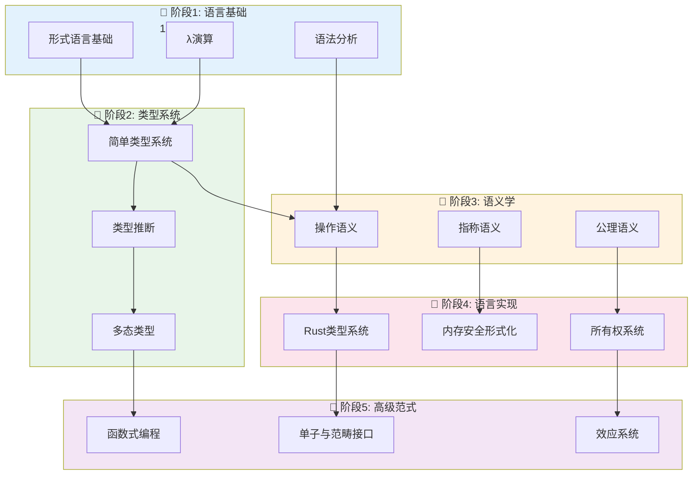

---

### 2.2 知识结构演进

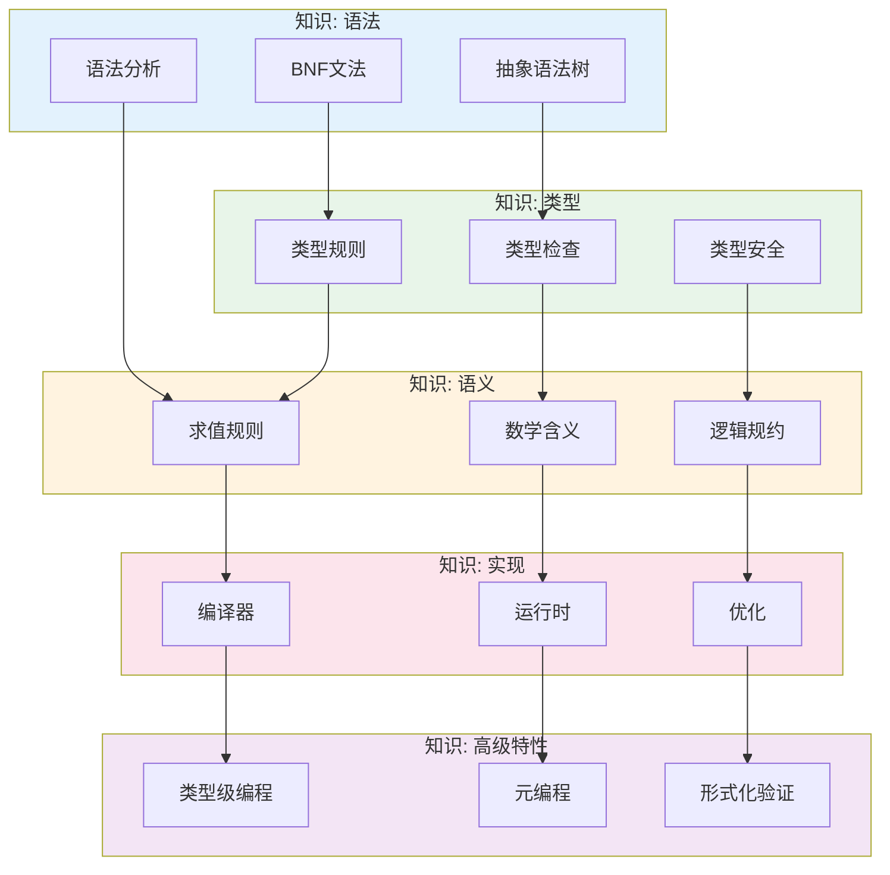

---

### 2.3 实践项目递进

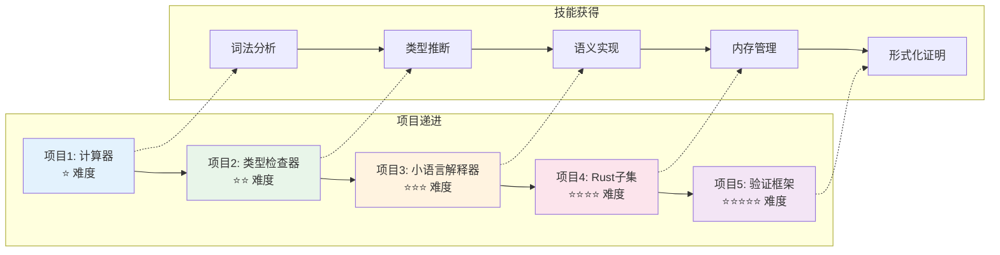

---

## 3. 路径三：系统软件工程路线

### 3.1 路径总览

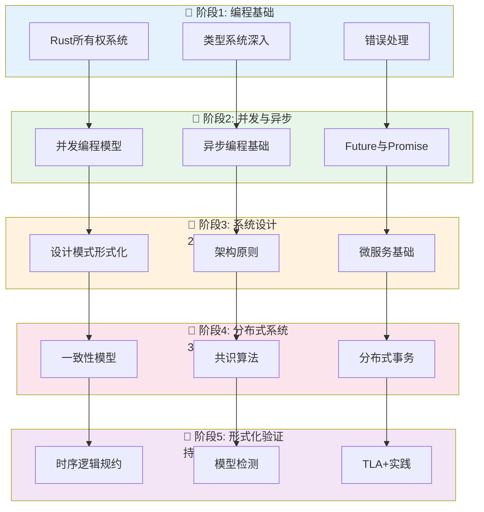

---

### 3.2 系统能力金字塔

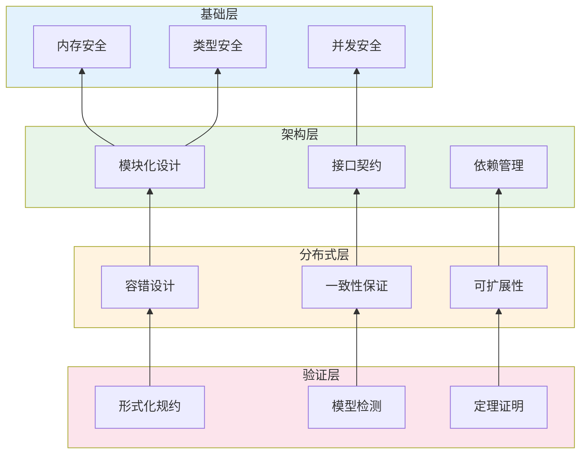

---

### 3.3 工程实践路径

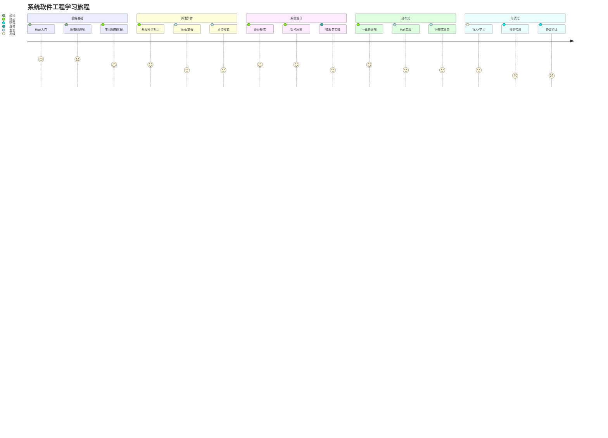

---

## 4. 路径对比与选择

### 4.1 路径复杂度vs价值矩阵

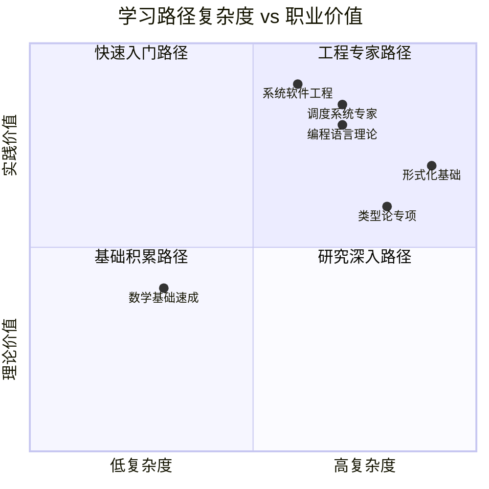

---

### 4.2 路径技能覆盖

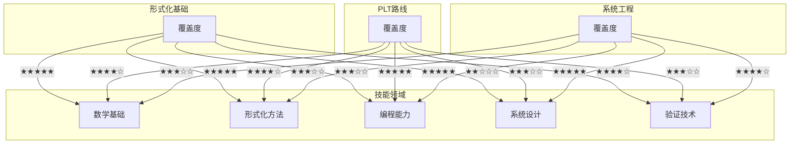

---

## 5. 学习里程碑

### 5.1 统一里程碑时间线

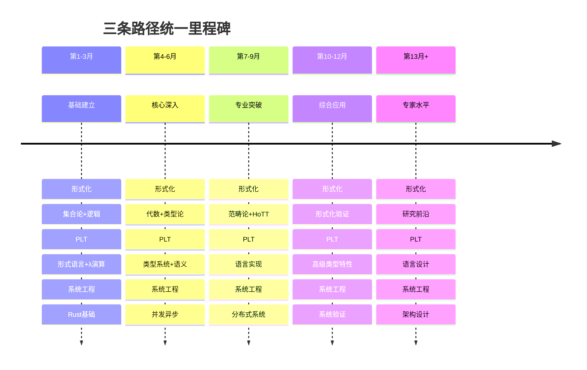

---

### 5.2 阶段检查清单

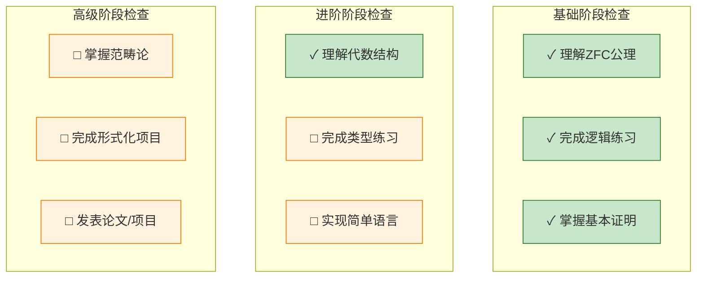

---

## 6. 个性化路径推荐

### 6.1 基于背景的推荐

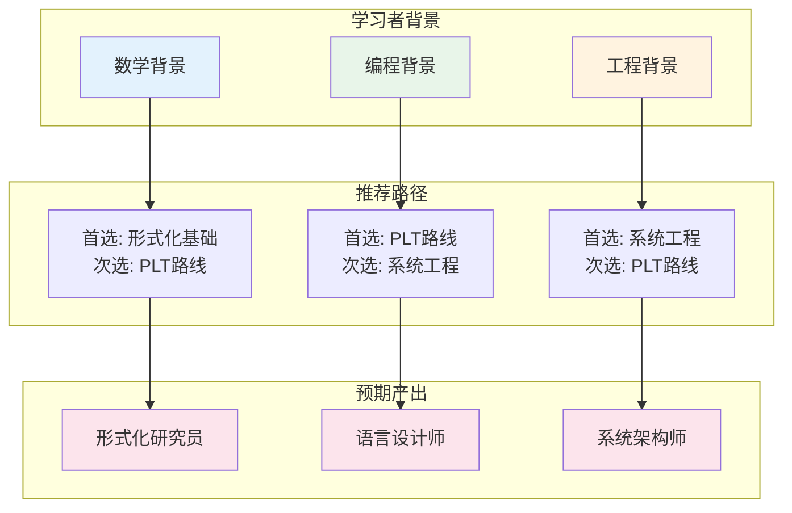

---

### 6.2 学习资源地图

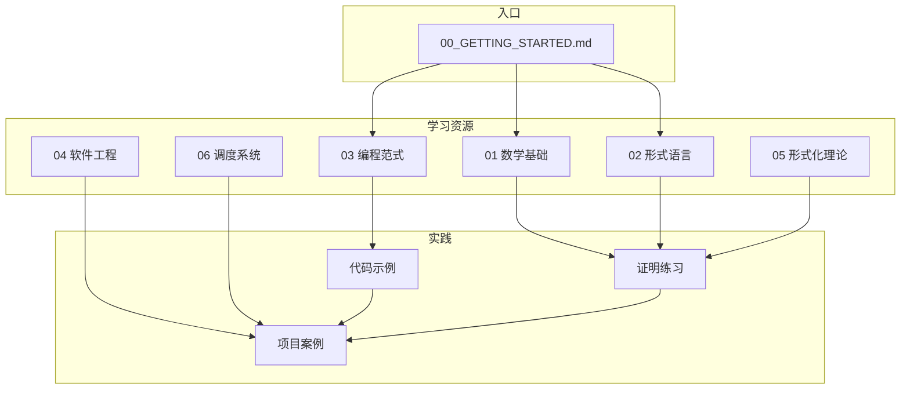

---

## 交叉引用

### 相关文档

- [00_INDEX.md](../00_INDEX.md) - 完整文档索引
- [00_MAP.md](../00_MAP.md) - 知识地图
- [07_交叉视角/03_学习路线图](../07_交叉视角/03_学习路线图.md) - 详细学习路线
- [knowledge_graph.md](knowledge_graph.md) - 知识图谱
- [module_relations.md](module_relations.md) - 模块关系

### 按路径推荐阅读

| 路径 | 必读文档 | 参考文档 |
|------|----------|----------|
| 形式化基础 | [01_数学基础](../01_数学基础/), [02_形式语言](../02_形式语言/) | [05_形式化理论](../05_形式化理论/) |
| PLT路线 | [02_形式语言](../02_形式语言/), [03_编程范式](../03_编程范式/) | [04_软件工程](../04_软件工程/) |
| 系统工程 | [03_编程范式](../03_编程范式/), [04_软件工程](../04_软件工程/) | [06_调度系统](../06_调度系统/) |

---

**导航**: [⬆️ 返回顶部](#formalscience-学习路径可视化) | [📊 索引](README.md) | [🗺️ 知识图谱](knowledge_graph.md) | [🔧 模块关系](module_relations.md) | [📐 定理依赖](theorem_dependency.md)
